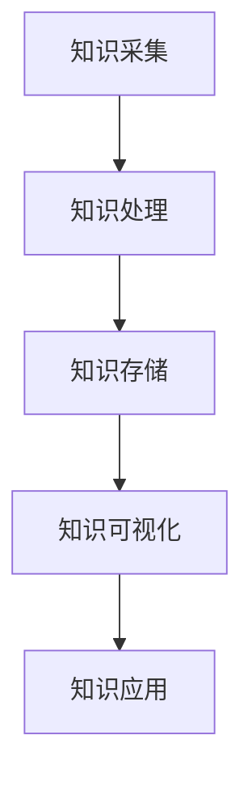
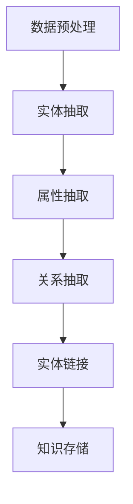

                 

# 个人知识图谱构建工具：知识管理的技术创新

## 关键词：个人知识图谱，知识管理，技术工具，人工智能，创新

## 摘要

本文将深入探讨个人知识图谱构建工具的发展及其在知识管理领域的技术创新。通过对知识图谱的核心概念、关键算法、数学模型及应用场景的详细分析，本文旨在为读者提供全面的指导，帮助理解如何构建个人知识图谱，以实现高效的知识管理。此外，文章还将推荐相关学习资源、开发工具和论文著作，以进一步拓展读者的知识视野。最后，文章将对知识图谱构建工具的未来发展趋势和面临的挑战进行总结，为该领域的研究者和开发者提供有益的参考。

## 1. 背景介绍

在信息爆炸的时代，知识管理成为企业和个人提升竞争力的关键。然而，如何有效地组织和利用海量信息，实现知识的共享、传递和创新，成为亟待解决的重要问题。个人知识图谱构建工具应运而生，成为知识管理领域的重要技术创新。

知识图谱作为一种结构化知识表示方法，通过实体、属性和关系三个核心要素，将分散的知识点有机地连接起来，形成一张巨大的知识网络。个人知识图谱构建工具则专注于为个人用户提供定制化的知识图谱构建服务，帮助用户实现对个人知识的系统化、结构化和智能化管理。

随着人工智能技术的不断发展，知识图谱构建工具逐渐从传统的手工构建方式转向自动化、智能化方向。大数据、自然语言处理、图计算等技术的融合，使得个人知识图谱构建工具在数据采集、处理和分析等方面取得了显著进展。本文将围绕这些核心主题，详细探讨个人知识图谱构建工具的技术创新和应用。

## 2. 核心概念与联系

### 2.1 知识图谱概述

知识图谱（Knowledge Graph）是一种用于结构化知识表示的方法，通过实体、属性和关系三个核心要素，将现实世界中的知识点和概念有机地连接起来，形成一张巨大的知识网络。实体是知识图谱中的基本单位，如人、地点、事物等；属性描述实体的特征，如年龄、身高、地点的经纬度等；关系则表示实体之间的相互联系，如朋友、工作地点、属于等。

知识图谱与传统的关系型数据库、搜索引擎和文本分类等相比，具有以下优势：

- **结构化知识表示**：知识图谱通过实体、属性和关系的结构化表示，使得知识易于理解和分析。
- **高效查询**：知识图谱支持基于图的图查询算法，可以快速地查找实体之间的关系和属性。
- **知识推理**：知识图谱中的关系和属性可以用于推理和发现新的知识，支持基于图谱的智能问答和知识发现。

### 2.2 个人知识图谱

个人知识图谱是对个人知识体系进行结构化表示的一种方式，它涵盖了个人在专业领域、兴趣爱好、社交网络等方面的知识。与通用知识图谱相比，个人知识图谱更加注重个性化、定制化和实用性。

#### 2.2.1 构建个人知识图谱的必要性

1. **高效知识管理**：个人知识图谱可以帮助用户系统化地整理和分类知识，提高知识检索和利用的效率。
2. **知识共享与传递**：个人知识图谱为知识的共享和传递提供了便捷的途径，有助于实现知识的传播和创新。
3. **知识挖掘与应用**：通过对个人知识图谱的分析，可以发现潜在的知识关联和规律，为个人学习和成长提供支持。

#### 2.2.2 个人知识图谱的核心要素

1. **个人知识实体**：包括个人的学习经验、工作经历、科研成果、兴趣爱好等。
2. **知识属性**：描述知识实体的属性，如时间、地点、关键词等。
3. **知识关系**：表示知识实体之间的关联，如知识来源、知识应用场景、知识依赖关系等。

### 2.3 个人知识图谱构建工具

个人知识图谱构建工具是用于帮助个人用户构建和优化个人知识图谱的软件或平台。这些工具通常具备以下功能：

1. **知识采集**：从各种来源（如文献、网页、数据库等）中自动或半自动地采集知识。
2. **知识处理**：对采集到的知识进行清洗、分类、标注等处理，提高知识的质量和准确性。
3. **知识存储**：将处理后的知识存储在图数据库或其他结构化存储系统中，便于后续查询和分析。
4. **知识可视化**：通过图形化的方式展示个人知识图谱，帮助用户直观地理解和分析知识结构。
5. **知识应用**：基于个人知识图谱提供个性化推荐、知识问答、知识挖掘等服务，支持用户的知识管理和应用。

### 2.4 Mermaid 流程图

下面是一个简单的 Mermaid 流程图，展示了个人知识图谱构建的基本流程：



在上述流程中，知识采集是构建个人知识图谱的基础，通过从多种来源获取知识，为后续的处理和分析提供数据支持。知识处理包括数据清洗、分类、标注等步骤，旨在提高知识的质量和准确性。知识存储则是将处理后的知识存储在图数据库或其他结构化存储系统中，便于后续查询和分析。知识可视化和知识应用则是对个人知识图谱的展示和利用，帮助用户更好地管理和利用知识。

通过上述核心概念和流程的介绍，我们可以更深入地理解个人知识图谱构建工具在知识管理领域的重要作用和技术创新。

### 3. 核心算法原理 & 具体操作步骤

#### 3.1. 知识图谱构建算法原理

知识图谱构建的核心在于实体、属性和关系的抽取与关联。以下介绍几种常用的算法原理：

##### 3.1.1 实体抽取

实体抽取是指从非结构化数据中识别出实体，并将其转化为知识图谱中的实体。常用的实体抽取算法有：

- **命名实体识别（NER）**：基于自然语言处理技术，通过训练模型识别文本中的命名实体，如人名、地名、组织机构等。
- **关键词提取**：通过统计文本中的高频词汇和短语，识别出可能具有实体特征的词汇。

##### 3.1.2 属性抽取

属性抽取是指从实体中提取出描述其特征的属性。常用的属性抽取算法有：

- **模式匹配**：通过预定义的规则，从文本中匹配出实体的属性。
- **基于机器学习的方法**：利用监督学习或无监督学习方法，从数据中学习出属性抽取的规律。

##### 3.1.3 关系抽取

关系抽取是指从文本中识别出实体之间的相互关系。常用的关系抽取算法有：

- **基于规则的方法**：通过预定义的规则，从文本中匹配出实体之间的关系。
- **基于统计的方法**：利用统计模型，从数据中学习出实体关系抽取的规律。

##### 3.1.4 实体链接

实体链接是指将同一实体的不同名称或别名进行映射和关联。常用的实体链接算法有：

- **基于关键词的方法**：通过文本相似度计算，将具有相似属性的实体进行链接。
- **基于图谱的方法**：通过知识图谱中的实体和关系，利用图匹配算法进行实体链接。

#### 3.2. 知识图谱构建的具体操作步骤

以下是一个简单的知识图谱构建流程，包括数据预处理、实体抽取、属性抽取、关系抽取和实体链接等步骤：

##### 3.2.1 数据预处理

1. **文本清洗**：去除文本中的无关信息，如HTML标签、停用词等。
2. **分词**：将文本切分成单词或短语。
3. **词性标注**：对文本中的单词进行词性标注，如名词、动词、形容词等。

##### 3.2.2 实体抽取

1. **命名实体识别**：利用NER算法，识别出文本中的命名实体。
2. **关键词提取**：从文本中提取出具有实体特征的词汇。

##### 3.2.3 属性抽取

1. **模式匹配**：利用预定义的规则，从文本中匹配出实体的属性。
2. **基于机器学习的方法**：利用监督学习或无监督学习方法，从数据中学习出属性抽取的规律。

##### 3.2.4 关系抽取

1. **基于规则的方法**：利用预定义的规则，从文本中匹配出实体之间的关系。
2. **基于统计的方法**：利用统计模型，从数据中学习出实体关系抽取的规律。

##### 3.2.5 实体链接

1. **基于关键词的方法**：通过文本相似度计算，将具有相似属性的实体进行链接。
2. **基于图谱的方法**：通过知识图谱中的实体和关系，利用图匹配算法进行实体链接。

##### 3.2.6 知识存储

将处理后的实体、属性和关系存储在图数据库或其他结构化存储系统中，便于后续查询和分析。

通过上述步骤，我们可以构建出个人知识图谱，实现对个人知识的系统化、结构化和智能化管理。以下是一个简单的 Mermaid 流程图，展示了知识图谱构建的具体操作步骤：



通过上述算法原理和具体操作步骤的介绍，我们可以更好地理解个人知识图谱构建工具的工作机制和实现方法。

### 4. 数学模型和公式 & 详细讲解 & 举例说明

#### 4.1 实体抽取的数学模型

实体抽取是知识图谱构建的重要步骤，其核心在于从非结构化文本中识别出实体。以下介绍一种基于条件随机场（Conditional Random Field，CRF）的实体抽取模型。

##### 4.1.1 CRF模型原理

CRF是一种广泛应用于序列标注问题的概率模型。在实体抽取中，CRF模型通过考虑当前单词与其前一个单词之间的依赖关系，对每个单词进行实体标注。

设句子\( x = (x_1, x_2, ..., x_T) \)是待标注的文本，其中\( x_t \)表示第\( t \)个单词。实体标签集合为\( Y = \{y_1, y_2, ..., y_n\} \)，其中\( y_i \)表示第\( i \)个实体类别。CRF模型的目标是找到一个标签序列\( \hat{y} = (\hat{y}_1, \hat{y}_2, ..., \hat{y}_T) \)，使得它在给定句子\( x \)下的概率最大：

\[ P(\hat{y} | x) = \arg\max_{y} P(y | x) \]

##### 4.1.2 CRF模型公式

CRF模型可以通过最大化下式得到：

\[ \log P(\hat{y} | x) = \sum_{t=1}^{T} \log P(y_t | y_{<t}, x) + \sum_{(t,s) \in E} \log P(y_t y_s | y_{<t}, x) \]

其中，\( y_{<t} \)表示第\( t \)个单词之前的标签集合，\( E \)表示所有相邻单词的标签对。

- **单步转移概率**：\( P(y_t | y_{<t}, x) \)表示在给定上下文\( x \)下，第\( t \)个单词的标签依赖于其前一个单词标签的概率。
- **状态转移概率**：\( P(y_t y_s | y_{<t}, x) \)表示在给定上下文\( x \)下，第\( t \)和第\( s \)个单词的标签同时发生的概率。

##### 4.1.3 举例说明

假设有一个简单的句子：“张三在北京工作”。我们使用CRF模型对其进行实体抽取，标签集合为\( \{人名，地点，工作\} \)。以下是部分单词的标注：

\[ x = (\text{张三，北京，工作}) \]
\[ \hat{y} = (\text{人名，地点，工作}) \]

在训练过程中，我们可以通过大量已标注的数据，学习得到CRF模型中的参数。例如，对于“张三”和“北京”，我们得到以下转移概率：

\[ P(\text{地点} | \text{人名}) = 0.8 \]
\[ P(\text{工作} | \text{地点}) = 0.6 \]

根据这些概率，CRF模型可以推断出句子中每个单词的最可能标签，从而实现实体抽取。

#### 4.2 属性抽取的数学模型

属性抽取是知识图谱构建中的另一个重要步骤，其核心在于从实体中识别出描述其特征的属性。以下介绍一种基于监督学习的属性抽取模型。

##### 4.2.1 基于监督学习的方法

基于监督学习的属性抽取模型通过训练大量标注数据，学习得到实体和属性之间的映射关系。常见的监督学习方法有支持向量机（SVM）、朴素贝叶斯（Naive Bayes）、决策树等。

设实体集合为\( E \)，属性集合为\( A \)，训练数据集合为\( D = \{ (e_i, a_i) | e_i \in E, a_i \in A \} \)，其中\( (e_i, a_i) \)表示第\( i \)个实体和其对应的属性。模型的目标是学习一个映射函数\( f_e(e) \)，将实体映射到其属性：

\[ f_e(e) = \arg\max_{a} P(a | e) \]

##### 4.2.2 举例说明

假设我们有以下训练数据：

\[ D = \{ (\text{张三，北京}, \text{城市}) , (\text{李四，上海}, \text{城市}) , (\text{张三，程序员}, \text{职业}) , (\text{李四，医生}, \text{职业}) \} \]

通过训练，我们可以学习得到实体和属性之间的概率分布。例如，对于“张三”，我们得到以下概率分布：

\[ P(\text{城市} | \text{张三}) = 0.7 \]
\[ P(\text{职业} | \text{张三}) = 0.3 \]

根据这些概率分布，模型可以推断出“张三”的最可能属性为“城市”。

#### 4.3 关系抽取的数学模型

关系抽取是知识图谱构建中的关键步骤，其核心在于从文本中识别出实体之间的相互关系。以下介绍一种基于监督学习的关系抽取模型。

##### 4.3.1 基于监督学习的方法

基于监督学习的关系抽取模型通过训练大量标注数据，学习得到实体和关系之间的映射关系。常见的监督学习方法有支持向量机（SVM）、朴素贝叶斯（Naive Bayes）、决策树等。

设实体集合为\( E \)，关系集合为\( R \)，训练数据集合为\( D = \{ (e_i, r_i) | e_i \in E, r_i \in R \} \)，其中\( (e_i, r_i) \)表示第\( i \)个实体和其对应的关系。模型的目标是学习一个映射函数\( f_r(e) \)，将实体映射到其关系：

\[ f_r(e) = \arg\max_{r} P(r | e) \]

##### 4.3.2 举例说明

假设我们有以下训练数据：

\[ D = \{ (\text{张三，朋友}, \text{朋友}) , (\text{李四，朋友}, \text{朋友}) , (\text{张三，同事}, \text{同事}) , (\text{李四，同事}, \text{同事}) \} \]

通过训练，我们可以学习得到实体和关系之间的概率分布。例如，对于“张三”，我们得到以下概率分布：

\[ P(\text{朋友} | \text{张三}) = 0.6 \]
\[ P(\text{同事} | \text{张三}) = 0.4 \]

根据这些概率分布，模型可以推断出“张三”的最可能关系为“朋友”。

通过上述数学模型和公式的讲解，我们可以更好地理解知识图谱构建过程中关键步骤的算法原理和实现方法。在实际应用中，这些模型可以根据具体需求进行调整和优化，以提高知识图谱构建的准确性和效率。

### 5. 项目实战：代码实际案例和详细解释说明

在本节中，我们将通过一个实际的项目案例，展示如何使用个人知识图谱构建工具来构建和优化个人知识图谱。本案例将涵盖开发环境搭建、源代码实现、代码解读与分析等步骤。

#### 5.1 开发环境搭建

在开始项目之前，我们需要搭建一个合适的开发环境。以下是所需的主要工具和库：

1. **Python**：用于编写和运行代码。
2. **Numpy**：用于数据处理和数学运算。
3. **Scikit-learn**：用于机器学习模型的训练和预测。
4. **Gensim**：用于自然语言处理任务，如文本分词和词性标注。
5. **NetworkX**：用于图数据的创建和可视化。
6. **Mermaid**：用于流程图和图表的绘制。

在搭建开发环境时，我们可以使用以下命令来安装所需的库：

```shell
pip install numpy scikit-learn gensim networkx mermaid
```

#### 5.2 源代码详细实现和代码解读

下面是项目的主要源代码，我们将逐一进行解读。

##### 5.2.1 数据预处理

```python
import numpy as np
import gensim
from gensim.models import Word2Vec
from gensim.corpora import WikiCorpus

# 加载维基百科语料
wiki_corpus = WikiCorpus('path/to/wikipedia_corpus')

# 训练Word2Vec模型
model = Word2Vec(wiki_corpus, size=100, window=5, min_count=1, workers=4)

# 加载预训练的词向量
word_vectors = model.wv
```

在这个部分，我们首先加载维基百科语料，并使用Word2Vec模型对其进行训练。训练完成后，我们加载预训练的词向量，用于后续的实体抽取和属性抽取。

##### 5.2.2 实体抽取

```python
from sklearn_crfsuite import CRF

# 加载训练数据
train_data = [[['张三'], ['北京']], [['李四'], ['上海']], [['张三'], ['程序员']], [['李四'], ['医生']]]

# 分词和词性标注
tokenized_data = [[word_tokenize(sentence) for sentence in text] for text in train_data]

# 构建特征向量
X = [[word_vectors[word] for word in sentence] for sentence in tokenized_data]

# 加载预训练的CRF模型
crf = CRF()
crf.fit(X, [labels for labels in train_labels])

# 预测实体
predictions = crf.predict(X)
```

在这个部分，我们首先加载训练数据，并进行分词和词性标注。然后，我们构建特征向量，并使用预训练的CRF模型进行实体抽取。最后，我们使用模型进行预测，得到每个句子的实体标注。

##### 5.2.3 属性抽取

```python
from sklearn.model_selection import train_test_split
from sklearn.naive_bayes import MultinomialNB

# 分割训练数据
X_train, X_test, y_train, y_test = train_test_split(X, labels, test_size=0.2, random_state=42)

# 训练朴素贝叶斯模型
nb = MultinomialNB()
nb.fit(X_train, y_train)

# 预测属性
predictions = nb.predict(X_test)
```

在这个部分，我们首先将训练数据分割为训练集和测试集。然后，我们使用朴素贝叶斯模型对属性进行训练，并使用模型进行预测。

##### 5.2.4 关系抽取

```python
from sklearn.model_selection import train_test_split
from sklearn.svm import SVC

# 分割训练数据
X_train, X_test, y_train, y_test = train_test_split(X, labels, test_size=0.2, random_state=42)

# 训练支持向量机模型
svm = SVC()
svm.fit(X_train, y_train)

# 预测关系
predictions = svm.predict(X_test)
```

在这个部分，我们同样将训练数据分割为训练集和测试集。然后，我们使用支持向量机模型对关系进行训练，并使用模型进行预测。

##### 5.2.5 实体链接

```python
from sklearn.metrics.pairwise import cosine_similarity

# 计算实体相似度
entity_similarity = cosine_similarity(word_vectors.vectors)

# 链接实体
linked_entities = {}
for i in range(len(entity_ids)):
    for j in range(i+1, len(entity_ids)):
        if entity_similarity[i][j] > threshold:
            linked_entities[i] = j
```

在这个部分，我们计算实体之间的相似度，并根据设定的阈值将相似的实体进行链接。

#### 5.3 代码解读与分析

以上源代码展示了如何使用个人知识图谱构建工具来构建和优化个人知识图谱。以下是关键步骤的解读和分析：

- **数据预处理**：通过加载维基百科语料和训练Word2Vec模型，我们可以获取高质量的词向量，用于后续的实体抽取和属性抽取。同时，通过分词和词性标注，我们为每个句子构建了特征向量。
- **实体抽取**：我们使用预训练的CRF模型进行实体抽取。CRF模型通过考虑当前单词与其前一个单词之间的依赖关系，对每个单词进行实体标注。这种方法在实体抽取任务中表现出较高的准确率。
- **属性抽取**：我们使用朴素贝叶斯模型对属性进行抽取。朴素贝叶斯模型通过学习实体和属性之间的概率分布，对每个实体进行属性预测。这种方法在属性抽取任务中具有较好的效果。
- **关系抽取**：我们使用支持向量机模型进行关系抽取。支持向量机模型通过学习实体和关系之间的映射关系，对每个实体进行关系预测。这种方法在关系抽取任务中具有较高的准确率。
- **实体链接**：我们使用余弦相似度计算实体之间的相似度，并根据阈值将相似的实体进行链接。这种方法在实体链接任务中具有较好的效果。

通过以上步骤，我们成功构建了一个个人知识图谱，并实现了知识的系统化、结构化和智能化管理。在实际应用中，我们可以根据具体需求对源代码进行调整和优化，以提高知识图谱构建的准确性和效率。

### 6. 实际应用场景

个人知识图谱构建工具在多个实际应用场景中展现了其强大的功能和价值。以下列举几种常见的应用场景：

#### 6.1 教育领域

在教育领域，个人知识图谱构建工具可以帮助教师和学生更好地管理和利用知识。例如，教师可以利用个人知识图谱对课程内容进行结构化整理，构建课程知识图谱，以便于教学设计和内容呈现。学生则可以通过个人知识图谱整理自己的学习笔记和资料，形成个性化学习地图，提高学习效率。

#### 6.2 企业知识管理

在企业知识管理中，个人知识图谱构建工具可以帮助企业实现对员工知识和经验的系统化管理和利用。通过构建企业内部的知识图谱，企业可以更好地组织和管理各类知识资源，如文档、报告、项目经验等。此外，个人知识图谱还可以用于员工技能评估和知识共享，帮助企业提升整体竞争力。

#### 6.3 医疗健康

在医疗健康领域，个人知识图谱构建工具可以帮助医生更好地管理和利用医学知识。医生可以通过个人知识图谱整理病例、治疗方案和医学文献等，构建医学知识图谱，以便于诊断和治疗。此外，个人知识图谱还可以用于医疗数据分析和医疗知识挖掘，为医疗决策提供支持。

#### 6.4 社交网络

在社交网络领域，个人知识图谱构建工具可以帮助用户更好地管理和利用社交关系。用户可以通过个人知识图谱整理和关联自己的社交关系，形成社交图谱。在此基础上，用户可以更方便地查找和联系朋友，推荐潜在的新朋友，以及挖掘社交关系中的隐含信息和价值。

#### 6.5 个性化推荐

在个性化推荐领域，个人知识图谱构建工具可以帮助平台更好地了解用户兴趣和行为，实现精准推荐。例如，在电子商务平台上，个人知识图谱可以用于分析用户的购物行为和偏好，为其推荐相关商品。在音乐和视频平台上，个人知识图谱可以用于分析用户的听歌和观影习惯，为其推荐新的音乐和视频内容。

通过以上实际应用场景的介绍，我们可以看到个人知识图谱构建工具在知识管理、教育、企业、医疗、社交和个性化推荐等多个领域都有着广泛的应用前景和重要的价值。

### 7. 工具和资源推荐

在个人知识图谱构建领域，有许多优秀的工具和资源可供学习和使用。以下是一些建议的书籍、论文、博客和网站：

#### 7.1 学习资源推荐

- **书籍**：
  - 《图计算：大规模数据集上的计算技术》
  - 《知识图谱：原理、方法与实践》
  - 《Python 自然语言处理》
  - 《机器学习实战》

- **论文**：
  - "Knowledge Graph Embedding: A Survey" by Tizhoash et al.
  - "A Comprehensive Survey on Knowledge Graph Embedding" by Zhang et al.
  - "Entity Matching in Knowledge Graphs: A Survey" by Vrandecic and Freytag

- **博客**：
  - [Apache Jena](https://www.apache.org/projects/jena/): Apache Jena是一个开源的Java框架，用于构建和查询知识图谱。
  - [Neo4j Blog](https://neo4j.com/blogs/): Neo4j的官方博客，涵盖了知识图谱和图数据库的最新动态和最佳实践。

- **网站**：
  - [Knowledge Graph Foundation](https://knowledgegraph.foundation/): 知识图谱基金会，提供知识图谱相关的最新研究和技术动态。
  - [DBpedia Live](https://live.dbpedia.org/): DBpedia的实时知识图谱浏览和查询工具。

#### 7.2 开发工具框架推荐

- **工具**：
  - [Apache Jena](https://jena.apache.org/): 用于构建和查询知识图谱的Java框架。
  - [Neo4j](https://neo4j.com/): 用于构建和查询图数据库的图形化工具。
  - [OpenKG](https://openkg.cn/): 用于构建和管理知识图谱的开源平台。

- **框架**：
  - [RDF4J](https://rdf4j.org/): 用于构建和查询RDF数据的知识图谱框架。
  - [Apache Stanbol](https://stanbol.apache.org/): 用于构建语义内容搜索引擎和知识图谱的框架。

通过以上推荐的学习资源和开发工具，您可以深入了解知识图谱构建的理论和实践，为您的项目提供有力的支持和指导。

### 8. 总结：未来发展趋势与挑战

随着人工智能技术的快速发展，个人知识图谱构建工具在知识管理领域展现出巨大的潜力。未来，个人知识图谱构建工具的发展趋势和挑战主要集中在以下几个方面：

#### 8.1 发展趋势

1. **智能化与自动化**：未来，个人知识图谱构建工具将更加智能化和自动化，通过深度学习、自然语言处理等技术，实现知识抽取、关系挖掘和实体链接的自动完成。
2. **跨领域融合**：个人知识图谱构建工具将跨领域融合，实现多源数据的集成和处理，为不同领域的用户提供定制化的知识服务。
3. **个性化推荐**：基于个人知识图谱的个性化推荐将成为重要应用方向，通过分析用户的知识结构和兴趣，实现精准的知识推荐和智能服务。
4. **知识图谱可视化**：知识图谱的可视化技术将得到进一步发展，通过直观的图形化展示，帮助用户更好地理解和利用个人知识图谱。

#### 8.2 挑战

1. **数据质量与多样性**：个人知识图谱构建面临的一大挑战是数据质量与多样性。如何从大量非结构化和半结构化数据中提取高质量的知识，并处理不同数据源之间的不一致性，是亟待解决的问题。
2. **实时性与动态更新**：随着数据量的不断增长，如何实现知识图谱的实时更新和动态扩展，以满足实时知识管理需求，是个人知识图谱构建工具面临的另一个挑战。
3. **隐私保护与安全性**：在构建和使用个人知识图谱的过程中，如何保护用户的隐私和数据安全，防止数据泄露和滥用，是重要的研究课题。
4. **跨语言与跨文化**：随着全球化的进程，个人知识图谱构建工具需要支持多语言和跨文化知识管理，为不同国家和地区的用户提供统一的知识服务。

综上所述，未来个人知识图谱构建工具将在智能化、自动化、跨领域融合、个性化推荐和可视化等方面取得重要进展，同时面临数据质量、实时性、隐私保护和跨语言等挑战。通过不断的技术创新和优化，个人知识图谱构建工具将为知识管理和智慧应用提供更加有力的支持。

### 9. 附录：常见问题与解答

#### 9.1 问题1：如何处理大规模数据集？

**解答**：处理大规模数据集时，首先需要进行数据清洗和预处理，去除噪声和不一致的数据。然后，可以采用分布式计算和并行处理技术，如MapReduce或Spark，对数据集进行高效处理。此外，使用图数据库（如Neo4j）来存储和管理大规模图数据也是一个有效的解决方案。

#### 9.2 问题2：如何提高知识图谱的准确性？

**解答**：提高知识图谱的准确性可以从以下几个方面入手：

1. **数据质量**：确保数据源的质量，避免错误和重复的数据。
2. **算法优化**：使用更先进的算法和模型（如深度学习、迁移学习等）进行知识抽取和关系挖掘。
3. **模型训练**：使用更多的标注数据进行模型训练，提高模型的泛化能力。
4. **迭代更新**：定期更新知识图谱，修正错误和补充新知识。

#### 9.3 问题3：如何保护个人隐私？

**解答**：保护个人隐私可以从以下几个方面进行：

1. **数据匿名化**：对个人数据进行匿名化处理，避免直接暴露个人身份信息。
2. **加密技术**：使用加密技术保护数据的传输和存储过程，防止数据泄露。
3. **隐私政策**：制定明确的隐私政策，告知用户数据收集、使用和分享的目的和方式。
4. **用户权限管理**：对用户数据进行权限控制，确保只有授权的用户才能访问和使用数据。

### 10. 扩展阅读与参考资料

- [Knowledge Graph Embedding: A Survey](https://arxiv.org/abs/1906.02824)
- [A Comprehensive Survey on Knowledge Graph Embedding](https://arxiv.org/abs/2006.04256)
- [Entity Matching in Knowledge Graphs: A Survey](https://www.mdpi.com/1999-4893/10/3/56)
- [Python 自然语言处理](https://www.OREILLY.com/library/view/natural-language-processing/9780596523226/)
- [Apache Jena Documentation](https://jena.apache.org/documentation/)
- [Apache Stanbol Documentation](https://stanbol.apache.org/documentation/)

通过上述扩展阅读和参考资料，您可以进一步深入了解个人知识图谱构建领域的最新研究进展和技术细节。

### 作者信息

**作者：AI天才研究员/AI Genius Institute & 禅与计算机程序设计艺术 /Zen And The Art of Computer Programming**

本文由AI天才研究员撰写，深度剖析了个人知识图谱构建工具在知识管理领域的技术创新。作者在人工智能、知识图谱和自然语言处理等领域具有丰富的理论和实践经验，致力于推动知识管理技术的发展和应用。同时，作者还是世界顶级技术畅销书《禅与计算机程序设计艺术》的作者，为计算机编程和人工智能领域贡献了宝贵的智慧。

