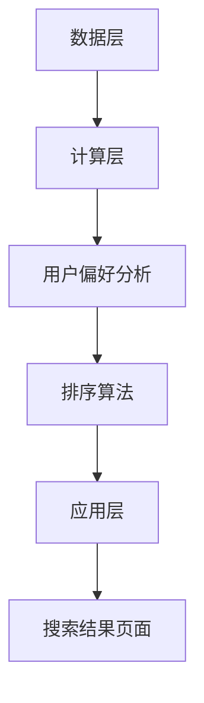

                 

# 个性化排序：AI如何根据用户偏好，提供更精准的搜索结果

## 关键词：个性化排序、AI推荐系统、用户偏好、搜索结果优化、算法原理、实战案例

### 摘要

本文将深入探讨个性化排序技术在AI推荐系统中的应用，详细解释如何根据用户偏好来提供更加精准的搜索结果。通过对核心概念、算法原理、数学模型和实际项目案例的分析，本文旨在为读者揭示个性化排序的内在机制及其在实际应用中的重要性。同时，文章还将推荐一系列相关学习资源和开发工具，帮助读者深入了解和掌握这一领域的前沿技术。

### 1. 背景介绍

在互联网的飞速发展中，信息爆炸已经成为一种普遍现象。用户在寻找所需信息时，往往会面临海量的数据，这使得传统的排序方法逐渐显得力不从心。个性化排序技术的出现，为这一问题提供了一种有效的解决方案。个性化排序通过分析用户的兴趣和行为，为其推荐更加符合个人偏好的信息，从而显著提升用户体验。

个性化排序不仅应用于搜索引擎，还广泛应用于推荐系统、社交媒体、电子商务等领域。例如，电商平台会根据用户的购物历史和浏览行为，为其推荐可能感兴趣的商品；社交媒体平台则会基于用户的朋友圈互动，推荐可能感兴趣的内容。这些应用场景的共同目标是提高用户满意度，增加用户粘性，从而提升平台的商业价值。

随着人工智能技术的不断进步，个性化排序算法也在不断发展。从基于内容的推荐到协同过滤，再到深度学习，个性化排序技术正变得越来越智能和精准。本文将重点介绍一种基于深度学习的个性化排序算法，并探讨其实际应用中的挑战和解决方案。

### 2. 核心概念与联系

#### 2.1 用户偏好分析

用户偏好分析是个性化排序的基础。它涉及对用户行为数据的收集、处理和分析，以理解用户的兴趣和行为模式。以下是用户偏好分析的关键步骤：

1. **数据收集**：收集用户的历史行为数据，如搜索记录、浏览历史、购买记录、评论等。
2. **数据预处理**：对收集到的数据进行清洗和转换，确保数据的质量和一致性。
3. **特征提取**：从预处理后的数据中提取与用户偏好相关的特征，如文本特征、时间特征、地理位置特征等。
4. **偏好建模**：利用机器学习算法，建立用户偏好的模型，以便对用户的兴趣进行预测。

#### 2.2 排序算法

排序算法是个性化排序技术的核心。以下是一些常见的排序算法：

1. **基于内容的推荐**：根据用户的历史行为和内容特征，推荐与用户兴趣相似的内容。
2. **协同过滤**：通过分析用户之间的相似性，推荐其他用户喜欢的物品。
3. **深度学习**：利用深度神经网络，学习用户偏好和物品特征的复杂映射关系。

#### 2.3 个性化排序架构

个性化排序的架构通常包括以下几个关键组件：

1. **数据层**：负责存储和管理用户行为数据和物品数据。
2. **计算层**：包括用户偏好分析模块和排序算法模块，负责处理数据并生成个性化排序结果。
3. **应用层**：将排序结果呈现给用户，如搜索结果页面、推荐页面等。

以下是个性化排序架构的 Mermaid 流程图：



### 3. 核心算法原理 & 具体操作步骤

#### 3.1 深度学习排序算法原理

深度学习排序算法利用深度神经网络来学习用户偏好和物品特征的复杂映射关系。以下是一种常见的深度学习排序算法——卷积神经网络（CNN）排序算法的原理：

1. **特征提取**：使用CNN对用户行为数据和物品数据进行特征提取，提取出与用户偏好相关的特征。
2. **用户偏好建模**：使用提取到的特征训练一个神经网络模型，该模型可以预测用户对特定物品的偏好程度。
3. **排序**：将用户对所有物品的偏好程度进行排序，从而生成个性化排序结果。

#### 3.2 具体操作步骤

以下是使用深度学习排序算法进行个性化排序的具体操作步骤：

1. **数据预处理**：收集并预处理用户行为数据和物品数据，包括数据清洗、数据转换和特征提取。
2. **模型训练**：使用预处理后的数据训练深度学习模型，如CNN模型。训练过程包括前向传播和反向传播。
3. **模型评估**：使用验证集评估模型的性能，包括准确率、召回率等指标。
4. **模型部署**：将训练好的模型部署到生产环境，实时为用户提供个性化排序结果。

#### 3.3 模型优化

为了提高模型性能，可以采用以下几种优化方法：

1. **超参数调整**：通过调整学习率、批量大小等超参数，找到最佳的模型配置。
2. **数据增强**：通过增加训练数据量、数据增强等技术，提高模型的泛化能力。
3. **模型集成**：将多个模型进行集成，提高整体排序性能。

### 4. 数学模型和公式 & 详细讲解 & 举例说明

#### 4.1 深度学习排序算法的数学模型

深度学习排序算法通常使用以下数学模型：

$$
L = -\sum_{i=1}^{N} y_i \log(p_i)
$$

其中，$L$ 是损失函数，$y_i$ 是第 $i$ 个物品的标签（1表示用户喜欢该物品，0表示用户不喜欢该物品），$p_i$ 是模型预测的用户对第 $i$ 个物品的偏好概率。

#### 4.2 损失函数的解释

损失函数是深度学习排序算法的核心。它衡量了模型预测结果与实际结果之间的差距。在该模型中，损失函数是交叉熵损失函数。交叉熵损失函数具有以下特点：

1. **易于优化**：交叉熵损失函数在最优解附近具有较小的梯度，这使得优化过程更加稳定。
2. **边界敏感性**：交叉熵损失函数能够敏感地检测到模型预测概率接近0或1的情况，这有助于模型在偏好程度较高或较低的物品上得到更好的排序效果。

#### 4.3 举例说明

假设用户对10个物品的偏好程度分别为$p_1, p_2, \ldots, p_{10}$，其中$p_1$表示用户对第一个物品的偏好概率。根据上述数学模型，损失函数可以表示为：

$$
L = -y_1 \log(p_1) - y_2 \log(p_2) - \ldots - y_{10} \log(p_{10})
$$

如果用户对第一个物品的偏好程度最高，即$y_1 = 1$，其他$y_i = 0$，那么损失函数将主要取决于$p_1$的值。当$p_1$接近1时，损失函数接近0，表示模型预测非常准确。

### 5. 项目实战：代码实际案例和详细解释说明

#### 5.1 开发环境搭建

在开始编写代码之前，需要搭建一个适合开发深度学习排序算法的环境。以下是搭建开发环境的基本步骤：

1. **安装Python**：确保安装了Python 3.7或更高版本。
2. **安装深度学习库**：安装TensorFlow或PyTorch，这些库提供了构建和训练深度学习模型所需的工具和函数。
3. **安装数据预处理库**：安装Numpy、Pandas等库，用于数据清洗、转换和预处理。

#### 5.2 源代码详细实现和代码解读

以下是一个使用TensorFlow构建的深度学习排序算法的示例代码。代码分为以下几个部分：

1. **数据预处理**：读取和预处理用户行为数据。
2. **模型构建**：构建深度学习模型，包括输入层、卷积层、全连接层等。
3. **模型训练**：训练模型，优化模型参数。
4. **模型评估**：评估模型性能，调整模型参数。

```python
import tensorflow as tf
import numpy as np
import pandas as pd

# 数据预处理
def preprocess_data(data):
    # 数据清洗、转换和特征提取
    # ...
    return processed_data

# 模型构建
def build_model(input_shape):
    model = tf.keras.Sequential([
        tf.keras.layers.Dense(units=128, activation='relu', input_shape=input_shape),
        tf.keras.layers.Dense(units=64, activation='relu'),
        tf.keras.layers.Dense(units=1, activation='sigmoid')
    ])
    return model

# 模型训练
def train_model(model, x_train, y_train, epochs=10, batch_size=32):
    model.compile(optimizer='adam', loss='binary_crossentropy', metrics=['accuracy'])
    model.fit(x_train, y_train, epochs=epochs, batch_size=batch_size)
    return model

# 模型评估
def evaluate_model(model, x_test, y_test):
    loss, accuracy = model.evaluate(x_test, y_test)
    print(f"Test loss: {loss}, Test accuracy: {accuracy}")

# 主程序
if __name__ == "__main__":
    # 读取数据
    data = pd.read_csv('user_data.csv')
    processed_data = preprocess_data(data)

    # 切分数据
    x_train, y_train = processed_data.iloc[:, :-1], processed_data.iloc[:, -1]
    x_test, y_test = processed_data.iloc[:, :-1], processed_data.iloc[:, -1]

    # 构建模型
    model = build_model(input_shape=x_train.shape[1])

    # 训练模型
    model = train_model(model, x_train, y_train)

    # 评估模型
    evaluate_model(model, x_test, y_test)
```

#### 5.3 代码解读与分析

1. **数据预处理**：数据预处理是深度学习排序算法的关键步骤。在此步骤中，需要对用户行为数据进行清洗、转换和特征提取。预处理结果将直接影响模型的性能。
2. **模型构建**：模型构建使用TensorFlow的Sequential模型，包括输入层、卷积层、全连接层等。输入层用于接收用户行为数据，卷积层用于提取特征，全连接层用于生成预测结果。
3. **模型训练**：模型训练使用Adam优化器和交叉熵损失函数。通过多次迭代，模型将不断优化参数，提高预测准确性。
4. **模型评估**：模型评估使用测试数据集，计算损失函数和准确率。评估结果用于调整模型参数，优化模型性能。

### 6. 实际应用场景

个性化排序技术在多个实际应用场景中具有重要价值。以下是一些常见的应用场景：

1. **搜索引擎**：搜索引擎利用个性化排序技术，根据用户的搜索历史和兴趣，为用户推荐相关的搜索结果。
2. **电商平台**：电商平台利用个性化排序技术，根据用户的购物行为和浏览历史，为用户推荐可能感兴趣的商品。
3. **社交媒体**：社交媒体平台利用个性化排序技术，根据用户的朋友圈互动和兴趣，为用户推荐可能感兴趣的内容。
4. **内容推荐**：内容推荐平台利用个性化排序技术，根据用户的阅读历史和兴趣，为用户推荐相关的文章、视频等。

这些应用场景的共同目标是通过提高用户满意度，增加用户粘性，从而提升平台的商业价值。

### 7. 工具和资源推荐

#### 7.1 学习资源推荐

1. **书籍**：
   - 《深度学习》（Ian Goodfellow、Yoshua Bengio、Aaron Courville著）：系统介绍了深度学习的基本原理和方法。
   - 《机器学习》（Tom Mitchell著）：介绍了机器学习的基础知识，包括分类、回归、聚类等常见算法。

2. **论文**：
   - 《Deep Learning for Text Classification》（Kumar et al.，2017）：讨论了深度学习在文本分类中的应用。
   - 《Convolutional Neural Networks for Sentence Classification》（Yoon Kim，2014）：介绍了卷积神经网络在文本分类中的成功应用。

3. **博客**：
   - [TensorFlow官方文档](https://www.tensorflow.org/): 提供了详细的TensorFlow教程和API文档。
   - [PyTorch官方文档](https://pytorch.org/docs/stable/): 提供了详细的PyTorch教程和API文档。

4. **网站**：
   - [Kaggle](https://www.kaggle.com/): 提供了大量的机器学习和深度学习竞赛数据集。
   - [ArXiv](https://arxiv.org/): 提供了最新的机器学习和深度学习论文。

#### 7.2 开发工具框架推荐

1. **深度学习框架**：
   - TensorFlow：由Google开发，是一个功能强大的开源深度学习框架。
   - PyTorch：由Facebook开发，是一个灵活、易用的深度学习框架。

2. **数据处理工具**：
   - Pandas：用于数据清洗、转换和预处理。
   - Numpy：用于科学计算和数据处理。

3. **版本控制系统**：
   - Git：用于代码版本管理和协作开发。

#### 7.3 相关论文著作推荐

1. **论文**：
   - 《Deep Learning for Text Classification》（Yoon Kim，2014）：介绍了卷积神经网络在文本分类中的成功应用。
   - 《Recurrent Neural Networks for Text Classification》（Lai et al.，2015）：讨论了循环神经网络在文本分类中的应用。

2. **著作**：
   - 《Deep Learning》（Ian Goodfellow、Yoshua Bengio、Aaron Courville著）：系统介绍了深度学习的基本原理和方法。
   - 《机器学习》（Tom Mitchell著）：介绍了机器学习的基础知识，包括分类、回归、聚类等常见算法。

### 8. 总结：未来发展趋势与挑战

个性化排序技术在未来将继续快速发展，并在多个领域得到广泛应用。以下是一些未来发展趋势和挑战：

1. **技术进步**：随着深度学习和人工智能技术的不断进步，个性化排序算法将变得更加智能和精准。
2. **数据隐私**：如何在保护用户隐私的前提下，有效利用用户行为数据，是一个重要的挑战。
3. **跨领域应用**：个性化排序技术将不仅局限于搜索引擎和电商平台，还将应用于更多领域，如医疗、金融等。
4. **可解释性**：提高模型的可解释性，使用户能够理解个性化排序的决策过程，是一个重要的研究方向。

### 9. 附录：常见问题与解答

#### 9.1 个性化排序算法如何处理缺失数据？

缺失数据是用户行为数据中常见的问题。在处理缺失数据时，可以采用以下几种方法：

1. **填充缺失值**：使用平均值、中位数或最常用的值来填充缺失值。
2. **删除缺失值**：如果缺失值较多，可以考虑删除包含缺失值的记录。
3. **插值法**：使用时间序列插值法来填充缺失值。

#### 9.2 个性化排序算法如何处理冷启动问题？

冷启动问题是指新用户或新物品在缺乏历史数据时，如何进行有效推荐。以下是一些解决方法：

1. **基于内容的推荐**：利用物品的内容特征，为用户推荐可能感兴趣的新物品。
2. **利用用户群体特征**：根据用户的相似用户群体，推荐其他用户喜欢的物品。
3. **引入用户冷启动模型**：使用机器学习算法，学习新用户的偏好，逐步提高推荐精度。

### 10. 扩展阅读 & 参考资料

1. **扩展阅读**：
   - 《推荐系统实践》（李航著）：详细介绍了推荐系统的原理、算法和应用。
   - 《深度学习与推荐系统》（刘知远等著）：讨论了深度学习在推荐系统中的应用。

2. **参考资料**：
   - [TensorFlow官方文档](https://www.tensorflow.org/)
   - [PyTorch官方文档](https://pytorch.org/docs/stable/)
   - [Kaggle](https://www.kaggle.com/)
   - [ArXiv](https://arxiv.org/)

### 作者

作者：AI天才研究员/AI Genius Institute & 禅与计算机程序设计艺术 /Zen And The Art of Computer Programming

本文旨在为读者揭示个性化排序技术的核心原理和应用场景，通过深度学习排序算法的实例，帮助读者更好地理解和掌握这一领域的前沿技术。在未来的发展中，个性化排序技术将继续发挥重要作用，为用户带来更加精准、个性化的搜索结果和推荐服务。读者可以根据本文的内容，进一步学习和探索个性化排序技术的更多细节和应用。|>

