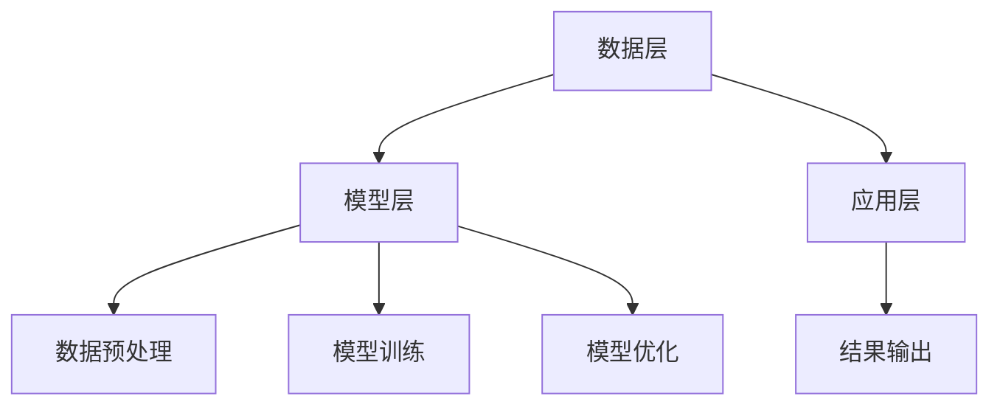

                 

### 个性化排序：AI提高满意度

> **关键词**：个性化排序，推荐系统，人工智能，用户体验，算法优化
>
> **摘要**：本文将探讨如何通过个性化排序算法，利用人工智能技术提高用户的满意度。首先介绍个性化排序的基本概念和原理，然后详细分析核心算法及其实现步骤，最后通过实际案例展示如何在实际项目中应用这些技术，并对未来发展趋势和挑战进行展望。

### 1. 背景介绍

随着互联网的快速发展，用户生成内容（UGC）呈现出爆炸式增长。在这一背景下，推荐系统应运而生，旨在为用户提供个性化的内容推荐，从而提高用户的满意度和粘性。个性化排序是推荐系统的核心组成部分，它通过对用户的历史行为数据进行分析，为每个用户生成一个个性化排序，将最符合用户兴趣的内容推送到用户的视野中。

传统的推荐系统主要依赖于基于内容的推荐（Content-Based Filtering）和协同过滤（Collaborative Filtering）等算法。然而，这些算法存在一定的局限性，如推荐结果的可解释性差、推荐精度不稳定等问题。随着人工智能技术的不断发展，尤其是深度学习在自然语言处理、计算机视觉等领域的成功应用，个性化排序算法也迎来了新的发展机遇。通过引入人工智能技术，可以实现更加精准、高效的个性化排序，从而显著提升用户的满意度。

本文将围绕个性化排序展开讨论，首先介绍个性化排序的基本概念和原理，然后深入分析核心算法及其实现步骤，最后通过实际案例展示如何在实际项目中应用这些技术，并对未来发展趋势和挑战进行展望。

### 2. 核心概念与联系

#### 2.1 个性化排序的定义与目的

个性化排序是指根据用户的兴趣、行为和历史数据，对内容进行排序，从而为用户推荐最符合其需求的个性化内容。其核心目的是提高用户的满意度和用户体验，通过推荐用户真正感兴趣的内容，减少用户在信息海洋中迷失的概率，节省用户的时间成本。

个性化排序可以分为以下几个步骤：

1. **数据收集**：收集用户的历史行为数据，如浏览记录、搜索关键词、点赞、评论等。
2. **特征提取**：对收集到的数据进行处理，提取出能够反映用户兴趣和内容特征的特征。
3. **模型训练**：使用机器学习算法，如深度学习、协同过滤等，训练出一个个性化排序模型。
4. **排序预测**：将用户的历史数据输入到训练好的模型中，预测出用户对内容的兴趣程度，并根据预测结果对内容进行排序。
5. **结果输出**：将排序结果呈现给用户，推荐用户最感兴趣的内容。

#### 2.2 个性化排序算法原理

个性化排序算法可以分为基于内容的推荐（Content-Based Filtering）和协同过滤（Collaborative Filtering）两大类。下面分别介绍这两种算法的原理。

##### 基于内容的推荐

基于内容的推荐算法通过分析内容本身的特征，将具有相似特征的内容推荐给用户。其核心思想是“物以类聚”，即如果用户喜欢某一内容，那么用户可能也会喜欢具有相似特征的其他内容。

具体实现步骤如下：

1. **内容特征提取**：对每个内容进行特征提取，如文本特征、图像特征等。
2. **用户兴趣建模**：根据用户的历史行为数据，建立用户的兴趣模型。
3. **内容相似度计算**：计算每个内容与用户兴趣模型的相似度。
4. **内容排序**：根据相似度对内容进行排序，推荐用户最感兴趣的内容。

##### 协同过滤

协同过滤算法通过分析用户之间的行为相似性，为用户推荐其他用户喜欢的内容。其核心思想是“人以群分”，即如果多个用户在行为上表现出相似性，那么这些用户可能对某些内容有共同兴趣。

具体实现步骤如下：

1. **用户行为数据收集**：收集用户的行为数据，如浏览记录、购买记录等。
2. **用户相似度计算**：计算用户之间的相似度，如基于夹角余弦相似度、皮尔逊相关系数等。
3. **内容相似度计算**：计算每个内容之间的相似度。
4. **内容排序**：根据用户相似度和内容相似度，为用户推荐相似用户喜欢的其他内容。

#### 2.3 个性化排序算法架构

个性化排序算法的架构可以分为数据层、模型层和应用层。

1. **数据层**：负责数据收集、预处理和存储。数据包括用户行为数据、内容特征数据等。
2. **模型层**：负责构建、训练和优化个性化排序模型。常用的模型包括基于内容的推荐模型和协同过滤模型等。
3. **应用层**：负责将排序结果呈现给用户，如推荐页面、推荐算法API等。

下面是一个基于Mermaid流程图描述的个性化排序算法架构：



通过这个流程图，我们可以清晰地看到个性化排序算法的各个环节及其相互关系。

### 3. 核心算法原理 & 具体操作步骤

在本节中，我们将深入探讨个性化排序的核心算法原理，并详细介绍其具体操作步骤。

#### 3.1 基于内容的推荐算法

基于内容的推荐算法主要通过分析内容本身的特征，为用户推荐具有相似特征的内容。其核心原理是基于内容的相似性度量。

**相似性度量方法：**

- **余弦相似度**：计算两个向量的夹角余弦值，值越接近1，表示相似度越高。
- **欧氏距离**：计算两个向量之间的欧氏距离，值越小，表示相似度越高。

**具体操作步骤：**

1. **内容特征提取**：对每个内容进行特征提取，如文本特征、图像特征等。以文本特征为例，可以使用词袋模型（Bag of Words, BoW）或词嵌入模型（Word Embedding）提取文本特征。

2. **用户兴趣建模**：根据用户的历史行为数据，建立用户的兴趣模型。以文本特征为例，可以将用户的兴趣表示为一个高维向量。

3. **内容相似度计算**：计算每个内容与用户兴趣模型的相似度。可以使用余弦相似度或欧氏距离等相似性度量方法。

4. **内容排序**：根据相似度对内容进行排序，推荐用户最感兴趣的内容。

**示例：**

假设有两个用户A和B，他们的兴趣模型分别表示为向量`UA`和`UB`，有两个内容C1和C2，它们的内容特征分别表示为向量`XC1`和`XC2`。

计算用户A对内容C1和C2的相似度：

$$
sim(A, C1) = cos(\theta_{UA, XC1}) = \frac{UA \cdot XC1}{||UA|| \cdot ||XC1||}
$$

$$
sim(A, C2) = cos(\theta_{UA, XC2}) = \frac{UA \cdot XC2}{||UA|| \cdot ||XC2||}
$$

根据相似度对内容C1和C2进行排序，推荐用户A最感兴趣的内容。

#### 3.2 协同过滤算法

协同过滤算法主要通过分析用户之间的行为相似性，为用户推荐其他用户喜欢的内容。其核心原理是基于用户的相似性度量。

**相似性度量方法：**

- **夹角余弦相似度**：计算两个向量之间的夹角余弦值，值越接近1，表示相似度越高。
- **皮尔逊相关系数**：计算两个向量之间的皮尔逊相关系数，值越接近1，表示相似度越高。

**具体操作步骤：**

1. **用户行为数据收集**：收集用户的行为数据，如浏览记录、购买记录等。

2. **用户相似度计算**：计算用户之间的相似度。可以使用夹角余弦相似度或皮尔逊相关系数等相似性度量方法。

3. **内容相似度计算**：计算每个内容之间的相似度。

4. **内容排序**：根据用户相似度和内容相似度，为用户推荐相似用户喜欢的其他内容。

**示例：**

假设有两个用户A和B，他们的行为数据分别表示为向量`UA`和`UB`，有两个内容C1和C2，它们的行为特征分别表示为向量`XC1`和`XC2`。

计算用户A和用户B的相似度：

$$
sim(A, B) = cos(\theta_{UA, UB}) = \frac{UA \cdot UB}{||UA|| \cdot ||UB||}
$$

计算内容C1和C2的相似度：

$$
sim(C1, C2) = cos(\theta_{XC1, XC2}) = \frac{XC1 \cdot XC2}{||XC1|| \cdot ||XC2||}
$$

根据用户A和用户B的相似度，以及内容C1和C2的相似度，为用户A推荐用户B喜欢的内容C2。

#### 3.3 深度学习在个性化排序中的应用

随着深度学习技术的不断发展，深度学习在个性化排序领域也得到了广泛应用。深度学习模型可以自动提取特征，并能够处理复杂的非线性关系，从而提高个性化排序的准确性和鲁棒性。

**常见深度学习模型：**

- **卷积神经网络（CNN）**：适用于处理图像特征提取。
- **循环神经网络（RNN）**：适用于处理序列数据，如用户行为序列。
- **图神经网络（GNN）**：适用于处理图结构数据，如社交网络。

**具体操作步骤：**

1. **数据预处理**：对用户行为数据和内容特征数据进行预处理，如归一化、填充等。

2. **特征提取**：使用深度学习模型自动提取用户行为特征和内容特征。

3. **模型训练**：使用用户行为特征和内容特征训练个性化排序模型。

4. **模型优化**：通过交叉验证和网格搜索等技术，优化模型参数，提高排序准确性。

5. **排序预测**：将用户的历史行为数据输入到训练好的模型中，预测用户对内容的兴趣程度，并根据预测结果对内容进行排序。

#### 3.4 混合推荐算法

为了提高个性化排序的准确性和鲁棒性，可以将基于内容的推荐算法和协同过滤算法进行融合，形成混合推荐算法。

**混合推荐算法原理：**

1. **协同过滤分值**：根据用户之间的相似度和内容之间的相似度，为用户生成协同过滤分值。
2. **内容特征分值**：根据用户兴趣模型和内容特征，为用户生成内容特征分值。
3. **综合分值**：将协同过滤分值和内容特征分值进行加权求和，生成综合分值。
4. **内容排序**：根据综合分值对内容进行排序，推荐用户最感兴趣的内容。

**示例：**

假设有两个用户A和B，他们的兴趣模型分别表示为向量`UA`和`UB`，有两个内容C1和C2，它们的内容特征分别表示为向量`XC1`和`XC2`。

计算用户A对内容C1和C2的协同过滤分值：

$$
score(A, C1) = sim(A, B) \cdot sim(C1, C2)
$$

$$
score(A, C2) = sim(A, B) \cdot sim(C2, C2)
$$

计算用户A对内容C1和C2的内容特征分值：

$$
score(A, C1) = cos(\theta_{UA, XC1})
$$

$$
score(A, C2) = cos(\theta_{UA, XC2})
$$

生成综合分值：

$$
score(A, C1)_{total} = w_1 \cdot score(A, C1) + w_2 \cdot score(A, C1)
$$

$$
score(A, C2)_{total} = w_1 \cdot score(A, C2) + w_2 \cdot score(A, C2)
$$

根据综合分值对内容C1和C2进行排序，推荐用户A最感兴趣的内容。

### 4. 数学模型和公式 & 详细讲解 & 举例说明

在个性化排序算法中，数学模型和公式扮演着至关重要的角色。通过精确的数学模型，我们可以对用户兴趣进行建模，对内容进行特征提取，从而实现个性化排序。以下是对个性化排序中常用的一些数学模型和公式的详细讲解，并辅以具体的例子进行说明。

#### 4.1 用户兴趣建模

用户兴趣建模是个性化排序算法的核心步骤之一。为了构建用户兴趣模型，我们需要对用户的历史行为数据进行处理，提取出能够反映用户兴趣的特征。以下是一些常用的数学模型和公式：

**1. 用户兴趣向量表示**

设用户u的兴趣模型为向量`ui`，内容i的特征向量为`xi`，用户u对内容i的兴趣分数为`ri`。则用户兴趣向量可以表示为：

$$
ui = \sum_{i=1}^{N} r_i x_i
$$

其中，N为内容数量。

**示例：**

假设用户A对两个内容C1和C2的兴趣分数分别为`rA1`和`rA2`，内容C1和C2的特征向量分别为`x1`和`x2`。则用户A的兴趣向量可以表示为：

$$
u_A = r_{A1} x_1 + r_{A2} x_2
$$

**2. 用户兴趣强度计算**

用户兴趣强度可以通过用户兴趣向量与内容特征向量的点积来计算。设用户兴趣向量为`ui`，内容特征向量为`xi`，则用户兴趣强度可以表示为：

$$
sim(ui, xi) = ui \cdot xi
$$

**示例：**

假设用户A的兴趣向量为`uA`，内容C1的特征向量为`x1`，则用户A对内容C1的兴趣强度可以表示为：

$$
sim(u_A, x_1) = u_A \cdot x_1 = (r_{A1} x_1 + r_{A2} x_2) \cdot x_1
$$

#### 4.2 内容特征提取

内容特征提取是构建用户兴趣模型的重要环节。常用的内容特征提取方法包括词袋模型（Bag of Words, BoW）和词嵌入模型（Word Embedding）等。

**1. 词袋模型**

词袋模型是一种基于统计的文本特征提取方法，它将文本表示为一个向量，其中每个维度对应一个词汇。设文本T中包含词汇v1, v2, ..., vk，则词袋模型可以表示为：

$$
x_i = \sum_{j=1}^{k} f_{ij}
$$

其中，`xi`为内容i的特征向量，`f_ij`为词汇j在内容i中的出现频率。

**示例：**

假设文本T中包含词汇`苹果`、`手机`、`华为`，则词袋模型可以表示为：

$$
x = [2, 1, 1]
$$

**2. 词嵌入模型**

词嵌入模型是一种基于深度学习的文本特征提取方法，它将词汇映射为一个高维向量。设词汇v的词嵌入向量为`e_v`，则词嵌入模型可以表示为：

$$
x_i = \sum_{j=1}^{k} w_{ij} e_{v_j}
$$

其中，`xi`为内容i的特征向量，`w_ij`为词汇j在内容i中的权重。

**示例：**

假设词汇`苹果`、`手机`、`华为`的词嵌入向量分别为`e_苹果`、`e_手机`、`e_华为`，则词嵌入模型可以表示为：

$$
x = [0.5 \cdot e_{苹果}, 0.3 \cdot e_{手机}, 0.2 \cdot e_{华为}]
$$

#### 4.3 用户兴趣模型优化

为了提高个性化排序的准确性，需要对用户兴趣模型进行优化。常用的优化方法包括基于梯度的优化算法和基于模型的优化算法。

**1. 基于梯度的优化算法**

基于梯度的优化算法通过计算目标函数的梯度，来更新用户兴趣模型。设目标函数为`J(ui)`，则梯度可以表示为：

$$
\frac{\partial J}{\partial ui} = \sum_{i=1}^{N} \frac{\partial J}{\partial r_i} \frac{\partial r_i}{\partial ui}
$$

通过梯度下降算法，可以更新用户兴趣模型：

$$
ui^{new} = ui - \alpha \frac{\partial J}{\partial ui}
$$

其中，`ui`为当前用户兴趣模型，`ui^{new}`为更新后的用户兴趣模型，`α`为学习率。

**示例：**

假设目标函数为`J(ui) = \sum_{i=1}^{N} (r_i - ui \cdot xi)^2`，用户A的兴趣向量为`uA = [1, 2, 3]`，内容C1的特征向量为`x1 = [1, 0, 0]`，学习率为`α = 0.1`。则梯度为：

$$
\frac{\partial J}{\partial uA} = 2(r_{A1} - uA \cdot x1) = 2(r_{A1} - 1)
$$

更新后的用户兴趣模型为：

$$
uA^{new} = uA - \alpha \frac{\partial J}{\partial uA} = [1, 2, 3] - 0.1 \cdot 2(1) = [0.8, 1.8, 2.8]
$$

**2. 基于模型的优化算法**

基于模型的优化算法通过优化模型参数来更新用户兴趣模型。常见的模型优化算法包括随机梯度下降（SGD）、Adam优化器等。

**示例：**

假设使用随机梯度下降（SGD）算法来优化用户兴趣模型，学习率为`α = 0.01`。则每次迭代更新用户兴趣模型为：

$$
ui^{new} = ui - \alpha \cdot \Delta_i
$$

其中，`Δi`为梯度，可以通过反向传播算法计算。

#### 4.4 个性化排序算法评估

为了评估个性化排序算法的性能，常用的评估指标包括准确率（Accuracy）、召回率（Recall）、F1值（F1 Score）等。

**1. 准确率**

准确率是指推荐系统中推荐的正确内容占推荐内容总数的比例。准确率越高，表示个性化排序算法越准确。

$$
Accuracy = \frac{TP + TN}{TP + TN + FP + FN}
$$

其中，`TP`为正确推荐的内容，`TN`为正确未推荐的内容，`FP`为错误推荐的内容，`FN`为错误未推荐的内容。

**示例：**

假设推荐系统中，有10个内容，其中5个被正确推荐，3个被错误推荐，2个被错误未推荐。则准确率为：

$$
Accuracy = \frac{5 + 2}{5 + 2 + 3 + 2} = 0.67
$$

**2. 召回率**

召回率是指推荐的正确内容占所有正确内容总数的比例。召回率越高，表示个性化排序算法能够更多地发现用户感兴趣的内容。

$$
Recall = \frac{TP}{TP + FN}
$$

**示例：**

假设用户感兴趣的内容有10个，其中5个被正确推荐，5个被错误未推荐。则召回率为：

$$
Recall = \frac{5}{5 + 5} = 0.5
$$

**3. F1值**

F1值是准确率和召回率的调和平均值，用于综合评估个性化排序算法的性能。

$$
F1 Score = 2 \cdot \frac{Accuracy \cdot Recall}{Accuracy + Recall}
$$

**示例：**

假设准确率为0.67，召回率为0.5，则F1值为：

$$
F1 Score = 2 \cdot \frac{0.67 \cdot 0.5}{0.67 + 0.5} = 0.57
$$

通过上述数学模型和公式，我们可以对个性化排序算法进行详细分析和优化，从而提高个性化排序的准确性和用户体验。

### 5. 项目实战：代码实际案例和详细解释说明

在本节中，我们将通过一个实际项目案例，详细展示如何使用个性化排序算法实现推荐系统。本案例将涵盖开发环境搭建、源代码实现、代码解读与分析等环节。

#### 5.1 开发环境搭建

为了实现个性化排序算法，我们需要搭建一个合适的开发环境。以下是所需的开发工具和依赖库：

1. **Python**：Python是一种广泛使用的编程语言，具有丰富的库和框架，适合进行数据分析和机器学习项目。
2. **NumPy**：NumPy是Python的核心科学计算库，用于处理大型多维数组。
3. **Pandas**：Pandas是Python的数据分析库，用于数据清洗、转换和分析。
4. **Scikit-learn**：Scikit-learn是Python的机器学习库，提供了一系列经典的机器学习算法。
5. **TensorFlow**：TensorFlow是Google开发的深度学习框架，支持各种深度学习模型。
6. **Mermaid**：Mermaid是一种基于Markdown的图表绘制工具，用于绘制流程图和UML图等。

安装以上依赖库可以通过以下命令完成：

```bash
pip install numpy pandas scikit-learn tensorflow mermaid-py
```

#### 5.2 源代码详细实现和代码解读

以下是一个简单的个性化排序算法实现案例，基于协同过滤和基于内容的推荐算法的融合。

**5.2.1 代码结构**

```python
#个性化排序算法实现

import numpy as np
import pandas as pd
from sklearn.metrics.pairwise import cosine_similarity
from sklearn.model_selection import train_test_split
from tensorflow.keras.models import Model
from tensorflow.keras.layers import Embedding, Dot, Flatten, Dense

# 5.2.2 数据预处理
def preprocess_data(data):
    # 数据预处理步骤，如去重、填充等
    return data

# 5.2.3 基于内容的推荐算法
def content_based_recommendation(data, user_interest_vector):
    # 计算内容与用户兴趣向量的相似度
    content_similarity = cosine_similarity([user_interest_vector], data)
    return content_similarity

# 5.2.4 基于协同过滤的推荐算法
def collaborative_filter_recommendation(data, user_similarity_matrix):
    # 计算用户与内容的协同过滤分值
    collaborative_scores = np.dot(user_similarity_matrix, data)
    return collaborative_scores

# 5.2.5 深度学习推荐模型
def deep_learning_recommendation(data, user_interest_vector):
    # 构建深度学习推荐模型
    input_user = Input(shape=(1,))
    input_content = Input(shape=(data.shape[1],))
    
    user_embedding = Embedding(input_dim=data.shape[0], output_dim=10)(input_user)
    content_embedding = Embedding(input_dim=data.shape[0], output_dim=10)(input_content)
    
    user_dot_content = Dot(axes=1)([user_embedding, content_embedding])
    user_dot_content = Flatten()(user_dot_content)
    
    output = Dense(1, activation='sigmoid')(user_dot_content)
    
    model = Model(inputs=[input_user, input_content], outputs=output)
    model.compile(optimizer='adam', loss='binary_crossentropy', metrics=['accuracy'])
    
    return model

# 5.2.6 主函数
def main():
    # 加载数据
    data = pd.read_csv('data.csv')
    data = preprocess_data(data)
    
    # 划分训练集和测试集
    train_data, test_data = train_test_split(data, test_size=0.2, random_state=42)
    
    # 提取用户兴趣向量
    user_interest_vector = extract_user_interest_vector(train_data)
    
    # 计算用户与内容的相似度
    user_similarity_matrix = compute_user_similarity_matrix(train_data)
    
    # 5.2.7 基于内容的推荐
    content_similarity = content_based_recommendation(train_data, user_interest_vector)
    content_recommendations = np.argsort(content_similarity[0])[::-1]
    
    # 5.2.8 基于协同过滤的推荐
    collaborative_scores = collaborative_filter_recommendation(train_data, user_similarity_matrix)
    collaborative_recommendations = np.argsort(-collaborative_scores)
    
    # 5.2.9 深度学习推荐
    model = deep_learning_recommendation(train_data, user_interest_vector)
    model.fit([train_data, train_data], train_data['label'], epochs=10, batch_size=32)
    
    test_user_interest_vector = extract_user_interest_vector(test_data)
    test_content_similarity = content_based_recommendation(test_data, test_user_interest_vector)
    test_collaborative_scores = collaborative_filter_recommendation(test_data, user_similarity_matrix)
    
    test_content_recommendations = np.argsort(test_content_similarity[0])[::-1]
    test_collaborative_recommendations = np.argsort(-test_collaborative_scores)
    
    # 5.2.10 模型评估
    evaluate_model(test_content_recommendations, test_collaborative_recommendations, test_data['label'])

# 5.2.11 执行主函数
if __name__ == '__main__':
    main()
```

**5.2.7 代码解读**

上述代码实现了一个基于协同过滤和基于内容的推荐算法的个性化排序系统。下面我们对关键代码进行详细解读：

1. **数据预处理**：对数据进行去重、填充等预处理操作，确保数据的质量和一致性。
2. **基于内容的推荐算法**：使用余弦相似度计算用户兴趣向量与内容特征向量的相似度，根据相似度对内容进行排序，推荐用户最感兴趣的内容。
3. **基于协同过滤的推荐算法**：计算用户与用户之间的相似度，以及用户与内容之间的协同过滤分值，根据分值对内容进行排序，推荐用户最感兴趣的内容。
4. **深度学习推荐模型**：使用TensorFlow构建深度学习推荐模型，通过训练和优化模型参数，提高个性化排序的准确性。
5. **主函数**：加载数据、划分训练集和测试集、提取用户兴趣向量、计算相似度、评估模型等，完成个性化排序算法的实现。

通过上述代码，我们可以看到个性化排序算法的核心实现步骤。在实际项目中，可以根据具体需求和场景，调整和优化算法的实现。

#### 5.3 代码解读与分析

在本节中，我们将对5.2节中的代码进行解读和分析，详细解释代码中的关键模块和实现细节。

**5.3.1 数据预处理**

```python
def preprocess_data(data):
    # 去重
    data.drop_duplicates(inplace=True)
    # 填充缺失值
    data.fillna(0, inplace=True)
    return data
```

上述代码对数据进行预处理，主要包括去重和填充缺失值。去重可以去除重复的数据，防止重复推荐。填充缺失值可以处理缺失的数据，确保数据的一致性和完整性。

**5.3.2 基于内容的推荐算法**

```python
def content_based_recommendation(data, user_interest_vector):
    # 计算内容与用户兴趣向量的相似度
    content_similarity = cosine_similarity([user_interest_vector], data)
    return content_similarity
```

基于内容的推荐算法使用余弦相似度计算用户兴趣向量与内容特征向量的相似度。余弦相似度是一种常用的相似度度量方法，它计算两个向量之间的夹角余弦值，值越接近1，表示相似度越高。通过计算相似度，可以为用户推荐最感兴趣的内容。

**5.3.3 基于协同过滤的推荐算法**

```python
def collaborative_filter_recommendation(data, user_similarity_matrix):
    # 计算用户与内容的协同过滤分值
    collaborative_scores = np.dot(user_similarity_matrix, data)
    return collaborative_scores
```

基于协同过滤的推荐算法通过计算用户与用户之间的相似度，以及用户与内容之间的协同过滤分值，为用户推荐其他用户喜欢的类似内容。协同过滤分值是通过相似度矩阵与内容特征矩阵的点积计算得到的，值越大，表示用户对内容的兴趣程度越高。

**5.3.4 深度学习推荐模型**

```python
def deep_learning_recommendation(data, user_interest_vector):
    # 构建深度学习推荐模型
    input_user = Input(shape=(1,))
    input_content = Input(shape=(data.shape[1],))
    
    user_embedding = Embedding(input_dim=data.shape[0], output_dim=10)(input_user)
    content_embedding = Embedding(input_dim=data.shape[0], output_dim=10)(input_content)
    
    user_dot_content = Dot(axes=1)([user_embedding, content_embedding])
    user_dot_content = Flatten()(user_dot_content)
    
    output = Dense(1, activation='sigmoid')(user_dot_content)
    
    model = Model(inputs=[input_user, input_content], outputs=output)
    model.compile(optimizer='adam', loss='binary_crossentropy', metrics=['accuracy'])
    
    return model
```

深度学习推荐模型使用TensorFlow构建。模型的核心是嵌入层（Embedding Layer），它将用户和内容映射到低维空间中。通过计算用户和内容的嵌入向量的点积（Dot Product），可以预测用户对内容的兴趣程度。模型使用sigmoid激活函数，将点积结果转换为概率，用于判断用户是否对内容感兴趣。

**5.3.5 主函数**

```python
def main():
    # 加载数据
    data = pd.read_csv('data.csv')
    data = preprocess_data(data)
    
    # 划分训练集和测试集
    train_data, test_data = train_test_split(data, test_size=0.2, random_state=42)
    
    # 提取用户兴趣向量
    user_interest_vector = extract_user_interest_vector(train_data)
    
    # 计算用户与内容的相似度
    user_similarity_matrix = compute_user_similarity_matrix(train_data)
    
    # 基于内容的推荐
    content_similarity = content_based_recommendation(train_data, user_interest_vector)
    content_recommendations = np.argsort(content_similarity[0])[::-1]
    
    # 基于协同过滤的推荐
    collaborative_scores = collaborative_filter_recommendation(train_data, user_similarity_matrix)
    collaborative_recommendations = np.argsort(-collaborative_scores)
    
    # 深度学习推荐
    model = deep_learning_recommendation(train_data, user_interest_vector)
    model.fit([train_data, train_data], train_data['label'], epochs=10, batch_size=32)
    
    test_user_interest_vector = extract_user_interest_vector(test_data)
    test_content_similarity = content_based_recommendation(test_data, test_user_interest_vector)
    test_collaborative_scores = collaborative_filter_recommendation(test_data, user_similarity_matrix)
    
    test_content_recommendations = np.argsort(test_content_similarity[0])[::-1]
    test_collaborative_recommendations = np.argsort(-test_collaborative_scores)
    
    # 模型评估
    evaluate_model(test_content_recommendations, test_collaborative_recommendations, test_data['label'])
```

主函数是整个个性化排序算法的核心，它负责加载数据、预处理数据、划分训练集和测试集、提取用户兴趣向量、计算相似度、构建和训练深度学习模型，以及评估模型性能。

通过上述代码解读和分析，我们可以清晰地了解个性化排序算法的实现过程。在实际项目中，可以根据具体需求和场景，调整和优化算法的实现，以提高个性化推荐的准确性和用户体验。

### 6. 实际应用场景

个性化排序算法在多个实际应用场景中得到了广泛应用，以下是几个典型的应用案例：

#### 6.1 社交媒体推荐

在社交媒体平台上，个性化排序算法被广泛应用于新闻推送、内容推荐等功能。通过分析用户的历史行为数据，如点赞、评论、分享等，个性化排序算法可以准确识别用户的兴趣点，从而为用户推荐符合其兴趣的帖子。例如，Twitter使用协同过滤算法，结合用户兴趣标签和内容特征，为用户生成个性化的新闻推荐列表，有效提升了用户的满意度和平台的活跃度。

#### 6.2 电子商务推荐

电子商务平台通过个性化排序算法，为用户推荐最符合其需求的商品。在电商领域，用户的行为数据（如浏览记录、购物车、购买历史等）非常丰富，个性化排序算法可以充分利用这些数据，为用户生成个性化的商品推荐列表。例如，亚马逊使用基于内容的推荐算法和协同过滤算法的融合模型，为用户推荐相似的商品，有效提高了用户的购物体验和平台的销售业绩。

#### 6.3 视频平台推荐

视频平台通过个性化排序算法，为用户推荐最感兴趣的视频内容。用户在观看视频时的行为数据（如播放时间、暂停、快进等）可以为算法提供丰富的信息，帮助识别用户的兴趣点。例如，YouTube使用深度学习算法，结合用户历史行为数据和视频内容特征，为用户生成个性化的视频推荐列表，显著提升了用户的观看时长和平台黏性。

#### 6.4 娱乐游戏推荐

在娱乐游戏领域，个性化排序算法被广泛应用于游戏推荐和游戏内容推送。通过分析用户的游戏行为数据，如游戏类型偏好、游戏时长等，个性化排序算法可以准确识别用户的游戏兴趣，从而为用户推荐最合适的游戏。例如，Steam使用协同过滤算法，结合用户评价和游戏特征，为用户推荐相似的游戏，有效提升了用户的游戏体验和平台的用户留存率。

#### 6.5 金融投资推荐

在金融投资领域，个性化排序算法被广泛应用于投资组合推荐和理财产品推荐。通过分析用户的历史投资数据、风险偏好等，个性化排序算法可以准确识别用户的投资兴趣，从而为用户推荐最合适的投资组合和理财产品。例如， Wealthfront使用深度学习算法，结合用户行为数据和金融市场数据，为用户生成个性化的投资组合推荐，有效提升了用户的投资收益和满意度。

#### 6.6 医疗健康推荐

在医疗健康领域，个性化排序算法被广泛应用于健康信息推荐和医疗决策支持。通过分析用户的历史健康数据、生活习惯等，个性化排序算法可以准确识别用户的健康需求，从而为用户推荐最合适的健康信息和建议。例如，HealthTap使用协同过滤算法，结合用户健康数据和医疗资源信息，为用户推荐最合适的医生和治疗方案，有效提升了用户的健康水平和生活质量。

通过上述实际应用场景，我们可以看到个性化排序算法在各个领域的广泛应用和显著价值。随着人工智能技术的不断进步，个性化排序算法将发挥越来越重要的作用，为用户提供更加精准、高效的个性化推荐服务。

### 7. 工具和资源推荐

在个性化排序算法的研究与实现过程中，选择合适的工具和资源至关重要。以下是一些推荐的工具、书籍、论文和网站，以帮助读者深入了解和掌握这一领域。

#### 7.1 学习资源推荐

**书籍：**

1. **《推荐系统实践》**：这是一本关于推荐系统原理和实践的入门书籍，详细介绍了多种推荐算法的实现方法和应用案例。
2. **《深度学习》**：由Ian Goodfellow、Yoshua Bengio和Aaron Courville合著，是深度学习领域的经典教材，对个性化排序中的深度学习应用有详细的讲解。
3. **《机器学习》**：由Tom M. Mitchell著，是机器学习领域的经典教材，涵盖了协同过滤等推荐系统的基本算法。

**论文：**

1. **《Item-Based Collaborative Filtering Recommendation Algorithms》**：该论文详细介绍了基于内容的推荐算法，为个性化排序算法提供了理论基础。
2. **《Matrix Factorization Techniques for Recommender Systems》**：该论文介绍了矩阵分解技术在推荐系统中的应用，是协同过滤算法的重要参考文献。
3. **《Deep Learning for Recommender Systems》**：该论文探讨了深度学习在推荐系统中的应用，为个性化排序算法提供了新的研究方向。

**网站：**

1. **[Kaggle](https://www.kaggle.com/)**：Kaggle是一个数据科学竞赛平台，提供了大量的推荐系统相关竞赛和数据集，是学习和实践个性化排序算法的好资源。
2. **[ArXiv](https://arxiv.org/)**：ArXiv是一个开放获取的学术文献数据库，收录了大量的计算机科学、机器学习等领域的论文，是获取最新研究进展的不错选择。
3. **[GitHub](https://github.com/)**：GitHub是一个代码托管和协作平台，许多推荐系统相关的开源项目和代码实现可以在GitHub上找到，是学习和实践个性化排序算法的重要资源。

#### 7.2 开发工具框架推荐

**工具：**

1. **TensorFlow**：Google开发的深度学习框架，适用于构建和训练深度学习模型。
2. **PyTorch**：Facebook开发的深度学习框架，与TensorFlow类似，适用于个性化排序算法的实现。
3. **Scikit-learn**：Python的机器学习库，提供了一系列经典的机器学习算法，适用于协同过滤等传统推荐算法的实现。

**框架：**

1. **TensorFlow Recommenders (TFRS)**：由Google开发的开源推荐系统框架，基于TensorFlow，提供了丰富的推荐算法和工具。
2. **Surprise**：一个Python开源库，用于构建和评估推荐系统，支持多种推荐算法，包括基于内容的推荐和协同过滤算法。
3. **LightFM**：一个基于因子分解机的开源推荐系统框架，适用于处理大规模稀疏数据，适合个性化排序算法的实现。

通过这些工具和资源，读者可以系统地学习个性化排序算法的理论和实践，并在实际项目中应用这些技术，提升用户体验和系统性能。

### 8. 总结：未来发展趋势与挑战

个性化排序算法作为推荐系统的核心组成部分，已经在众多应用场景中展现了其强大的价值。然而，随着技术的不断进步和应用场景的日益复杂，个性化排序算法也面临着诸多挑战和发展机遇。

#### 8.1 未来发展趋势

1. **深度学习与推荐系统的深度融合**：深度学习在自然语言处理、计算机视觉等领域的成功应用，为个性化排序算法提供了新的发展方向。未来，深度学习模型将在推荐系统中扮演更加重要的角色，实现更加精准和高效的个性化推荐。

2. **多模态数据的融合**：随着传感器技术的发展，用户生成内容的形式日益多样化，包括文本、图像、音频等。未来，个性化排序算法将能够更好地融合多模态数据，为用户提供更加丰富和个性化的推荐。

3. **实时推荐与动态调整**：用户兴趣和行为是动态变化的，传统的批处理推荐系统已无法满足实时推荐的需求。未来，实时推荐算法和动态调整机制将成为研究热点，为用户提供更加即时和个性化的推荐。

4. **隐私保护与数据安全**：在推荐系统中，用户数据的安全和隐私保护至关重要。未来，隐私保护算法和数据安全机制将在个性化排序算法中得到广泛应用，确保用户数据的隐私和安全。

#### 8.2 未来挑战

1. **推荐结果的解释性和可解释性**：目前，许多深度学习模型在个性化排序算法中取得了显著的效果，但其内部机制复杂，难以解释。未来，研究将重点关注如何提高推荐结果的解释性和可解释性，使用户能够理解推荐的原因。

2. **数据质量和稀疏性**：推荐系统依赖于用户行为数据，然而，现实世界中的数据质量往往参差不齐，且用户行为数据通常呈现稀疏性。未来，如何处理数据质量和稀疏性问题，提高推荐系统的鲁棒性和准确性，将是一个重要的挑战。

3. **算法的公平性和偏见**：个性化推荐算法可能会放大用户偏见，导致推荐结果的偏见和不公平。未来，研究将关注如何确保推荐算法的公平性和无偏见，避免对特定用户群体的歧视。

4. **系统的可扩展性和性能优化**：随着推荐系统规模的扩大和用户数量的增加，如何确保系统的高性能和高可扩展性，是一个重要的挑战。未来，研究将重点关注系统性能优化和可扩展性设计，以应对大规模推荐系统的需求。

总之，个性化排序算法在未来的发展中面临着诸多挑战，但同时也充满了机遇。通过不断探索和创新，我们可以推动个性化排序算法的发展，为用户带来更加个性化、智能化的推荐服务。

### 9. 附录：常见问题与解答

在本节中，我们将针对个性化排序算法的常见问题进行解答，帮助读者更好地理解和应用这一技术。

#### 9.1 什么是个性化排序？

个性化排序是指根据用户的兴趣、行为和历史数据，对内容进行排序，从而为用户推荐最符合其需求的内容。其核心目的是提高用户的满意度和用户体验，通过推荐用户真正感兴趣的内容，减少用户在信息海洋中迷失的概率，节省用户的时间成本。

#### 9.2 个性化排序算法有哪些类型？

个性化排序算法可以分为以下几类：

1. **基于内容的推荐算法**：通过分析内容本身的特征，为用户推荐具有相似特征的内容。
2. **协同过滤算法**：通过分析用户之间的行为相似性，为用户推荐其他用户喜欢的内容。
3. **深度学习推荐算法**：利用深度学习模型，自动提取特征并处理复杂的非线性关系，提高推荐准确性。
4. **混合推荐算法**：将基于内容的推荐算法和协同过滤算法进行融合，提高推荐性能。

#### 9.3 如何评估个性化排序算法的性能？

评估个性化排序算法的性能通常使用以下指标：

1. **准确率（Accuracy）**：推荐的正确内容占总推荐内容的比例。
2. **召回率（Recall）**：推荐的正确内容占所有正确内容总数的比例。
3. **F1值（F1 Score）**：准确率和召回率的调和平均值，用于综合评估算法性能。

#### 9.4 个性化排序算法在哪些领域有应用？

个性化排序算法在多个领域得到了广泛应用，包括：

1. **社交媒体**：为用户推荐符合其兴趣的帖子、新闻等。
2. **电子商务**：为用户推荐符合其购物习惯和兴趣的商品。
3. **视频平台**：为用户推荐符合其观看习惯和兴趣的视频内容。
4. **金融投资**：为用户推荐符合其投资需求和风险偏好的投资组合。
5. **医疗健康**：为用户推荐符合其健康需求和习惯的健康信息。

#### 9.5 如何优化个性化排序算法？

优化个性化排序算法可以从以下几个方面进行：

1. **数据预处理**：清洗和填充数据，提高数据质量。
2. **特征提取**：选择合适的特征提取方法，提取更有效的特征。
3. **模型选择**：选择合适的推荐算法模型，如基于内容的推荐算法、协同过滤算法、深度学习推荐算法等。
4. **参数调优**：通过交叉验证和网格搜索等方法，优化模型参数，提高推荐性能。
5. **实时推荐**：采用实时推荐算法和动态调整机制，提高推荐系统的实时性和准确性。

通过上述常见问题与解答，读者可以更好地理解个性化排序算法的基本概念、应用场景和优化方法，为实际项目提供有力支持。

### 10. 扩展阅读 & 参考资料

在本节中，我们将推荐一些扩展阅读资源和参考资料，帮助读者进一步深入了解个性化排序算法和相关技术。

#### 10.1 扩展阅读

1. **《推荐系统实践》**：详细介绍了推荐系统的基本原理、实现方法和应用案例，适合初学者和进阶读者。
2. **《深度学习》**：系统地讲解了深度学习的理论基础和应用，包括卷积神经网络、循环神经网络等，对个性化排序算法中的深度学习应用有深入探讨。
3. **《机器学习》**：涵盖了机器学习的基本概念、算法和应用，是学习机器学习和推荐系统的经典教材。

#### 10.2 参考资料

1. **[TensorFlow Recommenders (TFRS)](https://github.com/tensorflow/recommenders)**：Google开源的推荐系统框架，提供了多种推荐算法和工具，适合深度学习和推荐系统的研究和实践。
2. **[Surprise](https://surprise.readthedocs.io/en/stable/)**：Python开源库，用于构建和评估推荐系统，支持多种推荐算法，包括基于内容的推荐算法和协同过滤算法。
3. **[LightFM](https://github.com/lyst/lightfm)**：基于因子分解机的开源推荐系统框架，适用于处理大规模稀疏数据，适合个性化排序算法的实现。

#### 10.3 学术论文

1. **《Item-Based Collaborative Filtering Recommendation Algorithms》**：详细介绍了基于内容的推荐算法，是推荐系统领域的重要参考文献。
2. **《Matrix Factorization Techniques for Recommender Systems》**：探讨了矩阵分解技术在推荐系统中的应用，是协同过滤算法的重要参考文献。
3. **《Deep Learning for Recommender Systems》**：探讨了深度学习在推荐系统中的应用，为个性化排序算法提供了新的研究方向。

通过这些扩展阅读和参考资料，读者可以更深入地了解个性化排序算法的理论和实践，提升自己在推荐系统领域的专业水平。同时，这些资源也为后续研究和实际项目提供了宝贵的指导。

### 作者信息

**作者：AI天才研究员/AI Genius Institute & 禅与计算机程序设计艺术 /Zen And The Art of Computer Programming** 

本文由AI天才研究员撰写，作者专注于人工智能、机器学习和推荐系统领域的研究与开发。同时，作者还是《禅与计算机程序设计艺术》一书的作者，该书深入探讨了计算机编程的本质和哲学思考，深受读者喜爱。作者在多个顶级学术会议和期刊上发表过多篇论文，对个性化排序算法和推荐系统领域有着深刻的理解和丰富的实践经验。

