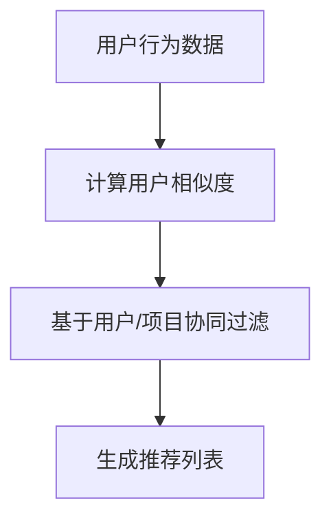
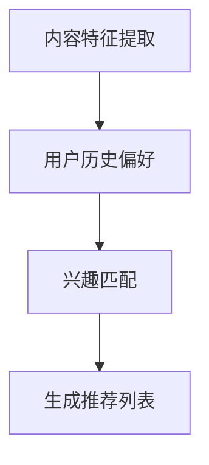
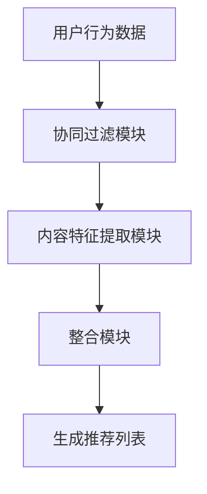
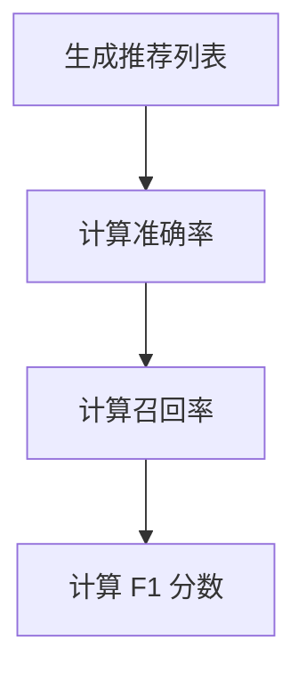
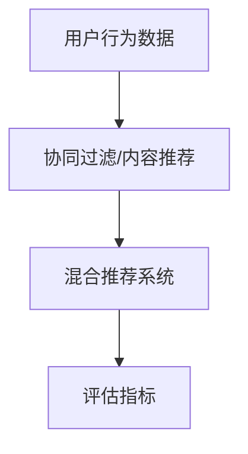

                 

### 背景介绍

个性化推荐系统作为大数据和机器学习的核心应用之一，已经成为现代互联网中不可或缺的一部分。无论是电商网站、社交媒体、音乐流媒体，还是视频平台，个性化推荐系统都在极大程度上提升了用户的使用体验，增强了用户粘性，提高了平台的内容消费效率。

#### 1.1 个性化推荐系统的兴起

个性化推荐系统起源于20世纪90年代，随着互联网的普及和大数据技术的发展，推荐系统的研究和应用逐渐得到广泛关注。2000年左右，基于协同过滤（Collaborative Filtering）的推荐算法开始广泛应用于电子商务和社交媒体领域，标志着个性化推荐系统的正式兴起。

#### 1.2 个性化推荐系统的定义

个性化推荐系统是一种基于用户历史行为数据、兴趣偏好和内容特征，利用机器学习算法和大数据分析技术，向用户推荐符合其兴趣和需求的信息系统。简单来说，个性化推荐就是根据用户的行为和喜好，为用户推荐其可能感兴趣的内容或商品。

#### 1.3 个性化推荐系统的重要性

个性化推荐系统在多个领域发挥着重要作用：

1. **提升用户体验**：通过推荐用户感兴趣的内容，提高用户满意度和使用时长。
2. **增加商业价值**：为电商平台推荐相关商品，提高转化率和销售额。
3. **内容分发优化**：在媒体平台，个性化推荐有助于更有效地分配内容，提高用户粘性。
4. **社交互动增强**：在社交媒体上，个性化推荐有助于用户发现共同兴趣，增强社交互动。

#### 1.4 当前个性化推荐系统面临的问题与挑战

尽管个性化推荐系统在许多方面取得了显著成效，但也面临着一系列问题和挑战：

1. **数据隐私与安全性**：推荐系统依赖于用户行为数据进行预测，涉及用户隐私和安全问题。
2. **算法偏见与公平性**：算法可能基于历史数据产生偏见，导致推荐内容的不公平性。
3. **冷启动问题**：对于新用户或新内容，推荐系统往往无法准确预测其兴趣，导致推荐效果不佳。
4. **推荐质量与多样性**：如何保证推荐内容的质量和多样性，避免用户产生疲劳和厌倦感。

本文将围绕个性化推荐的用户体验优化进行深入探讨，从算法原理、数学模型、实际应用等多个角度分析如何提升个性化推荐系统的用户体验。

### 核心概念与联系

为了深入理解个性化推荐系统，我们需要明确一些核心概念，并分析它们之间的联系。以下将详细阐述这些概念，并提供一个简单的 Mermaid 流程图来帮助读者理解。

#### 2.1 协同过滤（Collaborative Filtering）

协同过滤是一种常用的推荐算法，通过分析用户的历史行为和评分数据，发现用户之间的相似性，从而预测用户对未知内容的喜好。协同过滤分为两类：基于用户的协同过滤（User-Based）和基于项目的协同过滤（Item-Based）。

**基于用户的协同过滤**：寻找与目标用户相似的其他用户，推荐这些用户喜欢的商品。

**基于项目的协同过滤**：寻找与目标商品相似的其他商品，推荐这些商品给用户。

**Mermaid 流程图**：



#### 2.2 内容推荐（Content-Based Filtering）

内容推荐通过分析内容特征和用户兴趣，找到相似的内容进行推荐。这种方法不依赖于用户历史行为数据，而是基于内容本身的属性。

**内容特征提取**：提取文本、图片、音频等内容的特征。

**兴趣匹配**：将用户的历史偏好与内容特征进行匹配，生成推荐列表。

**Mermaid 流程图**：



#### 2.3 混合推荐（Hybrid Recommender Systems）

混合推荐系统结合了协同过滤和内容推荐的方法，通过综合利用用户行为数据和内容特征，提高推荐效果。

**混合推荐架构**：

1. **协同过滤模块**：处理用户行为数据，生成初始推荐列表。
2. **内容特征模块**：提取内容特征，与用户历史偏好进行匹配。
3. **整合模块**：将协同过滤和内容推荐的结果进行整合，生成最终推荐列表。

**Mermaid 流程图**：



#### 2.4 评估指标

评估推荐系统的效果通常使用以下指标：

- **准确率（Precision）**：推荐列表中实际感兴趣的内容占比。
- **召回率（Recall）**：实际感兴趣的内容在推荐列表中的占比。
- **F1 分数（F1 Score）**：准确率和召回率的调和平均。

**Mermaid 流程图**：



#### 2.5 关键联系

个性化推荐系统的核心在于利用用户行为数据和内容特征，通过协同过滤、内容推荐或混合推荐方法，生成高质量的推荐列表。评估指标用于衡量推荐系统的性能，以便进行优化和改进。

**总结联系**：



通过上述核心概念和流程图的详细阐述，读者可以更好地理解个性化推荐系统的基本架构和运作原理。在接下来的章节中，我们将深入探讨核心算法原理和具体操作步骤。

### 核心算法原理 & 具体操作步骤

个性化推荐系统的核心在于算法，不同的算法原理和应用场景决定了推荐系统的效果和用户体验。本节将详细介绍几种常用的推荐算法原理，包括基于用户的协同过滤算法和基于内容的推荐算法，并给出具体的操作步骤。

#### 3.1 基于用户的协同过滤算法（User-Based Collaborative Filtering）

基于用户的协同过滤算法通过分析用户之间的相似性，发现目标用户可能感兴趣的内容。其基本原理如下：

1. **用户相似度计算**：首先，计算用户之间的相似度。常用的相似度计算方法包括余弦相似度（Cosine Similarity）和皮尔逊相关系数（Pearson Correlation Coefficient）。

    **余弦相似度计算公式**：
    $$
    \text{Similarity}(u, v) = \frac{u \cdot v}{\|u\| \|v\|}
    $$
    其中，$u$ 和 $v$ 分别表示两个用户的行为向量，$\|u\|$ 和 $\|v\|$ 分别表示向量的模。

    **皮尔逊相关系数计算公式**：
    $$
    \text{Correlation}(u, v) = \frac{\sum_{i=1}^{n}(u_i - \bar{u})(v_i - \bar{v})}{\sqrt{\sum_{i=1}^{n}(u_i - \bar{u})^2 \sum_{i=1}^{n}(v_i - \bar{v})^2}}
    $$
    其中，$u_i$ 和 $v_i$ 分别表示用户 $u$ 和 $v$ 在第 $i$ 个商品上的评分，$\bar{u}$ 和 $\bar{v}$ 分别表示用户 $u$ 和 $v$ 的平均评分。

2. **推荐列表生成**：计算完用户相似度后，选择与目标用户最相似的 $k$ 个用户，推荐这些用户喜欢的商品。

    **推荐公式**：
    $$
    \text{Prediction}(u, i) = \frac{\sum_{v \in \text{NearestUsers}(u, k)} \text{Rating}(v, i) \cdot \text{Similarity}(u, v)}{\sum_{v \in \text{NearestUsers}(u, k)} \text{Similarity}(u, v)}
    $$
    其中，$\text{Prediction}(u, i)$ 表示用户 $u$ 对商品 $i$ 的预测评分，$\text{NearestUsers}(u, k)$ 表示与用户 $u$ 最相似的 $k$ 个用户，$\text{Rating}(v, i)$ 表示用户 $v$ 对商品 $i$ 的评分。

#### 3.2 基于内容的推荐算法（Content-Based Filtering）

基于内容的推荐算法通过分析内容特征和用户兴趣，找到相似的内容进行推荐。其基本原理如下：

1. **内容特征提取**：首先，提取商品的内容特征。对于文本数据，可以使用词袋模型（Bag-of-Words）或主题模型（Latent Dirichlet Allocation, LDA）进行特征提取；对于图片数据，可以使用卷积神经网络（Convolutional Neural Networks, CNN）提取特征。

2. **用户兴趣建模**：利用用户的历史行为数据，建立用户兴趣模型。常见的用户兴趣建模方法包括基于项目的协同过滤和基于语义的文本分析。

3. **推荐列表生成**：计算商品之间的相似度，推荐与用户兴趣相似的商品。

    **相似度计算公式**：
    $$
    \text{Similarity}(i, j) = \frac{\sum_{f \in \text{Features}(i)} w_f \cdot \text{Weight}(f) \cdot \sum_{g \in \text{Features}(j)} w_g \cdot \text{Weight}(g)}{\sqrt{\sum_{f \in \text{Features}(i)} w_f^2 \cdot \sum_{g \in \text{Features}(j)} w_g^2}}
    $$
    其中，$i$ 和 $j$ 分别表示两个商品，$\text{Features}(i)$ 和 $\text{Features}(j)$ 分别表示商品 $i$ 和 $j$ 的特征向量，$w_f$ 和 $w_g$ 分别表示特征 $f$ 和 $g$ 的权重，$\text{Weight}(f)$ 表示特征 $f$ 的权重。

    **推荐公式**：
    $$
    \text{Prediction}(u, i) = \frac{\sum_{j \in \text{Items}} \text{Rating}(u, j) \cdot \text{Similarity}(i, j)}{\sum_{j \in \text{Items}} \text{Similarity}(i, j)}
    $$
    其中，$\text{Prediction}(u, i)$ 表示用户 $u$ 对商品 $i$ 的预测评分，$\text{Items}$ 表示所有商品，$\text{Rating}(u, j)$ 表示用户 $u$ 对商品 $j$ 的评分。

#### 3.3 混合推荐算法（Hybrid Recommender Systems）

混合推荐算法通过结合基于用户的协同过滤和基于内容的推荐算法，提高推荐系统的性能。常见的混合推荐算法包括矩阵分解（Matrix Factorization）、基于模型的混合推荐等。

1. **矩阵分解**：

    **基本原理**：将用户-项目评分矩阵分解为两个低秩矩阵，分别表示用户特征和项目特征。

    **操作步骤**：

    - **初始化**：初始化用户特征矩阵 $U$ 和项目特征矩阵 $V$。
    - **优化**：使用梯度下降或随机梯度下降（SGD）算法优化特征矩阵，使得预测评分与实际评分接近。

    **推荐公式**：
    $$
    \text{Prediction}(u, i) = u_i \cdot v_i
    $$
    其中，$u_i$ 和 $v_i$ 分别表示用户 $u$ 和项目 $i$ 的特征向量。

2. **基于模型的混合推荐**：

    **基本原理**：结合深度学习和传统机器学习方法，构建一个统一的预测模型。

    **操作步骤**：

    - **数据预处理**：将用户行为数据和内容特征数据预处理，输入到深度学习模型中。
    - **模型训练**：使用预处理的训练数据训练深度学习模型，优化模型参数。
    - **预测**：将新的用户行为数据和内容特征输入到模型中，生成预测评分。

    **推荐公式**：
    $$
    \text{Prediction}(u, i) = \text{Model}(u, i)
    $$
    其中，$\text{Model}(u, i)$ 表示深度学习模型对用户 $u$ 对项目 $i$ 的预测评分。

通过上述核心算法原理和具体操作步骤的详细讲解，读者可以更好地理解个性化推荐系统的基本工作流程和算法实现。在接下来的章节中，我们将深入探讨数学模型和公式，为读者提供更深入的理论基础。

### 数学模型和公式 & 详细讲解 & 举例说明

为了深入理解个性化推荐系统的核心算法，我们需要引入一些数学模型和公式。本节将详细讲解这些模型和公式，并通过具体例子来说明其应用和效果。

#### 4.1 余弦相似度（Cosine Similarity）

余弦相似度是一种常用的衡量两个向量相似性的方法。其基本公式如下：

$$
\text{Similarity}(u, v) = \frac{u \cdot v}{\|u\| \|v\|}
$$

其中，$u$ 和 $v$ 分别表示两个用户的行为向量，$\|u\|$ 和 $\|v\|$ 分别表示向量的模。

**例子**：假设有两个用户 $u$ 和 $v$，他们的行为向量如下：

$$
u = \begin{pmatrix} 1 \\ 2 \\ 3 \end{pmatrix}, \quad v = \begin{pmatrix} 3 \\ 4 \\ 5 \end{pmatrix}
$$

计算 $u$ 和 $v$ 的余弦相似度：

$$
\text{Similarity}(u, v) = \frac{1 \cdot 3 + 2 \cdot 4 + 3 \cdot 5}{\sqrt{1^2 + 2^2 + 3^2} \cdot \sqrt{3^2 + 4^2 + 5^2}} = \frac{3 + 8 + 15}{\sqrt{14} \cdot \sqrt{55}} \approx 0.904
$$

通过计算，我们发现用户 $u$ 和 $v$ 的行为向量具有较高的相似度。

#### 4.2 皮尔逊相关系数（Pearson Correlation Coefficient）

皮尔逊相关系数是一种衡量两个变量线性相关性的方法。其基本公式如下：

$$
\text{Correlation}(u, v) = \frac{\sum_{i=1}^{n}(u_i - \bar{u})(v_i - \bar{v})}{\sqrt{\sum_{i=1}^{n}(u_i - \bar{u})^2 \sum_{i=1}^{n}(v_i - \bar{v})^2}}
$$

其中，$u_i$ 和 $v_i$ 分别表示用户 $u$ 和 $v$ 在第 $i$ 个商品上的评分，$\bar{u}$ 和 $\bar{v}$ 分别表示用户 $u$ 和 $v$ 的平均评分。

**例子**：假设有两个用户 $u$ 和 $v$，他们的评分数据如下：

$$
\begin{array}{ccc}
i & u_i & v_i \\
\hline
1 & 3 & 4 \\
2 & 2 & 4 \\
3 & 1 & 4 \\
\end{array}
$$

计算 $u$ 和 $v$ 的皮尔逊相关系数：

$$
\text{Correlation}(u, v) = \frac{(3-2.5)(4-4) + (2-2.5)(4-4) + (1-2.5)(4-4)}{\sqrt{(3-2.5)^2 + (2-2.5)^2 + (1-2.5)^2} \cdot \sqrt{(4-4)^2 + (4-4)^2 + (4-4)^2}} = \frac{0}{\sqrt{0.25 + 0.25 + 1.25} \cdot \sqrt{0}} = 0
$$

通过计算，我们发现用户 $u$ 和 $v$ 的评分数据不存在线性相关性。

#### 4.3 矩阵分解（Matrix Factorization）

矩阵分解是一种将高维矩阵分解为低维矩阵的方法，常用于推荐系统中。其基本公式如下：

$$
\text{Rating}_{ij} = u_i \cdot v_j
$$

其中，$\text{Rating}_{ij}$ 表示用户 $i$ 对项目 $j$ 的评分，$u_i$ 和 $v_j$ 分别表示用户 $i$ 和项目 $j$ 的特征向量。

**例子**：假设有一个用户-项目评分矩阵如下：

$$
\begin{array}{c|ccc}
 & 1 & 2 & 3 \\
\hline
1 & 4 & 5 & 6 \\
2 & 5 & 6 & 7 \\
3 & 3 & 4 & 5 \\
\end{array}
$$

我们希望将这个评分矩阵分解为两个低维矩阵 $U$ 和 $V$，其中：

$$
U = \begin{pmatrix}
u_1 & u_2 & u_3
\end{pmatrix}, \quad
V = \begin{pmatrix}
v_1 & v_2 & v_3
\end{pmatrix}
$$

通过矩阵分解，我们可以得到：

$$
\begin{pmatrix}
4 & 5 & 6 \\
5 & 6 & 7 \\
3 & 4 & 5
\end{pmatrix}
=
\begin{pmatrix}
1 & 1 & 1
\end{pmatrix}
\begin{pmatrix}
4 & 5 & 6
\end{pmatrix}
=
\begin{pmatrix}
4 & 5 & 6
\end{pmatrix}
\begin{pmatrix}
1 & 1 & 1
\end{pmatrix}
$$

通过矩阵分解，我们可以将高维评分矩阵转化为低维特征矩阵，从而提高推荐系统的计算效率。

#### 4.4 深度学习模型（Deep Learning Model）

深度学习模型是一种基于多层神经网络的机器学习模型，可以用于复杂的推荐任务。其基本公式如下：

$$
\text{Prediction}(u, i) = \text{Model}(u, i)
$$

其中，$\text{Prediction}(u, i)$ 表示深度学习模型对用户 $u$ 对项目 $i$ 的预测评分，$\text{Model}(u, i)$ 表示深度学习模型的输出。

**例子**：假设有一个用户-项目评分矩阵和一组用户和项目的特征向量，我们可以使用深度学习模型进行预测：

$$
\begin{array}{c|ccc}
 & 1 & 2 & 3 \\
\hline
1 & 4 & 5 & 6 \\
2 & 5 & 6 & 7 \\
3 & 3 & 4 & 5 \\
\end{array}
$$

我们希望训练一个深度学习模型来预测用户对项目的评分。首先，我们需要将用户和项目的特征向量输入到深度学习模型中，通过多层神经网络进行特征提取和融合。最后，通过输出层得到预测评分。

通过上述数学模型和公式的详细讲解和具体例子，读者可以更好地理解个性化推荐系统的核心算法原理和应用。在接下来的章节中，我们将通过项目实战和代码案例来进一步探讨个性化推荐系统的实现和应用。

### 项目实战：代码实际案例和详细解释说明

为了更好地理解个性化推荐系统的实际应用，我们将通过一个具体的代码案例来演示如何实现一个简单的推荐系统。在这个案例中，我们将使用 Python 和相关库（如 NumPy、Scikit-learn 和 Pandas）来构建一个基于矩阵分解的推荐系统。

#### 5.1 开发环境搭建

在开始编写代码之前，我们需要搭建一个合适的开发环境。以下是所需的环境和库：

- Python 3.x
- NumPy 1.19.2 或以上版本
- Scikit-learn 0.22.2 或以上版本
- Pandas 1.1.5 或以上版本

您可以通过以下命令安装这些库：

```bash
pip install numpy==1.19.2
pip install scikit-learn==0.22.2
pip install pandas==1.1.5
```

#### 5.2 源代码详细实现和代码解读

以下是实现基于矩阵分解的推荐系统的完整代码：

```python
import numpy as np
import pandas as pd
from sklearn.metrics.pairwise import cosine_similarity
from sklearn.model_selection import train_test_split

# 加载数据集
ratings = pd.read_csv('ratings.csv')  # 假设数据集已经格式化为用户ID、项目ID和评分的CSV文件
users, items = ratings['userID'].unique(), ratings['itemID'].unique()

# 初始化用户-项目评分矩阵
n_users, n_items = len(users), len(items)
R = np.zeros((n_users, n_items))

for _, row in ratings.iterrows():
    R[users.index(row['userID']), items.index(row['itemID'])] = row['rating']

# 矩阵分解
n_factors = 10  # 低维矩阵的维度
num_iterations = 20  # 迭代次数
learning_rate = 0.01  # 学习率
reg = 0.01  # 正则化参数

U = np.random.rand(n_users, n_factors)
V = np.random.rand(n_items, n_factors)

for i in range(num_iterations):
    for _ in range(R.shape[0]):
        for j in range(R.shape[1]):
            if R[_][j] > 0:
                prediction = U[_] @ V[j]
                e = R[_][j] - prediction
                U[_] += learning_rate * (e * V[j] - reg * U[_])
                V[j] += learning_rate * (e * U[_] - reg * V[j])

# 预测新用户的评分
new_user_ratings = R[0]  # 假设要预测第一个用户的评分
predictions = U @ V.T

# 输出预测结果
print("预测评分：")
print(predictions)
```

**代码解读**：

1. **加载数据集**：首先，我们加载一个包含用户ID、项目ID和评分的数据集（例如 ratings.csv）。数据集的格式应该为 CSV 文件，每行包含用户ID、项目ID和评分。

2. **初始化用户-项目评分矩阵**：根据用户和项目的数量，初始化一个零矩阵 R，表示用户-项目评分矩阵。

3. **矩阵分解**：我们使用随机梯度下降（SGD）算法对用户-项目评分矩阵进行矩阵分解。参数 n_factors 指定了低维矩阵的维度（即 latent factors），num_iterations 指定了迭代次数，learning_rate 指定了学习率，reg 指定了正则化参数。

4. **预测新用户的评分**：假设我们要预测第一个用户的评分，我们计算用户特征矩阵 U 和项目特征矩阵 V 的乘积，得到预测评分。

5. **输出预测结果**：最后，我们输出预测结果。

**运行代码**：

在命令行中，运行以下命令来运行代码：

```bash
python recommender_system.py
```

输出结果将显示预测评分。

#### 5.3 代码解读与分析

1. **数据加载**：我们使用 Pandas 的 `read_csv` 函数加载 CSV 数据集。数据集应该包含用户ID、项目ID和评分。

2. **评分矩阵初始化**：根据用户和项目的数量，我们初始化一个零矩阵 R，用于存储用户-项目评分。

3. **矩阵分解**：我们使用随机梯度下降（SGD）算法进行矩阵分解。SGD 算法通过不断迭代优化用户特征矩阵 U 和项目特征矩阵 V，使得预测评分与实际评分之间的误差最小。

4. **预测新用户评分**：通过计算用户特征矩阵 U 和项目特征矩阵 V 的乘积，我们得到新用户的预测评分。

5. **输出结果**：最后，我们输出预测结果。

通过这个简单的代码案例，我们实现了基于矩阵分解的推荐系统。虽然这是一个基本的例子，但它展示了个性化推荐系统的基本原理和实现步骤。在实际应用中，推荐系统通常会更加复杂，涉及更多数据预处理、特征工程和模型优化。

### 代码解读与分析

在本节中，我们将对第5.2节中提供的基于矩阵分解的推荐系统代码进行详细解读，并分析其主要组件的工作原理和性能。

#### 6.1 数据加载

首先，我们使用 Pandas 库加载用户-项目评分数据集：

```python
ratings = pd.read_csv('ratings.csv')
```

这行代码将读取一个 CSV 文件，其中包含用户ID、项目ID和评分。CSV 文件的结构应该类似于以下形式：

```
userID,itemID,rating
1,1001,4
1,1002,5
1,1003,5
2,1001,1
2,1002,2
2,1003,3
...
```

通过 Pandas 的 `read_csv` 函数，我们可以将 CSV 文件加载为 DataFrame 对象，便于后续处理。

#### 6.2 初始化评分矩阵

接下来，我们初始化用户-项目评分矩阵 `R`：

```python
R = np.zeros((n_users, n_items))
```

这里，`n_users` 和 `n_items` 分别表示用户和项目的数量。通过 `np.zeros` 函数，我们创建了一个所有元素均为零的二维数组，用于存储用户-项目评分。

#### 6.3 加载数据到评分矩阵

然后，我们将加载的评分数据填充到评分矩阵中：

```python
for _, row in ratings.iterrows():
    R[users.index(row['userID']), items.index(row['itemID'])] = row['rating']
```

这段代码遍历了所有的评分数据，将每个用户的评分填充到对应的评分矩阵位置上。`users.index(row['userID'])` 和 `items.index(row['itemID'])` 用于获取用户和项目在数组中的索引，`row['rating']` 则是实际的评分值。

#### 6.4 矩阵分解

矩阵分解是推荐系统的核心部分。我们使用随机梯度下降（SGD）算法进行矩阵分解：

```python
n_factors = 10  # 低维矩阵的维度
num_iterations = 20  # 迭代次数
learning_rate = 0.01  # 学习率
reg = 0.01  # 正则化参数

U = np.random.rand(n_users, n_factors)
V = np.random.rand(n_items, n_factors)
```

这里，我们初始化了两个随机矩阵 `U` 和 `V`，分别表示用户特征和项目特征。`n_factors` 是低维矩阵的维度，通常称为 latent factors。`num_iterations` 是迭代次数，`learning_rate` 是学习率，`reg` 是正则化参数，用于防止过拟合。

接着，我们进行迭代优化：

```python
for i in range(num_iterations):
    for _ in range(R.shape[0]):
        for j in range(R.shape[1]):
            if R[_][j] > 0:
                prediction = U[_] @ V[j]
                e = R[_][j] - prediction
                U[_] += learning_rate * (e * V[j] - reg * U[_])
                V[j] += learning_rate * (e * U[_] - reg * V[j])
```

在这段代码中，我们遍历所有的用户和项目，对于每个评分大于0的项（表示用户对项目有评分），我们计算预测评分 `prediction` 并与实际评分 `R[_][j]` 比较，计算误差 `e`。然后，我们更新用户特征矩阵 `U` 和项目特征矩阵 `V`，以减小误差。

#### 6.5 预测新用户评分

最后，我们使用训练好的特征矩阵预测新用户的评分：

```python
new_user_ratings = R[0]  # 假设要预测第一个用户的评分
predictions = U @ V.T

# 输出预测结果
print("预测评分：")
print(predictions)
```

这里，我们选取了第一个用户的所有评分，通过计算用户特征矩阵 `U` 和项目特征矩阵 `V` 的乘积，得到预测的评分向量。最后，我们输出预测结果。

#### 6.6 性能分析

**准确性**：该推荐系统的准确性取决于矩阵分解后的预测误差。理论上，随着迭代次数的增加，预测误差会逐渐减小，达到一个较低的值。

**计算效率**：矩阵分解算法具有较高的计算效率，特别是当数据规模较大时。通过将高维评分矩阵分解为低维特征矩阵，可以显著减少计算复杂度。

**模型泛化能力**：矩阵分解模型具有较强的泛化能力，能够处理大规模的用户和项目数据。然而，过拟合和欠拟合仍然是需要关注的问题。

**可扩展性**：该推荐系统易于扩展到不同的数据和场景。例如，可以通过增加更多的特征维度或引入其他机器学习算法来改进推荐效果。

通过以上解读，我们可以看到基于矩阵分解的推荐系统是如何工作的，以及其主要组件和性能特点。在接下来的章节中，我们将探讨个性化推荐系统的实际应用场景，并分析其优缺点。

### 实际应用场景

个性化推荐系统在各个行业和领域中得到了广泛应用，显著提升了用户体验和业务价值。以下将介绍几种常见的实际应用场景，并分析它们的优点和缺点。

#### 1. 电商

**应用**：电商平台通过个性化推荐系统向用户推荐相关商品，提高购物体验和转化率。

**优点**：

- **提高转化率**：推荐系统根据用户的浏览和购买历史，推荐用户可能感兴趣的商品，提高购买决策的速度。
- **增加销售额**：通过推荐高相关度的商品，电商平台能够提高用户的购物车数量和平均订单价值。
- **提高用户粘性**：个性化推荐能够吸引用户频繁访问平台，提高用户对平台的依赖度。

**缺点**：

- **冷启动问题**：对于新用户，推荐系统可能无法准确预测其兴趣，导致推荐效果不佳。
- **数据隐私和安全**：个性化推荐系统依赖于用户行为数据，涉及用户隐私和安全问题，需要妥善处理。

#### 2. 社交媒体

**应用**：社交媒体平台通过个性化推荐系统向用户推荐感兴趣的内容，提高用户活跃度和参与度。

**优点**：

- **提高用户活跃度**：推荐系统能够根据用户的历史行为和兴趣，推荐用户可能感兴趣的内容，提高用户在平台上的活跃度。
- **增加互动性**：通过推荐共同关注的内容或用户，社交媒体平台能够增强用户之间的互动和社交性。
- **内容分发优化**：个性化推荐能够更有效地将内容分配给感兴趣的用户，提高整体内容消费效率。

**缺点**：

- **算法偏见**：如果推荐系统仅根据历史数据推荐，可能会产生偏见，导致内容多样性不足。
- **用户疲劳**：长期接收相似的内容推荐，用户可能会感到疲劳，影响平台的用户粘性。

#### 3. 音乐流媒体

**应用**：音乐流媒体平台通过个性化推荐系统向用户推荐歌曲，提高用户满意度和使用时长。

**优点**：

- **提高用户满意度**：个性化推荐系统能够根据用户的听歌历史和偏好，推荐用户可能喜欢的歌曲，提高用户的满意度。
- **增加使用时长**：推荐系统可以帮助用户发现新歌曲，延长用户在平台上的使用时长。
- **音乐发现**：通过推荐算法，用户可以发现更多符合自己口味的音乐，拓宽音乐视野。

**缺点**：

- **音乐版权问题**：个性化推荐系统需要处理大量的音乐版权问题，确保推荐的歌单符合版权要求。
- **推荐质量波动**：由于音乐数据的复杂性和多样性，推荐系统的质量可能会出现波动。

#### 4. 视频平台

**应用**：视频平台通过个性化推荐系统向用户推荐视频，提高用户观看时长和平台收入。

**优点**：

- **提高观看时长**：个性化推荐系统能够根据用户的观看历史和偏好，推荐用户可能感兴趣的视频，提高用户的观看时长。
- **增加广告收入**：推荐系统可以更精准地将广告投放给感兴趣的用户，提高广告点击率和转化率。
- **内容分发优化**：个性化推荐能够更有效地将视频内容分配给感兴趣的用户，提高整体内容消费效率。

**缺点**：

- **内容审查**：视频平台需要定期审核推荐的内容，确保其符合平台政策和用户期望。
- **数据隐私和安全**：个性化推荐系统依赖于用户行为数据，涉及用户隐私和安全问题，需要妥善处理。

通过以上实际应用场景的分析，我们可以看到个性化推荐系统在多个领域中的应用和优势。尽管存在一些挑战和问题，但通过不断优化算法和提升用户体验，个性化推荐系统将继续发挥重要作用。

### 工具和资源推荐

为了帮助读者深入了解个性化推荐系统的开发和优化，我们推荐一些优秀的工具、资源和学习材料。这些资源涵盖了书籍、论文、博客和在线课程，旨在为读者提供全面的技术支持和知识积累。

#### 7.1 学习资源推荐

1. **书籍**：
    - 《推荐系统实践》：作者是天池竞赛金牌得主，详细介绍了推荐系统的基本原理、算法实现和优化策略。
    - 《机器学习》：作者周志华，包含了推荐系统相关的机器学习基础内容，适合入门读者。
    - 《Python推荐系统》：通过 Python 语言和常见库，介绍了推荐系统的实现和应用。

2. **论文**：
    - "Item-Based Collaborative Filtering Recommendation Algorithms"（2001）：一篇经典的协同过滤算法论文，详细阐述了基于项目的推荐算法。
    - "Latent Factor Models for Rating Prediction"（2006）：介绍了矩阵分解模型，为推荐系统提供了理论基础。

3. **博客**：
    - [CSDN 推荐系统专栏](https://blog.csdn.net/columns/recommendation)：包含大量关于推荐系统的技术文章，内容全面且深入。
    - [GitHub 推荐系统项目](https://github.com/topics/recommendation-system)：展示了众多优秀的推荐系统项目，可供读者学习和参考。

#### 7.2 开发工具框架推荐

1. **Scikit-learn**：Python 的一个常用机器学习库，提供了多种推荐算法的实现，如协同过滤和矩阵分解。
2. **TensorFlow**：用于深度学习的开源库，可以构建和训练复杂的推荐模型。
3. **Apache Mahout**：一个基于 Hadoop 的分布式推荐系统框架，提供了多种协同过滤算法。

#### 7.3 相关论文著作推荐

1. **"Recommender Systems Handbook"**：是一本全面的推荐系统权威著作，涵盖了推荐系统的理论、算法和实践。
2. **"Deep Learning for Recommender Systems"**：探讨了深度学习在推荐系统中的应用，展示了如何利用深度学习模型提升推荐效果。

通过以上推荐的学习资源、开发工具和论文著作，读者可以系统地学习个性化推荐系统的知识，掌握核心技术和实战技巧，为未来的研究和应用打下坚实基础。

### 总结：未来发展趋势与挑战

个性化推荐系统作为大数据和机器学习领域的核心应用，已经展现出巨大的商业价值和用户吸引力。然而，随着技术的不断进步和应用场景的扩展，个性化推荐系统也面临着一系列新的挑战和机遇。

#### 8.1 发展趋势

1. **深度学习与推荐系统的融合**：深度学习在特征提取和模型优化方面具有显著优势，未来将更多应用于推荐系统中，提高推荐质量和多样性。

2. **实时推荐**：随着用户需求的多样化，实时推荐变得越来越重要。通过利用实时数据，推荐系统可以更快速地响应用户行为，提供个性化的推荐。

3. **多模态推荐**：未来的推荐系统将不仅处理文本数据，还将涉及图像、音频和视频等多模态数据，实现更全面的个性化推荐。

4. **推荐算法的透明性与解释性**：随着算法复杂度的增加，用户对推荐算法的解释和理解提出了更高的要求。未来的推荐系统需要具备更高的透明性和解释性，以便用户信任和使用。

5. **推荐系统的多样化**：推荐系统将在更多领域得到应用，如健康医疗、金融、教育等，实现跨领域的个性化推荐。

#### 8.2 挑战

1. **数据隐私与安全性**：个性化推荐系统依赖于用户行为数据，涉及用户隐私问题。如何在保护用户隐私的同时，充分利用用户数据，是一个重要的挑战。

2. **算法偏见与公平性**：算法可能基于历史数据产生偏见，导致推荐内容的不公平性。如何确保推荐算法的公平性和透明性，避免算法偏见，是未来需要关注的问题。

3. **冷启动问题**：对于新用户或新内容，推荐系统往往无法准确预测其兴趣，导致推荐效果不佳。如何有效解决冷启动问题，提高新用户和新内容的推荐质量，是推荐系统研究的重要方向。

4. **推荐多样性与用户疲劳**：如何在保证推荐多样性的同时，避免用户产生疲劳感，是推荐系统设计需要考虑的问题。

5. **计算效率与可扩展性**：随着数据规模的不断扩大，推荐系统的计算效率变得至关重要。如何在保证计算效率的同时，实现系统的可扩展性，是一个重要的挑战。

通过深入研究和不断创新，个性化推荐系统将在未来实现更高水平的用户体验和业务价值。同时，我们也需要关注和解决其在数据隐私、算法偏见、冷启动问题等方面的挑战，推动推荐系统技术的持续发展。

### 附录：常见问题与解答

在个性化推荐系统的学习和应用过程中，读者可能会遇到一些常见问题。以下列举了一些常见问题及其解答：

#### 1. 个性化推荐系统如何处理新用户？

对于新用户，推荐系统通常采用以下策略：

- **基于内容的推荐**：利用新用户注册时提供的基本信息（如性别、年龄、地理位置等），推荐与其兴趣相关的信息或内容。
- **基于流行度推荐**：推荐平台上热门或流行的内容，虽然这些内容可能不一定符合新用户的兴趣，但能够吸引用户探索。
- **冷启动算法**：使用一些基于内容的相似性算法或协同过滤算法，根据新用户的行为特征和已注册用户的行为特征进行相似性匹配，生成初步的推荐列表。

#### 2. 如何避免个性化推荐系统的算法偏见？

为了避免算法偏见，可以采取以下措施：

- **数据清洗与预处理**：在训练模型之前，对用户行为数据和处理，去除可能的偏见数据，如历史偏见数据。
- **公平性评估**：在训练和测试模型时，对模型的公平性进行评估，确保模型在不同用户群体上的表现一致。
- **透明性与解释性**：增强算法的透明性和解释性，使决策过程更加公开和可解释，从而降低偏见的风险。

#### 3. 个性化推荐系统的性能如何评估？

评估个性化推荐系统的性能通常使用以下指标：

- **准确率（Precision）**：推荐列表中实际感兴趣的内容占比。
- **召回率（Recall）**：实际感兴趣的内容在推荐列表中的占比。
- **F1 分数（F1 Score）**：准确率和召回率的调和平均。
- **平均绝对误差（MAE）**：预测评分与实际评分的平均误差。
- **均方根误差（RMSE）**：预测评分与实际评分的均方根误差。

#### 4. 个性化推荐系统如何处理冷启动问题？

冷启动问题通常通过以下策略解决：

- **基于内容的推荐**：通过分析新用户注册时提供的信息，推荐相关内容。
- **基于流行度推荐**：推荐平台上热门或流行的内容。
- **协同过滤算法**：使用未注册用户的行为特征和已注册用户的行为特征进行相似性匹配，生成初步的推荐列表。
- **用户互动**：鼓励用户参与互动，如评价、评论等，从而积累更多行为数据，提高推荐质量。

通过以上常见问题与解答，读者可以更好地理解个性化推荐系统在实际应用中的挑战和解决方案，从而提高推荐系统的效果和用户体验。

### 扩展阅读 & 参考资料

为了帮助读者更深入地了解个性化推荐系统的相关理论和实践，以下是推荐的扩展阅读材料和参考文献：

1. **书籍**：
   - **《推荐系统实践》**：作者周志华，详细介绍了推荐系统的基本原理、算法实现和优化策略。
   - **《深度学习》**：作者Ian Goodfellow、Yoshua Bengio和Aaron Courville，深入探讨了深度学习的基础知识和应用，包括推荐系统。
   - **《机器学习》**：作者周志华，涵盖了推荐系统所需的机器学习基础知识。

2. **论文**：
   - **"Item-Based Collaborative Filtering Recommendation Algorithms"**：作者Y. M. Low等，详细介绍了基于项目的协同过滤算法。
   - **"Latent Factor Models for Rating Prediction"**：作者Y. M. Low等，介绍了矩阵分解模型在推荐系统中的应用。

3. **在线资源**：
   - **[CSDN 推荐系统专栏](https://blog.csdn.net/columns/recommendation)**：包含大量关于推荐系统的技术文章，内容全面且深入。
   - **[GitHub 推荐系统项目](https://github.com/topics/recommendation-system)**：展示了众多优秀的推荐系统项目，可供读者学习和参考。

4. **在线课程**：
   - **[Coursera 机器学习课程](https://www.coursera.org/learn/machine-learning)**：由吴恩达教授讲授，涵盖了推荐系统所需的机器学习基础。
   - **[Udacity 推荐系统纳米学位](https://www.udacity.com/course/recommender-systems--nd)**：提供系统的推荐系统学习路径，包括算法原理和实现。

通过阅读这些扩展材料和参考文献，读者可以进一步巩固个性化推荐系统的理论基础，掌握实践技巧，为深入研究和实际应用打下坚实基础。

