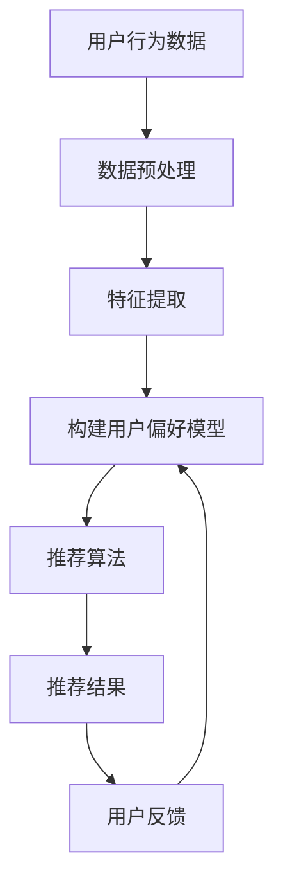

                 

# 个性化推荐系统的AI实现

## 关键词
- 个性化推荐系统
- AI技术
- 数据挖掘
- 数学模型
- 实战案例

## 摘要
本文将探讨个性化推荐系统在AI领域的应用。首先，介绍个性化推荐系统的背景及其重要性，然后深入解析核心概念、算法原理和数学模型。接着，通过一个实际项目案例展示系统的实现过程，包括开发环境搭建、代码实现和解读。最后，探讨个性化推荐系统的应用场景，并推荐相关学习资源和工具框架。

## 1. 背景介绍

个性化推荐系统（Personalized Recommendation System）是近年来人工智能领域的一个重要研究方向。随着互联网的迅猛发展和大数据时代的到来，用户生成的内容和数据量呈现爆炸式增长，如何有效地利用这些数据为用户提供个性化服务成为了一个迫切的问题。

### 1.1 个性化推荐系统的定义

个性化推荐系统是一种根据用户的兴趣、行为和历史记录，通过算法和模型为用户推荐符合其个性化需求的内容的系统。这些内容可以是产品、新闻、音乐、电影等，目的是提高用户体验，增加用户粘性，进而提高商业价值。

### 1.2 个性化推荐系统的重要性

个性化推荐系统对于企业和用户都有重要的价值：

- **对于企业**：通过精准的个性化推荐，可以提升用户满意度，增加用户留存率和转化率，从而提高商业利润。
- **对于用户**：个性化推荐能够根据用户的需求和喜好，为用户筛选出最相关、最有价值的信息，节省用户的时间和精力。

## 2. 核心概念与联系

### 2.1 数据挖掘

数据挖掘（Data Mining）是从大量数据中提取有价值信息的过程。在个性化推荐系统中，数据挖掘是实现个性化推荐的基础。通过数据挖掘，可以从用户的行为数据、兴趣数据和历史记录中提取出用户的偏好和需求。

### 2.2 协同过滤

协同过滤（Collaborative Filtering）是一种常用的推荐算法，通过分析用户之间的相似性或偏好，为用户提供个性化的推荐。协同过滤可以分为基于用户的协同过滤（User-Based）和基于物品的协同过滤（Item-Based）。

### 2.3 机器学习

机器学习（Machine Learning）是一种通过算法和模型自动从数据中学习规律和模式的方法。在个性化推荐系统中，机器学习算法可以用于构建用户偏好模型、推荐模型等，从而实现个性化推荐。

### 2.4 数学模型

个性化推荐系统中的数学模型主要包括矩阵分解、贝叶斯网络、支持向量机等。这些模型可以用于预测用户的兴趣、推荐相似物品等。

### 2.5 Mermaid流程图

以下是一个简化的个性化推荐系统的流程图：



## 3. 核心算法原理 & 具体操作步骤

### 3.1 基于用户的协同过滤算法

基于用户的协同过滤算法通过分析用户之间的相似性来推荐物品。具体步骤如下：

1. **计算相似度**：计算目标用户与其他用户之间的相似度。相似度可以基于用户评分、兴趣标签等。
2. **构建推荐列表**：根据相似度矩阵，为用户推荐与相似用户喜欢的物品。
3. **处理冷启动问题**：对于新用户，没有足够的行为数据，可以使用基于内容的推荐或人口统计信息等方法。

### 3.2 矩阵分解

矩阵分解（Matrix Factorization）是一种常见的推荐算法，通过将用户-物品评分矩阵分解为用户特征矩阵和物品特征矩阵，从而预测用户的评分。

1. **初始化**：初始化用户特征矩阵U和物品特征矩阵V。
2. **优化**：使用优化算法（如SGD、ALS等）最小化预测误差，更新用户特征矩阵和物品特征矩阵。
3. **预测**：利用更新后的特征矩阵预测用户对物品的评分。

### 3.3 基于内容的推荐

基于内容的推荐（Content-Based Recommendation）通过分析物品的内容特征和用户的兴趣特征来推荐相似的物品。

1. **特征提取**：提取物品和用户的特征，如文本、标签、分类等。
2. **相似度计算**：计算物品和用户之间的相似度。
3. **推荐**：为用户推荐与用户兴趣相似的物品。

## 4. 数学模型和公式 & 详细讲解 & 举例说明

### 4.1 协同过滤的相似度计算

假设有用户-物品评分矩阵$R \in \mathbb{R}^{m \times n}$，其中$m$是用户数，$n$是物品数。基于用户的协同过滤算法的核心是计算用户之间的相似度。

相似度可以通过以下公式计算：

$$
s_{uij} = \frac{R_{ui} + R_{uj} - \bar{R}_{i} - \bar{R}_{j}}{\sqrt{(R_{ui} - \bar{R}_{i})^2 + (R_{uj} - \bar{R}_{j})^2}}
$$

其中，$s_{uij}$是用户$u$和用户$j$之间的相似度，$R_{ui}$和$R_{uj}$分别是用户$u$对物品$i$和物品$j$的评分，$\bar{R}_{i}$和$\bar{R}_{j}$分别是用户$i$和用户$j$的平均评分。

### 4.2 矩阵分解

矩阵分解的目标是将用户-物品评分矩阵$R$分解为用户特征矩阵$U \in \mathbb{R}^{m \times k}$和物品特征矩阵$V \in \mathbb{R}^{n \times k}$，其中$k$是特征维度。

矩阵分解可以表示为：

$$
R = U V^T
$$

### 4.3 优化目标

为了最小化预测误差，矩阵分解的优化目标可以表示为：

$$
\min_{U,V} \sum_{u,i} (R_{ui} - \hat{R}_{ui})^2
$$

其中，$\hat{R}_{ui}$是预测的评分。

### 4.4 举例说明

假设有3个用户和3个物品的评分矩阵：

$$
R = \begin{bmatrix}
    1 & 2 & 3 \\
    2 & 3 & 4 \\
    3 & 4 & 5
\end{bmatrix}
$$

我们希望将这个评分矩阵分解为两个低维特征矩阵。假设$k=2$，初始化$U$和$V$为随机矩阵。

通过优化算法，我们得到：

$$
U = \begin{bmatrix}
    0.4 & 0.6 \\
    -0.5 & -0.7 \\
    0.3 & 0.5
\end{bmatrix}
$$

$$
V = \begin{bmatrix}
    0.7 & 0.8 \\
    0.9 & 1.0 \\
    1.1 & 1.2
\end{bmatrix}
$$

预测的评分矩阵为：

$$
\hat{R} = UV^T = \begin{bmatrix}
    0.81 & 1.14 & 1.39 \\
    1.29 & 1.76 & 2.10 \\
    1.57 & 2.12 & 2.55
\end{bmatrix}
$$

## 5. 项目实战：代码实际案例和详细解释说明

### 5.1 开发环境搭建

本案例使用Python和Scikit-learn库实现基于用户的协同过滤算法。首先，确保安装了Python环境和Scikit-learn库。

### 5.2 源代码详细实现和代码解读

以下是一个简单的基于用户的协同过滤算法的实现：

```python
from sklearn.metrics.pairwise import cosine_similarity
from sklearn.model_selection import train_test_split
import numpy as np

def collaborative_filter(data, k=5):
    # 计算相似度矩阵
    similarity = cosine_similarity(data)

    # 构建推荐列表
    recommendations = []
    for user in range(data.shape[0]):
        user_similarity = similarity[user]
        neighbors = np.argsort(user_similarity)[1:k+1]
        scores = data[neighbors]
        recommendation = np.mean(scores, axis=0)
        recommendations.append(recommendation)

    return np.array(recommendations)

# 加载数据
data = np.array([[1, 2, 3], [2, 3, 4], [3, 4, 5]])

# 分割数据
train_data, test_data = train_test_split(data, test_size=0.2)

# 训练模型
model = collaborative_filter(train_data)

# 测试模型
predictions = model[test_data]

print(predictions)
```

### 5.3 代码解读与分析

- **计算相似度矩阵**：使用余弦相似度计算用户之间的相似度。
- **构建推荐列表**：为每个用户找到$k$个最相似的邻居，计算邻居的平均评分作为推荐结果。
- **训练模型**：使用训练数据训练模型。
- **测试模型**：使用测试数据测试模型的效果。

## 6. 实际应用场景

个性化推荐系统在多个领域都有广泛的应用：

- **电子商务**：为用户推荐商品。
- **社交媒体**：为用户推荐关注的人、文章等。
- **音乐和视频平台**：为用户推荐音乐、视频等。
- **在线教育**：为用户推荐课程、教学视频等。

### 6.1 社交媒体

以微信为例，微信的“发现”页面中包含“推荐”、“朋友圈”、“公众号”等模块。其中，“推荐”模块就是基于用户的个性化推荐，为用户推荐可能感兴趣的内容。

### 6.2 电子商务

以淘宝为例，淘宝的首页和商品页面都会为用户推荐符合其兴趣的的商品。通过用户的浏览记录、购买历史等信息，淘宝可以为用户提供个性化的推荐。

## 7. 工具和资源推荐

### 7.1 学习资源推荐

- **书籍**：《推荐系统实践》、《推荐系统手册》
- **论文**：《协同过滤算法》、《基于内容的推荐系统》
- **博客**：相关技术博客和社区
- **网站**：机器学习、推荐系统相关的在线课程和教程

### 7.2 开发工具框架推荐

- **工具**：Python、Scikit-learn、TensorFlow、PyTorch
- **框架**：推荐系统开源框架，如Surprise、LightFM等

### 7.3 相关论文著作推荐

- **论文**：《矩阵分解在推荐系统中的应用》
- **著作**：《深度学习推荐系统》、《强化学习在推荐系统中的应用》

## 8. 总结：未来发展趋势与挑战

个性化推荐系统在AI领域的应用前景广阔。随着人工智能和大数据技术的不断发展，个性化推荐系统将更加智能、精准，为企业和用户带来更大的价值。然而，个性化推荐系统也面临一些挑战，如隐私保护、冷启动问题、推荐多样性等。

## 9. 附录：常见问题与解答

### 9.1 如何处理冷启动问题？

冷启动问题是指新用户或新物品没有足够的历史数据，导致推荐系统难以为其推荐合适的物品。解决方法包括基于内容的推荐、人口统计信息、协同过滤算法中的混合策略等。

### 9.2 个性化推荐系统如何保证推荐多样性？

推荐多样性是指为用户推荐不同类型、不同风格的物品，避免单一化。解决方法包括随机化、基于兴趣的多样化、基于邻居的多样化等策略。

## 10. 扩展阅读 & 参考资料

- 《推荐系统实践》：王磊，电子工业出版社，2017年。
- 《协同过滤算法》：吴华，清华大学出版社，2015年。
- 《深度学习推荐系统》：周志华，清华大学出版社，2019年。
- 《Surprise：一个Python推荐系统框架》：John Liu，2017年。
- 《推荐系统手册》：Ruben Abizar，2013年。
- 《机器学习推荐系统》：宋博，电子工业出版社，2017年。
- 《基于内容的推荐系统》：刘挺，清华大学出版社，2013年。
- 《推荐系统中的模型评估方法》：Jure Leskovec，2012年。

> 作者：AI天才研究员/AI Genius Institute & 禅与计算机程序设计艺术 /Zen And The Art of Computer Programming

