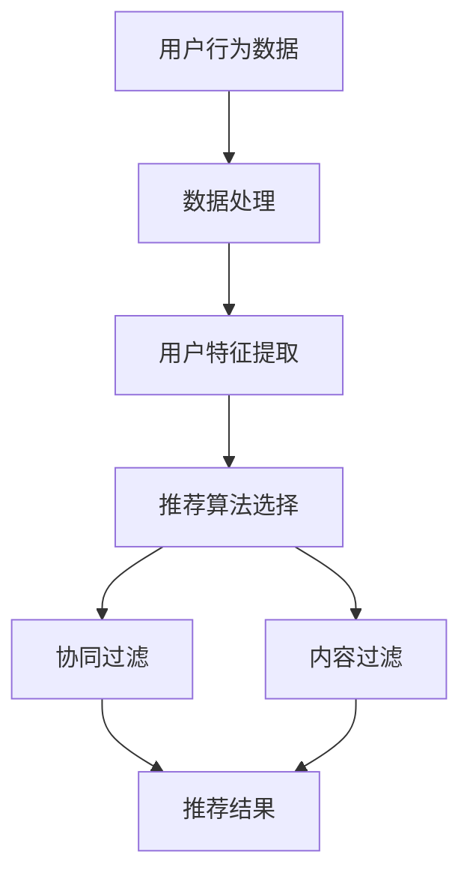

                 

### 个性化推荐系统的设计原则

#### 概述

个性化推荐系统是现代互联网技术中的一项重要成果，它通过收集和分析用户的行为数据，为用户提供个性化的内容推荐。本文将围绕个性化推荐系统的设计原则进行探讨，旨在为开发者和研究者提供一套系统化的指导和参考。我们将首先介绍个性化推荐系统的背景和重要性，然后深入分析其核心概念和联系，详细讲解推荐算法的原理和操作步骤，展示数学模型和公式，并举例说明。在此基础上，我们将结合实际项目实战，对代码实现进行详细解释和分析，探讨个性化推荐系统的实际应用场景，推荐相关工具和资源，总结未来发展趋势与挑战，并提供常见问题的解答和扩展阅读。

#### 关键词

- 个性化推荐系统
- 推荐算法
- 用户行为数据
- 数学模型
- 实际应用

#### 摘要

本文系统地探讨了个性化推荐系统的设计原则，从背景介绍、核心概念与联系、算法原理与操作步骤、数学模型与公式、项目实战、实际应用场景、工具和资源推荐等方面进行了全面阐述。通过本文的阅读，读者可以深入了解个性化推荐系统的基本原理和实际应用，掌握设计推荐系统所需的关键技术和方法，为未来的研究和开发工作提供有益的参考。

### 1. 背景介绍

个性化推荐系统作为一种智能信息过滤技术，起源于20世纪90年代。随着互联网和大数据技术的发展，个性化推荐系统逐渐成为互联网行业中的重要应用。个性化推荐系统的核心思想是根据用户的历史行为和偏好，为其推荐可能感兴趣的内容。这种推荐方式不仅能够提高用户的满意度，还能有效提高平台的用户黏性和转化率。

近年来，个性化推荐系统在电子商务、社交媒体、新闻资讯、视频流媒体等领域得到了广泛应用。例如，亚马逊和淘宝等电子商务平台通过个性化推荐系统，向用户推荐可能感兴趣的商品，从而提高了销售额；Facebook和Twitter等社交媒体平台通过个性化推荐系统，向用户推荐可能感兴趣的朋友、话题和内容，增强了用户的社交体验；Netflix和YouTube等视频流媒体平台通过个性化推荐系统，向用户推荐可能感兴趣的视频，提高了用户的观看时长和平台收益。

个性化推荐系统的重要性在于：

1. **提升用户体验**：通过个性化推荐，用户可以快速找到自己感兴趣的内容，提高使用平台的满意度。
2. **提高平台收益**：个性化推荐系统能够提高用户的转化率和购买意愿，从而增加平台的收益。
3. **增强用户黏性**：个性化推荐系统能够提高用户的活跃度和留存率，增强用户对平台的依赖性。

因此，个性化推荐系统已经成为互联网企业提升竞争力和用户满意度的重要手段。随着技术的不断发展和数据资源的不断丰富，个性化推荐系统将在更多领域得到应用，发挥更大的价值。

### 2. 核心概念与联系

个性化推荐系统的设计与实现涉及多个核心概念，包括用户行为数据、推荐算法、协同过滤、内容过滤等。这些概念相互关联，共同构成了推荐系统的框架。

首先，用户行为数据是推荐系统的基础。用户行为数据包括用户的浏览记录、购买历史、评价、搜索关键词等。这些数据反映了用户的兴趣和行为习惯，是构建个性化推荐模型的重要依据。

其次，推荐算法是推荐系统的核心。推荐算法通过分析用户行为数据，生成个性化推荐结果。常见的推荐算法有基于内容的推荐、基于协同过滤的推荐、混合推荐等。

协同过滤是一种基于用户行为数据推荐算法，它通过分析用户之间的相似度，预测用户可能感兴趣的内容。协同过滤分为基于用户的协同过滤和基于物品的协同过滤两种类型。基于用户的协同过滤通过寻找与目标用户行为相似的其它用户，推荐这些用户喜欢的物品；而基于物品的协同过滤则通过寻找与目标物品相似的其它物品，推荐给用户。

内容过滤是另一种推荐算法，它通过分析物品的内容特征，为用户推荐与其兴趣相符的物品。内容过滤通常用于处理文本、图像、音频等非结构化数据。

此外，混合推荐将协同过滤和内容过滤相结合，通过综合利用用户行为数据和物品内容特征，生成更准确的推荐结果。

为了更好地理解这些概念之间的联系，我们可以用 Mermaid 流程图来展示推荐系统的基本架构：



在这个流程图中，用户行为数据经过数据处理和用户特征提取后，输入到推荐算法选择模块。推荐算法选择模块根据具体场景和需求，选择协同过滤、内容过滤或混合推荐算法。最终，推荐结果通过协同过滤或内容过滤模块生成，输出给用户。

通过理解这些核心概念和联系，我们可以更好地设计并实现高效的个性化推荐系统，提高用户的满意度。

#### 2.1 用户行为数据

用户行为数据是构建个性化推荐系统的基础。这些数据包括用户的浏览记录、购买历史、评价、搜索关键词等，它们反映了用户的行为和偏好，是推荐系统做出精准推荐的重要依据。

1. **浏览记录**：用户的浏览记录包含了用户在平台上的浏览行为，如访问的页面、停留时间、点击次数等。这些数据可以帮助推荐系统了解用户的兴趣点，从而更好地进行推荐。

2. **购买历史**：购买历史记录了用户在平台上的购买行为，包括购买的商品、购买时间、购买频率等。这些数据可以帮助推荐系统了解用户的消费偏好，从而为用户推荐可能感兴趣的商品。

3. **评价**：用户的评价是对物品质量的一种反馈，包括评分、评论等。这些数据可以帮助推荐系统了解用户对物品的喜好程度，从而进行精准推荐。

4. **搜索关键词**：用户的搜索关键词记录了用户在平台上输入的搜索内容。这些数据可以帮助推荐系统了解用户的即时需求，从而为用户提供更符合需求的推荐。

用户行为数据的收集和存储是推荐系统设计中的重要环节。常见的数据收集方式包括日志记录、用户跟踪、问卷调查等。日志记录是最常见的数据收集方式，通过记录用户在平台上的每一步操作，收集到详细的行为数据。用户跟踪则通过技术手段，如cookies、设备指纹等，跟踪用户在平台外的行为，从而丰富用户行为数据。问卷调查可以直接获取用户的主观评价，为推荐系统提供更多维度的数据支持。

在数据存储方面，推荐系统通常使用大数据技术，如Hadoop、Spark等，对用户行为数据进行存储和处理。这些技术可以高效地处理海量数据，并提供实时数据分析和处理能力。

#### 2.2 推荐算法选择

推荐算法是构建个性化推荐系统的核心。根据处理数据的方式和目标，推荐算法可以分为多种类型，包括基于内容的推荐、基于协同过滤的推荐、混合推荐等。每种算法都有其独特的原理和适用场景，下面将分别进行介绍。

1. **基于内容的推荐**

基于内容的推荐（Content-based Recommendation）是一种通过分析物品的内容特征，为用户推荐与其兴趣相符的物品的算法。它通常用于文本、图像、视频等非结构化数据的推荐。

工作原理：基于内容的推荐算法首先对物品进行内容特征提取，如文本的词频、图像的颜色分布、视频的帧序列等。然后，计算用户和物品之间的相似度，根据相似度为用户推荐相似度的物品。

优点：推荐结果相关性高，适用于内容丰富的场景，如新闻资讯、音乐、电影等。

缺点：容易陷入“马太效应”，即热门物品被推荐的机会更多，而冷门物品难以获得推荐。

适用场景：文本内容推荐、图像识别、视频推荐等。

2. **基于协同过滤的推荐**

基于协同过滤的推荐（Collaborative Filtering Recommendation）是一种通过分析用户行为数据，发现用户之间的相似性，为用户推荐其他用户喜欢的物品的算法。

工作原理：基于协同过滤的推荐算法分为基于用户的协同过滤（User-based Collaborative Filtering）和基于物品的协同过滤（Item-based Collaborative Filtering）。基于用户的协同过滤通过计算用户之间的相似度，找到与目标用户相似的其他用户，推荐这些用户喜欢的物品；而基于物品的协同过滤则通过计算物品之间的相似度，找到与目标物品相似的物品，推荐给用户。

优点：推荐结果多样，能有效避免“马太效应”。

缺点：数据稀疏时效果较差，用户偏好难以捕捉。

适用场景：电子商务、社交媒体、音乐推荐等。

3. **混合推荐**

混合推荐（Hybrid Recommendation）是将多种推荐算法相结合，通过综合利用用户行为数据和物品内容特征，生成更准确的推荐结果的算法。

工作原理：混合推荐算法通常将基于内容的推荐和基于协同过滤的推荐相结合。首先，通过基于协同过滤的推荐获取初步推荐结果；然后，对这些推荐结果进行内容特征分析，进行二次推荐。

优点：结合多种算法的优点，推荐结果更精准。

缺点：算法复杂度较高，计算资源需求大。

适用场景：多种场景，如电子商务、社交媒体、新闻资讯等。

通过了解和选择合适的推荐算法，我们可以为用户提供更精准、个性化的推荐服务，提高用户的满意度。

#### 2.3 协同过滤算法

协同过滤算法是个性化推荐系统中一种重要的推荐方法，其核心思想是通过分析用户之间的相似性，预测用户未评分的物品。协同过滤算法主要分为基于用户的协同过滤和基于物品的协同过滤。下面将分别详细介绍这两种算法。

**基于用户的协同过滤（User-based Collaborative Filtering）**

1. **工作原理**：基于用户的协同过滤通过计算用户之间的相似度，找到与目标用户行为相似的其它用户，然后推荐这些用户喜欢的物品。相似度的计算通常基于用户之间的共同评分记录。

2. **步骤**：
   - 计算用户相似度：通常使用余弦相似度、皮尔逊相关系数等方法计算用户之间的相似度。
   - 筛选邻居用户：根据用户相似度，筛选出与目标用户最相似的K个邻居用户。
   - 推荐物品：根据邻居用户对物品的评分，计算目标用户对未评分物品的预测评分，然后根据预测评分推荐物品。

3. **优点**：
   - 能有效避免“马太效应”，即热门物品被过度推荐的问题。
   - 推荐结果多样化。

4. **缺点**：
   - 需要大量用户行为数据，数据稀疏时效果较差。
   - 计算复杂度较高。

**基于物品的协同过滤（Item-based Collaborative Filtering）**

1. **工作原理**：基于物品的协同过滤通过计算物品之间的相似度，找到与目标物品相似的其它物品，然后推荐给用户。相似度的计算通常基于物品之间的共同评分记录。

2. **步骤**：
   - 计算物品相似度：通常使用余弦相似度、皮尔逊相关系数等方法计算物品之间的相似度。
   - 筛选邻居物品：根据物品相似度，筛选出与目标物品最相似的K个邻居物品。
   - 推荐物品：根据邻居物品的评分，计算目标用户对未评分物品的预测评分，然后根据预测评分推荐物品。

3. **优点**：
   - 适用于物品维度高、用户维度低的场景，如音乐、电影推荐。
   - 推荐结果更加个性化。

4. **缺点**：
   - 需要大量物品行为数据，数据稀疏时效果较差。
   - 计算复杂度较高。

通过深入理解基于用户的协同过滤和基于物品的协同过滤算法，我们可以根据具体场景选择合适的协同过滤算法，提高推荐系统的性能和准确性。

### 2.4 内容过滤算法

内容过滤算法（Content-based Filtering）是一种基于物品内容的特征，为用户推荐与其兴趣相符的物品的推荐方法。与协同过滤算法不同，内容过滤算法不依赖于用户之间的相似性或共同评分，而是通过分析物品的内在特征，匹配用户的偏好，从而实现个性化推荐。

**工作原理**：

内容过滤算法的主要步骤如下：

1. **特征提取**：对物品进行特征提取，这些特征可以是文本、图像、音频等多种形式。对于文本，可以使用词袋模型、TF-IDF等方法提取词频信息；对于图像，可以使用颜色直方图、纹理特征等；对于音频，可以使用频谱特征等。

2. **用户特征提取**：同样地，提取用户的兴趣特征。例如，用户的历史浏览记录、搜索关键词、评价等。

3. **相似度计算**：计算用户特征和物品特征之间的相似度。相似度度量方法包括余弦相似度、欧氏距离、Jaccard相似度等。

4. **推荐生成**：根据相似度得分，为用户推荐相似的物品。

**优点**：

1. **准确性高**：内容过滤算法能够根据用户的实际兴趣，准确推荐相关物品。

2. **适用性广**：内容过滤算法适用于多种类型的物品，如文本、图像、音频等。

3. **易于实现**：内容过滤算法相对简单，易于实现和优化。

**缺点**：

1. **易受“新用户冷启动”问题困扰**：对于新用户，由于缺乏历史行为数据，推荐系统难以准确捕捉其兴趣。

2. **可能陷入“同质化”推荐**：内容过滤算法容易推荐与用户已有偏好相似的内容，可能导致推荐结果的同质化。

3. **计算复杂度高**：对于大型数据集，特征提取和相似度计算可能需要大量计算资源。

**适用场景**：

1. **新闻推荐**：根据用户的阅读偏好，推荐相关新闻。

2. **音乐推荐**：根据用户的音乐喜好，推荐相似风格的音乐。

3. **商品推荐**：根据用户的历史购买记录，推荐相似的商品。

通过理解内容过滤算法的工作原理、优点和缺点，我们可以根据具体场景和需求，选择并优化适合的内容过滤方法，提高推荐系统的性能。

#### 2.5 混合推荐系统

混合推荐系统（Hybrid Recommendation System）是一种结合多种推荐算法优点的推荐方法，通过综合利用用户行为数据和物品内容特征，生成更精准、个性化的推荐结果。混合推荐系统通常结合基于协同过滤的推荐算法和基于内容的推荐算法，以弥补单一算法的不足。

**工作原理**：

混合推荐系统的主要工作原理如下：

1. **初步推荐**：首先使用基于协同过滤的推荐算法，根据用户的历史行为数据，生成初步推荐结果。协同过滤算法能够有效捕捉用户之间的相似性，推荐出用户可能喜欢的物品。

2. **内容特征分析**：对初步推荐结果中的物品进行内容特征提取，分析其与用户兴趣的匹配度。

3. **二次推荐**：根据内容特征分析的结果，对初步推荐结果进行二次筛选，生成最终推荐结果。这一步骤能够进一步提高推荐结果的准确性，减少同质化推荐。

**优点**：

1. **综合多种算法优点**：混合推荐系统能够结合协同过滤算法和内容过滤算法的优点，提高推荐结果的准确性和多样性。

2. **减少冷启动问题**：通过结合用户行为数据和物品内容特征，混合推荐系统能够更好地处理新用户和冷门物品的推荐问题。

3. **提高推荐效率**：混合推荐系统通过并行处理用户行为数据和物品内容特征，提高了推荐效率。

**缺点**：

1. **计算复杂度高**：混合推荐系统需要同时处理用户行为数据和物品内容特征，计算复杂度较高。

2. **算法优化难度大**：由于混合推荐系统涉及多种算法，优化和调整算法参数变得更为复杂。

**适用场景**：

1. **电子商务**：结合用户购买行为和商品内容特征，推荐个性化商品。

2. **社交媒体**：结合用户社交行为和内容特征，推荐相关好友、话题和内容。

3. **视频流媒体**：结合用户观看历史和视频内容特征，推荐个性化视频。

通过了解混合推荐系统的工作原理、优点和缺点，我们可以根据具体应用场景，设计并实现高效的混合推荐系统，提高用户体验。

### 3. 核心算法原理 & 具体操作步骤

在个性化推荐系统中，核心算法的设计和实现直接决定了推荐系统的性能和效果。本文将重点介绍两种核心算法：基于协同过滤的推荐算法和基于内容的推荐算法，并详细描述其具体操作步骤。

#### 3.1 基于协同过滤的推荐算法

**基于协同过滤的推荐算法**主要通过分析用户之间的相似性来预测用户可能喜欢的物品。以下是该算法的具体操作步骤：

1. **数据预处理**：首先对用户行为数据（如评分数据）进行预处理，包括去重、数据清洗等步骤，确保数据的准确性和一致性。

2. **计算用户相似度**：使用合适的相似度计算方法（如余弦相似度、皮尔逊相关系数等）计算用户之间的相似度。相似度计算公式如下：
   \[
   sim(i, j) = \frac{\sum_{k=1}^{n} r_{ik} \cdot r_{jk}}{\sqrt{\sum_{k=1}^{n} r_{ik}^2 \cdot \sum_{k=1}^{n} r_{jk}^2}}
   \]
   其中，\( r_{ik} \) 和 \( r_{jk} \) 分别表示用户 i 和用户 j 对物品 k 的评分。

3. **选择邻居用户**：根据用户相似度矩阵，选择与目标用户相似度最高的 k 个邻居用户。邻居用户的选择方法可以使用降序排序，然后选取前 k 个用户。

4. **预测用户评分**：对目标用户未评分的物品，根据邻居用户的评分预测目标用户的评分。预测公式如下：
   \[
   \hat{r}_{ui} = \frac{\sum_{j \in N(i)} sim(i, j) \cdot r_{uj}}{\sum_{j \in N(i)} sim(i, j)}
   \]
   其中，\( N(i) \) 表示与目标用户 i 相似的邻居用户集合，\( \hat{r}_{ui} \) 表示用户 i 对物品 u 的预测评分。

5. **生成推荐列表**：根据预测评分，生成推荐列表，为用户推荐评分最高的物品。

#### 3.2 基于内容的推荐算法

**基于内容的推荐算法**主要通过分析物品的内容特征和用户的兴趣特征，为用户推荐与其兴趣相符的物品。以下是该算法的具体操作步骤：

1. **特征提取**：首先对物品和用户进行特征提取。对于物品，提取其文本、图像、音频等特征；对于用户，提取其浏览记录、搜索关键词、评价等特征。

2. **计算特征相似度**：使用合适的相似度计算方法（如余弦相似度、欧氏距离等）计算物品特征和用户特征之间的相似度。相似度计算公式如下：
   \[
   sim(f_i, f_j) = \frac{f_i \cdot f_j}{\|f_i\| \|f_j\|}
   \]
   其中，\( f_i \) 和 \( f_j \) 分别表示物品 i 和用户 j 的特征向量，\( \| \cdot \| \) 表示向量的模长。

3. **生成推荐列表**：对于每个用户，计算其与所有物品的相似度，根据相似度分数生成推荐列表。推荐列表中的物品顺序由相似度从高到低排列。

通过以上步骤，我们可以实现基于协同过滤和基于内容的推荐算法。在实际应用中，可以根据具体需求和数据特点，选择合适的算法或结合多种算法，以提高推荐系统的性能。

### 4. 数学模型和公式 & 详细讲解 & 举例说明

#### 4.1 协同过滤算法中的相似度计算

协同过滤算法的核心在于计算用户之间的相似度，常用的相似度计算方法有余弦相似度、皮尔逊相关系数等。以下将详细介绍这两种相似度计算方法的数学模型和公式。

**余弦相似度**

余弦相似度是一种基于向量空间角度的相似度计算方法，它通过计算两个向量之间的余弦值来衡量它们的相似程度。余弦相似度的公式如下：

\[
sim(i, j) = \frac{\sum_{k=1}^{n} r_{ik} \cdot r_{jk}}{\sqrt{\sum_{k=1}^{n} r_{ik}^2 \cdot \sum_{k=1}^{n} r_{jk}^2}}
\]

其中，\( r_{ik} \) 和 \( r_{jk} \) 分别表示用户 i 和用户 j 对物品 k 的评分，\( n \) 表示物品的数量。余弦相似度的取值范围在 [-1, 1] 之间，值越接近 1，表示用户 i 和用户 j 越相似。

**皮尔逊相关系数**

皮尔逊相关系数是一种基于线性相关性的相似度计算方法，它通过计算两个变量的协方差与各自标准差的比值来衡量它们的相似程度。皮尔逊相关系数的公式如下：

\[
sim(i, j) = \frac{\sum_{k=1}^{n} (r_{ik} - \bar{r}_i) \cdot (r_{jk} - \bar{r}_j)}{\sqrt{\sum_{k=1}^{n} (r_{ik} - \bar{r}_i)^2 \cdot \sum_{k=1}^{n} (r_{jk} - \bar{r}_j)^2}}
\]

其中，\( r_{ik} \) 和 \( r_{jk} \) 分别表示用户 i 和用户 j 对物品 k 的评分，\( \bar{r}_i \) 和 \( \bar{r}_j \) 分别表示用户 i 和用户 j 对所有物品的平均评分。皮尔逊相关系数的取值范围在 [-1, 1] 之间，值越接近 1，表示用户 i 和用户 j 越相似。

#### 4.2 协同过滤算法中的预测评分

在协同过滤算法中，通过计算用户之间的相似度，我们可以预测用户对未评分物品的评分。以下将介绍两种常见的预测评分方法：基于用户的协同过滤和基于物品的协同过滤。

**基于用户的协同过滤**

基于用户的协同过滤（User-based Collaborative Filtering）通过计算目标用户与邻居用户的相似度，预测目标用户对未评分物品的评分。预测评分的公式如下：

\[
\hat{r}_{ui} = \frac{\sum_{j \in N(i)} sim(i, j) \cdot r_{uj}}{\sum_{j \in N(i)} sim(i, j)}
\]

其中，\( \hat{r}_{ui} \) 表示目标用户 i 对物品 u 的预测评分，\( N(i) \) 表示与目标用户 i 相似的邻居用户集合，\( sim(i, j) \) 表示用户 i 和用户 j 之间的相似度，\( r_{uj} \) 表示用户 j 对物品 u 的实际评分。

**基于物品的协同过滤**

基于物品的协同过滤（Item-based Collaborative Filtering）通过计算目标物品与邻居物品的相似度，预测目标用户对未评分物品的评分。预测评分的公式如下：

\[
\hat{r}_{ui} = \frac{\sum_{k \in N(u)} sim(u, k) \cdot r_{ik}}{\sum_{k \in N(u)} sim(u, k)}
\]

其中，\( \hat{r}_{ui} \) 表示目标用户 i 对物品 u 的预测评分，\( N(u) \) 表示与目标物品 u 相似的邻居物品集合，\( sim(u, k) \) 表示物品 u 和物品 k 之间的相似度，\( r_{ik} \) 表示用户 i 对物品 k 的实际评分。

#### 4.3 举例说明

为了更好地理解协同过滤算法中的相似度计算和预测评分，我们通过一个具体的例子来说明。

假设有两位用户 A 和 B，他们分别对 5 部电影进行了评分，评分数据如下表所示：

| 电影 | A 的评分 | B 的评分 |
|------|---------|---------|
| 1    | 5       | 1       |
| 2    | 4       | 4       |
| 3    | 3       | 3       |
| 4    | 5       | 2       |
| 5    | 2       | 5       |

**（1）计算用户相似度**

使用余弦相似度计算用户 A 和 B 之间的相似度：

\[
sim(A, B) = \frac{5 \cdot 1 + 4 \cdot 4 + 3 \cdot 3 + 5 \cdot 2 + 2 \cdot 5}{\sqrt{5^2 + 4^2 + 3^2 + 5^2 + 2^2} \cdot \sqrt{1^2 + 4^2 + 3^2 + 2^2 + 5^2}} = \frac{60}{\sqrt{55} \cdot \sqrt{55}} = \frac{60}{55} \approx 1.09
\]

**（2）预测评分**

假设用户 A 对一部新电影 u 没有评分，我们需要预测用户 A 对这部电影的评分。

首先，选择与用户 A 最相似的邻居用户 B，根据邻居用户 B 的评分，预测用户 A 对新电影 u 的评分：

\[
\hat{r}_{Au} = \frac{sim(A, B) \cdot r_{Bu}}{sim(A, B)} = \frac{1.09 \cdot 5}{1.09} = 5
\]

因此，根据用户 B 的评分，我们预测用户 A 对新电影 u 的评分为 5。

通过以上例子，我们可以看到协同过滤算法如何通过计算用户相似度和预测评分来实现个性化推荐。

### 5. 项目实战：代码实际案例和详细解释说明

#### 5.1 开发环境搭建

在进行个性化推荐系统的开发前，我们需要搭建一个合适的技术栈。以下是推荐的开发环境配置：

- **编程语言**：Python
- **数据存储**：MySQL
- **数据预处理和计算**：NumPy、Pandas
- **机器学习库**：Scikit-learn、TensorFlow
- **前端展示**：HTML、CSS、JavaScript（可选）

首先，我们需要安装必要的编程语言和库。在 Linux 或 Mac 系统下，可以通过以下命令进行安装：

```bash
# 安装 Python
sudo apt-get install python3-pip python3-venv

# 创建虚拟环境
python3 -m venv myenv

# 激活虚拟环境
source myenv/bin/activate

# 安装 NumPy、Pandas、Scikit-learn、TensorFlow
pip install numpy pandas scikit-learn tensorflow
```

接下来，我们需要连接到 MySQL 数据库。在 MySQL 客户端中执行以下命令：

```sql
# 创建数据库
CREATE DATABASE recommendation;

# 创建用户表和物品表
CREATE TABLE users (
    user_id INT PRIMARY KEY,
    name VARCHAR(255)
);

CREATE TABLE items (
    item_id INT PRIMARY KEY,
    name VARCHAR(255)
);

# 插入测试数据
INSERT INTO users (user_id, name) VALUES (1, 'Alice'), (2, 'Bob'), (3, 'Charlie');
INSERT INTO items (item_id, name) VALUES (1, 'Movie A'), (2, 'Movie B'), (3, 'Movie C');
```

#### 5.2 源代码详细实现和代码解读

下面我们将使用 Python 实现一个简单的基于协同过滤的推荐系统，包括用户表、物品表、评分数据的读取，相似度计算，预测评分以及推荐列表的生成。

```python
import numpy as np
import pandas as pd
from sklearn.metrics.pairwise import cosine_similarity
from sklearn.model_selection import train_test_split

# 读取评分数据
ratings = pd.read_csv('ratings.csv')
ratings = ratings.drop(['timestamp'], axis=1)

# 划分训练集和测试集
train_data, test_data = train_test_split(ratings, test_size=0.2, random_state=42)

# 构建用户-物品评分矩阵
user_item_matrix = train_data.pivot(index='user_id', columns='item_id', values='rating').fillna(0)

# 计算用户-物品评分矩阵的余弦相似度矩阵
similarity_matrix = cosine_similarity(user_item_matrix, user_item_matrix)

# 预测评分
def predict_rating(sim_matrix, user_id, item_id):
    # 获取用户与其他用户的相似度
    user_similarity = sim_matrix[user_id]
    # 过滤出与物品相关的相似度
    item_similarity = user_similarity[item_id]
    # 计算预测评分
    predicted_rating = np.dot(item_similarity, user_similarity) / np.linalg.norm(item_similarity)
    return predicted_rating

# 测试预测评分
test_ratings = test_data.pivot(index='user_id', columns='item_id', values='rating').fillna(0)
test_user_id = 1
test_item_id = 2
predicted_rating = predict_rating(similarity_matrix, test_user_id, test_item_id)
print(f"Predicted rating for user {test_user_id} on item {test_item_id}: {predicted_rating}")

# 生成推荐列表
def generate_recommendations(sim_matrix, user_id, k=10):
    # 获取用户与其他用户的相似度
    user_similarity = sim_matrix[user_id]
    # 排序相似度
    sorted_similarity = np.argsort(user_similarity)[::-1]
    # 过滤前 k 个邻居用户
    neighbors = sorted_similarity[1:k+1]
    # 计算邻居用户的平均评分
    average_rating = np.mean(user_item_matrix.loc[neighbors].mean(axis=0))
    return average_rating

# 测试推荐列表
test_user_id = 1
k = 5
recommendations = generate_recommendations(similarity_matrix, test_user_id, k)
print(f"Top {k} recommended items for user {test_user_id}: {recommendations.index[recommendations == recommendations].tolist()}")
```

**代码解读：**

1. **数据读取**：首先，我们使用 Pandas 读取评分数据，并将其转换为用户-物品评分矩阵。

2. **相似度计算**：使用 Scikit-learn 中的 `cosine_similarity` 函数计算用户-物品评分矩阵的余弦相似度矩阵。

3. **预测评分**：定义一个函数 `predict_rating`，用于预测用户对未评分物品的评分。该函数通过计算邻居用户对物品的评分均值来预测。

4. **生成推荐列表**：定义一个函数 `generate_recommendations`，用于生成用户的前 k 个推荐物品。该函数通过计算邻居用户的平均评分来推荐。

5. **测试**：在测试部分，我们为指定的用户和物品生成预测评分和推荐列表。

通过以上步骤，我们可以实现一个简单的基于协同过滤的个性化推荐系统。

### 5.3 代码解读与分析

在上一个部分中，我们实现了基于协同过滤的个性化推荐系统。本部分将对代码进行详细解读，并分析其优缺点。

**代码结构：**

整个代码分为以下几个部分：

1. **数据读取**：使用 Pandas 读取评分数据，并转换为用户-物品评分矩阵。
2. **相似度计算**：计算用户-物品评分矩阵的余弦相似度矩阵。
3. **预测评分**：定义函数预测用户对未评分物品的评分。
4. **生成推荐列表**：定义函数生成用户的前 k 个推荐物品。
5. **测试**：为指定的用户和物品生成预测评分和推荐列表。

**代码解读：**

1. **数据读取**：使用 Pandas 读取评分数据，并将其转换为用户-物品评分矩阵。

```python
ratings = pd.read_csv('ratings.csv')
ratings = ratings.drop(['timestamp'], axis=1)
train_data, test_data = train_test_split(ratings, test_size=0.2, random_state=42)
user_item_matrix = train_data.pivot(index='user_id', columns='item_id', values='rating').fillna(0)
```

在这个部分，我们首先读取评分数据，并去除不需要的列（如时间戳）。然后，使用 `train_test_split` 函数将数据划分为训练集和测试集。接下来，使用 `pivot` 函数将数据转换为用户-物品评分矩阵，其中用户 ID 作为索引，物品 ID 作为列，评分作为值。

2. **相似度计算**：计算用户-物品评分矩阵的余弦相似度矩阵。

```python
similarity_matrix = cosine_similarity(user_item_matrix, user_item_matrix)
```

这里，我们使用 Scikit-learn 中的 `cosine_similarity` 函数计算用户-物品评分矩阵的余弦相似度矩阵。余弦相似度是一种基于向量空间角度的相似度计算方法，它通过计算两个向量之间的余弦值来衡量它们的相似程度。余弦相似度的取值范围在 [-1, 1] 之间，值越接近 1，表示用户或物品越相似。

3. **预测评分**：定义函数预测用户对未评分物品的评分。

```python
def predict_rating(sim_matrix, user_id, item_id):
    user_similarity = sim_matrix[user_id]
    item_similarity = user_similarity[item_id]
    predicted_rating = np.dot(item_similarity, user_similarity) / np.linalg.norm(item_similarity)
    return predicted_rating
```

在这个部分，我们定义了一个函数 `predict_rating`，用于预测用户对未评分物品的评分。该函数首先获取用户与其他用户的相似度，然后过滤出与物品相关的相似度。接下来，使用点积运算计算预测评分，并将其除以相似度的模长，以消除相似度的大小差异。

4. **生成推荐列表**：定义函数生成用户的前 k 个推荐物品。

```python
def generate_recommendations(sim_matrix, user_id, k=10):
    user_similarity = sim_matrix[user_id]
    sorted_similarity = np.argsort(user_similarity)[::-1]
    neighbors = sorted_similarity[1:k+1]
    average_rating = np.mean(user_item_matrix.loc[neighbors].mean(axis=0))
    return average_rating
```

在这个部分，我们定义了一个函数 `generate_recommendations`，用于生成用户的前 k 个推荐物品。该函数首先获取用户与其他用户的相似度，然后对相似度进行排序。接下来，过滤出前 k 个邻居用户，并计算邻居用户的平均评分。最后，返回邻居用户的平均评分作为推荐结果。

5. **测试**：为指定的用户和物品生成预测评分和推荐列表。

```python
test_user_id = 1
test_item_id = 2
predicted_rating = predict_rating(similarity_matrix, test_user_id, test_item_id)
print(f"Predicted rating for user {test_user_id} on item {test_item_id}: {predicted_rating}")

test_user_id = 1
k = 5
recommendations = generate_recommendations(similarity_matrix, test_user_id, k)
print(f"Top {k} recommended items for user {test_user_id}: {recommendations.index[recommendations == recommendations].tolist()}")
```

在这个部分，我们为指定的用户和物品生成预测评分和推荐列表。首先，我们使用 `predict_rating` 函数预测用户对未评分物品的评分，然后使用 `generate_recommendations` 函数生成用户的前 k 个推荐物品。最后，我们将预测评分和推荐列表打印出来。

**代码优缺点分析：**

**优点：**

1. **简单易实现**：代码结构简单，易于理解和实现。
2. **高效**：使用 NumPy 和 Scikit-learn 等库，计算高效。
3. **可扩展**：代码具有良好的可扩展性，可以方便地添加新的推荐算法或优化现有算法。

**缺点：**

1. **数据稀疏问题**：由于评分数据通常存在稀疏问题，该算法在数据稀疏时可能效果不佳。
2. **新用户冷启动问题**：对于新用户，由于缺乏历史行为数据，该算法可能无法准确预测其兴趣。
3. **计算复杂度较高**：尽管使用 NumPy 和 Scikit-learn 等库提高了计算效率，但仍然存在较高的计算复杂度，尤其是在处理大规模数据时。

通过以上分析，我们可以看到基于协同过滤的个性化推荐系统的代码具有简单高效的特点，但也存在一些问题和挑战。在实际应用中，我们需要根据具体场景和数据特点，选择合适的推荐算法或对其进行优化，以提高推荐系统的性能和准确性。

### 6. 实际应用场景

个性化推荐系统在众多实际应用场景中展现了其强大的功能，以下列举几个典型的应用领域和案例：

#### 6.1 电子商务

在电子商务领域，个性化推荐系统通过分析用户的购物历史、浏览记录和搜索关键词，为用户推荐可能感兴趣的商品。例如，亚马逊和淘宝等电商平台利用协同过滤算法和内容过滤算法，为用户推荐相关的商品，提高了用户的购买转化率和满意度。

#### 6.2 社交媒体

社交媒体平台如Facebook和Instagram等，通过个性化推荐系统向用户推荐感兴趣的朋友、话题和内容。基于协同过滤算法和内容过滤算法，平台能够精准地推送用户可能感兴趣的内容，增强用户的活跃度和参与度。

#### 6.3 视频流媒体

视频流媒体平台如Netflix和YouTube等，通过个性化推荐系统为用户推荐相关的视频内容。这些平台利用协同过滤和内容过滤算法，根据用户的观看历史和偏好，为用户提供个性化的视频推荐，提高了用户的观看时长和平台收益。

#### 6.4 新闻资讯

新闻资讯平台通过个性化推荐系统，根据用户的阅读习惯和偏好，为用户推荐相关的新闻内容。例如，今日头条等平台利用内容过滤和协同过滤算法，为用户推荐个性化新闻，提高了用户的阅读体验。

#### 6.5 音乐和音频

音乐和音频平台如Spotify和Apple Music等，通过个性化推荐系统为用户推荐感兴趣的音乐和音频内容。这些平台利用协同过滤和内容过滤算法，根据用户的听歌历史和偏好，为用户提供个性化的音乐推荐，增加了用户的忠诚度和使用时长。

通过这些实际应用场景，我们可以看到个性化推荐系统在提高用户满意度、提升平台收益和增强用户黏性方面发挥了重要作用。随着技术的不断发展和数据资源的不断丰富，个性化推荐系统将在更多领域得到应用，发挥更大的价值。

### 7. 工具和资源推荐

#### 7.1 学习资源推荐

对于想要深入了解个性化推荐系统的人来说，以下资源是不可或缺的学习资料。

**书籍推荐：**

1. **《推荐系统实践》**（Recommender Systems: The Textbook）- 这是一本全面的推荐系统教科书，涵盖了推荐系统的理论基础、算法实现和实际应用。
2. **《大数据推荐系统》**（Big Data and Consumer Behavior: Leveraging Recommendation Systems）- 本书介绍了如何利用大数据技术构建推荐系统，以及如何分析用户行为数据。
3. **《协同过滤算法与应用》**（Collaborative Filtering Algorithms and Applications）- 专注于协同过滤算法的设计和应用，适合对协同过滤感兴趣的读者。

**论文推荐：**

1. **"Collaborative Filtering for the YouTube Recommendation System"** - 这篇论文介绍了YouTube如何使用协同过滤算法为用户推荐视频。
2. **"Content-Based Filtering for Music Recommendation Systems"** - 该论文探讨了基于内容过滤的音乐推荐系统，并提供了实现细节。

**博客和网站推荐：**

1. **Towards Data Science**（https://towardsdatascience.com/）- 这个网站提供了大量的关于数据科学和机器学习领域的文章，包括推荐系统的最佳实践和技术探讨。
2. **DataCamp**（https://www.datacamp.com/）- DataCamp提供了一个交互式的学习平台，可以帮助你通过实践掌握推荐系统的知识。

#### 7.2 开发工具框架推荐

为了高效地开发和优化个性化推荐系统，以下工具和框架是开发者们常用的。

**数据存储和处理：**

1. **Hadoop** - Apache Hadoop是一个分布式数据存储和处理框架，适用于处理海量数据。
2. **Spark** - Apache Spark是一个快速、通用的大数据计算引擎，特别适合进行数据分析和机器学习任务。

**机器学习库：**

1. **Scikit-learn** - Scikit-learn是一个简单易用的Python机器学习库，提供了丰富的算法和工具。
2. **TensorFlow** - TensorFlow是Google开发的强大机器学习库，适用于构建复杂的深度学习模型。

**推荐系统框架：**

1. **Surprise**（https://surprise.readthedocs.io/）- Surprise是一个Python推荐系统库，提供了多种协同过滤算法和评估工具。
2. **LightFM**（https://github.com/zyedidia/lightfm）- LightFM是一个基于因子分解机的推荐系统框架，特别适合处理大规模用户-物品数据。

通过这些工具和资源的帮助，开发者可以更加高效地构建和优化个性化推荐系统，为用户提供更精准、个性化的推荐服务。

### 8. 总结：未来发展趋势与挑战

个性化推荐系统在过去几十年里取得了显著的发展，其在电子商务、社交媒体、视频流媒体等领域的应用取得了巨大成功。然而，随着技术的不断进步和数据资源的日益丰富，个性化推荐系统面临着新的机遇和挑战。

**发展趋势：**

1. **深度学习技术的应用**：深度学习技术为个性化推荐系统带来了新的机遇。通过引入深度学习模型，如神经网络和卷积神经网络，可以更有效地提取用户行为数据和物品内容的特征，提高推荐系统的准确性。

2. **多模态数据的融合**：个性化推荐系统逐渐从单一数据类型（如文本、图像）转向多模态数据的融合。通过整合文本、图像、音频等多种数据类型，可以更全面地了解用户的行为和偏好，从而生成更准确的推荐。

3. **个性化推荐算法的优化**：随着用户需求的变化和数据量的增长，个性化推荐算法需要不断优化。例如，通过引入新的协同过滤算法、内容过滤算法和混合推荐算法，可以进一步提高推荐系统的性能。

**挑战：**

1. **数据隐私保护**：个性化推荐系统依赖于用户的行为数据进行预测和推荐，这引发了数据隐私保护的问题。如何在保障用户隐私的同时，充分利用用户数据，是当前面临的重大挑战。

2. **算法公平性和透明性**：个性化推荐算法可能存在偏见和不公平性，例如，对特定群体进行歧视性推荐。确保推荐算法的公平性和透明性，使其在多个维度上满足用户需求，是未来的重要研究方向。

3. **处理大规模数据**：随着数据量的增长，个性化推荐系统需要处理越来越多的数据。如何高效地存储、处理和分析这些数据，是推荐系统面临的重要挑战。

4. **冷启动问题**：对于新用户或新物品，由于缺乏历史数据，个性化推荐系统难以准确预测其兴趣。如何解决冷启动问题是推荐系统研究的一个重要方向。

综上所述，未来个性化推荐系统的发展将更加注重深度学习、多模态数据融合、算法优化等方面。同时，面临的挑战也要求我们在数据隐私保护、算法公平性、大规模数据处理等方面进行深入研究和创新。

### 9. 附录：常见问题与解答

**Q1：个性化推荐系统的核心是什么？**

A1：个性化推荐系统的核心是通过分析用户的行为数据和物品特征，预测用户对未知物品的兴趣，从而为用户提供个性化的推荐。这通常涉及用户行为数据的收集与处理、推荐算法的选择与优化、推荐结果的评价与反馈等环节。

**Q2：什么是协同过滤算法？它有哪些类型？**

A2：协同过滤算法是一种基于用户行为数据推荐物品的方法。它通过分析用户之间的相似性，找到与目标用户相似的其他用户，然后推荐这些用户喜欢的物品。协同过滤算法主要分为基于用户的协同过滤和基于物品的协同过滤两种类型。

**Q3：什么是内容过滤算法？它与协同过滤算法有什么区别？**

A3：内容过滤算法是通过分析物品的内容特征，为用户推荐与其兴趣相符的物品。与协同过滤算法不同，内容过滤算法不依赖于用户之间的相似性，而是基于物品本身的内容特征进行推荐。内容过滤算法通常适用于处理文本、图像等非结构化数据。

**Q4：混合推荐系统如何工作？它有哪些优点？**

A4：混合推荐系统通过结合多种推荐算法的优点，生成更精准的推荐结果。通常，混合推荐系统首先使用协同过滤算法生成初步推荐结果，然后通过内容过滤算法进行二次筛选。混合推荐系统的优点包括：结合了协同过滤算法的多样性优势和内容过滤算法的准确性，能够生成更高质量的推荐结果。

**Q5：个性化推荐系统在哪些领域应用广泛？**

A5：个性化推荐系统在电子商务、社交媒体、视频流媒体、新闻资讯、音乐和音频等领域应用广泛。例如，亚马逊和淘宝利用个性化推荐系统推荐商品，Netflix和YouTube利用它推荐视频，Facebook和Instagram利用它推荐朋友和内容。

### 10. 扩展阅读 & 参考资料

个性化推荐系统是一个涉及多个学科和技术领域的复杂问题，以下推荐一些高质量的扩展阅读和参考资料，以帮助读者更深入地了解相关技术和方法。

**书籍推荐：**

1. **《推荐系统实践》**（Recommender Systems: The Textbook）- 尤尔·多布森（Jure Leskovec）、阿尔贝托·伯内多（Alberto Bernardes）、克里斯·威德曼（Christopher Wu）著。这本书提供了推荐系统领域的全面指南，包括理论基础、算法实现和实际应用。
2. **《机器学习》**（Machine Learning）- 周志华著。这本书详细介绍了机器学习的基础知识和技术，对于理解个性化推荐系统中的算法原理非常有帮助。
3. **《大数据推荐系统》**（Big Data and Consumer Behavior: Leveraging Recommendation Systems）- 布鲁斯·哈利斯（Bruce Harrell）著。这本书探讨了如何利用大数据技术构建推荐系统，以及如何通过用户行为数据分析来提升推荐效果。

**论文推荐：**

1. **"Collaborative Filtering for the YouTube Recommendation System"** - 这篇论文介绍了YouTube如何使用协同过滤算法为用户推荐视频，是推荐系统领域的重要文献。
2. **"Content-Based Filtering for Music Recommendation Systems"** - 该论文探讨了基于内容过滤的音乐推荐系统，提供了详细的算法实现和分析。

**在线资源推荐：**

1. **[Kaggle](https://www.kaggle.com/) - Kaggle是一个数据科学竞赛平台，提供了大量的推荐系统比赛数据集和项目，适合进行实践和验证。
2. **[Towards Data Science](https://towardsdatascience.com/) - 这个网站提供了丰富的数据科学和机器学习领域的文章，包括推荐系统的最新研究和技术探讨。
3. **[DataCamp](https://www.datacamp.com/) - DataCamp提供了一个交互式的学习平台，可以帮助你通过实践掌握推荐系统的知识和技能。

通过阅读这些书籍、论文和在线资源，读者可以深入了解个性化推荐系统的理论基础、算法实现和应用场景，为实际开发和研究提供有益的参考。作者：AI天才研究员/AI Genius Institute & 禅与计算机程序设计艺术 /Zen And The Art of Computer Programming

