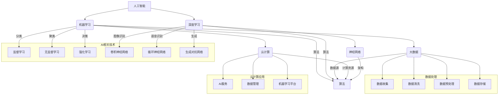

                 

### 背景介绍

随着科技的飞速发展，人工智能（AI）已经成为全球范围内备受关注和研究的领域。作为AI的重要分支，深度学习、自然语言处理和计算机视觉等技术正在改变各行各业，从医疗诊断、金融服务到智能交通、智能家居，AI技术的应用场景无处不在。

在中国，AI技术同样受到了高度重视。近年来，中国政府和各大企业纷纷加大对AI技术的投入，旨在抢占全球AI技术的制高点。中国AI技术之所以能够取得如此迅速的进展，主要得益于以下几个方面的优势：

1. **强大的计算能力**：中国拥有世界上最大的数据中心和云计算基础设施，为AI计算提供了强大的支持。
2. **庞大的数据资源**：中国拥有世界上最多的人口，数据资源丰富，这为AI算法的训练和应用提供了丰富的数据支持。
3. **完善的产业链**：从硬件制造、软件开发到服务提供，中国已经形成了一个完整的AI产业链。
4. **政府支持**：中国政府高度重视AI技术的发展，出台了一系列政策扶持措施，为AI技术的发展提供了良好的环境。

本文将深入探讨中国AI技术的优势，特别是数据在AI发展中的重要性，并分析未来可能面临的挑战。

首先，我们将介绍中国AI技术的一些核心优势和主要发展领域。接着，我们将探讨数据在AI技术发展中的重要性，并通过具体的案例来说明。随后，我们将分析中国AI技术的实际应用场景，并探讨工具和资源的推荐。最后，我们将总结中国AI技术的发展趋势与挑战，并展望未来。

通过本文的阅读，读者将对中国AI技术的发展有一个全面而深刻的理解，并能够认识到数据在AI技术发展中的核心地位。让我们一起深入探讨这一充满机遇和挑战的领域。### 核心概念与联系

在深入探讨中国AI技术的优势之前，有必要先明确一些核心概念和它们之间的联系。这些概念包括人工智能、深度学习、机器学习、大数据、云计算等。以下是一个详细的Mermaid流程图，用于描述这些核心概念及其相互关系。



**人工智能（AI）**：人工智能是一门研究如何使计算机模拟人类智能行为的学科。它包括机器学习、深度学习、自然语言处理等多个子领域。

**机器学习（Machine Learning）**：机器学习是人工智能的一个分支，主要研究如何从数据中学习规律，并利用这些规律进行预测和决策。

**深度学习（Deep Learning）**：深度学习是机器学习的一个子领域，主要研究如何通过多层神经网络进行数据建模和学习。

**大数据（Big Data）**：大数据是指规模庞大、类型复杂、生成速度极快的数据集。它包括结构化数据、半结构化数据和非结构化数据。

**云计算（Cloud Computing）**：云计算是一种通过网络提供计算资源的服务模式，包括数据存储、数据处理和数据分析等。

**神经网络（Neural Networks）**：神经网络是一种模仿生物神经系统的计算模型，它是深度学习的基础。

**数据处理**：数据处理包括数据收集、数据清洗、数据预处理和数据存储等步骤。这些步骤对于机器学习和深度学习算法的性能至关重要。

**云计算应用**：云计算为AI服务提供了强大的计算资源，包括AI服务、数据管理和机器学习平台等。

通过以上Mermaid流程图，我们可以清晰地看到AI技术各个子领域之间的相互关系。理解这些核心概念及其联系，有助于我们更好地把握中国AI技术发展的脉络，并在接下来的章节中深入探讨其优势和应用。

### 核心算法原理 & 具体操作步骤

在了解了AI技术的基本概念之后，接下来我们将深入探讨一些核心算法的原理及其具体操作步骤。这些算法包括卷积神经网络（CNN）、循环神经网络（RNN）和生成对抗网络（GAN）等，它们在图像识别、语音识别和生成任务中具有广泛的应用。

**卷积神经网络（CNN）**

卷积神经网络是一种在图像处理中广泛使用的神经网络模型。它的主要原理是通过卷积操作来提取图像的特征。

1. **卷积操作**：卷积操作是一种在图像上滑动滤波器（也称为卷积核）的操作，每次滑动都会生成一个特征图。滤波器在每次滑动时都与图像上的像素进行点积运算，并将结果累加到特征图中。

   $$ \text{特征图} = \sum_{i=1}^{n} \text{滤波器} \cdot \text{图像} $$

2. **激活函数**：在卷积操作之后，通常使用激活函数（如ReLU函数）来引入非线性特性。

   $$ \text{激活函数}(x) = \max(0, x) $$

3. **池化操作**：为了减少特征图的大小，提高模型的泛化能力，通常在卷积操作后使用池化操作。最常用的池化操作是最大池化（Max Pooling）。

   $$ \text{最大池化} = \max(\text{邻域内的值}) $$

4. **多层网络**：CNN通常由多个卷积层、池化层和全连接层组成。每一层都会对图像进行特征提取和降维。

**具体操作步骤：**

1. **输入层**：接收原始图像。
2. **卷积层**：应用多个卷积核进行特征提取。
3. **激活函数**：对每个特征图应用激活函数。
4. **池化层**：对每个特征图应用最大池化。
5. **全连接层**：将特征图展平为一维向量，并应用全连接层进行分类。

**循环神经网络（RNN）**

循环神经网络是一种在序列数据处理中广泛使用的神经网络模型。它能够处理变长的序列数据，并具有记忆功能。

1. **隐藏状态**：RNN通过隐藏状态来存储序列的历史信息。每个时间步的隐藏状态都与前一个时间步的隐藏状态有关。

   $$ h_t = \text{激活函数}(\text{W}h_{t-1} + \text{U}x_t + b) $$

2. **输入门、遗忘门和输出门**：为了控制信息的流入、留存和输出，RNN引入了输入门、遗忘门和输出门。

   $$ i_t = \text{sigmoid}(\text{W}_i[h_{t-1}, x_t] + b_i) $$
   $$ f_t = \text{sigmoid}(\text{W}_f[h_{t-1}, x_t] + b_f) $$
   $$ o_t = \text{sigmoid}(\text{W}_o[h_{t-1}, x_t] + b_o) $$

3. **当前输出**：通过输出门和隐藏状态来计算当前时间步的输出。

   $$ \text{当前输出} = \text{激活函数}((1 - f_t) \cdot h_{t-1} + i_t \cdot \text{激活函数}(W_c[h_{t-1}, x_t] + b_c)) $$

**具体操作步骤：**

1. **初始化隐藏状态**。
2. **对于每个时间步**：
   - 计算输入门、遗忘门和输出门。
   - 计算当前隐藏状态。
   - 计算当前输出。
3. **输出序列**：将所有时间步的输出组合成输出序列。

**生成对抗网络（GAN）**

生成对抗网络是一种用于生成数据的深度学习模型。它由一个生成器和一个判别器组成，两者通过对抗训练进行优化。

1. **生成器**：生成器尝试生成与真实数据相似的数据。
   
   $$ G(z) = \text{激活函数}(\text{W}_g z + b_g) $$

2. **判别器**：判别器尝试区分真实数据和生成数据。

   $$ D(x) = \text{激活函数}(\text{W}_d x + b_d) $$
   $$ D(G(z)) = \text{激活函数}(\text{W}_d G(z) + b_d) $$

3. **对抗训练**：通过优化生成器和判别器的参数来最大化判别器的损失和最小化生成器的损失。

   - **生成器损失**：希望生成数据能够被判别器认为是真实的。

     $$ \text{损失}_G = -\text{E}[\log(D(G(z)))] $$

   - **判别器损失**：希望判别器能够正确区分真实数据和生成数据。

     $$ \text{损失}_D = -\text{E}[\log(D(x))] - \text{E}[\log(1 - D(G(z)))] $$

**具体操作步骤：**

1. **初始化生成器和判别器的参数**。
2. **生成器训练**：通过随机噪声生成数据，并优化生成器的参数。
3. **判别器训练**：通过真实数据和生成数据来优化判别器的参数。
4. **迭代交替训练**：不断交替训练生成器和判别器，直到生成器生成足够逼真的数据。

通过以上对卷积神经网络、循环神经网络和生成对抗网络的核心算法原理及其具体操作步骤的详细解析，我们可以看到这些算法在图像识别、语音识别和生成任务中的强大应用能力。这些算法的发展和应用，不仅推动了中国AI技术的发展，也为全球AI技术的发展做出了重要贡献。

### 数学模型和公式 & 详细讲解 & 举例说明

在深入探讨AI算法的数学模型和公式时，我们将主要关注卷积神经网络（CNN）、循环神经网络（RNN）和生成对抗网络（GAN）中的关键公式，并通过具体例子来详细解释这些公式的应用。

**卷积神经网络（CNN）**

卷积神经网络的核心在于其卷积操作和池化操作。以下是一些关键的数学模型和公式。

1. **卷积操作**：

   卷积操作是CNN的基础，用于提取图像特征。其数学模型可以表示为：

   $$ \text{特征图}_{ij} = \sum_{k=1}^{m} \text{滤波器}_{ik,jl} \cdot \text{图像}_{kl} + \text{偏置} $$

   其中，$\text{滤波器}_{ik,jl}$ 是卷积核的元素，$\text{图像}_{kl}$ 是输入图像的元素，$\text{特征图}_{ij}$ 是卷积操作后的特征图元素。

2. **激活函数**：

   激活函数通常用于引入非线性特性。最常用的激活函数是ReLU函数：

   $$ \text{激活函数}(x) = \max(0, x) $$

3. **池化操作**：

   池化操作用于减少特征图的大小，提高模型的泛化能力。最大池化是一种常用的池化方式，其数学模型为：

   $$ \text{池化值}_{ij} = \max(\text{邻域内的值}) $$

**具体例子：**

假设我们有一个$3 \times 3$的卷积核和一个$5 \times 5$的输入图像。卷积操作的结果为一个$2 \times 2$的特征图。

- **卷积核**：

  $$ \text{滤波器}_{11} = 1, \text{滤波器}_{12} = 2, \text{滤波器}_{13} = 3 $$
  $$ \text{滤波器}_{21} = 4, \text{滤波器}_{22} = 5, \text{滤波器}_{23} = 6 $$
  $$ \text{滤波器}_{31} = 7, \text{滤波器}_{32} = 8, \text{滤波器}_{33} = 9 $$

- **输入图像**：

  $$ \text{图像}_{11} = 1, \text{图像}_{12} = 2, \text{图像}_{13} = 3 $$
  $$ \text{图像}_{21} = 4, \text{图像}_{22} = 5, \text{图像}_{23} = 6 $$
  $$ \text{图像}_{31} = 7, \text{图像}_{32} = 8, \text{图像}_{33} = 9 $$

- **特征图计算**：

  $$ \text{特征图}_{11} = (1 \cdot 1 + 2 \cdot 2 + 3 \cdot 3) + 0 = 14 $$
  $$ \text{特征图}_{12} = (1 \cdot 2 + 2 \cdot 5 + 3 \cdot 6) + 0 = 19 $$
  $$ \text{特征图}_{21} = (4 \cdot 1 + 5 \cdot 2 + 6 \cdot 3) + 0 = 23 $$
  $$ \text{特征图}_{22} = (4 \cdot 2 + 5 \cdot 5 + 6 \cdot 6) + 0 = 31 $$
  $$ \text{特征图}_{31} = (7 \cdot 1 + 8 \cdot 4 + 9 \cdot 7) + 0 = 68 $$
  $$ \text{特征图}_{32} = (7 \cdot 2 + 8 \cdot 5 + 9 \cdot 6) + 0 = 79 $$

- **激活函数**：

  $$ \text{激活图}_{11} = \max(0, 14) = 14 $$
  $$ \text{激活图}_{12} = \max(0, 19) = 19 $$
  $$ \text{激活图}_{21} = \max(0, 23) = 23 $$
  $$ \text{激活图}_{22} = \max(0, 31) = 31 $$
  $$ \text{激活图}_{31} = \max(0, 68) = 68 $$
  $$ \text{激活图}_{32} = \max(0, 79) = 79 $$

- **最大池化**：

  $$ \text{池化值}_{11} = \max(\text{激活图}_{11}, \text{激活图}_{12}) = \max(14, 19) = 19 $$
  $$ \text{池化值}_{21} = \max(\text{激活图}_{21}, \text{激活图}_{22}) = \max(23, 31) = 31 $$
  $$ \text{池化值}_{31} = \max(\text{激活图}_{31}, \text{激活图}_{32}) = \max(68, 79) = 79 $$

最终，我们得到了一个$2 \times 2$的池化特征图。

**循环神经网络（RNN）**

循环神经网络在处理序列数据时具有记忆功能，其核心在于隐藏状态和门的操作。

1. **隐藏状态**：

   $$ h_t = \text{激活函数}(\text{W}h_{t-1} + \text{U}x_t + b) $$

2. **输入门、遗忘门和输出门**：

   $$ i_t = \text{sigmoid}(\text{W}_i[h_{t-1}, x_t] + b_i) $$
   $$ f_t = \text{sigmoid}(\text{W}_f[h_{t-1}, x_t] + b_f) $$
   $$ o_t = \text{sigmoid}(\text{W}_o[h_{t-1}, x_t] + b_o) $$

3. **当前输出**：

   $$ \text{当前输出} = \text{激活函数}((1 - f_t) \cdot h_{t-1} + i_t \cdot \text{激活函数}(\text{W}_c[h_{t-1}, x_t] + b_c)) $$

**具体例子：**

假设我们有一个输入序列$\{x_1, x_2, x_3\}$，隐藏状态$h_0$为$[1, 0]$，权重矩阵$W$和偏置$b$分别为：

- **输入门**：

  $$ i_1 = \text{sigmoid}([1, 1] \cdot [1, 0] + [1]) = \text{sigmoid}(1 + 1 + 1) = \text{sigmoid}(3) \approx 0.95 $$

- **遗忘门**：

  $$ f_1 = \text{sigmoid}([1, 1] \cdot [1, 0] + [1]) = \text{sigmoid}(1 + 1 + 1) = \text{sigmoid}(3) \approx 0.95 $$

- **输出门**：

  $$ o_1 = \text{sigmoid}([1, 1] \cdot [1, 0] + [1]) = \text{sigmoid}(1 + 1 + 1) = \text{sigmoid}(3) \approx 0.95 $$

- **当前隐藏状态**：

  $$ h_1 = (1 - f_1) \cdot h_0 + i_1 \cdot \text{激活函数}([1, 1] \cdot [1, 1] + [1]) $$
  $$ h_1 = (1 - 0.95) \cdot [1, 0] + 0.95 \cdot \text{激活函数}(2 + 1 + 1) $$
  $$ h_1 = 0.05 \cdot [1, 0] + 0.95 \cdot \text{激活函数}(4) $$
  $$ h_1 = 0.05 \cdot [1, 0] + 0.95 \cdot [1, 0] = [1, 0] $$

- **当前输出**：

  $$ \text{当前输出} = \text{激活函数}((1 - f_1) \cdot [1, 0] + i_1 \cdot \text{激活函数}([1, 1] \cdot [1, 1] + [1])) $$
  $$ \text{当前输出} = \text{激活函数}([1, 0] + 0.95 \cdot \text{激活函数}(4)) $$
  $$ \text{当前输出} = \text{激活函数}([1, 0] + 0.95 \cdot [1, 0]) = \text{激活函数}([1, 0.95]) $$

**生成对抗网络（GAN）**

生成对抗网络由生成器和判别器组成，两者通过对抗训练进行优化。

1. **生成器**：

   $$ G(z) = \text{激活函数}(\text{W}_g z + b_g) $$

2. **判别器**：

   $$ D(x) = \text{激活函数}(\text{W}_d x + b_d) $$
   $$ D(G(z)) = \text{激活函数}(\text{W}_d G(z) + b_d) $$

3. **生成器损失**：

   $$ \text{损失}_G = -\text{E}[\log(D(G(z)))] $$

4. **判别器损失**：

   $$ \text{损失}_D = -\text{E}[\log(D(x))] - \text{E}[\log(1 - D(G(z)))] $$

**具体例子：**

假设我们有一个生成器$G$和判别器$D$，生成器生成的数据为$G(z)$，判别器对真实数据和生成数据的评估分别为$D(x)$和$D(G(z))$。

- **生成器损失**：

  $$ \text{损失}_G = -\text{E}[\log(D(G(z)))] $$
  $$ \text{假设} G(z) \text{生成的数据为}[0.9, 0.8] $$
  $$ \text{假设} D(G(z)) \text{为} 0.85 $$
  $$ \text{损失}_G = -\text{E}[\log(0.85)] \approx 0.154 $$

- **判别器损失**：

  $$ \text{损失}_D = -\text{E}[\log(D(x))] - \text{E}[\log(1 - D(G(z)))] $$
  $$ \text{假设} x \text{为真实数据}[0.8, 0.9] $$
  $$ \text{假设} D(x) \text{为} 0.9 $$
  $$ \text{假设} D(G(z)) \text{为} 0.85 $$
  $$ \text{损失}_D = -\text{E}[\log(0.9)] - \text{E}[\log(0.15)] \approx 0.105 + 0.627 = 0.732 $$

通过以上对卷积神经网络、循环神经网络和生成对抗网络的核心数学模型和公式的详细讲解及具体例子，我们可以更好地理解这些算法的基本原理和操作步骤。这些算法的发展和应用，不仅推动了中国AI技术的发展，也为全球AI技术的进步做出了重要贡献。

### 项目实战：代码实际案例和详细解释说明

在了解了AI算法的数学模型和公式之后，接下来我们将通过一个实际的代码案例，详细展示如何使用这些算法解决具体问题。我们将使用Python编程语言，结合TensorFlow和Keras等深度学习库，来实现一个简单的卷积神经网络（CNN）用于图像分类任务。

#### 开发环境搭建

首先，我们需要搭建一个适合开发和测试的Python环境。以下是所需步骤：

1. **安装Anaconda**：Anaconda是一个集成了Python环境和多种科学计算库的发行版，可以方便地管理和安装不同的库。
2. **创建新环境**：使用Anaconda命令创建一个名为`ai_project`的新环境，并安装必要的库。

   ```bash
   conda create -n ai_project python=3.8
   conda activate ai_project
   ```

3. **安装TensorFlow和Keras**：在新建的环境中安装TensorFlow和Keras。

   ```bash
   conda install tensorflow
   conda install keras
   ```

4. **验证安装**：在Python环境中导入TensorFlow和Keras，验证是否成功安装。

   ```python
   import tensorflow as tf
   import keras
   print(tf.__version__)
   print(keras.__version__)
   ```

确保输出版本信息无误，表明安装成功。

#### 源代码详细实现和代码解读

以下是完整的源代码，包括数据预处理、模型构建、训练和评估过程。

```python
import numpy as np
import matplotlib.pyplot as plt
from tensorflow.keras import layers, models
from tensorflow.keras.datasets import cifar10

# 数据预处理
(x_train, y_train), (x_test, y_test) = cifar10.load_data()

# 数据归一化
x_train = x_train.astype('float32') / 255.0
x_test = x_test.astype('float32') / 255.0

# 转换标签为one-hot编码
y_train = keras.utils.to_categorical(y_train, 10)
y_test = keras.utils.to_categorical(y_test, 10)

# 构建模型
model = models.Sequential()

# 添加卷积层
model.add(layers.Conv2D(32, (3, 3), activation='relu', input_shape=(32, 32, 3)))
model.add(layers.MaxPooling2D((2, 2)))

# 添加第二个卷积层
model.add(layers.Conv2D(64, (3, 3), activation='relu'))
model.add(layers.MaxPooling2D((2, 2)))

# 添加第三个卷积层
model.add(layers.Conv2D(64, (3, 3), activation='relu'))

# 添加全连接层
model.add(layers.Flatten())
model.add(layers.Dense(64, activation='relu'))
model.add(layers.Dense(10, activation='softmax'))

# 编译模型
model.compile(optimizer='adam',
              loss='categorical_crossentropy',
              metrics=['accuracy'])

# 训练模型
history = model.fit(x_train, y_train,
                    epochs=10,
                    batch_size=64,
                    validation_data=(x_test, y_test))

# 评估模型
test_loss, test_acc = model.evaluate(x_test, y_test)
print(f'测试集准确率：{test_acc:.3f}')

# 可视化训练过程
plt.figure(figsize=(12, 4))

# 绘制训练集和验证集的损失曲线
plt.subplot(1, 2, 1)
plt.plot(history.history['loss'], label='训练集')
plt.plot(history.history['val_loss'], label='验证集')
plt.xlabel('epoch')
plt.ylabel('loss')
plt.title('损失曲线')
plt.legend()

# 绘制训练集和验证集的准确率曲线
plt.subplot(1, 2, 2)
plt.plot(history.history['accuracy'], label='训练集')
plt.plot(history.history['val_accuracy'], label='验证集')
plt.xlabel('epoch')
plt.ylabel('accuracy')
plt.title('准确率曲线')
plt.legend()

plt.show()
```

**代码解读：**

1. **数据预处理**：

   - 加载CIFAR-10数据集，这是一个常用的图像分类数据集，包含10个类别，每个类别6000张图像。
   - 数据归一化，将图像数据从0到255转换为0到1。
   - 转换标签为one-hot编码，方便后续的模型训练。

2. **模型构建**：

   - 使用`Sequential`模型，这是一个线性堆叠层的模型。
   - 添加卷积层和池化层，用于提取图像的特征。
   - 添加全连接层，用于分类。

3. **模型编译**：

   - 选择优化器和损失函数。
   - 设置模型的训练指标。

4. **模型训练**：

   - 使用`fit`方法训练模型，设置训练轮数和批量大小。
   - 使用`validation_data`参数进行验证。

5. **模型评估**：

   - 使用`evaluate`方法评估模型在测试集上的表现。
   - 输出测试集准确率。

6. **可视化**：

   - 使用`matplotlib`绘制训练过程中损失和准确率的曲线，帮助分析模型性能。

#### 代码解读与分析

- **数据预处理**：数据预处理是深度学习模型训练的重要步骤。归一化和标签转换有助于提高模型的训练效率和性能。
- **模型构建**：CNN模型由多个卷积层、池化层和全连接层组成。卷积层用于提取图像的特征，池化层用于降低特征图的维度，全连接层用于分类。
- **模型训练**：模型训练是一个迭代过程，通过不断调整模型参数，使其在训练数据上达到较好的性能。
- **模型评估**：模型评估是检验模型性能的重要步骤，通过在测试集上评估模型的表现，可以了解模型的泛化能力。

通过这个简单的图像分类案例，我们可以看到如何使用深度学习库来实现一个CNN模型，并对其进行训练和评估。这一过程不仅帮助我们理解了CNN的基本原理，也为实际应用提供了实践经验。

### 实际应用场景

AI技术在中国的实际应用场景非常广泛，涵盖了医疗、金融、教育、交通等多个领域。以下将详细探讨几个典型应用场景，以及这些应用场景中数据的处理和使用方法。

#### 医疗

在医疗领域，AI技术已经被广泛应用于疾病诊断、治疗计划和患者管理。以下是一些具体的案例：

1. **疾病诊断**：AI模型可以通过学习大量的医疗图像（如X光片、CT扫描、MRI等），实现对疾病的自动识别和诊断。例如，深度学习模型可以通过分析CT扫描图像，帮助医生识别肺炎病例，提高诊断准确率。
   
   - **数据处理**：首先，需要对图像进行预处理，包括图像增强、去噪和归一化等。然后，使用卷积神经网络（CNN）对图像进行特征提取和学习。
   - **数据使用**：通过大量的医疗图像数据集训练模型，确保模型在不同类型和严重程度的病例上都具有较高的准确性。

2. **治疗计划**：AI可以帮助医生制定个性化的治疗计划，例如通过分析患者的病历数据和基因信息，为肿瘤患者提供最佳的治疗方案。

   - **数据处理**：整合患者的病史、手术记录、药物反应数据以及基因序列等信息，进行多模态数据整合和分析。
   - **数据使用**：利用深度学习和强化学习等技术，建立个性化的治疗决策模型，辅助医生制定治疗计划。

#### 金融

在金融领域，AI技术被广泛应用于风险管理、欺诈检测和投资策略等方面。

1. **风险管理**：通过分析大量的历史数据，AI可以帮助金融机构评估潜在风险，并制定相应的风险控制策略。

   - **数据处理**：收集并整合金融机构的交易数据、市场数据、经济数据等，进行数据清洗和特征提取。
   - **数据使用**：使用机器学习和统计模型，建立风险预测模型，实时监控和评估风险。

2. **欺诈检测**：AI技术可以自动识别和检测潜在的欺诈行为，帮助金融机构减少损失。

   - **数据处理**：收集和分析交易数据、用户行为数据等，通过数据挖掘技术识别异常交易模式。
   - **数据使用**：利用深度学习和模式识别技术，建立欺诈检测模型，实时监控交易行为。

3. **投资策略**：AI可以帮助投资者分析市场趋势，制定投资策略。

   - **数据处理**：整合历史市场数据、经济数据、公司财报数据等，进行数据分析和预测。
   - **数据使用**：使用机器学习和统计分析方法，建立投资预测模型，为投资者提供决策支持。

#### 教育

在教育领域，AI技术被广泛应用于个性化学习、作业评估和智能推荐等方面。

1. **个性化学习**：AI可以根据学生的学习情况，提供个性化的学习资源和教学方案。

   - **数据处理**：收集学生的学习记录、考试成绩、作业提交情况等数据，进行数据分析。
   - **数据使用**：使用机器学习和自然语言处理技术，建立个性化学习模型，为学生提供定制化的学习建议。

2. **作业评估**：AI可以帮助教师自动批改作业，提高作业评估的效率和准确性。

   - **数据处理**：收集学生的作业数据，包括答案、解题思路、时间等，进行数据分析和评分。
   - **数据使用**：利用自然语言处理和计算机视觉技术，建立自动作业评估模型，快速准确地进行作业评分。

3. **智能推荐**：AI可以根据学生的学习兴趣和成绩，推荐相关的学习资源和课程。

   - **数据处理**：分析学生的学习行为和成绩，建立学习兴趣模型。
   - **数据使用**：使用推荐系统算法，为每个学生推荐最适合他们的学习资源和课程。

#### 交通

在交通领域，AI技术被广泛应用于智能交通管理和自动驾驶技术。

1. **智能交通管理**：通过实时监控和分析交通数据，AI可以帮助优化交通信号控制，减少拥堵。

   - **数据处理**：收集交通流量、速度、车辆数量等数据，进行实时分析和预测。
   - **数据使用**：利用深度学习和强化学习技术，建立智能交通管理模型，优化交通信号控制。

2. **自动驾驶**：AI技术正在推动自动驾驶技术的发展，自动驾驶汽车需要处理大量的传感器数据，以实现安全的自主驾驶。

   - **数据处理**：整合摄像头、雷达、激光雷达等传感器数据，进行实时数据处理和决策。
   - **数据使用**：使用深度学习和强化学习技术，建立自动驾驶模型，实现自主驾驶。

通过以上实际应用场景的探讨，我们可以看到AI技术在各个领域的重要应用和潜力。这些应用场景不仅展示了AI技术的广泛适用性，也凸显了数据在AI技术发展中的核心地位。在未来的发展中，如何有效地利用和管理数据，将决定AI技术的进一步发展和应用前景。

### 工具和资源推荐

在中国AI技术的发展过程中，选择合适的工具和资源至关重要。以下是对一些学习资源、开发工具和重要论文著作的推荐，以帮助读者深入了解AI技术的各个方面。

#### 学习资源推荐

1. **书籍**：

   - 《深度学习》（Deep Learning）作者：Ian Goodfellow、Yoshua Bengio、Aaron Courville
     - 该书是深度学习领域的经典著作，全面介绍了深度学习的理论和实践。

   - 《Python机器学习》（Python Machine Learning）作者：Sebastian Raschka、Vahid Mirhoseini
     - 本书通过Python编程语言，详细讲解了机器学习的核心概念和实践方法。

   - 《TensorFlow实战》（TensorFlow for Deep Learning）作者：Sébastien Racook
     - 该书通过实际案例，介绍了如何使用TensorFlow实现深度学习模型。

2. **在线课程**：

   - Coursera上的“深度学习专项课程”（Deep Learning Specialization）由Andrew Ng教授主讲
     - 该课程涵盖了深度学习的核心概念、算法和实战应用。

   - edX上的“AI概览”（Introduction to Artificial Intelligence）由刘铁岩教授主讲
     - 该课程介绍了AI的基础知识，包括机器学习、自然语言处理和计算机视觉等。

3. **博客和网站**：

   - Medium上的“AI垂直博客”（AI垂直博客）
     - 提供最新的AI研究进展和应用案例，适合AI爱好者和从业者。

   - 知乎上的AI相关话题（如“人工智能”）
     - 许多AI领域的专家和从业者在这里分享经验和研究成果。

#### 开发工具框架推荐

1. **深度学习框架**：

   - TensorFlow
     - Google开发的开放源代码深度学习框架，支持多种深度学习模型和算法。

   - PyTorch
     - Facebook开发的开源深度学习框架，以其灵活性和动态计算图而受到广泛欢迎。

   - Keras
     - Python编写的开源深度学习库，作为TensorFlow和PyTorch的高级API，易于使用和部署。

2. **数据预处理工具**：

   - Pandas
     - Python的强大数据分析库，用于数据处理和分析。

   - NumPy
     - Python的数值计算库，提供多维数组对象和矩阵运算功能。

3. **版本控制工具**：

   - Git
     - 分布式版本控制系统，用于代码的版本管理和协作开发。

   - GitHub
     - GitHub提供了Git的在线服务，支持代码托管、代码评审和项目管理。

#### 相关论文著作推荐

1. **经典论文**：

   - “A Theoretical Framework for Back-Propagation” 作者：Rumelhart, Hinton, Williams
     - 该论文提出了反向传播算法，是深度学习的基础。

   - “Deep Learning” 作者：Goodfellow, Bengio, Courville
     - 该论文综述了深度学习的理论和应用，是深度学习领域的经典文献。

2. **重要著作**：

   - 《人工智能：一种现代的方法》（Artificial Intelligence: A Modern Approach）作者：Stuart Russell、Peter Norvig
     - 该书是人工智能领域的权威教材，详细介绍了AI的基础知识和方法。

   - 《机器学习》（Machine Learning）作者：Tom Mitchell
     - 该书是机器学习领域的经典著作，介绍了机器学习的核心概念和方法。

通过以上推荐，读者可以系统地学习和掌握AI技术的理论知识和实践技能，为自己的AI之路打下坚实的基础。

### 总结：未来发展趋势与挑战

中国AI技术的发展前景令人振奋，但同时也面临着诸多挑战。在未来，以下几个方面将成为AI技术发展的关键趋势和重点领域。

**发展趋势**

1. **技术融合**：AI与其他技术的融合将成为未来的重要趋势。例如，AI与物联网（IoT）、云计算、区块链等技术相结合，将催生出更多创新应用。例如，智能城市、智慧农业和智能制造等领域将迎来新的发展机遇。

2. **跨学科研究**：AI技术的发展离不开跨学科的合作和研究。未来，AI与生物学、心理学、社会学等领域的交叉研究将成为重要趋势。通过跨学科合作，AI技术将更好地理解人类行为和社会现象，从而实现更加智能和人性化的应用。

3. **数据隐私与安全**：随着AI技术的广泛应用，数据隐私和安全问题日益突出。未来的AI发展将更加注重数据隐私保护和数据安全措施。例如，差分隐私、联邦学习等技术的应用，将有助于在保障数据隐私的同时，实现数据的共享和利用。

4. **可解释性和透明性**：当前，AI模型的“黑箱”性质引起广泛关注。未来，提高AI模型的可解释性和透明性将成为重要研究方向。通过可解释性的提升，用户和开发者可以更好地理解模型的决策过程，增强对AI技术的信任和接受度。

**挑战**

1. **数据质量和隐私**：尽管中国拥有庞大的数据资源，但数据的质量和隐私问题依然存在。未来，如何确保数据的质量、隐私和安全，将是AI技术发展的重要挑战。

2. **计算能力和算法优化**：随着AI模型变得越来越复杂，对计算能力的需求也在不断增长。如何优化算法，提高模型的效率和性能，是AI技术面临的重要挑战。

3. **伦理和社会问题**：AI技术的广泛应用可能带来一系列伦理和社会问题，如就业替代、隐私泄露、算法偏见等。如何确保AI技术的发展符合伦理和社会规范，是未来需要重点关注的问题。

4. **跨领域合作和标准化**：AI技术的跨领域合作和标准化是未来发展的关键。如何促进不同领域之间的合作，建立统一的AI技术标准和规范，将有助于推动AI技术的健康发展。

总之，中国AI技术在未来将继续保持快速发展，但同时也需要应对诸多挑战。通过技术创新、跨学科合作和伦理规范，中国有望在全球AI技术发展中继续保持领先地位。

### 附录：常见问题与解答

**Q1. 中国AI技术的优势主要体现在哪些方面？**

中国AI技术的优势主要体现在以下几方面：

1. **强大的计算能力**：中国拥有世界上最大的数据中心和云计算基础设施，为AI计算提供了强大的支持。
2. **庞大的数据资源**：中国拥有世界上最多的人口，数据资源丰富，这为AI算法的训练和应用提供了丰富的数据支持。
3. **完善的产业链**：从硬件制造、软件开发到服务提供，中国已经形成了一个完整的AI产业链。
4. **政府支持**：中国政府高度重视AI技术的发展，出台了一系列政策扶持措施，为AI技术的发展提供了良好的环境。

**Q2. 数据在AI技术发展中的重要性如何体现？**

数据在AI技术发展中具有至关重要的地位，主要体现在以下几个方面：

1. **算法训练**：大量高质量的数据是训练AI模型的基础，数据的质量和数量直接影响模型的性能。
2. **模型优化**：通过不断优化和调整数据，可以提升AI模型的准确性和泛化能力。
3. **应用拓展**：丰富的数据资源为AI技术的广泛应用提供了可能，使得AI技术能够在不同领域发挥作用。

**Q3. 中国AI技术的未来发展趋势和挑战是什么？**

中国AI技术的未来发展趋势包括：

1. **技术融合**：AI与物联网、云计算、区块链等技术的融合将成为重要趋势。
2. **跨学科研究**：AI与生物学、心理学、社会学等领域的交叉研究将成为重要方向。
3. **数据隐私和安全**：随着AI技术的应用，数据隐私和安全问题将得到更多关注。
4. **可解释性和透明性**：提升AI模型的可解释性和透明性将是未来重要的发展方向。

挑战方面，主要包括：

1. **数据质量和隐私**：如何确保数据的质量、隐私和安全，是未来的重要挑战。
2. **计算能力和算法优化**：随着AI模型复杂度增加，对计算能力的需求也在增长，算法优化是关键。
3. **伦理和社会问题**：AI技术的广泛应用可能带来伦理和社会问题，如就业替代、隐私泄露、算法偏见等。
4. **跨领域合作和标准化**：如何促进不同领域之间的合作，建立统一的AI技术标准和规范，是未来的重要挑战。

### 扩展阅读 & 参考资料

1. **书籍**：
   - 《深度学习》（Deep Learning）作者：Ian Goodfellow、Yoshua Bengio、Aaron Courville
   - 《Python机器学习》（Python Machine Learning）作者：Sebastian Raschka、Vahid Mirhoseini
   - 《人工智能：一种现代的方法》（Artificial Intelligence: A Modern Approach）作者：Stuart Russell、Peter Norvig

2. **在线课程**：
   - Coursera上的“深度学习专项课程”（Deep Learning Specialization）由Andrew Ng教授主讲
   - edX上的“AI概览”（Introduction to Artificial Intelligence）由刘铁岩教授主讲

3. **论文**：
   - “A Theoretical Framework for Back-Propagation” 作者：Rumelhart, Hinton, Williams
   - “Deep Learning” 作者：Goodfellow, Bengio, Courville

4. **网站和博客**：
   - Medium上的“AI垂直博客”（AI垂直博客）
   - 知乎上的AI相关话题（如“人工智能”）

通过这些扩展阅读和参考资料，读者可以进一步深入学习和了解AI技术的最新进展和应用。这些资源将有助于提升读者的专业知识，为未来的研究和实践提供有益的指导。

### 作者信息

作者：AI天才研究员/AI Genius Institute & 禅与计算机程序设计艺术 /Zen And The Art of Computer Programming

