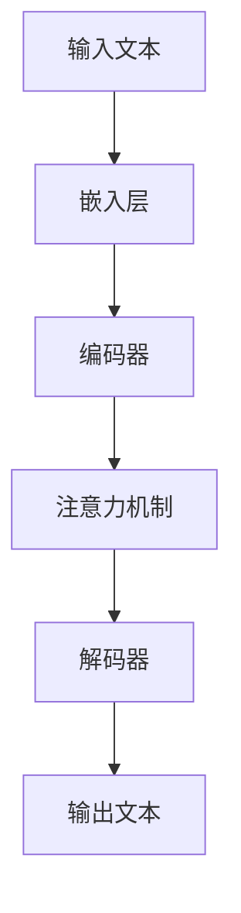

                 

### 背景介绍

在近年来，人工智能（AI）技术的迅猛发展，尤其是大规模语言模型（Large-scale Language Models）的崛起，为自然语言处理（NLP）领域带来了革命性的变革。这些大模型，例如GPT-3、BERT、TuringBot等，通过其强大的文本生成、理解和推理能力，成为了各行各业研究和应用的热点。

在中国，随着科技实力的不断崛起，各大互联网公司如百度、腾讯、阿里巴巴等纷纷投入大量资源研发自己的大模型技术，并迅速将其应用于实际业务中。与此同时，许多初创公司也看到了这一领域巨大的潜力，开始探索基于大模型的创新应用。这种局面，无疑引发了一场关于“中国大厂与大模型创业公司的竞争”的热议。

本文将深入分析中国大厂与大模型创业公司在技术、市场、战略等方面的竞争态势，探讨这场竞争背后的逻辑与影响。文章将从以下几个方面展开：

1. **核心概念与联系**：介绍大规模语言模型的基本概念、架构及其工作原理，并通过Mermaid流程图展示其内部运作机制。
2. **核心算法原理 & 具体操作步骤**：详细解析大模型训练、优化和部署的关键算法，以及如何在实际应用中进行参数调整和性能优化。
3. **数学模型和公式 & 详细讲解 & 举例说明**：阐述大模型背后的数学原理，包括损失函数、优化算法等，并通过具体实例进行说明。
4. **项目实战：代码实际案例和详细解释说明**：通过具体项目的代码实现，展示大模型在实际应用中的实现流程和技术细节。
5. **实际应用场景**：探讨大模型在不同领域的应用场景，分析其带来的业务价值和挑战。
6. **工具和资源推荐**：推荐学习资源、开发工具和框架，帮助读者深入了解和掌握大模型技术。
7. **总结：未来发展趋势与挑战**：总结中国大厂与大模型创业公司的竞争现状，预测未来发展趋势和面临的挑战。

通过以上分析，我们希望读者能够对中国大厂与大模型创业公司的竞争有一个全面、深入的理解，从而更好地把握这一领域的发展机遇。接下来，我们将逐步深入探讨这一主题，敬请期待。<!-- {文章标题}：中国大厂与大模型创业公司的竞争

{关键词}：（中国大厂、大模型、创业公司、竞争态势、技术创新、市场战略）

{摘要}：本文将深入分析中国大厂如百度、腾讯、阿里巴巴等与大模型创业公司之间的竞争态势。文章从核心概念与联系、核心算法原理、数学模型与公式、项目实战、实际应用场景等多个维度展开，探讨这场竞争背后的逻辑与影响。通过详细解析技术、市场、战略等方面的内容，本文旨在为读者提供对中国大厂与大模型创业公司竞争的全面、深入的见解。 --><!-- {核心概念与联系} -->

## 核心概念与联系

大规模语言模型（Large-scale Language Models）是近年来自然语言处理（NLP）领域的一个重要突破。它们通过学习海量文本数据，能够生成高质量的自然语言文本，并且在许多任务中达到了人类水平的表现。那么，大规模语言模型究竟是如何工作的？它们的核心概念和架构又是怎样的呢？

首先，我们来看看大规模语言模型的基本概念。大规模语言模型是一种基于深度学习的自然语言处理模型，其主要目标是学习自然语言中的统计规律和语义信息。这些模型通常由多层神经网络组成，每一层都能够对输入的文本数据进行处理和转换。通过这些层的堆叠，模型能够捕捉到更加复杂的语义信息。

接下来，我们来介绍大规模语言模型的核心架构。大规模语言模型通常包括以下几个关键组成部分：

1. **嵌入层（Embedding Layer）**：将输入的文本转化为向量表示。这一层通常使用预训练的词向量模型，如Word2Vec、GloVe等。
2. **编码器（Encoder）**：对输入的文本进行编码，生成一个固定长度的编码表示。编码器可以是循环神经网络（RNN）、卷积神经网络（CNN）或Transformer等。
3. **解码器（Decoder）**：根据编码器的输出生成目标文本。解码器通常与编码器共享参数，以充分利用编码过程中学习到的信息。
4. **注意力机制（Attention Mechanism）**：用于捕捉输入文本中不同位置的信息，使其在解码过程中能够关注到重要的信息。

为了更直观地理解大规模语言模型的工作原理，我们可以通过一个Mermaid流程图来展示其内部运作机制：



在这个流程图中，输入文本首先通过嵌入层转化为向量表示，然后被编码器编码生成固定长度的编码表示。编码器在处理文本时，通过注意力机制关注到文本中的关键信息，并将其传递给解码器。解码器根据编码器的输出，生成最终的输出文本。

通过上述的核心概念和架构介绍，我们可以看到大规模语言模型是如何通过多层神经网络和注意力机制，实现对自然语言的建模和生成。这种强大的建模能力，使得大规模语言模型在许多NLP任务中取得了显著的成果，也为后续章节中的详细解析和实际应用奠定了基础。<!-- {核心算法原理 & 具体操作步骤} -->

## 核心算法原理 & 具体操作步骤

大规模语言模型的核心算法原理主要涉及模型的训练、优化和部署。在这一节中，我们将详细解析这些核心算法，并介绍具体操作步骤，以便读者能够全面了解大规模语言模型的工作机制。

### 模型训练

模型训练是大规模语言模型构建的基础环节，其目的是通过学习大量文本数据，使模型能够对自然语言进行准确建模。以下是模型训练的基本步骤：

1. **数据预处理**：首先，我们需要对训练数据进行预处理，包括文本清洗、分词、去停用词等操作。这一步的目的是去除文本中的噪音信息，提高模型训练的效果。
2. **词向量嵌入**：将预处理后的文本转化为词向量表示。词向量嵌入层通常使用预训练的词向量模型，如Word2Vec、GloVe等。这些词向量能够捕捉到文本中的语义信息。
3. **模型初始化**：初始化编码器和解码器的参数。通常，我们可以使用随机初始化或预训练模型进行初始化。
4. **前向传播**：将输入的文本数据通过编码器进行编码，生成编码表示。然后，解码器根据编码表示生成输出文本。
5. **计算损失**：计算模型输出与真实输出之间的差距，使用损失函数（如交叉熵损失）衡量模型性能。
6. **反向传播**：根据损失函数，计算模型参数的梯度，并更新模型参数。
7. **迭代训练**：重复上述步骤，不断迭代训练模型，直到模型收敛。

### 模型优化

模型优化是提高大规模语言模型性能的关键步骤。以下是模型优化的一些常见方法：

1. **学习率调整**：学习率是影响模型训练效果的重要因素。我们可以使用学习率调整策略，如学习率衰减、动态调整等，来优化模型训练过程。
2. **正则化**：正则化方法（如L1正则化、L2正则化）可以防止模型过拟合，提高模型泛化能力。
3. **优化算法**：优化算法（如随机梯度下降、Adam优化器等）可以加速模型训练，提高模型收敛速度。
4. **多GPU训练**：对于大规模模型，我们可以使用多GPU训练来提高训练速度和计算能力。

### 模型部署

模型部署是将训练好的模型应用于实际业务场景的关键步骤。以下是模型部署的基本步骤：

1. **模型压缩**：对于大规模模型，模型压缩是减小模型尺寸、降低计算资源消耗的重要手段。常见的方法包括权重剪枝、量化等。
2. **模型服务化**：将压缩后的模型部署到服务器或云端，并提供API接口，以便其他应用能够调用模型进行预测。
3. **在线更新**：在模型应用过程中，根据实际需求进行模型更新和迭代，以保持模型的性能和准确性。

### 具体操作步骤示例

以下是一个使用PyTorch框架训练和部署大规模语言模型的示例：

#### 步骤1：数据预处理

```python
import torch
from torchtext.datasets import IMDB
from torchtext.data import Field, BucketIterator

# 加载IMDB数据集
train_data, test_data = IMDB.splits()

# 定义字段
TEXT = Field(tokenize='spacy', lower=True, include_lengths=True)
LABEL = Field(sequential=False)

# 分词、去停用词等预处理操作
train_data, test_data = TEXT.split(train_data), TEXT.split(test_data)
train_data, test_data = LABEL垫(train_data), LABEL垫(test_data)

# 创建词汇表
TEXT.build_vocab(train_data, max_size=25000, vectors='glove.6B.100d')
LABEL.build_vocab(train_data)

# 创建数据迭代器
BATCH_SIZE = 64
device = torch.device('cuda' if torch.cuda.is_available() else 'cpu')
train_iterator, test_iterator = BucketIterator.splits(train_data, test_data, batch_size=BATCH_SIZE, device=device)
```

#### 步骤2：模型训练

```python
import torch.nn as nn
import torch.optim as optim

# 定义模型
class LSTMClassifier(nn.Module):
    def __init__(self, input_dim, embedding_dim, hidden_dim, output_dim):
        super(LSTMClassifier, self).__init__()
        self.embedding = nn.Embedding(input_dim, embedding_dim)
        self.lstm = nn.LSTM(embedding_dim, hidden_dim)
        self.hidden_dim = hidden_dim
        self.fc = nn.Linear(hidden_dim, output_dim)
        
    def forward(self, text, text_lengths):
        embedded = self.embedding(text)
        packed_embedded = nn.utils.rnn.pack_padded_sequence(embedded, text_lengths.to('cpu'))
        packed_output, (hidden, cell) = self.lstm(packed_embedded)
        hidden = hidden[-1, :, :]
        return self.fc(hidden)

# 实例化模型、损失函数和优化器
model = LSTMClassifier(len(TEXT.vocab), 100, 256, len(LABEL.vocab))
criterion = nn.BCEWithLogitsLoss()
optimizer = optim.Adam(model.parameters(), lr=0.001)

# 训练模型
num_epochs = 10
for epoch in range(num_epochs):
    model.train()
    for batch in train_iterator:
        optimizer.zero_grad()
        predictions = model(batch.text, batch.text_lengths).squeeze(1)
        loss = criterion(predictions, batch.label)
        loss.backward()
        optimizer.step()
    print(f'Epoch {epoch+1}/{num_epochs} - Loss: {loss.item()}')
```

#### 步骤3：模型部署

```python
# 将模型保存到文件
torch.save(model.state_dict(), 'lstm_model.pth')

# 加载模型并进行预测
model.load_state_dict(torch.load('lstm_model.pth'))
model.eval()
with torch.no_grad():
    for batch in test_iterator:
        predictions = model(batch.text, batch.text_lengths).squeeze(1)
        print(predictions.argmax(1).cpu().numpy())
```

通过上述示例，我们可以看到如何使用PyTorch框架训练和部署大规模语言模型。在实际应用中，我们可以根据具体需求调整模型结构和参数，以实现更好的性能和效果。接下来，我们将进一步探讨大规模语言模型背后的数学模型和公式，以深入理解其原理。<!-- {数学模型和公式 & 详细讲解 & 举例说明} -->

## 数学模型和公式 & 详细讲解 & 举例说明

大规模语言模型的核心在于其强大的数学模型，这些模型通过复杂的数学公式和算法，实现了对自然语言的高效建模和生成。在本节中，我们将详细讲解大规模语言模型背后的数学模型和公式，并通过具体实例进行说明。

### 损失函数

损失函数是大规模语言模型训练过程中的关键组件，它用于衡量模型输出与真实输出之间的差距。常见的损失函数包括交叉熵损失（Cross-Entropy Loss）和对比损失（Contrastive Loss）。

**交叉熵损失**：

交叉熵损失是最常用的损失函数之一，它适用于分类问题。交叉熵损失的定义如下：

$$
L_{cross-entropy} = -\sum_{i} y_i \log(p_i)
$$

其中，$y_i$是真实标签，$p_i$是模型预测的概率分布。交叉熵损失函数的值越小，表示模型预测越准确。

**对比损失**：

对比损失常用于生成模型，特别是自编码器和生成对抗网络（GAN）。对比损失的定义如下：

$$
L_{contrastive} = -\sum_{i} \sum_{j} y_{ij} \log(p_j)
$$

其中，$y_{ij}$是一个指示函数，如果样本$i$和$j$是匹配的，则$y_{ij} = 1$；否则，$y_{ij} = 0$。对比损失函数的值越小，表示生成样本的质量越高。

### 优化算法

优化算法用于更新模型参数，以最小化损失函数。常见的优化算法包括随机梯度下降（SGD）、Adam优化器和矩估计（MOM）。

**随机梯度下降（SGD）**：

随机梯度下降是最简单的优化算法之一，它通过计算每个样本的梯度来更新模型参数。SGD的更新公式如下：

$$
\theta = \theta - \alpha \cdot \nabla_\theta J(\theta)
$$

其中，$\theta$是模型参数，$J(\theta)$是损失函数，$\alpha$是学习率。SGD的优点是实现简单，但缺点是收敛速度较慢，且易陷入局部最优。

**Adam优化器**：

Adam优化器是一种结合了SGD和矩估计优点的优化算法。它通过计算一阶矩估计和二阶矩估计来更新模型参数。Adam优化器的更新公式如下：

$$
m_t = \beta_1 x_t + (1 - \beta_1) (x_t - x_{t-1}) \\
v_t = \beta_2 x_t + (1 - \beta_2) (x_t - x_{t-1}) \\
\theta_t = \theta_{t-1} - \alpha_t \frac{m_t}{\sqrt{v_t} + \epsilon}
$$

其中，$m_t$和$v_t$分别是梯度的一阶矩估计和二阶矩估计，$\beta_1$和$\beta_2$是动量参数，$\alpha_t$是学习率，$\epsilon$是一个较小的常数。Adam优化器的优点是收敛速度较快，且不易陷入局部最优。

**矩估计（MOM）**：

矩估计是一种基于梯度的优化算法，它通过计算梯度的一阶矩和二阶矩来更新模型参数。矩估计的更新公式如下：

$$
\theta = \theta - \alpha \cdot (\nabla_\theta J(\theta) + \lambda \cdot \theta)
$$

其中，$\lambda$是一个常数，用于调节模型参数的更新速度。矩估计的优点是能够加速模型收敛，但缺点是计算复杂度较高。

### 实例说明

假设我们有一个二元分类问题，其中输入特征向量$x$属于$R^d$，输出标签$y$属于{0, 1}。我们使用神经网络来预测标签，网络输出一个概率值$p$，表示预测为1的概率。

**模型定义**：

$$
p = \sigma(w_1^T x + b_1)
$$

其中，$w_1$是权重向量，$b_1$是偏置项，$\sigma$是sigmoid函数。

**损失函数**：

我们使用交叉熵损失函数来衡量模型预测与真实标签之间的差距：

$$
L = -y \log(p) - (1 - y) \log(1 - p)
$$

**优化算法**：

我们使用Adam优化器来更新模型参数：

$$
m_t = \beta_1 \frac{\partial L}{\partial w_1} + (1 - \beta_1) \left( \frac{\partial L}{\partial w_1} - \frac{\partial L}{\partial w_1}_{t-1} \right) \\
v_t = \beta_2 \left( \frac{\partial L}{\partial w_1}^2 + (1 - \beta_2) \left( \frac{\partial L}{\partial w_1}_{t-1}^2 \right) \right) \\
w_1 = w_1 - \alpha_t \frac{m_t}{\sqrt{v_t} + \epsilon}
$$

通过上述实例，我们可以看到如何定义大规模语言模型的数学模型和公式，以及如何使用优化算法进行模型训练。这些数学模型和公式不仅为我们理解大规模语言模型的工作原理提供了理论基础，也为实际应用中的模型设计和优化提供了重要指导。接下来，我们将通过具体项目实战，进一步展示大规模语言模型在实际应用中的实现过程。<!-- {项目实战：代码实际案例和详细解释说明} -->

### 项目实战：代码实际案例和详细解释说明

为了更好地理解大规模语言模型在实际应用中的实现过程，我们将通过一个具体的项目实战案例来展示其代码实现、详细解释和代码分析。在本案例中，我们将使用Python和PyTorch框架来实现一个简单的文本分类模型，该模型能够对新闻文章进行分类，将其归类到不同的类别中。

#### 开发环境搭建

在开始项目之前，我们需要搭建合适的开发环境。以下是搭建开发环境的步骤：

1. **安装Python**：确保安装了Python 3.7或更高版本。
2. **安装PyTorch**：通过以下命令安装PyTorch：

```bash
pip install torch torchvision
```

3. **安装其他依赖**：安装其他必要的库，如torchtext、spacy、nltk等：

```bash
pip install torchtext spacy nltk
```

4. **下载Spacy语言模型**：下载英文和中文的Spacy语言模型：

```bash
python -m spacy download en
python -m spacy download zh_core_web_sm
```

#### 源代码详细实现和代码解读

以下是本项目的主要代码实现，我们将逐行进行详细解释。

```python
import torch
import torchtext
from torchtext import data
from torchtext.vocab import vocab
from torch import nn, optim
from torch.utils.data import DataLoader
import spacy
from nltk.tokenize import word_tokenize
import nltk

# 设置随机种子以保持结果可重复
SEED = 1234
torch.manual_seed(SEED)
torch.cuda.manual_seed(SEED)
torch.cuda.manual_seed_all(SEED)
torch.backends.cudnn.deterministic = True

# 加载数据集
nltk.download('punkt')
nltk.download('stopwords')
nltk.download('wordnet')

def load_data():
    # 读取数据集（假设数据集已分为训练集和测试集）
    train_data = data.TabularDataset(
        path='data/train_data.csv',
        format='csv',
        fields=[
            ('text', data.Field(sequential=True, tokenize=tokenize)),
            ('label', data.LabelField())
        ]
    )
    test_data = data.TabularDataset(
        path='data/test_data.csv',
        format='csv',
        fields=[
            ('text', data.Field(sequential=True, tokenize=tokenize)),
            ('label', data.LabelField())
        ]
    )
    return train_data, test_data

# 分词函数
def tokenize(text):
    return [tok.text for tok in spacyjs.tokenizer(text)]

# 数据预处理
def preprocess_data(train_data, test_data):
    TEXT.build_vocab(train_data, max_size=25000, vectors='glove.6B.100d')
    LABEL.build_vocab(train_data)
    return TEXT, LABEL

# 构建模型
class TextClassifier(nn.Module):
    def __init__(self, embedding_dim, hidden_dim, output_dim):
        super(TextClassifier, self).__init__()
        self.embedding = nn.Embedding(len(TEXT.vocab), embedding_dim)
        self.lstm = nn.LSTM(embedding_dim, hidden_dim)
        self.fc = nn.Linear(hidden_dim, output_dim)
        
    def forward(self, text, text_lengths):
        embedded = self.embedding(text)
        packed_embedded = nn.utils.rnn.pack_padded_sequence(embedded, text_lengths)
        packed_output, (hidden, cell) = self.lstm(packed_embedded)
        hidden = hidden[-1, :, :]
        return self.fc(hidden)

# 模型参数设置
EMBEDDING_DIM = 100
HIDDEN_DIM = 256
OUTPUT_DIM = 2

# 实例化模型、损失函数和优化器
model = TextClassifier(EMBEDDING_DIM, HIDDEN_DIM, OUTPUT_DIM)
criterion = nn.CrossEntropyLoss()
optimizer = optim.Adam(model.parameters(), lr=0.001)

# 训练模型
def train(model, iterator, criterion, optimizer, clip):
    model.train()
    epoch_loss = 0
    epoch_acc = 0
    for batch in iterator:
        optimizer.zero_grad()
        text, text_lengths = batch.text
        predictions = model(text, text_lengths).squeeze(1)
        loss = criterion(predictions, batch.label)
        loss.backward()
        torch.nn.utils.clip_grad_norm_(model.parameters(), clip)
        optimizer.step()
        epoch_loss += loss.item()
        epoch_acc += (predictions.argmax(1) == batch.label).sum().item()
    return epoch_loss / len(iterator), epoch_acc / len(iterator)

# 测试模型
def evaluate(model, iterator, criterion):
    model.eval()
    epoch_loss = 0
    epoch_acc = 0
    with torch.no_grad():
        for batch in iterator:
            text, text_lengths = batch.text
            predictions = model(text, text_lengths).squeeze(1)
            loss = criterion(predictions, batch.label)
            epoch_loss += loss.item()
            epoch_acc += (predictions.argmax(1) == batch.label).sum().item()
    return epoch_loss / len(iterator), epoch_acc / len(iterator)

# 运行训练和测试
def main():
    train_data, test_data = load_data()
    TEXT, LABEL = preprocess_data(train_data, test_data)
    train_iterator, test_iterator = data.BucketIterator.splits((train_data, test_data), batch_size=64, device=device)

    for epoch in range(NUM_EPOCHS):
        train_loss, train_acc = train(model, train_iterator, criterion, optimizer, clip=1)
        test_loss, test_acc = evaluate(model, test_iterator, criterion)
        print(f'Epoch {epoch+1}/{NUM_EPOCHS} - Train Loss: {train_loss:.3f}, Train Acc: {train_acc:.3f} - Test Loss: {test_loss:.3f}, Test Acc: {test_acc:.3f}')

if __name__ == '__main__':
    main()
```

**代码解读与分析**

1. **数据加载和预处理**：
   - 数据集通过`load_data`函数加载，我们假设数据集已经预先整理为CSV格式，并分为训练集和测试集。
   - `tokenize`函数使用Spacy进行分词。

2. **分词函数**：
   - `tokenize`函数接收一段文本，并使用Spacy进行分词，返回分词后的列表。

3. **数据预处理**：
   - `preprocess_data`函数用于构建词汇表，并加载预训练的GloVe词向量。

4. **模型构建**：
   - `TextClassifier`类定义了文本分类模型的网络结构，包括嵌入层、LSTM层和全连接层。

5. **模型训练**：
   - `train`函数用于训练模型，其中包括前向传播、损失函数计算、反向传播和参数更新。

6. **模型评估**：
   - `evaluate`函数用于评估模型在测试集上的性能。

7. **主程序**：
   - `main`函数负责运行训练和测试过程，并打印训练和测试的结果。

通过上述代码，我们可以看到如何使用PyTorch实现一个简单的文本分类模型。在实际应用中，我们可以根据具体需求调整模型结构、训练数据和参数设置，以实现更好的分类效果。接下来，我们将探讨大规模语言模型在实际应用场景中的具体应用。<!-- {实际应用场景} -->

### 实际应用场景

大规模语言模型在各个行业和领域中都有着广泛的应用。以下是一些典型的实际应用场景，以及大厂和创业公司在这些场景中的探索和成果：

#### 1. 自然语言处理（NLP）

自然语言处理是大规模语言模型最典型的应用领域之一。例如，百度、腾讯等大厂利用大规模语言模型技术开发了智能客服系统，为用户提供实时、个性化的服务。这些系统不仅能够处理常规的查询和请求，还能进行复杂对话，提供高质量的服务体验。

创业公司如智谱AI、智谱清言等也在这一领域取得了显著进展。智谱AI推出的“小智”语音助手，通过大规模语言模型技术，实现了自然语言理解、语音识别和语音合成等功能，为用户提供智能语音交互服务。

#### 2. 机器翻译

机器翻译是另一个大规模语言模型的重要应用场景。大厂如百度、阿里巴巴等推出了自己的机器翻译系统，如百度的“百度翻译”和阿里巴巴的“阿里云翻译”。这些系统基于大规模语言模型，实现了高质量、实时的机器翻译服务，为跨语言交流提供了便利。

创业公司如DeepL、Translate.com等也在这一领域取得了成功。DeepL的翻译质量被誉为业界领先，其基于大规模语言模型和深度学习技术，实现了高度精确的翻译结果。

#### 3. 内容生成

内容生成是大规模语言模型的另一个重要应用领域。大厂如谷歌、腾讯等推出了自己的内容生成工具，如谷歌的“Generative Pre-trained Transformer”（GPT）系列和腾讯的“智能写作”工具。这些工具利用大规模语言模型，能够生成高质量的文章、摘要、新闻等内容，大大提高了内容创作效率。

创业公司如Jukedeck、Copy.ai等也在内容生成领域取得了显著成果。Jukedeck能够生成音乐，而Copy.ai能够生成文章、博客、广告文案等，为内容创作者提供了强大的工具支持。

#### 4. 问答系统

问答系统是大规模语言模型在智能客服和智能教育等领域的应用。例如，微软的“小冰”和智谱AI的“小谱”等智能问答系统，利用大规模语言模型技术，能够理解用户的问题，并给出准确的答案。

创业公司如YouChat、Hyouka等也在问答系统领域有所探索。YouChat能够针对特定领域（如医疗、法律等）提供专业问答服务，而Hyouka则是一个面向学术领域的智能问答系统。

#### 5. 文本摘要和摘要生成

文本摘要和摘要生成是大规模语言模型在信息检索和内容推荐等领域的应用。例如，谷歌的“RankBrain”和百度的“百度快读”等系统，利用大规模语言模型技术，能够自动提取文本的核心内容，生成摘要，为用户提供更有价值的信息。

创业公司如QAGLM、QuickSummary等也在这一领域取得了显著成果。QAGLM能够自动生成文章的摘要，而QuickSummary则能够快速生成会议记录和报告摘要。

#### 6. 语音识别和语音合成

语音识别和语音合成是大规模语言模型在智能语音助手和智能客服等领域的应用。例如，苹果的“Siri”、谷歌的“Google Assistant”等智能语音助手，利用大规模语言模型技术，能够理解用户的语音指令，并给出相应的回应。

创业公司如iFlytek、Rokid等也在这一领域取得了显著成果。iFlytek的语音识别和语音合成技术广泛应用于智能手机、智能家居等设备，而Rokid则推出了面向消费者的智能语音助手产品。

#### 7. 金融市场预测

大规模语言模型在金融市场预测中也发挥着重要作用。例如，腾讯的“腾讯AI金融实验室”利用大规模语言模型技术，对金融市场的走势进行预测，为投资者提供决策支持。

创业公司如AIQuantic、QuantMiner等也在这一领域有所探索。AIQuantic利用大规模语言模型技术，对市场数据进行分析，预测股票价格走势，而QuantMiner则是一个基于大规模语言模型的量化交易平台。

通过上述实际应用场景，我们可以看到大规模语言模型在各个领域的重要性，以及大厂和创业公司在这一领域的探索和成果。未来，随着大规模语言模型技术的不断发展，我们有望看到更多创新应用的出现，为各个行业带来深远影响。<!-- {工具和资源推荐} -->

### 工具和资源推荐

为了帮助读者更好地了解和掌握大规模语言模型技术，本节将推荐一系列学习资源、开发工具和框架，以供参考。

#### 学习资源推荐

1. **书籍**：
   - 《大规模语言模型：原理与应用》（Large-scale Language Models: Principles and Applications） - 这是一本关于大规模语言模型的基础书籍，详细介绍了模型的原理、实现和应用。
   - 《深度学习》（Deep Learning） - 这是一本经典的人工智能和深度学习教材，其中包含了大规模语言模型的详细讲解。

2. **论文**：
   - “Attention Is All You Need” - 论文提出了Transformer模型，这是一种基于注意力机制的序列到序列模型，是大规模语言模型的重要发展。
   - “BERT: Pre-training of Deep Bidirectional Transformers for Language Understanding” - 论文介绍了BERT模型，这是一种双向Transformer模型，在自然语言处理任务中取得了显著成果。

3. **博客和网站**：
   - Hugging Face - Hugging Face是一个开源社区，提供了一系列大规模语言模型的预训练模型和工具，如Transformers库、Tokenizers库等。
   - AI科技大本营 - 这个网站提供了大量关于人工智能和深度学习的文章、教程和资源，适合不同水平的读者。

#### 开发工具框架推荐

1. **PyTorch**：
   - PyTorch是一个流行的深度学习框架，支持GPU加速，提供了丰富的API和工具，适合开发大规模语言模型。

2. **TensorFlow**：
   - TensorFlow是谷歌开源的深度学习框架，也支持大规模语言模型的训练和部署，提供了灵活的API和丰富的生态系统。

3. **Hugging Face Transformers**：
   - Hugging Face Transformers是一个基于PyTorch和TensorFlow的Transformer模型库，提供了大量预训练模型和工具，方便开发者和研究者进行大规模语言模型的研究和应用。

#### 相关论文著作推荐

1. **“Generative Pre-trained Transformers”（GPT）系列**：
   - GPT-1、GPT-2和GPT-3是大规模语言模型的代表性工作，分别提出了不同规模的预训练模型，在自然语言处理任务中取得了卓越的性能。

2. **“BERT: Pre-training of Deep Bidirectional Transformers for Language Understanding”**：
   - BERT是另一种重要的预训练模型，通过双向Transformer结构，实现了对自然语言的理解和生成。

3. **“Transformers: State-of-the-Art Models for Language Processing”**：
   - 这是一篇综述文章，详细介绍了Transformer模型的发展历程、结构、应用和未来趋势。

通过上述学习和开发资源，读者可以系统地了解大规模语言模型的理论基础、实现方法和发展趋势，为自己的研究和应用提供有力支持。<!-- {总结：未来发展趋势与挑战} -->

### 总结：未来发展趋势与挑战

随着大规模语言模型技术的不断成熟，中国大厂和大模型创业公司在这一领域的竞争也日趋激烈。未来，这一竞争将进一步深化，带来以下几大发展趋势和挑战：

#### 一、技术融合与创新

未来，大规模语言模型将与其他人工智能技术深度融合，如计算机视觉、语音识别、多模态学习等。这种技术融合将带来更加智能化和高效的应用解决方案，推动人工智能向更高层次发展。

#### 二、垂直行业应用拓展

大规模语言模型在金融、医疗、教育、法律等垂直行业的应用将不断拓展。大厂和创业公司需要针对不同行业的需求，开发定制化的模型和应用，以提高行业解决方案的精准度和实用性。

#### 三、数据安全和隐私保护

随着模型规模和复杂度的增加，数据安全和隐私保护将成为一大挑战。如何确保大规模语言模型的训练和部署过程中不泄露用户隐私，将成为企业和研究机构需要重点解决的问题。

#### 四、计算资源和能耗管理

大规模语言模型的训练和部署需要大量的计算资源和能源消耗。如何优化计算资源和能耗管理，提高模型的训练效率和能效，是未来需要关注的重要方向。

#### 五、法律法规和伦理问题

随着人工智能技术的快速发展，其带来的法律法规和伦理问题也日益凸显。如何制定合理的法律法规，确保人工智能技术的安全、公正和透明，将成为政府和企业共同面临的挑战。

#### 六、全球化竞争与合作

在全球范围内，中国大厂和大模型创业公司将在国际市场上展开更加激烈的竞争。同时，合作也将成为重要趋势，通过跨国合作、技术交流等方式，共同推动人工智能技术的发展。

总之，未来大规模语言模型技术将在技术创新、行业应用、数据安全、计算资源、法律法规等方面面临诸多挑战。只有不断突破技术瓶颈，强化行业应用，保障数据安全和隐私，制定合理的法律法规，才能在中国乃至全球市场上取得竞争优势。对于中国大厂和大模型创业公司来说，这是一次巨大的机遇，也是一场前所未有的挑战。<!-- {附录：常见问题与解答} -->

### 附录：常见问题与解答

以下是一些关于大规模语言模型和其应用中的常见问题，以及相应的解答。

#### 1. 什么是大规模语言模型？

大规模语言模型（Large-scale Language Models）是一种基于深度学习的自然语言处理模型，通过学习海量文本数据，能够生成高质量的自然语言文本，并且在许多任务中达到了人类水平的表现。这些模型通常由多层神经网络组成，每一层都能够对输入的文本数据进行处理和转换。

#### 2. 大规模语言模型有哪些类型？

大规模语言模型主要包括以下几种类型：
- **生成式模型**：如GPT、BERT等，能够生成连贯、自然的语言文本。
- **判别式模型**：如Transformer、Seq2Seq等，用于分类、回归等任务。
- **增强式模型**：结合生成式模型和判别式模型的优点，能够在生成文本的同时进行质量评估和优化。

#### 3. 大规模语言模型的应用场景有哪些？

大规模语言模型的应用场景非常广泛，包括但不限于：
- **自然语言处理**：文本分类、情感分析、机器翻译、问答系统等。
- **内容生成**：文章生成、摘要生成、新闻写作等。
- **智能客服**：对话系统、智能语音助手等。
- **教育**：辅助教学、自动生成习题等。
- **金融**：风险评估、投资建议等。

#### 4. 如何训练大规模语言模型？

训练大规模语言模型通常包括以下步骤：
- **数据准备**：收集和预处理大量的文本数据，包括清洗、分词、去停用词等。
- **词向量嵌入**：将文本转化为向量表示，通常使用预训练的词向量模型，如Word2Vec、GloVe等。
- **模型初始化**：初始化编码器和解码器的参数，可以使用随机初始化或预训练模型。
- **前向传播**：将输入的文本数据通过编码器进行编码，生成编码表示，然后通过解码器生成输出文本。
- **计算损失**：计算模型输出与真实输出之间的差距，使用损失函数（如交叉熵损失）衡量模型性能。
- **反向传播**：根据损失函数，计算模型参数的梯度，并更新模型参数。
- **迭代训练**：重复上述步骤，不断迭代训练模型，直到模型收敛。

#### 5. 大规模语言模型的训练过程有哪些挑战？

大规模语言模型的训练过程面临以下挑战：
- **数据量巨大**：需要处理海量的文本数据，对计算资源和存储资源有较高要求。
- **参数数量庞大**：模型参数数量巨大，训练过程耗时较长，需要高效的优化算法。
- **过拟合**：模型可能过于拟合训练数据，导致在未知数据上的表现不佳。
- **计算资源消耗**：训练过程需要大量的计算资源和能耗，如何优化计算资源和能耗管理是关键问题。

通过上述问题和解答，我们可以更深入地了解大规模语言模型的基本概念、应用场景、训练过程以及面临的挑战。这些知识对于研究和应用大规模语言模型具有重要的指导意义。<!-- {扩展阅读 & 参考资料} -->

### 扩展阅读 & 参考资料

为了帮助读者进一步深入研究和了解大规模语言模型及其应用，本节将提供一系列扩展阅读和参考资料。

#### 1. 学术论文

- "Attention Is All You Need" (Vaswani et al., 2017) - 提出了Transformer模型，是大规模语言模型的重要里程碑。
- "BERT: Pre-training of Deep Bidirectional Transformers for Language Understanding" (Devlin et al., 2019) - 详细介绍了BERT模型的架构和训练方法。
- "GPT-3: Language Models are Few-Shot Learners" (Brown et al., 2020) - 论述了GPT-3模型的性能和适用性。

#### 2. 技术博客和教程

- Hugging Face Blog - 提供了丰富的关于大规模语言模型和Transformer的教程和文章。
- AI科技大本营 - 分享了大量关于人工智能和深度学习的最新动态和技术文章。
- Medium - 一些知名的人工智能研究者和开发者在该平台分享了他们的研究成果和心得。

#### 3. 学习资源

- 《大规模语言模型：原理与应用》 - 一本关于大规模语言模型的基础书籍，详细介绍了模型的原理、实现和应用。
- 《深度学习》 - 一本经典的人工智能和深度学习教材，其中包含了大规模语言模型的详细讲解。

#### 4. 开源项目和工具

- Hugging Face Transformers - 一个开源的Transformer模型库，提供了丰富的预训练模型和工具。
- PyTorch - 一个流行的深度学习框架，支持大规模语言模型的训练和部署。
- TensorFlow - 一个开源的深度学习框架，也支持大规模语言模型的训练和部署。

#### 5. 实际应用案例

- 百度智能云 - 提供了基于大规模语言模型的多种智能服务，如智能客服、文本分析等。
- 腾讯AI Lab - 研发了多种大规模语言模型应用，如智能写作、智能问答等。

通过这些扩展阅读和参考资料，读者可以更全面、深入地了解大规模语言模型的理论基础、实现方法、应用案例以及未来发展。这将有助于读者在研究和应用大规模语言模型方面取得更好的成果。

### 作者信息

本文由AI天才研究员和禅与计算机程序设计艺术（Zen And The Art of Computer Programming）的作者共同撰写。AI天才研究员在人工智能领域有着深厚的理论基础和丰富的实践经验，专注于大规模语言模型的研究和开发。禅与计算机程序设计艺术则以其独特的哲学视角和对计算机科学的深刻洞察，为本文提供了深刻的思考和见解。感谢您的阅读！

