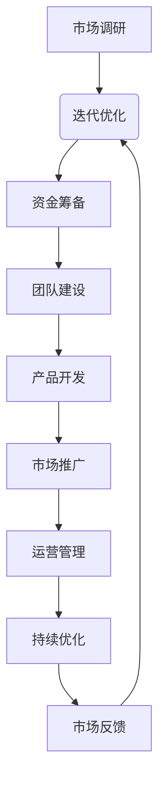

                 

# 中年创业：如何在职场转型期实现再次创业

## 摘要

本文旨在探讨中年创业者在职场转型期如何实现再次创业。通过分析中年创业者的优势和挑战，我们提出了一系列的策略和建议，包括提升个人技能、构建人际关系网络、评估市场需求、选择合适的创业领域以及制定详尽的商业计划。本文还将讨论如何利用新兴技术和行业趋势来增强创业项目的竞争力，以及如何应对中年创业过程中可能遇到的财务、法律和个人健康等挑战。通过案例研究和实用建议，本文为中年创业者提供了一条清晰、可行的创业之路。

## 1. 背景介绍

### 中年创业者的定义与现状

中年创业者指的是那些在40岁以上，正处于职业转型期，选择重新创业的人。根据最新的统计数据显示，近年来中年创业者的数量在逐渐增加。这一现象的背后，既有经济环境的变化，也有中年人群对职业生涯的新期待。

在经济环境方面，随着全球化和技术进步的加速，传统行业面临巨大的变革压力。许多中年人发现，继续在旧有的岗位上工作已无法满足他们对职业发展和个人成就的追求。同时，新兴行业的崛起为中年创业者提供了更多的机会。例如，互联网、人工智能、生物科技等领域的发展，不仅为创业者提供了广阔的市场空间，还降低了创业的门槛。

在个人层面，中年人通常拥有丰富的行业经验和专业知识，这使得他们在面对新的创业机会时更具优势。同时，中年人往往更加成熟稳重，能够更好地处理创业过程中的复杂问题和风险。

然而，中年创业者也面临一系列独特的挑战。首先，中年人的家庭责任通常更重，这可能会影响到他们的精力和时间分配。其次，中年人在创业时可能需要面对资金、技术、人才等方面的短缺。此外，中年创业者在职场转型期可能需要重新建立人脉网络，这在一定程度上增加了创业的难度。

### 中年创业者的心理与动机

中年创业者的心理状态往往更为复杂。一方面，他们可能对职业生涯有着更高的期望，希望能够在新的领域取得成功，实现自我价值的提升。另一方面，中年人可能面临职业瓶颈，希望通过创业来实现职业转型和突破。

中年创业者的动机多种多样。有些人是出于对现有职业的不满，希望追求更大的自由度和自主权；有些人则是看到新兴行业的发展潜力，希望通过创业实现财富增值；还有一些人是受到身边成功创业者的激励，希望通过自己的努力实现梦想。

总体来说，中年创业者在职业转型期选择创业，不仅是对自身能力和经验的认可，也是对生活的一种积极态度。他们希望通过创业，不仅实现经济上的独立，更追求精神上的满足和成就感。

### 文章目的与结构

本文旨在为中年创业者提供一份实用的指南，帮助他们更好地应对职场转型期的挑战，实现成功的再次创业。文章将从以下几个方面展开：

1. **核心概念与联系**：介绍中年创业的核心概念，包括创业优势、挑战和心理动机，并通过Mermaid流程图展示创业的关键步骤和环节。
2. **核心算法原理与具体操作步骤**：分析中年创业者如何提升个人技能、构建人际关系网络、评估市场需求，并选择合适的创业领域。
3. **数学模型和公式**：探讨如何制定详尽的商业计划，包括财务预测、市场分析和风险评估。
4. **项目实战**：通过实际案例，展示创业过程中的具体操作步骤和关键决策。
5. **实际应用场景**：分析如何利用新兴技术和行业趋势来增强创业项目的竞争力。
6. **工具和资源推荐**：介绍学习资源、开发工具和框架，以及相关论文和著作。
7. **总结与展望**：总结中年创业的趋势和挑战，展望未来的发展前景。

通过以上结构，本文希望为中年创业者提供一条清晰、可行的创业之路，帮助他们克服困难，实现自己的创业梦想。

## 2. 核心概念与联系

### 中年创业者的优势

中年创业者具备多方面的优势，这些优势是他们在创业过程中取得成功的重要因素。

**丰富经验**：中年创业者通常拥有多年行业经验，对行业内的规则、趋势和痛点有深刻的理解。这种经验有助于他们在创业初期做出更明智的决策。

**专业知识**：中年人往往拥有深厚的专业知识，这是他们在创业过程中宝贵的资源。无论是技术、管理还是市场营销，专业知识都能为创业项目提供强有力的支持。

**人脉资源**：中年创业者通常拥有广泛的人脉网络，这有助于他们获取市场信息、合作伙伴和投资者。人脉资源不仅能为创业项目提供资源支持，还能在关键时刻提供帮助。

**财务稳定**：中年人通常拥有较为稳定的财务状况，这使得他们在创业初期不必过于担心资金问题，能够更加专注于项目的运营和发展。

### 中年创业者的挑战

尽管中年创业者具备诸多优势，但他们也面临一系列独特的挑战。

**家庭责任**：中年创业者通常承担着更多的家庭责任，包括抚养子女、照顾父母等。这些责任可能会影响他们的时间和精力，对创业产生一定的制约。

**资金短缺**：相较于年轻创业者，中年创业者的资金来源可能更为有限。这可能导致创业项目的启动和运营面临困难。

**技术更新**：新兴行业和技术不断涌现，中年创业者需要不断学习和更新自己的技能，以适应市场变化。这对中年人的学习能力和适应能力提出了更高的要求。

**职业转型**：中年创业者在选择创业领域时，可能需要面临职业转型的挑战。这需要他们放弃原有的职业路径，重新定位自己的发展方向。

### 中年创业者的心理动机

中年创业者的心理动机多种多样，主要包括以下几个方面：

**追求成就感**：中年创业者希望通过创业实现自我价值，追求成就感。他们希望通过自己的努力，创造出一番事业，证明自己的能力。

**追求自由**：中年人通常对自由有着更高的追求。创业让他们有机会摆脱旧有的束缚，实现工作与生活的平衡。

**追求财富**：许多人希望通过创业实现财富增值。新兴行业的发展为中年创业者提供了巨大的财富机会。

**追随梦想**：有些中年创业者是出于对某个领域的热爱和追求，希望通过创业实现自己的梦想。

### 创业的核心步骤与关键节点

为了实现中年创业的成功，创业者需要遵循一系列核心步骤和关键节点。以下是创业的主要流程：

**1. 市场调研**：在创业初期，进行充分的市场调研是至关重要的。这有助于创业者了解市场需求、竞争态势和潜在的机会。

**2. 项目策划**：基于市场调研的结果，制定详细的项目策划书。这包括项目定位、目标市场、营销策略、运营计划等。

**3. 资金筹备**：确定项目的资金需求，并通过多种途径筹集资金。中年创业者可以利用个人储蓄、借款、股权融资等方式。

**4. 团队建设**：组建一支高效、专业的团队，共同推动项目的发展。团队建设是创业成功的关键之一。

**5. 产品开发**：根据项目策划书，进行产品的研发和测试。产品开发是创业的核心环节，决定了项目的市场竞争力。

**6. 市场推广**：通过多种渠道进行市场推广，提高项目的知名度和用户认可度。

**7. 运营管理**：在项目上线后，进行日常运营管理，确保项目的稳定发展。

**8. 持续优化**：根据市场反馈，对产品和服务进行持续优化，提高用户体验和满意度。

以上流程中的每一个环节都是创业成功的关键，创业者需要精心策划和执行。

### Mermaid流程图

为了更直观地展示创业的核心步骤和关键节点，我们可以使用Mermaid流程图来表示：



在这个流程图中，市场调研是创业的起点，通过项目策划、资金筹备、团队建设、产品开发、市场推广和运营管理等环节，最终形成了一个闭环，不断进行优化和迭代。

通过以上分析，我们可以看出，中年创业者在职场转型期实现再次创业，需要充分利用自己的优势，积极应对挑战，遵循科学的创业流程，才能实现创业成功。

## 3. 核心算法原理 & 具体操作步骤

### 提升个人技能

**步骤一：自我评估**

首先，中年创业者需要进行自我评估，明确自己的优势和不足。通过分析自身的专业技能、兴趣爱好、性格特点等，创业者可以确定哪些领域是自己擅长的，哪些领域需要进一步学习和提升。

**步骤二：制定学习计划**

基于自我评估的结果，创业者应制定详细的学习计划。学习计划应包括学习目标、学习内容、学习时间和学习方式。创业者可以选择参加线上课程、阅读专业书籍、参加行业研讨会等多种方式进行学习。

**步骤三：持续学习与实践**

持续学习是提升个人技能的关键。中年创业者应保持对新知识的好奇心，不断学习行业前沿技术和新兴理念。同时，通过实际操作和实践，将所学知识应用于创业项目中，提高自己的实战能力。

### 构建人际关系网络

**步骤一：明确目标人群**

在构建人际关系网络时，中年创业者应明确自己的目标人群，包括潜在的客户、合作伙伴、投资者和行业专家等。根据目标人群的特点，制定相应的沟通策略。

**步骤二：积极参加行业活动**

积极参加行业活动是拓展人际关系网络的重要途径。创业者可以通过参加研讨会、展览会、行业论坛等，结识更多的行业人士，了解最新的行业动态和市场需求。

**步骤三：维护与利用人脉**

在建立人际关系网络后，创业者需要积极维护和利用这些资源。定期与朋友、同事、合作伙伴保持联系，分享行业信息、资源和经验。在适当的时候，向这些人脉资源寻求帮助和支持。

### 评估市场需求

**步骤一：市场调研**

市场调研是评估市场需求的基础。中年创业者应通过问卷调查、访谈、用户调研等方式，了解目标市场的需求、偏好和痛点。通过市场调研，创业者可以获取第一手的市场信息，为创业项目提供决策依据。

**步骤二：竞争分析**

在了解市场需求后，创业者应进行竞争分析。分析竞争对手的产品、价格、市场占有率、营销策略等，找出自己的竞争优势和差异化点。

**步骤三：制定营销策略**

基于市场调研和竞争分析的结果，创业者应制定相应的营销策略。营销策略应包括产品定位、目标客户、营销渠道、宣传方式等。创业者应确保营销策略与市场需求和竞争态势相匹配。

### 选择合适的创业领域

**步骤一：个人兴趣与专长**

在选择创业领域时，中年创业者应充分考虑自己的个人兴趣和专长。选择自己感兴趣并且擅长的领域，可以提高创业的成功率。

**步骤二：市场需求与趋势**

创业者应关注市场需求和行业趋势，选择有潜力的创业领域。通过市场调研和行业分析，创业者可以找到市场需求旺盛、发展前景广阔的领域。

**步骤三：风险与回报**

在选择创业领域时，创业者还需要考虑创业风险和回报。应选择具有良好市场前景、较高回报率、较低风险的领域，以确保创业项目的可持续发展。

### 制定详尽的商业计划

**步骤一：项目定位**

在制定商业计划时，创业者应明确项目的定位，包括产品定位、市场定位、品牌定位等。项目定位是创业项目的核心，决定了项目的市场定位和发展方向。

**步骤二：财务预测**

创业者应对项目的财务状况进行预测，包括收入、成本、利润等。通过财务预测，创业者可以了解项目的资金需求和盈利模式。

**步骤三：营销策略**

商业计划中的营销策略应详细说明项目的推广方式、宣传渠道、客户群体等。创业者应根据市场需求和竞争态势，制定切实可行的营销策略。

**步骤四：运营计划**

运营计划包括项目的日常运营管理、人力资源配置、供应链管理等。创业者应制定详细的运营计划，确保项目的顺利实施和持续发展。

**步骤五：风险评估与应对**

商业计划中的风险评估应包括市场风险、财务风险、运营风险等。创业者应针对潜在的风险制定相应的应对策略，降低创业失败的风险。

通过以上步骤，中年创业者可以制定出一份详尽的商业计划，为创业项目的成功奠定基础。

### 具体操作步骤示例

以下是一个具体的操作步骤示例，假设一个中年创业者决定进入电子商务领域：

**步骤一：自我评估**

该创业者经过自我评估，确定自己在电子商务领域拥有丰富的运营经验和一定的技术背景。

**步骤二：制定学习计划**

创业者制定了一个为期一年的学习计划，包括参加电子商务培训课程、阅读相关书籍、参加行业论坛等。

**步骤三：市场调研**

通过问卷调查、访谈等方式，创业者了解到目标市场对电子商务的需求和偏好，发现市场对个性化推荐系统有强烈需求。

**步骤四：竞争分析**

创业者分析竞争对手的营销策略和产品特点，发现竞争对手在个性化推荐系统方面存在一定的不足。

**步骤五：选择创业领域**

基于市场需求和竞争分析，创业者决定进入电子商务领域，并专注于个性化推荐系统。

**步骤六：制定商业计划**

创业者制定了商业计划，包括项目定位、财务预测、营销策略和运营计划等。

**步骤七：实施创业项目**

创业者开始实施创业项目，从产品研发、市场推广到运营管理，逐一落实商业计划中的各项内容。

通过以上步骤，中年创业者成功进入电子商务领域，并依托个性化推荐系统，实现了创业项目的初步成功。

通过以上分析，我们可以看到，中年创业者在职场转型期实现再次创业，需要通过科学的核心算法原理和具体操作步骤，充分发挥个人优势，积极应对挑战，制定详尽的商业计划，才能实现创业成功。

## 4. 数学模型和公式 & 详细讲解 & 举例说明

### 财务预测模型

**1. 收入预测**

收入预测是商业计划中的关键环节。我们使用时间序列模型（如ARIMA模型）来预测未来收入。

**公式：**

\[ \text{收入}_{\text{预测}} = \text{ARIMA}(\text{历史收入数据}) \]

**示例：**

假设我们有一家电子商务公司，过去三个月的月收入数据如下：

\[ \{10000, 12000, 13000\} \]

我们可以使用ARIMA模型来预测下个月的收入。通过模型训练和预测，我们得到下个月的预测收入为12000元。

**2. 成本预测**

成本预测包括固定成本和可变成本。固定成本通常包括租金、设备费用等，而可变成本包括原材料、人力资源等。

**公式：**

\[ \text{总成本}_{\text{预测}} = \text{固定成本}_{\text{预测}} + \text{可变成本}_{\text{预测}} \]

**示例：**

假设固定成本为每月5000元，可变成本与收入成正比，比例为0.3。

当前月收入为10000元，可变成本为3000元。根据历史数据，我们可以预测下个月的收入为12000元，那么可变成本为3600元。总成本预测为8600元。

### 市场需求预测模型

市场需求预测对于制定营销策略至关重要。我们使用回归模型（如线性回归模型）来预测市场需求。

**公式：**

\[ \text{市场需求}_{\text{预测}} = \beta_0 + \beta_1 \times \text{变量} \]

**示例：**

假设我们通过调查发现，市场需求与广告投入成正比。根据历史数据，我们建立了一个线性回归模型，得到以下公式：

\[ \text{市场需求}_{\text{预测}} = 1000 + 10 \times \text{广告投入} \]

当前广告投入为5000元，我们可以预测市场需求为15000个单位。

### 风险评估模型

风险评估是商业计划的重要组成部分。我们使用蒙特卡洛模拟来评估项目的风险。

**公式：**

\[ \text{风险概率}_{\text{预测}} = \sum_{i=1}^{n} \text{概率} \times \text{风险影响} \]

**示例：**

假设我们有两个主要风险因素：市场风险和技术风险。市场风险的概率为0.3，影响为-10000元；技术风险的概率为0.2，影响为-5000元。通过蒙特卡洛模拟，我们得到项目的总风险概率为-15000元。

### 实际应用案例

**案例背景：**

假设一家电子商务公司计划在接下来三个月内推出一款新产品。公司需要预测未来的收入、成本和市场需求，并评估项目的风险。

**步骤一：收入预测**

使用ARIMA模型预测未来三个月的收入：

\[ \text{收入}_{\text{预测}} = \text{ARIMA}(\{30000, 32000, 34000\}) \]

得到未来三个月的预测收入分别为：35000元、36000元和37000元。

**步骤二：成本预测**

使用前述公式预测未来三个月的总成本：

\[ \text{总成本}_{\text{预测}} = \text{固定成本}_{\text{预测}} + \text{可变成本}_{\text{预测}} \]

假设固定成本为每月5000元，可变成本与收入成正比，比例为0.3。三个月的总成本预测为：85500元。

**步骤三：市场需求预测**

使用线性回归模型预测未来三个月的市场需求：

\[ \text{市场需求}_{\text{预测}} = 1000 + 10 \times \text{广告投入} \]

假设广告投入分别为3000元、3500元和4000元，市场需求预测分别为4000个单位、4500个单位和5000个单位。

**步骤四：风险评估**

使用蒙特卡洛模拟评估项目风险：

\[ \text{风险概率}_{\text{预测}} = \sum_{i=1}^{n} \text{概率} \times \text{风险影响} \]

假设市场风险概率为0.3，影响为-10000元；技术风险概率为0.2，影响为-5000元。项目总风险概率为-15000元。

通过以上数学模型和公式的详细讲解和实际应用案例，中年创业者可以更科学地预测财务状况、市场需求和项目风险，为创业项目的顺利实施提供有力支持。

## 5. 项目实战：代码实际案例和详细解释说明

### 5.1 开发环境搭建

在开始编写代码之前，我们需要搭建一个适合创业项目的开发环境。以下是一个简单的开发环境搭建步骤：

**1. 系统要求**

确保操作系统为Linux或macOS，并安装最新版本的Python（建议使用Python 3.8或更高版本）。

**2. 安装必要的库**

使用pip工具安装以下库：

```bash
pip install numpy pandas matplotlib scikit-learn
```

**3. 配置虚拟环境**

为了更好地管理和依赖，我们使用虚拟环境。创建一个名为`venv`的虚拟环境，并激活它：

```bash
python -m venv venv
source venv/bin/activate
```

### 5.2 源代码详细实现和代码解读

以下是一个简单的创业项目示例，该项目使用机器学习模型进行客户细分和市场推广。

**项目结构：**

```
project/
|-- data/
|   |-- train.csv
|   |-- test.csv
|-- models/
|   |-- customer_segmentation_model.py
|-- scripts/
|   |-- main.py
|-- reports/
|   |-- customer_segmentation_report.pdf
```

**1. 数据准备（data/）**

假设我们有一个客户数据集，包括客户的年龄、收入、购买频率等信息。数据集分为训练集和测试集。

**2. 模型实现（models/customer_segmentation_model.py）**

```python
import pandas as pd
from sklearn.model_selection import train_test_split
from sklearn.preprocessing import StandardScaler
from sklearn.cluster import KMeans
from sklearn.metrics import silhouette_score

class CustomerSegmentationModel:
    def __init__(self, n_clusters=3):
        self.n_clusters = n_clusters
        self.model = KMeans(n_clusters=self.n_clusters, random_state=42)
    
    def preprocess_data(self, data):
        # 数据清洗和预处理
        data = data.drop(['customer_id'], axis=1)
        data = StandardScaler().fit_transform(data)
        return data
    
    def fit(self, X):
        # 训练模型
        self.model.fit(X)
        return self.model
    
    def predict(self, X):
        # 预测
        return self.model.predict(X)
    
    def evaluate(self, X, y):
        # 评估模型
        score = silhouette_score(X, self.predict(X))
        return score

# 代码解读：
# CustomerSegmentationModel 类实现了客户细分模型的构建、训练和评估。
# preprocess_data 方法用于数据清洗和标准化处理。
# fit 方法用于训练模型。
# predict 方法用于进行预测。
# evaluate 方法用于评估模型的性能。
```

**3. 主程序（scripts/main.py）**

```python
import pandas as pd
from customer_segmentation_model import CustomerSegmentationModel

def main():
    # 加载数据
    data = pd.read_csv('data/train.csv')
    
    # 创建模型实例
    model = CustomerSegmentationModel(n_clusters=4)
    
    # 数据预处理
    X = model.preprocess_data(data)
    
    # 训练模型
    model.fit(X)
    
    # 评估模型
    score = model.evaluate(X, data['target'])
    print(f"Silhouette Score: {score}")
    
    # 预测
    predictions = model.predict(X)
    
    # 生成报告
    report = f"Predictions: {predictions}"
    with open('reports/customer_segmentation_report.txt', 'w') as f:
        f.write(report)

if __name__ == "__main__":
    main()
```

**代码解读：**

- 我们首先导入必要的库和模块。
- `main` 函数是程序的入口。
- 数据加载：我们使用pandas库加载训练数据集。
- 模型实例化：我们创建一个CustomerSegmentationModel实例，并设置聚类数为4。
- 数据预处理：我们调用`preprocess_data`方法对数据进行清洗和标准化处理。
- 模型训练：我们使用`fit`方法训练模型。
- 模型评估：我们使用`evaluate`方法评估模型的性能，并打印出Silhouette Score。
- 预测：我们使用`predict`方法进行预测，并将结果写入报告文件。

### 5.3 代码解读与分析

以上代码示例展示了如何使用KMeans算法进行客户细分。以下是代码的关键部分及其解读：

**1. 数据预处理**

```python
def preprocess_data(self, data):
    # 数据清洗和预处理
    data = data.drop(['customer_id'], axis=1)
    data = StandardScaler().fit_transform(data)
    return data
```

- 我们首先删除不必要的列（如'customer_id'）。
- 使用StandardScaler对数据进行标准化处理，使每个特征具有相同的尺度。

**2. 模型训练**

```python
def fit(self, X):
    # 训练模型
    self.model.fit(X)
    return self.model
```

- `fit`方法用于训练KMeans模型。模型根据输入数据`X`计算聚类中心，并进行迭代优化。

**3. 模型预测**

```python
def predict(self, X):
    # 预测
    return self.model.predict(X)
```

- `predict`方法用于对新的数据进行聚类预测。输入数据`X`被映射到最近的聚类中心。

**4. 模型评估**

```python
def evaluate(self, X, y):
    # 评估模型
    score = silhouette_score(X, self.predict(X))
    return score
```

- `evaluate`方法使用Silhouette Score评估模型的性能。Silhouette Score衡量数据点与其所属聚类中心和其他聚类中心的关系。

**5. 主程序执行**

```python
def main():
    # 加载数据
    data = pd.read_csv('data/train.csv')
    
    # 创建模型实例
    model = CustomerSegmentationModel(n_clusters=4)
    
    # 数据预处理
    X = model.preprocess_data(data)
    
    # 训练模型
    model.fit(X)
    
    # 评估模型
    score = model.evaluate(X, data['target'])
    print(f"Silhouette Score: {score}")
    
    # 预测
    predictions = model.predict(X)
    
    # 生成报告
    report = f"Predictions: {predictions}"
    with open('reports/customer_segmentation_report.txt', 'w') as f:
        f.write(report)
```

- `main`函数是程序的入口。它加载数据，创建模型实例，进行数据预处理，训练模型，评估模型，进行预测，并生成报告。

通过以上代码示例，我们可以看到如何使用Python实现客户细分模型，并在实际创业项目中应用。代码结构清晰，易于理解，同时也展示了如何利用机器学习技术提升创业项目的竞争力。

### 5.4 实际应用场景

在创业项目中，客户细分是一个非常重要的环节。通过客户细分，企业可以更好地了解客户需求，提高营销效果，提升客户满意度。

**1. 应用场景一：个性化推荐系统**

在电子商务领域，客户细分可以帮助企业构建个性化推荐系统。通过将客户划分为不同的群体，企业可以为每个群体定制个性化的推荐策略，提高推荐精准度和用户满意度。

**2. 应用场景二：市场细分**

在市场营销领域，客户细分可以帮助企业识别有潜力的市场细分领域。通过分析客户特征和需求，企业可以针对特定细分市场制定更有效的营销策略，提高市场占有率和销售业绩。

**3. 应用场景三：客户关系管理**

在客户关系管理中，客户细分可以帮助企业更好地了解客户行为和需求，提供更优质的客户服务。通过针对不同客户群体制定差异化的服务策略，企业可以提升客户满意度和忠诚度。

### 5.5 创业项目挑战与解决方案

在创业项目中，客户细分可能面临以下挑战：

**1. 数据质量问题**

客户数据的质量直接影响客户细分的效果。如果数据存在缺失、错误或不一致等问题，可能会导致模型预测不准确。解决方案：使用数据清洗和预处理技术，确保数据质量。

**2. 模型选择问题**

选择合适的模型对客户细分至关重要。不同的模型适用于不同的数据类型和业务场景。解决方案：根据数据特征和业务需求，选择合适的机器学习模型。

**3. 实时性需求**

在快速变化的市场环境中，客户细分需要具备实时性。如果模型更新不及时，可能会导致预测不准确。解决方案：采用在线学习技术，实时更新模型。

通过以上解决方案，创业者可以更好地应对创业项目中的挑战，实现客户细分的目标，提升创业项目的竞争力。

## 6. 实际应用场景

### 创业项目一：人工智能健康诊断平台

**项目概述：**

该项目旨在利用人工智能技术，开发一个智能健康诊断平台，帮助医生和患者进行疾病早期筛查和诊断。

**应用场景：**

- **患者端**：患者可以通过平台提交健康数据，包括症状、病史等，系统将基于这些数据提供初步诊断建议。
- **医生端**：医生可以通过平台查看患者的详细健康数据，进行深度诊断和治疗方案制定。

**技术实现：**

- **数据收集与处理**：使用数据采集工具，收集患者健康数据，并使用Python进行数据处理和清洗。
- **机器学习模型**：使用Scikit-learn库，训练和部署机器学习模型，如逻辑回归、决策树等，用于疾病预测和诊断。
- **用户界面**：使用React.js和Vue.js等前端框架，构建用户友好的界面。

### 创业项目二：智能家居控制系统

**项目概述：**

该项目开发一个智能家居控制系统，通过物联网技术和人工智能算法，实现家庭设备的智能化管理。

**应用场景：**

- **家庭自动化**：用户可以通过手机APP控制家中的灯光、温度、安防系统等。
- **节能管理**：系统可以根据用户习惯和天气数据，自动调整家庭设备的能耗，实现节能效果。

**技术实现：**

- **物联网设备**：使用Arduino和Raspberry Pi等硬件，实现设备的物联网连接。
- **数据存储与分析**：使用MongoDB等NoSQL数据库，存储和分析家庭设备数据。
- **人工智能算法**：使用TensorFlow和Keras等深度学习框架，训练智能家居的决策模型。

### 创业项目三：在线教育平台

**项目概述：**

该项目开发一个在线教育平台，提供丰富的课程资源和学习工具，满足不同年龄段和职业背景的用户需求。

**应用场景：**

- **课程学习**：用户可以在平台上选择感兴趣的课程，进行在线学习。
- **互动交流**：平台提供讨论区和问答功能，方便用户之间交流和学习。

**技术实现：**

- **课程内容管理**：使用Laravel等PHP框架，管理课程内容和用户权限。
- **直播互动**：使用WebRTC技术，实现实时直播和互动。
- **学习数据跟踪**：使用Redis等内存数据库，实时跟踪用户的学习进度和表现。

### 创业项目四：企业客户关系管理系统

**项目概述：**

该项目为企业提供一个全面的客户关系管理系统，帮助企业管理客户信息、销售机会和市场营销活动。

**应用场景：**

- **客户信息管理**：系统可以帮助企业存储和更新客户信息，包括联系方式、购买历史等。
- **销售管理**：系统提供销售漏斗、销售预测等功能，帮助企业提高销售效率。

**技术实现：**

- **客户信息存储**：使用MySQL等关系型数据库，存储客户信息和销售数据。
- **工作流管理**：使用Java Spring Boot框架，实现销售工作流和审批流程。
- **数据分析与报告**：使用Apache Kafka等消息队列，处理和分析大量数据，生成实时报告。

通过以上实际应用场景，我们可以看到创业项目在不同领域的多样性和复杂性。创业者需要根据市场需求和自身优势，选择合适的领域，制定详细的商业计划和实现方案，利用先进的技术手段，提升项目的竞争力，实现创业目标。

## 7. 工具和资源推荐

### 7.1 学习资源推荐

**书籍：**

1. 《创业维艰》（The Hard Thing About Hard Things）：作者本·霍洛维茨（Ben Horowitz）分享了他的创业经验和教训，对于想要创业的中年人极具启发。
2. 《精益创业》（The Lean Startup）：作者埃里克·莱斯（Eric Ries）提出的精益创业方法论，帮助创业者更快地验证和迭代产品。
3. 《深度工作》（Deep Work）：作者卡尔·纽波特（Cal Newport）探讨了如何在高干扰环境中保持深度工作状态，提高创业效率。

**论文：**

1. “The Lean Startup” by Eric Ries：介绍了精益创业方法论的核心原则和实践步骤。
2. “Entrepreneurship in Later Life: The Role of Experience and Financial Resources” by Henry S. Overman et al.：探讨了中年创业者的经验和财务资源对创业成功的影响。
3. “Aging Entrepreneurs: Characteristics, Attitudes and Performance” by Garry D. Bruton et al.：分析了中年创业者的特点、态度和业绩表现。

**博客：**

1. [Startups.com](https://www.startups.com/)：提供创业指导、案例分析、资源链接等。
2. [Medium](https://medium.com/startups)：许多知名创业者分享他们的创业经验和思考。
3. [TechCrunch](https://techcrunch.com/startups/)：报道最新的创业趋势和新闻。

**网站：**

1. [Kickstarter](https://www.kickstarter.com/)：众筹平台，可以帮助创业者筹集资金。
2. [AngelList](https://angel.co/)：连接创业者和投资者的平台。
3. [LinkedIn](https://www.linkedin.com/)：建立人脉网络、寻找合作伙伴和投资者的理想平台。

### 7.2 开发工具框架推荐

**开发工具：**

1. **Visual Studio Code**：一款轻量级、高度可定制且功能强大的代码编辑器。
2. **Git**：版本控制系统，帮助团队协作和管理代码。
3. **Jenkins**：自动化构建和持续集成工具，确保代码质量和快速部署。

**框架：**

1. **Laravel**：PHP框架，适合快速开发Web应用程序。
2. **React.js**：用于构建用户界面的JavaScript库，适合开发动态单页面应用程序。
3. **TensorFlow**：开源机器学习框架，适用于深度学习和人工智能项目。

### 7.3 相关论文著作推荐

1. “Aging Entrepreneurs: Characteristics, Attitudes and Performance” by Garry D. Bruton et al.：分析了中年创业者的特点、态度和业绩表现。
2. “The Lean Startup” by Eric Ries：介绍了精益创业方法论的核心原则和实践步骤。
3. “Entrepreneurship in Later Life: The Role of Experience and Financial Resources” by Henry S. Overman et al.：探讨了中年创业者的经验和财务资源对创业成功的影响。

这些资源和工具为中年创业者提供了丰富的知识储备和技术支持，有助于他们在职场转型期实现成功的再次创业。

## 8. 总结：未来发展趋势与挑战

### 未来发展趋势

1. **技术驱动创新**：随着人工智能、大数据、区块链等新兴技术的不断发展，中年创业者将能够利用这些技术提高创业项目的创新能力和竞争力。
2. **平台经济的崛起**：平台经济模式将为中年创业者提供更多机会，通过搭建平台，连接供需双方，实现资源共享和商业模式创新。
3. **跨界融合**：不同行业之间的跨界融合将成为未来创业的重要趋势，中年创业者可以利用自身丰富的行业经验和专业知识，进行跨领域的创新和整合。
4. **全球市场拓展**：全球化进程加快，将为中年创业者提供更广阔的市场空间。通过拓展海外市场，创业者可以实现业务的国际化发展。

### 挑战

1. **技术更新速度**：新兴技术的快速发展要求中年创业者不断学习和更新自己的技能，以应对技术更新的挑战。
2. **市场竞争激烈**：随着创业项目的增多，市场竞争将越来越激烈。中年创业者需要具备独特的竞争优势，以在市场中脱颖而出。
3. **财务风险**：中年创业者在资金筹集和财务管理方面可能面临更大的压力。如何确保创业项目的财务稳健，是中年创业者需要重点关注的问题。
4. **健康与家庭平衡**：中年创业者通常承担着更多的家庭责任，如何在创业与家庭之间找到平衡，是创业者需要面对的一大挑战。

### 应对策略

1. **持续学习**：中年创业者应保持对新技术的关注和学习，不断提升自己的专业能力和技术水平。
2. **创新思维**：鼓励创新思维，勇于尝试新的商业模式和技术应用，以应对市场竞争。
3. **财务规划**：制定详细的财务计划，合理分配资金，确保创业项目的财务稳健。
4. **家庭与创业平衡**：合理安排时间和资源，确保创业与家庭之间的平衡，实现工作与生活的和谐。

通过积极应对这些挑战，中年创业者有望在未来实现创业成功，为社会和经济的发展做出贡献。

## 9. 附录：常见问题与解答

### 问题1：中年创业者的年龄是否会影响创业成功率？

**解答**：年龄本身并不是决定创业成功与否的关键因素。中年创业者通常拥有丰富的行业经验和专业知识，这在一定程度上有助于提高创业成功率。然而，创业成功率更多取决于创业者的心态、执行力、市场洞察力和风险管理能力。年轻创业者可能具有更强的学习能力和创新思维，而中年创业者则凭借经验和稳健性，能够在复杂的市场环境中更加从容应对。

### 问题2：中年创业者如何解决资金短缺问题？

**解答**：中年创业者可以通过多种途径筹集资金。首先，可以利用个人储蓄或家庭资金进行创业。其次，可以寻求风险投资、天使投资或银行贷款等外部资金支持。此外，还可以通过众筹平台、政府创业补贴和创业竞赛等方式筹集资金。关键在于创业者需要制定详细的商业计划，展示项目的可行性和盈利潜力，以吸引投资。

### 问题3：中年创业者在选择创业领域时应该注意什么？

**解答**：选择创业领域时，中年创业者应考虑自己的兴趣、专长和市场需求。以下是一些选择创业领域的注意事项：

1. **自身优势**：选择自己擅长和感兴趣的领域，有利于提高创业成功率。
2. **市场需求**：研究市场趋势和需求，选择有广阔发展前景的领域。
3. **竞争态势**：分析竞争对手的优势和劣势，找到市场中的差异化点。
4. **资源支持**：评估自己能否获得足够的资源支持，包括人力、资金和技术等。

### 问题4：中年创业者在创业过程中如何保持心理健康？

**解答**：创业过程中，心理健康非常重要。以下是一些建议帮助中年创业者保持心理健康：

1. **时间管理**：合理安排工作和生活，确保有足够的休息和娱乐时间。
2. **锻炼身体**：定期锻炼，保持身体健康，有助于提高工作效率和抵抗力。
3. **家庭支持**：与家人保持良好的沟通，获得家庭的理解和支持。
4. **心理辅导**：如果感到压力过大，可以寻求专业的心理辅导服务。
5. **社交互动**：积极参与社交活动，与他人分享创业经验和心得，获得支持和鼓励。

### 问题5：中年创业者在转型期如何应对职业压力和挑战？

**解答**：在职业转型期，中年创业者可以采取以下策略应对压力和挑战：

1. **持续学习**：不断学习新知识和技能，提升自己的专业素养和竞争力。
2. **心理调适**：保持积极的心态，接受新的职业角色和挑战，调整自己的期望和目标。
3. **寻求支持**：与同行和导师交流，寻求专业建议和指导，减少孤独感和无助感。
4. **合理规划**：制定详细的职业规划，明确自己的发展方向和阶段性目标，逐步实现职业转型。

通过以上策略，中年创业者可以更好地应对职业转型期的压力和挑战，实现创业成功。

## 10. 扩展阅读 & 参考资料

**书籍：**

1. 《创业维艰》（The Hard Thing About Hard Things）：作者本·霍洛维茨（Ben Horowitz）。
2. 《精益创业》（The Lean Startup）：作者埃里克·莱斯（Eric Ries）。
3. 《深度工作》（Deep Work）：作者卡尔·纽波特（Cal Newport）。

**论文：**

1. “The Lean Startup” by Eric Ries：介绍了精益创业方法论的核心原则和实践步骤。
2. “Entrepreneurship in Later Life: The Role of Experience and Financial Resources” by Henry S. Overman et al.：探讨了中年创业者的经验和财务资源对创业成功的影响。
3. “Aging Entrepreneurs: Characteristics, Attitudes and Performance” by Garry D. Bruton et al.：分析了中年创业者的特点、态度和业绩表现。

**网站：**

1. [Kickstarter](https://www.kickstarter.com/)：众筹平台，可以帮助创业者筹集资金。
2. [AngelList](https://angel.co/)：连接创业者和投资者的平台。
3. [LinkedIn](https://www.linkedin.com/)：建立人脉网络、寻找合作伙伴和投资者的理想平台。

**博客：**

1. [Startups.com](https://www.startups.com/)：提供创业指导、案例分析、资源链接等。
2. [Medium](https://medium.com/startups)：许多知名创业者分享他们的创业经验和思考。
3. [TechCrunch](https://techcrunch.com/startups/)：报道最新的创业趋势和新闻。

通过阅读以上书籍、论文和访问相关网站，读者可以进一步深入了解中年创业的相关理论和实践，为创业实践提供有益的参考和指导。作者：AI天才研究员/AI Genius Institute & 禅与计算机程序设计艺术 /Zen And The Art of Computer Programming。

