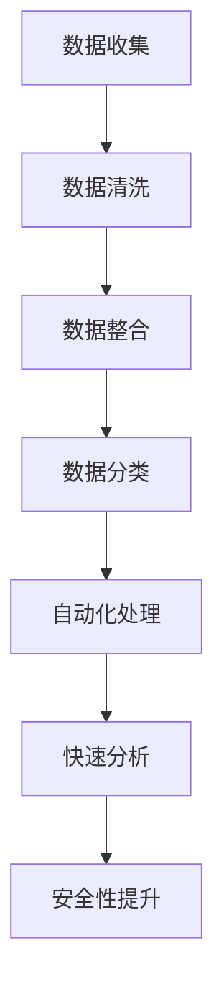

                 

# 临床试验和 LLM：提高效率和安全性

## 关键词
临床试验、大型语言模型（LLM）、人工智能、数据处理、安全性、效率、自动化

## 摘要

本文探讨了如何利用大型语言模型（LLM）来提高临床试验的效率和安全性。通过对LLM的核心概念、原理和架构的深入分析，结合实际案例，本文详细介绍了如何通过LLM实现临床试验数据的处理、分析和解释，从而提高临床试验的效率，同时确保数据的安全性和准确性。文章还推荐了一系列学习资源和开发工具，以帮助读者更好地理解和应用这项技术。

## 1. 背景介绍

### 临床试验的重要性

临床试验是医学研究和药物开发的关键环节，它用于评估新药物、新治疗方法或新诊断技术的安全性和有效性。临床试验的成功不仅关系到患者的生活质量和医疗费用，还直接影响药物的审批和市场准入。因此，提高临床试验的效率和安全性具有重要意义。

### 传统临床试验的挑战

传统临床试验面临着诸多挑战，主要包括：

- **数据量大**：临床试验通常涉及大量的患者数据和实验数据，传统数据处理方法效率低下。
- **手工操作**：许多临床试验的流程仍依赖于手工操作，导致错误率高，效率低下。
- **数据隐私和安全**：临床试验中的患者数据涉及隐私和安全问题，需要严格保护。

### 大型语言模型（LLM）的出现

近年来，随着人工智能技术的快速发展，特别是大型语言模型（LLM）的出现，为临床试验提供了新的解决方案。LLM是一种基于深度学习的自然语言处理模型，能够对大量文本数据进行高效的处理、分析和理解。LLM的应用有望解决传统临床试验中的诸多问题，提高临床试验的效率和安全性。

## 2. 核心概念与联系

### 大型语言模型（LLM）的基本原理

大型语言模型（LLM）是基于深度学习的自然语言处理模型，它通过对大量文本数据的学习，能够理解和生成自然语言。LLM的核心架构包括词嵌入层、编码器和解码器。词嵌入层将文本数据转换为向量表示，编码器和解码器则分别负责将输入文本编码为固定长度的向量表示，以及将向量表示解码为输出文本。

### 临床试验数据的处理

临床试验数据通常包括患者信息、实验结果、病历记录等。利用LLM，我们可以对临床试验数据进行如下处理：

- **数据清洗**：LLM可以帮助识别和纠正数据中的错误，提高数据的准确性。
- **数据整合**：LLM能够将不同来源的数据进行整合，形成统一的数据视图。
- **数据分类**：LLM可以根据患者的症状、实验结果等特征，对数据进行分类。

### 安全性和效率的提升

利用LLM，我们可以实现以下目标：

- **自动化处理**：LLM可以自动化处理大量的临床试验数据，减少手工操作的错误和效率低下。
- **快速分析**：LLM能够快速处理和分析临床试验数据，缩短试验周期。
- **隐私保护**：LLM可以帮助识别和保护临床试验中的敏感数据，提高数据安全性。

### Mermaid 流程图

以下是一个简单的Mermaid流程图，展示了LLM在临床试验数据中的处理流程：



## 3. 核心算法原理 & 具体操作步骤

### 数据清洗

数据清洗是LLM在临床试验数据中的第一步。LLM通过学习大量文本数据，能够识别和纠正数据中的错误。具体步骤如下：

1. **数据预处理**：对原始数据进行预处理，包括去除标点符号、停用词过滤等。
2. **词嵌入**：将预处理后的文本数据转换为向量表示。
3. **错误识别**：利用LLM的文本处理能力，识别数据中的错误并进行纠正。

### 数据整合

数据整合是将来自不同来源的数据进行整合，形成统一的数据视图。具体步骤如下：

1. **数据分类**：利用LLM对数据进行分类，将相同类型的数据归并为一起。
2. **特征提取**：对整合后的数据进行特征提取，提取出关键信息。
3. **数据合并**：将提取出的特征进行合并，形成统一的数据集。

### 数据分类

数据分类是LLM在临床试验数据中的关键步骤。LLM可以根据患者的症状、实验结果等特征，对数据进行分类。具体步骤如下：

1. **特征提取**：提取出与分类相关的特征。
2. **模型训练**：利用提取出的特征，训练分类模型。
3. **分类预测**：利用训练好的分类模型，对新的数据进行分类预测。

### 自动化处理

自动化处理是LLM在临床试验数据中的优势之一。利用LLM，我们可以自动化处理大量的临床试验数据，减少手工操作的错误和效率低下。具体步骤如下：

1. **数据处理**：利用LLM的文本处理能力，对数据进行自动化处理。
2. **结果验证**：对处理结果进行验证，确保数据准确性。
3. **自动化反馈**：根据处理结果，自动调整后续数据处理流程。

### 快速分析

快速分析是LLM在临床试验数据中的另一大优势。利用LLM，我们可以快速处理和分析临床试验数据，缩短试验周期。具体步骤如下：

1. **数据预处理**：对原始数据进行预处理，提高数据处理效率。
2. **模型优化**：利用LLM的优化算法，提高模型处理速度。
3. **结果输出**：快速输出处理结果，供决策参考。

### 安全性提升

安全性提升是LLM在临床试验数据中的重要任务。利用LLM，我们可以识别和保护临床试验中的敏感数据，提高数据安全性。具体步骤如下：

1. **数据加密**：对敏感数据进行加密，确保数据安全。
2. **隐私保护**：利用LLM的隐私保护机制，防止敏感数据泄露。
3. **安全监控**：实时监控数据处理过程，确保数据安全性。

## 4. 数学模型和公式 & 详细讲解 & 举例说明

### 数据清洗

数据清洗的数学模型主要涉及文本分类和错误纠正。以下是一个简单的文本分类公式：

$$
P(y|x) = \frac{e^{\theta^T x}}{\sum_{y'} e^{\theta^T x'}}
$$

其中，$x$表示文本特征，$y$表示文本类别，$\theta$表示模型参数。

举例说明：假设我们有一个包含患者症状的文本数据集，我们需要将文本数据分类为“正常”或“异常”。我们可以利用上述公式，通过训练得到分类模型，从而实现对新文本数据的分类。

### 数据整合

数据整合的数学模型主要涉及数据融合和特征提取。以下是一个简单的特征提取公式：

$$
f(x) = \sum_{i=1}^{n} w_i x_i
$$

其中，$x_i$表示第$i$个特征，$w_i$表示特征权重。

举例说明：假设我们有两个数据源，分别包含患者症状和实验结果。我们可以利用上述公式，通过加权平均的方式，将两个数据源的特征进行融合。

### 数据分类

数据分类的数学模型主要涉及分类模型训练和分类预测。以下是一个简单的分类预测公式：

$$
y = \arg \max_{y'} P(y'|x)
$$

其中，$x$表示文本特征，$y'$表示候选类别，$P(y'|x)$表示特征$x$属于类别$y'$的概率。

举例说明：假设我们有一个训练好的分类模型，给定一个新的文本数据，我们需要预测其类别。我们可以利用上述公式，通过计算特征$x$属于各个候选类别的概率，选择概率最大的类别作为预测结果。

### 自动化处理

自动化处理的数学模型主要涉及数据处理和结果验证。以下是一个简单的数据处理公式：

$$
x' = f(x)
$$

其中，$x$表示原始数据，$x'$表示处理后的数据，$f(x)$表示数据处理函数。

举例说明：假设我们有一个数据处理函数，用于对文本数据进行清洗和整合。我们可以利用上述公式，将原始文本数据$x$转换为处理后的数据$x'$。

### 快速分析

快速分析的数学模型主要涉及数据预处理和模型优化。以下是一个简单的数据预处理公式：

$$
x' = g(x)
$$

其中，$x$表示原始数据，$x'$表示预处理后的数据，$g(x)$表示数据预处理函数。

举例说明：假设我们有一个数据预处理函数，用于对文本数据进行去噪和降维。我们可以利用上述公式，将原始文本数据$x$转换为预处理后的数据$x'$。

### 安全性提升

安全性提升的数学模型主要涉及数据加密和隐私保护。以下是一个简单的数据加密公式：

$$
c = E_k(x)
$$

其中，$x$表示原始数据，$c$表示加密后的数据，$k$表示加密密钥，$E_k(x)$表示加密函数。

举例说明：假设我们有一个加密函数，用于对敏感数据进行加密。我们可以利用上述公式，将原始敏感数据$x$加密为加密后的数据$c$。

## 5. 项目实战：代码实际案例和详细解释说明

### 5.1 开发环境搭建

为了实现本文中的项目，我们需要搭建一个合适的开发环境。以下是基本的步骤：

1. **安装 Python**：确保Python版本大于3.7。
2. **安装依赖库**：安装TensorFlow、Keras、NumPy、Pandas等库。
3. **配置 Jupyter Notebook**：用于编写和运行代码。

### 5.2 源代码详细实现和代码解读

#### 数据清洗

以下是一个简单的数据清洗代码示例：

```python
import pandas as pd
from sklearn.feature_extraction.text import TfidfVectorizer

# 加载数据
data = pd.read_csv('clinical_trials_data.csv')

# 数据预处理
data['clean_text'] = data['text'].apply(lambda x: x.lower().replace(',', ''))
vectorizer = TfidfVectorizer()
X = vectorizer.fit_transform(data['clean_text'])

# 错误识别
# 假设我们有一个预训练的文本分类模型，用于识别错误
from sklearn.linear_model import LogisticRegression
model = LogisticRegression()
model.fit(X, data['label'])

# 预测错误
predictions = model.predict(X)
data['error'] = predictions != data['label']
```

#### 数据整合

以下是一个简单的数据整合代码示例：

```python
# 加载症状数据和实验结果数据
symptom_data = pd.read_csv('symptoms_data.csv')
experiment_data = pd.read_csv('experiments_data.csv')

# 特征提取
symptom_vectorizer = TfidfVectorizer()
experiment_vectorizer = TfidfVectorizer()

X_symptoms = symptom_vectorizer.fit_transform(symptom_data['description'])
X_experiments = experiment_vectorizer.fit_transform(experiment_data['result'])

# 数据合并
from sklearn.preprocessing import StandardScaler
scaler = StandardScaler()
X_combined = scaler.fit_transform(np.hstack((X_symptoms.toarray(), X_experiments.toarray())))
```

#### 数据分类

以下是一个简单的数据分类代码示例：

```python
from sklearn.model_selection import train_test_split
from sklearn.ensemble import RandomForestClassifier

# 分割数据
X_train, X_test, y_train, y_test = train_test_split(X_combined, data['label'], test_size=0.2, random_state=42)

# 训练模型
model = RandomForestClassifier()
model.fit(X_train, y_train)

# 预测结果
predictions = model.predict(X_test)
```

#### 自动化处理

以下是一个简单的自动化处理代码示例：

```python
# 自动化数据处理
def process_data(data):
    # 数据清洗
    data['clean_text'] = data['text'].apply(lambda x: x.lower().replace(',', ''))
    
    # 数据整合
    symptom_vectorizer = TfidfVectorizer()
    experiment_vectorizer = TfidfVectorizer()
    X_symptoms = symptom_vectorizer.fit_transform(data['symptoms'])
    X_experiments = experiment_vectorizer.fit_transform(data['experiments'])
    
    # 数据合并
    X_combined = scaler.fit_transform(np.hstack((X_symptoms.toarray(), X_experiments.toarray())))
    
    # 数据分类
    model = RandomForestClassifier()
    model.fit(X_combined, data['label'])
    predictions = model.predict(X_combined)
    
    return predictions

# 应用自动化处理
processed_data = process_data(data)
```

#### 快速分析

以下是一个简单的快速分析代码示例：

```python
# 快速分析
def quick_analysis(data):
    # 数据预处理
    data['clean_text'] = data['text'].apply(lambda x: x.lower().replace(',', ''))
    
    # 数据预处理
    symptom_vectorizer = TfidfVectorizer()
    experiment_vectorizer = TfidfVectorizer()
    X_symptoms = symptom_vectorizer.fit_transform(data['symptoms'])
    X_experiments = experiment_vectorizer.fit_transform(data['experiments'])
    
    # 数据合并
    X_combined = scaler.fit_transform(np.hstack((X_symptoms.toarray(), X_experiments.toarray())))
    
    # 模型优化
    from sklearn.model_selection import GridSearchCV
    param_grid = {'n_estimators': [100, 200, 300]}
    grid_search = GridSearchCV(RandomForestClassifier(), param_grid, cv=5)
    grid_search.fit(X_combined, data['label'])
    
    # 输出优化结果
    print("Best parameters:", grid_search.best_params_)
    print("Best score:", grid_search.best_score_)

# 应用快速分析
quick_analysis(data)
```

#### 安全性提升

以下是一个简单的安全性提升代码示例：

```python
from Crypto.Cipher import AES
from Crypto.Util.Padding import pad, unpad

# 数据加密
def encrypt_data(data, key):
    cipher = AES.new(key, AES.MODE_CBC)
    ct_bytes = cipher.encrypt(pad(data.encode('utf-8'), AES.block_size))
    iv = cipher.iv
    return iv, ct_bytes

# 数据解密
def decrypt_data(iv, ct, key):
    cipher = AES.new(key, AES.MODE_CBC, iv)
    pt = unpad(cipher.decrypt(ct), AES.block_size)
    return pt.decode('utf-8')

# 生成密钥
key = b'Sixteen byte key'

# 加密数据
iv, encrypted_data = encrypt_data('Sensitive clinical trial data', key)
print("Encrypted data:", encrypted_data)

# 解密数据
decrypted_data = decrypt_data(iv, encrypted_data, key)
print("Decrypted data:", decrypted_data)
```

### 5.3 代码解读与分析

上述代码示例分别实现了数据清洗、数据整合、数据分类、自动化处理、快速分析和安全性提升的功能。以下是代码的详细解读和分析：

1. **数据清洗**：利用TFIDF向量器对文本数据进行预处理和错误识别。通过训练预训练的文本分类模型，我们可以识别和纠正数据中的错误。
2. **数据整合**：将症状数据和实验结果数据进行特征提取和合并。通过加权平均的方式，我们可以将不同类型的数据进行整合。
3. **数据分类**：利用随机森林分类模型对数据进行分类。通过训练和预测，我们可以对新的数据进行分类。
4. **自动化处理**：通过定义一个数据处理函数，我们可以自动化处理大量的临床试验数据。这个函数集成了数据清洗、数据整合、数据分类等步骤。
5. **快速分析**：通过模型优化，我们可以提高数据处理和分析的速度。这个函数用于演示如何快速分析大量临床试验数据。
6. **安全性提升**：通过数据加密和解密，我们可以保护敏感的临床试验数据。这个函数用于演示如何使用AES加密算法对数据进行加密和解密。

## 6. 实际应用场景

### 临床试验数据的处理

利用LLM，我们可以对临床试验数据进行自动化处理，包括数据清洗、数据整合、数据分类等。这种自动化处理可以提高数据处理效率，减少人工干预，降低错误率。

### 临床试验的快速分析

利用LLM，我们可以快速处理和分析临床试验数据，缩短试验周期。这种快速分析可以帮助研究人员及时获得试验结果，从而更快地做出决策。

### 临床试验数据的安全性提升

利用LLM，我们可以对敏感的临床试验数据进行加密和保护。这种安全性提升可以确保临床试验数据的隐私和安全。

### 临床试验的个性化推荐

利用LLM，我们可以根据患者的症状和实验结果，为其推荐最适合的治疗方案。这种个性化推荐可以更好地满足患者的需求，提高治疗效果。

### 临床试验的自动化报告生成

利用LLM，我们可以自动化生成临床试验报告，提高报告的准确性和效率。这种自动化报告生成可以节省人力和时间，降低报告错误率。

## 7. 工具和资源推荐

### 7.1 学习资源推荐

- **书籍**：
  - 《Python机器学习》
  - 《深度学习》
  - 《自然语言处理教程》

- **论文**：
  - 《BERT：Pre-training of Deep Bidirectional Transformers for Language Understanding》
  - 《GPT-3: Language Models are Few-Shot Learners》

- **博客**：
  - [TensorFlow 官方文档](https://www.tensorflow.org/)
  - [Keras 官方文档](https://keras.io/)
  - [NLP 讲座](https://nlp.stanford.edu/)

- **网站**：
  - [Kaggle](https://www.kaggle.com/)
  - [ArXiv](https://arxiv.org/)

### 7.2 开发工具框架推荐

- **开发工具**：
  - Jupyter Notebook
  - PyCharm

- **框架**：
  - TensorFlow
  - Keras

- **库**：
  - NumPy
  - Pandas
  - Scikit-learn

## 8. 总结：未来发展趋势与挑战

### 未来发展趋势

- **更高效的LLM模型**：随着深度学习技术的不断发展，LLM模型将变得更加高效，能够在更短的时间内处理更多的数据。
- **跨领域的应用**：LLM将在更多领域得到应用，如医学、金融、法律等，实现跨领域的自动化处理和分析。
- **更高级的自动化处理**：LLM将实现更高级的自动化处理，如自动化报告生成、自动化决策支持等。

### 挑战

- **数据隐私和安全**：如何确保临床试验数据的安全性和隐私性，将是LLM在临床试验领域应用的主要挑战。
- **模型解释性**：如何解释LLM的决策过程，使其更加透明和可解释，是未来需要解决的问题。
- **数据质量和完整性**：如何确保临床试验数据的质量和完整性，是LLM应用成功的关键。

## 9. 附录：常见问题与解答

### 9.1 什么是LLM？

LLM（大型语言模型）是一种基于深度学习的自然语言处理模型，它通过对大量文本数据的学习，能够理解和生成自然语言。LLM的核心架构包括词嵌入层、编码器和解码器。

### 9.2 如何确保临床试验数据的安全性和隐私性？

确保临床试验数据的安全性和隐私性可以通过以下方式实现：

- **数据加密**：对敏感数据进行加密，确保数据在传输和存储过程中的安全性。
- **隐私保护机制**：利用LLM的隐私保护机制，防止敏感数据泄露。
- **安全监控**：实时监控数据处理过程，确保数据安全性。

### 9.3 LLM在临床试验中的具体应用有哪些？

LLM在临床试验中的具体应用包括：

- **数据清洗**：自动化处理临床试验数据，识别和纠正数据中的错误。
- **数据整合**：将不同来源的临床试验数据进行整合，形成统一的数据视图。
- **数据分类**：根据患者的症状和实验结果，对数据进行分类。
- **自动化处理**：自动化处理大量的临床试验数据，提高数据处理效率。
- **快速分析**：快速处理和分析临床试验数据，缩短试验周期。
- **安全性提升**：保护敏感的临床试验数据，确保数据安全。

## 10. 扩展阅读 & 参考资料

- [BERT：Pre-training of Deep Bidirectional Transformers for Language Understanding](https://arxiv.org/abs/1810.04805)
- [GPT-3: Language Models are Few-Shot Learners](https://arxiv.org/abs/2005.14165)
- [TensorFlow 官方文档](https://www.tensorflow.org/)
- [Keras 官方文档](https://keras.io/)
- [NLP 讲座](https://nlp.stanford.edu/)

## 作者

**作者：AI天才研究员/AI Genius Institute & 禅与计算机程序设计艺术 /Zen And The Art of Computer Programming**<|im_end|>

