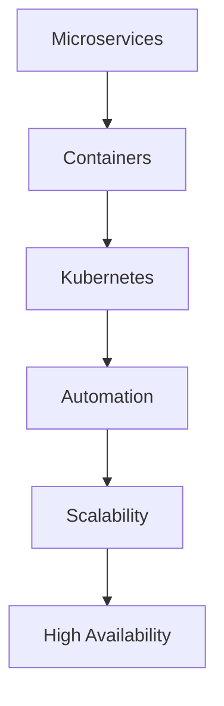

                 

# 云原生架构：微服务、容器与Kubernetes

> **关键词：** 云原生架构、微服务、容器、Kubernetes、DevOps

> **摘要：** 本文将深入探讨云原生架构的核心概念，包括微服务、容器和Kubernetes，分析其优势与挑战，并探讨其在现代企业中的应用前景。

## 1. 背景介绍

随着云计算和互联网技术的发展，传统的单体应用架构已经无法满足现代企业的需求。传统的单体应用往往难以扩展，且在维护和部署过程中存在诸多问题。为了解决这些问题，云原生架构应运而生。

云原生架构是一种新兴的软件架构风格，它利用容器、服务网格、微服务、不可变基础设施和声明式API等概念和工具，实现应用程序的自动化、弹性和可扩展性。云原生架构的核心目标是让应用程序能够快速适应云环境，充分利用云计算的资源和管理优势。

云原生架构的兴起，得益于以下几个关键因素：

1. **容器技术的普及**：容器技术，如Docker，提供了一种轻量级、可移植的软件打包方式，使得应用程序可以独立运行在几乎任何环境中。
2. **微服务的兴起**：微服务架构将大型单体应用分解为多个小型、独立的微服务，从而提高了系统的灵活性和可维护性。
3. **Kubernetes的流行**：Kubernetes作为一种强大的容器编排工具，使得微服务的部署和管理变得更加简单和高效。
4. **DevOps文化的推广**：DevOps文化的推广促进了开发（Development）和运维（Operations）的紧密结合，推动了云原生架构的落地实施。

## 2. 核心概念与联系

### 2.1 微服务（Microservices）

微服务是一种设计架构风格，它将应用程序分解为一系列小型、独立的服务。每个服务都有自己的业务逻辑、数据存储和API，可以独立部署、扩展和更新。

微服务的优点包括：

- **灵活性和可扩展性**：每个服务都可以独立开发、测试和部署，从而提高了系统的灵活性和可扩展性。
- **可维护性**：由于服务规模较小，维护和更新变得更加容易。
- **容错性**：某个服务的故障不会影响到整个系统，从而提高了系统的容错性。

微服务的挑战包括：

- **分布式系统复杂性**：服务之间的通信和协调变得更加复杂，需要更多的通信协议和中间件。
- **数据一致性**：在分布式系统中维护数据的一致性是一个挑战。

### 2.2 容器（Containers）

容器是一种轻量级的虚拟化技术，它提供了一个独立的运行环境，包含应用程序及其依赖项。容器技术使得应用程序可以在不同的操作系统和硬件环境中独立运行。

容器的优点包括：

- **可移植性**：容器可以轻松地在不同的环境中部署和运行，从而提高了应用程序的可移植性。
- **性能**：容器相对于虚拟机（VMs）具有更好的性能，因为它不需要额外的操作系统层。
- **资源效率**：容器共享宿主机的操作系统内核，从而降低了资源消耗。

### 2.3 Kubernetes（Kubernetes）

Kubernetes是一种开源的容器编排工具，用于自动化容器的部署、扩展和管理。Kubernetes通过提供一组API和控制器，使得管理员可以轻松地管理大量的容器化应用程序。

Kubernetes的核心组件包括：

- **Master**：负责管理集群和控制器的运行。
- **Node**：运行容器的主机，负责执行工作负载。
- **Pod**：Kubernetes中的最小工作单元，包含一个或多个容器。
- **Service**：用于在集群内部或外部访问应用程序的抽象层。

Kubernetes的优点包括：

- **自动化**：Kubernetes可以自动部署、扩展和管理容器化应用程序。
- **弹性**：Kubernetes可以根据需求自动调整容器数量，从而实现自动扩展和缩容。
- **高可用性**：Kubernetes提供了一种机制，可以在故障发生时自动恢复应用程序。

### 2.4 Mermaid 流程图

下面是一个简单的Mermaid流程图，展示了微服务、容器和Kubernetes之间的关系：



## 3. 核心算法原理 & 具体操作步骤

### 3.1 Kubernetes 的工作原理

Kubernetes通过以下核心算法和步骤实现容器化应用程序的自动化和管理：

1. **调度（Scheduling）**：Kubernetes根据资源需求和策略将容器部署到集群中的节点上。
2. **复制（Replication）**：Kubernetes确保每个服务具有所需的副本数量，从而实现高可用性。
3. **滚动更新（Rolling Update）**：Kubernetes可以逐步更新容器，而不会中断服务。
4. **负载均衡（Load Balancing）**：Kubernetes在集群内部或外部提供负载均衡，以分发流量。
5. **服务发现（Service Discovery）**：Kubernetes通过DNS或环境变量帮助容器找到其他服务。

### 3.2 容器编排的操作步骤

以下是一个简单的容器编排操作步骤：

1. **定义部署配置（Deployment Configuration）**：创建一个YAML文件，描述要部署的容器的详细信息，如镜像、副本数量、资源限制等。
2. **创建部署（Create Deployment）**：使用Kubernetes API创建部署。
3. **监控部署状态（Monitor Deployment Status）**：检查部署状态，确保容器成功启动。
4. **扩展部署（Scale Deployment）**：根据需求调整副本数量。
5. **更新部署（Update Deployment）**：逐步更新容器镜像或配置。

## 4. 数学模型和公式 & 详细讲解 & 举例说明

### 4.1 负载均衡算法

Kubernetes使用多种负载均衡算法来分配流量。以下是一个简单的负载均衡算法：

$$
\text{分配权重} = \frac{\text{可用副本数量}}{\text{总副本数量}}
$$

例如，一个服务有3个副本，当前只有2个副本可用。那么，每个可用副本的权重为：

$$
\text{分配权重} = \frac{2}{3} \approx 0.67
$$

### 4.2 容量规划模型

在规划集群容量时，可以使用以下公式：

$$
\text{总内存需求} = \sum_{i=1}^{n} (\text{服务}_i \times \text{副本}_i \times \text{内存需求}_i)
$$

$$
\text{总CPU需求} = \sum_{i=1}^{n} (\text{服务}_i \times \text{副本}_i \times \text{CPU需求}_i)
$$

其中，$n$为服务数量，$\text{服务}_i$为第$i$个服务，$\text{副本}_i$为第$i$个服务的副本数量，$\text{内存需求}_i$和$\text{CPU需求}_i$分别为第$i$个服务的内存和CPU需求。

例如，一个集群有3个服务，每个服务的副本数量分别为2、3和4。假设每个服务的内存需求为1GB，CPU需求为0.5CPU。那么，总内存需求为：

$$
\text{总内存需求} = 2 \times 1GB + 3 \times 1GB + 4 \times 1GB = 10GB
$$

总CPU需求为：

$$
\text{总CPU需求} = 2 \times 0.5CPU + 3 \times 0.5CPU + 4 \times 0.5CPU = 4CPU
$$

## 5. 项目实战：代码实际案例和详细解释说明

### 5.1 开发环境搭建

为了演示如何使用Kubernetes部署一个简单的微服务应用程序，我们首先需要在本地计算机上安装Kubernetes集群。可以使用Minikube或Docker Desktop来模拟Kubernetes集群。

1. 安装Minikube：
   ```sh
   curl -LO https://storage.googleapis.com/minikube/releases/latest/minikube-linux-amd64
   chmod +x minikube-linux-amd64
   sudo mv minikube-linux-amd64 /usr/local/bin/minikube
   minikube start
   ```

2. 安装Docker：
   ```sh
   sudo apt-get update
   sudo apt-get install docker.io
   ```

3. 启动Docker：
   ```sh
   sudo systemctl start docker
   ```

### 5.2 源代码详细实现和代码解读

为了演示如何使用Kubernetes部署一个简单的微服务应用程序，我们可以使用一个简单的HTTP服务。以下是服务的主代码：

```go
package main

import (
    "log"
    "net/http"
)

func main() {
    http.HandleFunc("/", handler)
    log.Fatal(http.ListenAndServe(":8080", nil))
}

func handler(w http.ResponseWriter, r *http.Request) {
    w.Write([]byte("Hello, World!"))
}
```

这个简单的HTTP服务仅包含一个处理函数，用于响应根路径请求。

### 5.3 代码解读与分析

这段代码是一个简单的Go语言HTTP服务器，具有以下关键部分：

- **导入（Import）**：导入必需的包，如`log`和`net/http`。
- **main函数**：定义了程序的主入口点。
- **http.HandleFunc**：注册处理函数，用于处理HTTP请求。
- **http.ListenAndServe**：启动服务器，并监听8080端口。

### 5.4 部署到Kubernetes

为了将这个HTTP服务部署到Kubernetes集群，我们需要创建以下YAML文件：

```yaml
apiVersion: apps/v1
kind: Deployment
metadata:
  name: hello-world
spec:
  selector:
    matchLabels:
      app: hello-world
  template:
    metadata:
      labels:
        app: hello-world
    spec:
      containers:
      - name: hello-world
        image: gcr.io/google-samples/hello-app:latest
        ports:
        - containerPort: 8080
```

这个YAML文件定义了一个Kubernetes部署，它包含一个容器，使用Google提供的HTTP服务镜像。部署的名称为`hello-world`，容器名称为`hello-world`，并映射到8080端口。

要部署这个服务，我们可以使用以下命令：

```sh
kubectl apply -f hello-world-deployment.yaml
```

### 5.5 检查部署状态

要检查部署状态，我们可以使用以下命令：

```sh
kubectl get pods
```

如果部署成功，您应该会看到状态为`Running`的容器。

### 5.6 访问服务

要访问部署的服务，您可以使用以下命令：

```sh
kubectl get svc
```

这将列出所有服务。找到`hello-world`服务的IP地址，然后在浏览器中访问该地址，例如：

```
http://<服务IP地址>:8080
```

您应该会看到"Hello, World!"的响应。

## 6. 实际应用场景

云原生架构在现代企业中得到了广泛应用。以下是一些实际应用场景：

- **金融行业**：金融行业的企业使用云原生架构来构建高可用性、高可靠性的交易平台，实现快速开发和部署新功能。
- **电子商务**：电子商务平台使用云原生架构来处理大量的并发请求，确保系统的高性能和弹性。
- **医疗保健**：医疗保健行业使用云原生架构来构建分布式系统，实现数据的实时分析和处理。
- **物联网（IoT）**：物联网设备产生的大量数据需要使用云原生架构进行处理和分析，从而实现智能化的物联网应用。

## 7. 工具和资源推荐

### 7.1 学习资源推荐

- **书籍**：
  - 《云原生架构：微服务、容器与Kubernetes》
  - 《Docker实战》
  - 《Kubernetes实战》
- **论文**：
  - 《大规模分布式系统设计》
  - 《微服务架构：设计与实现》
- **博客**：
  - Kubernetes官方博客
  - Cloud Native Computing Foundation博客
- **网站**：
  - Kubernetes官网
  - Docker官网

### 7.2 开发工具框架推荐

- **Kubernetes**：用于容器编排和管理。
- **Docker**：用于容器化应用程序。
- **Istio**：用于服务网格。
- **Kafka**：用于消息队列和流处理。
- **Prometheus**：用于监控和告警。

### 7.3 相关论文著作推荐

- **论文**：
  - 《Kubernetes: Design and Implementation》
  - 《Docker: The New Operating System》
  - 《Service Mesh: A New Architectural Paradigm for Microservices》
- **著作**：
  - 《云原生应用架构》
  - 《微服务设计》
  - 《容器化与容器编排》

## 8. 总结：未来发展趋势与挑战

云原生架构在近年来取得了显著的发展，但其应用仍面临一些挑战。以下是一些未来发展趋势和挑战：

- **标准化与互操作性**：云原生技术的标准化和互操作性是实现广泛部署的关键。
- **安全性**：随着云原生架构的广泛应用，安全性问题变得愈发重要。
- **技能短缺**：云原生技术的快速发展导致相关技能短缺，企业需要培养和引进专业人员。
- **迁移成本**：对于传统的单体应用，迁移到云原生架构需要一定的成本和技术投入。

## 9. 附录：常见问题与解答

### 9.1 什么是云原生架构？

云原生架构是一种利用容器、服务网格、微服务、不可变基础设施和声明式API等技术和工具的软件架构风格，旨在构建在云环境中的自动化、弹性和可扩展的应用程序。

### 9.2 容器和虚拟机有什么区别？

容器是一种轻量级的虚拟化技术，它提供了独立的运行环境，但共享宿主机的操作系统内核。虚拟机则是一种全虚拟化技术，它为每个虚拟机提供完整的操作系统环境。

### 9.3 Kubernetes有哪些核心组件？

Kubernetes的核心组件包括Master、Node、Pod和Service。Master负责管理集群和控制器的运行，Node是运行容器的主机，Pod是Kubernetes中的最小工作单元，Service是用于在集群内部或外部访问应用程序的抽象层。

## 10. 扩展阅读 & 参考资料

- **云原生架构**：
  - [云原生架构：微服务、容器与Kubernetes](https://www.oreilly.com/library/view/cloud-native-architecture/9781492034573/)
  - [云原生计算：概念与实践](https://www.oreilly.com/library/view/cloud-native-computing/9781492034580/)
- **容器技术**：
  - [Docker官方文档](https://docs.docker.com/)
  - [Kubernetes官方文档](https://kubernetes.io/docs/)
- **微服务架构**：
  - [微服务设计](https://www.oreilly.com/library/view/microservices-design/9781492033374/)
  - [微服务架构实践](https://www.oreilly.com/library/view/microservices-architecture-in-practice/9781449363369/)
- **DevOps文化**：
  - [DevOps实践手册](https://www.oreilly.com/library/view/devops-handbook/9781449367358/)
  - [DevOps文化：理念与实践](https://www.oreilly.com/library/view/devops-culture/9781449374017/)

### 作者

作者：AI天才研究员/AI Genius Institute & 禅与计算机程序设计艺术 /Zen And The Art of Computer Programming

