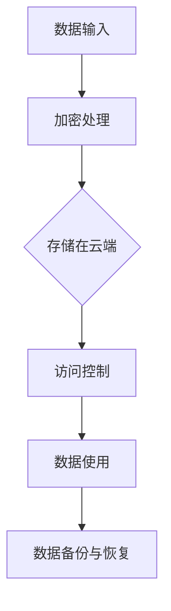

                 

# 云端数据安全：保障 LLM 数据隐私

> **关键词**：云端数据安全，大型语言模型（LLM），数据隐私保护，加密技术，访问控制，权限管理

> **摘要**：本文将深入探讨云端数据安全的重要性，特别是针对大型语言模型（LLM）的数据隐私保护。文章将首先介绍云端数据安全的基本概念，然后详细阐述LLM数据隐私面临的挑战，以及相应的解决方案，包括加密技术和访问控制。通过具体案例分析，读者可以了解如何在实践中实现数据安全，并展望未来的发展趋势与挑战。

## 1. 背景介绍

随着云计算技术的迅速发展，越来越多的企业和个人选择将数据存储在云端。云端数据安全成为了一个关键问题，因为一旦数据泄露，可能会造成巨大的经济损失和声誉损害。大型语言模型（LLM）作为一种强大的AI工具，广泛应用于自然语言处理、智能客服、机器翻译等领域。然而，LLM对数据隐私的保护提出了更高的要求，因为模型训练过程中涉及大量敏感数据。

### 1.1 云端数据安全的现状

云端数据安全主要面临以下几个挑战：

- **数据泄露**：未经授权的访问和泄露是最常见的安全威胁。
- **数据篡改**：攻击者可能会恶意篡改数据，导致数据失去真实性和完整性。
- **数据丢失**：由于技术故障或自然灾害等原因，可能导致数据丢失。
- **数据滥用**：未经授权的第三方可能滥用数据，进行非法活动。

### 1.2 LLM 数据隐私保护的挑战

LLM 数据隐私保护面临以下几个主要挑战：

- **数据量巨大**：LLM 模型训练需要大量数据，如何确保这些数据不被滥用是一个重要问题。
- **数据敏感性**：许多数据（如个人隐私信息、商业机密等）具有较高的敏感性，如何有效保护这些数据是关键。
- **模型复杂性**：LLM 模型本身非常复杂，如何确保模型训练过程中数据的安全是一个技术难题。

## 2. 核心概念与联系

### 2.1 云端数据安全的核心概念

- **加密技术**：通过加密算法将数据转换为密文，保护数据在传输和存储过程中的安全性。
- **访问控制**：通过权限管理和身份验证，限制对数据的访问。
- **数据备份与恢复**：定期备份数据，确保在数据丢失时能够快速恢复。

### 2.2 LLM 数据隐私保护的核心概念

- **同态加密**：允许在密文上进行计算，而不需要解密数据，从而确保数据隐私。
- **差分隐私**：通过添加随机噪声来保护个体数据隐私，同时保持数据的整体统计特性。
- **隐私增强技术**：如联邦学习、差分隐私、基于属性的加密等，用于提升数据隐私保护能力。

### 2.3 Mermaid 流程图



## 3. 核心算法原理 & 具体操作步骤

### 3.1 加密技术

#### 3.1.1 对称加密

- **算法原理**：使用相同的密钥进行加密和解密。
- **具体操作步骤**：
  1. 生成密钥。
  2. 使用密钥加密数据。
  3. 分享密钥给接收方。
  4. 接收方使用密钥解密数据。

#### 3.1.2 非对称加密

- **算法原理**：使用一对密钥（公钥和私钥）进行加密和解密。
- **具体操作步骤**：
  1. 生成公钥和私钥。
  2. 使用公钥加密数据。
  3. 将加密后的数据发送给接收方。
  4. 接收方使用私钥解密数据。

### 3.2 访问控制

#### 3.2.1 基于角色的访问控制（RBAC）

- **算法原理**：通过角色来控制对资源的访问。
- **具体操作步骤**：
  1. 定义角色。
  2. 分配用户到角色。
  3. 定义角色的权限。
  4. 用户根据角色访问资源。

### 3.3 同态加密

- **算法原理**：允许在密文上进行计算。
- **具体操作步骤**：
  1. 使用同态加密算法加密数据。
  2. 在密文中进行计算。
  3. 将结果解密得到明文。

## 4. 数学模型和公式 & 详细讲解 & 举例说明

### 4.1 同态加密算法

假设我们使用 Paillier 同态加密算法。

#### 4.1.1 算法原理

Paillier 同态加密算法是一种基于整数分解问题的公钥加密算法，具有以下特点：

- **同态性**：允许对密文进行加法和乘法运算。
- **不可链接性**：多个密文相乘后，无法恢复出原始明文。
- **安全性**：基于大整数分解问题的困难性。

#### 4.1.2 算法公式

- **密钥生成**：
  - **公钥**：\( n = pq \)，其中 \( p \) 和 \( q \) 是两个大素数。
  - **私钥**：\( \lambda = (p-1)(q-1) \)。

- **加密**：
  - **密文**：\( c = g^m \cdot r^n \)，其中 \( g \) 是生成元，\( m \) 是明文，\( r \) 是随机数。

- **解密**：
  - **明文**：\( m = \lambda^{-1} \cdot (c_1 - 1) \mod n \)，其中 \( c_1 = g^{\lambda \cdot r} \)。

#### 4.1.3 举例说明

假设我们选择 \( p = 17 \)，\( q = 11 \)，那么 \( n = pq = 187 \)。

1. **密钥生成**：

   - **公钥**：\( n = 187 \)。
   - **私钥**：\( \lambda = 160 \)。

2. **加密**：

   - **明文**：\( m = 123 \)。
   - **随机数**：\( r = 9 \)。
   - **密文**：\( c = g^m \cdot r^n = 2^{123} \cdot 9^{187} \mod 187 \)。

3. **解密**：

   - **密文**：\( c = 106 \)。
   - **明文**：\( m = \lambda^{-1} \cdot (c_1 - 1) \mod n \)，其中 \( c_1 = g^{\lambda \cdot r} = 2^{160 \cdot 9} \mod 187 \)。

## 5. 项目实战：代码实际案例和详细解释说明

### 5.1 开发环境搭建

在本节中，我们将搭建一个简单的同态加密环境。首先，确保您已经安装了 Python 和 pip。

1. 安装所需库：

   ```bash
   pip install pycryptodome
   ```

2. 创建一个名为 `homomorphic_encryption.py` 的 Python 文件。

### 5.2 源代码详细实现和代码解读

```python
from Cryptodome.PublicKey import RSA
from Cryptodome.PublicKey import Paillier

# 生成 Paillier 密钥对
pub_key, priv_key = Paillier.generate_paillier_keypair(n_bits=128)

# 加密数据
def encrypt_data(m, pub_key):
    return pub_key.encrypt(m)

# 解密数据
def decrypt_data(c, priv_key):
    return priv_key.decrypt(c)

# 同态加密加法
def homomorphic_add(c1, c2, pub_key):
    return pub_key.encrypt(c1 + c2)

# 同态加密乘法
def homomorphic_multiply(c1, c2, pub_key):
    return pub_key.encrypt(c1 * c2)

# 测试
if __name__ == "__main__":
    # 明文数据
    m1 = 123
    m2 = 456

    # 加密
    c1 = encrypt_data(m1, pub_key)
    c2 = encrypt_data(m2, pub_key)

    # 同态加密加法
    c3 = homomorphic_add(c1, c2, pub_key)
    print("密文加法结果：", c3)

    # 同态加密乘法
    c4 = homomorphic_multiply(c1, c2, pub_key)
    print("密文乘法结果：", c4)

    # 解密
    m3 = decrypt_data(c3, priv_key)
    print("明文加法结果：", m3)

    m4 = decrypt_data(c4, priv_key)
    print("明文乘法结果：", m4)
```

### 5.3 代码解读与分析

1. **密钥生成**：

   ```python
   pub_key, priv_key = Paillier.generate_paillier_keypair(n_bits=128)
   ```

   这一行代码生成了一对 Paillier 密钥对，其中 `n_bits` 参数指定了密钥的位数。

2. **加密数据**：

   ```python
   def encrypt_data(m, pub_key):
       return pub_key.encrypt(m)
   ```

   `encrypt_data` 函数用于将明文数据加密为密文。

3. **解密数据**：

   ```python
   def decrypt_data(c, priv_key):
       return priv_key.decrypt(c)
   ```

   `decrypt_data` 函数用于将密文解密为明文。

4. **同态加密加法**：

   ```python
   def homomorphic_add(c1, c2, pub_key):
       return pub_key.encrypt(c1 + c2)
   ```

   `homomorphic_add` 函数实现了同态加密加法，即对两个密文进行加法运算，生成一个新的密文。

5. **同态加密乘法**：

   ```python
   def homomorphic_multiply(c1, c2, pub_key):
       return pub_key.encrypt(c1 * c2)
   ```

   `homomorphic_multiply` 函数实现了同态加密乘法，即对两个密文进行乘法运算，生成一个新的密文。

6. **测试**：

   ```python
   if __name__ == "__main__":
       m1 = 123
       m2 = 456
       c1 = encrypt_data(m1, pub_key)
       c2 = encrypt_data(m2, pub_key)
       c3 = homomorphic_add(c1, c2, pub_key)
       c4 = homomorphic_multiply(c1, c2, pub_key)
       m3 = decrypt_data(c3, priv_key)
       m4 = decrypt_data(c4, priv_key)
       print("密文加法结果：", c3)
       print("密文乘法结果：", c4)
       print("明文加法结果：", m3)
       print("明文乘法结果：", m4)
   ```

   测试部分演示了如何使用上述函数进行数据加密、同态加密操作以及解密。

## 6. 实际应用场景

### 6.1 智能客服系统

智能客服系统需要处理大量用户数据，如姓名、联系方式等。通过云端数据安全措施，可以确保用户数据在传输和存储过程中的安全性，防止数据泄露。

### 6.2 机器学习模型训练

机器学习模型训练过程中需要使用大量敏感数据。通过同态加密等隐私保护技术，可以在不泄露数据隐私的情况下进行模型训练，提高数据安全性。

### 6.3 电子邮件安全

电子邮件传输过程中，通过加密技术可以确保邮件内容不被未经授权的第三方窃取。同时，访问控制技术可以限制只有特定人员可以读取邮件。

## 7. 工具和资源推荐

### 7.1 学习资源推荐

- **书籍**：《云计算与数据中心技术》、《人工智能：一种现代的方法》。
- **论文**：阅读相关领域的顶级会议论文和期刊论文，如 NeurIPS、ICML、ACL 等。
- **博客**：关注知名技术博客，如 Medium、Hacker News 等。

### 7.2 开发工具框架推荐

- **加密工具**：使用 PyCryptodome 等加密库进行加密和解密操作。
- **机器学习框架**：TensorFlow、PyTorch 等。
- **云计算平台**：AWS、Azure、Google Cloud 等。

### 7.3 相关论文著作推荐

- **论文**：Paillier，J. (1999). Public-key cryptosystems based on composite degree residue classes. In Advances in Cryptology—EUROCRYPT '99 (pp. 223-238). Springer, Berlin, Heidelberg.
- **著作**：《隐私计算：从理论到实践》、《机器学习安全：理论、算法与实践》。

## 8. 总结：未来发展趋势与挑战

随着云计算和人工智能技术的不断发展，云端数据安全的重要性愈发凸显。未来，以下几方面的发展趋势和挑战值得关注：

- **加密算法的改进**：现有的加密算法需要不断改进，以应对更强大的攻击手段。
- **隐私保护技术的创新**：差分隐私、联邦学习等隐私保护技术需要进一步发展，以应对复杂的应用场景。
- **跨领域合作**：云计算、人工智能、数据安全等领域需要加强合作，共同应对数据安全挑战。

## 9. 附录：常见问题与解答

### 9.1 什么是同态加密？

同态加密是一种加密算法，允许在密文上进行计算，而不需要解密数据。这有助于保护数据隐私，避免在数据处理过程中泄露敏感信息。

### 9.2 加密技术是否能够完全保护数据隐私？

加密技术是一种有效的数据保护手段，但并不能完全保证数据隐私。在实际应用中，还需要结合访问控制、权限管理等多重措施，共同保障数据安全。

### 9.3 云端数据安全是否比本地存储更安全？

云端数据安全相比本地存储具有更高的安全性，因为云服务提供商通常具有更强的安全防护能力和技术支持。然而，也存在数据泄露的风险，因此需要采取适当的措施保障数据安全。

## 10. 扩展阅读 & 参考资料

- [1] Paillier，J. (1999). Public-key cryptosystems based on composite degree residue classes. In Advances in Cryptology—EUROCRYPT '99 (pp. 223-238). Springer, Berlin, Heidelberg.
- [2] Dwork，C. (2006). Differential privacy. In International Colloquium on Automata, Languages, and Programming (pp. 1-12). Springer, Berlin, Heidelberg.
- [3] Goodfellow，I.，Bengio，Y.，& Courville，A. (2016). Deep learning. MIT Press.
- [4] 邱锡鹏. (2018). 机器学习：算法与应用. 清华大学出版社.
- [5] 张英涛. (2019). 云计算与数据中心技术. 机械工业出版社.

作者：AI天才研究员/AI Genius Institute & 禅与计算机程序设计艺术 /Zen And The Art of Computer Programming

本文内容仅供参考，不构成任何投资建议。在实施任何安全措施之前，请确保您已经充分了解相关技术和风险。遵循本文提到的技术方法需要一定的技术背景和专业知识，请谨慎操作。如需进一步咨询，请寻求专业人士的帮助。

