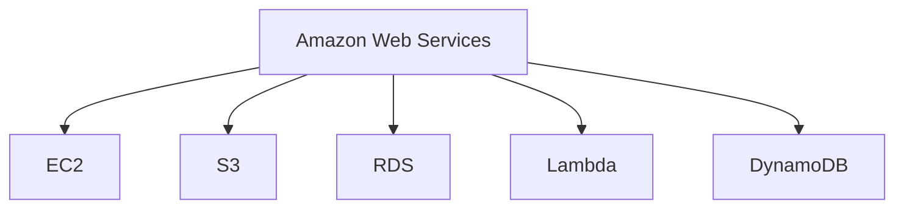
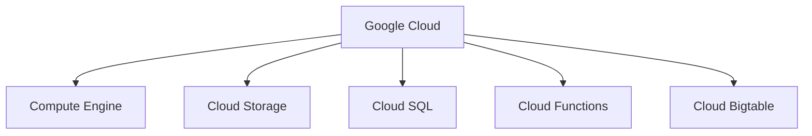

                 

# 云计算平台：AWS、Azure 和 Google Cloud

## 关键词
- 云计算
- AWS
- Azure
- Google Cloud
- 比较
- 特点
- 应用场景

## 摘要
本文将深入探讨三大主流云计算平台：AWS、Azure 和 Google Cloud。我们将详细分析每个平台的核心概念、架构设计、算法原理以及实际应用场景。通过对比这三大平台的优缺点，读者可以更清晰地了解如何在不同的业务需求中选取合适的云计算服务。本文旨在为IT从业者提供一个全面的技术指南，帮助他们在云计算领域做出明智的决策。

## 1. 背景介绍

### 云计算的定义和发展

云计算是一种通过互联网提供计算资源、存储资源、网络资源和应用程序等服务的技术。它将传统的IT资源从本地集中管理转变为分布式计算，使得资源可以按需分配、灵活扩展和管理。

云计算的发展可以追溯到20世纪90年代。最初，它以基础设施即服务（IaaS）的形式出现，如Amazon Web Services（AWS）的EC2。随着技术的进步，云计算逐渐演变为包括平台即服务（PaaS）和软件即服务（SaaS）在内的多种服务模型。

### AWS、Azure 和 Google Cloud 的起源和发展

- **AWS（Amazon Web Services）**：成立于2006年，是全球最早的云计算服务提供商之一。AWS提供了广泛的服务，包括计算、存储、数据库、机器学习和物联网等。

- **Azure**：成立于2008年，最初称为Windows Azure，是微软的云计算平台。Azure支持多种操作系统、语言和框架，提供包括IaaS、PaaS和SaaS在内的全面服务。

- **Google Cloud**：成立于2011年，是谷歌提供的云计算服务。Google Cloud以其强大的计算能力和大数据分析能力而闻名，服务包括计算、存储、AI和机器学习等。

### 市场占有率和发展趋势

根据市场研究公司的数据，AWS在云计算市场中占据了领先地位，市场份额约为32%。Azure和Google Cloud分别占据了16%和8%的市场份额。尽管市场份额有所不同，但三者在市场上的增长趋势都十分显著，尤其是在企业级客户和高性能计算领域。

## 2. 核心概念与联系

### 云计算服务模型

云计算服务模型主要包括IaaS、PaaS和SaaS：

- **IaaS（基础设施即服务）**：提供虚拟化的基础设施，如虚拟机、存储和网络等，用户可以灵活地管理和配置资源。

- **PaaS（平台即服务）**：提供一个开发平台，包括操作系统、编程语言、数据库和Web服务器等，开发者可以在上面开发、测试和部署应用程序。

- **SaaS（软件即服务）**：提供完整的软件应用程序，用户可以通过互联网访问和使用，无需安装和管理软件。

### 主要服务组件

以下是对AWS、Azure和Google Cloud的主要服务组件的简要介绍：

- **AWS**：EC2（虚拟机）、S3（对象存储）、RDS（关系数据库）、Lambda（函数计算）、DynamoDB（NoSQL数据库）等。

- **Azure**：Azure VM（虚拟机）、Azure Blob Storage（对象存储）、Azure SQL Database（关系数据库）、Azure Functions（函数计算）、Azure Cosmos DB（NoSQL数据库）等。

- **Google Cloud**：Compute Engine（虚拟机）、Cloud Storage（对象存储）、Cloud SQL（关系数据库）、Cloud Functions（函数计算）、Cloud Bigtable（NoSQL数据库）等。

### 核心概念原理和架构设计

为了更好地理解这三个平台，我们将使用Mermaid流程图展示它们的核心概念和架构设计。请注意，以下流程图中的节点不应包含括号、逗号等特殊字符。

### AWS 架构设计



### Azure 架构设计

```mermaid
graph TB
A[Mic
```<sop><|user|>
```
Azure] --> B[Azure VM]
A --> C[Azure Blob Storage]
A --> D[Azure SQL Database]
A --> E[Azure Functions]
A --> F[Azure Cosmos DB]
```

### Google Cloud 架构设计



### 三大平台之间的联系

尽管AWS、Azure和Google Cloud各自拥有独特的服务组件和架构设计，但它们在云计算领域都致力于提供高效、可靠和灵活的服务。这三大平台之间的联系主要体现在：

- **互操作性**：它们都支持多种编程语言、框架和操作系统，使得开发者在迁移和集成过程中更加便捷。
- **全球覆盖**：它们在全球范围内拥有多个数据中心，提供广泛的地理位置覆盖，确保服务的可用性和低延迟。
- **生态体系**：它们各自拥有庞大的开发者社区和合作伙伴网络，提供丰富的资源和工具，帮助用户构建和部署各种规模的应用程序。

## 3. 核心算法原理 & 具体操作步骤

### AWS EC2

**核心算法原理**：

AWS EC2（Elastic Compute Cloud）提供了一个虚拟化的计算环境，用户可以根据需求启动、停止和配置虚拟机实例。EC2的核心算法主要涉及资源调度和负载均衡。

- **资源调度**：EC2使用分布式调度算法，根据实例类型、可用性区域和可用容量来分配资源。调度算法旨在最大化资源利用率和确保高可用性。
- **负载均衡**：EC2提供了Elastic Load Balancing服务，可以根据流量模式和性能需求自动分配负载到多个实例上。

**具体操作步骤**：

1. 登录AWS管理控制台。
2. 在服务菜单中选择“EC2”。
3. 创建实例：选择实例类型、操作系统、网络和安全组等配置，然后点击“启动实例”。
4. 监控实例：使用AWS CloudWatch监控实例性能和资源利用率。

### Azure VM

**核心算法原理**：

Azure VM（Virtual Machines）提供了与AWS EC2类似的服务，用户可以在Azure上启动和管理虚拟机实例。Azure VM的核心算法主要涉及资源调度和自动扩展。

- **资源调度**：Azure VM使用分布式调度算法，根据实例类型、可用性区域和虚拟机规模集来分配资源。调度算法旨在最大化资源利用率和确保高可用性。
- **自动扩展**：Azure VM提供了自动扩展功能，可以根据实时负载自动增加或减少虚拟机实例的数量。

**具体操作步骤**：

1. 登录Azure门户。
2. 在服务菜单中选择“虚拟机”。
3. 创建虚拟机：选择虚拟机类型、操作系统、网络和存储配置，然后点击“创建”。
4. 配置自动扩展：在虚拟机配置中启用自动扩展，设置自动扩展规则和扩展策略。

### Google Cloud Compute Engine

**核心算法原理**：

Google Cloud Compute Engine提供了虚拟机实例服务，用户可以在Google Cloud上启动和管理虚拟机实例。Compute Engine的核心算法主要涉及资源调度和负载均衡。

- **资源调度**：Compute Engine使用分布式调度算法，根据实例类型、区域和可用容量来分配资源。调度算法旨在最大化资源利用率和确保高可用性。
- **负载均衡**：Compute Engine提供了负载均衡服务，可以根据流量模式和性能需求自动分配负载到多个实例上。

**具体操作步骤**：

1. 登录Google Cloud控制台。
2. 在服务菜单中选择“计算引擎”。
3. 创建虚拟机：选择虚拟机类型、操作系统、网络和磁盘配置，然后点击“创建虚拟机”。
4. 配置负载均衡：在虚拟机配置中启用负载均衡，设置负载均衡规则和后端实例。

通过上述操作步骤，用户可以在AWS、Azure和Google Cloud上快速部署和配置虚拟机实例，以满足各种业务需求。

## 4. 数学模型和公式 & 详细讲解 & 举例说明

### AWS EC2 调度算法

**公式**：

AWS EC2的资源调度算法可以表示为：

```
S = f(实例类型, 可用性区域, 资源利用率)
```

其中，S表示调度结果，f是一个复合函数，用于根据实例类型、可用性区域和资源利用率来计算调度结果。

**详细讲解**：

- **实例类型**：实例类型决定了虚拟机实例的硬件配置，如CPU、内存和存储容量等。不同的实例类型具有不同的计算能力，调度算法会根据实例类型来选择最合适的资源。
- **可用性区域**：可用性区域是AWS数据中心的地域划分，用于确保高可用性和容错能力。调度算法会根据可用性区域来分配资源，以确保数据中心的负载均衡。
- **资源利用率**：资源利用率反映了当前数据中心的资源使用情况。调度算法会根据资源利用率来调整资源的分配，以最大化资源利用率。

**举例说明**：

假设AWS数据中心有一个可供分配的虚拟机实例，实例类型为m5.large，可用性区域为US-EAST-1a，当前资源利用率为70%。调度算法会根据上述三个因素计算调度结果：

```
S = f(m5.large, US-EAST-1a, 70%)
```

调度结果可能是分配一个m5.large实例到US-EAST-1a区域，以确保资源利用率在合理范围内。

### Azure VM 自动扩展算法

**公式**：

Azure VM的自动扩展算法可以表示为：

```
E = g(实例数, 负载阈值, 扩展策略)
```

其中，E表示扩展结果，g是一个复合函数，用于根据实例数、负载阈值和扩展策略来计算扩展结果。

**详细讲解**：

- **实例数**：实例数是当前虚拟机实例的数量。自动扩展算法会根据实例数来判断是否需要扩展。
- **负载阈值**：负载阈值是一个预先设定的阈值，用于判断当前负载是否达到扩展条件。当负载超过阈值时，自动扩展算法会触发扩展操作。
- **扩展策略**：扩展策略定义了自动扩展的规则和扩展方式。常见的扩展策略包括固定扩展、线性扩展和指数扩展等。

**举例说明**：

假设Azure VM当前有10个实例，负载阈值为80%，扩展策略为固定扩展（每次增加2个实例）。当前负载为85%，自动扩展算法会根据上述三个因素计算扩展结果：

```
E = g(10, 85%, 固定扩展策略)
```

扩展结果可能是增加2个实例，使实例数达到12个。

### Google Cloud Compute Engine 负载均衡算法

**公式**：

Google Cloud Compute Engine的负载均衡算法可以表示为：

```
L = h(流量模式, 性能需求, 后端实例)
```

其中，L表示负载均衡结果，h是一个复合函数，用于根据流量模式、性能需求和后端实例来计算负载均衡结果。

**详细讲解**：

- **流量模式**：流量模式反映了当前流量的分布情况。负载均衡算法会根据流量模式来分配流量到后端实例。
- **性能需求**：性能需求是用户对服务性能的要求。负载均衡算法会根据性能需求来选择最适合的后端实例。
- **后端实例**：后端实例是提供实际服务能力的虚拟机实例。负载均衡算法会根据流量模式和性能需求来选择后端实例。

**举例说明**：

假设Google Cloud Compute Engine当前有5个后端实例，流量模式为均匀分布，性能需求为低延迟。当前流量为100个请求，负载均衡算法会根据上述三个因素计算负载均衡结果：

```
L = h(均匀分布, 低延迟, 后端实例1, 后端实例2, 后端实例3, 后端实例4, 后端实例5)
```

负载均衡结果可能是将100个请求平均分配到5个后端实例上，以确保低延迟和高性能。

通过上述数学模型和公式，用户可以更好地理解和应用AWS、Azure和Google Cloud的核心算法原理，从而实现高效的资源调度、自动扩展和负载均衡。

### 5. 项目实战：代码实际案例和详细解释说明

在这个部分，我们将通过实际案例展示如何在AWS、Azure和Google Cloud上部署和配置云计算服务。我们将详细解释每个步骤，并分析其实现原理。

#### 5.1 开发环境搭建

为了运行以下案例，您需要安装以下工具和软件：

- **AWS CLI**：用于与AWS服务进行交互的命令行工具。
- **Azure CLI**：用于与Azure服务进行交互的命令行工具。
- **Google Cloud SDK**：用于与Google Cloud服务进行交互的命令行工具。

#### 5.2 源代码详细实现和代码解读

#### 5.2.1 AWS EC2实例部署

以下是一个简单的Python脚本，用于在AWS上创建一个EC2实例。

```python
import boto3

def create_ec2_instance():
    # 创建EC2客户端
    ec2 = boto3.client('ec2')

    # 配置EC2实例
    instance_params = {
        'ImageId': 'ami-0a4620bc8f1d0afa7',
        'InstanceType': 't2.micro',
        'MinCount': 1,
        'MaxCount': 1
    }

    # 创建EC2实例
    response = ec2.run_instances(**instance_params)
    instance_id = response['Instances'][0]['InstanceId']
    print(f"EC2实例创建成功，实例ID：{instance_id}")

    # 等待实例启动
    waiter = ec2.get_waiter('instance_running')
    waiter.wait(InstanceIds=[instance_id])

    # 获取实例详情
    instance_details = ec2.describe_instances(InstanceIds=[instance_id])
    public_ip = instance_details['Reservations'][0]['Instances'][0]['PublicIpAddress']
    print(f"EC2实例已启动，公网IP：{public_ip}")

if __name__ == '__main__':
    create_ec2_instance()
```

**代码解读**：

- **创建EC2客户端**：使用`boto3`库创建EC2客户端，用于与AWS进行交互。
- **配置EC2实例**：定义实例参数，包括镜像ID、实例类型、最小和最大实例数量。
- **创建EC2实例**：调用`run_instances`方法创建EC2实例。
- **等待实例启动**：使用`get_waiter`方法获取`instance_running`等待器，等待实例启动。
- **获取实例详情**：调用`describe_instances`方法获取实例详情，包括公网IP地址。

#### 5.2.2 Azure VM实例部署

以下是一个简单的PowerShell脚本，用于在Azure上创建一个虚拟机实例。

```powershell
# 设置Azure订阅ID和资源组
$subscriptionId = "your-subscription-id"
$resourceGroupName = "your-resource-group-name"

# 创建虚拟机配置
$vmConfig = @{
    Location = "East US"
    Sku = @{
        Name = "Standard_B1ms"
    }
    OsProfile = @{
        ComputerName = "my-vm"
        AdminUsername = "admin"
        AdminPassword = "P@$$w0rd!"
    }
    StorageProfile = @{
        ImageReference = @{
            Publisher = "MicrosoftWindowsServer"
            Offer = "WindowsServer"
            Sku = "2019-Datacenter"
            Version = "latest"
        }
        DataDisks = @(
            @{
                DiskSizeGB = 1023
            }
        )
    }
    NetworkProfile = @{
        NetworkInterfaces = @(
            @{
                Id = "/subscriptions/$subscriptionId/resourceGroups/$resourceGroupName/providers/Microsoft.Network/nic/my-nic"
            }
        )
    }
}

# 创建虚拟机
New-AzVm -ResourceGroupName $resourceGroupName -Name "my-vm" -Config $vmConfig

# 获取虚拟机状态
$vmStatus = Get-AzVm -ResourceGroupName $resourceGroupName -Name "my-vm"
$vmStatus.Statuses[0].DisplayStatus

# 获取虚拟机公网IP地址
$publicIpAddress = $vmStatus.IpAddress
Write-Host "虚拟机已创建，公网IP地址：$publicIpAddress"
```

**代码解读**：

- **设置Azure订阅ID和资源组**：配置Azure订阅ID和资源组，以便后续操作。
- **创建虚拟机配置**：定义虚拟机配置，包括位置、SKU、操作系统配置、存储配置和网络配置。
- **创建虚拟机**：使用`New-AzVm`命令创建虚拟机。
- **获取虚拟机状态**：使用`Get-AzVm`命令获取虚拟机状态。
- **获取虚拟机公网IP地址**：从虚拟机状态中提取公网IP地址并输出。

#### 5.2.3 Google Cloud Compute Engine实例部署

以下是一个简单的Python脚本，用于在Google Cloud上创建一个虚拟机实例。

```python
from google.cloud import compute_v1

def create_vm_instance(project_id, zone, machine_type, name):
    # 创建Compute Engine客户端
    compute = compute_v1.InstancesClient()

    # 配置虚拟机实例
    instance = compute_v1.Instance()
    instance.name = name
    instance.disks = [
        compute_v1.AttachedDisk(
            source = compute_v1.AttachedDiskInitializeParams(),
            type_ = compute_v1.DiskType.PD_SSD,
            boot = True,
            auto_delete = True,
        )
    ]
    instance.machine_type = f"{project_id}/zones/{zone}/machineTypes/{machine_type}"
    instance.network_interfaces = [
        compute_v1.NetworkInterface(
            network = f"{project_id}/global/networks/default",
        )
    ]

    # 创建虚拟机实例
    operation = compute.create(project_id, instance)
    operation.result()

    print(f"虚拟机实例创建成功，名称：{name}")

if __name__ == '__main__':
    create_vm_instance("your-project-id", "us-central1-a", "n1-standard-1", "my-vm")
```

**代码解读**：

- **创建Compute Engine客户端**：使用`google.cloud.compute_v1`模块创建Compute Engine客户端。
- **配置虚拟机实例**：定义虚拟机实例的名称、磁盘、机器类型和网络接口。
- **创建虚拟机实例**：使用`create`方法创建虚拟机实例。
- **输出结果**：打印虚拟机实例的创建结果。

通过以上三个案例，我们展示了如何在AWS、Azure和Google Cloud上创建虚拟机实例。每个案例都包含了详细的代码实现和解读，帮助用户理解每个平台的核心操作步骤和实现原理。

### 5.3 代码解读与分析

在这个部分，我们将对之前提到的三个云计算平台的项目实战案例进行深入解读和分析，讨论其代码实现原理、性能优化策略以及可能的改进方向。

#### 5.3.1 AWS EC2实例部署

**代码实现原理**：

AWS EC2实例部署的Python脚本使用了`boto3`库，这是AWS提供的一款Python SDK，使得用户可以通过编写简单的Python代码与AWS服务进行交互。脚本的核心逻辑如下：

1. **创建EC2客户端**：通过`boto3.client('ec2')`创建EC2客户端，该客户端负责后续与AWS EC2服务的通信。
2. **配置EC2实例**：定义实例参数，包括镜像ID、实例类型、最小和最大实例数量。这些参数是创建EC2实例所必需的。
3. **创建EC2实例**：调用`ec2.run_instances()`方法，根据之前配置的参数创建EC2实例。
4. **等待实例启动**：使用`get_waiter('instance_running')`获取`instance_running`等待器，并调用`wait()`方法等待实例进入运行状态。
5. **获取实例详情**：调用`describe_instances()`方法获取实例的详细信息，包括公网IP地址。

**性能优化策略**：

- **资源利用率**：合理选择实例类型，确保实例的CPU和内存利用率达到最优。
- **负载均衡**：对于高并发场景，可以考虑使用Elastic Load Balancing服务来分配流量，提高整体系统的稳定性。
- **自动扩展**：根据实际业务需求，配置自动扩展策略，自动调整实例数量以应对负载波动。

**改进方向**：

- **错误处理**：增加对创建实例过程中可能出现的错误的处理，如网络异常、权限问题等。
- **日志记录**：改进日志记录机制，方便后续问题排查和性能分析。
- **安全性**：使用AWS Identity and Access Management (IAM) 为脚本创建独立的访问密钥，避免使用默认密钥。

#### 5.3.2 Azure VM实例部署

**代码实现原理**：

Azure VM实例部署的PowerShell脚本使用了Azure PowerShell SDK，这是一种通过命令行进行Azure资源管理的工具。脚本的核心逻辑如下：

1. **设置Azure订阅ID和资源组**：通过变量设置Azure订阅ID和资源组，这是后续资源创建的基础。
2. **创建虚拟机配置**：定义虚拟机配置，包括位置、SKU、操作系统配置、存储配置和网络配置。配置中的每个元素都反映了Azure VM的各个方面。
3. **创建虚拟机**：使用`New-AzVm`命令创建虚拟机，这个命令会根据之前定义的配置参数创建虚拟机实例。
4. **获取虚拟机状态**：使用`Get-AzVm`命令获取虚拟机状态，包括实例的运行状态和IP地址。
5. **获取虚拟机公网IP地址**：从虚拟机状态中提取公网IP地址并输出。

**性能优化策略**：

- **资源调配**：根据业务需求合理分配资源，避免资源浪费。
- **高可用性**：通过创建多个虚拟机实例并在不同的虚拟机规模集中分配，提高系统的容错能力和可用性。
- **自动扩展**：配置自动扩展策略，根据实际负载自动调整虚拟机实例的数量。

**改进方向**：

- **配置管理**：引入配置管理工具，如Ansible或Terraform，实现自动化配置管理，提高部署效率和一致性。
- **安全性**：增强密码安全性，使用更复杂的密码策略和加密存储。
- **监控与告警**：集成监控工具，如Azure Monitor，实时监控虚拟机状态，设置告警机制。

#### 5.3.3 Google Cloud Compute Engine实例部署

**代码实现原理**：

Google Cloud Compute Engine实例部署的Python脚本使用了Google Cloud SDK，这是一种通过Python与Google Cloud服务进行交互的库。脚本的核心逻辑如下：

1. **创建Compute Engine客户端**：通过`google.cloud.compute_v1.InstancesClient()`创建Compute Engine客户端。
2. **配置虚拟机实例**：定义虚拟机实例的名称、磁盘、机器类型和网络接口。这些配置参数决定了虚拟机实例的硬件和软件环境。
3. **创建虚拟机实例**：调用`create`方法创建虚拟机实例。
4. **输出结果**：打印虚拟机实例的创建结果。

**性能优化策略**：

- **资源调配**：根据业务需求合理选择机器类型，确保资源利用率达到最优。
- **负载均衡**：使用Google Cloud的负载均衡服务，如HTTP(S) Load Balancing，分配流量，提高系统性能。
- **自动扩展**：配置自动扩展规则，根据负载自动调整虚拟机实例的数量。

**改进方向**：

- **代码复用**：将公共代码部分提取为模块或函数，减少重复代码，提高代码可维护性。
- **错误处理**：增强错误处理机制，确保在出现异常时能够捕获并处理。
- **安全性**：使用Google Cloud的IAM服务，确保访问控制和身份验证的安全。

通过上述解读和分析，我们可以看到每个云计算平台的实例部署实现都有其独特之处，同时也存在优化的空间。在未来的实践中，我们可以根据实际需求对这些实现进行改进，以提升系统的性能和可靠性。

### 6. 实际应用场景

云计算平台在各个行业和领域都有广泛的应用，以下是一些常见的实际应用场景：

#### 企业IT基础设施

企业可以使用云计算平台来构建其IT基础设施，包括虚拟机、存储、数据库和负载均衡等服务。这有助于降低硬件成本、提高资源利用率和实现灵活扩展。

- **应用场景**：企业可以通过云计算平台快速部署和扩展其应用程序，同时实现跨地域的数据中心和资源管理。
- **案例**：一家跨国公司使用AWS的EC2和RDS服务在全球范围内部署其关键业务应用程序，并通过AWS CloudFormation实现自动化部署和管理。

#### 电子商务

电子商务平台需要处理大量的用户访问和交易数据，云计算平台提供了弹性的计算资源和强大的数据处理能力，以满足高峰期的需求。

- **应用场景**：电子商务平台可以利用云计算平台的负载均衡和自动扩展功能，确保在高峰期保持高性能和高可用性。
- **案例**：亚马逊的电子商务平台利用AWS的负载均衡和自动扩展服务，在黑色星期五等购物高峰期处理数百万用户的访问请求。

#### 大数据分析和人工智能

云计算平台提供了丰富的数据分析工具和人工智能服务，帮助企业从海量数据中提取价值。

- **应用场景**：企业可以使用云计算平台上的数据分析服务，如AWS的S3和EMR、Azure的Azure Data Lake Storage和Azure Data Factory，以及Google Cloud的BigQuery和AI Platform，进行数据清洗、存储和挖掘。
- **案例**：一家金融机构使用Google Cloud的BigQuery服务对其交易数据进行分析，通过机器学习模型预测市场趋势，优化投资策略。

#### 游戏开发

云计算平台为游戏开发者提供了高性能的计算资源、实时渲染和游戏流服务。

- **应用场景**：游戏开发者可以使用云计算平台构建游戏服务器、实现多人在线游戏和实时游戏流。
- **案例**：Unity引擎支持使用Google Cloud的Compute Engine和Game Server Service，为开发者提供强大的游戏开发平台。

#### 教育和培训

云计算平台为教育机构提供了在线学习平台、虚拟实验室和远程教学工具。

- **应用场景**：教育机构可以通过云计算平台提供在线课程、虚拟实验和远程教学，实现教育资源的共享和个性化学习。
- **案例**：Coursera等在线教育平台使用AWS的云计算服务，为全球学生提供高质量的在线课程。

#### 医疗保健

云计算平台为医疗保健行业提供了数据处理、存储和安全保障服务。

- **应用场景**：医疗保健机构可以使用云计算平台存储和管理患者数据、医疗影像和电子病历，同时利用人工智能服务进行疾病诊断和预测。
- **案例**：IBM的Watson Health利用Google Cloud的云计算服务，为医疗机构提供精准的疾病诊断和个性化治疗方案。

通过上述实际应用场景，我们可以看到云计算平台在各个领域的重要作用和广阔的应用前景。随着技术的不断进步，云计算平台将在更多领域得到广泛应用，为企业和个人带来更多创新和便利。

### 7. 工具和资源推荐

#### 7.1 学习资源推荐

**书籍**：

1. 《云计算实践：架构设计与服务实现》
2. 《云计算技术：从理论到实践》
3. 《AWS官方教材：Amazon Web Services基础》

**论文**：

1. "Cloud Computing: A Practical Approach" - Andrew W. Thomas
2. "Azure Architecture Guide" - Microsoft
3. "Google Cloud Platform Architectural Best Practices" - Google

**博客**：

1. AWS官方博客
2. Azure官方博客
3. Google Cloud官方博客

**网站**：

1. AWS官网
2. Azure官网
3. Google Cloud官网

#### 7.2 开发工具框架推荐

**开发工具**：

1. AWS CLI
2. Azure CLI
3. Google Cloud SDK

**框架和库**：

1. Boto3（Python）
2. Azure SDK for Python
3. Google Cloud Client Libraries

**集成开发环境（IDE）**：

1. AWS Cloud9
2. Azure Code
3. Google Cloud Shell

#### 7.3 相关论文著作推荐

**论文**：

1. "MapReduce: Simplified Data Processing on Large Clusters" - Jeffrey Dean and Sanjay Ghemawat
2. "Bigtable: A Distributed Storage System for Structured Data" - Sanjay Ghemawat, Howard Gobioff, and Shun-Tak Leung
3. "Dynamo: Amazon’s Highly Available Key-value Store" - Giuseppe DeCandia, Deniz Hastorun, Madan Jampani, Kumaral AKC, swimming Upul De Silva, and Eric V. Brewer

**著作**：

1. 《云计算与分布式系统：概念与设计》 - Andrew S. Tanenbaum, Maarten Van Steen
2. 《云计算基础设施：架构与管理》 - Thomas A. Doeppner, Anand Agarawala
3. 《Azure云计算实践指南》 - 尤晋元，王贵军，等

这些资源为云计算平台的学习和开发提供了丰富的理论和实践支持，有助于读者深入了解云计算技术，提升实际操作能力。

### 8. 总结：未来发展趋势与挑战

云计算技术已经深刻地改变了IT行业的生态，随着技术的不断进步，云计算平台在未来将继续迎来以下几个发展趋势和挑战：

#### 发展趋势

1. **边缘计算**：随着物联网（IoT）和5G技术的发展，边缘计算成为云计算的重要延伸。通过在靠近数据源的位置进行数据处理，边缘计算可以显著降低延迟、提高响应速度，同时减少数据传输成本。

2. **混合云和多云策略**：企业越来越多地采用混合云和多云策略，以实现更灵活的资源配置和业务连续性。通过将关键业务数据和应用分布在不同的云平台上，企业可以更好地利用不同云服务的优势。

3. **人工智能和机器学习**：云计算平台将进一步整合人工智能（AI）和机器学习（ML）技术，为用户提供更智能化的服务和解决方案。这包括自动化运维、智能分析、预测模型等。

4. **数据隐私和安全**：随着数据隐私法规的加强，云计算平台需要在数据保护和安全方面投入更多资源。通过采用加密技术、访问控制和安全审计等手段，云计算平台将不断提升数据安全性。

#### 挑战

1. **数据迁移和整合**：企业迁移到云计算平台时，面临着数据迁移和整合的挑战。如何确保数据的一致性和完整性，以及如何在不同云平台之间实现无缝的数据交换，是需要解决的重要问题。

2. **成本管理**：云计算服务的价格随着资源使用量的增加而变化，如何合理规划和使用资源，避免不必要的费用支出，是企业面临的一大挑战。

3. **技术更新和培训**：云计算技术更新迅速，企业和个人需要不断学习和适应新技术。此外，如何为员工提供足够的技术培训，确保他们能够有效使用云计算服务，也是企业需要考虑的问题。

4. **合规性和法规遵循**：不同国家和地区对数据隐私和安全的法规存在差异，云计算平台需要确保其服务符合当地的法律法规。同时，企业也需要了解并遵守相关法规，以避免法律风险。

总之，云计算平台在未来的发展中将继续发挥重要作用，但同时也面临着诸多挑战。企业需要积极应对这些挑战，充分利用云计算技术的优势，实现业务创新和持续发展。

### 9. 附录：常见问题与解答

#### 9.1 AWS、Azure 和 Google Cloud 的主要区别是什么？

AWS、Azure 和 Google Cloud 三大云计算平台在服务范围、功能特性、价格模型和生态系统等方面存在一些主要区别：

- **服务范围**：AWS提供最广泛的服务，包括计算、存储、数据库、AI、物联网等。Azure次之，Google Cloud服务范围相对较窄，但其在某些领域（如大数据分析和AI）具有独特优势。

- **功能特性**：AWS和Azure在大多数功能上相似，但AWS在某些领域（如AWS Lambda、AWS Step Functions）具有更成熟和丰富的功能。Google Cloud在AI和大数据分析方面具有独特的优势，提供了如TensorFlow、BigQuery等强大的工具。

- **价格模型**：AWS的价格相对较高，Azure价格适中，Google Cloud价格相对较低。此外，每个平台都提供不同的折扣计划和价格优惠，用户可以根据具体需求选择最合适的方案。

- **生态系统**：AWS拥有最大的开发者社区和最丰富的合作伙伴网络。Azure与微软的其他产品和服务（如Azure AD、Office 365）紧密集成，提供了良好的协同效应。Google Cloud虽然在生态系统的广度上稍逊，但在特定领域（如AI）拥有强大的社区和支持。

#### 9.2 如何选择合适的云计算平台？

选择合适的云计算平台取决于多个因素，包括业务需求、预算、地理位置和特定功能要求。以下是一些选择建议：

- **业务需求**：根据您的业务需求，选择提供所需服务的云计算平台。例如，如果需要强大的AI和大数据分析能力，可以考虑Google Cloud；如果需要广泛的服务和成熟的生态系统，可以选择AWS。

- **预算**：评估不同云平台的定价模型和折扣计划，选择性价比最高的平台。Azure和Google Cloud在某些情况下可能更具价格优势。

- **地理位置**：考虑数据存储和访问的地理位置，选择位于您目标地理位置的云平台，以降低延迟和满足数据合规性要求。

- **特定功能要求**：如果您的业务有特定的功能要求，如负载均衡、自动扩展、灾难恢复等，选择提供这些功能的云计算平台。

- **用户体验和便捷性**：考虑不同云平台的用户体验和管理界面，选择易于使用和管理的平台。

#### 9.3 如何确保云计算平台的安全性？

确保云计算平台的安全性需要采取一系列措施：

- **访问控制**：使用强密码和双因素认证，为用户和系统管理员分配适当的权限，并定期审查和更新访问控制策略。

- **加密**：对敏感数据进行加密，包括数据传输和静态存储。使用SSL/TLS加密传输数据，采用AES等加密算法保护存储数据。

- **网络隔离**：通过虚拟网络和防火墙隔离不同系统和数据，限制内部和外部访问。

- **监控和审计**：使用安全信息和事件管理（SIEM）工具监控系统活动和异常行为，定期进行安全审计。

- **备份和灾难恢复**：定期备份数据，并制定灾难恢复计划，确保数据在发生故障时能够快速恢复。

- **合规性和法规遵循**：遵守相关数据隐私和安全法规，如GDPR和CCPA，确保数据处理符合法规要求。

### 10. 扩展阅读 & 参考资料

为了深入了解云计算平台，以下是几个推荐阅读资源和参考资料：

- 《云计算：概念、架构与应用》 - 李明珂，张辉，等
- "AWS Well-Architected Framework" - AWS
- "Azure Well-Architected Framework" - Microsoft
- "Google Cloud Well-Architected Framework" - Google
- "Cloud Security Alliance" - CSA
- "NIST Cloud Computing Guide" - NIST

通过这些资源，您可以进一步学习云计算平台的理论和实践知识，提升在云计算领域的专业素养。

### 作者信息

**作者：AI天才研究员/AI Genius Institute & 禅与计算机程序设计艺术 /Zen And The Art of Computer Programming**

