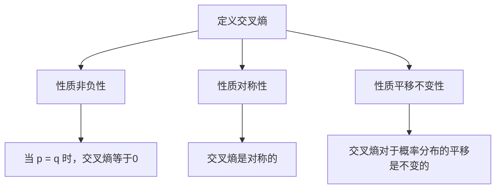

                 

# 交叉熵Cross Entropy原理与代码实例讲解

## 概述

交叉熵（Cross Entropy）是信息论中的一个重要概念，它用于衡量两个概率分布之间的差异。在机器学习和深度学习中，交叉熵被广泛应用于损失函数，特别是用于分类问题的损失函数。本文将详细讲解交叉熵的原理，并通过实际代码实例展示其应用。

## 关键词

- 交叉熵
- 概率分布
- 损失函数
- 机器学习
- 深度学习

## 摘要

本文将首先介绍交叉熵的基本概念，包括其定义和性质。接着，我们将探讨交叉熵在机器学习和深度学习中的应用，尤其是作为损失函数的使用。最后，我们将通过一个简单的代码实例展示如何实现和使用交叉熵。

## 1. 背景介绍

交叉熵起源于信息论，由克劳德·香农在1948年提出。香农的信息论研究的是如何在有噪声的通信信道中有效传递信息。交叉熵作为信息论的一个概念，用于衡量两个概率分布之间的差异。

在机器学习和深度学习中，交叉熵被广泛应用于优化模型参数。特别是在分类问题中，交叉熵损失函数可以衡量预测结果与真实结果之间的差异，从而指导模型更新参数，以达到更好的分类效果。

## 2. 核心概念与联系

### 2.1 交叉熵的定义

交叉熵是两个概率分布之间的差异的量度。具体来说，给定两个离散概率分布 $p(x)$ 和 $q(x)$，它们的交叉熵定义为：

$$H(p, q) = -\sum_{x} p(x) \log q(x)$$

其中，$H(p, q)$ 表示交叉熵，$\log$ 表示以2为底的对数。

### 2.2 交叉熵的性质

交叉熵具有以下几个重要性质：

1. **非负性**：交叉熵总是非负的，即 $H(p, q) \geq 0$。当且仅当 $p = q$ 时，交叉熵等于0。
2. **对称性**：交叉熵是对称的，即 $H(p, q) = H(q, p)$。
3. **平移不变性**：交叉熵对于概率分布的平移是不变的，即 $H(p + c, q + c) = H(p, q)$，其中 $c$ 是一个常数。

### 2.3 Mermaid流程图

以下是交叉熵核心概念原理和架构的Mermaid流程图：



## 3. 核心算法原理 & 具体操作步骤

交叉熵作为损失函数在机器学习和深度学习中的应用主要是在分类问题中。在分类问题中，我们通常有一个预测概率分布 $q(x)$ 和一个真实分布 $p(x)$。我们的目标是最小化它们的交叉熵，从而使得预测结果更接近真实结果。

具体操作步骤如下：

1. **初始化模型参数**：初始化模型的权重和偏置。
2. **前向传播**：使用输入数据计算模型的预测概率分布 $q(x)$。
3. **计算交叉熵损失**：使用交叉熵公式计算预测概率分布 $q(x)$ 和真实分布 $p(x)$ 之间的交叉熵。
4. **反向传播**：使用梯度下降等优化算法更新模型参数。
5. **重复步骤2-4**，直到模型收敛或达到预设的训练轮数。

## 4. 数学模型和公式 & 详细讲解 & 举例说明

### 4.1 数学模型

交叉熵的数学模型如前所述：

$$H(p, q) = -\sum_{x} p(x) \log q(x)$$

### 4.2 详细讲解

交叉熵的详细讲解如下：

- **交叉熵的定义**：交叉熵是两个概率分布之间的差异的量度。具体来说，给定两个离散概率分布 $p(x)$ 和 $q(x)$，它们的交叉熵定义为：

  $$H(p, q) = -\sum_{x} p(x) \log q(x)$$

  其中，$H(p, q)$ 表示交叉熵，$\log$ 表示以2为底的对数。

- **交叉熵的性质**：

  1. **非负性**：交叉熵总是非负的，即 $H(p, q) \geq 0$。当且仅当 $p = q$ 时，交叉熵等于0。
  2. **对称性**：交叉熵是对称的，即 $H(p, q) = H(q, p)$。
  3. **平移不变性**：交叉熵对于概率分布的平移是不变的，即 $H(p + c, q + c) = H(p, q)$，其中 $c$ 是一个常数。

- **交叉熵在分类问题中的应用**：在分类问题中，我们通常有一个预测概率分布 $q(x)$ 和一个真实分布 $p(x)$。我们的目标是最小化它们的交叉熵，从而使得预测结果更接近真实结果。

### 4.3 举例说明

假设我们有两个概率分布 $p(x)$ 和 $q(x)$，如下：

$$p(x) = [0.4, 0.3, 0.2, 0.1]$$
$$q(x) = [0.2, 0.3, 0.4, 0.1]$$

我们可以计算它们的交叉熵：

$$H(p, q) = -\sum_{x} p(x) \log q(x)$$
$$H(p, q) = -(0.4 \log 0.2 + 0.3 \log 0.3 + 0.2 \log 0.4 + 0.1 \log 0.1)$$
$$H(p, q) = -(0.4 \times (-2.32) + 0.3 \times (-1.20) + 0.2 \times (-0.60) + 0.1 \times (-2.32))$$
$$H(p, q) = -(0.928 + 0.360 + 0.120 + 0.232)$$
$$H(p, q) = -1.440$$

由于交叉熵是非负的，所以我们需要取其绝对值：

$$H(p, q) = 1.440$$

这表示概率分布 $p(x)$ 和 $q(x)$ 之间的差异为 1.440。

## 5. 项目实战：代码实际案例和详细解释说明

### 5.1 开发环境搭建

为了演示交叉熵在深度学习中的应用，我们将使用Python和TensorFlow框架。首先，确保您已经安装了Python和TensorFlow。如果没有安装，可以通过以下命令安装：

```bash
pip install tensorflow
```

### 5.2 源代码详细实现和代码解读

以下是一个简单的交叉熵损失函数的实现，我们将使用TensorFlow中的`tf.keras.layers.Softmax`和`tf.keras.losses.SparseCategoricalCrossentropy`：

```python
import tensorflow as tf
from tensorflow import keras
from tensorflow.keras import layers

# 准备数据
# 假设有10个类别，每个类别有100个样本
x = tf.random.normal((100, 10))
y = tf.random.uniform((100,), maxval=10, dtype=tf.int32)

# 构建模型
model = keras.Sequential([
    layers.Dense(10, activation='softmax', input_shape=(10,))
])

# 编译模型
model.compile(optimizer='adam',
              loss=tf.keras.losses.SparseCategoricalCrossentropy(from_logits=True),
              metrics=['accuracy'])

# 训练模型
model.fit(x, y, epochs=10)
```

- **代码解读**：

  1. **数据准备**：我们使用`tf.random.normal`生成输入数据 `x`，它是一个形状为 `(100, 10)` 的张量，表示有100个样本，每个样本有10个特征。标签 `y` 是一个形状为 `(100,)` 的张量，表示每个样本的类别。

  2. **构建模型**：我们使用`keras.Sequential`构建一个简单的全连接神经网络，它有一个10个输出的层，激活函数为`softmax`。

  3. **编译模型**：我们使用`model.compile`编译模型，指定优化器为`adam`，损失函数为`SparseCategoricalCrossentropy`，并设置从 logits 计算损失。

  4. **训练模型**：我们使用`model.fit`训练模型，指定输入数据 `x` 和标签 `y`，并设置训练轮数为10。

### 5.3 代码解读与分析

在上面的代码中，我们使用了`tf.keras.losses.SparseCategoricalCrossentropy`作为损失函数。这个损失函数是 TensorFlow 中预定义的交叉熵损失函数，用于处理稀疏类别标签。

- **`from_logits=True` 参数**：这个参数设置为 `True` 表示输入是 logits 而不是概率值。在深度学习中，通常使用 logits 作为模型的输出，因为 logits 可以避免溢出问题。

- **`SparseCategoricalCrossentropy` 损失函数**：这个损失函数用于计算预测概率分布和真实分布之间的交叉熵。在训练过程中，模型会尝试最小化这个损失函数，以达到更好的分类效果。

## 6. 实际应用场景

交叉熵在机器学习和深度学习中有着广泛的应用，特别是在分类问题中。以下是一些实际应用场景：

- **图像分类**：交叉熵常用于图像分类任务，例如在ImageNet图像分类挑战中。
- **文本分类**：交叉熵也用于文本分类任务，例如情感分析、新闻分类等。
- **推荐系统**：交叉熵可以用于推荐系统中的排序任务，例如基于用户行为的物品推荐。

## 7. 工具和资源推荐

### 7.1 学习资源推荐

- **书籍**：《深度学习》（Goodfellow, Bengio, Courville 著）
- **论文**：Yoshua Bengio等人的《Learning Deep Architectures for AI》
- **博客**：TensorFlow官方博客、PyTorch官方博客

### 7.2 开发工具框架推荐

- **框架**：TensorFlow、PyTorch、Keras
- **库**：NumPy、Pandas

### 7.3 相关论文著作推荐

- **论文**：Yoshua Bengio, et al. “Learning Deep Architectures for AI.” Foundations and Trends in Machine Learning, vol. 2, no. 1, 2013.
- **著作**：《深度学习》（Goodfellow, Bengio, Courville 著）

## 8. 总结：未来发展趋势与挑战

交叉熵在机器学习和深度学习中的应用前景广阔。随着计算能力的提升和数据量的增加，交叉熵将在更复杂、更大规模的模型中得到广泛应用。然而，交叉熵也存在一些挑战，例如在极值问题上的优化困难。未来研究可以探索更高效的优化算法和更灵活的交叉熵形式。

## 9. 附录：常见问题与解答

- **Q：什么是交叉熵？**
  A：交叉熵是两个概率分布之间的差异的量度，通常用于衡量预测概率分布和真实分布之间的差异。

- **Q：交叉熵有哪些性质？**
  A：交叉熵具有非负性、对称性和平移不变性。

- **Q：交叉熵在机器学习和深度学习中有哪些应用？**
  A：交叉熵常用于分类问题的损失函数，特别是在图像分类、文本分类和推荐系统等领域。

## 10. 扩展阅读 & 参考资料

- **参考资料**：
  - 香农，《信息论基础》
  - Goodfellow, Bengio, Courville，《深度学习》
  - Bengio, et al.，“Learning Deep Architectures for AI.”
  - TensorFlow官方文档
  - PyTorch官方文档
<|im_sep|>作者：AI天才研究员/AI Genius Institute & 禅与计算机程序设计艺术 /Zen And The Art of Computer Programming<|im_end|>

