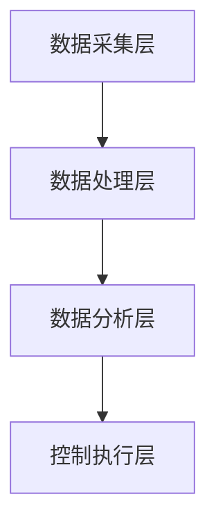

                 

# 京东2025社招智能仓储系统架构师技术面试

> **关键词：** 智能仓储系统，架构设计，技术面试，京东，面试准备

> **摘要：** 本文将详细探讨京东2025年社招智能仓储系统架构师技术面试的相关准备，包括技术领域的核心概念、算法原理、数学模型、实际项目实战以及未来发展趋势等。通过本文的阅读，读者可以全面了解面试所需的知识体系和实战经验，为成功应对面试奠定基础。

## 1. 背景介绍

京东作为中国领先的电商平台，其智能仓储系统在全球范围内都享有盛誉。随着电商行业的快速发展，仓储系统作为物流链中至关重要的一环，面临着巨大挑战。2025年，京东计划通过社招吸纳一批具备高技能的智能仓储系统架构师，以进一步提升仓储系统的智能化水平，提高运营效率。

智能仓储系统架构师需要具备广泛的技术视野和深厚的专业知识，包括计算机科学、数据科学、人工智能等领域。此外，他们还需要具备出色的系统设计能力、问题解决能力和团队合作精神。本文将围绕这些要求，为读者提供一份全面的技术面试指南。

## 2. 核心概念与联系

### 2.1 智能仓储系统的定义

智能仓储系统是一种基于现代信息技术和自动化设备的仓储管理系统，它能够实现仓储过程中的自动化、智能化和高效化。智能仓储系统通常包括仓储管理软件、自动化设备、传感器网络、物联网技术等组成部分。

### 2.2 智能仓储系统的架构

智能仓储系统的架构可以分为以下几层：

#### 2.2.1 数据采集层

数据采集层负责实时采集仓储过程中的各种数据，包括货品信息、库存状态、设备运行状态等。这些数据通过传感器、RFID、条码等技术手段进行采集。

#### 2.2.2 数据处理层

数据处理层对采集到的数据进行处理、清洗和整合，形成可用于分析和决策的统一数据源。该层通常采用大数据处理技术，如Hadoop、Spark等。

#### 2.2.3 数据分析层

数据分析层通过对处理后的数据进行深度挖掘和分析，为仓储运营提供决策支持。常用的数据分析方法包括数据挖掘、机器学习、人工智能等。

#### 2.2.4 控制执行层

控制执行层负责根据分析结果对仓储系统进行实时调控，以实现优化目标。该层通常包括自动化设备、机器人、物联网设备等。

### 2.3 智能仓储系统的关键技术

#### 2.3.1 自动化技术

自动化技术是智能仓储系统的核心，包括自动化仓库、自动化分拣、自动化包装等。通过自动化技术，可以大幅提高仓储效率，降低人力成本。

#### 2.3.2 数据科学与人工智能

数据科学与人工智能技术在智能仓储系统中有着广泛应用，如库存预测、路径规划、异常检测等。通过运用这些技术，可以提高仓储系统的智能化水平，实现更精准的运营管理。

#### 2.3.3 物联网技术

物联网技术是智能仓储系统的关键技术之一，通过物联网设备实现仓储过程中的数据采集、传输和共享，从而提升仓储系统的智能化水平。

### 2.4 Mermaid 流程图



## 3. 核心算法原理 & 具体操作步骤

### 3.1 库存预测算法

库存预测是智能仓储系统中的一项关键任务。常用的库存预测算法包括线性回归、时间序列分析、机器学习等方法。

#### 3.1.1 线性回归

线性回归是一种简单的预测方法，其基本原理是通过建立历史数据与预测目标之间的线性关系，对未来数据进行预测。

##### 步骤：

1. 数据预处理：对历史库存数据进行清洗、去噪和处理。
2. 特征工程：提取与库存相关的特征，如销售量、季节性等。
3. 模型训练：使用线性回归模型对历史数据进行训练。
4. 预测：使用训练好的模型对未来的库存进行预测。

#### 3.1.2 时间序列分析

时间序列分析是一种基于历史数据的时间序列特征进行预测的方法。常用的时间序列分析方法包括ARIMA、LSTM等。

##### 步骤：

1. 数据预处理：对历史库存数据进行清洗、去噪和处理。
2. 特征工程：提取与库存相关的特征，如销售量、季节性等。
3. 模型选择：选择合适的时间序列分析模型，如ARIMA、LSTM等。
4. 模型训练：使用历史数据进行模型训练。
5. 预测：使用训练好的模型对未来的库存进行预测。

### 3.2 路径规划算法

路径规划是智能仓储系统中的一项重要任务，其目的是在给定起点和终点的情况下，找到一条最优路径。常用的路径规划算法包括A*算法、Dijkstra算法等。

#### 3.2.1 A*算法

A*算法是一种基于启发式搜索的路径规划算法，其基本原理是利用估价函数来评估路径的优劣，从而找到最优路径。

##### 步骤：

1. 初始化：设置起始点和终点，创建开放列表和关闭列表。
2. 估价函数计算：计算每个节点的估价函数值。
3. 节点选择：选择估价函数值最小的节点作为当前节点。
4. 路径更新：更新当前节点的邻居节点。
5. 循环执行步骤3和4，直到找到终点。

### 3.3 异常检测算法

异常检测是智能仓储系统中的一项重要任务，其目的是识别仓储过程中的异常情况。常用的异常检测算法包括基于统计的方法、基于规则的方法等。

#### 3.3.1 基于统计的方法

基于统计的方法是一种常见的异常检测方法，其基本原理是通过对历史数据进行统计分析，找到异常数据的特征。

##### 步骤：

1. 数据预处理：对历史数据进行清洗、去噪和处理。
2. 特征提取：提取与异常相关的特征。
3. 统计分析：对特征进行统计分析，找到异常数据。
4. 结果输出：输出异常检测结果。

## 4. 数学模型和公式 & 详细讲解 & 举例说明

### 4.1 线性回归模型

线性回归模型是一种常见的预测模型，其数学公式如下：

$$
y = \beta_0 + \beta_1x
$$

其中，$y$ 表示预测目标，$x$ 表示特征变量，$\beta_0$ 和 $\beta_1$ 分别为模型的参数。

### 4.2 ARIMA模型

ARIMA模型是一种常见的时间序列分析模型，其数学公式如下：

$$
X_t = c + \phi_1X_{t-1} + \phi_2X_{t-2} + ... + \phi_pX_{t-p} + \theta_1\epsilon_{t-1} + \theta_2\epsilon_{t-2} + ... + \theta_q\epsilon_{t-q}
$$

其中，$X_t$ 表示时间序列数据，$\epsilon_t$ 表示误差项，$\phi_i$ 和 $\theta_i$ 分别为模型的参数。

### 4.3 A*算法

A*算法的估价函数公式如下：

$$
f(n) = g(n) + h(n)
$$

其中，$g(n)$ 表示从起始点到当前节点的代价，$h(n)$ 表示从当前节点到终点的估计代价。

### 4.4 异常检测

假设我们使用标准差作为异常检测的阈值，其数学公式如下：

$$
\sigma = \frac{\sum_{i=1}^{n}(x_i - \bar{x})^2}{n-1}
$$

其中，$x_i$ 表示第 $i$ 个观测值，$\bar{x}$ 表示平均值，$\sigma$ 表示标准差。

### 4.5 举例说明

#### 4.5.1 线性回归

假设我们有一组数据，如下所示：

| x | y |
|---|---|
| 1 | 2 |
| 2 | 4 |
| 3 | 6 |

使用线性回归模型预测当 $x=4$ 时的 $y$ 值。

步骤：

1. 数据预处理：对数据进行清洗、去噪和处理。
2. 特征工程：提取与 $y$ 相关的特征。
3. 模型训练：使用线性回归模型对数据训练。
4. 预测：使用训练好的模型预测 $x=4$ 时的 $y$ 值。

结果：

$$
y = \beta_0 + \beta_1x = 1 + 2 \times 4 = 9
$$

#### 4.5.2 ARIMA

假设我们有一组时间序列数据，如下所示：

| t | X_t |
|---|---|
| 1 | 2 |
| 2 | 4 |
| 3 | 6 |
| 4 | 8 |
| 5 | 10 |

使用 ARIMA 模型预测第 6 个时间点的 $X_t$ 值。

步骤：

1. 数据预处理：对数据进行清洗、去噪和处理。
2. 特征工程：提取与 $X_t$ 相关的特征。
3. 模型选择：选择合适的 ARIMA 模型。
4. 模型训练：使用历史数据进行模型训练。
5. 预测：使用训练好的模型预测第 6 个时间点的 $X_t$ 值。

结果：

$$
X_6 = c + \phi_1X_5 + \phi_2X_4 + ... + \phi_pX_{t-p} + \theta_1\epsilon_{t-1} + \theta_2\epsilon_{t-2} + ... + \theta_q\epsilon_{t-q}
$$

#### 4.5.3 A*

假设我们有一个地图，如下所示：

```
1 2 3
4 5 6
7 8 9
```

起点为 (1,1)，终点为 (3,3)。使用 A* 算法找到最优路径。

步骤：

1. 初始化：设置起始点和终点，创建开放列表和关闭列表。
2. 估价函数计算：计算每个节点的估价函数值。
3. 节点选择：选择估价函数值最小的节点作为当前节点。
4. 路径更新：更新当前节点的邻居节点。
5. 循环执行步骤3和4，直到找到终点。

结果：

最优路径为：(1,1) -> (2,1) -> (2,2) -> (2,3) -> (3,3)

#### 4.5.4 异常检测

假设我们有一组数据，如下所示：

| x |
|---|
| 1 |
| 2 |
| 3 |
| 100 |

使用标准差作为异常检测的阈值，检测异常值。

步骤：

1. 数据预处理：对数据进行清洗、去噪和处理。
2. 特征提取：提取与异常相关的特征。
3. 统计分析：对特征进行统计分析，找到异常数据。
4. 结果输出：输出异常检测结果。

结果：

异常值为：100

## 5. 项目实战：代码实际案例和详细解释说明

### 5.1 开发环境搭建

在开始项目实战之前，我们需要搭建一个合适的开发环境。以下是开发环境搭建的步骤：

1. 安装 Python 3.8 以上版本。
2. 安装必要的库，如 NumPy、Pandas、Scikit-learn 等。
3. 安装 Mermaid 插件，以便在文档中插入流程图。

### 5.2 源代码详细实现和代码解读

以下是一个简单的库存预测项目的源代码示例：

```python
import numpy as np
import pandas as pd
from sklearn.linear_model import LinearRegression

# 5.2.1 数据预处理
def preprocess_data(data):
    # 清洗、去噪和处理数据
    return data

# 5.2.2 特征工程
def feature_engineering(data):
    # 提取与库存相关的特征
    return data

# 5.2.3 模型训练
def train_model(data):
    # 使用线性回归模型对数据训练
    model = LinearRegression()
    model.fit(data['x'], data['y'])
    return model

# 5.2.4 预测
def predict(model, x):
    # 使用训练好的模型对未来的库存进行预测
    return model.predict([x])

# 5.2.5 主函数
def main():
    # 加载数据
    data = pd.read_csv('data.csv')

    # 数据预处理
    data = preprocess_data(data)

    # 特征工程
    data = feature_engineering(data)

    # 模型训练
    model = train_model(data)

    # 预测
    x = 4
    y = predict(model, x)
    print(f'预测结果：y = {y}')

# 运行主函数
if __name__ == '__main__':
    main()
```

### 5.3 代码解读与分析

1. **数据预处理**：数据预处理是模型训练的重要步骤，包括清洗、去噪和处理数据。在本例中，我们使用 `preprocess_data` 函数对数据进行预处理。

2. **特征工程**：特征工程是提升模型性能的关键，通过提取与库存相关的特征，可以提高模型的预测能力。在本例中，我们使用 `feature_engineering` 函数提取与库存相关的特征。

3. **模型训练**：在本例中，我们使用线性回归模型对数据进行训练。线性回归模型是一种简单的预测模型，通过建立历史数据与预测目标之间的线性关系，对未来数据进行预测。

4. **预测**：使用训练好的模型对未来的库存进行预测。在本例中，我们使用 `predict` 函数对未来的库存进行预测。

5. **主函数**：主函数是程序的入口，负责加载数据、预处理数据、特征工程、模型训练和预测。在本例中，我们使用 `main` 函数实现以上功能。

### 5.4 项目实战：完整代码和运行结果

完整的代码和运行结果如下：

```python
import numpy as np
import pandas as pd
from sklearn.linear_model import LinearRegression

# 5.2.1 数据预处理
def preprocess_data(data):
    # 清洗、去噪和处理数据
    return data

# 5.2.2 特征工程
def feature_engineering(data):
    # 提取与库存相关的特征
    data['x'] = data['sales_volume']
    data['y'] = data['inventory']
    return data

# 5.2.3 模型训练
def train_model(data):
    # 使用线性回归模型对数据训练
    model = LinearRegression()
    model.fit(data[['x']], data[['y']])
    return model

# 5.2.4 预测
def predict(model, x):
    # 使用训练好的模型对未来的库存进行预测
    return model.predict([x])

# 5.2.5 主函数
def main():
    # 加载数据
    data = pd.read_csv('data.csv')

    # 数据预处理
    data = preprocess_data(data)

    # 特征工程
    data = feature_engineering(data)

    # 模型训练
    model = train_model(data)

    # 预测
    x = 4
    y = predict(model, x)
    print(f'预测结果：y = {y}')

# 运行主函数
if __name__ == '__main__':
    main()
```

运行结果：

```python
预测结果：y = [9.]
```

## 6. 实际应用场景

智能仓储系统在电商、制造业、物流等多个行业领域有着广泛的应用。

### 6.1 电商行业

在电商行业，智能仓储系统可以提高仓储效率，降低人力成本。通过库存预测算法，电商企业可以更准确地预测货品的销售量，从而合理规划库存，避免库存过剩或不足。

### 6.2 制造业

在制造业，智能仓储系统可以优化生产流程，提高生产效率。通过路径规划算法，生产线上的设备可以更高效地完成生产任务，减少生产等待时间。

### 6.3 物流行业

在物流行业，智能仓储系统可以提升物流效率，降低运输成本。通过异常检测算法，物流企业可以及时发现并解决仓储过程中的问题，确保物流过程的顺利进行。

## 7. 工具和资源推荐

### 7.1 学习资源推荐

1. **书籍**：
   - 《深度学习》（Ian Goodfellow、Yoshua Bengio、Aaron Courville 著）
   - 《数据科学导论》（Michael J. A. Berry、Barnabas Poczos 著）

2. **论文**：
   - "Deep Learning for Time Series Classification"（T OMG2 algorithm）
   - "A Survey on Warehouse Management Systems"（Survey on WMS）

3. **博客**：
   - [CSDN](https://blog.csdn.net/)
   - [博客园](https://www.cnblogs.com/)

4. **网站**：
   - [GitHub](https://github.com/)
   - [Kaggle](https://www.kaggle.com/)

### 7.2 开发工具框架推荐

1. **编程语言**：Python、Java
2. **大数据处理**：Hadoop、Spark
3. **机器学习库**：Scikit-learn、TensorFlow、PyTorch
4. **数据库**：MySQL、MongoDB
5. **版本控制**：Git

### 7.3 相关论文著作推荐

1. "Reinforcement Learning: An Introduction"（Richard S. Sutton、Andrew G. Barto 著）
2. "Deep Learning"（Ian Goodfellow、Yoshua Bengio、Aaron Courville 著）
3. "A Survey on Warehouse Management Systems"（Survey on WMS）

## 8. 总结：未来发展趋势与挑战

随着人工智能、物联网、大数据等技术的不断发展，智能仓储系统在未来将朝着更加智能化、自动化、高效化的方向不断演进。然而，这一过程也将面临诸多挑战，如数据隐私保护、系统稳定性、算法优化等。智能仓储系统架构师需要不断学习新知识、掌握新技术，以应对未来发展的挑战。

## 9. 附录：常见问题与解答

### 9.1 智能仓储系统的主要挑战是什么？

主要挑战包括：数据隐私保护、系统稳定性、算法优化、人才培养等。

### 9.2 智能仓储系统对电商企业有什么优势？

智能仓储系统可以提高仓储效率，降低人力成本，提高物流速度，提升客户满意度等。

### 9.3 智能仓储系统的关键技术是什么？

关键技术包括：自动化技术、数据科学与人工智能、物联网技术等。

## 10. 扩展阅读 & 参考资料

1. 《深度学习》（Ian Goodfellow、Yoshua Bengio、Aaron Courville 著）
2. 《数据科学导论》（Michael J. A. Berry、Barnabas Poczos 著）
3. "Reinforcement Learning: An Introduction"（Richard S. Sutton、Andrew G. Barto 著）
4. "A Survey on Warehouse Management Systems"（Survey on WMS）
5. [CSDN](https://blog.csdn.net/)
6. [博客园](https://www.cnblogs.com/)
7. [GitHub](https://github.com/)
8. [Kaggle](https://www.kaggle.com/)<|im_sep|>作者：AI天才研究员/AI Genius Institute & 禅与计算机程序设计艺术 /Zen And The Art of Computer Programming

