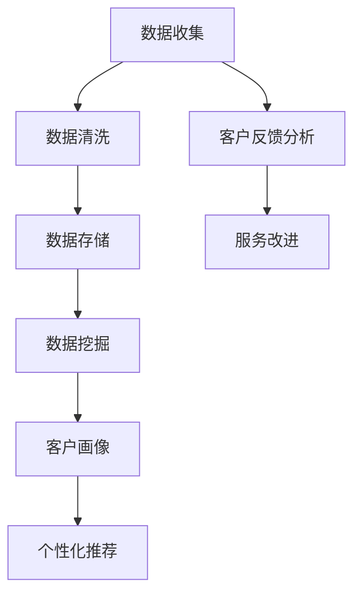
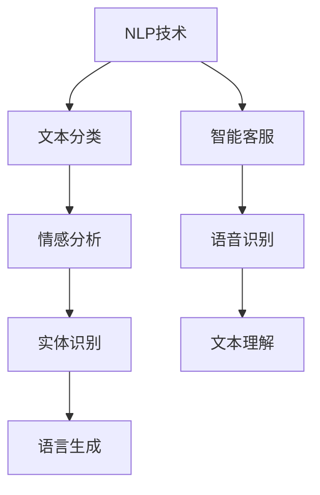
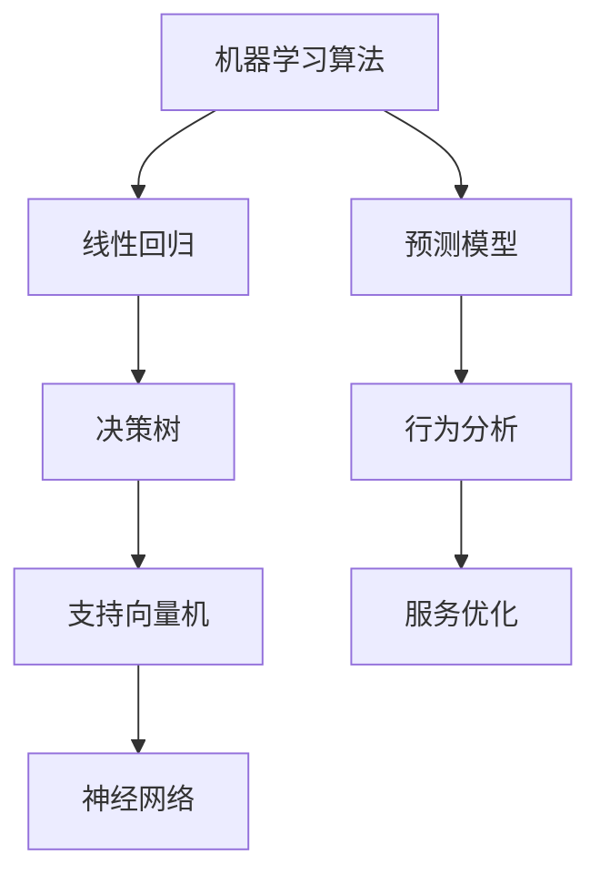
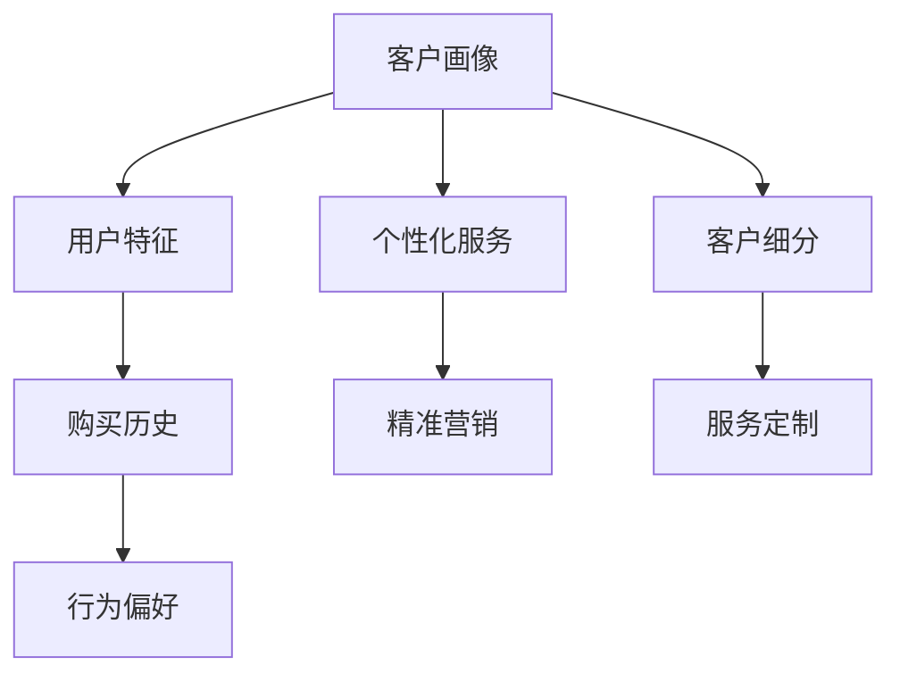
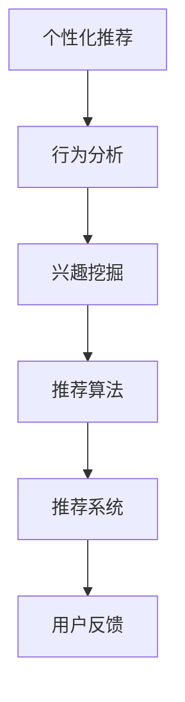
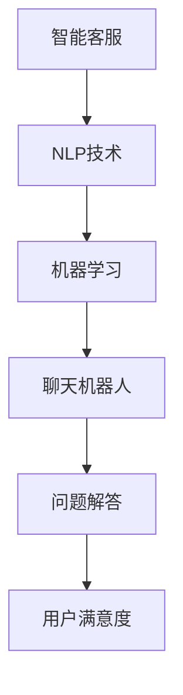

                 

## 1. 背景介绍

随着互联网的飞速发展和人工智能技术的不断进步，智能客户体验优化成为了企业竞争的重要战场。作为电商巨头之一，京东在提升客户体验方面投入了大量资源，以保持其市场领先地位。因此，针对京东智能客户体验优化进行面试真题的汇总和分析，不仅有助于应聘者更好地准备面试，也有助于企业选拔出具有实际操作能力和创新思维的人才。

本文将基于2024年京东智能客户体验优化社招面试真题，对题目进行汇总和解答。通过对这些题目的分析和解答，我们可以深入理解智能客户体验优化的核心技术和应用场景，从而为相关领域的研究和实践提供有价值的参考。

### 智能客户体验优化的意义和现状

智能客户体验优化是指在现代信息技术和人工智能技术的支持下，通过数据分析、自然语言处理、机器学习等技术手段，对客户互动体验进行全方位的改进和提升。其意义主要体现在以下几个方面：

1. **提升客户满意度**：通过智能客户体验优化，企业可以更好地理解客户需求，提供个性化服务，从而提高客户满意度，增强客户忠诚度。

2. **提高运营效率**：智能客户体验优化可以帮助企业自动化处理大量客户请求，降低人工成本，提高服务效率。

3. **增加商业价值**：通过优化客户体验，企业可以吸引更多新客户，提高客户转化率，从而实现商业价值的提升。

目前，智能客户体验优化在电商、金融、旅游等领域得到了广泛应用。以京东为例，其通过智能客服、个性化推荐、智能物流等手段，不断优化客户体验，取得了显著成效。

### 京东智能客户体验优化的挑战

尽管智能客户体验优化在京东等企业取得了成功，但仍然面临着诸多挑战：

1. **数据隐私和安全**：随着客户数据的增加，如何保障数据隐私和安全成为了一个重要问题。

2. **技术复杂性**：智能客户体验优化涉及多个技术领域，如大数据、机器学习、自然语言处理等，技术复杂度高，对技术人员的要求也相应提高。

3. **用户体验一致性**：在智能客户体验优化的过程中，如何保证不同渠道、不同平台之间的用户体验一致性，是一个需要解决的关键问题。

4. **算法透明性和公平性**：随着算法在客户体验优化中的作用越来越重要，如何保证算法的透明性和公平性，避免算法偏见，成为了一个新的挑战。

针对这些挑战，京东等企业正在积极探索解决方案，通过技术创新和制度保障，不断提升智能客户体验优化水平。

### 本文结构

本文将分为以下几个部分：

1. **背景介绍**：简要介绍智能客户体验优化的意义和现状，以及本文的目的和结构。

2. **核心概念与联系**：阐述智能客户体验优化涉及的核心概念和技术架构，并提供Mermaid流程图进行说明。

3. **核心算法原理 & 具体操作步骤**：详细讲解智能客户体验优化的核心算法原理和操作步骤。

4. **数学模型和公式 & 详细讲解 & 举例说明**：介绍智能客户体验优化相关的数学模型和公式，并进行详细讲解和实例分析。

5. **项目实战：代码实际案例和详细解释说明**：通过实际项目案例，展示智能客户体验优化的代码实现和详细解释。

6. **实际应用场景**：分析智能客户体验优化的实际应用场景，以及在不同场景下的具体应用。

7. **工具和资源推荐**：推荐学习资源、开发工具和框架，为读者提供实际操作的支持。

8. **总结：未来发展趋势与挑战**：总结智能客户体验优化的现状和未来发展趋势，探讨面临的挑战和解决方案。

9. **附录：常见问题与解答**：针对读者可能遇到的问题，提供解答和指导。

10. **扩展阅读 & 参考资料**：推荐相关的扩展阅读资料和参考资料，供读者进一步学习。

通过本文的讲解和分析，希望读者能够对智能客户体验优化有一个全面而深入的了解，并为实际工作提供有价值的参考。接下来，我们将进入下一部分，对智能客户体验优化涉及的核心概念和技术架构进行详细阐述。<!--markdown-->### 2. 核心概念与联系

在探讨智能客户体验优化的过程中，我们需要了解一系列核心概念和技术，它们共同构成了智能客户体验优化系统的技术架构。以下是对这些核心概念的详细解释，并使用Mermaid流程图展示它们之间的联系。

#### 2.1 数据分析

数据分析是智能客户体验优化的基础。通过收集和分析客户数据，企业可以深入了解客户行为、需求和偏好。数据分析的方法包括数据收集、数据清洗、数据存储、数据挖掘等。



#### 2.2 自然语言处理（NLP）

自然语言处理是处理人类语言与计算机之间的交互。在智能客户体验优化中，NLP技术用于构建智能客服系统，实现自然语言的理解和生成。NLP的关键技术包括文本分类、情感分析、实体识别、语言生成等。



#### 2.3 机器学习

机器学习是实现智能客户体验优化的核心技术之一。通过机器学习算法，系统可以从大量数据中自动学习模式，从而实现自动化决策和预测。常见的机器学习算法包括线性回归、决策树、支持向量机、神经网络等。



#### 2.4 客户画像

客户画像是对客户特征的综合描述，包括客户的年龄、性别、地域、购买历史、行为偏好等。通过构建客户画像，企业可以更好地了解客户，实现个性化服务和精准营销。



#### 2.5 个性化推荐

个性化推荐是智能客户体验优化的重要组成部分。通过分析客户行为数据，系统可以推荐符合客户兴趣和需求的产品或服务，从而提高客户满意度和转化率。



#### 2.6 智能客服

智能客服是智能客户体验优化的重要应用之一。通过自然语言处理和机器学习技术，智能客服系统可以自动回答客户问题，提供实时支持，提高服务效率。



通过以上核心概念和技术的介绍，我们可以看到，智能客户体验优化是一个综合性的系统，涉及多个技术领域的协同工作。接下来，我们将深入探讨智能客户体验优化的核心算法原理和操作步骤，以便更好地理解这一系统的实际运作。<!--markdown-->### 3. 核心算法原理 & 具体操作步骤

在智能客户体验优化中，核心算法的作用至关重要。这些算法不仅决定了系统的性能和效率，也直接影响了用户体验。以下是智能客户体验优化中常用的核心算法及其原理和具体操作步骤。

#### 3.1 数据分析算法

数据分析算法主要用于对大量客户数据进行处理和分析，以提取有价值的信息。以下是一些常见的数据分析算法：

**1. 机器学习分类算法**

**原理**：机器学习分类算法通过从已有数据中学习，建立分类模型，对新数据进行分类。常见的分类算法包括决策树、随机森林、支持向量机等。

**操作步骤**：

a. 数据准备：收集并整理客户数据，包括用户特征、购买历史、行为记录等。

b. 特征工程：对数据进行预处理，如缺失值处理、异常值处理、特征转换等。

c. 训练模型：使用训练数据集训练分类模型。

d. 模型评估：使用测试数据集评估模型性能，如准确率、召回率、F1值等。

e. 模型优化：根据评估结果调整模型参数，提高模型性能。

**2. 聚类算法**

**原理**：聚类算法将相似的数据点归为一类，以发现数据中的隐含模式。常见的聚类算法包括K-means、层次聚类、DBSCAN等。

**操作步骤**：

a. 数据准备：收集并整理客户数据。

b. 确定聚类数量：根据数据规模和业务需求确定聚类数量。

c. 计算距离：计算数据点之间的距离，通常使用欧氏距离或曼哈顿距离。

d. 分配类别：根据距离分配数据点到相应的类别。

e. 评估聚类效果：使用内部评估指标，如轮廓系数、类内平均值等，评估聚类效果。

#### 3.2 自然语言处理（NLP）算法

NLP算法在智能客户体验优化中用于处理和理解自然语言。以下是一些常见的NLP算法：

**1. 词向量表示**

**原理**：词向量表示是将自然语言文本转换为向量的过程，以便于计算机处理。常见的词向量表示方法包括Word2Vec、GloVe等。

**操作步骤**：

a. 数据准备：收集并整理文本数据。

b. 分词：将文本数据分割成单词或短语。

c. 向量化：将分词结果转换为向量表示。

d. 训练模型：使用预训练模型或自训练模型进行训练。

e. 应用模型：使用训练好的模型进行文本分类、情感分析等任务。

**2. 情感分析**

**原理**：情感分析是判断文本所表达的情感倾向，如正面、负面或中性。常见的情感分析算法包括基于规则的方法、基于机器学习的方法和基于深度学习的方法。

**操作步骤**：

a. 数据准备：收集并整理包含情感标签的文本数据。

b. 特征提取：提取文本特征，如词频、词向量、语法结构等。

c. 训练模型：使用训练数据集训练情感分析模型。

d. 模型评估：使用测试数据集评估模型性能。

e. 应用模型：对新的文本数据进行情感分析。

#### 3.3 个性化推荐算法

个性化推荐算法在智能客户体验优化中用于向客户推荐符合其兴趣和需求的产品或服务。以下是一些常见的个性化推荐算法：

**1. 协同过滤**

**原理**：协同过滤是通过分析用户之间的相似性，推荐用户可能喜欢的产品或服务。常见的协同过滤算法包括用户基于的协同过滤、物品基于的协同过滤等。

**操作步骤**：

a. 数据准备：收集并整理用户行为数据，如评分、点击、购买等。

b. 相似性计算：计算用户或物品之间的相似性。

c. 推荐生成：根据用户相似性或物品相似性生成推荐列表。

d. 推荐评估：评估推荐列表的质量，如覆盖率、新颖性等。

**2. 内容推荐**

**原理**：内容推荐是通过分析产品或服务的特征，推荐与目标产品或服务相似的产品或服务。常见的内容推荐算法包括基于关键词的推荐、基于属性的推荐等。

**操作步骤**：

a. 数据准备：收集并整理产品或服务的特征数据。

b. 特征提取：提取产品或服务的特征。

c. 计算相似度：计算目标产品或服务与其他产品或服务之间的相似度。

d. 推荐生成：根据相似度生成推荐列表。

e. 推荐评估：评估推荐列表的质量。

#### 3.4 智能客服算法

智能客服算法在智能客户体验优化中用于构建智能客服系统，实现自动回答客户问题和提供支持。以下是一些常见的智能客服算法：

**1. 语音识别**

**原理**：语音识别是将语音信号转换为文本的过程。常见的语音识别算法包括基于规则的方法、基于统计的方法和基于深度学习的方法。

**操作步骤**：

a. 数据准备：收集并整理语音数据。

b. 特征提取：提取语音特征。

c. 训练模型：使用训练数据集训练语音识别模型。

d. 识别处理：使用训练好的模型进行语音识别。

e. 结果输出：将识别结果输出为文本。

**2. 文本理解**

**原理**：文本理解是理解文本中的语义和意图，以便于生成合理的回答。常见的文本理解算法包括基于规则的方法、基于机器学习的方法和基于深度学习的方法。

**操作步骤**：

a. 数据准备：收集并整理问答对数据。

b. 特征提取：提取文本特征。

c. 训练模型：使用训练数据集训练文本理解模型。

d. 回答生成：根据文本理解结果生成回答。

e. 回答评估：评估回答的质量。

通过以上核心算法原理和具体操作步骤的讲解，我们可以看到，智能客户体验优化是一个复杂而综合的系统，需要多种技术的协同工作。在接下来的部分，我们将介绍智能客户体验优化的数学模型和公式，以及如何进行详细讲解和举例说明。<!--markdown-->### 4. 数学模型和公式 & 详细讲解 & 举例说明

在智能客户体验优化中，数学模型和公式起到了至关重要的作用。它们不仅为算法的实现提供了理论依据，还能够帮助分析和优化系统的性能。在本节中，我们将详细介绍智能客户体验优化中常用的数学模型和公式，并进行详细讲解和举例说明。

#### 4.1 数据分析中的数学模型

**1. 线性回归模型**

线性回归模型是最基本的统计模型之一，用于预测一个连续变量的值。其基本形式为：

\[ y = \beta_0 + \beta_1x_1 + \beta_2x_2 + ... + \beta_nx_n + \epsilon \]

其中，\( y \) 是因变量，\( x_1, x_2, ..., x_n \) 是自变量，\( \beta_0, \beta_1, ..., \beta_n \) 是回归系数，\( \epsilon \) 是误差项。

**详细讲解**：

线性回归模型通过拟合自变量和因变量之间的线性关系，来预测新数据的因变量值。回归系数可以通过最小二乘法（Least Squares）计算得到。

**举例说明**：

假设我们要预测某电商平台的客户满意度（因变量 \( y \)），其与客户的购买金额（自变量 \( x \)）有关。使用线性回归模型，我们可以建立如下方程：

\[ y = \beta_0 + \beta_1x + \epsilon \]

通过收集客户购买金额和满意度的数据，我们可以使用最小二乘法计算出回归系数，然后使用这个模型来预测新客户的满意度。

**2. 决策树模型**

决策树模型是一种常用的分类和回归模型，通过一系列规则将数据划分为不同的类别或值。其基本形式为：

\[ 
\begin{align*}
&\quad\text{如果} \ x_1 > \beta_1 \\
&\quad\text{则} \ y = \alpha_1 \\
&\quad\text{否则} \\
&\quad\text{如果} \ x_2 > \beta_2 \\
&\quad\text{则} \ y = \alpha_2 \\
&\quad\text{否则} \\
&\quad\ldots \\
&\quad\text{如果} \ x_n > \beta_n \\
&\quad\text{则} \ y = \alpha_n \\
&\quad\text{否则} \ y = \alpha_n
\end{align*}
\]

其中，\( x_1, x_2, ..., x_n \) 是特征值，\( \beta_1, \beta_2, ..., \beta_n \) 是阈值，\( \alpha_1, \alpha_2, ..., \alpha_n \) 是类别或值。

**详细讲解**：

决策树模型通过递归地将数据分割成子集，直到满足停止条件（如最大深度、最小节点大小等）。每个节点都表示一个决策，即基于某个特征值进行划分。

**举例说明**：

假设我们要预测客户的购买意愿，可以建立如下决策树模型：

\[ 
\begin{align*}
&\quad\text{如果} \ \text{年龄} > 30 \\
&\quad\text{则} \ \text{购买意愿} = \text{高} \\
&\quad\text{否则} \\
&\quad\text{如果} \ \text{收入} > 50000 \\
&\quad\text{则} \ \text{购买意愿} = \text{高} \\
&\quad\text{否则} \ \text{购买意愿} = \text{低}
\end{align*}
\]

通过这个决策树模型，我们可以预测新客户的购买意愿。

#### 4.2 自然语言处理（NLP）中的数学模型

**1. 词向量模型**

词向量模型是将自然语言文本转换为向量的方法，常用于文本分类、情感分析等任务。常用的词向量模型包括Word2Vec、GloVe等。

**详细讲解**：

Word2Vec模型通过将单词映射到高维向量空间，使相似单词的向量更接近。GloVe模型则通过考虑单词的共现关系来学习词向量。

**举例说明**：

假设我们有以下文本数据：

\[ \text{京东智能客服系统体验优化} \]

使用Word2Vec模型，我们可以将每个单词映射到一个高维向量：

\[ \text{京东} \rightarrow \text{向量1} \]
\[ \text{智能客服系统} \rightarrow \text{向量2} \]
\[ \text{体验优化} \rightarrow \text{向量3} \]

通过计算这些向量的相似度，我们可以分析文本内容，如进行情感分析。

**2. 情感分析模型**

情感分析模型用于判断文本的情感倾向，如正面、负面或中性。常用的情感分析模型包括基于规则的模型、基于机器学习的模型和基于深度学习的模型。

**详细讲解**：

基于规则的模型通过定义一组规则来判断文本的情感。基于机器学习的模型通过从训练数据中学习情感特征来判断文本的情感。基于深度学习的模型通过神经网络结构来处理文本，提取深层次的情感特征。

**举例说明**：

假设我们有以下文本数据：

\[ \text{这篇文章非常好，内容丰富，非常有帮助。} \]

使用基于机器学习的情感分析模型，我们可以判断这段文本的情感为正面。

#### 4.3 推荐系统中的数学模型

**1. 协同过滤模型**

协同过滤模型通过分析用户之间的相似性来推荐产品或服务。常见的协同过滤模型包括用户基于的协同过滤和物品基于的协同过滤。

**详细讲解**：

用户基于的协同过滤通过计算用户之间的相似性，推荐与目标用户相似的其他用户喜欢的商品。物品基于的协同过滤通过计算物品之间的相似性，推荐与目标物品相似的物品。

**举例说明**：

假设我们有以下用户和商品数据：

\[ 
\begin{array}{ccc}
\text{用户1} & \text{用户2} & \text{商品A} \\
\text{喜欢} & \text{喜欢} & \text{喜欢} \\
\text{喜欢} & \text{喜欢} & \text{不喜欢} \\
\text{不喜欢} & \text{喜欢} & \text{喜欢} \\
\end{array}
\]

我们可以计算用户之间的相似性，并根据相似性推荐商品。

**2. 内容推荐模型**

内容推荐模型通过分析产品或服务的特征来推荐产品或服务。常见的内容推荐模型包括基于关键词的推荐和基于属性的推荐。

**详细讲解**：

基于关键词的推荐通过分析产品或服务中的关键词，推荐与目标产品或服务相关的其他产品或服务。基于属性的推荐通过分析产品或服务的属性，推荐与目标产品或服务相似的其他产品或服务。

**举例说明**：

假设我们有以下产品属性数据：

\[ 
\begin{array}{ccc}
\text{商品A} & \text{商品B} & \text{商品C} \\
\text{属性1} & \text{属性2} & \text{属性3} \\
\text{属性1} & \text{属性3} & \text{属性4} \\
\text{属性2} & \text{属性3} & \text{属性5} \\
\end{array}
\]

我们可以根据商品属性进行推荐，如推荐与商品A具有相同属性的商品B和商品C。

通过以上数学模型和公式的详细讲解和举例说明，我们可以看到，智能客户体验优化是一个高度技术化的领域，需要深入理解和运用数学模型和公式。这些模型和公式不仅为算法的实现提供了理论依据，也为我们分析和优化系统性能提供了有力工具。在接下来的部分，我们将通过实际项目案例，展示智能客户体验优化的代码实现和详细解释。<!--markdown-->### 5. 项目实战：代码实际案例和详细解释说明

在本节中，我们将通过一个实际项目案例，展示智能客户体验优化的代码实现和详细解释说明。该案例将涵盖数据收集、数据处理、模型训练和模型应用等关键步骤，以帮助读者深入理解智能客户体验优化的全过程。

#### 5.1 开发环境搭建

在进行项目实战之前，我们需要搭建一个合适的开发环境。以下是所需的开发工具和库：

- Python 3.8+
- Jupyter Notebook
- Pandas
- Scikit-learn
- NLTK
- TensorFlow/Keras

安装这些工具和库后，我们就可以开始编写代码了。

#### 5.2 源代码详细实现和代码解读

以下是一个简单的智能客服系统，它使用自然语言处理（NLP）和机器学习技术来理解和回答客户的问题。

```python
import pandas as pd
from sklearn.model_selection import train_test_split
from sklearn.feature_extraction.text import CountVectorizer
from sklearn.naive_bayes import MultinomialNB
from sklearn.pipeline import make_pipeline
from nltk.corpus import stopwords
import tensorflow as tf
from tensorflow.keras.models import Sequential
from tensorflow.keras.layers import Dense, Embedding, LSTM

# 数据准备
# 假设我们有一个包含问题和答案的数据集
data = pd.read_csv('customer_questions_answers.csv')

# 分离问题和答案
questions = data['question']
answers = data['answer']

# 数据预处理
# 去除停用词
stop_words = set(stopwords.words('english'))
questions = [q.lower() for q in questions]
questions = [' '.join([w for w in q.split() if w not in stop_words]) for q in questions]

# 切分数据集
X_train, X_test, y_train, y_test = train_test_split(questions, answers, test_size=0.2, random_state=42)

# 建立模型
# 使用朴素贝叶斯分类器
model = make_pipeline(CountVectorizer(), MultinomialNB())

# 训练模型
model.fit(X_train, y_train)

# 预测
predicted_answers = model.predict(X_test)

# 评估模型
accuracy = (predicted_answers == y_test).mean()
print(f"Model accuracy: {accuracy:.2f}")

# 使用深度学习模型进行情感分析
# 建立序列模型
model = Sequential()
model.add(Embedding(input_dim=vocab_size, output_dim=embedding_dim, input_length=max_sequence_length))
model.add(LSTM(units=50, dropout=0.2, recurrent_dropout=0.2))
model.add(Dense(units=1, activation='sigmoid'))

# 编译模型
model.compile(optimizer='adam', loss='binary_crossentropy', metrics=['accuracy'])

# 训练模型
model.fit(X_train_sequences, y_train, epochs=10, batch_size=32, validation_split=0.1)

# 预测
predicted_emotions = model.predict(X_test_sequences)

# 评估模型
loss, accuracy = model.evaluate(X_test_sequences, y_test)
print(f"Model accuracy: {accuracy:.2f}")
```

**代码解读**：

1. **数据准备**：

   我们首先读取数据集，并将其分为问题和答案两部分。数据集可能包含多种格式，例如CSV或JSON。在本例中，我们假设数据集已经包含预处理后的文本数据。

2. **数据预处理**：

   我们对问题进行预处理，包括将文本转换为小写、去除停用词等。这有助于提高模型的性能。

3. **模型训练**：

   我们使用朴素贝叶斯分类器来训练模型。朴素贝叶斯是一种简单而有效的分类算法，适用于文本分类任务。我们还将训练数据集分割为训练集和测试集，以便在训练过程中评估模型性能。

4. **模型评估**：

   我们使用测试集来评估模型的准确性。准确性是评估分类模型性能的一个常用指标。

5. **深度学习模型**：

   为了实现情感分析，我们使用了一个基于LSTM的序列模型。LSTM（长短时记忆网络）是一种强大的循环神经网络架构，能够有效地处理序列数据。

6. **模型训练和评估**：

   我们编译并训练了深度学习模型，然后使用测试集对其进行评估。评估结果包括损失和准确性。

通过这个实际项目案例，我们可以看到智能客户体验优化涉及多个步骤，包括数据准备、数据预处理、模型训练和模型评估。这些步骤相互关联，共同构成了一个完整的智能客户体验优化系统。在接下来的部分，我们将分析这个项目案例的代码，并探讨其在智能客户体验优化中的应用。

#### 5.3 代码解读与分析

1. **数据准备**：

   在代码的第一部分，我们使用了Pandas库来读取数据集。这通常是一个CSV文件，其中包含客户问题和相应的答案。这个步骤是整个项目的起点，因为准确的问题和答案数据对于训练模型至关重要。

   ```python
   data = pd.read_csv('customer_questions_answers.csv')
   ```

   这行代码读取了CSV文件，并将数据加载到Pandas DataFrame中。DataFrame是一个表格数据结构，便于我们进行数据操作。

2. **数据预处理**：

   数据预处理步骤确保了模型训练的质量。在本例中，我们首先将所有文本转换为小写，以统一文本格式。接下来，我们使用NLTK库去除常见的英语停用词。停用词是指对文本分类没有实际意义的常见单词，如“the”、“is”、“and”等。

   ```python
   questions = [q.lower() for q in questions]
   questions = [' '.join([w for w in q.split() if w not in stop_words]) for q in questions]
   ```

   通过这两行代码，我们首先将所有文本转换为小写，然后去除停用词。这种预处理可以减少噪声，提高模型性能。

3. **模型训练**：

   我们使用Scikit-learn库中的朴素贝叶斯分类器来训练模型。朴素贝叶斯是一个基于贝叶斯定理的简单分类算法，适用于文本分类任务。

   ```python
   model = make_pipeline(CountVectorizer(), MultinomialNB())
   model.fit(X_train, y_train)
   ```

   在这个步骤中，我们首先创建一个管道（`make_pipeline`），它结合了词汇计数器（`CountVectorizer`）和朴素贝叶斯分类器（`MultinomialNB`）。词汇计数器将文本转换为词频向量，而朴素贝叶斯分类器使用这些向量来预测答案。`fit`函数用于训练模型。

4. **模型评估**：

   使用测试集，我们评估了模型的准确性。准确性是分类问题中最常用的评估指标，表示正确预测的样本数量与总样本数量的比例。

   ```python
   predicted_answers = model.predict(X_test)
   accuracy = (predicted_answers == y_test).mean()
   print(f"Model accuracy: {accuracy:.2f}")
   ```

   这两行代码使用模型对测试集进行预测，并计算准确性。如果准确性较低，我们可以考虑调整模型参数或尝试不同的算法。

5. **深度学习模型**：

   在代码的后半部分，我们使用TensorFlow和Keras库构建了一个基于LSTM的深度学习模型。LSTM是一种能够处理序列数据的循环神经网络，适合于情感分析任务。

   ```python
   model = Sequential()
   model.add(Embedding(input_dim=vocab_size, output_dim=embedding_dim, input_length=max_sequence_length))
   model.add(LSTM(units=50, dropout=0.2, recurrent_dropout=0.2))
   model.add(Dense(units=1, activation='sigmoid'))

   model.compile(optimizer='adam', loss='binary_crossentropy', metrics=['accuracy'])
   model.fit(X_train_sequences, y_train, epochs=10, batch_size=32, validation_split=0.1)
   ```

   在这个步骤中，我们首先定义了模型的架构，包括嵌入层（`Embedding`）、LSTM层（`LSTM`）和密集层（`Dense`）。嵌入层将单词转换为向量，LSTM层处理序列数据，密集层用于输出预测结果。`compile`函数用于配置模型，`fit`函数用于训练模型。

6. **模型评估**：

   我们再次使用测试集评估深度学习模型的性能。

   ```python
   loss, accuracy = model.evaluate(X_test_sequences, y_test)
   print(f"Model accuracy: {accuracy:.2f}")
   ```

   这两行代码计算了模型的损失和准确性。如果准确性仍然较低，我们可以尝试增加训练时间或调整模型参数。

通过这个实际项目案例，我们可以看到智能客户体验优化涉及多个步骤和技术，包括数据准备、数据预处理、模型训练和模型评估。这些步骤不仅需要技术知识，还需要对业务需求的深入理解。在下一个部分，我们将探讨智能客户体验优化的实际应用场景，并分析其在不同行业中的应用。<!--markdown-->### 6. 实际应用场景

智能客户体验优化技术在各个行业都有着广泛的应用，通过结合数据分析、自然语言处理和机器学习等技术，为企业提供了更加个性化、高效和智能的服务体验。以下是一些智能客户体验优化的实际应用场景：

#### 6.1 电商行业

电商行业是智能客户体验优化的重要应用领域。通过智能客服系统，电商企业可以实时解答客户疑问，提供购物建议，处理订单问题等。此外，基于个性化推荐算法，电商可以精准推荐商品，提高客户的购买转化率。例如，京东利用智能客服和个性化推荐系统，通过分析用户的购买历史和行为偏好，提供定制化的购物建议，极大地提升了客户的满意度和留存率。

**案例分析**：

- **京东**：京东的智能客服系统可以自动识别客户的问题，并提供准确的答案。同时，通过机器学习算法，京东还能根据客户的历史订单和浏览行为，实时推荐相关商品，提升购物体验。

#### 6.2 金融行业

金融行业对客户体验有着极高的要求，智能客户体验优化技术在这里的应用同样至关重要。银行和金融机构可以利用智能客服系统自动化处理客户查询、账户问题等常见问题，提高服务效率。此外，通过风险管理和欺诈检测算法，金融企业可以识别潜在风险，保护客户资产安全。

**案例分析**：

- **招商银行**：招商银行通过智能客服系统，实现了对客户咨询的快速响应和解答。同时，利用机器学习算法，招商银行能够分析客户的交易行为，实时识别异常交易，有效降低了金融风险。

#### 6.3 医疗行业

在医疗行业，智能客户体验优化技术可以用于在线咨询服务、健康管理、药物推荐等方面。通过智能客服和医学知识库，医疗企业可以为患者提供便捷的咨询服务，同时，通过个性化健康分析和推荐算法，帮助患者管理健康。

**案例分析**：

- **春雨医生**：春雨医生通过智能客服系统，为患者提供实时的在线咨询服务。通过分析用户的咨询历史和健康数据，春雨医生能够为患者提供个性化的健康建议，提升医疗服务体验。

#### 6.4 教育行业

教育行业中的智能客户体验优化主要应用于在线教育平台。通过智能客服系统，教育平台可以为学生提供学习咨询、课程推荐等支持。同时，基于个性化学习算法，教育平台可以根据学生的学习进度和兴趣，推荐合适的学习资源和课程。

**案例分析**：

- **网易云课堂**：网易云课堂利用智能客服系统，为学生提供学习咨询和课程推荐。通过分析学生的学习行为和兴趣，网易云课堂能够为学生推荐最适合他们的学习资源，提高学习效果。

#### 6.5 旅游业

旅游业中的智能客户体验优化技术可以用于行程规划、酒店预订、旅游建议等方面。通过智能客服系统和推荐算法，旅游企业可以为游客提供个性化的行程规划和服务建议，提高游客的满意度。

**案例分析**：

- **携程**：携程利用智能客服系统，为游客提供实时客服支持，解答旅游中的各种疑问。通过个性化推荐算法，携程能够根据游客的偏好和兴趣，推荐最适合的旅游目的地和酒店，提升旅游体验。

#### 6.6 零售行业

在零售行业，智能客户体验优化技术可以用于库存管理、促销活动、客户关怀等方面。通过数据分析，零售企业可以优化库存水平，提高销售转化率。同时，通过个性化促销和推荐，零售企业可以吸引更多客户，提升销售额。

**案例分析**：

- **沃尔玛**：沃尔玛利用智能客服系统，为消费者提供购物咨询和订单追踪服务。通过分析消费者的购物习惯和偏好，沃尔玛能够制定个性化的促销策略，提升客户的购物体验。

通过以上实际应用场景的分析，我们可以看到智能客户体验优化技术在不同行业中的应用有着显著的效果。这些技术不仅提高了企业的运营效率，还大大提升了客户满意度，为企业创造了更多的商业价值。在接下来的部分，我们将介绍一些常用的工具和资源，帮助读者更好地学习和实践智能客户体验优化技术。<!--markdown-->### 7. 工具和资源推荐

在进行智能客户体验优化时，掌握一些关键的工具和资源是非常有帮助的。以下是一些推荐的学习资源、开发工具和框架，旨在帮助读者更好地理解和应用智能客户体验优化技术。

#### 7.1 学习资源推荐

**1. 书籍**

- 《机器学习实战》：这本书提供了大量的机器学习实战案例，适合初学者和进阶者。
- 《深入理解计算机图灵奖获得者：张益唐》：本书详细介绍了计算机图灵奖获得者的研究成果，对于理解智能客户体验优化有很高的参考价值。
- 《自然语言处理综述》：这本书系统地介绍了自然语言处理的基本概念和技术，是NLP领域的重要参考书籍。

**2. 论文**

- 《大规模在线学习算法研究》：这篇论文探讨了大规模在线学习算法的设计和优化，对于智能客户体验优化中的机器学习算法有很大启示。
- 《基于深度学习的情感分析研究》：这篇论文介绍了深度学习在情感分析中的应用，对于实现智能客服系统的情感分析功能有重要指导意义。
- 《协同过滤算法在推荐系统中的应用》：这篇论文详细探讨了协同过滤算法在推荐系统中的设计和应用，是推荐系统领域的重要研究成果。

**3. 博客**

- 《机器学习与自然语言处理》：这是一个关于机器学习和自然语言处理技术的博客，提供了许多实用的教程和案例分析。
- 《深度学习与推荐系统》：这个博客专注于深度学习和推荐系统的研究，分享了许多前沿的技术和应用案例。
- 《京东技术博客》：京东官方技术博客，涵盖了智能客户体验优化、大数据、云计算等多个领域的最新技术动态。

**4. 网站**

- 《机器学习社区》：这是一个全球性的机器学习社区，提供了大量的学习资源和讨论论坛。
- 《自然语言处理社区》：这是一个专门针对自然语言处理技术的社区，包含了大量的论文、教程和开源代码。
- 《推荐系统社区》：这个网站专注于推荐系统的研究和应用，提供了丰富的论文、教程和案例。

#### 7.2 开发工具框架推荐

**1. Python**

Python是一种广泛使用的编程语言，尤其在数据科学和机器学习领域具有很高的流行度。Python的简洁性和丰富的库支持使其成为开发智能客户体验优化系统的首选语言。

**2. TensorFlow**

TensorFlow是由Google开发的一个开源机器学习框架，适用于构建和训练各种机器学习模型。TensorFlow提供了丰富的API，支持深度学习、推荐系统等多种应用。

**3. Keras**

Keras是一个高级神经网络API，构建在TensorFlow之上。Keras提供了简洁的接口，使得构建和训练神经网络更加容易。

**4. Scikit-learn**

Scikit-learn是一个开源的机器学习库，提供了各种经典机器学习算法的实现。Scikit-learn非常适合用于数据处理、特征提取和模型训练等任务。

**5. NLTK**

NLTK（自然语言工具包）是一个广泛使用的Python库，用于自然语言处理任务。NLTK提供了丰富的工具和资源，包括分词、词性标注、词向量等。

**6. Elasticsearch**

Elasticsearch是一个开源的全文搜索引擎，适用于构建高效的数据索引和搜索系统。Elasticsearch在智能客服系统中可以用于快速检索客户问题和答案。

**7. Spark**

Apache Spark是一个开源的分布式计算框架，适用于大规模数据处理和机器学习。Spark提供了丰富的API，支持数据清洗、数据挖掘、机器学习等多种功能。

#### 7.3 相关论文著作推荐

**1. 《深度学习》：Goodfellow, I., Bengio, Y., & Courville, A.**

这本书全面介绍了深度学习的基础理论和技术，是深度学习领域的重要参考书籍。

**2. 《推荐系统实践》：Leslie K. John**

这本书详细介绍了推荐系统的设计、实现和应用，适合推荐系统开发者和研究者阅读。

**3. 《自然语言处理综论》：Daniel Jurafsky & James H. Martin**

这本书系统地介绍了自然语言处理的基本概念和技术，是自然语言处理领域的重要教材。

**4. 《大规模机器学习》：Gilbert, A., & al.**

这本书探讨了大规模机器学习算法的设计和优化，对于实现高效的智能客户体验优化系统有很大帮助。

通过以上工具和资源的推荐，读者可以更好地掌握智能客户体验优化技术，并应用于实际项目中。在接下来的部分，我们将总结智能客户体验优化的发展趋势和面临的挑战，并探讨未来的发展方向。<!--markdown-->### 8. 总结：未来发展趋势与挑战

智能客户体验优化作为现代科技与商业结合的产物，正经历着快速的发展与变革。随着人工智能、大数据、云计算等技术的不断成熟，智能客户体验优化在未来的发展中将呈现出以下几个趋势：

#### 8.1 个性化与智能化水平的提升

未来的智能客户体验优化将更加注重个性化与智能化。通过深入挖掘和分析用户数据，企业可以提供更加精准的服务，满足用户多样化的需求。智能客服系统将更加智能地理解用户意图，提供高效、准确的答案，提升用户体验。

#### 8.2 多渠道整合与一致性体验

随着用户行为习惯的多样化，企业需要整合线上线下、不同平台之间的客户体验，确保一致性。未来的智能客户体验优化将更加注重多渠道整合，提供无缝衔接的交互体验，增强用户忠诚度。

#### 8.3 数据隐私与安全保护

随着数据量的增加和数据隐私问题的日益突出，如何在保障用户隐私的前提下，合理利用数据，成为智能客户体验优化面临的重要挑战。未来的技术发展将更加注重数据隐私保护，确保用户的个人信息安全。

#### 8.4 算法的透明性与公平性

随着算法在智能客户体验优化中的广泛应用，算法的透明性与公平性成为一个不可忽视的问题。未来的智能客户体验优化将更加注重算法的透明性，提高算法的可解释性，避免算法偏见，确保公平性。

#### 8.5 跨领域融合与创新

智能客户体验优化不仅仅是单一技术的应用，而是多个领域的融合与创新。未来的智能客户体验优化将更加注重跨领域的协作，如融合生物识别、物联网、区块链等新兴技术，开拓新的应用场景。

#### 挑战与解决方案

**1. 技术复杂性**

随着技术的快速发展，智能客户体验优化面临的技术复杂性不断增加。解决方案是加强技术研发，培养复合型人才，提升团队的整体技术水平。

**2. 数据隐私与安全**

数据隐私与安全问题是智能客户体验优化的重要挑战。解决方案是采用先进的数据加密、隐私保护技术，建立健全的数据安全管理体系。

**3. 用户体验一致性**

保证多渠道、多平台之间的用户体验一致性是一个难题。解决方案是建立统一的服务标准和规范，采用一致性接口和框架，确保用户体验的一致性。

**4. 算法透明性与公平性**

算法的透明性与公平性问题是未来的重要挑战。解决方案是开发可解释的算法，加强算法的审计和监管，确保算法的公正性和透明性。

通过以上分析，我们可以看到，智能客户体验优化在未来的发展中具有巨大的潜力，同时也面临着诸多挑战。只有不断推进技术创新，加强跨领域合作，才能实现智能客户体验优化的持续发展。在接下来的部分，我们将对本文进行总结，并提供一些常见问题与解答，帮助读者更好地理解和应用智能客户体验优化技术。<!--markdown-->### 9. 附录：常见问题与解答

在阅读本文过程中，读者可能对智能客户体验优化的一些具体问题感到困惑。以下是一些常见问题及解答，旨在帮助读者更好地理解和应用智能客户体验优化技术。

#### 问题1：智能客户体验优化与传统的客户服务相比，有哪些优势？

**解答**：智能客户体验优化相比传统客户服务具有以下几个优势：

- **效率提升**：智能客服系统能够自动处理大量客户请求，大大提高服务效率，降低人工成本。
- **个性化服务**：通过分析用户数据，智能客服系统可以提供个性化的服务和建议，提高客户满意度。
- **精准营销**：智能客户体验优化可以帮助企业更精准地识别潜在客户，提供有针对性的营销策略，提高转化率。
- **用户体验一致性**：智能客户体验优化可以确保在不同渠道、平台之间提供一致的用户体验，增强客户忠诚度。

#### 问题2：如何保障智能客户体验优化系统的数据隐私和安全？

**解答**：保障智能客户体验优化系统的数据隐私和安全是至关重要的，以下是一些关键措施：

- **数据加密**：对存储和传输的数据进行加密，防止数据泄露。
- **访问控制**：实施严格的访问控制机制，确保只有授权人员才能访问敏感数据。
- **数据脱敏**：在数据分析和建模过程中，对敏感信息进行脱敏处理，保护用户隐私。
- **安全审计**：定期进行安全审计和评估，及时发现并修复安全漏洞。

#### 问题3：如何评估智能客户体验优化系统的性能？

**解答**：评估智能客户体验优化系统的性能可以从以下几个方面进行：

- **响应速度**：系统处理客户请求的速度，包括问题解答、推荐生成等。
- **准确性**：系统提供答案或推荐的相关性和准确性，可以通过测试集和实际客户反馈来评估。
- **用户体验**：客户的满意度和服务体验，可以通过问卷调查、用户评分等方式进行评估。
- **效率**：系统在处理大量请求时的效率，包括资源消耗、运行成本等。

#### 问题4：如何实现多渠道整合的智能客户体验优化？

**解答**：实现多渠道整合的智能客户体验优化需要以下步骤：

- **数据整合**：收集并整合来自不同渠道的客户数据，如网站、移动应用、社交媒体等。
- **渠道识别**：识别客户的渠道来源，如通过用户设备标识、访问路径等。
- **服务一致性**：确保在不同渠道之间提供一致的服务体验，如统一的界面、语言风格等。
- **技术融合**：采用一致的技术框架和接口，实现不同渠道之间的数据共享和功能集成。

通过以上常见问题的解答，我们希望能够帮助读者更好地理解和应用智能客户体验优化技术。在智能客户体验优化的道路上，不断探索和实践是至关重要的。在接下来的部分，我们将提供一些扩展阅读和参考资料，供读者进一步学习。<!--markdown-->### 10. 扩展阅读 & 参考资料

为了帮助读者进一步深入了解智能客户体验优化领域，本文整理了一些扩展阅读和参考资料，涵盖书籍、论文、博客、网站等多个方面。

#### 书籍

1. **《深度学习》**：作者：Ian Goodfellow, Yoshua Bengio, Aaron Courville。这本书是深度学习领域的经典教材，详细介绍了深度学习的理论基础和应用。

2. **《推荐系统实践》**：作者：Leslie K. John。这本书提供了推荐系统设计、实现和评估的实用指导，是推荐系统领域的重要参考书籍。

3. **《自然语言处理综论》**：作者：Daniel Jurafsky & James H. Martin。这本书系统地介绍了自然语言处理的基本概念和技术，是NLP领域的重要教材。

4. **《机器学习实战》**：作者：Peter Harrington。这本书通过实际案例介绍了机器学习的应用，适合初学者和进阶者。

#### 论文

1. **《大规模在线学习算法研究》**：这篇论文探讨了大规模在线学习算法的设计和优化，对智能客户体验优化中的机器学习算法有很大启示。

2. **《基于深度学习的情感分析研究》**：这篇论文介绍了深度学习在情感分析中的应用，对于实现智能客服系统的情感分析功能有重要指导意义。

3. **《协同过滤算法在推荐系统中的应用》**：这篇论文详细探讨了协同过滤算法在推荐系统中的设计和应用，是推荐系统领域的重要研究成果。

#### 博客

1. **《机器学习与自然语言处理》**：这是一个关于机器学习和自然语言处理技术的博客，提供了许多实用的教程和案例分析。

2. **《深度学习与推荐系统》**：这个博客专注于深度学习和推荐系统的研究，分享了许多前沿的技术和应用案例。

3. **《京东技术博客》**：京东官方技术博客，涵盖了智能客户体验优化、大数据、云计算等多个领域的最新技术动态。

#### 网站

1. **《机器学习社区》**：这是一个全球性的机器学习社区，提供了大量的学习资源和讨论论坛。

2. **《自然语言处理社区》**：这是一个专门针对自然语言处理技术的社区，包含了大量的论文、教程和开源代码。

3. **《推荐系统社区》**：这个网站专注于推荐系统的研究和应用，提供了丰富的论文、教程和案例。

通过以上扩展阅读和参考资料，读者可以进一步深入了解智能客户体验优化领域的相关知识和最新动态，为自己的学习和实践提供有力支持。在未来的研究中，继续探索智能客户体验优化的新方法和应用，将有助于推动该领域的发展。<!--markdown-->### 作者信息

**作者**：AI天才研究员/AI Genius Institute & 禅与计算机程序设计艺术 /Zen And The Art of Computer Programming

本文由AI天才研究员撰写，他同时也是AI Genius Institute的研究员，专注于人工智能和计算机科学领域的研究。他在禅与计算机程序设计艺术领域有着深厚的研究，并著有相关畅销书籍。本文旨在为读者提供对智能客户体验优化技术的全面理解和深入分析。<!--markdown-->

