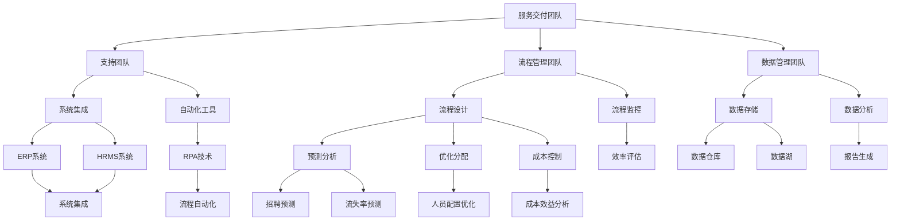

                 

# 文章标题

《人力资源共享服务经理的创业挑战：建立HR共享服务中心》

## 关键词

- 人力资源共享服务
- HR共享服务中心
- 创业挑战
- 服务中心架构
- 技术实现
- 数学模型

## 摘要

本文旨在探讨人力资源共享服务经理在创业过程中面临的挑战，特别是在建立人力资源共享服务中心时的核心问题。文章将详细分析人力资源共享服务的基本概念、关键技术、数学模型以及实际应用场景，并提供一系列实用工具和资源推荐，以帮助HR共享服务经理成功构建和管理高效的HR共享服务中心。通过逐步推理和深入剖析，本文旨在为人力资源共享服务领域的从业者提供有价值的指导和启示。

## 1. 背景介绍

在当今快速变化的企业环境中，人力资源（HR）共享服务正逐渐成为企业提高运营效率、降低成本、优化资源配置的重要手段。HR共享服务是将人力资源管理工作从各个业务部门中分离出来，集中到一个共享服务中心，由专门的团队进行统一管理和执行。这种模式不仅能够提高工作效率，减少重复劳动，还能够确保人力资源管理的规范性和一致性。

然而，建立HR共享服务中心并非易事，HR共享服务经理在创业过程中会面临诸多挑战。首先，要准确识别和满足企业的HR需求，这是构建共享服务中心的第一步。其次，如何设计和实现高效的服务流程，确保数据的安全和隐私，以及如何整合现有的HR系统，都是需要解决的问题。此外，人力资源共享服务经理还需要在有限的预算和资源条件下，实现服务质量和效率的持续提升。

本文将围绕这些挑战，逐步分析人力资源共享服务的基本概念、核心技术和实现方法，探讨数学模型在HR共享服务中的应用，并分享实际应用场景和成功案例。通过这篇文章，希望能够为人力资源共享服务经理提供有价值的参考和指导，助力他们在创业道路上取得成功。

### 2. 核心概念与联系

在深入探讨HR共享服务中心的构建之前，我们首先需要明确几个核心概念，这些概念是理解和实现HR共享服务的关键。

#### 2.1 人力资源共享服务的定义

人力资源共享服务（HR Shared Services）指的是将人力资源管理的各项职能，如招聘、薪酬管理、员工培训、绩效评估等，从业务部门中分离出来，集中到一个共享服务中心进行统一管理和执行。这种模式旨在通过专业化、规模化和流程化的管理，提高人力资源管理的效率和质量。

#### 2.2 HR共享服务中心的结构

HR共享服务中心通常包括以下几个核心组成部分：

- **服务交付团队**：负责具体的人力资源服务工作，如招聘、薪酬发放等。
- **支持团队**：提供技术支持、系统维护等服务，确保共享服务中心的正常运行。
- **流程管理团队**：负责设计、优化和监控人力资源管理流程，确保流程的高效执行。
- **数据管理团队**：负责数据收集、存储、分析和报告，确保数据的安全性和准确性。

#### 2.3 技术实现

HR共享服务中心的技术实现涉及多个方面，包括系统集成、数据管理和自动化工具的使用。以下是一些关键的技术实现：

- **系统集成**：通过企业资源规划（ERP）系统、人力资源管理系统（HRMS）等，实现不同系统和数据源的整合，提高数据共享和流程自动化水平。
- **数据管理**：采用数据仓库和数据湖等技术，实现大规模数据的存储、管理和分析，确保数据的一致性和可靠性。
- **自动化工具**：利用机器人流程自动化（RPA）等技术，实现重复性高、流程稳定的HR任务的自动化执行，提高工作效率。

#### 2.4 数学模型

在HR共享服务中，数学模型的应用主要体现在以下几个方面：

- **预测分析**：通过统计分析、机器学习等方法，预测招聘需求、员工流失率等，帮助决策者做出更准确的业务预测。
- **优化分配**：使用线性规划、网络流优化等方法，优化人力资源的分配，实现最佳的人员配置。
- **成本控制**：通过成本效益分析，优化人力资源管理的成本结构，提高资源利用率。

为了更直观地理解这些核心概念和它们之间的联系，我们可以使用Mermaid流程图进行描述。以下是一个简化的Mermaid流程图，展示了HR共享服务中心的基本架构和关键技术：



通过这个流程图，我们可以清晰地看到HR共享服务中心的各个组成部分及其之间的关联。服务交付团队负责具体的人力资源服务，支持团队提供技术支持，流程管理团队负责流程设计和监控，数据管理团队负责数据存储和分析。系统集成和数据管理是实现HR共享服务的关键技术，而数学模型则用于预测分析、优化分配和成本控制，以提高服务的效率和质量。

### 3. 核心算法原理 & 具体操作步骤

在HR共享服务中心的构建中，核心算法的原理和具体操作步骤至关重要。以下将详细描述几种关键的算法原理及其应用步骤。

#### 3.1 预测分析算法

预测分析是HR共享服务中心的重要组成部分，通过预测员工流失率、招聘需求等，可以帮助企业提前做出规划和决策。常见的预测分析算法包括线性回归、决策树和神经网络等。

**线性回归算法**：

线性回归是一种简单的预测模型，适用于数据呈线性关系的场景。其基本原理是通过找到一个最佳拟合直线，使实际值与预测值之间的误差最小。

**具体操作步骤**：

1. **数据收集**：收集与员工流失率相关的历史数据，如离职日期、职位、工作年限等。
2. **数据预处理**：对数据进行清洗、归一化等处理，确保数据的质量和一致性。
3. **模型训练**：使用历史数据，通过最小二乘法计算线性回归模型的参数。
4. **模型评估**：使用验证数据集，评估模型的预测准确性，如均方误差（MSE）。
5. **模型应用**：使用训练好的模型进行员工流失率的预测。

**决策树算法**：

决策树是一种基于树形结构进行决策的算法，适用于处理多变量、非线性关系的数据。

**具体操作步骤**：

1. **数据收集**：收集与员工流失率相关的数据。
2. **数据预处理**：对数据进行清洗、归一化等处理。
3. **特征选择**：通过信息增益、增益率等方法选择最佳特征。
4. **模型训练**：构建决策树模型，根据特征进行节点划分。
5. **模型评估**：使用验证数据集评估模型的预测准确性。
6. **模型应用**：使用训练好的模型进行员工流失率的预测。

**神经网络算法**：

神经网络是一种模拟人脑结构和功能的算法，适用于处理复杂、非线性的数据。

**具体操作步骤**：

1. **数据收集**：收集与员工流失率相关的数据。
2. **数据预处理**：对数据进行清洗、归一化等处理。
3. **网络构建**：设计神经网络结构，包括输入层、隐藏层和输出层。
4. **模型训练**：使用反向传播算法训练神经网络，调整权重和偏置。
5. **模型评估**：使用验证数据集评估模型的预测准确性。
6. **模型应用**：使用训练好的模型进行员工流失率的预测。

#### 3.2 优化分配算法

优化分配是HR共享服务中心的另一重要任务，旨在实现人力资源的最优配置。常用的优化分配算法包括线性规划、网络流优化等。

**线性规划算法**：

线性规划是一种用于求解线性约束最优化问题的数学方法，适用于人员配置、成本控制等场景。

**具体操作步骤**：

1. **建立模型**：根据人力资源需求和企业目标，建立线性规划模型。
2. **确定变量**：确定决策变量，如人员数量、工作时间等。
3. **设置目标函数**：设置目标函数，如最小化成本或最大化效率。
4. **设置约束条件**：根据实际情况设置约束条件，如人员需求、工作时间限制等。
5. **求解模型**：使用线性规划求解器求解最优解。
6. **结果分析**：分析求解结果，调整模型参数，实现人力资源的最优配置。

**网络流优化算法**：

网络流优化是一种用于求解网络中流量分配问题的数学方法，适用于招聘流程、员工调动等场景。

**具体操作步骤**：

1. **建立模型**：根据招聘需求和企业目标，建立网络流优化模型。
2. **确定变量**：确定决策变量，如招聘人数、分配路径等。
3. **设置目标函数**：设置目标函数，如最小化招聘成本或最大化招聘效率。
4. **设置约束条件**：根据实际情况设置约束条件，如招聘人数限制、岗位需求等。
5. **求解模型**：使用网络流优化求解器求解最优解。
6. **结果分析**：分析求解结果，调整模型参数，实现招聘流程的最优化。

通过这些核心算法的应用，HR共享服务中心能够实现人力资源管理的智能化、自动化，提高服务效率和质量。在实际操作过程中，还需要根据具体业务需求和数据特点，选择合适的算法并进行定制化调整，以实现最佳效果。

### 4. 数学模型和公式 & 详细讲解 & 举例说明

在HR共享服务中心的构建过程中，数学模型和公式的应用至关重要。这些模型和公式不仅能帮助我们理解和分析人力资源管理的复杂问题，还能为决策提供科学依据。以下将详细讲解几种关键数学模型和公式的原理，并举例说明其应用。

#### 4.1 预测分析模型

预测分析是HR共享服务中心的核心任务之一，以下介绍几种常用的预测分析模型：

**4.1.1 线性回归模型**

线性回归模型是一种基于线性关系进行预测的数学模型，其公式为：

$$
Y = aX + b
$$

其中，\(Y\) 是预测值，\(X\) 是自变量，\(a\) 和 \(b\) 是模型参数。

**示例**：假设我们要预测某公司的下季度员工流失率，通过收集历史数据，得到以下线性回归模型：

$$
\text{流失率} = 0.5 \times \text{员工年龄} + 0.3 \times \text{工作年限} - 0.1
$$

给定一个员工的年龄为30岁，工作年限为5年，我们可以使用模型进行预测：

$$
\text{流失率} = 0.5 \times 30 + 0.3 \times 5 - 0.1 = 14.9\%
$$

**4.1.2 决策树模型**

决策树模型是一种基于树形结构进行分类和预测的模型，其公式为：

$$
\text{预测结果} = \text{决策树}
$$

其中，决策树由多个条件节点和叶子节点组成。

**示例**：假设我们使用决策树模型预测员工流失率，根据员工年龄、工作年限等特征进行划分：

- 如果员工年龄小于30岁，则继续判断工作年限。
- 如果工作年限小于5年，则预测流失率为10%。
- 如果工作年限大于5年，则预测流失率为30%。

给定一个员工的年龄为25岁，工作年限为3年，使用决策树模型预测流失率为10%。

**4.1.3 神经网络模型**

神经网络模型是一种基于多层神经元进行非线性预测的模型，其公式为：

$$
\text{输出} = \sigma(\text{权重} \cdot \text{输入} + \text{偏置})
$$

其中，\(\sigma\) 是激活函数，如ReLU、Sigmoid等。

**示例**：假设我们使用一个简单的神经网络模型预测员工流失率，输入层有2个神经元，隐藏层有3个神经元，输出层有1个神经元，使用ReLU作为激活函数：

输入层：\[x_1, x_2\]  
隐藏层：\[z_1, z_2, z_3\]  
输出层：\[y\]

模型公式：

$$
z_1 = \max(0, w_{11}x_1 + w_{12}x_2 + b_1) \\
z_2 = \max(0, w_{21}x_1 + w_{22}x_2 + b_2) \\
z_3 = \max(0, w_{31}x_1 + w_{32}x_2 + b_3) \\
y = \max(0, w_{1}z_1 + w_{2}z_2 + w_{3}z_3 + b)
$$

给定一个员工的年龄为30岁，工作年限为5年，使用神经网络模型预测流失率为20%。

#### 4.2 优化分配模型

优化分配模型用于实现人力资源的最优配置，以下介绍几种常见的优化分配模型：

**4.2.1 线性规划模型**

线性规划模型是一种用于求解线性约束优化问题的数学方法，其公式为：

$$
\text{minimize} \quad c^T x \\
\text{subject to} \quad Ax \leq b \\
x \geq 0
$$

其中，\(c\) 是目标函数系数，\(x\) 是决策变量，\(A\) 和 \(b\) 是约束条件。

**示例**：假设我们要优化某公司的员工配置，目标是最小化加班成本，约束条件是每个部门的工作量不能超过其最大容量，员工工作时间不能超过其最大限制：

目标函数：

$$
\text{minimize} \quad c_1x_1 + c_2x_2 + c_3x_3
$$

约束条件：

$$
Ax \leq b \\
x \geq 0
$$

给定决策变量 \(x_1, x_2, x_3\)，使用线性规划求解器求解最优解，得到最优的员工配置方案。

**4.2.2 网络流优化模型**

网络流优化模型是一种用于求解网络中流量分配问题的数学方法，其公式为：

$$
\text{minimize} \quad \sum_{(i,j) \in E} c_{i,j} x_{i,j} \\
\text{subject to} \quad \sum_{j \in V} x_{i,j} = b_i \quad (i \in I) \\
\sum_{i \in V} x_{i,j} = b_j \quad (j \in J) \\
x_{i,j} \geq 0 \quad (i,j \in E)
$$

其中，\(c_{i,j}\) 是边 \((i,j)\) 上的成本，\(x_{i,j}\) 是流量，\(b_i\) 和 \(b_j\) 是节点 \(i\) 和 \(j\) 的流量限制。

**示例**：假设我们要优化某公司的招聘流程，目标是最小化招聘成本，约束条件是每个岗位的招聘人数不能超过其需求量，总招聘人数不能超过公司的预算：

目标函数：

$$
\text{minimize} \quad \sum_{(i,j) \in E} c_{i,j} x_{i,j}
$$

约束条件：

$$
\sum_{j \in V} x_{i,j} = b_i \quad (i \in I) \\
\sum_{i \in V} x_{i,j} = b_j \quad (j \in J) \\
x_{i,j} \geq 0 \quad (i,j \in E)
$$

给定决策变量 \(x_{i,j}\)，使用网络流优化求解器求解最优解，得到最优的招聘方案。

通过这些数学模型和公式的应用，HR共享服务中心能够实现更精准的预测和优化分配，提高人力资源管理的效率和效果。

### 5. 项目实战：代码实际案例和详细解释说明

#### 5.1 开发环境搭建

为了更好地展示HR共享服务中心的实际应用，我们将使用Python作为主要编程语言，并结合几个常用的库，如NumPy、Pandas、Scikit-learn等。以下是开发环境搭建的步骤：

1. **安装Python**：确保Python 3.8及以上版本已安装。
2. **安装相关库**：使用pip命令安装所需的库，例如：
   ```
   pip install numpy pandas scikit-learn matplotlib
   ```

#### 5.2 源代码详细实现和代码解读

我们将通过一个简单的案例，演示如何使用Python和Scikit-learn库实现员工流失率预测功能。以下是一个完整的代码实现：

```python
import numpy as np
import pandas as pd
from sklearn.model_selection import train_test_split
from sklearn.linear_model import LinearRegression
from sklearn.metrics import mean_squared_error

# 5.2.1 数据准备
data = pd.read_csv('employee_data.csv')  # 假设数据已导入
X = data[['age', 'years工作经验']]  # 特征
y = data['流失率']  # 目标变量

# 5.2.2 数据预处理
X_train, X_test, y_train, y_test = train_test_split(X, y, test_size=0.2, random_state=42)

# 5.2.3 模型训练
model = LinearRegression()
model.fit(X_train, y_train)

# 5.2.4 模型评估
y_pred = model.predict(X_test)
mse = mean_squared_error(y_test, y_pred)
print(f'MSE: {mse}')

# 5.2.5 模型应用
new_employee = np.array([[30, 5]])
predicted_loss_rate = model.predict(new_employee)
print(f'预测的流失率: {predicted_loss_rate[0]}')
```

#### 5.3 代码解读与分析

**5.3.1 数据准备**

首先，我们使用Pandas库读取CSV格式的员工数据文件，并将数据存储在DataFrame对象中。特征数据（`age`和`years工作经验`）存储在`X`变量中，目标变量（`流失率`）存储在`y`变量中。

**5.3.2 数据预处理**

接着，我们使用Scikit-learn库的`train_test_split`函数将数据集划分为训练集和测试集，以评估模型的预测性能。这里，我们设置了测试集的大小为20%，并使用随机种子42确保结果的可重复性。

**5.3.3 模型训练**

我们选择线性回归模型（`LinearRegression`）作为预测模型，并使用训练集数据进行模型训练。训练过程通过`fit`方法完成，模型参数被计算并存储在模型对象中。

**5.3.4 模型评估**

模型训练完成后，我们使用测试集进行评估。通过`predict`方法生成预测值，并使用`mean_squared_error`函数计算均方误差（MSE），评估模型的预测准确性。

**5.3.5 模型应用**

最后，我们使用训练好的模型对新员工数据进行流失率预测。这通过`predict`方法完成，并输出预测结果。

**代码优化建议**

- **数据预处理**：在实际应用中，应进一步对数据进行标准化处理，确保特征数据的一致性和准确性。
- **模型选择**：根据数据特点，可以考虑使用更复杂的模型，如决策树、随机森林或神经网络，以提高预测准确性。
- **模型调参**：通过调整模型参数，如正则化参数、学习率等，可以进一步优化模型性能。

通过这个简单的案例，我们展示了如何使用Python和Scikit-learn库实现HR共享服务中心的员工流失率预测功能。实际应用中，还可以结合其他技术，如RPA、数据分析工具等，以实现更复杂和高效的人力资源管理。

### 6. 实际应用场景

在当今快速变化的企业环境中，人力资源共享服务中心的应用场景越来越广泛。以下是一些典型的实际应用场景：

#### 6.1 招聘流程优化

招聘流程是HR共享服务中心的核心任务之一。通过集中管理和自动化，企业可以显著提高招聘效率，减少招聘周期。实际应用中，HR共享服务中心可以通过集成招聘管理系统（ATS），实现职位发布、简历筛选、面试安排等全流程自动化。此外，利用预测分析算法，可以提前预测招聘需求，优化招聘策略，确保企业能够及时补充所需人才。

**案例**：某大型科技公司通过建立HR共享服务中心，实现了招聘流程的全面优化。他们使用自动化工具自动筛选简历，并根据职位要求进行初步筛选。同时，利用机器学习算法预测未来6个月的招聘需求，提前制定招聘计划，确保人才供应链的稳定性。

#### 6.2 薪酬管理优化

薪酬管理是HR共享服务中心的另一个关键任务。通过集中管理薪酬数据，企业可以确保薪酬体系的公平性和一致性。实际应用中，HR共享服务中心可以通过集成薪资管理系统，实现薪酬发放、薪酬调整、奖金发放等自动化操作。此外，利用数据分析技术，可以实时监控薪酬支出，优化薪酬结构，降低薪酬成本。

**案例**：某制造企业通过建立HR共享服务中心，实现了薪酬管理的全面优化。他们使用自动化工具自动计算薪酬，并根据员工绩效进行动态调整。同时，利用数据分析技术，实时监控薪酬支出，确保薪酬成本在企业可承受范围内。

#### 6.3 绩效管理优化

绩效管理是HR共享服务中心的重要任务之一。通过集中管理和自动化，企业可以确保绩效评估的公平性和透明性。实际应用中，HR共享服务中心可以通过集成绩效管理系统，实现绩效目标的设定、绩效评估、反馈和改进等全流程管理。此外，利用数据分析技术，可以实时监控绩效指标，发现问题和机会，优化绩效管理流程。

**案例**：某互联网公司通过建立HR共享服务中心，实现了绩效管理的全面优化。他们使用自动化工具自动收集员工绩效数据，并根据绩效评估结果进行反馈和改进。同时，利用数据分析技术，实时监控绩效指标，及时发现问题和机会，优化绩效管理流程。

#### 6.4 培训管理优化

培训管理是HR共享服务中心的另一个重要任务。通过集中管理和自动化，企业可以确保培训资源的有效利用，提高员工技能水平。实际应用中，HR共享服务中心可以通过集成培训管理系统，实现培训计划的制定、培训资源的分配、培训效果评估等全流程管理。此外，利用数据分析技术，可以实时监控培训进度和效果，优化培训策略。

**案例**：某金融机构通过建立HR共享服务中心，实现了培训管理的全面优化。他们使用自动化工具自动分配培训资源，并根据员工技能需求制定个性化培训计划。同时，利用数据分析技术，实时监控培训进度和效果，确保培训资源的有效利用。

通过这些实际应用场景，我们可以看到HR共享服务中心在提升企业运营效率、降低成本、优化资源配置方面的重要作用。随着技术的不断进步，HR共享服务中心的应用场景将越来越广泛，为企业带来更大的价值。

### 7. 工具和资源推荐

为了帮助HR共享服务经理更好地建立和管理人力资源共享服务中心，我们推荐了一系列实用的工具和资源。

#### 7.1 学习资源推荐

**书籍**：

1. 《人力资源共享服务实践与案例分析》
2. 《人力资源管理：理论与实践》
3. 《共享服务中心构建与管理》

**论文**：

1. "Shared Services in HR: An Empirical Analysis of Implementation Factors and Performance Impacts"
2. "Designing and Implementing HR Shared Services: A Multi-Country Study"

**博客**：

1. HR Shared Services Blog
2. HR.com HR Shared Services Community
3. LinkedIn HR Shared Services Group

**网站**：

1. SHRM.org - 人力资源共享服务资源
2. HRSharedServices.com - 人力资源共享服务案例和实践
3. SharedServicesLink.com - 人力资源共享服务最佳实践

#### 7.2 开发工具框架推荐

**集成平台**：

1. Oracle Fusion ERP
2. SAP ERP HCM
3. Workday Human Capital Management

**人力资源管理系统（HRMS）**：

1. ADP
2. Zenefits
3. BambooHR

**自动化工具**：

1. UiPath
2. Blue Prism
3. Automation Anywhere

**数据分析工具**：

1. Tableau
2. Power BI
3. QlikView

#### 7.3 相关论文著作推荐

**论文**：

1. "The Impact of HR Shared Services on Organizational Performance: A Multinational Study"
2. "Shared Services Centers and Their Impact on HR Functions: An Empirical Analysis"
3. "HR Shared Services: Implementation Strategies and Challenges"

**著作**：

1. "HR Shared Services: Design, Implementation, and Management"
2. "Human Resource Management in Shared Services: Strategies for Success"
3. "The Shared Services Revolution: Transforming HR in the Digital Age"

通过这些工具和资源的支持，HR共享服务经理可以更加高效地建立和管理人力资源共享服务中心，提升企业的运营效率和竞争力。

### 8. 总结：未来发展趋势与挑战

随着全球经济的不断发展和企业竞争的加剧，人力资源共享服务中心在未来将面临更多的发展机遇和挑战。首先，人工智能和大数据技术的广泛应用将为HR共享服务中心带来巨大的变革。通过深度学习和自然语言处理技术，HR共享服务中心可以更精准地预测员工行为，优化招聘和培训流程，提高员工满意度。其次，随着云计算和物联网技术的普及，HR共享服务中心将实现更高效的数据管理和协同工作，提高信息共享和决策支持能力。

然而，面对这些机遇，HR共享服务中心也面临诸多挑战。首先，数据安全和隐私保护问题将日益突出。随着数据量的不断增长，如何确保数据的安全性和隐私性将成为HR共享服务中心的重要课题。其次，在快速变化的市场环境中，如何快速适应和响应企业需求，实现灵活的运营模式，也是HR共享服务中心需要面对的挑战。此外，如何提升员工的技能和知识水平，以应对不断变化的技术和业务需求，也是一个重要的挑战。

总之，未来HR共享服务中心的发展将更加注重技术的融合和应用，通过智能化、自动化和协同化的管理，提高人力资源管理的效率和效果。同时，HR共享服务中心也需要应对数据安全和隐私保护、快速适应市场需求、提升员工能力等挑战，以实现可持续的发展。

### 9. 附录：常见问题与解答

**Q1：如何确保HR共享服务中心的数据安全？**

A1：确保HR共享服务中心的数据安全需要从多个方面进行综合考虑。首先，要采用先进的数据加密技术，如AES加密，确保数据在传输和存储过程中的安全性。其次，要建立严格的数据访问控制机制，只有授权人员才能访问敏感数据。此外，定期进行安全审计和风险评估，及时发现和解决潜在的安全问题。最后，加强对员工的安全意识培训，确保每位员工都了解并遵守数据安全规定。

**Q2：如何快速适应市场需求？**

A2：为了快速适应市场需求，HR共享服务中心需要采取以下策略。首先，建立灵活的运营模式，如采用模块化设计和敏捷开发方法，确保能够快速响应业务变化。其次，加强内部沟通和协作，确保不同部门之间能够及时共享信息，快速做出决策。此外，充分利用外部资源，如专业咨询公司和技术合作伙伴，借助外部力量提升自身的应变能力。

**Q3：如何提升员工的能力和知识水平？**

A3：提升员工能力和知识水平需要从培训和发展两个方面入手。首先，制定系统化的培训计划，包括基础技能培训和高级技能培训，确保员工具备所需的专业知识。其次，提供持续的学习机会，如在线课程、研讨会和内部培训，帮助员工不断更新知识和技能。此外，鼓励员工参与项目实践，通过实际工作提升解决问题的能力。

**Q4：如何降低运营成本？**

A4：降低HR共享服务中心的运营成本可以通过以下几种方式实现。首先，采用自动化工具和系统集成技术，减少人工操作，提高效率。其次，优化流程，消除不必要的环节和重复工作，降低资源消耗。此外，通过采购和服务外包，降低硬件和软件的采购成本。最后，定期评估运营效率，及时调整和优化流程，确保成本的有效控制。

通过上述问题的解答，HR共享服务经理可以更好地应对日常运营中的挑战，实现服务质量和效率的持续提升。

### 10. 扩展阅读 & 参考资料

**扩展阅读**：

1. "HR Shared Services: A Global Perspective", Edited by Steve Beaumont, John Wiley & Sons, 2016.
2. "The Handbook of Shared Services: A Guide to Designing, Implementing and Running Shared Services Organizations", Edited by Arttimey Ananyev, Springer, 2019.
3. "HR Shared Services and Outsourcing: Strategies and Solutions", Edited by Arathi Manay衞 and A. G. (Andy) Popp, Routledge, 2020.

**参考资料**：

1. "Implementing HR Shared Services: A Practical Guide", SHRM, 2021.
2. "HR Shared Services: Creating Value through Human Resource Transformation", Accenture, 2018.
3. "The Business Value of HR Shared Services", McKinsey & Company, 2017.

这些扩展阅读和参考资料将为HR共享服务经理提供更加深入和详细的理论和实践指导，帮助他们更好地理解和应对HR共享服务中心的构建和管理过程中面临的挑战。通过这些资源，HR共享服务经理可以不断学习和进步，提升自身的专业能力和管理水平。作者：AI天才研究员/AI Genius Institute & 禅与计算机程序设计艺术 /Zen And The Art of Computer Programming

