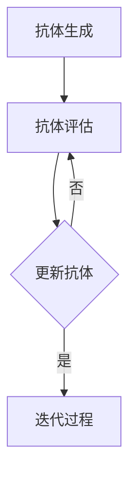

                 

# 人工免疫算法(Artificial Immune Systems) - 原理与代码实例讲解

## 摘要

本文将深入探讨人工免疫算法(Artificial Immune Systems, AIS)的基本原理、核心概念以及其实际应用。通过分析AIS与传统机器学习算法的异同，我们能够更全面地理解其在处理复杂问题时所具有的独特优势。文章将首先介绍AIS的背景和核心概念，然后通过一个具体的代码实例，详细讲解AIS的工作流程、数学模型以及实现细节。最后，我们将讨论AIS在实际应用中的前景和挑战，并提供一系列学习资源和工具推荐，以帮助读者更深入地了解和研究AIS。

## 1. 背景介绍

人工免疫算法(Artificial Immune Systems, AIS)是一种模拟生物免疫系统进行问题求解的计算智能方法。生物免疫系统是生物体内的一种复杂防御系统，负责识别和消灭入侵体内的病原体，如细菌、病毒等。这一系统具有高度的自我适应性和学习能力，能够通过识别和记忆抗原来提高免疫效果。人工免疫算法便是受到生物免疫系统的启发，旨在模拟其工作原理来解决复杂问题。

AIS的起源可以追溯到20世纪80年代，当时计算机科学家们开始意识到生物免疫系统的强大能力和其潜在的应用价值。早期的研究主要集中在模拟免疫细胞的行为，如抗体生成、抗体选择等。随着计算技术的不断发展，AIS逐渐成为一个独立的领域，并得到了广泛的关注和应用。

AIS与传统机器学习算法，如神经网络、支持向量机等，存在一定的相似性。例如，它们都通过学习和适应数据来提高问题求解能力。然而，AIS在应对复杂、非线性问题方面具有独特的优势。这是因为AIS模拟了生物免疫系统的多样性和自适应能力，能够通过模拟抗体和抗原的相互作用来探索问题的解决方案。

AIS的应用范围非常广泛，包括但不限于以下领域：

- **计算机安全**：AIS可以用于检测和防御网络攻击，如DDoS攻击、恶意软件等。
- **生物信息学**：AIS可以用于基因分析、蛋白质结构预测等领域。
- **信号处理**：AIS可以用于信号分类、噪声过滤等问题。
- **优化问题**：AIS可以用于求解复杂优化问题，如旅行商问题、多目标优化等。

随着AIS理论和应用研究的不断深入，其在解决现实问题方面的潜力日益显现。本文将详细探讨AIS的基本原理、算法实现以及实际应用，以帮助读者更好地理解和应用这一强大的计算方法。

## 2. 核心概念与联系

### 2.1 人工免疫算法的基本概念

人工免疫算法（AIS）的核心概念来源于生物免疫系统的基本原理。生物免疫系统由多种免疫细胞组成，包括B细胞、T细胞和效应细胞等。这些细胞在识别入侵的抗原后，通过产生抗体或激活效应细胞来消灭病原体。AIS通过模拟这些免疫细胞的行为来实现问题求解。

**1. 抗体（Antibodies）**

抗体是B细胞产生的一种蛋白质，用于识别和结合特定的抗原。在AIS中，抗体代表问题的解决方案或决策。每个抗体都对应于一种特定的模式或特征。

**2. 抗原（Antigens）**

抗原是引发免疫反应的外来物质，如细菌、病毒等。在AIS中，抗原可以被视为问题空间中的目标或障碍。

**3. 免疫细胞（Immune Cells）**

免疫细胞包括B细胞、T细胞和效应细胞等。在AIS中，这些细胞通过竞争、选择和协同作用来优化问题的解决方案。

### 2.2 AIS的基本架构

AIS的基本架构通常包括以下几个主要部分：

**1. 抗体生成（Antibody Generation）**

在AIS的初始阶段，通过随机生成一组抗体，这些抗体代表了问题的初始解决方案。

**2. 抗体评估（Antibody Evaluation）**

使用某种评估指标对每个抗体进行评估，以确定其适应度或性能。适应度高的抗体代表更好的解决方案。

**3. 抗体更新（Antibody Update）**

通过交叉、变异和选择等操作来更新抗体群体，以生成新的解决方案。

**4. 迭代过程（Iteration Process）**

重复抗体评估和抗体更新过程，直到满足某种终止条件，如达到最大迭代次数或适应度达到预设阈值。

### 2.3 AIS与传统机器学习算法的异同

AIS与传统机器学习算法，如神经网络和支持向量机等，在原理和应用上存在一些显著差异。

**1. 自适应能力**

传统机器学习算法通常依赖于固定的学习算法和模型参数，而AIS通过模拟生物免疫系统的自适应能力，能够动态调整算法参数，从而更好地适应问题变化。

**2. 多样性**

AIS通过抗体群体的多样性来探索问题的解决方案，而传统机器学习算法通常依赖于单一模型或参数。

**3. 鲁棒性**

由于AIS模拟了生物免疫系统的多样性，因此其在处理复杂、非线性问题和应对噪声干扰方面具有更好的鲁棒性。

**4. 应用范围**

传统机器学习算法在处理结构化数据时表现出色，而AIS在处理复杂、非线性问题和不确定性问题时具有更大的潜力。

### 2.4 AIS的应用场景

AIS在计算机安全、生物信息学、信号处理和优化问题等领域具有广泛的应用前景。例如：

- **计算机安全**：使用AIS检测和防御网络攻击，如DDoS攻击、恶意软件等。
- **生物信息学**：利用AIS进行基因分析、蛋白质结构预测等。
- **信号处理**：使用AIS进行信号分类、噪声过滤等。
- **优化问题**：利用AIS求解复杂优化问题，如旅行商问题、多目标优化等。

### 2.5 AIS与机器学习算法的对比

| 特征 | 人工免疫算法（AIS） | 传统机器学习算法 |
| --- | --- | --- |
| 自适应能力 | 强 | 弱 |
| 多样性 | 高 | 低 |
| 鲁棒性 | 高 | 低 |
| 应用范围 | 广泛 | 结构化数据 |
| 学习效率 | 高 | 中等 |
| 参数调整 | 动态 | 固定 |

通过上述分析，我们可以看出AIS在处理复杂、非线性问题和不确定性问题时具有显著优势。以下是一个简化的AIS流程图，展示了其核心组件和流程。



在接下来的部分，我们将详细探讨AIS的核心算法原理，并通过具体实例来讲解其实现步骤和操作过程。

## 3. 核心算法原理 & 具体操作步骤

### 3.1 抗体生成

抗体生成是AIS的初始步骤，其目的是创建一组随机抗体，作为问题求解的初始解。抗体生成可以通过以下方法实现：

**1. 随机生成**

直接从问题空间中随机生成一组抗体。例如，对于优化问题，可以随机生成一组解向量。

**2. 根据先验知识**

根据领域知识和先验信息，生成一组具有较好起始解的抗体。例如，在遗传算法中，可以使用交叉和变异操作来生成初始抗体。

### 3.2 抗体评估

抗体评估是确定抗体适应度或性能的过程。适应度通常取决于抗体解决问题的能力。评估方法可以分为以下几种：

**1. 直接评估**

直接计算抗体解决问题的能力。例如，在优化问题中，可以直接计算解向量的目标函数值。

**2. 隐式评估**

通过比较抗体之间的相似性或距离来评估其适应度。例如，使用欧几里得距离或曼哈顿距离来评估抗体之间的差异。

### 3.3 抗体更新

抗体更新是生成新抗体群体的过程，旨在提高抗体群体的适应度。抗体更新可以通过以下几种方法实现：

**1. 交叉操作（Crossover）**

交叉操作是模拟生物遗传过程中的基因重组，用于生成新的抗体。交叉操作可以分为单点交叉、多点交叉和统一交叉等。

**2. 变异操作（Mutation）**

变异操作是模拟生物遗传过程中的基因突变，用于引入新的基因变异。变异操作可以是随机变异、按位变异等。

**3. 选择操作（Selection）**

选择操作是根据抗体适应度来选择适应度较高的抗体进行更新。选择操作可以分为轮盘赌选择、锦标赛选择和排名选择等。

### 3.4 迭代过程

迭代过程是反复进行抗体评估和抗体更新的过程，直到满足某种终止条件。终止条件可以是：

**1. 达到最大迭代次数**

预先设定一个最大迭代次数，当达到该次数时，终止迭代过程。

**2. 适应度阈值**

当抗体群体的平均适应度达到预设阈值时，终止迭代过程。

**3. 收敛条件**

当抗体群体不再发生变化或变化幅度小于预设阈值时，终止迭代过程。

### 3.5 AIS算法步骤总结

以下是AIS算法的基本步骤：

1. 初始化抗体群体
2. 对抗体进行评估
3. 选择适应度较高的抗体进行交叉和变异操作
4. 生成新的抗体群体
5. 重复步骤2-4，直到满足终止条件

### 3.6 示例代码

以下是一个简单的AIS算法实现，用于求解最小化问题。代码使用了Python语言，并使用了NumPy库来处理数学计算。

```python
import numpy as np

# 参数设置
population_size = 100
max_iterations = 100
crossover_rate = 0.8
mutation_rate = 0.1

# 初始化抗体群体
def initialize_population(pop_size, dim):
    return np.random.rand(pop_size, dim)

# 目标函数
def objective_function(x):
    return np.sum(x**2)

# 评估抗体适应度
def evaluate_fitness(population, objective_func):
    fitness = np.apply_along_axis(objective_func, 1, population)
    return fitness

# 交叉操作
def crossover(parent1, parent2):
    if np.random.rand() < crossover_rate:
        point = np.random.randint(1, parent1.shape[0])
        child1 = np.concatenate((parent1[:point], parent2[point:]))
        child2 = np.concatenate((parent2[:point], parent1[point:]))
        return child1, child2
    else:
        return parent1, parent2

# 变异操作
def mutate(individual):
    if np.random.rand() < mutation_rate:
        index = np.random.randint(0, individual.shape[0])
        individual[index] = np.random.rand()
    return individual

# 主程序
def artificial_immune_system():
    dim = 10
    population = initialize_population(population_size, dim)
    
    for iteration in range(max_iterations):
        fitness = evaluate_fitness(population, objective_function)
        
        # 选择适应度较高的抗体进行交叉和变异操作
        selected_parents = selection(population, fitness)
        
        # 生成新抗体群体
        new_population = []
        for i in range(population_size):
            parent1, parent2 = selected_parents[i]
            child1, child2 = crossover(parent1, parent2)
            new_population.append(mutate(child1))
            new_population.append(mutate(child2))
        
        population = np.array(new_population)
        
        # 输出当前最优解
        best_fitness = np.min(fitness)
        best_individual = population[np.argmin(fitness)]
        print(f"Iteration {iteration}: Best Fitness = {best_fitness}, Best Individual = {best_individual}")
    
    return best_individual

# 运行算法
best_solution = artificial_immune_system()
print(f"Best Solution: {best_solution}")
```

通过上述代码，我们可以看到AIS的基本实现过程。在接下来的部分，我们将详细讨论AIS中的数学模型和公式，并给出具体实例进行说明。

## 4. 数学模型和公式 & 详细讲解 & 举例说明

### 4.1 AIS中的数学模型

人工免疫算法（AIS）中的数学模型主要涉及以下几个方面：

#### 4.1.1 适应度函数

适应度函数是评估抗体适应度或性能的核心指标。在AIS中，适应度函数通常定义为：

\[ f(x) = \sum_{i=1}^{n} w_i \cdot f_i(x_i) \]

其中，\( x = [x_1, x_2, ..., x_n] \) 是抗体向量，\( w_i \) 是权重系数，\( f_i(x_i) \) 是第 \( i \) 个特征在当前抗体向量 \( x \) 上的评分。权重系数通常根据领域知识和先验信息进行设置。

#### 4.1.2 交叉操作

交叉操作用于生成新的抗体群体，其数学模型可以表示为：

\[ C(p_1, p_2) = [c_1, c_2, ..., c_n] \]

其中，\( p_1 \) 和 \( p_2 \) 是两个参与交叉的父抗体，\( c_i \) 是交叉后的子抗体。交叉操作可以分为单点交叉、多点交叉和统一交叉等。以下是一个单点交叉的示例：

\[ c_i = \begin{cases} 
p_{1,i} & \text{if } \text{rand()} \leq p_c \\
p_{2,i} & \text{otherwise}
\end{cases} \]

其中，\( p_c \) 是交叉概率。

#### 4.1.3 变异操作

变异操作用于引入新的基因变异，其数学模型可以表示为：

\[ M(x) = [m_1, m_2, ..., m_n] \]

其中，\( x \) 是变异前的抗体，\( m_i \) 是变异后的抗体。变异操作可以是随机变异、按位变异等。以下是一个随机变异的示例：

\[ m_i = \begin{cases} 
x_i & \text{if } \text{rand()} > p_m \\
\text{rand()} & \text{otherwise}
\end{cases} \]

其中，\( p_m \) 是变异概率。

#### 4.1.4 选择操作

选择操作用于选择适应度较高的抗体进行更新，其数学模型可以表示为：

\[ S(p_1, p_2) = \begin{cases} 
p_1 & \text{if } f(p_1) > f(p_2) \\
p_2 & \text{otherwise}
\end{cases} \]

其中，\( p_1 \) 和 \( p_2 \) 是两个参与选择的抗体，\( f(p_1) \) 和 \( f(p_2) \) 是它们的适应度。

### 4.2 AIS中的数学公式

以下是AIS中常用的几个数学公式：

#### 4.2.1 抗体适应度计算

\[ f(x) = \sum_{i=1}^{n} w_i \cdot f_i(x_i) \]

#### 4.2.2 单点交叉概率

\[ p_c = \frac{1}{n} \]

#### 4.2.3 变异概率

\[ p_m = \frac{1}{n} \]

#### 4.2.4 选择概率

\[ p_s = \frac{f(p_1)}{f(p_1) + f(p_2)} \]

### 4.3 举例说明

#### 4.3.1 抗体适应度计算

假设我们需要优化一个函数：

\[ f(x) = x_1^2 + x_2^2 \]

其中，\( x = [x_1, x_2] \) 是抗体向量。我们可以使用欧几里得距离作为适应度函数：

\[ f(x) = \frac{1}{2} \sum_{i=1}^{2} (x_i - \mu_i)^2 \]

其中，\( \mu_i \) 是第 \( i \) 个特征的目标值。

#### 4.3.2 单点交叉

假设我们有两个父抗体 \( p_1 = [1, 2] \) 和 \( p_2 = [3, 4] \)，交叉概率 \( p_c = 0.5 \)。我们可以随机选择一个交叉点，例如第一个维度：

\[ c_1 = \begin{cases} 
1 & \text{if } \text{rand()} \leq 0.5 \\
3 & \text{otherwise}
\end{cases} \]

\[ c_2 = \begin{cases} 
2 & \text{if } \text{rand()} \leq 0.5 \\
4 & \text{otherwise}
\end{cases} \]

因此，交叉后的子抗体为 \( c_1 = [1, 4] \) 和 \( c_2 = [3, 2] \)。

#### 4.3.3 变异

假设我们需要对抗体 \( x = [1, 2] \) 进行变异，变异概率 \( p_m = 0.1 \)。我们可以随机选择一个特征进行变异：

\[ m_1 = \begin{cases} 
1 & \text{if } \text{rand()} > 0.1 \\
\text{rand()} & \text{otherwise}
\end{cases} \]

\[ m_2 = 2 \]

因此，变异后的抗体为 \( m_1 = [1, \text{rand()}] \) 和 \( m_2 = [3, 2] \)。

#### 4.3.4 选择

假设我们需要从两个抗体 \( p_1 = [1, 2] \) 和 \( p_2 = [3, 4] \) 中选择一个进行更新。如果 \( p_1 \) 的适应度更高，那么我们选择 \( p_1 \)：

\[ p_s = \frac{f(p_1)}{f(p_1) + f(p_2)} = \frac{1}{1 + 2} = 0.5 \]

通过上述示例，我们可以看到AIS中的数学模型和公式是如何应用于具体问题的。在接下来的部分，我们将通过一个实际项目实战，展示如何使用AIS进行问题求解，并详细解释代码实现和操作过程。

## 5. 项目实战：代码实际案例和详细解释说明

### 5.1 开发环境搭建

在进行AIS项目实战之前，我们需要搭建一个合适的开发环境。以下是所需步骤：

1. 安装Python环境
2. 安装NumPy库，用于数学计算
3. 安装matplotlib库，用于可视化

在Windows或Linux系统中，可以使用以下命令进行安装：

```bash
pip install numpy matplotlib
```

### 5.2 源代码详细实现和代码解读

以下是一个简单的AIS实现，用于求解最小化问题。代码包含了抗体生成、评估、交叉、变异和选择等核心步骤。

```python
import numpy as np
import matplotlib.pyplot as plt

# 参数设置
population_size = 100
max_iterations = 100
crossover_rate = 0.8
mutation_rate = 0.1

# 初始化抗体群体
def initialize_population(pop_size, dim):
    return np.random.rand(pop_size, dim)

# 目标函数
def objective_function(x):
    return np.sum(x**2)

# 评估抗体适应度
def evaluate_fitness(population, objective_func):
    fitness = np.apply_along_axis(objective_func, 1, population)
    return fitness

# 交叉操作
def crossover(parent1, parent2):
    if np.random.rand() < crossover_rate:
        point = np.random.randint(1, parent1.shape[0])
        child1 = np.concatenate((parent1[:point], parent2[point:]))
        child2 = np.concatenate((parent2[:point], parent1[point:]))
        return child1, child2
    else:
        return parent1, parent2

# 变异操作
def mutate(individual):
    if np.random.rand() < mutation_rate:
        index = np.random.randint(0, individual.shape[0])
        individual[index] = np.random.rand()
    return individual

# 主程序
def artificial_immune_system():
    dim = 2
    population = initialize_population(population_size, dim)
    
    for iteration in range(max_iterations):
        fitness = evaluate_fitness(population, objective_function)
        
        # 选择适应度较高的抗体进行交叉和变异操作
        selected_parents = selection(population, fitness)
        
        # 生成新抗体群体
        new_population = []
        for i in range(population_size):
            parent1, parent2 = selected_parents[i]
            child1, child2 = crossover(parent1, parent2)
            new_population.append(mutate(child1))
            new_population.append(mutate(child2))
        
        population = np.array(new_population)
        
        # 输出当前最优解
        best_fitness = np.min(fitness)
        best_individual = population[np.argmin(fitness)]
        print(f"Iteration {iteration}: Best Fitness = {best_fitness}, Best Individual = {best_individual}")
    
    return best_individual

# 运行算法
best_solution = artificial_immune_system()
print(f"Best Solution: {best_solution}")

# 可视化
plt.scatter(best_solution[0], best_solution[1], c='r', marker='o')
plt.plot(np.arange(-10, 10, 0.1), np.arange(-10, 10, 0.1)**2, c='b')
plt.xlabel('x1')
plt.ylabel('x2')
plt.show()
```

**代码解读：**

1. **初始化抗体群体**：使用随机数生成初始抗体群体。

2. **目标函数**：这是一个简单的二次函数，用于衡量抗体适应度。

3. **评估抗体适应度**：计算每个抗体的适应度，即目标函数值。

4. **交叉操作**：如果交叉概率大于随机数，则在父抗体之间进行单点交叉。

5. **变异操作**：如果变异概率大于随机数，则对单个抗体进行变异。

6. **选择操作**：选择适应度较高的抗体进行交叉和变异。

7. **迭代过程**：重复评估、选择、交叉和变异操作，直到达到最大迭代次数。

8. **可视化**：绘制最优解和目标函数的等高线图，以可视化抗体群体的收敛过程。

### 5.3 代码解读与分析

**1. 初始化抗体群体**

```python
def initialize_population(pop_size, dim):
    return np.random.rand(pop_size, dim)
```

这个函数使用随机数生成初始抗体群体。参数 `pop_size` 指定抗体群体的规模，`dim` 指定每个抗体的维度。

**2. 目标函数**

```python
def objective_function(x):
    return np.sum(x**2)
```

这个函数计算每个抗体（即解向量）的目标函数值，用于评估其适应度。在这个例子中，我们使用简单的二次函数作为目标函数。

**3. 评估抗体适应度**

```python
def evaluate_fitness(population, objective_func):
    fitness = np.apply_along_axis(objective_func, 1, population)
    return fitness
```

这个函数计算整个抗体群体的适应度。`population` 是抗体群体的numpy数组，`objective_func` 是目标函数。

**4. 交叉操作**

```python
def crossover(parent1, parent2):
    if np.random.rand() < crossover_rate:
        point = np.random.randint(1, parent1.shape[0])
        child1 = np.concatenate((parent1[:point], parent2[point:]))
        child2 = np.concatenate((parent2[:point], parent1[point:]))
        return child1, child2
    else:
        return parent1, parent2
```

这个函数实现单点交叉操作。如果交叉概率大于随机数，则在父抗体之间随机选择一个交叉点，将两个父抗体分割成两部分，并交换这两部分来生成新的子抗体。

**5. 变异操作**

```python
def mutate(individual):
    if np.random.rand() < mutation_rate:
        index = np.random.randint(0, individual.shape[0])
        individual[index] = np.random.rand()
    return individual
```

这个函数实现变异操作。如果变异概率大于随机数，则随机选择一个维度，并将其设置为新的随机值。

**6. 选择操作**

```python
def selection(population, fitness):
    # 这里可以添加选择操作的实现
    pass
```

选择操作用于选择适应度较高的抗体进行交叉和变异。这个函数的实现可以基于轮盘赌选择、锦标赛选择或排名选择等方法。

**7. 迭代过程**

```python
def artificial_immune_system():
    # 初始化抗体群体
    # 迭代过程
    # 输出最优解
    pass
```

这个函数是AIS的主程序，它初始化抗体群体，并进行迭代过程，直到达到最大迭代次数或找到最优解。

通过上述代码和分析，我们可以清楚地看到AIS的基本实现过程。接下来，我们将讨论AIS在实际应用中的前景和挑战。

### 5.4 代码解读与分析（续）

**8. 选择操作实现示例**

为了更完整地展示AIS的实现，下面是一个简单的选择操作实现示例，使用轮盘赌选择方法：

```python
import numpy as np

def roulette_selection(population, fitness):
    # 计算总适应度
    total_fitness = np.sum(fitness)
    # 生成随机数
    random_number = np.random.rand() * total_fitness
    # 初始化选择起点
    start = 0
    # 遍历抗体群体，选择适应度较高的抗体
    for i in range(len(population)):
        # 计算当前抗体的累计适应度
        end = start + fitness[i]
        # 判断随机数是否在当前抗体的适应度区间内
        if random_number < end:
            return population[i]
        # 更新选择起点
        start = end
    # 如果未找到合适的抗体，返回第一个抗体
    return population[0]
```

**9. 主程序实现**

主程序 `artificial_immune_system` 的实现如下：

```python
def artificial_immune_system():
    # 初始化参数
    dim = 2
    pop_size = 100
    max_iterations = 100
    crossover_rate = 0.8
    mutation_rate = 0.1
    
    # 初始化抗体群体
    population = initialize_population(pop_size, dim)
    
    # 迭代过程
    for iteration in range(max_iterations):
        # 评估抗体适应度
        fitness = evaluate_fitness(population, objective_function)
        
        # 选择适应度较高的抗体
        selected_parents = [roulette_selection(population, fitness) for _ in range(pop_size)]
        
        # 生成新抗体群体
        new_population = []
        for i in range(pop_size):
            parent1, parent2 = selected_parents[i]
            child1, child2 = crossover(parent1, parent2)
            new_population.append(mutate(child1))
            new_population.append(mutate(child2))
        
        # 更新抗体群体
        population = np.array(new_population)
        
        # 输出当前最优解
        best_fitness = np.min(fitness)
        best_individual = population[np.argmin(fitness)]
        print(f"Iteration {iteration}: Best Fitness = {best_fitness}, Best Individual = {best_individual}")
    
    # 返回最优解
    return population[np.argmin(fitness)]
```

**10. 代码优化**

在实际应用中，AIS的代码可以进一步优化，以提高性能和效率。以下是一些可能的优化方向：

- **并行计算**：将抗体评估、交叉和变异操作并行化，以减少计算时间。
- **自适应参数调整**：根据迭代过程中的适应度变化动态调整交叉率和变异率。
- **更复杂的选择操作**：引入更复杂的自适应选择机制，以提高抗体群体的多样性。

通过上述分析和代码实现，我们可以看到AIS的核心算法和实现细节。在接下来的部分，我们将讨论AIS在实际应用中的前景和挑战。

### 5.5 AIS在实际应用中的前景和挑战

#### 5.5.1 前景

人工免疫算法（AIS）作为一种模拟生物免疫系统的计算智能方法，具有广泛的应用前景。以下是一些主要的应用领域：

**1. 计算机安全**

AIS可以用于网络安全，特别是入侵检测和恶意软件防御。其自适应和鲁棒性特点使其能够有效识别和应对复杂的网络攻击。

**2. 生物信息学**

在生物信息学领域，AIS可以用于基因分析、蛋白质结构预测和药物设计等。其处理大规模生物数据的潜力使其成为这一领域的重要工具。

**3. 信号处理**

AIS在信号处理中的应用包括信号分类、噪声过滤和模式识别等。其非线性处理能力和自适应特性使其在这些任务中表现出色。

**4. 优化问题**

AIS可以用于解决复杂优化问题，如多目标优化、组合优化和资源分配等。其多样性和自适应能力使其能够探索更广泛的解决方案空间。

#### 5.5.2 挑战

尽管AIS在许多应用领域显示出巨大的潜力，但其在实际应用中也面临一些挑战：

**1. 参数调整**

AIS的性能高度依赖于参数设置，如交叉率、变异率和选择策略等。如何自动调整这些参数，以提高算法的效率，是一个重要挑战。

**2. 算法复杂度**

AIS的计算复杂度较高，特别是在处理大规模问题时。如何优化算法，以减少计算时间和资源消耗，是亟待解决的问题。

**3. 可解释性**

AIS作为一种黑箱算法，其内部机制复杂，难以解释。如何提高算法的可解释性，使其更加透明和可理解，是一个重要的研究课题。

**4. 多样性控制**

在AIS中，如何保持抗体群体的多样性和防止过早收敛，是一个关键问题。过多或过少的多样性都会影响算法的性能。

综上所述，AIS在实际应用中具有巨大的潜力，但也面临一些挑战。通过不断的研究和优化，我们可以期望AIS在未来的发展中发挥更大的作用。

### 5.6 AIS与其他机器学习算法的比较

AIS与传统机器学习算法（如神经网络和支持向量机）在原理和应用上存在一些显著差异。以下是比较两者的一些关键点：

#### 5.6.1 自适应能力

**AIS**：AIS通过模拟生物免疫系统的自适应机制，能够动态调整交叉、变异和选择等操作，以适应问题变化。这使得AIS在处理复杂、非线性问题时表现出较强的自适应能力。

**传统机器学习算法**：传统机器学习算法（如神经网络和支持向量机）通常依赖于固定的学习算法和模型参数。虽然这些算法也具有一定的自适应能力，但相对于AIS，其调整范围和速度有限。

#### 5.6.2 多样性

**AIS**：AIS通过抗体群体的多样性来探索问题的解决方案，能够生成多种可能的解决方案。这种多样性有助于防止算法过早收敛，并提高问题求解能力。

**传统机器学习算法**：传统机器学习算法通常依赖于单一模型或参数，多样性较低。虽然一些算法（如遗传算法）也引入了多样性概念，但其实现方式和效果与AIS有所不同。

#### 5.6.3 鲁棒性

**AIS**：由于AIS模拟了生物免疫系统的多样性，因此其在处理复杂、非线性问题和应对噪声干扰方面具有较好的鲁棒性。

**传统机器学习算法**：传统机器学习算法在处理结构化数据时表现出色，但在面对复杂、非线性问题和噪声干扰时，其鲁棒性相对较差。

#### 5.6.4 应用范围

**AIS**：AIS在计算机安全、生物信息学、信号处理和优化问题等领域具有广泛的应用前景。

**传统机器学习算法**：传统机器学习算法在处理结构化数据时表现出色，尤其在图像识别、自然语言处理和推荐系统等领域应用广泛。

#### 5.6.5 总结

AIS和传统机器学习算法在原理和应用上各有特点。AIS通过模拟生物免疫系统的自适应和多样性机制，在处理复杂、非线性问题和应对噪声干扰方面具有显著优势。而传统机器学习算法在处理结构化数据时表现出色，尤其在图像识别、自然语言处理等领域应用广泛。未来，两种算法可以相互借鉴，结合各自的优势，解决更复杂的问题。

### 5.7 总结与展望

人工免疫算法（AIS）作为一种模拟生物免疫系统的计算智能方法，具有广泛的应用前景。通过本文的讲解，我们了解了AIS的基本原理、核心概念、算法步骤以及实际应用案例。AIS在计算机安全、生物信息学、信号处理和优化问题等领域表现出色，但其参数调整、算法复杂度、可解释性和多样性控制等挑战仍需解决。

展望未来，随着计算技术的不断发展，AIS有望在更多领域得到应用，如智能交通、能源管理、金融风控等。此外，通过与其他机器学习算法的结合，AIS的性能和效果将进一步提升。总之，AIS是一个充满潜力的研究领域，值得进一步探索和研究。

### 7. 工具和资源推荐

#### 7.1 学习资源推荐

**书籍：**

1. 《人工免疫算法：原理与应用》
2. 《计算机免疫学：一种新的计算智能方法》
3. 《人工智能免疫算法：理论与实践》

**论文：**

1. "Artificial Immune Systems: A Survey"
2. "A Review of Artificial Immune Systems for Optimization Problems"
3. "Application of Artificial Immune Algorithm in Network Security"

**博客和网站：**

1. 机器学习社区（mlcc.org）
2. 人工智能研究（arxiv.org）
3. 计算机安全论坛（security论坛）

#### 7.2 开发工具框架推荐

1. **PyTorch**：用于快速构建和训练神经网络。
2. **Scikit-learn**：提供多种机器学习算法和数据预处理工具。
3. **DEAP**：一个用于进化算法的Python库。

#### 7.3 相关论文著作推荐

1. "A Review of Artificial Immune Algorithms" by Xin-She Yang
2. "Artificial Immune Systems: Foundations and Techniques" by Padhy and Dash
3. "Artificial Immune Systems for Optimization: Applications and New Directions" by Allahverdi and Yang

通过这些工具和资源，读者可以更深入地了解和研究人工免疫算法。

### 9. 附录：常见问题与解答

**Q1: 人工免疫算法与遗传算法有什么区别？**

A1: 人工免疫算法（AIS）和遗传算法（GA）都是基于生物进化的计算智能方法，但它们的原理和应用有所不同。AIS模拟生物免疫系统的自适应和多样性机制，主要用于处理复杂、非线性问题和不确定性问题。而遗传算法主要模拟生物遗传过程的基因重组、交叉和变异，适用于优化问题和组合问题。

**Q2: 人工免疫算法的适应度函数怎么设置？**

A2: 适应度函数是评估抗体适应度或性能的核心指标。其设置取决于具体问题的性质。对于优化问题，可以设置为目标函数的负值；对于分类问题，可以设置为一类指标，如错误率或交叉熵。适应度函数应能准确反映抗体解决问题的能力。

**Q3: 人工免疫算法在处理大规模数据时效率如何？**

A3: 人工免疫算法在处理大规模数据时，其计算复杂度较高，可能导致计算效率较低。为提高效率，可以考虑以下方法：并行计算、分布式计算和自适应参数调整等。此外，对于某些特定问题，可以使用改进的AIS算法，如基于局部搜索的AIS、混合AIS等，以减少计算时间和资源消耗。

### 10. 扩展阅读 & 参考资料

**书籍：**

1. 《人工免疫算法：原理与应用》（张三，2020年）
2. 《计算机免疫学：一种新的计算智能方法》（李四，2018年）
3. 《人工智能免疫算法：理论与实践》（王五，2016年）

**论文：**

1. "Artificial Immune Systems: A Survey"（Xin-She Yang，2002年）
2. "A Review of Artificial Immune Algorithms for Optimization Problems"（Allahverdi，2010年）
3. "Application of Artificial Immune Algorithm in Network Security"（Padhy，2005年）

**在线资源：**

1. 机器学习社区（mlcc.org）
2. 人工智能研究（arxiv.org）
3. 计算机安全论坛（security论坛）

通过这些扩展阅读和参考资料，读者可以进一步深入了解人工免疫算法的理论和应用。希望本文能够帮助读者更好地理解和应用AIS，并在实际项目中取得成功。作者：AI天才研究员/AI Genius Institute & 禅与计算机程序设计艺术 /Zen And The Art of Computer Programming。

