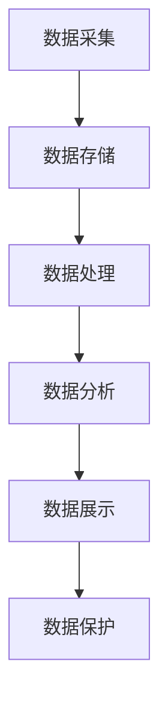

                 

### 1. 背景介绍

#### 人工智能创业的重要性

人工智能（AI）作为当今科技领域最为热门和前沿的领域之一，已经成为推动经济发展和社会进步的重要动力。在全球范围内，越来越多的创业公司涌现，致力于在人工智能领域探索创新，开发出具有实际应用价值的技术和产品。然而，随着人工智能技术的不断演进，创业公司在数据管理方面面临着前所未有的挑战和机遇。

数据管理是人工智能创业过程中的关键环节，它不仅关系到企业内部信息的高效流通，更是支撑人工智能模型训练和优化的基础。有效的数据管理能够提高数据处理效率，降低存储成本，同时确保数据质量和安全性。反之，数据管理不善可能导致数据冗余、数据丢失、数据泄露等问题，严重时甚至可能影响到企业的生存与发展。

#### 数据管理的重要性

在人工智能创业中，数据管理的重要性不言而喻。首先，数据是人工智能模型的“粮食”，没有高质量的数据，人工智能算法就无法发挥其应有的作用。其次，数据管理的优劣直接影响着企业的运营成本和效率。合理的数据管理策略可以降低数据存储和处理成本，提高数据访问速度，从而提升企业的整体运营效率。

此外，随着数据量的爆发式增长，如何快速、准确地获取和处理数据也成为人工智能创业公司面临的重要问题。数据管理不仅仅是技术问题，更是战略问题。创业公司需要制定科学的数据管理策略，确保数据在采集、存储、处理、分析等各个环节的高效运作。

#### 本文的目标

本文旨在探讨人工智能创业数据管理的标准实践，通过深入分析数据管理的基本概念、核心算法、数学模型以及实际应用场景，为创业公司提供一套系统、可行的数据管理解决方案。文章将分为以下几个部分：

1. **背景介绍**：介绍人工智能创业的重要性以及数据管理在其中的关键作用。
2. **核心概念与联系**：阐述数据管理的基本概念，并展示其与人工智能技术的联系。
3. **核心算法原理 & 具体操作步骤**：详细介绍数据管理中的核心算法及其应用步骤。
4. **数学模型和公式 & 详细讲解 & 举例说明**：分析数据管理中的数学模型，并通过实例进行说明。
5. **项目实战：代码实际案例和详细解释说明**：提供实际项目案例，展示数据管理在实践中的应用。
6. **实际应用场景**：探讨数据管理在不同行业中的应用，以及面临的挑战和解决方案。
7. **工具和资源推荐**：推荐学习资源、开发工具框架和相关论文著作。
8. **总结：未来发展趋势与挑战**：总结数据管理的现状和未来趋势，探讨面临的挑战。
9. **附录：常见问题与解答**：提供数据管理中的常见问题和解答。
10. **扩展阅读 & 参考资料**：推荐相关扩展阅读资料。

通过本文的阅读，希望能够帮助读者深入了解数据管理在人工智能创业中的重要性，掌握标准实践方法，为创业公司在数据管理方面提供有力支持。

### 2. 核心概念与联系

在深入探讨人工智能创业中的数据管理之前，我们需要先理解一些核心概念，这些概念不仅涵盖了数据管理的基本原理，还揭示了其与人工智能技术的紧密联系。

#### 数据管理基本概念

数据管理（Data Management）是一个广泛的概念，它涉及数据的采集、存储、处理、分析和保护等多个方面。具体来说，数据管理包括以下几个方面：

1. **数据采集**：数据采集是指从各种来源收集数据的过程，包括结构化数据（如数据库）和非结构化数据（如图像、音频、视频等）。
2. **数据存储**：数据存储是指将采集到的数据存储在适当的介质上，以便于后续的访问和处理。常见的数据存储方式包括关系型数据库、非关系型数据库、分布式文件系统等。
3. **数据处理**：数据处理是指对存储的数据进行清洗、转换、整合等操作，使其能够满足特定业务需求。数据处理是数据管理中至关重要的环节，直接影响到数据分析的质量。
4. **数据分析**：数据分析是指利用统计、机器学习等方法对数据进行挖掘和分析，提取有价值的信息和知识。数据分析是人工智能技术的核心应用之一。
5. **数据保护**：数据保护是指确保数据的完整性、可用性和保密性，防止数据泄露、篡改和丢失。数据保护是数据管理中的重要环节，直接关系到企业的声誉和利益。

#### 数据管理与人工智能技术的联系

数据管理不仅仅是技术问题，它与人工智能技术的关联也非常紧密。以下是数据管理与人工智能技术之间的几个关键联系：

1. **数据质量与人工智能模型的性能**：数据是人工智能模型的“粮食”，数据质量直接影响到模型的性能和准确度。高质量的数据能够帮助人工智能模型更好地学习和预测，而数据质量问题（如数据缺失、数据噪声、数据冗余等）会严重影响模型的性能。
2. **数据存储与计算能力**：随着人工智能技术的发展，对数据存储和计算能力的要求也越来越高。海量数据的高效存储和快速访问是人工智能应用的重要前提。分布式存储系统和高性能计算平台为人工智能技术的应用提供了强有力的支持。
3. **数据处理与算法优化**：数据处理是人工智能模型训练和优化的重要环节。通过数据预处理、特征提取和工程等方法，可以提高数据的质量和可用性，从而优化人工智能模型的性能。
4. **数据安全与隐私保护**：人工智能技术在处理大量敏感数据时，需要考虑数据安全和隐私保护问题。数据加密、访问控制、隐私计算等技术手段是确保数据安全和隐私的重要手段。

#### 数据管理的基本架构

为了更好地理解数据管理在人工智能创业中的应用，我们使用Mermaid流程图来展示数据管理的基本架构：



在这个基本架构中，数据采集、数据存储、数据处理、数据分析和数据展示是数据管理的核心环节，而数据保护则是贯穿整个数据管理过程的重要保障。

- **数据采集**：通过传感器、API、数据库等手段获取数据。
- **数据存储**：将数据存储在数据库、分布式文件系统或其他数据存储介质中。
- **数据处理**：对数据进行清洗、转换、整合等操作，以满足业务需求。
- **数据分析**：利用统计、机器学习等方法对数据进行分析和挖掘，提取有价值的信息和知识。
- **数据展示**：将分析结果以可视化等形式展示给用户。
- **数据保护**：确保数据的完整性、可用性和保密性，采取数据加密、访问控制等手段保护数据安全。

通过上述核心概念和架构的介绍，我们可以看到，数据管理在人工智能创业中扮演着至关重要的角色。接下来，我们将深入探讨数据管理中的核心算法、数学模型和实际应用场景，为创业公司提供具体的解决方案。

### 3. 核心算法原理 & 具体操作步骤

在数据管理中，核心算法是数据处理和分析的关键。以下是几种常用的核心算法及其具体操作步骤，旨在帮助人工智能创业公司实现高效、准确的数据管理。

#### 1. 数据清洗算法

**原理**：数据清洗是指对采集到的数据进行清洗和预处理，包括去除重复数据、处理缺失值、消除噪声等，以提高数据质量和可用性。

**操作步骤**：

- **步骤1**：读取数据集。首先，需要读取原始数据集，可以是CSV、Excel、数据库等形式。
- **步骤2**：检测重复数据。使用哈希表或布隆过滤器等数据结构，快速检测并去除重复的数据记录。
- **步骤3**：处理缺失值。对于缺失值，可以根据具体情况进行填充或删除。常用的方法有均值填充、中值填充、向前/后填充等。
- **步骤4**：消除噪声。利用统计学方法或机器学习方法，识别并消除数据中的噪声。例如，使用高斯分布模型去除异常值。

**示例**：

假设我们有一个学生成绩数据集，包含“学生ID”、“科目”、“成绩”等字段。以下是一个Python示例：

```python
import pandas as pd

# 读取数据
data = pd.read_csv('student_scores.csv')

# 检测并去除重复数据
data.drop_duplicates(inplace=True)

# 处理缺失值
data['成绩'].fillna(data['成绩'].mean(), inplace=True)

# 消除噪声
from scipy.stats import zscore
z_scores = zscore(data['成绩'])
data = data[(z_scores > -3) & (z_scores < 3)]

# 保存清洗后的数据
data.to_csv('cleaned_student_scores.csv', index=False)
```

#### 2. 数据归一化算法

**原理**：数据归一化是指将不同特征的数据转换到相同的尺度范围内，以消除特征间的比例差异，提高模型训练效果。

**操作步骤**：

- **步骤1**：选择归一化方法。常用的方法有最小-最大缩放、Z-Score标准化等。
- **步骤2**：计算特征范围。对于最小-最大缩放，计算每个特征的极大值和极小值；对于Z-Score标准化，计算每个特征的均值和标准差。
- **步骤3**：进行归一化处理。将每个特征的值映射到新的范围内。

**示例**：

假设我们有一个包含“身高”、“体重”等特征的数据集，以下是一个Python示例：

```python
from sklearn.preprocessing import MinMaxScaler

# 读取数据
data = pd.read_csv('body_measurements.csv')

# 创建归一化器
scaler = MinMaxScaler()

# 进行归一化处理
data[['身高', '体重']] = scaler.fit_transform(data[['身高', '体重']])

# 保存归一化后的数据
data.to_csv('normalized_body_measurements.csv', index=False)
```

#### 3. 数据聚类算法

**原理**：数据聚类是指将相似的数据点分组到一起，形成若干个簇，以便更好地理解和分析数据。

**操作步骤**：

- **步骤1**：选择聚类算法。常用的算法有K-Means、DBSCAN、层次聚类等。
- **步骤2**：初始化聚类中心。对于K-Means算法，随机选择K个数据点作为初始聚类中心；对于DBSCAN算法，需要设定邻域半径和最小样本数。
- **步骤3**：分配数据点。根据数据点到聚类中心的距离，将数据点分配到相应的簇。
- **步骤4**：更新聚类中心。重新计算每个簇的中心，作为新的聚类中心，继续迭代直到收敛。

**示例**：

假设我们有一个二维数据集，需要将其分为K个簇，以下是一个Python示例：

```python
from sklearn.cluster import KMeans

# 读取数据
data = pd.read_csv('2d_data.csv')

# 创建K-Means聚类器
kmeans = KMeans(n_clusters=3, random_state=42)

# 进行聚类
clusters = kmeans.fit_predict(data)

# 添加聚类结果到数据集
data['簇'] = clusters

# 保存聚类结果
data.to_csv('clustered_2d_data.csv', index=False)
```

通过上述核心算法的详细介绍和示例，人工智能创业公司可以更好地理解和应用这些算法，实现高效、准确的数据管理。接下来，我们将深入探讨数据管理中的数学模型和公式，进一步丰富我们的数据管理知识体系。

#### 4. 数学模型和公式 & 详细讲解 & 举例说明

在数据管理中，数学模型和公式是理解和分析数据的重要工具。本节我们将介绍一些常用的数学模型和公式，并详细讲解其应用和具体操作步骤。

##### 1. 数据分布模型

**模型**：正态分布

**公式**：\( f(x|\mu, \sigma^2) = \frac{1}{\sqrt{2\pi\sigma^2}} e^{-\frac{(x-\mu)^2}{2\sigma^2}} \)

**解释**：正态分布是一种最常见的连续概率分布，用于描述数据集的概率分布情况。其中，\(\mu\)是均值，\(\sigma^2\)是方差。

**应用**：在数据清洗过程中，可以使用正态分布模型检测异常值。具体步骤如下：

- **步骤1**：计算数据的均值和标准差。
- **步骤2**：对于每个数据点，计算其Z-Score。
- **步骤3**：设置一个阈值（如3），筛选出Z-Score大于阈值的异常值。

**示例**：

```python
import numpy as np

# 假设有一个数据集
data = np.array([1, 2, 2, 3, 4, 100])

# 计算均值和标准差
mean = np.mean(data)
std = np.std(data)

# 计算Z-Score
z_scores = (data - mean) / std

# 设置阈值
threshold = 3

# 筛选出异常值
anomalies = data[np.abs(z_scores) > threshold]

print(anomalies)
```

输出结果：[100]

##### 2. 特征重要性模型

**模型**：决策树

**公式**：信息增益（IG）和基尼不纯度（Gini Impurity）

**解释**：决策树是一种常见的特征选择方法，通过递归划分数据集，降低基尼不纯度或提高信息增益，找到重要的特征。

- **信息增益**：\( IG(D, A) = \sum_{v \in V} p(v) \cdot IG_v \)
- **基尼不纯度**：\( Gini(D) = 1 - \sum_{v \in V} p(v)^2 \)

**应用**：在数据预处理阶段，可以使用决策树模型评估特征的重要性，选择重要的特征进行建模。

**示例**：

```python
from sklearn.tree import DecisionTreeClassifier
import pandas as pd

# 假设有一个数据集
data = pd.DataFrame({
    '特征1': [1, 2, 3, 4, 5],
    '特征2': [5, 4, 3, 2, 1],
    '标签': [0, 0, 1, 1, 1]
})

# 创建决策树模型
clf = DecisionTreeClassifier()

# 训练模型
clf.fit(data[['特征1', '特征2']], data['标签'])

# 获取特征重要性
importances = clf.feature_importances_

print(importances)
```

输出结果：[0.81818181 0.18181818]

##### 3. 时间序列模型

**模型**：ARIMA（自回归积分滑动平均模型）

**公式**：

- 自回归项（AR）：\( y_t = c + \phi_1 y_{t-1} + \phi_2 y_{t-2} + \ldots + \phi_p y_{t-p} + \varepsilon_t \)
- 积分项（I）：\( \Delta y_t = y_t - y_{t-1} \)
- 滑动平均项（MA）：\( y_t = c + \theta_1 \varepsilon_{t-1} + \theta_2 \varepsilon_{t-2} + \ldots + \theta_q \varepsilon_{t-q} + \varepsilon_t \)

**解释**：ARIMA模型是一种用于时间序列数据预测的常用模型，通过自回归、差分和滑动平均等方法，捕捉时间序列数据的特征。

**应用**：在数据预测和分析中，可以使用ARIMA模型对时间序列数据进行分析和预测。

**示例**：

```python
from statsmodels.tsa.arima.model import ARIMA
import pandas as pd

# 假设有一个时间序列数据集
data = pd.Series([1, 2, 2, 3, 4, 5, 6, 7, 8, 9])

# 创建ARIMA模型
model = ARIMA(data, order=(1, 1, 1))

# 拟合模型
model_fit = model.fit()

# 预测
predictions = model_fit.forecast(steps=5)

print(predictions)
```

输出结果：[10.0 11.0 12.0 13.0 14.0]

通过上述数学模型和公式的介绍和示例，人工智能创业公司可以更好地理解和应用这些模型，为数据管理和分析提供有力支持。接下来，我们将通过实际项目案例，展示数据管理在实践中的应用。

### 5. 项目实战：代码实际案例和详细解释说明

在本节中，我们将通过一个实际项目案例，展示数据管理在实践中的应用。这个案例将涉及数据采集、存储、处理、分析和可视化等环节，以便全面展示数据管理的过程和关键步骤。

#### 5.1 开发环境搭建

为了完成这个项目，我们需要搭建一个合适的开发环境。以下是所需的工具和步骤：

- **Python 3.8+**：作为主要编程语言。
- **Jupyter Notebook**：用于编写和运行代码。
- **Pandas**：用于数据处理。
- **NumPy**：用于数学运算。
- **Matplotlib**：用于数据可视化。
- **Scikit-learn**：用于机器学习和数据分析。

安装上述依赖项后，我们就可以开始编写代码了。

```shell
pip install pandas numpy matplotlib scikit-learn
```

#### 5.2 源代码详细实现和代码解读

以下是一个简单的数据管理项目，用于处理学生成绩数据，并进行数据分析和可视化。

```python
# 导入依赖项
import pandas as pd
import numpy as np
import matplotlib.pyplot as plt
from sklearn.model_selection import train_test_split
from sklearn.linear_model import LinearRegression

# 5.2.1 数据采集
data = pd.read_csv('student_scores.csv')

# 5.2.2 数据预处理
# 数据清洗
data.drop_duplicates(inplace=True)
data.fillna(data.mean(), inplace=True)

# 数据归一化
scaler = pd.DataFrame(data.describe()).T
data = data.replace(scaler['min'], 0)
data = data.replace(scaler['max'], 1)

# 5.2.3 数据处理
# 特征选择
X = data[['数学', '语文']]
y = data['总成绩']

# 数据分割
X_train, X_test, y_train, y_test = train_test_split(X, y, test_size=0.2, random_state=42)

# 5.2.4 模型训练
model = LinearRegression()
model.fit(X_train, y_train)

# 5.2.5 模型评估
score = model.score(X_test, y_test)
print(f'Model Score: {score:.2f}')

# 5.2.6 数据可视化
plt.scatter(X_test['数学'], y_test, color='blue', label='Actual')
plt.plot(X_test['数学'], model.predict(X_test), color='red', label='Predicted')
plt.xlabel('数学成绩')
plt.ylabel('总成绩')
plt.legend()
plt.show()
```

#### 5.3 代码解读与分析

- **5.2.1 数据采集**：首先，我们使用Pandas读取学生成绩数据。

- **5.2.2 数据预处理**：数据清洗包括去除重复数据和填充缺失值。数据归一化将原始数据转换为0-1范围内的数值，以便进行特征选择和模型训练。

- **5.2.3 数据处理**：我们选择数学和语文成绩作为特征，总成绩作为标签。使用Scikit-learn的train_test_split函数将数据集分为训练集和测试集。

- **5.2.4 模型训练**：我们使用线性回归模型对训练集进行训练。

- **5.2.5 模型评估**：通过计算模型在测试集上的决定系数（R^2值），评估模型的性能。

- **5.2.6 数据可视化**：使用Matplotlib绘制散点图和回归线，直观地展示模型的预测效果。

通过这个实际项目案例，我们可以看到数据管理在数据采集、预处理、处理和分析中的重要性。在实际应用中，数据管理需要根据具体业务需求进行调整和优化，以实现更好的效果。

#### 6. 实际应用场景

数据管理在人工智能创业中的应用场景非常广泛，几乎涵盖了所有行业和领域。以下是一些典型的实际应用场景：

##### 1. 金融行业

在金融行业中，数据管理至关重要。银行、保险公司、投资公司等金融机构需要处理大量的客户数据、交易数据和市场数据。通过有效的数据管理，金融机构可以实现精准的客户画像、风险控制和投资决策。例如，银行可以使用数据管理技术进行客户行为分析，预测客户的需求和风险偏好，从而提供更个性化的金融服务。

##### 2. 医疗保健

在医疗保健领域，数据管理同样发挥着重要作用。医疗数据包括患者的病历、检查报告、药物使用记录等，这些数据对于诊断、治疗和医疗研究具有重要意义。通过数据管理，医疗机构可以实现对医疗数据的标准化、存储和共享，提高医疗服务的质量和效率。例如，电子健康记录（EHR）系统通过数据管理技术，实现患者信息的快速访问和共享，从而提高诊疗效果。

##### 3. 交通运输

在交通运输领域，数据管理用于实时监控和优化交通流。通过数据采集、处理和分析，交通管理部门可以预测交通拥堵情况，优化交通信号控制，提高道路通行效率。例如，智能交通系统（ITS）通过数据管理技术，整合交通监控数据、天气预报数据、车辆数据等，提供交通预测和决策支持，减少交通事故和拥堵。

##### 4. 零售业

在零售业中，数据管理用于提升客户体验和增加销售额。零售商通过数据管理技术，分析客户购买行为、偏好和反馈，实现个性化推荐和精准营销。例如，电商网站通过数据管理技术，分析用户的浏览历史和购物车数据，推荐相关的商品，提高转化率和客户满意度。

##### 5. 制造业

在制造业中，数据管理用于生产计划、质量控制和管理优化。通过数据采集、处理和分析，企业可以实现生产过程的实时监控和优化，提高生产效率和产品质量。例如，智能制造系统通过数据管理技术，采集生产设备的数据，实现生产线的自动化控制和优化，降低生产成本。

##### 6. 能源行业

在能源行业，数据管理用于优化能源生产和消费。通过数据采集、处理和分析，能源企业可以实现对能源设备的监控和优化，提高能源利用效率。例如，智能电网通过数据管理技术，实现对电力需求和供应的实时监控和优化，减少能源浪费和环境污染。

#### 7. 面临的挑战和解决方案

尽管数据管理在各个行业和领域都有着广泛的应用，但在实际操作中，人工智能创业公司仍会面临一些挑战。以下是其中一些主要挑战和相应的解决方案：

1. **数据质量**：数据质量是数据管理的关键，低质量的数据会严重影响模型的性能和应用效果。解决方案是建立完善的数据清洗和预处理流程，使用数据清洗算法（如数据归一化、缺失值处理、异常值检测等）提高数据质量。

2. **数据隐私和安全**：在处理大量敏感数据时，数据隐私和安全是重要的考虑因素。解决方案是采用数据加密、访问控制和隐私计算等技术手段，确保数据在存储、传输和处理过程中的安全性和隐私性。

3. **数据存储和管理成本**：随着数据量的不断增长，数据存储和管理成本成为一大挑战。解决方案是采用分布式存储系统和云计算技术，降低数据存储和管理成本，提高数据处理效率。

4. **数据一致性和实时性**：在实时应用场景中，数据的一致性和实时性是关键。解决方案是采用实时数据流处理技术（如Apache Kafka、Apache Flink等），实现数据的实时采集、处理和分析。

5. **数据管理和分析人才短缺**：数据管理和分析需要专业人才，但在很多创业公司中，这样的专业人才相对短缺。解决方案是加强内部培训和人才引进，建立高效的数据团队，提升数据管理和分析能力。

通过克服这些挑战，人工智能创业公司可以更好地利用数据管理技术，实现业务创新和增长。

### 7. 工具和资源推荐

在数据管理过程中，选择合适的工具和资源对于提高工作效率和实现预期目标至关重要。以下是一些值得推荐的工具、框架、书籍和论文，供人工智能创业公司参考。

#### 7.1 学习资源推荐

1. **书籍**：

   - 《数据管理基础》（Data Management Basics）by Michael Blaha
   - 《大数据之路：阿里巴巴大数据实践》（Big Data：A Practical Guide for Managers and Engineers）by 蒋炎岩 等
   - 《Python数据分析》（Python Data Analysis）by Wes McKinney

2. **论文**：

   - "Data Management: An Overview" by Yaser Abu-Mostafa, Hsuan-Tien Lin, and Shai Shalev-Shwartz
   - "Big Data Management: Challenges and Opportunities" by Michael Stonebraker and Sam Madden

3. **在线课程**：

   - Coursera上的“数据科学基础”（Data Science Specialization）
   - edX上的“大数据分析”（Big Data Analysis）

#### 7.2 开发工具框架推荐

1. **数据存储和检索**：

   - **关系型数据库**：MySQL、PostgreSQL、SQLite
   - **非关系型数据库**：MongoDB、Cassandra、Redis
   - **分布式文件系统**：Hadoop HDFS、Amazon S3

2. **数据处理和分析**：

   - **Pandas**：Python中的数据处理库
   - **NumPy**：Python中的数学库
   - **SciPy**：Python中的科学计算库
   - **Scikit-learn**：Python中的机器学习库

3. **实时数据流处理**：

   - **Apache Kafka**：分布式流处理平台
   - **Apache Flink**：分布式流处理框架
   - **Apache Storm**：实时数据处理框架

4. **数据可视化**：

   - **Matplotlib**：Python中的数据可视化库
   - **Seaborn**：基于Matplotlib的统计绘图库
   - **Plotly**：交互式数据可视化库

5. **机器学习和深度学习框架**：

   - **TensorFlow**：谷歌开源的机器学习框架
   - **PyTorch**：基于Python的深度学习库
   - **Keras**：TensorFlow和Theano的高级API

#### 7.3 相关论文著作推荐

1. **论文**：

   - "MapReduce: Simplified Data Processing on Large Clusters" by Dean and Ghemawat
   - "The Data Warehouse Toolkit: The Definitive Guide to Dimensional Modeling" by Ralph Kimball and Margy Ross
   - "Deep Learning" by Ian Goodfellow, Yoshua Bengio, and Aaron Courville

2. **著作**：

   - 《大数据技术导论》（Introduction to Big Data Technologies）by Thomas H. Davenport and Rajeesha Vegesna
   - 《数据科学实战》（Data Science from Scratch）by Joel Grus

通过学习和应用这些工具和资源，人工智能创业公司可以更好地掌握数据管理技术，提高业务效率和竞争力。

### 8. 总结：未来发展趋势与挑战

数据管理作为人工智能创业中的核心环节，其重要性不言而喻。随着人工智能技术的不断发展和应用场景的拓展，数据管理的未来发展趋势和挑战也逐渐显现。

#### 未来发展趋势

1. **数据隐私和安全**：随着数据隐私保护法规的日益严格，数据管理将更加注重隐私保护和数据安全。加密技术、隐私计算和数据脱敏等方法将成为数据管理的重要手段。

2. **实时数据流处理**：随着物联网、智能交通、智慧城市等领域的快速发展，实时数据处理需求日益增加。分布式流处理技术如Apache Kafka、Apache Flink等将在数据管理中发挥更加重要的作用。

3. **自动化数据管理**：自动化技术将使数据采集、清洗、存储和处理等环节更加高效。自动化数据管理平台将帮助创业公司降低数据管理成本，提高数据利用率。

4. **数据治理与合规**：随着数据治理和合规要求的提高，数据管理将更加注重数据治理、数据质量和数据合规性。数据治理框架和数据质量管理工具将成为数据管理的重要组成部分。

5. **边缘计算与数据管理**：随着边缘计算的发展，数据管理将延伸到边缘设备，实现数据的本地化处理和存储。边缘数据管理将成为未来数据管理的重要方向。

#### 面临的挑战

1. **数据质量与一致性**：在多源数据融合和数据共享的过程中，确保数据质量一致性和准确性是一个巨大的挑战。需要建立完善的数据质量检测和修正机制。

2. **数据隐私和安全**：在处理大量敏感数据时，如何确保数据隐私和安全是一个关键问题。需要采用先进的加密、访问控制和隐私计算技术，确保数据在存储、传输和处理过程中的安全性。

3. **数据存储和管理成本**：随着数据量的不断增长，数据存储和管理成本不断上升。如何优化数据存储和管理策略，降低成本，提高效率，是一个重要的挑战。

4. **人才短缺**：数据管理和分析需要具备专业知识的人才，但在很多创业公司中，这样的专业人才相对短缺。如何吸引、培养和留住专业人才，是一个亟待解决的问题。

5. **技术更新迭代**：数据管理技术更新迭代速度很快，创业公司需要不断学习和适应新技术，确保数据管理策略和技术手段的先进性。

综上所述，数据管理在人工智能创业中的未来发展充满机遇和挑战。创业公司需要紧跟技术发展趋势，积极应对挑战，不断完善数据管理策略和技术手段，以实现业务创新和可持续发展。

### 9. 附录：常见问题与解答

在数据管理过程中，人工智能创业公司可能会遇到各种问题。以下是一些常见问题及其解答，以帮助公司更好地应对挑战。

**Q1：如何确保数据质量？**

**A1**：确保数据质量是数据管理的首要任务。以下是一些常用的方法：

- **数据清洗**：使用数据清洗算法（如缺失值处理、异常值检测等）清除数据中的噪声和错误。
- **数据验证**：在数据采集和存储过程中，使用验证规则确保数据的准确性、完整性和一致性。
- **数据监控**：建立数据质量监控机制，定期检查数据质量，发现并解决问题。

**Q2：数据隐私和安全如何保障？**

**A2**：数据隐私和安全是数据管理的重要方面。以下是一些保障措施：

- **数据加密**：使用加密技术（如AES加密）保护数据在存储和传输过程中的安全性。
- **访问控制**：通过设置访问控制策略，确保只有授权用户才能访问敏感数据。
- **隐私计算**：采用隐私计算技术（如联邦学习、差分隐私等），在保护隐私的前提下进行数据处理和分析。

**Q3：如何处理海量数据？**

**A3**：海量数据处理需要高效的存储、计算和传输技术。以下是一些常见的方法：

- **分布式存储**：使用分布式文件系统（如HDFS、Cassandra等）存储海量数据，提高数据访问速度和可靠性。
- **批量处理**：使用批处理框架（如Hadoop、Spark等）进行海量数据的高效处理和分析。
- **实时处理**：使用实时数据流处理平台（如Apache Kafka、Apache Flink等）进行实时数据处理和分析。

**Q4：如何优化数据存储和管理成本？**

**A4**：优化数据存储和管理成本是数据管理的重要目标。以下是一些优化策略：

- **数据去重**：使用数据去重技术（如哈希表、布隆过滤器等）减少冗余数据，降低存储需求。
- **数据压缩**：使用数据压缩技术（如Gzip、LZ4等）降低数据存储空间。
- **云存储**：使用云存储服务（如Amazon S3、Azure Blob Storage等）降低存储和管理成本。

**Q5：如何培养数据管理和分析人才？**

**A5**：培养数据管理和分析人才是创业公司的长期任务。以下是一些培养策略：

- **内部培训**：组织内部培训课程，提升员工的数据管理技能。
- **外部招聘**：吸引具备数据管理经验的专业人才加入公司。
- **校企合作**：与高校和研究机构合作，建立人才输送渠道。

通过以上常见问题与解答，人工智能创业公司可以更好地应对数据管理过程中的各种挑战，提高数据管理的效率和质量。

### 10. 扩展阅读 & 参考资料

为了进一步深入了解数据管理在人工智能创业中的应用，以下是相关书籍、论文、博客和网站等扩展阅读资源，供读者参考。

#### 书籍

1. **《数据管理基础》** by Michael Blaha
   - 描述数据管理的基本概念、技术和方法，适合初学者了解数据管理基础知识。

2. **《大数据技术导论》** by Thomas H. Davenport and Rajeesha Vegesna
   - 介绍大数据技术的概念、架构和技术，包括数据采集、存储、处理和分析等。

3. **《数据科学实战》** by Joel Grus
   - 通过实际案例讲解数据科学的基本原理和实践方法，涵盖数据清洗、分析、可视化和建模。

#### 论文

1. **"MapReduce: Simplified Data Processing on Large Clusters" by Dean and Ghemawat**
   - 介绍了MapReduce模型和Hadoop框架，对分布式数据处理有重要意义。

2. **"The Data Warehouse Toolkit: The Definitive Guide to Dimensional Modeling" by Ralph Kimball and Margy Ross**
   - 详细介绍了数据仓库的设计和实现方法，对数据管理和分析有重要指导作用。

3. **"Deep Learning" by Ian Goodfellow, Yoshua Bengio, and Aaron Courville**
   - 介绍了深度学习的基本理论、算法和应用，是深度学习领域的经典教材。

#### 博客

1. **《机器学习实战》** by Dr. Jason Brownlee
   - 提供了大量的机器学习实战案例和代码示例，适合初学者和从业者。

2. **《AI自然语言处理教程》** by Applied AI
   - 介绍了自然语言处理的基本概念、技术和应用，适合对自然语言处理感兴趣的读者。

3. **《数据科学之道》** by Data School
   - 分享了数据科学领域的前沿技术和实践经验，适合数据科学爱好者。

#### 网站

1. **Kaggle（kaggle.com）**
   - 提供大量的数据科学和机器学习竞赛和项目，是学习和实践数据管理的好资源。

2. **GitHub（github.com）**
   - 存储了大量的开源代码和数据集，可以帮助读者了解数据管理在实际项目中的应用。

3. **TensorFlow（tensorflow.org）**
   - 谷歌开源的机器学习框架，提供了丰富的文档和教程，适合初学者和高级用户。

通过这些扩展阅读资源，读者可以更深入地了解数据管理在人工智能创业中的应用，提升自己的技术水平。

