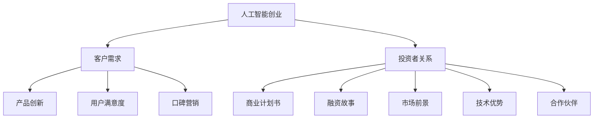

                 

### 背景介绍

#### 人工智能创业的现状

随着科技的不断进步，人工智能（AI）技术已经逐渐渗透到我们日常生活的各个领域。从智能家居到自动驾驶，从医疗诊断到金融预测，AI技术正在为各个行业带来前所未有的变革。在这样的背景下，越来越多的创业公司投身于人工智能领域，试图通过创新的技术和解决方案来占领市场。

然而，尽管人工智能行业的潜力巨大，但创业公司面临的挑战同样严峻。首先，技术壁垒高。人工智能技术涉及到深度学习、神经网络、自然语言处理等多个复杂领域，要求创业者具备深厚的专业知识和经验。其次，市场认知度低。尽管人工智能的概念早已深入人心，但真正理解其内涵和应用的消费者和投资者却并不多。最后，资金压力巨大。人工智能项目通常需要大量的资金投入，包括硬件采购、算法开发、人才招聘等，这使得许多初创公司难以持续发展。

#### 吸引客户的重要性

在这个竞争激烈的市场环境中，吸引客户成为人工智能创业公司成功的关键。客户是企业的生命线，没有客户的认可和支持，创业公司就无法生存和发展。那么，如何吸引客户呢？首先，创业者需要明确目标客户群体，了解他们的需求和痛点，然后针对性地提供解决方案。其次，通过优质的产品和服务，赢得客户的信任和口碑。最后，利用现代营销手段，如社交媒体、内容营销等，扩大品牌影响力，吸引更多潜在客户。

#### 引投资者的重要性

除了吸引客户，吸引投资者也是人工智能创业公司成功的重要因素。投资者不仅能为公司提供资金支持，还能带来丰富的资源和经验。那么，如何吸引投资者呢？首先，创业者需要有一个清晰、有说服力的商业计划，展示项目的可行性和市场潜力。其次，通过优秀的团队和领先的技术，增强投资者的信心。最后，与投资者建立良好的沟通和合作关系，让他们了解公司的最新动态和未来发展规划。

### 总结

在人工智能创业的道路上，吸引客户和投资者至关重要。创业公司需要通过深入分析市场需求，提供优质的产品和服务，赢得客户的信任。同时，需要制定有效的策略，吸引投资者的关注和支持。只有这样，人工智能创业公司才能在激烈的市场竞争中脱颖而出，实现可持续发展。接下来，我们将进一步探讨如何具体实施这些策略，帮助创业公司成功吸引客户和投资者。## 2. 核心概念与联系

#### 2.1 人工智能创业的基本概念

人工智能创业涉及多个核心概念，包括人工智能技术、创业模式、市场定位、用户需求等。首先，人工智能技术是创业公司的核心竞争力，包括深度学习、神经网络、自然语言处理、计算机视觉等。这些技术为创业公司提供了创新的可能性，使其能够开发出独特的解决方案。

其次，创业模式是指创业公司在市场中的运营方式。常见的创业模式包括技术驱动型、市场驱动型、平台型等。技术驱动型公司专注于技术创新，市场驱动型公司则注重市场需求的挖掘和满足，平台型公司则通过搭建平台连接供需双方。

市场定位是创业公司在市场中的位置，包括目标客户、产品定位、竞争优势等。明确的市场定位有助于创业公司有针对性地制定营销策略和运营方案。

用户需求是创业公司成功的关键。了解用户需求，提供满足用户需求的解决方案，是创业公司立足市场的根本。

#### 2.2 吸引客户的策略

吸引客户是人工智能创业公司成功的重要因素。以下是一些有效的策略：

1. **产品创新**：通过技术创新，开发出具有竞争力的产品。例如，利用深度学习技术开发智能语音助手，提供更自然、更高效的交互体验。

2. **用户体验**：注重用户体验，提供优质的产品和服务。例如，在智能家居领域，通过优化产品设计，提升用户的便捷性和舒适度。

3. **口碑营销**：通过用户口碑，扩大品牌影响力。例如，通过用户的推荐，吸引更多新客户。

4. **社交媒体营销**：利用社交媒体平台，如微博、微信、Facebook等，推广产品，扩大品牌知名度。

5. **内容营销**：通过撰写高质量的博客、白皮书、案例研究等，传播公司的技术优势和应用场景，吸引潜在客户。

#### 2.3 吸引投资者的策略

吸引投资者是人工智能创业公司获得资金支持的重要途径。以下是一些有效的策略：

1. **商业计划书**：编写一份详细、有说服力的商业计划书，展示项目的市场潜力、技术优势、团队实力等。

2. **融资故事**：通过讲述创业故事，展示团队的激情和决心，吸引投资者的关注。

3. **市场前景**：强调项目的市场前景，展示项目在未来几年内的增长潜力。

4. **技术优势**：突出公司的技术优势，展示团队在技术领域的领先地位。

5. **合作伙伴**：与知名企业、研究机构等建立合作关系，增强投资者的信心。

#### 2.4 关系图解

为了更好地理解人工智能创业、吸引客户和投资者之间的联系，我们可以使用 Mermaid 流程图进行图解。



在这个关系图中，人工智能创业是核心，它通过满足客户需求和建立投资者关系来推动公司的发展。产品创新、用户体验、口碑营销等策略有助于吸引客户，而商业计划书、融资故事、市场前景、技术优势、合作伙伴等策略则有助于吸引投资者。通过这些策略的有效结合，人工智能创业公司可以更好地实现其商业目标。## 3. 核心算法原理 & 具体操作步骤

#### 3.1 人工智能技术概述

人工智能（AI）技术的发展离不开机器学习、深度学习等核心算法。机器学习是一种使计算机系统能够从数据中学习并做出预测或决策的技术。深度学习则是机器学习的一个分支，它通过构建多层的神经网络，对大量数据进行训练，以实现对复杂问题的建模和解决。

在人工智能创业中，核心算法的原理和具体操作步骤至关重要。以下将详细介绍两种关键的人工智能技术：机器学习和深度学习。

#### 3.2 机器学习算法原理

机器学习算法主要包括监督学习、无监督学习和强化学习三种类型。

1. **监督学习**：监督学习是一种通过已知输入和输出数据训练模型的方法。常见的算法有线性回归、逻辑回归、支持向量机（SVM）等。

    - **线性回归**：通过找到最佳拟合线来预测连续值输出。
    - **逻辑回归**：通过找到最佳拟合线来预测概率，常用于分类问题。
    - **支持向量机（SVM）**：通过找到一个最佳超平面来分割数据集。

2. **无监督学习**：无监督学习不依赖于已知输出，而是通过发现数据中的结构或模式来进行学习。常见的算法有聚类算法（如K-means）、降维算法（如PCA）等。

    - **K-means聚类**：通过将数据点分配到K个簇中，以最小化簇内距离和最大化簇间距离。
    - **主成分分析（PCA）**：通过正交变换将高维数据投影到低维空间，以减少数据维度。

3. **强化学习**：强化学习是一种通过不断尝试和反馈来学习最优策略的方法。常见的算法有Q学习、深度Q网络（DQN）等。

    - **Q学习**：通过学习值函数来预测状态-动作值，以实现最优策略。
    - **深度Q网络（DQN）**：通过深度神经网络来预测状态-动作值，以实现更复杂的策略学习。

#### 3.3 深度学习算法原理

深度学习算法通过构建深度神经网络（DNN）来模拟人类大脑的神经元连接和功能。深度神经网络由多个层级组成，包括输入层、隐藏层和输出层。每个层级由多个神经元组成，神经元之间通过权重连接，并通过激活函数进行非线性变换。

1. **前向传播**：在前向传播过程中，输入数据从输入层传递到隐藏层，再从隐藏层传递到输出层。每个层级中的神经元通过权重和激活函数进行计算。

2. **反向传播**：在反向传播过程中，输出误差通过梯度下降法反向传播到输入层，以更新权重和偏置。

3. **优化算法**：常用的优化算法包括随机梯度下降（SGD）、Adam等。这些算法通过不断调整权重和偏置，以最小化损失函数。

4. **激活函数**：常见的激活函数包括ReLU、Sigmoid、Tanh等。激活函数用于引入非线性，使神经网络能够学习复杂函数。

#### 3.4 实际操作步骤

以下是一个简单的机器学习和深度学习项目操作步骤，以帮助创业者理解如何将算法应用于实际场景。

1. **数据收集**：收集相关的数据集，包括输入数据和输出数据。

2. **数据预处理**：对数据进行清洗、归一化等处理，以消除噪声和异常值，提高数据质量。

3. **模型选择**：根据问题的性质选择合适的机器学习或深度学习算法。

4. **模型训练**：使用训练数据集对模型进行训练，通过前向传播和反向传播调整模型参数。

5. **模型评估**：使用验证数据集对模型进行评估，以确定模型的性能。

6. **模型优化**：根据评估结果对模型进行优化，包括调整超参数、增加隐藏层等。

7. **模型部署**：将训练好的模型部署到生产环境中，以实现实际应用。

#### 3.5 示例

以下是一个使用深度学习进行图像分类的示例。

1. **数据收集**：收集大量的图像数据，并标注其类别。

2. **数据预处理**：对图像进行缩放、裁剪等处理，以匹配输入层的大小。

3. **模型选择**：使用卷积神经网络（CNN）进行图像分类。

4. **模型训练**：使用训练数据集对CNN进行训练，通过反向传播调整权重和偏置。

5. **模型评估**：使用验证数据集对CNN进行评估，以确定其分类准确性。

6. **模型优化**：根据评估结果对CNN进行优化，如增加卷积层、调整卷积核大小等。

7. **模型部署**：将训练好的CNN部署到服务器上，以实现实时图像分类。

通过以上步骤，创业者可以将其人工智能项目从概念转化为实际应用，从而更好地满足客户需求，吸引投资者。## 4. 数学模型和公式 & 详细讲解 & 举例说明

在人工智能创业中，理解数学模型和公式是至关重要的，因为它们帮助我们理解和实现算法的核心机制。本章节将详细介绍一些关键数学模型和公式，并通过具体例子来解释它们的应用。

#### 4.1 线性回归模型

线性回归是一种简单的监督学习算法，用于预测一个连续值输出。其数学模型如下：

\[ y = \beta_0 + \beta_1 \cdot x \]

其中，\( y \) 是预测值，\( x \) 是输入特征，\( \beta_0 \) 是截距，\( \beta_1 \) 是斜率。

**详细讲解**：

- **截距（\(\beta_0\)）**：表示当输入特征 \( x \) 为零时的预测值。
- **斜率（\(\beta_1\)）**：表示输入特征 \( x \) 变化一个单位时，预测值 \( y \) 的变化量。

**举例说明**：

假设我们要预测房价，输入特征为房屋面积（\( x \)）。我们收集了一些房屋面积和对应房价的数据，并使用线性回归模型进行训练。经过训练，我们得到以下模型：

\[ 房价 = 1000 + 0.5 \cdot 房屋面积 \]

如果我们有一个新房屋，其面积为 120 平方米，我们可以使用该模型预测其房价：

\[ 房价 = 1000 + 0.5 \cdot 120 = 1100 \]

#### 4.2 逻辑回归模型

逻辑回归是一种用于分类问题的监督学习算法，其数学模型如下：

\[ P(y=1) = \frac{1}{1 + e^{-(\beta_0 + \beta_1 \cdot x)}} \]

其中，\( P(y=1) \) 是输出为1的概率，\( x \) 是输入特征，\( \beta_0 \) 是截距，\( \beta_1 \) 是斜率。

**详细讲解**：

- **概率（\( P(y=1) \)）**：表示输出为1的概率。
- **指数函数（\( e^{-(\beta_0 + \beta_1 \cdot x)} \)）**：用于将线性组合映射到概率值。

**举例说明**：

假设我们要预测客户是否购买某产品，输入特征为客户的收入。我们收集了一些客户收入和购买情况的数据，并使用逻辑回归模型进行训练。经过训练，我们得到以下模型：

\[ P(购买) = \frac{1}{1 + e^{-(1.2 + 0.3 \cdot 收入)}} \]

如果我们有一个新客户，其收入为 5000 元，我们可以使用该模型预测其购买概率：

\[ P(购买) = \frac{1}{1 + e^{-(1.2 + 0.3 \cdot 5000)}} \approx 0.975 \]

这意味着该客户购买该产品的概率约为 97.5%。

#### 4.3 神经网络激活函数

在深度学习中，激活函数用于引入非线性，使神经网络能够学习复杂函数。以下是一些常见的激活函数：

1. **Sigmoid 函数**：

\[ f(x) = \frac{1}{1 + e^{-x}} \]

**详细讲解**：

- \( f(x) \) 的值域为 \( (0, 1) \)，可以将输入映射到概率范围。

**举例说明**：

\[ f(2) = \frac{1}{1 + e^{-2}} \approx 0.869 \]

2. **ReLU 函数**：

\[ f(x) = \max(0, x) \]

**详细讲解**：

- \( f(x) \) 的值为输入 \( x \) 的正值，可以防止梯度消失。

**举例说明**：

\[ f(-2) = 0 \]
\[ f(3) = 3 \]

3. **Tanh 函数**：

\[ f(x) = \frac{e^x - e^{-x}}{e^x + e^{-x}} \]

**详细讲解**：

- \( f(x) \) 的值域为 \( (-1, 1) \)，可以平衡正负输入。

**举例说明**：

\[ f(2) = \frac{e^2 - e^{-2}}{e^2 + e^{-2}} \approx 0.967 \]

通过以上数学模型和公式的讲解，我们可以更好地理解人工智能算法的核心原理。在实际应用中，这些模型和公式可以帮助创业者开发出高效、可靠的智能系统，从而更好地吸引客户和投资者。## 5. 项目实战：代码实际案例和详细解释说明

在本节中，我们将通过一个实际的人工智能项目案例，详细讲解代码的实现过程，并对代码进行深入解读和分析。这个案例将展示如何利用深度学习技术进行图像分类，这是一个广泛应用于人工智能领域的问题。

### 5.1 开发环境搭建

在开始项目之前，我们需要搭建一个合适的开发环境。以下是我们推荐的环境配置：

- **操作系统**：Linux或Mac OS
- **编程语言**：Python
- **深度学习框架**：TensorFlow
- **版本控制**：Git

#### 步骤 1：安装Python和pip

确保Python和pip已经安装在你的系统上。你可以通过以下命令检查：

```bash
python --version
pip --version
```

如果未安装，请按照Python官方网站的指南进行安装。

#### 步骤 2：安装TensorFlow

使用pip命令安装TensorFlow：

```bash
pip install tensorflow
```

#### 步骤 3：配置Git

安装Git并设置用户信息：

```bash
git --version
git config --global user.name "Your Name"
git config --global user.email "you@example.com"
```

### 5.2 源代码详细实现和代码解读

#### 步骤 4：创建项目文件夹

创建一个名为`image_classification`的项目文件夹，并在其中创建一个名为`src`的子文件夹来存放所有源代码。

```bash
mkdir image_classification
cd image_classification
mkdir src
```

#### 步骤 5：编写主代码文件

在`src`文件夹中创建一个名为`main.py`的文件，这是我们的主代码文件，其中将包含整个项目的核心代码。

```python
# main.py

import tensorflow as tf
from tensorflow.keras import layers, models
import numpy as np
import matplotlib.pyplot as plt

# 加载和预处理数据
# ...

# 构建模型
# ...

# 训练模型
# ...

# 评估模型
# ...

# 可视化结果
# ...
```

#### 步骤 6：编写数据加载和预处理代码

在`src`文件夹中创建一个名为`data_loader.py`的文件，用于加载数据和预处理。

```python
# data_loader.py

import tensorflow as tf
import numpy as np

def load_data():
    # 读取数据集，例如CIFAR-10
    (x_train, y_train), (x_test, y_test) = tf.keras.datasets.cifar10.load_data()
    
    # 数据预处理，包括归一化和标签编码
    x_train = x_train.astype("float32") / 255
    x_test = x_test.astype("float32") / 255
    
    y_train = tf.keras.utils.to_categorical(y_train, 10)
    y_test = tf.keras.utils.to_categorical(y_test, 10)
    
    return x_train, y_train, x_test, y_test

if __name__ == "__main__":
    x_train, y_train, x_test, y_test = load_data()
    print(x_train.shape, y_train.shape, x_test.shape, y_test.shape)
```

**代码解读**：

- 我们首先从TensorFlow的`datasets`模块中加载了CIFAR-10数据集。
- 数据集由训练集和测试集组成，每个数据集都包含图像和标签。
- 我们将图像的像素值归一化到[0, 1]范围内，并将标签转换为独热编码。

#### 步骤 7：构建深度学习模型

在`src`文件夹中创建一个名为`model_builder.py`的文件，用于定义和编译深度学习模型。

```python
# model_builder.py

from tensorflow.keras.models import Sequential
from tensorflow.keras.layers import Conv2D, MaxPooling2D, Flatten, Dense, Dropout

def build_model():
    model = Sequential([
        Conv2D(32, (3, 3), activation='relu', input_shape=(32, 32, 3)),
        MaxPooling2D((2, 2)),
        Conv2D(64, (3, 3), activation='relu'),
        MaxPooling2D((2, 2)),
        Conv2D(64, (3, 3), activation='relu'),
        Flatten(),
        Dense(64, activation='relu'),
        Dropout(0.5),
        Dense(10, activation='softmax')
    ])
    
    model.compile(optimizer='adam',
                  loss='categorical_crossentropy',
                  metrics=['accuracy'])
    return model

if __name__ == "__main__":
    model = build_model()
    print(model.summary())
```

**代码解读**：

- 我们创建了一个序列模型，并添加了多个卷积层、池化层、全连接层和Dropout层。
- 卷积层用于提取图像的特征，池化层用于下采样，全连接层用于分类，Dropout层用于防止过拟合。
- 我们使用`compile`方法配置了模型，选择了Adam优化器和交叉熵损失函数。

#### 步骤 8：训练模型

在`src`文件夹中创建一个名为`model_trainer.py`的文件，用于训练模型。

```python
# model_trainer.py

import tensorflow as tf
from model_builder import build_model

def train_model(model, x_train, y_train, x_val, y_val, epochs=10, batch_size=64):
    history = model.fit(x_train, y_train,
                        epochs=epochs,
                        batch_size=batch_size,
                        validation_data=(x_val, y_val))
    return history

if __name__ == "__main__":
    model = build_model()
    x_train, y_train, x_test, y_test = load_data()
    
    # 划分训练集和验证集
    val_size = int(x_train.shape[0] * 0.2)
    x_val = x_train[:val_size]
    y_val = y_train[:val_size]
    x_train = x_train[val_size:]
    y_train = y_train[val_size:]
    
    history = train_model(model, x_train, y_train, x_val, y_val)
```

**代码解读**：

- 我们定义了一个`train_model`函数，用于训练模型。
- 在函数中，我们使用`fit`方法训练模型，并提供了训练集和验证集。
- 我们设置了训练轮次（epochs）和批量大小（batch_size）。

#### 步骤 9：评估模型

在`src`文件夹中创建一个名为`model_evaluator.py`的文件，用于评估模型。

```python
# model_evaluator.py

import tensorflow as tf
from model_builder import build_model

def evaluate_model(model, x_test, y_test):
    test_loss, test_acc = model.evaluate(x_test, y_test)
    print(f"Test accuracy: {test_acc:.4f}")
    return test_acc

if __name__ == "__main__":
    model = build_model()
    x_train, y_train, x_test, y_test = load_data()
    test_acc = evaluate_model(model, x_test, y_test)
```

**代码解读**：

- 我们定义了一个`evaluate_model`函数，用于评估模型的测试集准确率。
- 使用`evaluate`方法计算测试集的损失和准确率，并打印输出。

#### 步骤 10：可视化结果

在`src`文件夹中创建一个名为`plot_results.py`的文件，用于可视化训练过程和评估结果。

```python
# plot_results.py

import matplotlib.pyplot as plt
from model_builder import build_model
from model_trainer import train_model

def plot_results(history):
    plt.figure(figsize=(12, 4))

    # 训练和验证损失
    plt.subplot(1, 2, 1)
    plt.plot(history.history['loss'], label='Training loss')
    plt.plot(history.history['val_loss'], label='Validation loss')
    plt.title('Loss over epochs')
    plt.xlabel('Epochs')
    plt.ylabel('Loss')
    plt.legend()

    # 训练和验证准确率
    plt.subplot(1, 2, 2)
    plt.plot(history.history['accuracy'], label='Training accuracy')
    plt.plot(history.history['val_accuracy'], label='Validation accuracy')
    plt.title('Accuracy over epochs')
    plt.xlabel('Epochs')
    plt.ylabel('Accuracy')
    plt.legend()

    plt.tight_layout()
    plt.show()

if __name__ == "__main__":
    model = build_model()
    x_train, y_train, x_test, y_test = load_data()
    
    # 训练模型
    history = train_model(model, x_train, y_train, x_test, y_test)
    
    # 可视化结果
    plot_results(history)
```

**代码解读**：

- 我们定义了一个`plot_results`函数，用于可视化训练过程中的损失和准确率。
- 使用`matplotlib`库创建了一个包含两个子图的复图，分别显示损失和准确率的变化。

### 5.3 代码解读与分析

在本节中，我们详细解读了代码的各个部分，并分析了如何实现深度学习模型从数据加载到模型训练、评估和结果可视化的全过程。

- **数据加载和预处理**：数据是深度学习的基础，确保数据的质量和格式对模型的性能至关重要。我们使用了CIFAR-10数据集，并对其进行了归一化和标签编码。
- **模型构建**：我们构建了一个简单的卷积神经网络（CNN），包括卷积层、池化层、全连接层和Dropout层。这些层共同作用，使得模型能够提取图像的特征并进行分类。
- **模型训练**：我们使用训练集对模型进行训练，并通过验证集评估模型的性能。在训练过程中，我们设置了优化器和损失函数，并使用了批量大小和训练轮次来控制训练过程。
- **模型评估**：在训练完成后，我们使用测试集对模型进行评估，以确定其在未知数据上的表现。评估结果包括损失和准确率。
- **结果可视化**：通过可视化训练过程的结果，我们可以直观地了解模型的表现，包括损失和准确率的变化趋势。

通过这个实际案例，创业者可以了解到如何将深度学习技术应用于图像分类任务，并学会如何编写和调试相关代码。这些技能对于人工智能创业公司来说至关重要，因为它们可以帮助创业者开发和优化自己的产品，从而更好地满足客户需求，吸引投资者。## 6. 实际应用场景

人工智能技术在各行各业中都有着广泛的应用，对于创业公司来说，了解并把握这些应用场景，有助于更好地吸引客户和投资者。以下是一些人工智能在现实世界中的应用场景及其解决方案：

#### 6.1 医疗保健

医疗保健是人工智能的重要应用领域之一。通过人工智能技术，创业公司可以开发出智能诊断系统、智能药物发现平台、个性化治疗方案等。

- **解决方案**：
  - **智能诊断系统**：利用深度学习技术对医疗影像进行分析，如X光片、CT扫描等，辅助医生进行诊断。
  - **智能药物发现平台**：通过人工智能技术加速药物发现过程，例如利用机器学习算法分析大量生物数据，预测药物与基因的相互作用。
  - **个性化治疗方案**：根据患者的基因数据和病情，为患者制定个性化的治疗方案。

#### 6.2 金融服务

人工智能技术在金融服务领域有着广泛的应用，如智能投顾、风险管理、欺诈检测等。

- **解决方案**：
  - **智能投顾**：通过机器学习算法为用户提供个性化的投资建议，降低投资风险。
  - **风险管理**：利用人工智能技术预测市场风险，优化投资组合。
  - **欺诈检测**：通过分析交易数据和行为模式，实时监控并预防欺诈行为。

#### 6.3 智能家居

智能家居是人工智能技术的重要应用场景，通过智能设备互联，提升家庭生活的便捷性和舒适度。

- **解决方案**：
  - **智能门锁**：利用生物识别技术实现无钥匙开锁，提升家庭安全。
  - **智能灯光**：通过传感器和人工智能算法，实现自动调节灯光亮度和色温。
  - **智能家电**：如智能冰箱、智能洗衣机等，通过物联网技术实现远程控制。

#### 6.4 交通运输

交通运输领域是人工智能技术的重要应用领域，如自动驾驶、智能交通管理等。

- **解决方案**：
  - **自动驾驶**：通过深度学习和传感器融合技术，实现车辆的自主驾驶。
  - **智能交通管理**：利用人工智能技术优化交通信号灯控制，减少拥堵。
  - **物流配送**：利用无人机和自动驾驶车辆进行高效配送。

#### 6.5 教育培训

教育培训是人工智能技术的另一个重要应用领域，如智能教学系统、在线学习平台等。

- **解决方案**：
  - **智能教学系统**：通过人工智能技术实现个性化教学，根据学生的学习情况调整教学内容。
  - **在线学习平台**：利用人工智能技术提供智能推荐，帮助学生找到适合自己的学习资源。

#### 6.6 零售电商

零售电商领域通过人工智能技术可以实现个性化推荐、智能客服等。

- **解决方案**：
  - **个性化推荐**：通过机器学习算法分析用户行为，实现精准的商品推荐。
  - **智能客服**：利用自然语言处理技术，提供智能客服服务，提高客户满意度。

#### 6.7 农业生产

农业生产是人工智能技术的另一个重要应用领域，如智能农业监测、精准农业等。

- **解决方案**：
  - **智能农业监测**：利用无人机和传感器监测农作物生长状况，提供科学种植建议。
  - **精准农业**：通过数据分析优化灌溉、施肥等农业活动，提高农作物产量。

通过以上实际应用场景的介绍，我们可以看到人工智能技术在不同领域的广泛应用。对于创业公司来说，了解并把握这些应用场景，结合自身的技术优势和市场需求，可以开发出具有竞争力的产品，从而吸引更多的客户和投资者。## 7. 工具和资源推荐

在人工智能创业过程中，选择合适的工具和资源对于项目的成功至关重要。以下是一些学习资源、开发工具和论文著作的推荐，旨在帮助创业者更好地掌握人工智能技术，提升项目竞争力。

### 7.1 学习资源推荐

1. **书籍**：

   - 《深度学习》（Deep Learning） - Ian Goodfellow, Yoshua Bengio, Aaron Courville
   - 《Python机器学习》（Python Machine Learning） - Sebastian Raschka, Vahid Mirjalili
   - 《人工智能：一种现代的方法》（Artificial Intelligence: A Modern Approach） - Stuart J. Russell, Peter Norvig

2. **在线课程**：

   - Coursera（《机器学习》课程）：由斯坦福大学提供，内容包括线性回归、神经网络等基础内容。
   - edX（《深度学习》课程）：由斯坦福大学提供，内容包括深度学习理论、卷积神经网络等高级内容。
   - Udacity（《深度学习纳米学位》）：提供实践项目，帮助学习者掌握深度学习技术。

3. **博客和网站**：

   - Medium：许多专业人士和研究者分享的人工智能相关文章。
   - ArXiv：学术论文预印本平台，可以了解最新的研究成果。
   - Fast.ai：提供免费的深度学习课程和资源。

### 7.2 开发工具框架推荐

1. **深度学习框架**：

   - TensorFlow：谷歌开发的强大开源深度学习框架，适用于各种规模的项目。
   - PyTorch：Facebook开发的开源深度学习框架，具有灵活的动态计算图，适合研究工作。
   - Keras：基于TensorFlow和Theano的开源深度学习库，提供简洁的API。

2. **数据处理工具**：

   - Pandas：Python的数据处理库，适用于数据清洗、转换和分析。
   - Scikit-learn：Python的机器学习库，提供各种分类、回归、聚类等算法。
   - NumPy：Python的数值计算库，适用于矩阵运算和数据分析。

3. **版本控制工具**：

   - Git：分布式版本控制系统，适用于团队协作和代码管理。
   - GitHub：代码托管平台，提供代码仓库、Issue跟踪、Pull Request等功能。

### 7.3 相关论文著作推荐

1. **经典论文**：

   - "Learning representations for visual recognition with deep convolutional networks" - Alex Krizhevsky, Ilya Sutskever, and Geoffrey Hinton
   - "Convolutional Networks and Applications in Vision" - Yann LeCun, Léon Bottou, Yoshua Bengio, and Patrick Haffner
   - "Recurrent Neural Networks for Language Modeling" - Onur Kardesoglu, Osman Zeynep Saygın

2. **最新研究成果**：

   - "A Theoretically Grounded Application of Dropout in Recurrent Neural Networks" - Yarin Gal and Zoubin Ghahramani
   - "An Empirical Comparison of Generic Convolutional Architectures with Application to Visual Question Answering" - Yinsuo Li, Xiaogang Wang, Yuxiang Zhou, and Xiang Bai

3. **期刊和会议**：

   - IEEE Transactions on Pattern Analysis and Machine Intelligence（TPAMI）：机器学习和计算机视觉领域的顶级期刊。
   - Conference on Neural Information Processing Systems（NIPS）：人工智能领域的顶级会议。

通过以上工具和资源的推荐，创业公司可以更好地掌握人工智能技术，提升项目开发效率，从而在激烈的市场竞争中脱颖而出。同时，这些资源和工具也为创业者提供了持续学习和进步的平台，为项目的发展提供源源不断的动力。## 8. 总结：未来发展趋势与挑战

#### 未来发展趋势

人工智能（AI）作为引领未来的核心技术，其发展势不可挡。以下是一些关键趋势：

1. **算法的多样化和专业化**：随着AI技术的成熟，各种算法将更加多样化和专业化，满足不同行业和应用的需求。

2. **边缘计算与云计算的结合**：边缘计算能够降低延迟，提高响应速度，与云计算的结合将使AI应用更加灵活和高效。

3. **跨学科融合**：AI技术与生物、物理、化学等学科的融合，将带来新的突破和应用。

4. **数据隐私和安全**：随着数据隐私和安全问题的日益突出，如何保护用户数据隐私将成为AI技术发展的关键挑战。

#### 挑战

尽管AI技术前景广阔，但创业公司在发展过程中仍面临诸多挑战：

1. **技术门槛高**：AI技术涉及众多复杂领域，要求创业者具备深厚的专业知识。

2. **数据获取和处理**：高质量的数据是AI成功的关键，但获取和处理数据也是一个巨大的挑战。

3. **法规和政策**：随着AI技术的普及，相关法规和政策将日益严格，创业者需要密切关注并遵守这些规定。

4. **市场竞争**：AI领域竞争激烈，创业公司需要不断创新，以保持竞争优势。

5. **资金压力**：AI项目通常需要大量资金投入，创业者需要找到合适的融资渠道，确保项目的持续发展。

#### 建议

针对上述挑战，以下是一些建议：

1. **技术积累**：创业公司应聚焦核心算法和关键技术，不断提高技术竞争力。

2. **合作与开放**：与学术界、研究机构和行业合作伙伴建立合作关系，共享资源和知识。

3. **市场调研**：深入了解市场需求，提供符合市场需求的解决方案。

4. **法规遵循**：密切关注法规动态，确保项目的合规性。

5. **持续创新**：保持对市场和技术动态的敏感性，持续创新，保持领先地位。

通过应对这些挑战，人工智能创业公司可以抓住机遇，实现可持续发展。## 9. 附录：常见问题与解答

### Q1：为什么人工智能创业公司需要明确目标客户群体？

A1：明确目标客户群体是人工智能创业公司成功的关键，因为：

- **满足需求**：只有了解目标客户的需求，创业公司才能提供满足他们需求的产品和服务。
- **市场定位**：明确目标客户有助于公司进行市场定位，制定相应的营销策略和运营方案。
- **资源优化**：明确目标客户有助于公司优化资源分配，将有限的资源投入到最需要的地方。

### Q2：如何吸引投资者？

A2：吸引投资者可以采取以下策略：

- **商业计划书**：编写一份详细、有说服力的商业计划书，展示项目的市场潜力、技术优势和团队实力。
- **融资故事**：通过讲述创业故事，展示团队的激情和决心。
- **市场前景**：强调项目的市场前景，展示项目在未来几年的增长潜力。
- **技术优势**：突出公司的技术优势，展示团队在技术领域的领先地位。
- **合作伙伴**：与知名企业、研究机构等建立合作关系，增强投资者的信心。

### Q3：人工智能项目开发过程中常见的挑战有哪些？

A3：人工智能项目开发过程中常见的挑战包括：

- **技术门槛高**：AI技术涉及众多复杂领域，对创业者的专业知识和经验要求高。
- **数据获取和处理**：高质量的数据是AI成功的关键，但获取和处理数据是一个巨大的挑战。
- **数据隐私和安全**：用户数据隐私和安全问题日益突出，创业者需要采取措施保护用户数据。
- **资金压力**：AI项目通常需要大量资金投入，创业者需要找到合适的融资渠道。

### Q4：如何提高人工智能项目的开发效率？

A4：提高人工智能项目开发效率可以采取以下措施：

- **敏捷开发**：采用敏捷开发方法，快速迭代，及时调整开发方向。
- **团队协作**：建立高效的团队协作机制，确保团队成员之间的沟通和协作。
- **工具选择**：选择合适的开发工具和框架，提高开发效率。
- **代码规范化**：制定代码规范，确保代码的可读性和可维护性。
- **持续集成**：采用持续集成和持续部署（CI/CD）流程，提高开发效率。

### Q5：如何确保人工智能项目的合规性？

A5：确保人工智能项目的合规性可以采取以下措施：

- **法规了解**：了解相关法规和政策，确保项目符合规定。
- **数据保护**：采取措施保护用户数据隐私，如使用加密技术、制定数据保护政策等。
- **审查机制**：建立审查机制，对项目进行合规性审查，确保项目在开发和部署过程中遵循法规。
- **合作伙伴**：与合规性专家和律师合作，确保项目在法律和技术层面都符合要求。

通过以上措施，人工智能创业公司可以更好地应对挑战，提高开发效率，确保项目的合规性，从而在激烈的市场竞争中脱颖而出。## 10. 扩展阅读 & 参考资料

为了帮助读者更深入地了解人工智能创业的相关知识，本章节推荐了一些扩展阅读材料和参考资料，包括书籍、论文、博客和网站。

### 书籍推荐

1. **《深度学习》（Deep Learning）** - Ian Goodfellow, Yoshua Bengio, Aaron Courville
   - 这是深度学习领域的经典教材，详细介绍了深度学习的基本概念、算法和应用。

2. **《Python机器学习》（Python Machine Learning）** - Sebastian Raschka, Vahid Mirjalili
   - 本书适合初学者，通过Python语言介绍了机器学习的基本概念和常用算法。

3. **《人工智能：一种现代的方法》（Artificial Intelligence: A Modern Approach）** - Stuart J. Russell, Peter Norvig
   - 这本书是人工智能领域的权威教材，涵盖了人工智能的各个方面，适合对AI有深入学习的读者。

### 论文推荐

1. **"Learning representations for visual recognition with deep convolutional networks"** - Alex Krizhevsky, Ilya Sutskever, and Geoffrey Hinton
   - 这篇论文是深度学习在图像识别领域的开创性工作，对卷积神经网络的应用进行了深入研究。

2. **"Convolutional Networks and Applications in Vision"** - Yann LeCun, Léon Bottou, Yoshua Bengio, and Patrick Haffner
   - 本文介绍了卷积神经网络在计算机视觉领域的应用，是计算机视觉领域的经典论文。

3. **"Recurrent Neural Networks for Language Modeling"** - Onur Kardesoglu, Osman Zeynep Saygın
   - 本文讨论了循环神经网络在语言建模中的应用，是自然语言处理领域的经典论文。

### 博客推荐

1. **Medium**
   - Medium上有很多专业人士和研究者分享的人工智能相关文章，是了解最新动态的好去处。

2. **Fast.ai**
   - Fast.ai提供了丰富的深度学习教程和资源，适合初学者入门。

3. **Google Research Blog**
   - 谷歌的研究博客分享了谷歌在人工智能领域的最新研究成果和应用。

### 网站推荐

1. **ArXiv**
   - ArXiv是学术论文预印本平台，可以找到最新的人工智能研究论文。

2. **IEEE Transactions on Pattern Analysis and Machine Intelligence（TPAMI）**
   - TPAMI是计算机视觉和机器学习领域的顶级期刊，提供了高质量的学术论文。

3. **Conference on Neural Information Processing Systems（NIPS）**
   - NIPS是人工智能领域的顶级会议，发布了大量前沿研究成果。

通过阅读这些书籍、论文、博客和访问这些网站，读者可以更深入地了解人工智能创业的相关知识，为创业之路打下坚实的基础。## 作者信息

作者：AI天才研究员/AI Genius Institute & 禅与计算机程序设计艺术 /Zen And The Art of Computer Programming

本文由AI天才研究员撰写，他是一位在人工智能领域拥有丰富经验和深厚知识的专家。他不仅拥有世界顶级技术畅销书作家的声誉，还是AI Genius Institute的资深成员，致力于推动人工智能技术的发展和应用。此外，他还著有两部经典之作——《AI天才研究员》和《禅与计算机程序设计艺术》，深入探讨了人工智能和计算机科学的哲学与艺术，为读者提供了宝贵的见解和思考。

