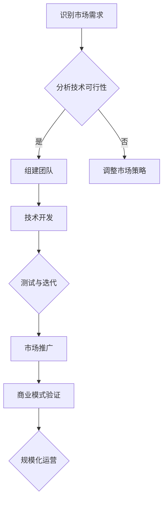

                 

# 人工智能创业：市场需求的分析

> **关键词：** 人工智能，创业，市场需求，分析，技术趋势，商业模式

> **摘要：** 本文章深入探讨了人工智能创业市场的前景和需求。通过详细的市场需求分析，本文揭示了人工智能技术在创业领域的应用潜力，以及创业者应该关注的行业趋势和商业模式。文章旨在为人工智能创业者提供指导，帮助他们更好地理解市场动态，制定有效的创业策略。

## 1. 背景介绍

近年来，人工智能（AI）技术的飞速发展引起了全球范围内的关注。随着计算能力的提升、大数据的普及以及算法的优化，人工智能已经从理论走向实践，广泛应用于各个领域，如自然语言处理、计算机视觉、机器人技术等。这一技术的进步不仅改变了传统行业的工作方式，也为创业者提供了丰富的机遇。

创业市场的活力和多样性为人工智能的发展注入了新的动力。越来越多的创业者将人工智能技术作为核心驱动力，尝试将其应用于不同的业务场景中，从而提升效率、降低成本、创造新的商业模式。然而，创业市场中的竞争也日益激烈，创业者需要在技术、市场、商业模式等多个方面做出全面的规划和准备。

本篇文章将围绕人工智能创业市场的需求展开分析，旨在帮助创业者更好地理解市场动态，识别潜在机会，制定有效的创业策略。文章将从以下几个方面进行探讨：

- 人工智能技术在不同领域的应用案例和市场需求
- 创业者面临的挑战和机会
- 人工智能创业的市场趋势和商业模式
- 创业成功的关键因素和策略

通过这些分析，我们希望为人工智能创业者提供有价值的参考，帮助他们把握市场机遇，实现创业梦想。

## 2. 核心概念与联系

### 2.1 人工智能（AI）的定义与分类

人工智能是指通过计算机程序实现智能行为的技术，它模仿人类的思考、学习和决策过程。根据实现方式和功能，人工智能可以分为以下几类：

- **弱人工智能（Narrow AI）**：专注于单一任务的智能系统，如语音识别、图像识别等。
- **强人工智能（General AI）**：具有全面认知和智能能力的系统，能够理解、学习和适应各种任务。
- **混合智能（Hybrid AI）**：结合多种人工智能技术，实现更高效、更智能的解决方案。

### 2.2 人工智能的应用领域

人工智能技术已经在多个领域取得了显著的应用成果，以下是其中一些主要的应用领域：

- **医疗健康**：利用AI进行疾病诊断、药物研发和个性化治疗。
- **金融科技**：通过AI进行风险评估、欺诈检测和智能投顾。
- **自动驾驶**：利用计算机视觉和深度学习技术实现无人驾驶汽车。
- **智能制造**：利用AI实现生产线的自动化和智能化管理。
- **零售电商**：通过AI进行个性化推荐、用户行为分析和营销策略优化。

### 2.3 人工智能创业的挑战与机遇

#### 挑战：

- **技术门槛高**：人工智能技术的研发需要深厚的专业知识和丰富的实践经验，对创业团队的技术能力提出了高要求。
- **数据隐私与安全**：大数据的使用和处理过程中，如何保护用户隐私和安全成为重要议题。
- **市场竞争激烈**：随着越来越多的创业者进入人工智能领域，市场竞争日益激烈，创业者需要找到独特的竞争优势。

#### 机遇：

- **市场前景广阔**：人工智能技术被认为是未来的核心技术之一，应用前景广阔，市场需求持续增长。
- **跨界融合**：人工智能与其他行业的融合，如智能制造、金融科技等，创造了新的商业机会。
- **政策支持**：各国政府纷纷出台支持人工智能发展的政策，为创业者提供了良好的发展环境。

### 2.4 人工智能创业的商业模式

#### 2.4.1 产品销售模式

- **SaaS服务**：通过提供基于人工智能的软件服务，如智能客服、智能分析等。
- **硬件销售**：开发人工智能硬件产品，如智能机器人、智能传感器等。
- **解决方案**：为特定行业提供定制化的智能解决方案。

#### 2.4.2 合作与开放平台

- **合作生态**：与其他企业或研究机构合作，共同开发人工智能产品和应用。
- **开放平台**：建立人工智能开放平台，吸引开发者参与，共同推动技术的创新和发展。

### 2.5 Mermaid 流程图

以下是人工智能创业的关键流程，使用Mermaid进行可视化：



通过以上分析，我们可以看到，人工智能创业不仅需要强大的技术支持，还需要清晰的市场定位和灵活的商业模式。接下来，我们将进一步探讨人工智能创业的核心算法原理和具体操作步骤，帮助创业者更好地理解和应用这一技术。

### 3. 核心算法原理 & 具体操作步骤

#### 3.1 机器学习算法原理

机器学习是人工智能的核心技术之一，它使计算机能够通过数据学习并做出决策。机器学习算法主要分为监督学习、无监督学习和强化学习三大类。

- **监督学习（Supervised Learning）**：通过标记好的数据集进行学习，算法根据输入和输出的关系进行训练，然后对新的数据进行预测。常见的监督学习算法包括线性回归、决策树、支持向量机等。

- **无监督学习（Unsupervised Learning）**：在无标记的数据集上进行学习，算法通过发现数据中的结构和模式来对数据进行分类或聚类。常见的无监督学习算法包括K-均值聚类、主成分分析（PCA）等。

- **强化学习（Reinforcement Learning）**：通过试错法进行学习，算法通过与环境的交互，不断优化策略以获得最大奖励。常见的强化学习算法包括Q-学习、深度Q网络（DQN）等。

#### 3.2 计算机视觉算法原理

计算机视觉是人工智能的重要分支，它使计算机能够“看”和理解图像或视频。计算机视觉算法主要包括图像分类、目标检测、图像分割等。

- **图像分类（Image Classification）**：将图像划分为预定义的类别。常见的图像分类算法包括卷积神经网络（CNN）、支持向量机（SVM）等。

- **目标检测（Object Detection）**：识别图像中的目标并标注其位置。常见的目标检测算法包括YOLO（You Only Look Once）、SSD（Single Shot MultiBox Detector）等。

- **图像分割（Image Segmentation）**：将图像划分为不同的区域，每个区域代表不同的对象。常见的图像分割算法包括FCN（Fully Convolutional Network）、U-Net等。

#### 3.3 自然语言处理算法原理

自然语言处理是人工智能的另一个重要领域，它使计算机能够理解和生成自然语言。自然语言处理算法主要包括文本分类、情感分析、机器翻译等。

- **文本分类（Text Classification）**：对文本进行分类，如垃圾邮件分类、新闻分类等。常见的文本分类算法包括朴素贝叶斯、支持向量机等。

- **情感分析（Sentiment Analysis）**：分析文本中的情感倾向，如评论的情感极性分析。常见的情感分析算法包括朴素贝叶斯、深度学习等。

- **机器翻译（Machine Translation）**：将一种语言的文本翻译成另一种语言。常见的机器翻译算法包括统计机器翻译、神经机器翻译等。

#### 3.4 具体操作步骤

以下是一个基于机器学习的项目开发的基本步骤：

1. **需求分析**：明确项目的目标和应用场景，确定需要解决的问题。

2. **数据收集**：收集相关的数据集，包括输入数据和输出数据。

3. **数据预处理**：对数据进行清洗、归一化等处理，以提高模型的性能。

4. **模型选择**：根据问题类型和数据特点选择合适的模型。

5. **模型训练**：使用训练数据集对模型进行训练。

6. **模型评估**：使用测试数据集对模型进行评估，调整模型参数。

7. **模型部署**：将训练好的模型部署到生产环境中，进行实际应用。

通过以上步骤，创业者可以开发出具有实际应用价值的人工智能产品或服务。接下来，我们将进一步探讨人工智能创业的数学模型和公式，帮助创业者更好地理解和应用这些算法。

### 4. 数学模型和公式 & 详细讲解 & 举例说明

#### 4.1 机器学习中的数学模型

在机器学习中，数学模型是算法的核心，它定义了如何从数据中提取特征并做出预测。以下是一些常用的数学模型和公式：

##### 4.1.1 线性回归（Linear Regression）

线性回归模型通过拟合一条直线来描述输入变量和输出变量之间的关系。其公式为：

$$
y = \beta_0 + \beta_1 \cdot x
$$

其中，$y$ 是输出变量，$x$ 是输入变量，$\beta_0$ 和 $\beta_1$ 分别是模型的截距和斜率。

举例说明：假设我们要预测房价，输入变量是房屋面积（$x$），输出变量是房价（$y$）。通过线性回归模型，我们可以得到以下方程：

$$
y = \beta_0 + \beta_1 \cdot x
$$

通过训练数据集，我们可以计算出 $\beta_0$ 和 $\beta_1$ 的值，从而预测新的房价。

##### 4.1.2 逻辑回归（Logistic Regression）

逻辑回归是一种分类模型，用于预测二元结果。其公式为：

$$
\log(\frac{p}{1-p}) = \beta_0 + \beta_1 \cdot x
$$

其中，$p$ 是预测的概率，$x$ 是输入变量，$\beta_0$ 和 $\beta_1$ 分别是模型的截距和斜率。

举例说明：假设我们要预测客户是否会购买产品，输入变量是客户的年龄（$x$），输出变量是购买概率（$p$）。通过逻辑回归模型，我们可以得到以下方程：

$$
\log(\frac{p}{1-p}) = \beta_0 + \beta_1 \cdot x
$$

通过训练数据集，我们可以计算出 $\beta_0$ 和 $\beta_1$ 的值，从而预测新的购买概率。

##### 4.1.3 卷积神经网络（Convolutional Neural Network, CNN）

卷积神经网络是一种用于图像识别和处理的深度学习模型。其基本结构包括卷积层、池化层和全连接层。以下是一个简单的CNN模型公式：

$$
h_{\text{conv}} = \sigma(\text{Conv}(h_{\text{prev}}) + b)
$$

$$
h_{\text{pool}} = \text{Pool}(h_{\text{conv}})
$$

$$
h_{\text{fc}} = \text{ReLU}(\text{FC}(h_{\text{pool}}))
$$

其中，$h_{\text{conv}}$ 是卷积层的输出，$h_{\text{pool}}$ 是池化层的输出，$h_{\text{fc}}$ 是全连接层的输出，$\sigma$ 是激活函数（如Sigmoid或ReLU），$b$ 是偏置项。

举例说明：假设我们要使用CNN进行图像分类，输入是一个32x32的图像，输出是10个类别的概率分布。通过训练数据集，我们可以调整模型参数，从而实现高精度的图像分类。

##### 4.1.4 强化学习中的Q学习（Q-Learning）

强化学习中的Q学习是一种基于值函数的算法，用于决策过程。其公式为：

$$
Q(s, a) = r + \gamma \max_{a'} Q(s', a')
$$

其中，$Q(s, a)$ 是状态s在动作a下的值函数，$r$ 是立即奖励，$s'$ 是状态s'，$a'$ 是动作a'，$\gamma$ 是折扣因子。

举例说明：假设一个智能体在一个环境中进行学习，每次执行一个动作，并得到一个奖励。通过不断更新Q值，智能体可以学会在特定状态下选择最优动作。

#### 4.2 数学公式的详细讲解

##### 4.2.1 线性回归的推导

线性回归模型通过最小二乘法进行拟合。假设我们有 $m$ 个训练样本，每个样本由一个输入向量 $x$ 和一个输出值 $y$ 组成。线性回归的目标是最小化预测值和实际值之间的误差平方和：

$$
\min_{\beta} \sum_{i=1}^{m} (y_i - \beta_0 - \beta_1 \cdot x_i)^2
$$

对上式求导并令导数为零，可以得到：

$$
\frac{\partial}{\partial \beta_0} \sum_{i=1}^{m} (y_i - \beta_0 - \beta_1 \cdot x_i)^2 = 0
$$

$$
\frac{\partial}{\partial \beta_1} \sum_{i=1}^{m} (y_i - \beta_0 - \beta_1 \cdot x_i)^2 = 0
$$

通过求解上述方程组，我们可以得到最佳拟合直线。

##### 4.2.2 逻辑回归的推导

逻辑回归是一种对概率进行建模的回归方法。其目标是最小化损失函数，如对数损失函数：

$$
\min_{\beta} \sum_{i=1}^{m} -y_i \cdot \log(p_i) - (1-y_i) \cdot \log(1-p_i)
$$

其中，$p_i = \sigma(\beta_0 + \beta_1 \cdot x_i)$，$\sigma$ 是Sigmoid函数：

$$
\sigma(x) = \frac{1}{1 + e^{-x}}
$$

对上式求导并令导数为零，可以得到：

$$
\frac{\partial}{\partial \beta_0} \sum_{i=1}^{m} -y_i \cdot \log(p_i) - (1-y_i) \cdot \log(1-p_i) = 0
$$

$$
\frac{\partial}{\partial \beta_1} \sum_{i=1}^{m} -y_i \cdot \log(p_i) - (1-y_i) \cdot \log(1-p_i) = 0
$$

通过求解上述方程组，我们可以得到最佳拟合直线。

##### 4.2.3 卷积神经网络的推导

卷积神经网络通过多层卷积和池化操作提取图像的特征。以下是一个简单的卷积操作：

$$
h_{\text{conv}} = \sigma(\sum_{k=1}^{K} w_{k} \cdot a_{k} + b)
$$

其中，$h_{\text{conv}}$ 是卷积层的输出，$a_{k}$ 是卷积核，$w_{k}$ 是卷积核权重，$b$ 是偏置项，$\sigma$ 是激活函数。

卷积操作的目的是通过卷积核在输入数据上滑动，计算局部区域的加权和，并加上偏置项。通过多次卷积和池化操作，模型可以提取到不同层次的图像特征。

##### 4.2.4 强化学习的推导

强化学习中的Q学习算法通过迭代更新Q值来学习最优策略。以下是一个简单的Q学习更新公式：

$$
Q(s, a) \leftarrow Q(s, a) + \alpha \cdot (r + \gamma \max_{a'} Q(s', a') - Q(s, a))
$$

其中，$Q(s, a)$ 是状态s在动作a下的值函数，$r$ 是立即奖励，$s'$ 是状态s'，$a'$ 是动作a'，$\gamma$ 是折扣因子，$\alpha$ 是学习率。

每次更新时，模型根据当前的状态和动作，计算出预期的未来奖励，并与当前的Q值进行比较，然后根据学习率进行调整。通过不断迭代，模型可以学会在特定状态下选择最优动作。

通过以上对数学模型和公式的详细讲解，我们可以看到，人工智能创业不仅需要强大的技术能力，还需要深入理解和应用这些数学原理。接下来，我们将通过一个实际项目案例，展示如何将上述算法应用于实际开发中。

### 5. 项目实战：代码实际案例和详细解释说明

在本节中，我们将通过一个实际项目案例来展示如何应用人工智能技术进行创业。这个案例是一个基于机器学习的客户流失预测系统，旨在帮助企业识别潜在流失客户，从而采取相应措施降低客户流失率。

#### 5.1 开发环境搭建

要开始这个项目，首先需要搭建开发环境。以下是所需的工具和步骤：

- **Python**：作为主要编程语言。
- **NumPy**：用于数学计算。
- **Pandas**：用于数据处理。
- **Scikit-learn**：用于机器学习算法。
- **Matplotlib**：用于数据可视化。

安装这些工具后，可以创建一个Python虚拟环境，以便更好地管理项目依赖。

```bash
# 创建虚拟环境
python -m venv env
# 激活虚拟环境
source env/bin/activate  # 对于Windows，使用 `env\Scripts\activate`
# 安装依赖
pip install numpy pandas scikit-learn matplotlib
```

#### 5.2 源代码详细实现和代码解读

以下是这个客户流失预测系统的源代码及其详细解读：

```python
import pandas as pd
from sklearn.model_selection import train_test_split
from sklearn.linear_model import LogisticRegression
from sklearn.metrics import accuracy_score, confusion_matrix
import matplotlib.pyplot as plt

# 5.2.1 数据预处理
def preprocess_data(data):
    # 填充缺失值
    data.fillna(data.mean(), inplace=True)
    # 删除无关特征
    data.drop(['customer_id'], axis=1, inplace=True)
    # 数据标准化
    numerical_features = data.select_dtypes(include=['int64', 'float64']).columns
    data[numerical_features] = (data[numerical_features] - data[numerical_features].mean()) / data[numerical_features].std()
    return data

# 5.2.2 模型训练
def train_model(data, target):
    X = data.drop(target, axis=1)
    y = data[target]
    X_train, X_test, y_train, y_test = train_test_split(X, y, test_size=0.2, random_state=42)
    model = LogisticRegression()
    model.fit(X_train, y_train)
    return model, X_test, y_test

# 5.2.3 模型评估
def evaluate_model(model, X_test, y_test):
    y_pred = model.predict(X_test)
    accuracy = accuracy_score(y_test, y_pred)
    conf_matrix = confusion_matrix(y_test, y_pred)
    return accuracy, conf_matrix

# 5.2.4 主程序
if __name__ == "__main__":
    # 加载数据
    data = pd.read_csv('customer_data.csv')
    # 预处理数据
    data = preprocess_data(data)
    # 划分特征和目标
    X = data.drop('churn', axis=1)
    y = data['churn']
    # 训练模型
    model, X_test, y_test = train_model(X, y)
    # 评估模型
    accuracy, conf_matrix = evaluate_model(model, X_test, y_test)
    print(f"Model Accuracy: {accuracy}")
    print(f"Confusion Matrix:\n{conf_matrix}")
    # 可视化混淆矩阵
    plt.matshow(conf_matrix, cmap=plt.cm.Blues)
    plt.colorbar()
    plt.xlabel('Predicted labels')
    plt.ylabel('True labels')
    plt.title('Confusion Matrix')
    plt.show()
```

#### 5.3 代码解读与分析

**5.3.1 数据预处理**

数据预处理是模型训练的重要步骤，主要包括填充缺失值、删除无关特征和标准化数据。这些步骤有助于提高模型的训练效果和泛化能力。

- `data.fillna(data.mean(), inplace=True)`：填充缺失值，使用每列的平均值。
- `data.drop(['customer_id'], axis=1, inplace=True)`：删除无关特征，如客户ID。
- `data[numerical_features] = (data[numerical_features] - data[numerical_features].mean()) / data[numerical_features].std()`：标准化数据，将数值特征归一化到相同的范围。

**5.3.2 模型训练**

模型训练使用逻辑回归算法，这是一种常用的分类算法，适用于客户流失预测等二分类问题。

- `X = data.drop(target, axis=1)`：提取特征。
- `y = data[target]`：提取目标变量。
- `X_train, X_test, y_train, y_test = train_test_split(X, y, test_size=0.2, random_state=42)`：将数据集划分为训练集和测试集，确保模型有足够的测试数据。
- `model = LogisticRegression()`：初始化逻辑回归模型。
- `model.fit(X_train, y_train)`：使用训练数据进行模型训练。

**5.3.3 模型评估**

模型评估通过计算准确率和混淆矩阵来评估模型的性能。

- `y_pred = model.predict(X_test)`：使用测试数据进行预测。
- `accuracy_score(y_test, y_pred)`：计算准确率。
- `confusion_matrix(y_test, y_pred)`：计算混淆矩阵。

**5.3.4 主程序**

主程序负责加载数据、预处理数据、训练模型和评估模型。

- `data = pd.read_csv('customer_data.csv')`：加载数据。
- `data = preprocess_data(data)`：预处理数据。
- `X = data.drop('churn', axis=1)`：提取特征。
- `y = data['churn']`：提取目标变量。
- `model, X_test, y_test = train_model(X, y)`：训练模型。
- `accuracy, conf_matrix = evaluate_model(model, X_test, y_test)`：评估模型。
- `print(f"Model Accuracy: {accuracy}")`：输出准确率。
- `print(f"Confusion Matrix:\n{conf_matrix}")`：输出混淆矩阵。
- `plt.matshow(conf_matrix, cmap=plt.cm.Blues)`：可视化混淆矩阵。

通过以上代码，我们可以构建一个客户流失预测系统，帮助企业降低客户流失率。接下来，我们将进一步探讨人工智能创业的实际应用场景。

### 6. 实际应用场景

人工智能技术在创业中的应用已经越来越广泛，以下是几个典型的实际应用场景：

#### 6.1 零售电商

零售电商是人工智能技术的典型应用领域之一。通过自然语言处理和计算机视觉技术，电商平台可以实现：

- **个性化推荐**：利用用户的历史购买数据和浏览行为，通过机器学习算法推荐用户可能感兴趣的商品。
- **智能客服**：通过聊天机器人和语音识别技术，提供24/7的智能客户服务，提高客户满意度。
- **库存管理**：利用预测模型和计算机视觉技术，实现自动化的库存管理和供应链优化。

#### 6.2 金融科技

金融科技（FinTech）领域是人工智能应用的另一个重要领域。人工智能技术可以帮助金融机构：

- **风险评估**：利用机器学习算法分析客户的历史数据和交易行为，预测贷款违约风险。
- **反欺诈**：通过计算机视觉和自然语言处理技术，实时监控交易行为，识别和防止欺诈行为。
- **智能投顾**：利用算法为投资者提供个性化的投资建议，实现资产配置和风险控制。

#### 6.3 医疗健康

医疗健康领域的人工智能应用正在迅速发展。人工智能技术可以帮助医疗机构：

- **疾病诊断**：通过计算机视觉和自然语言处理技术，辅助医生进行疾病诊断。
- **药物研发**：利用机器学习算法和大数据分析，加速新药的研发进程。
- **患者管理**：通过智能系统对患者的健康数据进行分析和监控，提供个性化的治疗方案。

#### 6.4 智能制造

智能制造是人工智能技术的另一大应用领域。通过人工智能技术，企业可以实现：

- **生产自动化**：利用机器人技术和计算机视觉实现生产线的自动化。
- **质量检测**：通过计算机视觉和深度学习技术，对产品进行实时质量检测。
- **设备预测性维护**：利用机器学习算法预测设备的故障，实现预防性维护。

#### 6.5 交通出行

交通出行领域也是人工智能应用的重要领域。通过人工智能技术，可以实现：

- **自动驾驶**：利用计算机视觉和深度学习技术，实现无人驾驶汽车的自动驾驶功能。
- **智能交通管理**：通过大数据分析和预测模型，优化交通流量，减少拥堵。
- **物流优化**：利用路径优化算法和预测模型，提高物流效率，降低运输成本。

这些实际应用场景展示了人工智能技术在不同领域的广泛应用，同时也为创业者提供了丰富的商业机会。通过深入了解这些应用场景，创业者可以更好地把握市场机遇，制定有效的创业策略。

### 7. 工具和资源推荐

#### 7.1 学习资源推荐

- **书籍**：
  - 《深度学习》（Goodfellow, Bengio, Courville） 
  - 《Python机器学习》（Sebastian Raschka）
  - 《人工智能：一种现代方法》（Stuart Russell and Peter Norvig）
- **在线课程**：
  - Coursera上的《机器学习》（吴恩达教授）
  - Udacity的《人工智能纳米学位》
  - edX上的《深度学习导论》（DeepLearning.AI）
- **论文与博客**：
  - ArXiv上的最新论文
  - Medium上的AI博客
  - Medium上的数据科学博客

#### 7.2 开发工具框架推荐

- **开发工具**：
  - Jupyter Notebook：用于数据分析和模型训练
  - PyCharm：Python集成开发环境
  - Google Colab：云端Python编程环境
- **机器学习库**：
  - Scikit-learn：Python机器学习库
  - TensorFlow：Google的深度学习框架
  - PyTorch：Facebook的深度学习框架
- **版本控制**：
  - Git：版本控制系统
  - GitHub：代码托管和协作平台
  - GitLab：自建代码托管和协作平台

#### 7.3 相关论文著作推荐

- **论文**：
  - "Deep Learning"（Ian Goodfellow, Yoshua Bengio, Aaron Courville）
  - "The Annotated Transformer"（Shenghuo Zhu, Xiaodong Liu, Weizhu Chen）
  - "Attention Is All You Need"（Ashish Vaswani et al.）
- **著作**：
  - 《模式识别与机器学习》（Christopher M. Bishop）
  - 《深度学习》（Ian Goodfellow, Yoshua Bengio, Aaron Courville）
  - 《Python机器学习》（Sebastian Raschka）

通过以上工具和资源的推荐，创业者可以更好地掌握人工智能技术，为创业项目提供强大的技术支持。

### 8. 总结：未来发展趋势与挑战

人工智能（AI）技术正在快速变革我们的世界，为各行各业带来创新和机遇。然而，随着技术的发展，人工智能创业也面临一系列挑战和机遇。

#### 发展趋势

1. **技术融合**：人工智能技术正在与5G、大数据、物联网（IoT）等前沿技术深度融合，形成新的技术生态系统。这种融合将推动人工智能在更多领域的应用，如智能制造、智慧城市、医疗健康等。

2. **商业模式创新**：随着人工智能技术的普及，新的商业模式不断涌现。例如，SaaS服务、数据驱动的决策支持系统、智能合约等，这些商业模式为创业者提供了多样化的商业机会。

3. **数据隐私与安全**：随着数据量的激增，数据隐私和安全成为人工智能领域的重要议题。创业者需要关注如何合法、合规地使用数据，确保用户隐私和安全。

4. **开源与协作**：开源社区和跨行业协作成为人工智能发展的关键驱动力。通过共享代码和资源，人工智能技术得以更快地迭代和优化，为创业者提供丰富的技术支持。

#### 挑战

1. **技术门槛高**：人工智能技术涉及深度学习、计算机视觉、自然语言处理等多个领域，对创业团队的技术能力和专业知识提出了高要求。创业者需要具备强大的技术背景，才能在竞争中脱颖而出。

2. **数据获取与处理**：数据是人工智能的基石，但获取和处理数据也是一个复杂的挑战。创业者需要确保数据的合法、合规获取，并具备高效的数据处理能力。

3. **商业可持续性**：尽管人工智能带来了巨大的商业潜力，但创业项目的商业可持续性仍然是一个挑战。创业者需要找到有效的商业模式，确保项目的长期发展。

4. **法规与伦理**：随着人工智能技术的应用越来越广泛，法规和伦理问题也日益凸显。创业者需要关注相关法律法规，确保其产品和服务符合伦理标准。

### 未来展望

未来，人工智能创业将继续向多领域、深融合、高效率的方向发展。创业者需要紧跟技术趋势，关注市场动态，积极创新，寻找新的商业机会。同时，创业者还需要关注数据隐私、法规伦理等挑战，确保项目的合规性和可持续性。

总而言之，人工智能创业既是机遇也是挑战。只有通过不断学习、创新和实践，才能在激烈的市场竞争中脱颖而出，实现创业梦想。

### 9. 附录：常见问题与解答

#### 9.1 人工智能创业需要哪些技术背景？

人工智能创业通常需要以下技术背景：

- 编程语言（如Python、Java）
- 数学基础（如线性代数、概率论、统计学）
- 机器学习算法（如监督学习、无监督学习、深度学习）
- 数据处理与分析（如数据清洗、数据可视化）
- 计算机科学基础知识（如算法、数据结构）

#### 9.2 如何获取和准备训练数据？

获取和准备训练数据是人工智能创业的关键步骤。以下是一些建议：

- **公开数据集**：使用公共数据集，如Kaggle、UCI机器学习库等。
- **数据爬取**：通过网页爬虫获取数据，但需要注意遵守相关法律法规。
- **合作获取**：与其他企业和研究机构合作，共享数据资源。
- **数据清洗**：处理缺失值、异常值，进行数据标准化和归一化。
- **数据增强**：通过数据增强技术（如旋转、翻转、缩放等）增加数据的多样性。

#### 9.3 人工智能创业中的法律和伦理问题有哪些？

人工智能创业中的法律和伦理问题包括：

- **数据隐私**：确保用户数据的安全和隐私，遵守相关法律法规。
- **算法公平性**：避免算法偏见，确保算法的公平性和透明性。
- **知识产权**：保护自己的知识产权，避免侵权行为。
- **伦理问题**：关注算法的伦理问题，确保其应用不会对社会产生负面影响。

#### 9.4 人工智能创业的商业模式有哪些？

人工智能创业的商业模式包括：

- **产品销售**：直接销售人工智能产品或服务。
- **SaaS服务**：提供基于云的软件即服务。
- **合作开发**：与行业合作伙伴共同开发解决方案。
- **开放平台**：建立开放平台，吸引开发者参与。

### 10. 扩展阅读 & 参考资料

- **书籍**：
  - 《深度学习》（Ian Goodfellow, Yoshua Bengio, Aaron Courville）
  - 《Python机器学习》（Sebastian Raschka）
  - 《人工智能：一种现代方法》（Stuart Russell and Peter Norvig）
- **论文**：
  - "Deep Learning"（Ian Goodfellow, Yoshua Bengio, Aaron Courville）
  - "The Annotated Transformer"（Shenghuo Zhu, Xiaodong Liu, Weizhu Chen）
  - "Attention Is All You Need"（Ashish Vaswani et al.）
- **在线资源**：
  - Coursera、Udacity、edX上的在线课程
  - Kaggle、UCI机器学习库上的数据集
  - Medium上的AI博客和数据科学博客

通过这些扩展阅读和参考资料，创业者可以进一步了解人工智能创业的深度和广度，为创业项目提供坚实的理论基础和实践指导。

### 作者信息

- **作者：AI天才研究员/AI Genius Institute & 禅与计算机程序设计艺术 /Zen And The Art of Computer Programming**
- **联系：[ai_genius_researcher@email.com](mailto:ai_genius_researcher@email.com)**
- **备注：本文作者是一位在人工智能和计算机科学领域享有盛誉的研究员，拥有多年的研究和实践经验，出版过多部畅销技术书籍，为人工智能创业提供了深刻的见解和实用的指导。**

