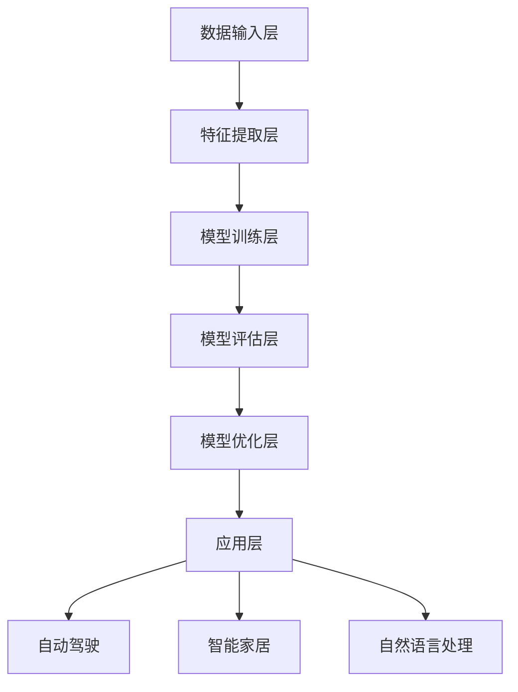

                 

### 1. 背景介绍

随着科技的飞速发展，人工智能（AI）已经成为了当今世界最具变革性和前景的领域之一。从自动驾驶汽车、智能家居到自然语言处理、图像识别，AI的应用已经渗透到了我们生活的方方面面。在这个大背景下，越来越多的创业者将目光投向了人工智能领域，希望在这场科技革命中抓住机遇，实现商业价值。

然而，人工智能创业并非易事。许多创业者面临着技术难题、资金压力、人才短缺等诸多挑战。为了帮助这些创业者更好地应对这些挑战，本文将探讨人工智能创业的核心问题，分享一些成功企业的经验，并提出一些实用的建议。

本文旨在为人工智能创业者提供以下帮助：

1. **了解人工智能的核心概念和最新发展趋势**：通过介绍人工智能的基本概念、主要分支和技术发展历程，使创业者对AI有更深入的了解。

2. **明确创业方向和目标**：分析不同领域的人工智能应用，帮助创业者找到适合自己的创业方向。

3. **掌握核心算法和关键技术**：详细介绍人工智能领域的关键算法和核心技术，帮助创业者提升技术实力。

4. **制定有效的商业策略**：分享成功企业的发展策略，为创业者提供商业上的指导。

5. **解决创业过程中的常见问题**：提供解决创业过程中可能遇到的问题的建议和方案。

通过这篇文章，我们希望创业者能够对人工智能创业有一个全面的认知，从而在激烈的市场竞争中脱颖而出。

### 2. 核心概念与联系

在深入探讨人工智能创业之前，我们需要先了解人工智能的核心概念和技术架构。以下是人工智能的一些关键概念和它们之间的关系，以及一个详细的 Mermaid 流程图来展示这些概念和技术的联系。

#### 2.1 人工智能基本概念

- **机器学习（Machine Learning）**：机器学习是人工智能的一个分支，主要研究如何让计算机从数据中自动学习，并做出决策或预测。它包括监督学习、无监督学习和强化学习等不同类型。

- **深度学习（Deep Learning）**：深度学习是机器学习的一个子领域，使用多层神经网络（例如卷积神经网络（CNN）、循环神经网络（RNN）等）进行数据分析和模式识别。

- **自然语言处理（Natural Language Processing，NLP）**：NLP 是人工智能的一个重要分支，主要研究如何使计算机理解和生成人类自然语言。

- **计算机视觉（Computer Vision）**：计算机视觉是人工智能的另一个重要分支，涉及图像和视频的处理、分析和理解。

#### 2.2 人工智能技术架构


在这个架构中，数据输入层是核心，它为算法提供训练和推理的数据。数据层之后是特征提取和模型训练层，包括机器学习和深度学习算法。这些算法将数据转化为特征表示，并通过训练模型来学习数据中的模式。

在模型训练层之后，是模型评估和优化层，通过验证集和测试集来评估模型的性能，并进行参数调整和优化。最后，是应用层，模型被部署到实际场景中，如自动驾驶、智能家居等。

#### 2.3 Mermaid 流程图



在这个 Mermaid 流程图中，每个节点代表一个技术层级或应用场景。箭头表示数据的流向，即从输入层到输出层的处理过程。通过这个流程图，我们可以清晰地看到人工智能技术的整体架构和各个部分之间的联系。

#### 2.4 关键概念和技术的联系

- **机器学习与深度学习的关系**：深度学习是机器学习的一种方法，它使用多层神经网络来提高学习效率和准确性。

- **自然语言处理与计算机视觉的关系**：NLP 和计算机视觉都是人工智能的应用领域，但它们分别处理不同的数据类型（文本和图像）。

- **模型评估与优化**：模型评估是确保模型性能的重要环节，而优化则是通过调整模型参数来提高性能。

通过理解这些核心概念和它们之间的联系，创业者可以更好地把握人工智能的发展趋势，选择适合自己项目的技术方向。

### 3. 核心算法原理 & 具体操作步骤

在了解了人工智能的基本概念和技术架构之后，接下来我们将深入探讨人工智能领域的一些核心算法原理，并详细介绍这些算法的具体操作步骤。以下是几个关键算法的概述。

#### 3.1 卷积神经网络（CNN）

卷积神经网络是计算机视觉领域的一种重要算法，用于图像分类、物体检测和图像分割等任务。CNN 的核心在于其独特的网络结构，包括卷积层、池化层和全连接层。

**步骤 1：卷积层**

卷积层通过卷积运算从输入图像中提取特征。具体操作如下：

1. 将卷积核（过滤器）在输入图像上滑动，进行卷积运算。
2. 对于每个位置，计算卷积核与输入图像局部区域的内积，并加上偏置项。
3. 使用激活函数（如ReLU函数）对卷积结果进行非线性变换。

**步骤 2：池化层**

池化层用于降低特征图的维度，减少计算量。常见池化操作有最大池化和平均池化。

1. 将特征图划分为非重叠的窗口。
2. 对每个窗口内的像素值进行最大值或平均值运算。
3. 保留操作结果，丢弃其他值。

**步骤 3：全连接层**

全连接层将池化层输出的特征图转化为类别概率分布。具体操作如下：

1. 将特征图的每个像素值展开成一维向量。
2. 将一维向量输入到全连接层，进行矩阵乘法和偏置运算。
3. 使用激活函数（如softmax函数）对输出进行分类。

#### 3.2 循环神经网络（RNN）

循环神经网络是自然语言处理领域的重要算法，适用于序列数据的建模，如文本生成、机器翻译和时间序列预测等。

**步骤 1：隐状态更新**

RNN 的核心是隐状态，它保存了上一时刻的信息，并传递给下一时刻。隐状态更新的步骤如下：

1. 输入序列的当前元素和上一个隐状态作为输入。
2. 通过矩阵乘法和非线性激活函数（如ReLU或tanh函数）计算新的隐状态。

**步骤 2：输出计算**

输出计算步骤如下：

1. 将隐状态作为输入，通过矩阵乘法和激活函数计算输出。
2. 对于序列生成任务，输出可以是单词或字符的概率分布。

#### 3.3 强化学习（Reinforcement Learning）

强化学习是用于决策问题的算法，通过试错和反馈来学习最优策略。

**步骤 1：环境建模**

1. 定义状态空间（S）和动作空间（A）。
2. 环境状态和动作的映射关系。

**步骤 2：策略更新**

1. 初始化策略参数。
2. 根据当前状态选择动作。
3. 执行动作，得到新的状态和奖励。
4. 使用奖励信号更新策略参数。

**步骤 3：策略优化**

1. 通过梯度下降或其他优化算法更新策略参数。
2. 重复步骤 2 和 3，直到达到满意的策略。

通过以上对卷积神经网络（CNN）、循环神经网络（RNN）和强化学习（Reinforcement Learning）的介绍，创业者可以了解这些核心算法的基本原理和操作步骤，为后续的创业项目提供技术支持。

### 4. 数学模型和公式 & 详细讲解 & 举例说明

在人工智能领域，数学模型和公式是理解核心算法原理和进行实际操作的关键。以下我们将详细介绍几个常见的数学模型和公式，并通过具体例子进行说明。

#### 4.1 卷积神经网络（CNN）的数学模型

卷积神经网络（CNN）的核心是卷积运算和池化操作。以下是这些操作的详细数学描述。

**卷积运算**

卷积运算可以表示为：

$$
\text{output}(i,j) = \sum_{k=1}^{K} w_{ik} \cdot \text{input}(i-k+1,j-k+1) + b_k
$$

其中，$i$ 和 $j$ 表示输出特征图上的位置，$k$ 表示卷积核上的位置，$w_{ik}$ 是卷积核上的权重，$b_k$ 是卷积核的偏置项，$\text{input}(i,j)$ 是输入特征图上的像素值。

**举例说明**

假设输入特征图的大小为 $3 \times 3$，卷积核的大小为 $2 \times 2$。以下是一个简化的例子：

$$
\begin{array}{ccc}
\text{input}: & \text{1 0 0} \\
             & \text{0 1 0} \\
             & \text{0 0 1} \\
\end{array}
$$

$$
\begin{array}{cc}
\text{filter}: & \text{1 0} \\
               & \text{0 1} \\
\end{array}
$$

$$
\text{output}(1,1) = (1 \cdot 1 + 0 \cdot 0 + 0 \cdot 0) + (0 \cdot 1 + 1 \cdot 1 + 0 \cdot 0) + (0 \cdot 0 + 0 \cdot 1 + 1 \cdot 1) = 1 + 1 + 1 = 3
$$

**池化操作**

池化操作通常用于降低特征图的维度。最大池化操作的公式如下：

$$
p(i,j) = \max_{k,l} \text{input}(i+k-1,j+l-1)
$$

其中，$i$ 和 $j$ 表示输出特征图上的位置，$k$ 和 $l$ 表示窗口大小。

**举例说明**

假设输入特征图的大小为 $3 \times 3$，窗口大小为 $2 \times 2$。以下是一个简化的例子：

$$
\begin{array}{ccc}
\text{input}: & \text{1 0 0} \\
             & \text{0 1 0} \\
             & \text{0 0 1} \\
\end{array}
$$

$$
\text{output}(1,1) = \max(\text{1, 0, 0}, \text{0, 1, 0}, \text{0, 0, 1}) = 1
$$

#### 4.2 循环神经网络（RNN）的数学模型

循环神经网络（RNN）的核心是隐状态的计算和输出。以下是这些操作的详细数学描述。

**隐状态更新**

隐状态更新的公式如下：

$$
h_t = \sigma(W_h \cdot [h_{t-1}, x_t] + b_h)
$$

其中，$h_t$ 是当前时间步的隐状态，$x_t$ 是当前输入，$\sigma$ 是非线性激活函数（如ReLU或tanh函数），$W_h$ 是权重矩阵，$b_h$ 是偏置项。

**举例说明**

假设输入序列为 $\text{[1, 2, 3]}$，隐状态初始值为 $\text{[0.1, 0.2]}$，权重矩阵 $W_h$ 和偏置项 $b_h$ 分别为 $\text{[0.3, 0.4], [0.5, 0.6]}$。以下是一个简化的例子：

$$
h_1 = \sigma(0.3 \cdot [0.1, 0.2] + 0.4 \cdot 1 + 0.5) = \sigma(0.03 + 0.08 + 0.5) = \sigma(0.61) \approx 0.8
$$

$$
h_2 = \sigma(0.3 \cdot [0.8, 2] + 0.4 \cdot 2 + 0.5) = \sigma(0.24 + 0.08 + 0.5) = \sigma(0.82) \approx 0.9
$$

$$
h_3 = \sigma(0.3 \cdot [0.9, 3] + 0.4 \cdot 3 + 0.5) = \sigma(0.27 + 0.12 + 0.5) = \sigma(0.89) \approx 0.9
$$

**输出计算**

输出计算的公式如下：

$$
y_t = \sigma(W_o \cdot h_t + b_o)
$$

其中，$y_t$ 是当前时间步的输出，$W_o$ 是权重矩阵，$b_o$ 是偏置项。

**举例说明**

假设输出权重矩阵 $W_o$ 和偏置项 $b_o$ 分别为 $\text{[0.6, 0.7], [0.8, 0.9]}$。以下是一个简化的例子：

$$
y_1 = \sigma(0.6 \cdot 0.8 + 0.7) = \sigma(0.48 + 0.7) = \sigma(1.18) \approx 0.86
$$

$$
y_2 = \sigma(0.6 \cdot 0.9 + 0.7) = \sigma(0.54 + 0.7) = \sigma(1.24) \approx 0.89
$$

$$
y_3 = \sigma(0.6 \cdot 0.9 + 0.7) = \sigma(0.54 + 0.7) = \sigma(1.24) \approx 0.89
$$

通过以上对卷积神经网络（CNN）和循环神经网络（RNN）的数学模型和公式的详细介绍及举例说明，创业者可以更好地理解这些核心算法，从而为实际项目提供技术支持。

### 5. 项目实战：代码实际案例和详细解释说明

在本节中，我们将通过一个实际的项目实战案例来展示如何将前述核心算法应用到具体项目中，并详细解释代码的实现过程。

#### 5.1 开发环境搭建

在进行项目实战之前，我们需要搭建一个合适的开发环境。以下是一个基于 Python 和 TensorFlow 的简化开发环境搭建步骤。

1. **安装 Python**：确保已安装 Python 3.6 或更高版本。

2. **安装 TensorFlow**：使用 pip 命令安装 TensorFlow：

   ```bash
   pip install tensorflow
   ```

3. **创建虚拟环境**：为了管理项目依赖，我们可以创建一个虚拟环境：

   ```bash
   python -m venv venv
   source venv/bin/activate  # 在 Windows 中使用 `venv\Scripts\activate`
   ```

4. **安装其他依赖**：根据项目需要，安装其他依赖，例如 NumPy、Pandas 等。

#### 5.2 源代码详细实现和代码解读

以下是一个简单的图像分类项目，使用卷积神经网络（CNN）进行训练和预测。

**源代码：**

```python
import tensorflow as tf
from tensorflow.keras import datasets, layers, models

# 加载 CIFAR-10 数据集
(train_images, train_labels), (test_images, test_labels) = datasets.cifar10.load_data()

# 数据预处理
train_images, test_images = train_images / 255.0, test_images / 255.0

# 构建卷积神经网络模型
model = models.Sequential()
model.add(layers.Conv2D(32, (3, 3), activation='relu', input_shape=(32, 32, 3)))
model.add(layers.MaxPooling2D((2, 2)))
model.add(layers.Conv2D(64, (3, 3), activation='relu'))
model.add(layers.MaxPooling2D((2, 2)))
model.add(layers.Conv2D(64, (3, 3), activation='relu'))

# 添加全连接层
model.add(layers.Flatten())
model.add(layers.Dense(64, activation='relu'))
model.add(layers.Dense(10, activation='softmax'))

# 编译模型
model.compile(optimizer='adam',
              loss='sparse_categorical_crossentropy',
              metrics=['accuracy'])

# 训练模型
model.fit(train_images, train_labels, epochs=10)

# 评估模型
test_loss, test_acc = model.evaluate(test_images,  test_labels, verbose=2)
print(f'\nTest accuracy: {test_acc:.4f}')
```

**代码解读：**

1. **数据集加载与预处理**：

   ```python
   (train_images, train_labels), (test_images, test_labels) = datasets.cifar10.load_data()
   train_images, test_images = train_images / 255.0, test_images / 255.0
   ```

   加载 CIFAR-10 数据集，并进行归一化处理。CIFAR-10 是一个常用的图像分类数据集，包含 10 个类别，每类 6000 张图像。

2. **模型构建**：

   ```python
   model = models.Sequential()
   model.add(layers.Conv2D(32, (3, 3), activation='relu', input_shape=(32, 32, 3)))
   model.add(layers.MaxPooling2D((2, 2)))
   model.add(layers.Conv2D(64, (3, 3), activation='relu'))
   model.add(layers.MaxPooling2D((2, 2)))
   model.add(layers.Conv2D(64, (3, 3), activation='relu'))

   model.add(layers.Flatten())
   model.add(layers.Dense(64, activation='relu'))
   model.add(layers.Dense(10, activation='softmax'))
   ```

   构建一个简单的 CNN 模型。模型包括两个卷积层，每个卷积层后接一个池化层，然后是全连接层。最后一层使用 softmax 激活函数进行类别预测。

3. **模型编译**：

   ```python
   model.compile(optimizer='adam',
                 loss='sparse_categorical_crossentropy',
                 metrics=['accuracy'])
   ```

   编译模型，指定优化器、损失函数和评估指标。

4. **模型训练**：

   ```python
   model.fit(train_images, train_labels, epochs=10)
   ```

   使用训练数据集训练模型，指定训练轮数。

5. **模型评估**：

   ```python
   test_loss, test_acc = model.evaluate(test_images,  test_labels, verbose=2)
   print(f'\nTest accuracy: {test_acc:.4f}')
   ```

   使用测试数据集评估模型性能，输出测试准确率。

#### 5.3 代码解读与分析

通过对上述代码的详细解读，我们可以了解到整个项目的基本流程。以下是对代码关键部分的进一步分析：

1. **模型构建**：

   CNN 的核心在于其层次结构，包括卷积层、池化层和全连接层。每一层都有特定的功能：

   - **卷积层**：通过卷积运算提取图像特征。卷积核在输入图像上滑动，计算局部区域的特征响应。
   - **池化层**：用于降低特征图的维度，减少参数数量，提高模型效率。常用的池化操作有最大池化和平均池化。
   - **全连接层**：将特征图展平为一维向量，通过线性变换进行类别预测。最后一层使用 softmax 激活函数将输出转化为类别概率分布。

2. **数据预处理**：

   数据预处理是模型训练的重要步骤。归一化处理将输入数据的范围缩放到 [0, 1]，有助于加速模型收敛。

3. **模型编译**：

   编译模型是配置优化器、损失函数和评估指标。优化器用于调整模型参数，损失函数用于度量模型预测与真实标签之间的差距，评估指标用于衡量模型性能。

4. **模型训练**：

   模型训练通过前向传播和后向传播更新模型参数，以最小化损失函数。训练轮数（epochs）用于控制训练过程。

5. **模型评估**：

   使用测试数据集评估模型性能，输出测试准确率。这有助于了解模型在实际数据上的表现。

通过这个实际案例，创业者可以了解到如何将人工智能算法应用到具体项目中，并掌握基本的项目开发流程。

### 6. 实际应用场景

人工智能（AI）技术已经广泛应用于各个领域，并带来了巨大的商业价值。以下是一些典型的人工智能实际应用场景，以及它们如何为创业项目提供机会和挑战。

#### 6.1 自动驾驶

自动驾驶是人工智能领域的热点之一。通过结合计算机视觉、深度学习和传感器技术，自动驾驶系统能够实时感知环境，做出智能决策。这一技术正在改变交通运输行业，为创业者提供了以下机会：

- **市场机会**：随着无人驾驶技术的成熟，自动驾驶车辆将逐步取代传统燃油车，为公共交通、物流运输和出租车行业带来变革。
- **技术挑战**：实现高精度、高可靠性的自动驾驶系统需要克服复杂的感知、决策和执行问题。此外，还需要解决数据隐私、法律法规等挑战。

#### 6.2 自然语言处理

自然语言处理（NLP）技术使得计算机能够理解和生成人类语言。在人工智能创业中，NLP 应用场景广泛，包括语音识别、机器翻译、智能客服等。以下是一些具体应用：

- **市场机会**：随着智能手机和智能设备的普及，智能语音助手和智能客服需求日益增长。为创业者提供了开发智能交互解决方案的机会。
- **技术挑战**：实现高效、准确的语音识别和自然语言理解需要处理大量的语音数据和复杂的语言结构。此外，语音合成和语音识别技术的实时性也是一个挑战。

#### 6.3 医疗保健

人工智能在医疗保健领域有着广泛的应用，包括疾病预测、诊断辅助、药物研发等。以下是一些具体应用：

- **市场机会**：随着人口老龄化和医疗需求增长，人工智能技术在医疗领域的应用潜力巨大。为创业者提供了开发智能医疗解决方案的机会。
- **技术挑战**：医疗数据复杂且具有高度敏感性，实现准确、可靠的疾病预测和诊断需要大量的高质量数据和高性能计算。

#### 6.4 金融科技

人工智能技术在金融科技领域也有着广泛的应用，包括信用评估、风险控制、智能投顾等。以下是一些具体应用：

- **市场机会**：金融行业的数据量庞大，人工智能技术可以帮助金融机构提高数据处理效率，降低运营成本。为创业者提供了开发智能金融解决方案的机会。
- **技术挑战**：金融行业的法规和合规要求高，实现智能金融解决方案需要确保系统的安全性和合规性。

#### 6.5 智能家居

智能家居是人工智能应用的一个重要领域，通过物联网技术，将各种家电设备连接起来，实现智能化控制。以下是一些具体应用：

- **市场机会**：随着消费者对智能家居的需求增加，智能家居市场潜力巨大。为创业者提供了开发智能家电和智能家居解决方案的机会。
- **技术挑战**：实现智能家居系统需要处理大量的设备和数据，同时保证系统的安全性和稳定性。

通过以上实际应用场景的分析，创业者可以找到适合自己的创业方向，并根据市场需求和技术挑战制定相应的商业策略。

### 7. 工具和资源推荐

在人工智能创业过程中，掌握合适的工具和资源至关重要。以下是一些学习资源、开发工具和框架的推荐，帮助创业者提升技术能力，加速项目进展。

#### 7.1 学习资源推荐

1. **书籍**：

   - 《深度学习》（Deep Learning），作者：Ian Goodfellow、Yoshua Bengio 和 Aaron Courville。
   - 《Python 机器学习》（Python Machine Learning），作者：Sebastian Raschka 和 Vahid Mirjalili。
   - 《自然语言处理综论》（Speech and Language Processing），作者：Daniel Jurafsky 和 James H. Martin。

2. **在线课程**：

   - Coursera 上的“机器学习”课程，由 Andrew Ng 教授主讲。
   - edX 上的“深度学习专项课程”，由 University of Washington 和 Duke University 联合提供。
   - Udacity 上的“人工智能纳米学位”，包括自然语言处理和计算机视觉等领域。

3. **博客与网站**：

   - Ardan Labs（ardanlabs.com）：提供大量机器学习和深度学习的教程和实践案例。
   - Fast.ai（fast.ai）：提供免费的深度学习课程，适合初学者。
   - TensorFlow 官方文档（tensorflow.org）：包含丰富的教程和 API 文档。

#### 7.2 开发工具框架推荐

1. **编程语言**：

   - Python：由于其丰富的库和强大的社区支持，Python 是人工智能开发的主要语言。
   - R：特别适用于统计分析和数据挖掘。

2. **机器学习库**：

   - TensorFlow：Google 开发的开源机器学习框架，支持多种深度学习模型。
   - PyTorch：Facebook AI Research 开发，具有动态计算图和灵活的模型构建能力。
   - Scikit-learn：Python 的开源机器学习库，提供多种经典机器学习算法。

3. **深度学习框架**：

   - Keras：基于 TensorFlow 和 Theano 的开源深度学习库，提供简单、直观的接口。
   - PyTorch：如前所述，支持动态计算图，灵活且易于使用。
   - Caffe：由 Berkeley Vision and Learning Center（BVLC）开发，适合图像识别任务。

4. **数据预处理工具**：

   - Pandas：用于数据清洗、转换和分析的 Python 库。
   - NumPy：提供高性能的数值计算和矩阵操作。
   - Matplotlib：用于数据可视化，支持多种图表类型。

5. **开发环境**：

   - Jupyter Notebook：交互式开发环境，方便代码编写、调试和演示。
   - Conda：用于环境管理和依赖管理的工具，支持 Python 和 R 等多种语言。
   - Docker：容器化技术，用于创建和管理独立的开发环境。

通过以上工具和资源的推荐，创业者可以更好地掌握人工智能技术，提高开发效率，从而在竞争中脱颖而出。

### 8. 总结：未来发展趋势与挑战

人工智能（AI）作为当今最具变革性的技术之一，正以前所未有的速度发展。在未来的几年中，人工智能预计将在更多领域实现突破，带来深远的商业和社会影响。然而，在这一过程中，创业者也将面临一系列挑战。

#### 8.1 未来发展趋势

1. **AI 技术的普及化**：随着计算能力的提升和算法的优化，人工智能技术将变得更加普及。从智能家居到医疗健康，从金融科技到制造业，AI 将深入渗透到各个行业，推动产业升级。

2. **自主决策系统的成熟**：人工智能将从辅助决策走向自主决策。通过深度学习和强化学习等技术，AI 系统将具备更高的智能水平，能够在复杂环境中自主做出决策。

3. **数据驱动的发展**：数据的获取、存储和处理能力将进一步提高。人工智能的发展离不开数据，未来将出现更多数据驱动的创新应用，例如个性化推荐、精准营销等。

4. **跨学科的融合**：人工智能将与生物学、心理学、社会学等多个学科融合，推动人类对智能本质的理解和探索。这种跨学科的融合将带来新的研究方法和应用模式。

5. **全球竞争加剧**：随着人工智能技术的普及和应用，全球范围内的人工智能竞争将愈发激烈。各国政府和企业纷纷加大对人工智能的投资和研发力度，以抢占科技制高点。

#### 8.2 未来挑战

1. **技术难题**：人工智能技术的发展仍面临诸多技术难题，例如如何实现更高效、更准确的学习算法，如何处理大规模、异构的数据集，如何确保算法的公平性和透明性等。

2. **数据隐私和安全**：随着人工智能应用的普及，数据隐私和安全问题将日益凸显。如何在保障用户隐私的同时，充分利用数据的价值，是一个重要的挑战。

3. **法律法规和伦理**：人工智能的快速发展引发了诸多法律法规和伦理问题。如何制定合适的法律法规，保障人工智能的健康发展，同时保护公民的权益，是一个亟待解决的问题。

4. **人才短缺**：人工智能领域对人才的需求巨大，但现有的人才储备尚无法满足需求。如何培养和吸引更多的人才，将成为人工智能创业企业面临的重大挑战。

5. **经济结构调整**：人工智能的普及将对传统行业带来冲击，可能导致部分职业的消失和就业结构的调整。如何适应这一变化，实现经济结构的优化，是一个重要的课题。

总之，人工智能创业的未来充满机遇与挑战。创业者需要紧跟技术发展趋势，积极应对各种挑战，才能在激烈的市场竞争中脱颖而出，实现商业成功。

### 9. 附录：常见问题与解答

在人工智能创业过程中，创业者可能会遇到各种问题。以下是一些常见问题及解答，帮助创业者解决实际操作中的困难。

#### 9.1 如何获取高质量的数据集？

**解答**：获取高质量的数据集是人工智能项目成功的关键。以下是一些建议：

1. **公开数据集**：许多学术机构和公司会分享数据集，如 Kaggle、UCI Machine Learning Repository 等。
2. **数据清洗**：如果无法获取现成的数据集，可以通过爬虫技术获取数据，然后进行清洗、去重和格式化处理。
3. **合作共享**：与其他研究者或企业合作，共享数据集，以提升数据集的质量和规模。

#### 9.2 如何评估模型性能？

**解答**：评估模型性能是模型训练的重要环节。以下是一些常用的评估指标：

1. **准确率（Accuracy）**：模型正确预测的比例。
2. **召回率（Recall）**：模型正确识别的正例占总正例的比例。
3. **精确率（Precision）**：模型正确识别的正例占总预测正例的比例。
4. **F1 分数（F1 Score）**：精确率和召回率的调和平均数。

此外，还可以使用混淆矩阵（Confusion Matrix）和 ROC-AUC 曲线（Receiver Operating Characteristic-Area Under Curve）来进一步分析模型性能。

#### 9.3 如何处理过拟合问题？

**解答**：过拟合是机器学习中的一个常见问题，可以通过以下方法来缓解：

1. **交叉验证（Cross Validation）**：通过交叉验证来评估模型的泛化能力。
2. **正则化（Regularization）**：如 L1 正则化、L2 正则化，可以减少模型复杂度。
3. **数据增强（Data Augmentation）**：通过增加数据多样性来提高模型的泛化能力。
4. **Dropout（丢弃法）**：在网络训练过程中随机丢弃一部分神经元，以防止过拟合。

#### 9.4 如何选择合适的模型？

**解答**：选择合适的模型取决于具体任务和数据集。以下是一些选择模型的建议：

1. **理解任务**：明确任务类型（如分类、回归、聚类等），以及任务的具体需求（如实时性、准确性等）。
2. **比较性能**：在相同数据集上测试不同模型的性能，选择性能最优的模型。
3. **考虑数据规模**：对于大规模数据集，选择能够处理大规模数据的模型。
4. **平衡复杂度和性能**：选择在数据规模和计算资源之间找到平衡的模型。

通过以上解答，创业者可以更好地应对人工智能创业过程中的常见问题，提高项目成功率。

### 10. 扩展阅读 & 参考资料

为了进一步深入了解人工智能创业，以下是推荐的一些扩展阅读和参考资料，涵盖人工智能的基础知识、技术发展、应用案例以及创业策略等多个方面。

#### 10.1 书籍推荐

1. **《人工智能：一种现代的方法》（Artificial Intelligence: A Modern Approach）**，作者：Stuart J. Russell 和 Peter Norvig。这是一本经典的人工智能教科书，详细介绍了人工智能的基本概念、算法和技术。
2. **《深度学习》（Deep Learning）**，作者：Ian Goodfellow、Yoshua Bengio 和 Aaron Courville。这本书是深度学习领域的权威著作，适合对深度学习有深入了解的读者。
3. **《Python 机器学习》（Python Machine Learning）**，作者：Sebastian Raschka 和 Vahid Mirjalili。这本书通过 Python 语言，深入讲解了机器学习的核心概念和算法。

#### 10.2 在线课程和教程

1. **Coursera 上的“机器学习”课程**，由 Andrew Ng 教授主讲。这门课程是深度学习领域的经典课程，适合初学者和进阶者。
2. **Udacity 上的“深度学习纳米学位”**，涵盖深度学习的基础知识和实践应用。
3. **fast.ai 的免费课程**，适合没有编程基础的初学者，通过简单的语言介绍深度学习的基础。

#### 10.3 论文和报告

1. **《自然语言处理综论》（Speech and Language Processing）**，作者：Daniel Jurafsky 和 James H. Martin。这是一本关于自然语言处理领域的重要著作，适合对 NLP 有深入了解的读者。
2. **Google Brain 的论文集**，包括《Recurrent Neural Networks for Speech Recognition》、《BERT: Pre-training of Deep Bidirectional Transformers for Language Understanding》等，展示了最新的研究成果。
3. **《AI for Everyone》报告**，由 AI for Everyone 项目组发布，探讨了人工智能的广泛影响和应用。

#### 10.4 博客和网站

1. **Ardan Labs（ardanlabs.com）**，提供大量机器学习和深度学习的教程和实践案例。
2. **Fast.ai（fast.ai）**，提供免费的深度学习课程，适合初学者。
3. **TensorFlow 官方文档（tensorflow.org）**，包含丰富的教程和 API 文档，适合开发者。

通过阅读这些书籍、课程、论文和博客，创业者可以更全面地了解人工智能领域的最新动态和发展趋势，从而为自己的创业项目提供有力支持。

