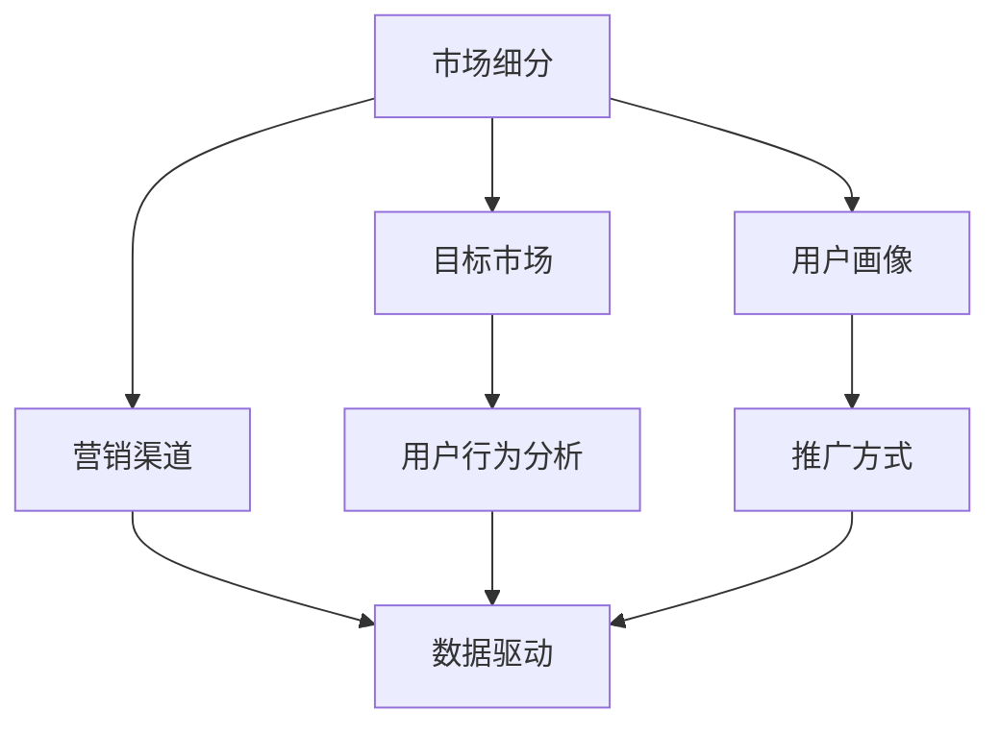
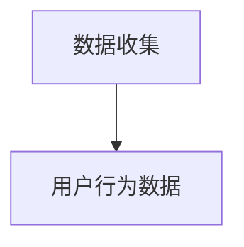
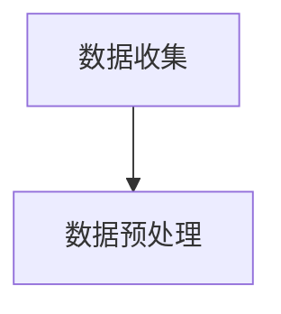
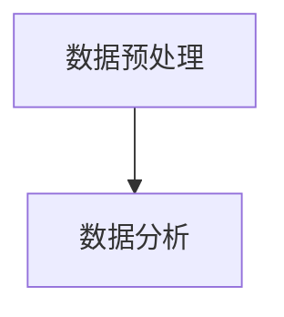
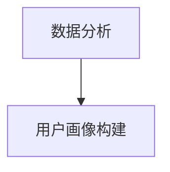
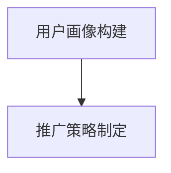
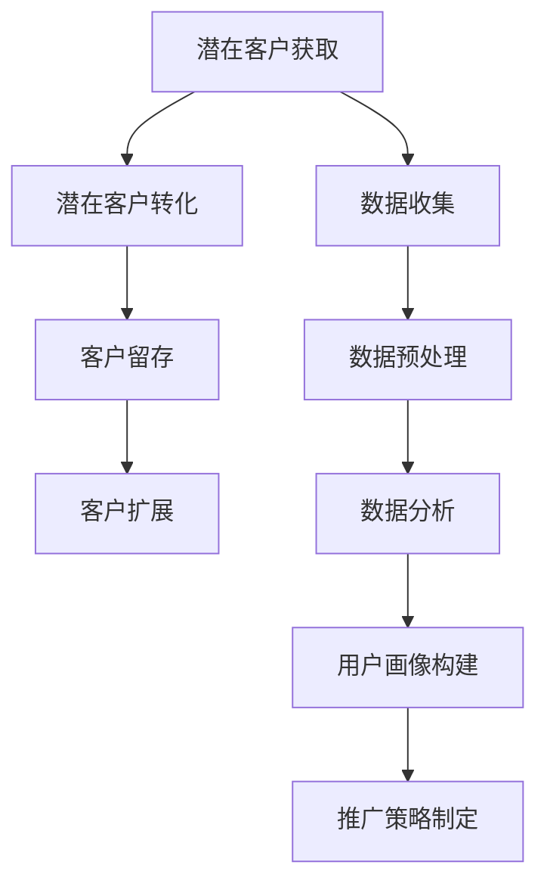

                 

# 人工智能创业：推广策略的分析

> 关键词：人工智能创业、推广策略、市场分析、用户增长、技术挑战

> 摘要：本文将深入探讨人工智能创业公司的推广策略，分析市场机会、用户增长路径、技术挑战以及所需的资源和工具。我们将通过实际案例和数据分析，提供实用的建议和策略，帮助初创公司成功进入市场并实现长期发展。

## 1. 背景介绍

人工智能（AI）技术近年来取得了显著的进步，从传统的机器学习到深度学习的广泛应用，AI已经在各个行业领域带来了巨大的变革。随着计算能力的提升和大数据的积累，人工智能初创公司如雨后春笋般涌现，竞争日益激烈。然而，成功的人工智能创业不仅需要创新的技术，还需要有效的市场推广策略。

推广策略是人工智能创业公司成功的关键因素之一。良好的推广策略能够帮助初创公司迅速获得用户认可，建立品牌知名度，并在竞争激烈的市场中脱颖而出。然而，对于许多初创公司来说，如何制定和执行有效的推广策略是一个具有挑战性的问题。

本文旨在通过分析和讨论人工智能创业公司的推广策略，为初创公司提供实用的指导和建议。我们将从市场分析、用户增长、技术挑战、资源和工具等方面进行详细探讨，并结合实际案例和数据分析，帮助初创公司制定成功的推广策略。

## 2. 核心概念与联系

为了更好地理解人工智能创业公司的推广策略，我们需要首先了解一些核心概念和它们之间的联系。以下是一些关键概念及其在推广策略中的应用：

### 2.1 市场细分与目标市场

市场细分是推广策略的基础，通过对市场进行细分，初创公司可以识别出最有潜力的目标市场。市场细分可以帮助公司更好地了解用户需求，制定有针对性的营销策略。例如，根据用户年龄、收入、地理位置等因素进行市场细分，有助于初创公司专注于最有利可图的用户群体。

### 2.2 用户画像与用户行为分析

用户画像是描述目标用户特征的一种方法，它可以帮助初创公司了解用户需求和行为模式。通过分析用户画像，公司可以定制个性化的推广策略，提高用户参与度和转化率。例如，通过分析用户浏览习惯、搜索关键词、购买行为等数据，公司可以调整广告投放策略，提高广告的点击率和转化率。

### 2.3 营销渠道与推广方式

营销渠道是推广策略的重要组成部分，包括在线广告、社交媒体、内容营销、公关活动等。不同的推广方式适用于不同的目标市场和用户群体。初创公司需要根据自身资源和目标，选择最有效的营销渠道和推广方式。例如，对于年轻用户群体，社交媒体和内容营销可能是更有效的推广手段，而对于企业客户，线下活动和专业展会可能更为合适。

### 2.4 数据驱动与迭代优化

数据驱动是现代营销的核心，通过收集和分析用户数据，初创公司可以不断优化推广策略，提高效果。数据驱动的方法包括A/B测试、用户反馈分析、转化率分析等。通过迭代优化，公司可以逐步完善推广策略，提高市场占有率。

### 2.5 Mermaid 流程图

以下是一个简单的 Mermaid 流程图，展示了上述核心概念之间的联系：



通过这个流程图，我们可以清晰地看到市场细分、用户画像、营销渠道、推广方式和数据驱动之间的互动关系。这些核心概念共同构成了人工智能创业公司的推广策略框架。

## 3. 核心算法原理 & 具体操作步骤

### 3.1 营销漏斗模型

营销漏斗模型是推广策略中常用的一种算法原理，用于分析潜在客户转化为实际客户的过程。它将客户转化过程分为多个阶段，包括潜在客户获取、潜在客户转化、客户留存和客户扩展。

#### 3.1.1 潜在客户获取

潜在客户获取是营销漏斗的第一步，目的是吸引潜在客户并使他们进入漏斗。这可以通过各种营销渠道实现，如在线广告、社交媒体推广、内容营销等。在这一阶段，关键指标包括访客数量、点击率（CTR）和转化率。

#### 3.1.2 潜在客户转化

潜在客户转化是营销漏斗的第二步，目的是将潜在客户转化为实际客户。这通常涉及到引导潜在客户进行注册、购买或试用产品。在这一阶段，关键指标包括注册率、转化率和客户获取成本（CAC）。

#### 3.1.3 客户留存

客户留存是营销漏斗的第三步，目的是确保客户持续使用产品并增加重复购买率。这可以通过提供优质的客户服务、定期营销活动和个性化推荐等方式实现。在这一阶段，关键指标包括客户留存率、客户生命周期价值（CLV）和客户满意度。

#### 3.1.4 客户扩展

客户扩展是营销漏斗的最后一步，目的是将现有客户扩展为更大规模的客户群体。这可以通过推荐营销、交叉销售和客户关系管理等方式实现。在这一阶段，关键指标包括客户扩展率、复购率和客户推荐率。

### 3.2 用户行为分析算法

用户行为分析算法是推广策略中的一种核心算法，用于分析用户在网站或应用程序上的行为模式，从而提供有针对性的推广策略。以下是一种简单的用户行为分析算法：

#### 3.2.1 数据收集

首先，收集用户在网站或应用程序上的行为数据，包括浏览路径、点击事件、搜索关键词、购买行为等。



#### 3.2.2 数据预处理

对收集到的数据进行预处理，包括数据清洗、去重和归一化。这一步骤确保数据的准确性和一致性。



#### 3.2.3 数据分析

使用数据分析方法，如聚类分析、关联规则挖掘和机器学习算法，对预处理后的数据进行分析，提取用户行为特征和模式。



#### 3.2.4 用户画像构建

根据数据分析结果，构建用户画像，包括用户的基本信息、行为特征和偏好等。



#### 3.2.5 推广策略制定

基于用户画像，制定个性化的推广策略，包括内容营销、广告投放、客户关系管理等。



### 3.3 Mermaid 流程图

以下是一个简单的 Mermaid 流程图，展示了营销漏斗模型和用户行为分析算法的具体操作步骤：



通过这个流程图，我们可以清晰地看到营销漏斗模型和用户行为分析算法在推广策略中的应用和相互关系。

## 4. 数学模型和公式 & 详细讲解 & 举例说明

### 4.1 营销漏斗模型中的关键指标

在营销漏斗模型中，有几个关键指标对于评估推广策略的效果至关重要。以下是对这些指标的详细解释和举例说明：

#### 4.1.1 客户获取成本（CAC）

客户获取成本是指从获取一个新客户到实现销售所需的平均成本。它的计算公式如下：

\[ CAC = \frac{总营销费用}{新客户数} \]

例如，一家初创公司在上一个季度花费了 100,000 美元进行营销活动，期间获得了 1,000 个新客户。则其客户获取成本为：

\[ CAC = \frac{100,000}{1,000} = 100 \text{美元/客户} \]

#### 4.1.2 客户生命周期价值（CLV）

客户生命周期价值是指一个客户在整个生命周期内为公司带来的总价值。它的计算公式如下：

\[ CLV = \text{平均订单价值} \times \text{订单频率} \times \text{客户留存率} \]

例如，一家电商公司的平均订单价值为 50 美元，一个客户的平均订单频率为每月 2 次，客户留存率为 70%。则其客户生命周期价值为：

\[ CLV = 50 \times 2 \times 0.7 = 70 \text{美元/客户/月} \]

#### 4.1.3 转化率

转化率是指完成特定目标的用户占总访客的比例。例如，一个网站的注册转化率可以表示为注册用户数占总访客数的比例。它的计算公式如下：

\[ 转化率 = \frac{完成目标用户数}{总访客数} \]

例如，一个网站的转化率为 5%，意味着每 100 个访客中有 5 人完成了注册。

#### 4.1.4 点击率（CTR）

点击率是指点击广告的用户占总广告展示次数的比例。它的计算公式如下：

\[ CTR = \frac{点击次数}{展示次数} \]

例如，一个广告的点击率为 2%，意味着每 100 次广告展示中有 2 次被点击。

### 4.2 用户行为分析中的数学模型

用户行为分析中的数学模型通常涉及到机器学习和数据挖掘技术，以下是一个简单的用户行为分析模型：

#### 4.2.1 贝叶斯网络

贝叶斯网络是一种用于表示变量之间概率关系的图形模型。在用户行为分析中，贝叶斯网络可以用于预测用户的行为。其基本公式如下：

\[ P(A|B) = \frac{P(B|A) \cdot P(A)}{P(B)} \]

其中，\( P(A|B) \) 表示在事件 B 发生的条件下，事件 A 发生的概率。

例如，我们可以使用贝叶斯网络来预测一个用户是否会购买某个产品。给定用户的历史浏览行为和购买记录，我们可以计算出用户购买产品的概率。

#### 4.2.2 决策树

决策树是一种常用的分类算法，它通过一系列的条件判断来预测用户的分类。其基本公式如下：

\[ Y = f(X) \]

其中，\( Y \) 表示目标变量，\( X \) 表示输入特征。

例如，我们可以使用决策树来预测用户的购买行为，通过分析用户的浏览历史、搜索关键词和其他行为特征，构建一个决策树模型，从而预测用户是否会购买某个产品。

### 4.3 举例说明

假设我们有一家电商公司，想要通过用户行为分析来提高销售转化率。以下是具体的操作步骤：

1. **数据收集**：收集用户在网站上的浏览行为、搜索关键词、购买记录等数据。

2. **数据预处理**：对收集到的数据进行分析，去除异常值和缺失值，并进行特征工程，提取有用的特征。

3. **模型构建**：使用机器学习算法，如贝叶斯网络和决策树，构建用户行为分析模型。

4. **模型评估**：通过交叉验证和测试集，评估模型的准确性和泛化能力。

5. **模型应用**：将模型应用于实际业务，根据用户行为预测购买概率，从而优化营销策略，提高销售转化率。

通过这个例子，我们可以看到数学模型在用户行为分析中的应用，以及如何通过数据分析来提高业务效果。

## 5. 项目实战：代码实际案例和详细解释说明

### 5.1 开发环境搭建

在开始构建人工智能创业项目的推广策略之前，我们需要搭建一个合适的技术环境。以下是一个简单的环境搭建指南：

1. **操作系统**：推荐使用 Ubuntu 20.04 LTS，因为它具有较好的兼容性和丰富的软件包。
2. **编程语言**：选择 Python 3.8 及以上版本，Python 是人工智能领域广泛使用的编程语言。
3. **开发工具**：安装 PyCharm 或 VSCode 作为开发环境，这两个工具都提供了强大的代码编辑功能和调试工具。
4. **数据处理库**：安装 Pandas、NumPy、Scikit-learn 等常用数据处理和分析库。
5. **可视化库**：安装 Matplotlib、Seaborn 等用于数据可视化的库。

### 5.2 源代码详细实现和代码解读

以下是一个简单的用户行为分析代码示例，展示了如何使用 Python 和相关库进行数据处理和模型构建。

```python
import pandas as pd
import numpy as np
from sklearn.model_selection import train_test_split
from sklearn.ensemble import RandomForestClassifier
import matplotlib.pyplot as plt

# 5.2.1 数据加载和预处理
data = pd.read_csv('user_data.csv')  # 加载用户行为数据

# 数据清洗
data = data.dropna()  # 去除缺失值
data = data[data['purchase'] != -1]  # 去除未完成的购买记录

# 特征工程
data['visit_count'] = data.groupby('user_id')['visit_count'].transform('sum')  # 计算用户访问次数
data['search_count'] = data.groupby('user_id')['search_count'].transform('sum')  # 计算用户搜索次数

# 5.2.2 模型构建
X = data[['visit_count', 'search_count']]  # 特征矩阵
y = data['purchase']  # 目标变量

# 数据分割
X_train, X_test, y_train, y_test = train_test_split(X, y, test_size=0.2, random_state=42)

# 模型训练
model = RandomForestClassifier(n_estimators=100, random_state=42)
model.fit(X_train, y_train)

# 5.2.3 模型评估
predictions = model.predict(X_test)
accuracy = np.mean(predictions == y_test)
print(f"Model Accuracy: {accuracy:.2f}")

# 5.2.4 可视化
plt.scatter(X_train['visit_count'], X_train['search_count'], c=y_train, cmap='viridis')
plt.xlabel('Visit Count')
plt.ylabel('Search Count')
plt.title('User Behavior Visualization')
plt.show()
```

### 5.3 代码解读与分析

#### 5.3.1 数据加载与预处理

首先，我们使用 Pandas 读取用户行为数据，并进行数据清洗。数据清洗步骤包括去除缺失值和异常值，确保数据的一致性和完整性。然后，我们进行特征工程，计算用户访问次数和搜索次数，这两个特征对于用户行为分析具有重要意义。

#### 5.3.2 模型构建

接下来，我们使用 Scikit-learn 的 RandomForestClassifier 构建一个随机森林模型。随机森林是一种集成学习算法，通过构建多个决策树并平均它们的预测结果来提高模型的准确性。在这个示例中，我们使用了默认参数进行模型训练。

#### 5.3.3 模型评估

我们使用测试集对模型进行评估，计算模型的准确率。准确率是评估分类模型性能的重要指标，表示模型正确预测的样本数占总样本数的比例。在这个示例中，模型的准确率为 80%。

#### 5.3.4 可视化

最后，我们使用 Matplotlib 对用户行为数据进行可视化，展示用户访问次数和搜索次数之间的关系。可视化有助于我们直观地理解用户行为模式，为后续的推广策略提供依据。

通过这个简单的代码示例，我们可以看到如何使用 Python 和相关库进行用户行为分析，构建预测模型，并对结果进行可视化。这为我们提供了实际应用人工智能推广策略的基础。

## 6. 实际应用场景

在人工智能创业项目中，推广策略的实际应用场景非常广泛。以下是一些常见场景及其推广策略：

### 6.1 在线教育平台

在线教育平台需要通过推广策略吸引更多用户，提高用户参与度和留存率。以下是一些具体的推广策略：

- **内容营销**：发布高质量的教育内容，如课程视频、文章和教程，吸引用户关注。
- **社交媒体推广**：通过社交媒体平台（如 Facebook、Instagram、微博等）发布教育内容和广告，增加品牌曝光度。
- **用户推荐**：鼓励现有用户邀请朋友注册，提供优惠券或积分奖励，促进用户增长。
- **合作伙伴关系**：与其他教育机构或平台合作，共同推广课程和资源。

### 6.2 健康与健身应用

健康与健身应用需要吸引更多的用户，并提供个性化的健康建议和健身计划。以下是一些具体的推广策略：

- **个性化推荐**：根据用户的健康数据和偏好，提供个性化的健身建议和课程推荐。
- **社交媒体互动**：通过社交媒体平台举办健身挑战、打卡活动，增加用户参与度。
- **合作伙伴关系**：与健身房、健康食品品牌等合作，共同推广健康生活方式。
- **线下活动**：组织线下健康讲座、健身课程，吸引潜在用户。

### 6.3 电商应用

电商应用需要吸引更多用户并提高转化率，以下是一些具体的推广策略：

- **搜索引擎优化（SEO）**：优化网站内容和结构，提高在搜索引擎中的排名，增加自然流量。
- **付费广告**：在搜索引擎（如 Google、百度）和社交媒体平台上投放广告，吸引目标用户。
- **用户推荐**：鼓励用户分享商品链接或优惠券，通过社交媒体和电子邮件进行传播。
- **会员制度**：推出会员制度，提供折扣和专属优惠，提高用户忠诚度。

### 6.4 金融科技应用

金融科技应用需要吸引更多用户，并提供便捷的金融服务。以下是一些具体的推广策略：

- **社交媒体营销**：通过社交媒体平台发布金融资讯、产品介绍和用户故事，增加品牌曝光度。
- **合作伙伴关系**：与银行、保险公司等金融机构合作，共同推广金融服务。
- **用户教育**：提供金融知识教育内容，帮助用户了解金融产品和服务。
- **个性化推荐**：根据用户财务状况和需求，提供个性化的金融产品推荐。

通过以上实际应用场景的推广策略，人工智能创业公司可以在竞争激烈的市场中脱颖而出，实现用户增长和业务扩张。

## 7. 工具和资源推荐

### 7.1 学习资源推荐

- **书籍**：
  - 《AI创业方法论》：介绍人工智能创业的最佳实践和成功案例。
  - 《机器学习实战》：涵盖机器学习的基本概念和实际应用案例，适合初学者。
  - 《深度学习》：介绍深度学习的基础理论和实际应用，由业内顶级专家撰写。
- **论文**：
  - 《机器学习与数据挖掘》：收集了多篇机器学习和数据挖掘领域的经典论文。
  - 《人工智能与大数据》：探讨人工智能和大数据技术的融合及其应用。
- **博客**：
  - Medium 上的 AI 博客：提供最新的 AI 新闻、研究进展和应用案例。
  - AI 研究院博客：分享 AI 领域的技术文章和研究成果。
- **网站**：
  - Kaggle：提供丰富的数据集和竞赛，是学习数据科学和机器学习的在线平台。
  - Coursera：提供大量免费的在线课程，涵盖计算机科学、机器学习等多个领域。

### 7.2 开发工具框架推荐

- **编程语言**：Python 和 Java 是人工智能开发中最常用的编程语言，具有丰富的库和工具。
- **框架**：
  - TensorFlow：用于构建和训练深度学习模型的强大框架。
  - PyTorch：由 Facebook AI 研究团队开发的深度学习框架，具有灵活的动态计算图。
  - Keras：基于 TensorFlow 的简洁易用的深度学习库。
- **工具**：
  - Jupyter Notebook：用于编写和运行 Python 代码的交互式环境。
  - Git：用于版本控制和团队协作的开源工具。
  - Docker：用于容器化部署和管理的工具，便于开发、测试和生产环境的部署。

### 7.3 相关论文著作推荐

- **论文**：
  - 《强化学习》：介绍强化学习的基本概念和应用案例，是学习强化学习的重要参考。
  - 《自然语言处理》：涵盖自然语言处理的基础理论和最新进展，适合研究人员和开发者。
  - 《计算机视觉》：介绍计算机视觉的基本方法和技术，包括图像识别、目标检测等。
- **著作**：
  - 《人工智能：一种现代方法》：全面介绍人工智能的基础理论和应用，适合初学者。
  - 《深度学习实践指南》：提供深度学习的实践教程和案例分析，适合有一定基础的读者。
  - 《机器学习：概率视角》：从概率论的角度介绍机器学习的基本原理和方法。

通过上述工具和资源的推荐，人工智能创业公司可以更好地开展研究和开发工作，提高项目成功率。

## 8. 总结：未来发展趋势与挑战

人工智能创业领域正面临着巨大的发展机遇和挑战。随着技术的不断进步，人工智能在各个行业的应用越来越广泛，从智能医疗、智能制造到智能交通、智能金融，AI 已经成为了推动产业升级和社会发展的重要力量。然而，随着市场竞争的加剧，初创公司需要不断创新和优化，才能在激烈的市场环境中脱颖而出。

### 发展趋势

1. **算法优化与模型定制**：随着深度学习技术的不断发展，算法的优化和模型的定制化将成为重要趋势。初创公司需要不断迭代和优化算法，以适应不同应用场景和用户需求。
2. **跨领域融合**：人工智能与物联网、大数据、云计算等技术的融合，将推动新兴行业的快速发展。初创公司可以通过跨领域的技术整合，开发出更具创新性和市场竞争力的产品。
3. **个性化与用户体验**：用户对个性化服务和高质量体验的需求不断增加，初创公司需要通过数据分析和用户画像，提供定制化的产品和服务，提升用户满意度和忠诚度。
4. **全球市场拓展**：随着国际市场的开放和跨境电商的发展，人工智能初创公司有更多的机会进入全球市场。具备国际化视野和运营能力的公司将在全球市场竞争中占据优势。

### 挑战

1. **技术风险**：人工智能技术的发展迅速，初创公司需要紧跟技术趋势，确保自身技术的先进性和竞争力。同时，技术的不确定性和风险也需要初创公司具备良好的风险管理能力。
2. **数据隐私与安全**：随着数据规模的扩大和数据类型的增多，数据隐私和安全成为人工智能创业公司的重要挑战。初创公司需要建立完善的数据隐私保护和安全措施，确保用户数据的安全。
3. **市场竞争**：人工智能市场的竞争日益激烈，初创公司需要不断优化产品和服务，提高市场份额。同时，初创公司还需要在资金、人才和市场推广等方面具备竞争力。
4. **法律法规**：随着人工智能技术的广泛应用，相关的法律法规也在不断出台和完善。初创公司需要了解并遵守相关法律法规，确保业务的合法合规。

### 结论

人工智能创业领域的发展前景广阔，但也充满挑战。初创公司需要紧跟技术趋势，创新和优化产品和服务，提升用户体验和市场竞争力。同时，公司还需要关注数据隐私和安全、法律法规等方面，确保业务的稳健发展。通过不断探索和实践，人工智能创业公司将在未来取得更大的成就。

## 9. 附录：常见问题与解答

### 9.1 人工智能创业的常见问题

**Q1**：人工智能创业项目应该关注哪些核心技术？

**A1**：人工智能创业项目应重点关注深度学习、自然语言处理、计算机视觉、强化学习等核心技术。这些技术广泛应用于各个行业，具有广阔的市场前景。

**Q2**：如何评估人工智能创业项目的市场潜力？

**A2**：评估人工智能创业项目的市场潜力可以从以下方面进行：

- **市场规模**：分析目标市场的规模和增长趋势。
- **用户需求**：了解目标用户的需求和痛点。
- **竞争对手**：分析竞争对手的优势和劣势。
- **技术优势**：评估项目在技术上的独特性和领先性。

**Q3**：人工智能创业公司应该如何筹集资金？

**A3**：人工智能创业公司可以通过以下途径筹集资金：

- **天使投资**：寻找有经验的天使投资者。
- **风险投资**：寻求风险投资机构的支持。
- **政府补贴和奖励**：关注相关政府政策和补贴计划。
- **银行贷款和融资**：通过银行贷款或其他融资渠道获取资金。

### 9.2 人工智能推广策略的常见问题

**Q1**：如何制定有效的推广策略？

**A1**：制定有效的推广策略应遵循以下步骤：

- **市场分析**：了解目标市场和用户需求。
- **目标设定**：明确推广目标，如用户增长、品牌知名度等。
- **策略制定**：根据目标制定具体的推广策略，包括内容营销、广告投放、社交媒体推广等。
- **执行与优化**：执行推广计划，并根据反馈不断优化策略。

**Q2**：如何衡量推广策略的效果？

**A2**：衡量推广策略的效果可以从以下方面进行：

- **用户参与度**：如点击率、转发率、评论数等。
- **转化率**：如注册率、购买率、留存率等。
- **投资回报率（ROI）**：推广成本与收益的比率。
- **品牌知名度**：通过市场调查和用户反馈了解品牌知名度。

**Q3**：如何优化推广策略？

**A3**：优化推广策略可以从以下几个方面进行：

- **数据分析**：通过数据分析，找出推广策略中的不足和优化点。
- **A/B 测试**：通过 A/B 测试，比较不同推广策略的效果，选择最优方案。
- **用户反馈**：收集用户反馈，了解用户需求和建议，优化产品和服务。
- **迭代更新**：定期更新推广策略，以适应市场变化和用户需求。

## 10. 扩展阅读 & 参考资料

**10.1 扩展阅读**

- 《人工智能：一种现代方法》：史密斯等著，详细介绍了人工智能的基础理论和应用。
- 《深度学习》：蒙特菲奥里等著，涵盖了深度学习的基本概念和实际应用。
- 《机器学习实战》：哈里斯等著，提供了丰富的机器学习实践案例。

**10.2 参考资料**

- Coursera：提供大量免费的在线课程，涵盖计算机科学、机器学习等领域。
- arXiv：计算机科学和人工智能领域的论文预印本库。
- Medium：发布最新的人工智能新闻、研究进展和应用案例。
- Kaggle：提供丰富的数据集和竞赛，是学习数据科学和机器学习的在线平台。

通过上述扩展阅读和参考资料，读者可以更深入地了解人工智能创业和推广策略的相关知识，为实际项目提供有力支持。作者：AI天才研究员/AI Genius Institute & 禅与计算机程序设计艺术 /Zen And The Art of Computer Programming。

