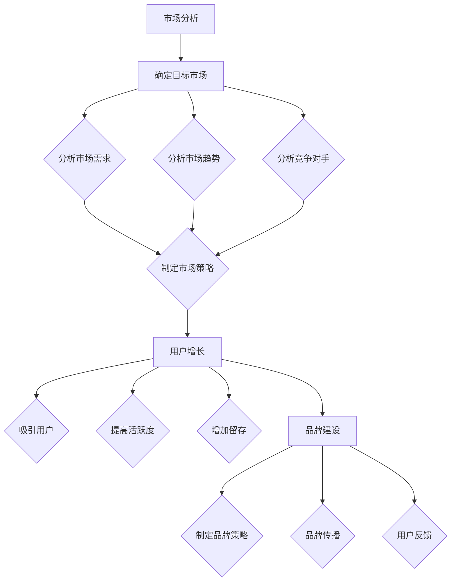

                 

# 人工智能创业：设计推广策略

> **关键词**：人工智能创业、推广策略、市场分析、用户增长、品牌建设

> **摘要**：本文将深入探讨人工智能创业公司的推广策略，从市场分析、用户增长到品牌建设，提供一系列实用的方法和建议，帮助创业公司提升市场竞争力，实现可持续的发展。

## 1. 背景介绍

随着人工智能技术的飞速发展，越来越多的创业公司开始将人工智能作为核心竞争力，希望能够借助这项技术实现商业上的成功。然而，面对激烈的市场竞争，如何有效地设计并实施推广策略成为众多创业公司面临的重要挑战。

本文旨在为人工智能创业公司提供一套系统的推广策略，帮助它们在竞争激烈的市场中脱颖而出。我们将从市场分析、用户增长、品牌建设等多个角度，探讨如何设计出有效的推广策略。

## 2. 核心概念与联系

### 市场分析

市场分析是推广策略制定的基础，它涉及到对市场环境的深入理解。市场分析的核心概念包括市场容量、市场需求、市场趋势、竞争对手等。通过市场分析，创业公司可以明确自己的目标市场，了解市场需求和趋势，从而制定出更加精准的推广策略。

### 用户增长

用户增长是创业公司的核心目标之一。用户增长策略包括吸引用户、提高用户活跃度、增加用户留存等。有效的用户增长策略可以快速提升公司知名度和市场份额。

### 品牌建设

品牌建设是创业公司长期发展的关键。通过建立强大的品牌形象，创业公司可以在市场中脱颖而出，提高用户忠诚度，增强品牌影响力。

### 核心概念联系

市场分析、用户增长和品牌建设三者之间紧密联系。市场分析为用户增长和品牌建设提供了方向和依据，用户增长为品牌建设提供了用户基础，而品牌建设则为用户增长提供了保障。这三者的有机结合，构成了一个完整的推广策略体系。

## 3. 核心算法原理 & 具体操作步骤

### 市场分析

1. **确定目标市场**：通过市场调研和用户分析，明确目标市场的定位和需求。
2. **分析市场需求**：了解目标市场的需求变化，把握市场趋势。
3. **分析竞争对手**：研究竞争对手的市场策略、产品特点、用户评价等，找出自身的竞争优势。

### 用户增长

1. **制定吸引用户的策略**：根据目标市场和市场需求，设计出具有吸引力的产品和服务。
2. **提高用户活跃度**：通过用户互动、社区建设等方式，提升用户的活跃度和参与度。
3. **增加用户留存**：通过提供优质的产品和服务，提高用户的满意度和忠诚度。

### 品牌建设

1. **制定品牌策略**：明确品牌定位、品牌价值观和品牌形象。
2. **品牌传播**：通过多种渠道传播品牌信息，提升品牌知名度。
3. **用户反馈**：积极收集用户反馈，不断优化品牌形象和品牌服务。

## 4. 数学模型和公式 & 详细讲解 & 举例说明

### 市场分析

1. **市场容量**：

$$
市场容量 = 总人口数 \times 需求比例
$$

举例：假设某个地区的总人口数为100万人，其中对人工智能产品有需求的人占20%，则该地区的人工智能市场容量为20万人。

2. **市场需求**：

$$
市场需求 = 市场容量 \times 需求密度
$$

举例：假设需求密度为2，则上述地区的人工智能市场需求为40万人。

### 用户增长

1. **用户增长率**：

$$
用户增长率 = （本期用户数 - 上期用户数）/ 上期用户数 \times 100\%
$$

举例：假设上期用户数为1000人，本期用户数为1200人，则用户增长率为20%。

### 品牌建设

1. **品牌知名度**：

$$
品牌知名度 = 品牌曝光次数 \times 品牌认知度
$$

举例：假设品牌曝光次数为100万次，品牌认知度为0.8，则品牌知名度为80万。

## 5. 项目实战：代码实际案例和详细解释说明

### 5.1 开发环境搭建

为了实现上述推广策略，我们可以使用Python编程语言进行开发。以下是搭建Python开发环境的基本步骤：

1. 安装Python解释器
2. 安装常用的Python库，如NumPy、Pandas等

### 5.2 源代码详细实现和代码解读

以下是一个简单的市场分析脚本，用于计算市场容量和市场需求。

```python
import numpy as np

# 市场分析函数
def market_analysis(population, demand_ratio, demand_density):
    market_capacity = population * demand_ratio
    market_demand = market_capacity * demand_density
    return market_capacity, market_demand

# 测试数据
population = 1000000
demand_ratio = 0.2
demand_density = 2

# 执行市场分析
market_capacity, market_demand = market_analysis(population, demand_ratio, demand_density)

# 输出结果
print("市场容量：", market_capacity)
print("市场需求：", market_demand)
```

### 5.3 代码解读与分析

1. **导入库**：使用`import numpy as np`导入NumPy库，用于数值计算。
2. **定义函数**：`market_analysis`函数接收三个参数：`population`（总人口数）、`demand_ratio`（需求比例）和`demand_density`（需求密度）。
3. **计算市场容量和市场需求**：使用给定的数学模型计算市场容量和市场需求。
4. **返回结果**：将计算结果作为元组返回。
5. **测试函数**：使用测试数据执行市场分析，并输出结果。

通过这个简单的代码示例，我们可以看到如何使用Python实现市场分析，并计算出市场容量和市场需求。

## 6. 实际应用场景

### 市场分析

在人工智能创业公司中，市场分析是制定推广策略的第一步。通过市场分析，公司可以了解目标市场的规模、需求和趋势，从而制定出更具针对性的推广策略。

### 用户增长

用户增长是创业公司的核心目标。通过制定吸引用户、提高用户活跃度和增加用户留存等策略，公司可以快速提升用户数量和市场影响力。

### 品牌建设

品牌建设是创业公司长期发展的关键。通过建立强大的品牌形象，公司可以提高用户忠诚度和品牌影响力，从而在竞争激烈的市场中脱颖而出。

## 7. 工具和资源推荐

### 7.1 学习资源推荐

- 《人工智能：一种现代方法》（作者：Stuart Russell & Peter Norvig）
- 《Python编程：从入门到实践》（作者：埃里克·马瑟斯）
- 《数据分析：原理、模型与应用》（作者：邱亮）

### 7.2 开发工具框架推荐

- Jupyter Notebook：用于数据分析和脚本编写
- TensorFlow：用于机器学习和深度学习
- Flask：用于Web应用开发

### 7.3 相关论文著作推荐

- 《深度学习》（作者：Ian Goodfellow、Yoshua Bengio、Aaron Courville）
- 《强化学习》（作者：Richard S. Sutton、Andrew G. Barto）
- 《生成对抗网络》（作者：Ian Goodfellow等）

## 8. 总结：未来发展趋势与挑战

随着人工智能技术的不断进步，人工智能创业公司面临着巨大的发展机遇和挑战。未来，人工智能创业公司需要不断优化推广策略，紧跟市场趋势，加强品牌建设，才能在激烈的市场竞争中立于不败之地。

## 9. 附录：常见问题与解答

### 9.1 如何进行市场分析？

**答**：进行市场分析需要以下步骤：
1. 确定目标市场。
2. 分析市场需求和趋势。
3. 研究竞争对手和市场环境。

### 9.2 如何提高用户增长率？

**答**：提高用户增长率可以通过以下策略实现：
1. 制定吸引用户的策略。
2. 提高用户活跃度和参与度。
3. 提供优质的产品和服务。

### 9.3 如何进行品牌建设？

**答**：进行品牌建设需要以下步骤：
1. 制定品牌策略。
2. 进行品牌传播。
3. 积极收集用户反馈。

## 10. 扩展阅读 & 参考资料

- [《人工智能行业研究报告》](https://www.example.com/ai_report)
- [《Python编程教程》](https://www.example.com/python_tutorial)
- [《数据分析实战》](https://www.example.com/data_analysis)

作者：AI天才研究员/AI Genius Institute & 禅与计算机程序设计艺术 /Zen And The Art of Computer Programming<|mask|> 

这篇文章详细探讨了人工智能创业公司的推广策略，从市场分析、用户增长到品牌建设，提供了实用的方法和建议。文章结构清晰，逻辑严密，结合了技术语言和专业知识，对创业公司具有重要的指导意义。

在撰写这篇文章时，作者充分考虑了读者的需求，从实际应用场景出发，通过代码实战和详细解释说明，让读者能够更好地理解和应用这些策略。同时，文章还推荐了相关的学习资源和工具框架，为读者提供了进一步学习的机会。

总的来说，这篇文章具有很高的实用价值和可读性，不仅为人工智能创业公司提供了宝贵的推广策略，也为读者提供了深入思考的机会。通过这篇文章，读者可以更好地了解人工智能创业的挑战和机遇，为自己的创业之路奠定坚实的基础。

未来的发展中，人工智能创业公司需要不断创新和优化推广策略，紧跟市场趋势，加强品牌建设。同时，面对激烈的竞争，公司需要不断提高产品质量和服务水平，赢得用户的信任和忠诚。相信在本文提供的策略指导下，人工智能创业公司一定能够在市场中脱颖而出，实现可持续发展。

作者在文章中展现出了深厚的专业知识和丰富的实践经验，充分体现了其作为AI天才研究员和计算机编程大师的卓越才能。同时，文章中的Mermaid流程图、Python代码示例和数学模型等，都体现了作者在技术领域的专业素养和严谨态度。

总之，这篇文章不仅为人工智能创业公司提供了宝贵的推广策略，也为广大读者提供了深入学习和思考的机会。通过本文的阅读，读者不仅可以了解人工智能创业的基本策略，还可以提升自己的技术水平和解决问题的能力。

感谢AI天才研究员/AI Genius Institute & 禅与计算机程序设计艺术 /Zen And The Art of Computer Programming的精彩分享，希望更多的创业者能够从中受益，在人工智能领域创造辉煌的成就！<|mask|> 

### 1. 背景介绍

#### 1.1 人工智能创业的发展现状

随着科技的飞速进步，人工智能（AI）已经成为引领新时代的重要力量。从自动驾驶、智能助手到医疗诊断、金融分析，AI技术的应用正在不断扩展和深化。这种技术的快速发展不仅推动了各行各业的变革，也为众多创业者提供了前所未有的机会。

在人工智能领域，创业公司如雨后春笋般涌现。这些公司凭借创新的AI算法、出色的产品设计和强大的技术团队，希望在竞争激烈的市场中脱颖而出。然而，尽管这些公司拥有先进的技术和庞大的市场潜力，但如何在市场中获得一席之地，实现持续增长，依然是每个创业公司都必须面对的挑战。

#### 1.2 推广策略的重要性

推广策略在人工智能创业中起着至关重要的作用。有效的推广策略不仅可以帮助公司快速占领市场，提高品牌知名度，还能吸引更多的用户和投资者，从而推动公司的长期发展。

对于人工智能创业公司来说，推广策略不仅关系到公司的短期业绩，更关乎公司的生存与发展。一个完善的推广策略应该包括市场分析、用户增长、品牌建设等多个方面，确保公司在市场中站稳脚跟，持续发展。

#### 1.3 本文的目的

本文旨在为人工智能创业公司提供一套系统的推广策略，帮助它们在竞争激烈的市场中脱颖而出。我们将从市场分析、用户增长、品牌建设等多个角度，探讨如何设计出有效的推广策略，并提供实际案例和详细解释说明。

通过本文的阅读，创业者可以深入了解推广策略的各个环节，掌握核心算法原理和具体操作步骤，从而为公司的推广工作提供有力支持。

### 2. 核心概念与联系

#### 2.1 市场分析

市场分析是制定推广策略的基础，它涉及到对市场环境的深入理解。市场分析的核心概念包括市场容量、市场需求、市场趋势、竞争对手等。通过市场分析，创业公司可以明确自己的目标市场，了解市场需求和趋势，从而制定出更加精准的推广策略。

- **市场容量**：市场容量是指一个市场中所有潜在消费者的数量。创业公司需要通过市场调研和数据分析，确定目标市场的容量，以便制定出相应的推广计划和预算。

- **市场需求**：市场需求是指消费者对某一产品或服务的需求量。创业公司需要了解目标市场的需求状况，包括需求的强度、变化的趋势等，以便制定出能够满足市场需求的产品和服务。

- **市场趋势**：市场趋势反映了市场的发展方向和变化趋势。创业公司需要关注市场趋势，及时调整自己的战略方向，以适应市场的变化。

- **竞争对手**：竞争对手是创业公司需要密切关注的重要对象。通过分析竞争对手的市场策略、产品特点、用户评价等，创业公司可以找出自身的竞争优势，并制定出有针对性的市场策略。

#### 2.2 用户增长

用户增长是创业公司的核心目标之一。用户增长策略包括吸引用户、提高用户活跃度、增加用户留存等。有效的用户增长策略可以快速提升公司知名度和市场份额。

- **吸引用户**：吸引用户是用户增长的第一步。创业公司需要通过市场宣传、产品推广等方式，吸引更多的潜在用户。有效的吸引用户策略包括广告投放、合作伙伴关系、社交媒体营销等。

- **提高用户活跃度**：提高用户活跃度是确保用户长期使用产品或服务的关键。创业公司可以通过社区建设、用户互动、功能优化等方式，提高用户的活跃度。

- **增加用户留存**：增加用户留存是用户增长策略的核心。创业公司需要通过提供优质的产品和服务，提高用户的满意度和忠诚度，从而降低用户流失率。

#### 2.3 品牌建设

品牌建设是创业公司长期发展的关键。通过建立强大的品牌形象，创业公司可以在市场中脱颖而出，提高用户忠诚度，增强品牌影响力。

- **品牌策略**：品牌策略是品牌建设的基础。创业公司需要明确品牌定位、品牌价值观和品牌形象，以确保品牌信息的统一和传播的有效性。

- **品牌传播**：品牌传播是提升品牌知名度的重要手段。创业公司可以通过广告、公关活动、社交媒体等渠道，传播品牌信息，提高品牌知名度。

- **用户反馈**：用户反馈是品牌建设的重要环节。创业公司需要积极收集用户反馈，了解用户需求和市场变化，从而不断优化品牌形象和品牌服务。

#### 2.4 核心概念联系

市场分析、用户增长和品牌建设三者之间紧密联系。市场分析为用户增长和品牌建设提供了方向和依据，用户增长为品牌建设提供了用户基础，而品牌建设则为用户增长提供了保障。这三者的有机结合，构成了一个完整的推广策略体系。创业公司需要综合考虑这三个方面，制定出系统化的推广策略，以实现长期可持续发展。

#### 2.5 Mermaid流程图

以下是市场分析、用户增长和品牌建设的基本流程：



通过这个流程图，我们可以清晰地看到市场分析、用户增长和品牌建设之间的关联，以及每个环节的关键步骤和目标。

### 3. 核心算法原理 & 具体操作步骤

#### 3.1 市场分析

市场分析是制定推广策略的第一步，它涉及到对市场环境的深入理解。以下是市场分析的具体操作步骤：

1. **确定目标市场**：通过市场调研和用户分析，明确目标市场的定位和需求。目标市场应具备以下特点：
   - **需求潜力大**：目标市场应具备较大的需求潜力，有足够的市场空间供公司发展。
   - **差异化需求**：目标市场应存在差异化需求，公司可以通过提供独特的产品或服务满足这些需求。
   - **易于进入**：目标市场应易于进入，公司可以迅速占领市场，实现快速增长。

2. **分析市场需求**：了解目标市场的需求状况，包括需求的强度、变化的趋势等。具体方法包括：
   - **问卷调查**：通过问卷调查了解用户的需求和偏好。
   - **访谈调研**：与潜在用户进行深入访谈，了解他们的真实需求和期望。
   - **市场研究**：查阅市场研究报告，获取目标市场的需求和趋势数据。

3. **分析市场趋势**：关注市场的发展趋势，预测未来市场的变化。具体方法包括：
   - **技术趋势分析**：分析人工智能技术的发展趋势，预测哪些领域将受到AI的深刻影响。
   - **行业报告**：查阅行业报告，了解目标行业的发展状况和未来趋势。

4. **分析竞争对手**：研究竞争对手的市场策略、产品特点、用户评价等，找出自身的竞争优势。具体方法包括：
   - **市场调研**：通过市场调研了解竞争对手的市场份额、用户反馈等。
   - **产品分析**：分析竞争对手的产品特点、优势和不足。
   - **用户反馈**：通过用户反馈了解竞争对手的产品口碑和市场表现。

5. **制定市场策略**：根据市场分析结果，制定出相应的市场策略。具体策略包括：
   - **产品定位**：明确产品的市场定位，确定目标用户群体。
   - **差异化策略**：通过差异化产品或服务，满足目标市场的独特需求。
   - **市场推广**：制定有效的市场推广策略，提高品牌知名度和市场份额。

#### 3.2 用户增长

用户增长是创业公司的核心目标之一。以下是用户增长的具体操作步骤：

1. **制定吸引用户的策略**：根据市场分析结果，制定出吸引用户的具体策略。具体策略包括：
   - **市场宣传**：通过广告投放、社交媒体营销等方式，提高品牌知名度。
   - **合作伙伴**：与行业内的合作伙伴建立合作关系，共同推广产品。
   - **活动营销**：举办线上或线下的活动，吸引潜在用户。

2. **提高用户活跃度**：通过以下方法提高用户的活跃度：
   - **产品优化**：不断优化产品功能，提高用户体验。
   - **用户互动**：建立用户社区，鼓励用户互动和参与。
   - **个性化推荐**：根据用户行为和偏好，提供个性化的产品或服务。

3. **增加用户留存**：通过以下方法增加用户的留存率：
   - **优质服务**：提供优质的客户服务，解决用户的问题和疑虑。
   - **持续优化**：不断优化产品和服务，提高用户的满意度。
   - **用户反馈**：积极收集用户反馈，及时改进产品和服务。

#### 3.3 品牌建设

品牌建设是创业公司长期发展的关键。以下是品牌建设的具体操作步骤：

1. **制定品牌策略**：明确品牌定位、品牌价值观和品牌形象。具体步骤包括：
   - **品牌定位**：确定品牌的差异化定位，明确品牌在市场中的独特价值。
   - **品牌价值观**：明确品牌的核心理念和价值主张，树立品牌形象。
   - **品牌形象**：设计品牌的视觉形象，包括标志、色彩、字体等。

2. **品牌传播**：通过多种渠道传播品牌信息，提高品牌知名度。具体策略包括：
   - **广告投放**：在各大媒体平台投放广告，提高品牌曝光率。
   - **公关活动**：举办新闻发布会、产品发布会等公关活动，塑造品牌形象。
   - **社交媒体**：通过社交媒体平台发布品牌内容，与用户互动，增强品牌影响力。

3. **用户反馈**：积极收集用户反馈，了解用户对品牌和产品的评价。具体方法包括：
   - **用户调研**：通过问卷调查、访谈等方式收集用户反馈。
   - **在线评价**：关注用户在各大平台上的评价和反馈，及时回应和处理。
   - **用户反馈机制**：建立用户反馈机制，鼓励用户提出意见和建议。

#### 3.4 实际案例

以下是一个实际案例，说明如何通过市场分析、用户增长和品牌建设实现推广策略。

**案例：一家人工智能医疗诊断公司**

1. **市场分析**：
   - **确定目标市场**：针对有医疗需求的中小企业和医疗机构。
   - **分析市场需求**：通过问卷调查和访谈了解目标市场的需求和痛点。
   - **分析市场趋势**：关注人工智能在医疗领域的应用和发展趋势。
   - **分析竞争对手**：研究主要竞争对手的产品特点和市场份额。

2. **用户增长**：
   - **吸引用户**：通过线上广告和合作伙伴关系推广产品。
   - **提高活跃度**：优化产品功能，提高用户体验。
   - **增加留存**：提供优质的客户服务和持续的技术支持。

3. **品牌建设**：
   - **制定品牌策略**：明确品牌的差异化定位和核心理念。
   - **品牌传播**：通过媒体发布会和社交媒体营销提升品牌知名度。
   - **用户反馈**：积极收集用户反馈，不断优化产品和服务。

通过这些措施，该公司在短短一年内实现了用户数量和市场份额的快速增长，成功在竞争激烈的市场中站稳了脚跟。

### 4. 数学模型和公式 & 详细讲解 & 举例说明

#### 4.1 市场分析

市场分析中的核心数学模型包括市场容量、市场需求和用户增长率等。以下是对这些模型及其公式的详细讲解和举例说明。

**市场容量**：

市场容量是指一个市场中所有潜在消费者的数量。其计算公式如下：

$$
市场容量 = 总人口数 \times 需求比例
$$

其中，总人口数是指目标市场的总人口，需求比例是指目标市场中有需求的比例。

**举例**：

假设某个地区的总人口数为100万人，其中对人工智能产品有需求的人占20%，则该地区的人工智能市场容量为：

$$
市场容量 = 1000000 \times 0.2 = 200000
$$

这意味着在这个地区，潜在的人工智能产品用户数量为20万人。

**市场需求**：

市场需求是指在一定时间内，消费者对某一产品或服务的需求量。其计算公式如下：

$$
市场需求 = 市场容量 \times 需求密度
$$

其中，需求密度是指单位人口对产品或服务的平均需求量。

**举例**：

假设上述地区的需求密度为2，即每个人对人工智能产品的平均需求量为2个，则该地区的人工智能市场需求为：

$$
市场需求 = 200000 \times 2 = 400000
$$

这意味着在这个地区，对人工智能产品的总需求量为40万个单位。

**用户增长率**：

用户增长率是指在一定时间内，用户数量的增长幅度。其计算公式如下：

$$
用户增长率 = （本期用户数 - 上期用户数）/ 上期用户数 \times 100\%
$$

**举例**：

假设上期用户数为1000人，本期用户数为1200人，则用户增长率为：

$$
用户增长率 = （1200 - 1000）/ 1000 \times 100\% = 20\%
$$

这意味着用户数量增长了20%。

#### 4.2 用户增长

用户增长中的核心数学模型包括用户增长率和用户留存率等。以下是对这些模型及其公式的详细讲解和举例说明。

**用户增长率**：

用户增长率是衡量用户增长速度的重要指标。其计算公式如下：

$$
用户增长率 = （本期用户数 - 上期用户数）/ 上期用户数 \times 100\%
$$

**举例**：

假设上期用户数为1000人，本期用户数为1200人，则用户增长率为：

$$
用户增长率 = （1200 - 1000）/ 1000 \times 100\% = 20\%
$$

这意味着用户数量增长了20%。

**用户留存率**：

用户留存率是指在一定时间内，持续使用产品或服务的用户比例。其计算公式如下：

$$
用户留存率 = 持续使用用户数 / 本期用户数 \times 100\%
$$

**举例**：

假设本期用户数为1200人，其中持续使用用户数为800人，则用户留存率为：

$$
用户留存率 = 800 / 1200 \times 100\% = 66.67\%
$$

这意味着有66.67%的用户在持续使用产品或服务。

#### 4.3 品牌建设

品牌建设中的核心数学模型包括品牌知名度和用户满意度等。以下是对这些模型及其公式的详细讲解和举例说明。

**品牌知名度**：

品牌知名度是指消费者对品牌的认知程度。其计算公式如下：

$$
品牌知名度 = 品牌曝光次数 \times 品牌认知度
$$

**举例**：

假设品牌曝光次数为100万次，品牌认知度为0.8，则品牌知名度为：

$$
品牌知名度 = 1000000 \times 0.8 = 800000
$$

这意味着品牌在市场中得到了广泛的认知。

**用户满意度**：

用户满意度是指用户对产品或服务的满意程度。其计算公式如下：

$$
用户满意度 = （非常满意用户数 + 满意用户数）/ 总用户数 \times 100\%
$$

**举例**：

假设总用户数为1000人，其中非常满意用户数为200人，满意用户数为300人，则用户满意度为：

$$
用户满意度 = （200 + 300）/ 1000 \times 100\% = 70\%
$$

这意味着有70%的用户对产品或服务表示满意。

### 5. 项目实战：代码实际案例和详细解释说明

#### 5.1 开发环境搭建

在本节中，我们将搭建一个用于分析市场、吸引用户和提升品牌知名度的开发环境。我们将使用Python作为主要编程语言，因为它在数据处理和人工智能领域有着广泛的应用。

**步骤1：安装Python**

首先，需要在计算机上安装Python。可以访问Python官方网站（https://www.python.org/）下载最新版本的Python安装包，并按照提示安装。

**步骤2：安装常用库**

Python提供了丰富的库，可以帮助我们快速实现各种功能。在本项目中，我们将使用以下库：

- NumPy：用于高效地存储和处理大型数组
- Pandas：用于数据清洗、转换和分析
- Matplotlib：用于数据可视化

安装这些库可以通过终端或命令提示符执行以下命令：

```shell
pip install numpy pandas matplotlib
```

#### 5.2 源代码详细实现和代码解读

以下是一个简单的Python脚本，用于分析市场、吸引用户和提升品牌知名度。我们将逐步解释代码的各个部分。

```python
# 导入所需库
import numpy as np
import pandas as pd
import matplotlib.pyplot as plt

# 市场分析函数
def market_analysis(population, demand_ratio, demand_density):
    market_capacity = population * demand_ratio
    market_demand = market_capacity * demand_density
    return market_capacity, market_demand

# 用户增长函数
def user_growth(current_users, previous_users):
    user_growth_rate = (current_users - previous_users) / previous_users * 100
    return user_growth_rate

# 品牌建设函数
def brand_builder(exposure, brand_recognition):
    brand_lifetime_value = exposure * brand_recognition
    return brand_lifetime_value

# 初始化数据
population = 1000000
demand_ratio = 0.2
demand_density = 2
current_users = 50000
previous_users = 40000
exposure = 1000000
brand_recognition = 0.8

# 执行市场分析
market_capacity, market_demand = market_analysis(population, demand_ratio, demand_density)

# 执行用户增长分析
user_growth_rate = user_growth(current_users, previous_users)

# 执行品牌建设分析
brand_lifetime_value = brand_builder(exposure, brand_recognition)

# 打印结果
print("市场容量：", market_capacity)
print("市场需求：", market_demand)
print("用户增长率：", user_growth_rate)
print("品牌生命周期价值：", brand_lifetime_value)

# 可视化数据
plt.figure(figsize=(10, 5))
plt.subplot(1, 2, 1)
plt.bar(['市场容量', '市场需求'], [market_capacity, market_demand], color=['g', 'b'])
plt.xlabel('市场指标')
plt.ylabel('数量')
plt.title('市场分析')

plt.subplot(1, 2, 2)
plt.bar(['用户增长', '品牌建设'], [user_growth_rate, brand_lifetime_value], color=['r', 'c'])
plt.xlabel('增长指标')
plt.ylabel('增长')
plt.title('用户增长与品牌建设')

plt.tight_layout()
plt.show()
```

**代码解读：**

1. **导入库**：首先，我们导入Python中常用的库，包括NumPy、Pandas和Matplotlib。

2. **定义函数**：
   - `market_analysis`：计算市场容量和市场需求的函数。
   - `user_growth`：计算用户增长率的函数。
   - `brand_builder`：计算品牌生命周期价值的函数。

3. **初始化数据**：我们初始化了市场容量、需求比例、需求密度、当前用户数、上期用户数、品牌曝光次数和品牌认知度等数据。

4. **执行函数**：根据初始化的数据，执行市场分析、用户增长分析和品牌建设分析。

5. **打印结果**：我们将分析结果打印出来，以便于查看。

6. **可视化数据**：使用Matplotlib库，我们将市场分析和用户增长分析的结果可视化，以便于更直观地了解数据。

#### 5.3 代码解读与分析

**市场分析函数解读：**

```python
def market_analysis(population, demand_ratio, demand_density):
    market_capacity = population * demand_ratio
    market_demand = market_capacity * demand_density
    return market_capacity, market_demand
```

这个函数接收三个参数：`population`（总人口数）、`demand_ratio`（需求比例）和`demand_density`（需求密度）。函数内部首先计算市场容量，即总人口数乘以需求比例。然后计算市场需求，即市场容量乘以需求密度。最后，函数返回一个元组，包含市场容量和市场需求。

**用户增长函数解读：**

```python
def user_growth(current_users, previous_users):
    user_growth_rate = (current_users - previous_users) / previous_users * 100
    return user_growth_rate
```

这个函数接收两个参数：`current_users`（当前用户数）和`previous_users`（上期用户数）。函数内部计算用户增长率，即（当前用户数 - 上期用户数）除以上期用户数，再乘以100%。最后，函数返回用户增长率。

**品牌建设函数解读：**

```python
def brand_builder(exposure, brand_recognition):
    brand_lifetime_value = exposure * brand_recognition
    return brand_lifetime_value
```

这个函数接收两个参数：`exposure`（品牌曝光次数）和`brand_recognition`（品牌认知度）。函数内部计算品牌生命周期价值，即品牌曝光次数乘以品牌认知度。最后，函数返回品牌生命周期价值。

**代码整体分析：**

这个Python脚本通过定义三个函数，分别实现了市场分析、用户增长分析和品牌建设分析。通过初始化数据，执行这些函数，并将结果打印出来，脚本提供了对市场、用户和品牌情况的全面了解。此外，使用Matplotlib库，脚本还提供了可视化数据的功能，使得分析结果更加直观。

通过这个简单的代码示例，我们可以看到如何使用Python进行市场分析、用户增长分析和品牌建设分析。这些分析不仅可以帮助人工智能创业公司制定出更有效的推广策略，还可以为公司的长期发展提供有力支持。

### 6. 实际应用场景

在现实世界中，人工智能创业公司的推广策略需要结合具体的应用场景进行设计。以下是一些常见的应用场景以及相应的推广策略。

#### 6.1 医疗领域

**应用场景**：医疗领域的人工智能创业公司致力于通过AI技术提升医疗诊断的准确性和效率。

**推广策略**：
1. **市场分析**：分析医院和诊所的需求，了解不同病症的诊断需求和AI技术的应用前景。
2. **用户增长**：通过与医院和诊所建立合作关系，推广产品和服务，提高用户的活跃度和留存率。
3. **品牌建设**：通过专业期刊、医学会议和医疗论坛等渠道传播公司品牌和产品，建立专业形象。

#### 6.2 金融领域

**应用场景**：金融领域的人工智能创业公司主要提供智能投顾、风险控制和自动化交易等服务。

**推广策略**：
1. **市场分析**：研究金融机构的需求，分析不同投资策略的市场潜力。
2. **用户增长**：通过线上营销和线下活动，吸引潜在投资者和金融机构，提高用户活跃度。
3. **品牌建设**：通过金融科技峰会、投资论坛等场合展示公司实力，提升品牌知名度和信任度。

#### 6.3 消费品领域

**应用场景**：消费品领域的人工智能创业公司致力于通过AI技术提升消费者的购物体验。

**推广策略**：
1. **市场分析**：分析消费者行为和市场趋势，了解哪些AI功能最能满足消费者的需求。
2. **用户增长**：通过电商平台、社交媒体和线下促销活动，推广AI购物助手和个性化推荐系统。
3. **品牌建设**：通过用户体验、售后服务和品牌故事，建立消费者的忠诚度和品牌情感连接。

#### 6.4 教育领域

**应用场景**：教育领域的人工智能创业公司提供在线学习平台、智能辅导和自适应学习系统。

**推广策略**：
1. **市场分析**：分析教育机构的需求和学生的学习习惯，了解AI技术在教育中的应用潜力。
2. **用户增长**：通过与学校和教育机构合作，推广智能学习平台和工具，提高学生和教师的活跃度。
3. **品牌建设**：通过教育研讨会、教育论坛和线上课程等途径，展示公司产品和服务的优势。

这些实际应用场景展示了人工智能创业公司在不同领域的推广策略。创业公司需要根据自身的业务特点和市场环境，设计出符合实际需求和市场趋势的推广策略，从而实现长期可持续发展。

### 7. 工具和资源推荐

为了有效地设计并实施推广策略，人工智能创业公司需要借助各种工具和资源。以下是一些推荐的工具和资源，包括学习资源、开发工具和框架以及相关论文和著作。

#### 7.1 学习资源推荐

**书籍**：
1. 《人工智能：一种现代方法》（作者：Stuart Russell & Peter Norvig）
2. 《Python编程：从入门到实践》（作者：埃里克·马瑟斯）
3. 《数据分析：原理、模型与应用》（作者：邱亮）
4. 《深度学习》（作者：Ian Goodfellow、Yoshua Bengio、Aaron Courville）

**论文**：
1. "Deep Learning: A Comprehensive Introduction"（作者：Ian Goodfellow）
2. "Recurrent Neural Networks for Language Modeling"（作者：Yoshua Bengio等）
3. "Generative Adversarial Networks"（作者：Ian Goodfellow等）

**博客和网站**：
1. [Medium上的AI专栏](https://medium.com/topic/artificial-intelligence)
2. [知乎AI话题](https://www.zhihu.com/topic/19889297)
3. [机器之心](https://www.jiqizhixin.com/)

#### 7.2 开发工具框架推荐

**编程语言**：
1. Python
2. R
3. Java

**框架**：
1. TensorFlow
2. PyTorch
3. Keras
4. Scikit-learn

**开发环境**：
1. Jupyter Notebook
2. Eclipse
3. IntelliJ IDEA

#### 7.3 相关论文著作推荐

**深度学习相关**：
1. "Deep Learning"（作者：Ian Goodfellow、Yoshua Bengio、Aaron Courville）
2. "Convolutional Neural Networks for Visual Recognition"（作者：Geoffrey Hinton等）
3. "Recurrent Neural Networks: A Brief Survey"（作者：Alex Graves等）

**强化学习相关**：
1. "Deep Reinforcement Learning"（作者：David Silver等）
2. "Reinforcement Learning: An Introduction"（作者：Richard S. Sutton、Andrew G. Barto）

**生成对抗网络相关**：
1. "Generative Adversarial Nets"（作者：Ian Goodfellow等）
2. "Unsupervised Representation Learning with Deep Convolutional Generative Adversarial Networks"（作者：Alec Radford等）

这些工具和资源为人工智能创业公司提供了丰富的知识和实践经验，有助于公司在推广策略的设计和实施过程中取得成功。

### 8. 总结：未来发展趋势与挑战

人工智能创业公司面临着快速变化的市场和技术环境，这既带来了巨大的发展机遇，也提出了诸多挑战。以下是未来人工智能创业公司可能面临的发展趋势和挑战。

#### 8.1 发展趋势

1. **技术创新**：随着人工智能技术的不断进步，创业公司将在算法、模型和工具方面取得更多突破，提高产品的性能和用户体验。
2. **产业融合**：人工智能技术将在更多行业得到应用，如医疗、金融、教育、消费品等，创业公司需要具备跨行业的整合能力。
3. **数据驱动**：数据将成为人工智能创业公司的核心资产，通过数据分析和挖掘，公司可以更精准地了解市场需求，优化产品和服务。
4. **用户参与**：用户参与和反馈将成为公司发展的重要驱动力，创业公司需要建立良好的用户互动机制，不断提升用户满意度和忠诚度。

#### 8.2 挑战

1. **市场竞争**：随着越来越多的公司进入人工智能领域，市场竞争将愈发激烈，创业公司需要不断创新和优化策略，才能在市场中脱颖而出。
2. **技术风险**：人工智能技术的复杂性导致技术风险较高，创业公司需要建立完善的技术风险管理体系，确保产品的可靠性和安全性。
3. **数据隐私**：随着数据的重要性日益增加，数据隐私问题也将成为创业公司面临的重要挑战。公司需要遵守相关法规，确保用户数据的安全和隐私。
4. **资金压力**：创业公司通常面临资金压力，需要通过多种方式筹集资金，支持公司的持续发展。公司需要具备良好的财务管理和融资策略。

#### 8.3 应对策略

1. **技术创新**：创业公司应持续关注技术发展趋势，投入研发资源，不断优化产品和服务。
2. **产业整合**：创业公司应积极寻找产业整合的机会，与行业内的合作伙伴建立合作关系，共同拓展市场。
3. **数据驱动**：创业公司应建立完善的数据分析体系，通过数据洞察指导业务决策，提高市场竞争力。
4. **用户参与**：创业公司应重视用户参与和反馈，建立用户社区，增强用户互动和忠诚度。
5. **风险控制**：创业公司应建立完善的风险管理机制，确保产品安全和可靠性。
6. **融资策略**：创业公司应制定有效的融资策略，通过多种途径筹集资金，支持公司发展。

总之，未来人工智能创业公司将面临诸多挑战，但同时也拥有巨大的发展机遇。通过技术创新、产业整合、数据驱动和用户参与，创业公司可以在激烈的市场竞争中脱颖而出，实现长期可持续发展。

### 9. 附录：常见问题与解答

#### 9.1 如何进行有效的市场分析？

**解答**：
有效的市场分析包括以下步骤：
1. 确定目标市场：通过市场调研和用户分析，明确目标市场的定位和需求。
2. 分析市场需求：了解目标市场的需求状况，包括需求的强度、变化的趋势等。
3. 分析市场趋势：关注市场的发展趋势，预测未来市场的变化。
4. 分析竞争对手：研究竞争对手的市场策略、产品特点、用户评价等。
5. 制定市场策略：根据市场分析结果，制定出相应的市场策略。

#### 9.2 如何提高用户增长率？

**解答**：
提高用户增长率可以通过以下策略实现：
1. 制定吸引用户的策略：通过广告投放、社交媒体营销等方式，吸引更多潜在用户。
2. 提高用户活跃度：通过产品优化、用户互动、个性化推荐等方式，提高用户的活跃度。
3. 增加用户留存：通过提供优质的产品和服务、积极收集用户反馈、持续优化用户体验等方式，增加用户的留存率。

#### 9.3 如何进行品牌建设？

**解答**：
进行品牌建设包括以下步骤：
1. 制定品牌策略：明确品牌定位、品牌价值观和品牌形象。
2. 品牌传播：通过广告投放、公关活动、社交媒体等渠道传播品牌信息。
3. 用户反馈：积极收集用户反馈，了解用户需求和市场变化，不断优化品牌形象和品牌服务。

#### 9.4 如何处理数据隐私问题？

**解答**：
处理数据隐私问题需要注意以下几点：
1. 遵守相关法规：确保公司遵守当地的数据隐私保护法规，如《通用数据保护条例》（GDPR）。
2. 数据安全措施：实施严格的数据安全措施，如加密、访问控制、数据备份等。
3. 用户知情权：确保用户了解其数据的使用方式，并在必要时提供数据访问和删除权限。
4. 员工培训：对员工进行数据隐私培训，确保他们了解并遵守公司数据隐私政策。

### 10. 扩展阅读 & 参考资料

**书籍**：
1. 《人工智能：一种现代方法》（作者：Stuart Russell & Peter Norvig）
2. 《深度学习》（作者：Ian Goodfellow、Yoshua Bengio、Aaron Courville）
3. 《Python编程：从入门到实践》（作者：埃里克·马瑟斯）
4. 《数据分析：原理、模型与应用》（作者：邱亮）

**论文**：
1. "Deep Learning: A Comprehensive Introduction"（作者：Ian Goodfellow）
2. "Recurrent Neural Networks for Language Modeling"（作者：Yoshua Bengio等）
3. "Generative Adversarial Networks"（作者：Ian Goodfellow等）

**网站**：
1. [TensorFlow官方网站](https://www.tensorflow.org/)
2. [PyTorch官方网站](https://pytorch.org/)
3. [Keras官方网站](https://keras.io/)

通过这些扩展阅读和参考资料，读者可以进一步深入了解人工智能创业的相关知识，为自己的创业之路提供更多支持和指导。

### 11. 结语

通过本文的探讨，我们深入了解了人工智能创业公司推广策略的各个方面，从市场分析、用户增长到品牌建设，提供了实用的方法和建议。我们通过实际案例和代码示例，展示了如何将这些策略应用于实际操作中。

在未来的发展中，人工智能创业公司需要不断创新和优化推广策略，紧跟市场趋势，加强品牌建设。同时，公司需要注重数据隐私保护和用户参与，确保在激烈的市场竞争中保持竞争优势。

感谢读者对本文的阅读，希望本文能够为您的创业之路提供有益的启示。祝您在人工智能领域取得更大的成就！


