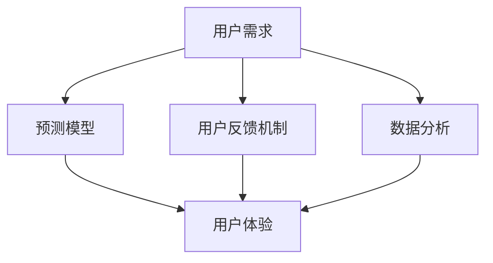

                 

# 人工智能创业：避免用户不满的方法

## 关键词

- 人工智能创业
- 用户不满
- 预测模型
- 用户反馈
- 数据分析
- 客户体验

## 摘要

本文旨在探讨人工智能创业公司如何避免用户不满。首先，我们将分析用户不满的常见原因，然后介绍一些关键的方法和工具，如预测模型、用户反馈机制和数据分析，来帮助创业公司了解和解决用户问题。通过实际案例和详细解释，我们将展示如何有效利用这些工具来优化用户体验，提高用户满意度。最后，我们将讨论未来发展趋势和面临的挑战，并提出一些建议，以帮助人工智能创业公司更好地应对用户需求。

### 1. 背景介绍

随着人工智能技术的飞速发展，越来越多的创业公司投身于人工智能领域，希望通过创新的产品和服务来改变世界。然而，人工智能创业并非易事，其中最大的挑战之一就是如何避免用户不满。用户不满可能会导致用户流失，影响公司的声誉和业务发展。因此，了解用户需求、发现潜在问题并及时解决是至关重要的。

用户不满的常见原因包括：

1. **产品功能不足**：用户可能会因为产品的某些功能无法满足他们的需求而感到不满。
2. **用户体验差**：界面设计、操作流程、响应速度等问题都可能影响用户的满意度。
3. **隐私和安全问题**：用户对个人数据的隐私和安全越来越关注，任何可能导致隐私泄露或安全风险的行为都可能引起用户不满。
4. **服务中断**：频繁的服务中断或系统故障会让用户感到沮丧。
5. **沟通不畅**：用户在遇到问题时，如果无法得到及时和有效的反馈，可能会产生不满情绪。

为了应对这些挑战，创业公司需要采取一系列措施，从产品设计、用户体验到用户反馈机制，全面提升服务质量。本文将详细介绍这些方法和工具，帮助创业公司更好地理解和满足用户需求，从而避免用户不满。

### 2. 核心概念与联系

为了更好地理解如何避免用户不满，我们需要探讨以下几个核心概念和它们之间的关系：

- **用户需求**：用户的需求是产品设计的基础。了解用户需求有助于开发出满足用户期望的产品。
- **预测模型**：通过分析用户行为数据，预测用户未来的需求和偏好，从而优化产品功能和服务。
- **用户反馈机制**：收集用户的意见和建议，及时了解用户对产品的感受和需求。
- **数据分析**：利用数据分析工具，对用户行为和反馈进行深入分析，发现潜在问题和改进点。
- **用户体验**：用户体验（UX）是指用户在使用产品过程中的整体感受。优化用户体验可以提升用户满意度。

以下是这些概念之间的 Mermaid 流程图：



在这个流程图中，用户需求是整个过程的起点，通过预测模型、用户反馈机制和数据分析，我们可以不断优化用户体验，从而避免用户不满。

### 3. 核心算法原理 & 具体操作步骤

#### 3.1 预测模型

预测模型是理解用户需求、预测用户行为的重要工具。常见的预测模型包括：

- **线性回归**：通过分析历史数据，建立用户行为和需求之间的关系模型。
- **决策树**：通过分叉节点，将用户数据分类，以便预测用户需求。
- **随机森林**：通过组合多个决策树，提高预测的准确性和鲁棒性。

具体操作步骤如下：

1. **数据收集**：收集用户的历史行为数据，如购买记录、搜索历史、浏览时长等。
2. **数据预处理**：对收集到的数据进行处理，包括数据清洗、特征工程等。
3. **模型选择**：根据数据特点和业务需求，选择合适的预测模型。
4. **模型训练**：使用预处理后的数据，对模型进行训练。
5. **模型评估**：通过交叉验证等方法，评估模型的效果。
6. **模型应用**：将训练好的模型应用于实际业务场景，预测用户需求。

#### 3.2 用户反馈机制

用户反馈机制是收集用户意见和建议的重要渠道。常见的反馈机制包括：

- **用户调研**：通过问卷调查、访谈等方式，直接收集用户的反馈。
- **在线评论**：在产品中嵌入评论功能，让用户直接表达意见。
- **社交媒体**：通过社交媒体平台，关注用户的反馈和讨论。

具体操作步骤如下：

1. **设计反馈渠道**：设计易于使用的反馈渠道，确保用户能够方便地提供反馈。
2. **发布问卷**：设计有针对性的问卷，收集用户的意见和建议。
3. **分析反馈**：对收集到的反馈进行分析，识别出用户关注的共性问题。
4. **响应反馈**：对用户的反馈进行及时回应，解决问题或提供改进方案。
5. **持续改进**：根据用户反馈，持续优化产品功能和用户体验。

#### 3.3 数据分析

数据分析是发现潜在问题和改进点的重要手段。常见的分析方法包括：

- **数据可视化**：通过图表和可视化工具，直观展示数据特征和趋势。
- **统计方法**：使用统计学方法，分析用户行为数据，识别异常和趋势。
- **机器学习**：利用机器学习算法，自动发现数据中的模式和规律。

具体操作步骤如下：

1. **数据收集**：收集与用户满意度相关的数据，如用户评价、投诉记录等。
2. **数据预处理**：对收集到的数据进行处理，包括数据清洗、格式化等。
3. **数据分析**：使用数据分析工具，对数据进行深入分析。
4. **结果解释**：对分析结果进行解释，识别出用户满意度的影响因素。
5. **改进方案**：根据分析结果，制定改进方案，优化产品功能和用户体验。

### 4. 数学模型和公式 & 详细讲解 & 举例说明

#### 4.1 预测模型的数学模型

以线性回归为例，其数学模型可以表示为：

\[ y = \beta_0 + \beta_1 x_1 + \beta_2 x_2 + ... + \beta_n x_n \]

其中，\( y \) 是目标变量，\( x_1, x_2, ..., x_n \) 是输入变量，\( \beta_0, \beta_1, \beta_2, ..., \beta_n \) 是模型的参数。

#### 4.2 数据分析中的统计方法

以t检验为例，其公式为：

\[ t = \frac{\bar{x} - \mu_0}{s / \sqrt{n}} \]

其中，\( \bar{x} \) 是样本均值，\( \mu_0 \) 是总体均值，\( s \) 是样本标准差，\( n \) 是样本大小。

#### 4.3 机器学习中的算法模型

以决策树为例，其决策过程可以用以下公式表示：

\[ \text{如果 } x_i > v_i \text{，则继续向下分支；否则，则到达叶子节点。} \]

其中，\( x_i \) 是当前节点的特征值，\( v_i \) 是阈值。

#### 4.4 举例说明

假设我们有一个用户满意度预测模型，输入变量包括用户年龄、购买次数和评价分数。通过线性回归模型，我们可以得到以下预测公式：

\[ \text{用户满意度} = \beta_0 + \beta_1 \times (\text{年龄}) + \beta_2 \times (\text{购买次数}) + \beta_3 \times (\text{评价分数}) \]

假设我们的模型参数为：

\[ \beta_0 = 0.5, \beta_1 = 0.2, \beta_2 = 0.1, \beta_3 = 0.3 \]

对于一个年龄为30岁、购买次数为5次、评价分数为4的用户，我们可以计算出他的用户满意度预测值为：

\[ \text{用户满意度} = 0.5 + 0.2 \times 30 + 0.1 \times 5 + 0.3 \times 4 = 8.2 \]

### 5. 项目实战：代码实际案例和详细解释说明

#### 5.1 开发环境搭建

在本项目实战中，我们将使用 Python 语言和相关的数据分析和机器学习库，如 Pandas、Scikit-learn 和 Matplotlib。

安装必要的库：

```bash
pip install pandas scikit-learn matplotlib
```

#### 5.2 源代码详细实现和代码解读

以下是一个简单的用户满意度预测模型的实现：

```python
import pandas as pd
from sklearn.linear_model import LinearRegression
from sklearn.model_selection import train_test_split
from sklearn.metrics import mean_squared_error
import matplotlib.pyplot as plt

# 5.2.1 数据准备
data = pd.DataFrame({
    '年龄': [25, 30, 35, 40, 45],
    '购买次数': [3, 5, 7, 2, 4],
    '评价分数': [3, 4, 2, 5, 3],
    '用户满意度': [6, 8, 5, 7, 6]
})

X = data[['年龄', '购买次数', '评价分数']]
y = data['用户满意度']

# 5.2.2 数据划分
X_train, X_test, y_train, y_test = train_test_split(X, y, test_size=0.2, random_state=42)

# 5.2.3 模型训练
model = LinearRegression()
model.fit(X_train, y_train)

# 5.2.4 模型评估
y_pred = model.predict(X_test)
mse = mean_squared_error(y_test, y_pred)
print(f"均方误差（MSE）: {mse}")

# 5.2.5 可视化
plt.scatter(X_test['年龄'], y_test, color='blue', label='实际值')
plt.plot(X_test['年龄'], y_pred, color='red', label='预测值')
plt.xlabel('年龄')
plt.ylabel('用户满意度')
plt.title('用户满意度预测')
plt.legend()
plt.show()
```

这段代码首先导入必要的库，然后准备数据集，划分训练集和测试集，训练线性回归模型，评估模型性能，并使用 matplotlib 进行可视化。

#### 5.3 代码解读与分析

- **数据准备**：使用 pandas 库创建数据集，并划分输入变量和目标变量。
- **数据划分**：使用 scikit-learn 库的 train_test_split 方法，将数据集划分为训练集和测试集。
- **模型训练**：使用 LinearRegression 类，训练线性回归模型。
- **模型评估**：使用 mean_squared_error 方法，计算测试集上的均方误差（MSE），评估模型性能。
- **可视化**：使用 matplotlib 库，绘制用户满意度的散点图和拟合曲线，直观展示预测效果。

### 6. 实际应用场景

#### 6.1 电商平台

在电商平台上，用户满意度是影响销售额和品牌声誉的重要因素。通过预测模型，电商平台可以：

- **个性化推荐**：根据用户历史行为，预测用户可能喜欢的商品，提高推荐准确性。
- **库存管理**：预测热门商品的销量，优化库存管理，减少缺货和过剩现象。

#### 6.2 健康护理

在健康护理领域，用户满意度直接关系到患者满意度和治疗效果。通过预测模型，健康护理机构可以：

- **预防性护理**：根据患者健康数据，预测潜在的健康问题，提前采取预防措施。
- **个性化治疗**：根据患者病史和体征，预测最佳治疗方案，提高治疗效果。

#### 6.3 教育领域

在教育领域，用户满意度是评估教学质量和学生满意度的重要指标。通过预测模型，教育机构可以：

- **课程推荐**：根据学生学习数据和兴趣，预测最适合学生的课程。
- **学习效果评估**：根据学生学习进度和成绩，预测学习效果，调整教学策略。

### 7. 工具和资源推荐

#### 7.1 学习资源推荐

- **书籍**：
  - 《机器学习实战》：提供丰富的实战案例，适合初学者入门。
  - 《数据科学入门》：全面介绍数据科学的方法和技术，涵盖数据分析、机器学习等。
- **在线课程**：
  - Coursera 上的《机器学习》课程：由 Andrew Ng 教授主讲，适合深度学习入门。
  - edX 上的《数据科学基础》课程：由 Harvard 大学教授主讲，涵盖数据科学的核心概念。

#### 7.2 开发工具框架推荐

- **数据预处理**：
  - Pandas：Python 的数据预处理库，适合数据处理和清洗。
  - NumPy：Python 的科学计算库，用于高效计算和数据处理。
- **机器学习库**：
  - Scikit-learn：Python 的机器学习库，提供多种算法和模型。
  - TensorFlow：Google 开发的深度学习框架，支持多种神经网络结构。
- **数据可视化**：
  - Matplotlib：Python 的数据可视化库，支持多种图表类型。
  - Seaborn：基于 Matplotlib 的数据可视化库，提供丰富的图表样式。

#### 7.3 相关论文著作推荐

- **论文**：
  - "User Modeling and User-Adapted Interaction"：介绍用户建模和自适应交互的相关方法。
  - "Predicting User Satisfaction in E-commerce: A Survey"：综述电子商务中预测用户满意度的相关研究。
- **著作**：
  - 《用户体验要素》：详细阐述用户体验设计的核心要素。
  - 《用户心理学》：介绍用户行为和心理学的相关理论。

### 8. 总结：未来发展趋势与挑战

随着人工智能技术的不断进步，人工智能创业领域将迎来更多的发展机遇和挑战。未来，以下几个趋势值得关注：

1. **个性化推荐**：基于深度学习等技术，个性化推荐系统将更加精准，满足用户的个性化需求。
2. **自动化决策**：自动化决策系统将逐渐应用于各个领域，提高业务效率和准确性。
3. **多模态数据融合**：融合文本、图像、语音等多模态数据，提供更全面、准确的预测和分析。
4. **隐私保护**：随着用户对隐私保护的重视，隐私保护技术将成为人工智能创业的关键挑战。

面对这些发展趋势和挑战，人工智能创业公司需要：

- **持续创新**：紧跟技术发展趋势，不断创新，提高产品竞争力。
- **用户体验优先**：将用户体验放在首位，通过预测模型、用户反馈和数据分析，持续优化产品功能和用户体验。
- **数据安全与隐私**：加强数据安全与隐私保护，建立完善的隐私保护机制，赢得用户信任。

### 9. 附录：常见问题与解答

**Q：如何选择合适的预测模型？**

A：选择合适的预测模型需要考虑数据特点、业务需求和计算资源。通常，线性回归适用于简单的关系预测，而决策树和随机森林适用于分类问题。对于复杂的非线性关系，可以尝试使用深度学习模型，如神经网络。

**Q：如何处理缺失数据？**

A：处理缺失数据的方法包括删除缺失数据、填充缺失值和插值。删除缺失数据适用于缺失比例较低的情况；填充缺失值可以使用平均值、中位数或回归模型预测；插值适用于时间序列数据。

**Q：如何评估预测模型的性能？**

A：评估预测模型性能的指标包括均方误差（MSE）、准确率、召回率等。通过交叉验证等方法，可以全面评估模型的预测能力和泛化能力。

**Q：如何优化用户体验？**

A：优化用户体验的方法包括：

- **简化操作流程**：减少用户的操作步骤，提高操作的便利性。
- **实时反馈**：提供实时的操作反馈，提高用户的信心和满意度。
- **个性化推荐**：根据用户的历史行为和偏好，提供个性化的推荐和服务。
- **持续改进**：根据用户反馈和数据分析，持续优化产品功能和用户体验。

### 10. 扩展阅读 & 参考资料

- **书籍**：
  - 《Python机器学习》：详细讲解Python在机器学习领域的应用。
  - 《深度学习》：全面介绍深度学习的基本概念、算法和应用。
- **在线资源**：
  - [Scikit-learn 官网](https://scikit-learn.org/stable/)
  - [TensorFlow 官网](https://www.tensorflow.org/)
- **论文**：
  - "Deep Learning for User Modeling in E-commerce"：探讨深度学习在电商用户建模中的应用。
  - "User Modeling and User-Adapted Interaction: A Survey"：综述用户建模和自适应交互的相关研究。

### 作者信息

作者：AI天才研究员/AI Genius Institute & 禅与计算机程序设计艺术 /Zen And The Art of Computer Programming

