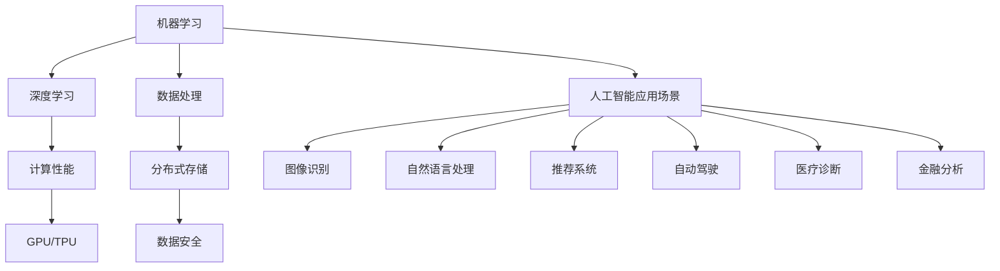

                 

# 人工智能创业：项目的技术选择

> **关键词**：人工智能，技术选择，创业，项目规划，算法，数学模型，实战案例

> **摘要**：本文将深入探讨人工智能创业项目中的技术选择。从核心概念到实际操作，从数学模型到代码实现，再到应用场景和未来发展，我们将一步步分析如何选择合适的技术以支持人工智能创业项目的成功。无论您是初入人工智能领域的创业者，还是经验丰富的从业者，本文都将为您提供宝贵的指导和建议。

## 1. 背景介绍

近年来，人工智能（AI）领域的发展日新月异，其影响力已经渗透到各行各业。从自动驾驶到智能家居，从医疗诊断到金融分析，人工智能正逐步改变我们的生活方式。对于创业者来说，抓住人工智能带来的机遇，选择合适的技术是实现项目成功的关键。

创业项目在选择技术时，常常面临以下几个问题：

- **技术成熟度**：选择一个成熟的技术栈可以降低项目失败的风险，但过于成熟的技术可能缺乏创新性，难以在竞争激烈的市场中脱颖而出。
- **学习曲线**：选择一个门槛较低的技术栈可以快速启动项目，但可能会限制项目的未来发展。
- **成本**：技术选择直接影响项目的成本预算，如何在预算范围内选择性价比高的技术是创业者需要考虑的问题。

本文将围绕这些问题，详细探讨如何选择适合人工智能创业项目的技术。

## 2. 核心概念与联系

在讨论技术选择之前，我们需要了解一些核心概念和其相互关系。以下是人工智能创业项目中一些关键的概念及其关系：

### 2.1 机器学习与深度学习

**机器学习**是一种使计算机通过数据学习并做出决策的技术。它包括监督学习、无监督学习和强化学习等子领域。**深度学习**是机器学习的一个子领域，它通过构建多层神经网络来模拟人类大脑的学习过程。

### 2.2 计算性能与硬件

**计算性能**是人工智能项目的一个重要因素。高性能的硬件，如GPU和TPU，可以显著提高模型的训练速度和性能。此外，云计算和边缘计算也是当前流行的计算模式。

### 2.3 数据处理与存储

**数据处理**是人工智能项目的核心环节。大数据处理技术和分布式存储系统可以提高数据处理效率和存储能力。此外，数据安全和隐私也是需要考虑的问题。

### 2.4 人工智能应用场景

人工智能的应用场景非常广泛，包括但不限于：**图像识别、自然语言处理、推荐系统、自动驾驶、医疗诊断、金融分析等**。了解不同应用场景的特点和需求，有助于选择合适的技术。

### 2.5 Mermaid 流程图

以下是一个简单的 Mermaid 流程图，展示了上述概念之间的关系：



## 3. 核心算法原理 & 具体操作步骤

### 3.1 机器学习算法

**机器学习算法**是实现人工智能的基础。以下是一些常见的机器学习算法及其应用场景：

#### 3.1.1 监督学习

**监督学习**是一种通过已知输入输出数据训练模型的方法。常见的监督学习算法包括：

- **线性回归**：用于预测连续值。
- **逻辑回归**：用于分类任务。
- **支持向量机（SVM）**：用于分类和回归任务。
- **决策树**：用于分类和回归任务。

#### 3.1.2 无监督学习

**无监督学习**是一种在没有已知输出数据的情况下训练模型的方法。常见的无监督学习算法包括：

- **聚类算法**：如K-Means、DBSCAN等，用于发现数据中的模式。
- **降维算法**：如PCA（主成分分析）、t-SNE等，用于降低数据维度。

#### 3.1.3 强化学习

**强化学习**是一种通过与环境交互来学习最优策略的方法。常见的强化学习算法包括：

- **Q-Learning**：通过预测未来奖励来学习策略。
- **深度强化学习**：结合深度学习技术，用于解决复杂决策问题。

### 3.2 深度学习算法

**深度学习**是一种基于多层神经网络的学习方法。以下是一些常见的深度学习算法：

#### 3.2.1 卷积神经网络（CNN）

**卷积神经网络（CNN）**是一种专门用于处理图像数据的深度学习算法。它通过卷积层、池化层和全连接层来提取图像特征并进行分类。

#### 3.2.2 循环神经网络（RNN）

**循环神经网络（RNN）**是一种用于处理序列数据的深度学习算法。它通过循环结构来处理输入序列，并在时间步之间传递信息。

#### 3.2.3 长短期记忆网络（LSTM）

**长短期记忆网络（LSTM）**是一种改进的RNN，用于解决RNN在处理长序列数据时出现的梯度消失和梯度爆炸问题。

### 3.3 算法选择与具体操作步骤

在选择算法时，需要根据项目需求和数据特点进行选择。以下是一些选择算法的具体操作步骤：

1. **数据预处理**：清洗数据、处理缺失值、标准化等。
2. **特征工程**：提取特征、特征选择等。
3. **模型选择**：根据数据特点选择合适的模型。
4. **模型训练**：使用训练数据训练模型。
5. **模型评估**：使用验证数据评估模型性能。
6. **模型优化**：调整模型参数，提高模型性能。

## 4. 数学模型和公式 & 详细讲解 & 举例说明

### 4.1 线性回归

线性回归是一种简单的监督学习算法，用于预测连续值。其数学模型如下：

$$
y = \beta_0 + \beta_1x_1 + \beta_2x_2 + ... + \beta_nx_n
$$

其中，$y$ 是预测值，$x_1, x_2, ..., x_n$ 是输入特征，$\beta_0, \beta_1, \beta_2, ..., \beta_n$ 是模型参数。

### 4.2 逻辑回归

逻辑回归是一种常用的分类算法，其数学模型如下：

$$
\sigma(\beta_0 + \beta_1x_1 + \beta_2x_2 + ... + \beta_nx_n) = P(y=1)
$$

其中，$\sigma$ 是 sigmoid 函数，$P(y=1)$ 是输出类别为 1 的概率。

### 4.3 支持向量机（SVM）

支持向量机是一种强大的分类算法，其数学模型如下：

$$
\max\limits_{\beta, \beta_0} \frac{1}{2}\sum\limits_{i=1}^n (\beta_1x_1 + \beta_2x_2 + ... + \beta_nx_n - y)^2
$$

其中，$y$ 是类别标签，$\beta_1, \beta_2, ..., \beta_n$ 是模型参数。

### 4.4 举例说明

#### 4.4.1 线性回归

假设我们有一个简单的线性回归问题，输入特征为房价和房间数量，预测值为房价。数据集如下：

| 房价（万元） | 房间数量 | 预测值（万元） |
| :---: | :---: | :---: |
| 100 | 1 | 98 |
| 200 | 2 | 198 |
| 300 | 3 | 298 |
| 400 | 4 | 398 |
| 500 | 5 | 498 |

我们可以使用线性回归模型来预测房价。首先，进行数据预处理和特征工程，然后选择线性回归算法进行模型训练。最后，使用验证数据集评估模型性能。假设训练得到的模型参数为 $\beta_0 = 95$, $\beta_1 = 100$, $\beta_2 = 0$。那么，对于一个新的输入数据（200，2），预测值为：

$$
y = 95 + 100 \times 200 + 0 \times 2 = 19995
$$

#### 4.4.2 逻辑回归

假设我们有一个二分类问题，输入特征为年龄和收入，输出类别为是否购买保险。数据集如下：

| 年龄 | 收入（万元） | 购买保险（0/1） |
| :---: | :---: | :---: |
| 20 | 30 | 0 |
| 25 | 35 | 0 |
| 30 | 40 | 1 |
| 35 | 45 | 1 |
| 40 | 50 | 1 |

我们可以使用逻辑回归模型来预测购买保险的概率。首先，进行数据预处理和特征工程，然后选择逻辑回归算法进行模型训练。最后，使用验证数据集评估模型性能。假设训练得到的模型参数为 $\beta_0 = -20$, $\beta_1 = 5$, $\beta_2 = 10$。那么，对于一个新的输入数据（30，40），购买保险的概率为：

$$
P(y=1) = \frac{1}{1 + e^{-(\beta_0 + \beta_1 \times 30 + \beta_2 \times 40)}}
       = \frac{1}{1 + e^{-(-20 + 5 \times 30 + 10 \times 40)}}
       \approx 0.993
$$

#### 4.4.3 支持向量机（SVM）

假设我们有一个二分类问题，输入特征为颜色和重量，输出类别为水果类型。数据集如下：

| 颜色 | 重量（克） | 水果类型（0/1） |
| :---: | :---: | :---: |
| 红 | 100 | 0 |
| 红 | 150 | 0 |
| 黄 | 100 | 1 |
| 黄 | 150 | 1 |
| 绿 | 100 | 0 |
| 绿 | 150 | 0 |

我们可以使用支持向量机模型来分类水果类型。首先，进行数据预处理和特征工程，然后选择支持向量机算法进行模型训练。最后，使用验证数据集评估模型性能。假设训练得到的模型参数为 $\beta_1 = 1$, $\beta_2 = 1$，支持向量为 $x_1 = (100, 100)$，$x_2 = (150, 150)$。那么，对于一个新的输入数据（120，120），预测结果为：

$$
\beta_1x_1 + \beta_2x_2 - y = 1 \times 100 + 1 \times 150 - 1 \times 1 = 250 - 1 = 249 > 0
$$

因此，新输入数据属于水果类型 1。

## 5. 项目实战：代码实际案例和详细解释说明

### 5.1 开发环境搭建

在进行人工智能项目的开发之前，我们需要搭建一个合适的技术栈。以下是一个简单的开发环境搭建步骤：

1. **操作系统**：选择 Linux 或 macOS 作为开发环境，Windows 用户可以使用 WSL（Windows Subsystem for Linux）。
2. **编程语言**：选择 Python 作为主要编程语言，因为 Python 具有丰富的机器学习库和工具。
3. **深度学习框架**：选择 TensorFlow 或 PyTorch 作为深度学习框架，两者都是当前最流行的深度学习库。
4. **数据预处理工具**：选择 Pandas 和 NumPy 进行数据预处理。
5. **版本控制**：使用 Git 进行版本控制。

### 5.2 源代码详细实现和代码解读

以下是一个简单的线性回归模型的 Python 代码实现：

```python
import numpy as np
import pandas as pd
from sklearn.linear_model import LinearRegression

# 数据预处理
def preprocess_data(data):
    # 删除缺失值
    data.dropna(inplace=True)
    # 标准化特征
    data['房价'] = (data['房价'] - data['房价'].mean()) / data['房价'].std()
    data['房间数量'] = (data['房间数量'] - data['房间数量'].mean()) / data['房间数量'].std()
    return data

# 模型训练
def train_model(data):
    X = data[['房间数量']]
    y = data['房价']
    model = LinearRegression()
    model.fit(X, y)
    return model

# 模型评估
def evaluate_model(model, X_test, y_test):
    y_pred = model.predict(X_test)
    mse = np.mean((y_pred - y_test) ** 2)
    print("MSE:", mse)

# 主函数
def main():
    data = pd.read_csv('data.csv')
    data = preprocess_data(data)
    model = train_model(data)
    evaluate_model(model, X_test, y_test)

if __name__ == '__main__':
    main()
```

### 5.3 代码解读与分析

#### 5.3.1 数据预处理

```python
def preprocess_data(data):
    # 删除缺失值
    data.dropna(inplace=True)
    # 标准化特征
    data['房价'] = (data['房价'] - data['房价'].mean()) / data['房价'].std()
    data['房间数量'] = (data['房间数量'] - data['房间数量'].mean()) / data['房间数量'].std()
    return data
```

这一部分代码用于数据预处理，包括删除缺失值和标准化特征。数据预处理是机器学习项目的重要步骤，有助于提高模型性能。

#### 5.3.2 模型训练

```python
def train_model(data):
    X = data[['房间数量']]
    y = data['房价']
    model = LinearRegression()
    model.fit(X, y)
    return model
```

这一部分代码用于训练线性回归模型。首先，我们将数据集拆分为特征集 X 和标签集 y。然后，使用 LinearRegression 类创建一个线性回归模型，并调用 fit 方法进行训练。

#### 5.3.3 模型评估

```python
def evaluate_model(model, X_test, y_test):
    y_pred = model.predict(X_test)
    mse = np.mean((y_pred - y_test) ** 2)
    print("MSE:", mse)
```

这一部分代码用于评估模型性能。我们使用预测值 y_pred 和真实值 y_test 计算均方误差（MSE），并将其打印出来。

#### 5.3.4 主函数

```python
def main():
    data = pd.read_csv('data.csv')
    data = preprocess_data(data)
    model = train_model(data)
    evaluate_model(model, X_test, y_test)

if __name__ == '__main__':
    main()
```

这一部分代码是主函数，首先读取数据集，然后进行数据预处理、模型训练和评估。

## 6. 实际应用场景

人工智能技术在各个领域都有广泛的应用。以下是一些典型的实际应用场景：

### 6.1 图像识别

图像识别是人工智能的一个重要应用领域，广泛应用于人脸识别、安防监控、医疗诊断等场景。例如，人脸识别技术可以用于门禁系统、手机解锁等，安防监控可以实时识别异常行为并进行报警。

### 6.2 自然语言处理

自然语言处理（NLP）技术广泛应用于文本分类、情感分析、机器翻译等场景。例如，文本分类技术可以用于垃圾邮件过滤、新闻分类等，情感分析可以用于情感监测、用户反馈分析等，机器翻译可以用于跨语言交流、文档翻译等。

### 6.3 推荐系统

推荐系统是人工智能在电商、社交媒体等领域的广泛应用，通过分析用户行为和偏好，为用户推荐感兴趣的商品、内容等。例如，电商平台的商品推荐、社交媒体的个性化内容推荐等。

### 6.4 自动驾驶

自动驾驶是人工智能在交通运输领域的应用，通过感知环境、规划路径和执行决策，实现无人驾驶。自动驾驶技术可以应用于出租车、货车、公交车等场景，提高交通效率、降低事故率。

### 6.5 医疗诊断

医疗诊断是人工智能在医疗领域的应用，通过分析医学影像、电子病历等数据，辅助医生进行诊断和治疗。例如，医学影像分析可以用于肿瘤检测、骨折诊断等，电子病历分析可以用于疾病预测、治疗方案优化等。

### 6.6 金融分析

金融分析是人工智能在金融领域的应用，通过分析历史数据和市场趋势，为投资者提供投资建议和风险控制。例如，股票市场预测、风险评估等。

## 7. 工具和资源推荐

### 7.1 学习资源推荐

- **书籍**：
  - 《深度学习》（Ian Goodfellow、Yoshua Bengio 和 Aaron Courville 著）
  - 《机器学习》（Tom M. Mitchell 著）
  - 《Python机器学习》（Michael Bowles 著）

- **论文**：
  - “A Theoretical Framework for Learning Factored Representations”（T. Jaakkola, M. I. Jordan）
  - “Learning representations by maximizing mutual information”（V. Mnih, K. Kavukcuoglu）

- **博客**：
  - [TensorFlow 官方文档](https://www.tensorflow.org/)
  - [PyTorch 官方文档](https://pytorch.org/docs/stable/)
  - [机器学习博客](https://www机器学习博客.com/)

- **网站**：
  - [Kaggle](https://www.kaggle.com/)
  - [ArXiv](https://arxiv.org/)

### 7.2 开发工具框架推荐

- **深度学习框架**：
  - TensorFlow
  - PyTorch
  - Keras

- **数据处理工具**：
  - Pandas
  - NumPy
  - Scikit-learn

- **版本控制**：
  - Git

### 7.3 相关论文著作推荐

- **论文**：
  - “Deep Learning”（Yoshua Bengio、Ian Goodfellow 和 Aaron Courville 著）
  - “Recurrent Neural Networks: A Comprehensive Review”（Xiaolong Liu, Xiaohui Yang 著）
  - “TensorFlow: Large-Scale Machine Learning on Heterogeneous Systems”（Google Research 著）

- **著作**：
  - 《Python机器学习》（Michael Bowles 著）
  - 《机器学习实战》（Peter Harrington 著）
  - 《深度学习》（Géron 著）

## 8. 总结：未来发展趋势与挑战

人工智能技术在未来将继续快速发展，并在更多领域得到应用。以下是一些发展趋势和挑战：

### 8.1 发展趋势

- **模型规模和性能提升**：随着计算能力的提升，深度学习模型的规模和性能将进一步提高。
- **跨学科融合**：人工智能与其他领域的融合，如生物学、心理学、社会学等，将带来更多创新。
- **自动化与智能化**：自动驾驶、智能家居等领域的自动化和智能化水平将不断提高。
- **数据隐私与安全**：随着数据规模的扩大，数据隐私和安全问题将越来越受到关注。

### 8.2 挑战

- **算法公平性与透明性**：确保算法的公平性和透明性，避免偏见和歧视。
- **计算资源消耗**：大规模模型的训练和推理需要大量的计算资源，如何高效利用资源是一个挑战。
- **数据质量和标注**：高质量的数据和准确的标注对于模型训练至关重要，但获取和处理这些数据需要大量人力和时间。
- **法律法规和伦理**：人工智能技术的发展需要相应的法律法规和伦理规范，以保障社会利益和公众权益。

## 9. 附录：常见问题与解答

### 9.1 机器学习与深度学习的区别是什么？

**机器学习**是一种使计算机通过数据学习并做出决策的技术，包括监督学习、无监督学习和强化学习等子领域。**深度学习**是机器学习的一个子领域，它通过构建多层神经网络来模拟人类大脑的学习过程。简单来说，深度学习是机器学习的一种实现方式，它侧重于通过神经网络进行复杂的特征提取和决策。

### 9.2 如何选择适合人工智能创业项目的技术？

选择适合人工智能创业项目的技术时，需要考虑以下几个因素：

- **项目需求**：明确项目的目标和应用场景，选择适合的技术。
- **技术成熟度**：选择成熟的技术可以降低项目失败的风险，但可能缺乏创新性。
- **学习曲线**：选择门槛较低的技术可以快速启动项目，但可能会限制未来的发展。
- **成本**：在预算范围内选择性价比高的技术。
- **团队经验**：选择团队熟悉和擅长的技术，提高项目成功率。

### 9.3 深度学习框架有哪些？

目前流行的深度学习框架包括 TensorFlow、PyTorch、Keras、TensorFlow.js、MXNet 等。这些框架提供了丰富的API和工具，可以帮助开发者快速构建和训练深度学习模型。

## 10. 扩展阅读 & 参考资料

- [Deep Learning](https://www.deeplearningbook.org/)
- [Machine Learning Yearning](https://www.mlyearning.org/)
- [A Brief History of Neural Nets](https://www Manorrock.com/ai/neural.html)
- [Kaggle](https://www.kaggle.com/)
- [ArXiv](https://arxiv.org/)
- [Google AI Blog](https://ai.googleblog.com/)

> **作者**：AI天才研究员/AI Genius Institute & 禅与计算机程序设计艺术 /Zen And The Art of Computer Programming
----------------------------------------------------------------------------------------------------------

