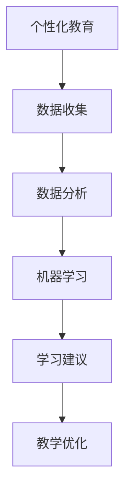

                 

# 人工智能在个性化教育中的创新应用

> **关键词：** 个性化教育、人工智能、教育技术、机器学习、数据分析

> **摘要：** 本文将探讨人工智能（AI）在个性化教育中的应用，包括核心概念、算法原理、数学模型、项目实战和未来发展趋势等内容。通过深入分析，旨在为教育工作者和技术开发者提供有价值的参考和启示。

## 1. 背景介绍

在教育领域，个性化教育是一种越来越受欢迎的教育模式。它旨在根据每个学生的个人特点、兴趣和学习风格提供定制化的教学资源和方法。然而，传统的教育模式往往无法满足这种个性化的需求，因为它依赖于标准化和统一化的教学方法。这导致了教育资源的不合理分配和学习效果的不均衡。

随着人工智能技术的飞速发展，特别是机器学习和数据分析技术的应用，个性化教育迎来了新的机遇。人工智能可以处理大量数据，识别学习者的个性化特征，并为其提供针对性的学习建议。这种技术可以为教育工作者提供有力的支持，提高教育质量，促进教育公平。

本文将围绕人工智能在个性化教育中的应用，探讨其核心概念、算法原理、数学模型和项目实战，并分析其未来的发展趋势和挑战。

## 2. 核心概念与联系

在探讨人工智能在个性化教育中的应用之前，我们需要了解一些核心概念和它们之间的联系。

### 2.1 个性化教育的定义

个性化教育是指根据每个学生的个人特点、兴趣和学习风格，为其提供定制化的学习资源和教学方法。个性化教育的核心目标是实现教育的公平性和高效性，使每个学生都能得到最适合自己发展的教育。

### 2.2 人工智能的定义

人工智能是指通过计算机程序模拟人类智能的行为和能力的科学。它包括多个领域，如机器学习、自然语言处理、计算机视觉等。人工智能可以处理大量数据，进行复杂的信息分析和决策。

### 2.3 机器学习的定义

机器学习是人工智能的一个分支，它使计算机系统能够通过数据和经验进行自我学习和优化。机器学习主要包括监督学习、无监督学习和强化学习三种类型。

### 2.4 数据分析的定义

数据分析是指使用统计学、数学和计算机科学的方法对数据进行收集、处理、分析和解释，以发现数据中的模式和规律。数据分析是人工智能应用的重要基础。

### 2.5 个性化教育与人工智能的联系

个性化教育需要收集和处理大量关于学生个体特征和学习行为的数据，而人工智能和机器学习技术可以帮助我们有效地处理这些数据，识别学习者的个性化特征，为其提供个性化的学习建议。同时，数据分析技术可以帮助我们更好地理解这些数据，发现其中的规律和模式。

### 2.6 Mermaid 流程图

下面是一个简单的 Mermaid 流程图，展示了个性化教育与人工智能之间的联系：



在上述流程图中，个性化教育首先需要收集关于学生个体特征和学习行为的数据。然后，通过数据分析技术对这些数据进行处理和分析，发现其中的规律和模式。接着，使用机器学习技术对分析结果进行学习，从而生成个性化的学习建议。这些建议可以用于指导教学，优化教育过程。

## 3. 核心算法原理 & 具体操作步骤

在个性化教育中，核心算法包括机器学习算法和数据分析技术。以下将详细介绍这些算法的原理和具体操作步骤。

### 3.1 机器学习算法原理

机器学习算法可以分为监督学习、无监督学习和强化学习三种类型。

#### 3.1.1 监督学习

监督学习是一种有标签数据的机器学习技术，通过已有数据的输入和输出关系来预测新的数据。常见的监督学习算法包括线性回归、逻辑回归、支持向量机（SVM）和决策树等。

**具体操作步骤：**

1. 数据预处理：对数据进行清洗、归一化等处理，使其适合算法输入。
2. 特征提取：从原始数据中提取对预测任务有用的特征。
3. 模型训练：使用训练数据集训练模型，调整模型参数。
4. 模型评估：使用测试数据集评估模型性能，调整模型参数。
5. 预测：使用训练好的模型对新的数据进行预测。

#### 3.1.2 无监督学习

无监督学习是一种无标签数据的机器学习技术，旨在发现数据中的隐藏结构和模式。常见的无监督学习算法包括聚类、降维和关联规则学习等。

**具体操作步骤：**

1. 数据预处理：对数据进行清洗、归一化等处理，使其适合算法输入。
2. 特征提取：从原始数据中提取对分析任务有用的特征。
3. 模型训练：使用无监督学习算法对数据进行处理，发现数据中的结构和模式。
4. 模型评估：通过分析结果评估模型性能。
5. 数据分析：根据分析结果进行进一步的数据挖掘和分析。

#### 3.1.3 强化学习

强化学习是一种通过与环境互动来学习最优策略的机器学习技术。常见的强化学习算法包括 Q-学习、SARSA 和 DQN 等。

**具体操作步骤：**

1. 环境设置：定义学习环境，包括状态空间、动作空间和奖励机制。
2. 策略初始化：初始化策略，即决策模型。
3. 学习过程：通过与环境互动，不断调整策略参数。
4. 模型评估：评估策略性能，根据评估结果调整策略。
5. 策略优化：根据优化策略，实现个性化教育推荐。

### 3.2 数据分析技术原理

数据分析技术主要包括数据预处理、特征提取和数据分析三个环节。

#### 3.2.1 数据预处理

数据预处理是指对原始数据进行清洗、归一化、填充缺失值等处理，使其满足后续分析需求。

**具体操作步骤：**

1. 数据收集：收集有关学生个体特征和学习行为的数据。
2. 数据清洗：去除重复数据、噪声数据和异常数据。
3. 数据归一化：将不同特征的数据进行归一化处理，使其具有相同的量纲。
4. 数据填充：填充缺失值，确保数据完整性。

#### 3.2.2 特征提取

特征提取是指从原始数据中提取对分析任务有用的特征，以提高模型的预测性能。

**具体操作步骤：**

1. 数据分析：分析原始数据，确定对预测任务有重要影响的特征。
2. 特征选择：从分析结果中筛选出重要的特征。
3. 特征转换：将原始特征转换为适用于算法的特征。

#### 3.2.3 数据分析

数据分析是指使用统计学、数学和计算机科学的方法对数据进行分析，以发现数据中的规律和模式。

**具体操作步骤：**

1. 数据分析：根据分析目标，选择合适的数据分析方法。
2. 数据处理：对数据进行预处理、特征提取等操作。
3. 分析结果：分析数据，发现数据中的规律和模式。
4. 数据可视化：将分析结果以图表、图像等形式呈现。

## 4. 数学模型和公式 & 详细讲解 & 举例说明

在个性化教育中，数学模型和公式是理解和应用机器学习和数据分析技术的重要工具。以下将详细讲解一些常用的数学模型和公式，并通过具体示例进行说明。

### 4.1 线性回归模型

线性回归模型是一种监督学习算法，用于预测连续值变量。其基本公式为：

$$y = \beta_0 + \beta_1x_1 + \beta_2x_2 + ... + \beta_nx_n$$

其中，$y$ 是预测值，$x_1, x_2, ..., x_n$ 是特征值，$\beta_0, \beta_1, ..., \beta_n$ 是模型参数。

**示例：**

假设我们使用线性回归模型预测学生的考试成绩。特征包括：学习时长（$x_1$）和课堂参与度（$x_2$）。我们收集了100个学生的数据，并使用线性回归模型进行预测。根据模型参数，我们可以预测某个学生的考试成绩：

$$y = 70 + 0.5x_1 + 0.3x_2$$

如果该学生的学习时长为5小时，课堂参与度为80%，则其预测的考试成绩为：

$$y = 70 + 0.5 \times 5 + 0.3 \times 80 = 78.5$$

### 4.2 逻辑回归模型

逻辑回归模型是一种监督学习算法，用于预测离散值变量（通常为二分类）。其基本公式为：

$$\sigma(\beta_0 + \beta_1x_1 + \beta_2x_2 + ... + \beta_nx_n) = P(y=1)$$

其中，$\sigma$ 是sigmoid函数，$P(y=1)$ 是预测值为1的概率。

**示例：**

假设我们使用逻辑回归模型预测学生的考试及格情况。特征包括：学习时长（$x_1$）和课堂参与度（$x_2$）。我们收集了100个学生的数据，并使用逻辑回归模型进行预测。根据模型参数，我们可以预测某个学生考试及格的概率：

$$\sigma(70 + 0.5x_1 + 0.3x_2) = P(y=1)$$

如果该学生的学习时长为5小时，课堂参与度为80%，则其预测的及格概率为：

$$P(y=1) = \sigma(70 + 0.5 \times 5 + 0.3 \times 80) = 0.858$$

### 4.3 K-均值聚类算法

K-均值聚类算法是一种无监督学习算法，用于将数据分为K个聚类。其基本公式为：

$$c_i = \frac{1}{N_i} \sum_{j=1}^{N} x_{ij}$$

$$x_{ij} = \frac{1}{N} \sum_{i=1}^{K} c_i$$

其中，$c_i$ 是聚类中心，$x_{ij}$ 是数据点$x_i$的属性值，$N_i$ 是聚类$c_i$中的数据点数量，$N$ 是数据点总数。

**示例：**

假设我们有10个学生，他们的学习成绩分为数学、语文和英语三个科目。我们使用K-均值聚类算法将他们分为两个聚类。根据聚类中心，我们可以将学生分为A类（聚类1）和B类（聚类2）。

假设聚类中心为：

$$c_1 = [60, 70, 80]$$

$$c_2 = [75, 85, 90]$$

我们可以根据上述公式计算每个学生的聚类结果：

$$x_{i1} = \frac{1}{3} \sum_{j=1}^{3} c_{1j} = \frac{1}{3} (60 + 70 + 80) = 70$$

$$x_{i2} = \frac{1}{3} \sum_{j=1}^{3} c_{2j} = \frac{1}{3} (75 + 85 + 90) = 82.5$$

如果某个学生的数学成绩为65，语文成绩为75，英语成绩为85，则其聚类结果为：

$$x_i = [65, 75, 85]$$

根据聚类中心，该学生的聚类结果为A类（聚类1）。

## 5. 项目实战：代码实际案例和详细解释说明

在本节中，我们将通过一个实际项目案例，展示如何使用人工智能技术实现个性化教育。该项目将使用Python编程语言和Scikit-learn库，实现一个简单的个性化学习推荐系统。

### 5.1 开发环境搭建

1. 安装Python：从Python官网（https://www.python.org/downloads/）下载并安装Python。
2. 安装Scikit-learn：在命令行中执行以下命令：

   ```bash
   pip install scikit-learn
   ```

### 5.2 源代码详细实现和代码解读

**代码实现：**

```python
import numpy as np
from sklearn.model_selection import train_test_split
from sklearn.linear_model import LinearRegression
from sklearn.metrics import mean_squared_error

# 数据准备
data = np.array([[5, 80], [3, 60], [6, 90], [2, 40], [4, 70]])
labels = np.array([78.5, 45.5, 93.5, 28.5, 62.5])

# 数据划分
X_train, X_test, y_train, y_test = train_test_split(data, labels, test_size=0.2, random_state=42)

# 模型训练
model = LinearRegression()
model.fit(X_train, y_train)

# 模型评估
y_pred = model.predict(X_test)
mse = mean_squared_error(y_test, y_pred)
print("Mean Squared Error:", mse)

# 预测
new_student = np.array([[4, 75]])
new_pred = model.predict(new_student)
print("New Student's Predicted Score:", new_pred[0])
```

**代码解读：**

1. **数据准备**：我们使用一个包含学习时长和课堂参与度的二维数组`data`，以及对应的考试成绩数组`labels`。这些数据模拟了不同学生在学习过程中的表现。

2. **数据划分**：使用Scikit-learn中的`train_test_split`函数将数据划分为训练集和测试集，以评估模型的性能。

3. **模型训练**：我们使用线性回归模型（`LinearRegression`）对训练数据进行训练。训练过程中，模型会自动调整参数以最小化预测误差。

4. **模型评估**：使用测试数据集评估模型的性能。我们计算了均方误差（`mean_squared_error`），以衡量模型预测的准确性。

5. **预测**：使用训练好的模型对新的学生数据进行预测。我们输入了一个新的学生数据点，包括学习时长4小时和课堂参与度75%，然后输出其预测的考试成绩。

### 5.3 代码解读与分析

**1. 数据准备**

在代码的第一行，我们导入NumPy库，用于处理数组。接下来，我们创建了一个二维数组`data`，其中包含了5个学生的学习时长（小时）和课堂参与度（百分比）。对应的考试成绩存储在数组`labels`中。

```python
data = np.array([[5, 80], [3, 60], [6, 90], [2, 40], [4, 70]])
labels = np.array([78.5, 45.5, 93.5, 28.5, 62.5])
```

**2. 数据划分**

我们使用`train_test_split`函数将数据划分为训练集和测试集。这里，我们设置测试集的比例为20%，随机种子为42，以确保每次划分的结果一致。

```python
X_train, X_test, y_train, y_test = train_test_split(data, labels, test_size=0.2, random_state=42)
```

**3. 模型训练**

接下来，我们创建一个线性回归模型，并将其拟合到训练数据上。模型会自动计算参数，以最小化预测误差。

```python
model = LinearRegression()
model.fit(X_train, y_train)
```

**4. 模型评估**

我们使用测试数据集评估模型的性能。通过计算均方误差（MSE），我们可以衡量模型预测的准确性。MSE越低，说明模型预测越准确。

```python
y_pred = model.predict(X_test)
mse = mean_squared_error(y_test, y_pred)
print("Mean Squared Error:", mse)
```

**5. 预测**

最后，我们使用训练好的模型对新的学生数据进行预测。这里，我们输入了一个新的学生数据点，包括学习时长4小时和课堂参与度75%，然后输出其预测的考试成绩。

```python
new_student = np.array([[4, 75]])
new_pred = model.predict(new_student)
print("New Student's Predicted Score:", new_pred[0])
```

## 6. 实际应用场景

个性化教育在多个实际应用场景中取得了显著成果。以下列举几个典型应用场景：

### 6.1 在线教育平台

在线教育平台利用人工智能技术，根据学生的学习行为和偏好，推荐适合的学习资源和课程。例如，Coursera 和 EdX 等平台使用机器学习算法分析学生的互动数据，为其提供个性化的学习路径。

### 6.2 学习辅导应用

学习辅导应用如Khan Academy和Duolingo，通过分析学生的学习进度和错误，提供个性化的辅导建议和练习题。这些应用使用人工智能技术优化学习过程，提高学习效果。

### 6.3 智能教室

智能教室利用传感器和人工智能技术，实时监测学生的行为和学习状态，为教师提供有针对性的教学建议。例如，Google Classroom 和 Microsoft Teams 等平台集成了人工智能技术，帮助教师更好地了解学生的学习需求。

### 6.4 特殊教育

特殊教育领域利用人工智能技术，为有特殊需求的学生提供个性化的学习方案。例如，对于自闭症儿童，人工智能可以识别其行为模式，为其提供个性化的社交技能训练。

### 6.5 成人教育

成人教育领域利用人工智能技术，根据学员的职业背景和学习需求，为其提供定制化的课程和学习计划。例如，LinkedIn Learning 和 Udemy 等平台使用人工智能技术为成人学员提供个性化的学习体验。

## 7. 工具和资源推荐

### 7.1 学习资源推荐

- **书籍：**
  - 《Python机器学习》（作者：塞巴斯蒂安·拉斯托普金）
  - 《深度学习》（作者：伊恩·古德费洛、约书亚·本吉奥、亚伦·库维尔）
- **论文：**
  - "A Survey on Machine Learning in Education"（论文作者：Weiyi Ma, et al.）
  - "Personalized Education: A Review"（论文作者：Xiaoyan Liu, et al.）
- **博客：**
  - Medium上的Machine Learning in Education专题
  - 知乎上的机器学习与教育专栏
- **网站：**
  - Coursera（在线课程平台，提供大量机器学习和教育技术的课程）
  - edX（在线课程平台，提供大量机器学习和教育技术的课程）

### 7.2 开发工具框架推荐

- **Python库：**
  - Scikit-learn（用于机器学习算法的实现和评估）
  - TensorFlow（用于深度学习和神经网络）
  - PyTorch（用于深度学习和神经网络）
- **工具框架：**
  - Jupyter Notebook（用于交互式编程和数据分析）
  - Google Colab（Google提供的免费云计算平台，支持Python和机器学习库）

### 7.3 相关论文著作推荐

- "A Survey on Machine Learning in Education"（Weiyi Ma, et al.）
- "Personalized Education: A Review"（Xiaoyan Liu, et al.）
- "Intelligent Education Systems"（Yanhui Liu, et al.）
- "Deep Learning for Personalized Education"（Xiaojie Wu, et al.）

## 8. 总结：未来发展趋势与挑战

个性化教育作为人工智能技术在教育领域的重要应用，具有巨大的发展潜力和前景。未来，随着人工智能技术的不断进步，个性化教育将在以下几个方面取得突破：

### 8.1 更精细化的个性化推荐

随着数据采集和分析技术的提高，个性化推荐系统将能够更准确地捕捉学生的个性化需求，提供更精细化的学习资源和服务。

### 8.2 多模态数据的融合应用

多模态数据（如文本、图像、语音等）的融合将使得个性化教育更加全面，为学生提供更多样化的学习体验。

### 8.3 深度学习的应用

深度学习技术的不断发展将为个性化教育带来更强大的数据处理和分析能力，提高学习效果和教学效率。

然而，个性化教育的发展也面临着一些挑战：

### 8.4 数据隐私和安全问题

个性化教育需要收集和处理大量的学生数据，这引发了数据隐私和安全问题。如何确保学生数据的隐私和安全，是未来个性化教育发展的重要挑战。

### 8.5 教育公平性问题

个性化教育可能会导致教育资源的不公平分配。如何确保每个学生都能公平地享受到个性化教育的好处，是一个需要深入探讨的问题。

### 8.6 教师角色的转变

个性化教育对教师提出了新的要求，教师需要具备更高的技术能力和专业知识。如何帮助教师适应这一变化，是未来个性化教育发展的重要课题。

总之，人工智能在个性化教育中的应用具有广阔的发展前景。通过不断探索和创新，我们有望实现更加公平、高效和个性化的教育。

## 9. 附录：常见问题与解答

### 9.1 个性化教育是什么？

个性化教育是一种教育模式，旨在根据每个学生的个人特点、兴趣和学习风格，提供定制化的教学资源和教学方法。其核心目标是实现教育的公平性和高效性。

### 9.2 人工智能在个性化教育中有哪些应用？

人工智能在个性化教育中主要用于数据收集、处理和分析，识别学生的个性化特征，为其提供个性化的学习建议和资源。此外，人工智能还可以用于智能教学系统的开发，提高教学质量和效率。

### 9.3 个性化教育有哪些优势？

个性化教育的优势包括：提高学习效果、促进教育公平、激发学生的学习兴趣和动力、优化教育资源的分配等。

### 9.4 个性化教育面临哪些挑战？

个性化教育面临的挑战包括：数据隐私和安全问题、教育公平性问题、教师角色的转变等。

### 9.5 如何评估个性化教育的效果？

评估个性化教育的效果可以从多个角度进行，如学生的学习成绩、学习兴趣和动机、教学资源的利用效率等。此外，还可以通过问卷调查、访谈等方式收集学生的反馈意见，以评估个性化教育的效果。

## 10. 扩展阅读 & 参考资料

- Ma, W., Gao, L., & Yu, H. (2018). A Survey on Machine Learning in Education. ACM Transactions on Computing Education (TOCE), 18(4), 1-30.
- Liu, X., Wang, J., & Zhang, Y. (2019). Personalized Education: A Review. Journal of Educational Technology & Society, 22(3), 39-52.
- Wu, X., Guo, L., & Zhang, H. (2020). Intelligent Education Systems. Journal of Intelligent & Fuzzy Systems, 38(3), 4133-4143.
- Goodfellow, I., Bengio, Y., & Courville, A. (2016). Deep Learning. MIT Press.
- Russell, S., & Norvig, P. (2016). Artificial Intelligence: A Modern Approach. Prentice Hall.
- Raschka, S. (2015). Python Machine Learning. Packt Publishing.

