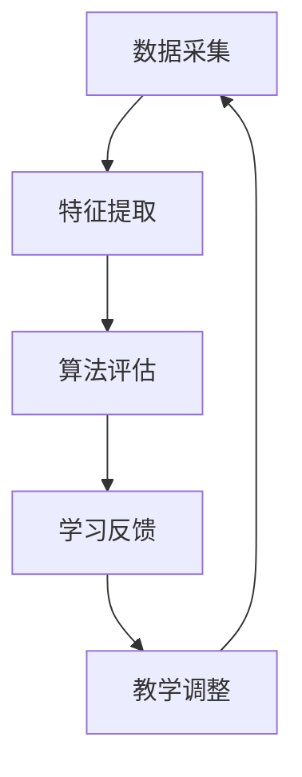

                 

### 背景介绍

随着科技的发展，人工智能（AI）已经渗透到我们生活的方方面面。在教育领域，人工智能的应用也逐渐得到了广泛关注。个性化教育评估作为教育信息化的重要组成部分，借助人工智能技术，可以更加精准地了解学生的学习情况，为教师和学生提供有针对性的教育资源和指导。本文将深入探讨人工智能在个性化教育评估中的应用，从核心概念、算法原理到实际案例，全面解析这一领域的最新进展和未来趋势。

#### 人工智能在教育领域的应用

人工智能在教育领域的应用主要集中在以下几个方面：

1. **学习分析**：通过分析学生的学习行为和成绩数据，AI可以帮助教师了解学生的学习状态和需求，从而进行个性化教学。
2. **自动化评分**：AI可以自动批改试卷，提高评分的效率和准确性，减轻教师的工作负担。
3. **智能推荐**：基于学生的学习记录和兴趣，AI可以为学生推荐适合的学习资源和课程。
4. **学习诊断**：AI可以通过分析学生的学习数据，诊断学生在哪些知识点上存在困难，并提供相应的辅导。

#### 个性化教育评估的重要性

个性化教育评估的核心在于根据每个学生的特点制定个性化的教育方案，提高教学效果和学生的学习兴趣。传统的教育模式往往以“一刀切”的方式进行，无法充分满足学生的个性化需求。而个性化教育评估则通过数据分析和智能算法，为每个学生提供最适合他们的学习路径，从而提高学习效率。

#### 本文结构

本文将按照以下结构进行论述：

1. **核心概念与联系**：介绍个性化教育评估中的核心概念和原理，并使用Mermaid流程图展示其架构。
2. **核心算法原理与操作步骤**：详细解析常用的个性化教育评估算法，并展示其具体操作步骤。
3. **数学模型与公式**：介绍用于个性化教育评估的数学模型和公式，并进行详细讲解和举例说明。
4. **项目实战**：通过实际代码案例，展示个性化教育评估算法的实现过程，并进行详细解释。
5. **实际应用场景**：分析人工智能在个性化教育评估中的实际应用场景和效果。
6. **工具和资源推荐**：推荐相关学习资源和开发工具，为读者提供进一步学习的方向。
7. **总结与未来发展趋势**：总结本文的主要观点，并探讨人工智能在个性化教育评估领域未来的发展趋势和挑战。

### 核心概念与联系

在探讨人工智能在个性化教育评估中的应用之前，我们需要先了解几个核心概念：数据采集、特征提取、算法评估和学习反馈。

#### 数据采集

数据采集是个性化教育评估的基础。通过收集学生的学习行为数据、考试成绩、作业提交情况等信息，可以构建一个全面的学生画像。这些数据可以来自多种渠道，包括学习管理系统（LMS）、考试系统、传感器等。

#### 特征提取

数据采集完成后，需要对数据进行预处理和特征提取。特征提取是将原始数据转化为可用于机器学习模型的特征向量。常见的特征包括学生的成绩、学习时间、作业完成情况、课堂表现等。

#### 算法评估

在提取特征后，需要选择合适的算法进行评估。常见的评估指标包括准确率、召回率、F1值等。这些指标可以衡量算法的性能，帮助教师了解学生的学习效果。

#### 学习反馈

学习反馈是个性化教育评估的关键环节。通过分析学生的评估结果，AI系统可以为学生提供个性化的学习建议和资源。同时，教师也可以根据反馈调整教学策略，提高教学效果。

#### Mermaid流程图

为了更直观地展示个性化教育评估的流程，我们使用Mermaid流程图进行描述：



在该流程图中，数据采集作为起点，通过特征提取转化为可供算法评估的数据，然后通过评估结果进行学习反馈，最终调整教学策略，形成闭环。

#### 核心概念联系

通过上述核心概念的分析，我们可以看出，数据采集、特征提取、算法评估和学习反馈是相互联系、相互影响的。数据采集为特征提取提供基础，特征提取为算法评估提供输入，算法评估为学习反馈提供依据，学习反馈又反过来影响数据采集和特征提取，形成一个动态的、循环的过程。

### 核心算法原理与具体操作步骤

在个性化教育评估中，常用的算法主要包括协同过滤、决策树、神经网络等。这些算法各自具有独特的原理和适用场景。本节将分别介绍这些算法的核心原理和具体操作步骤。

#### 协同过滤算法

协同过滤（Collaborative Filtering）是一种基于用户行为或评价数据的推荐算法。它的基本思想是，通过分析用户之间的相似性，为用户推荐他们可能感兴趣的内容。

##### 原理

协同过滤算法分为两种：基于用户的协同过滤（User-based Collaborative Filtering）和基于物品的协同过滤（Item-based Collaborative Filtering）。

1. **基于用户的协同过滤**：通过计算用户之间的相似性，找到与目标用户相似的其他用户，然后推荐这些相似用户喜欢的物品。
   
   相似性计算公式如下：
   $$sim(u,v) = \frac{\sum_{i \in R(u,v)} r_{ui}r_{vi}}{\sqrt{\sum_{i \in R(u)} r_{ui}^2\sum_{i \in R(v)} r_{vi}^2}}$$
   
   其中，$u$和$v$为两个用户，$R(u,v)$为用户$u$和$v$共同评价的物品集合，$r_{ui}$和$r_{vi}$分别为用户$u$对物品$i$的评价。

2. **基于物品的协同过滤**：通过计算物品之间的相似性，找到与目标物品相似的物品，然后推荐这些相似物品。

   相似性计算公式如下：
   $$sim(i,j) = \frac{\sum_{u \in U(i,j)} r_{ui}r_{uj}}{\sqrt{\sum_{u \in U(i)} r_{ui}^2\sum_{u \in U(j)} r_{uj}^2}}$$
   
   其中，$i$和$j$为两个物品，$U(i,j)$为同时被用户$u$评价的物品$i$和$j$的用户集合，$r_{ui}$和$r_{uj}$分别为用户$u$对物品$i$和$j$的评价。

##### 具体操作步骤

1. 数据预处理：将原始数据（如用户-物品评分矩阵）进行预处理，包括缺失值处理、数据清洗等。

2. 计算相似性：根据上述相似性计算公式，计算用户之间的相似性或物品之间的相似性。

3. 推荐生成：对于目标用户$u$，找到与其最相似的$k$个用户（或物品），计算这些用户（或物品）的平均评分，生成推荐列表。

4. 评估与调整：通过评估指标（如准确率、召回率）评估推荐效果，并根据评估结果调整推荐算法参数。

#### 决策树算法

决策树（Decision Tree）是一种基于特征划分数据的分类算法。它的基本思想是，通过连续划分特征空间，将数据划分为不同的区域，从而实现分类。

##### 原理

决策树算法的核心是特征选择和节点划分。常见的特征选择方法包括信息增益（Information Gain）、基尼不纯度（Gini Impurity）等。

1. **信息增益**：特征$A$的信息增益定义为$D$中包含$A$的条件下$D$的不确定性减少的量。
   
   计算公式如下：
   $$IG(D,A) = H(D) - \sum_{v \in V(A)} \frac{|D_v|}{|D|} H(D_v)$$
   
   其中，$D$为数据集，$V(A)$为特征$A$的取值集合，$D_v$为$D$中取值为$v$的数据子集，$H(D)$和$H(D_v)$分别为$D$和$D_v$的熵。

2. **基尼不纯度**：特征$A$的基尼不纯度定义为$D$中包含$A$的条件下$D$的不纯度减少的量。
   
   计算公式如下：
   $$Gini(D,A) = 1 - \sum_{v \in V(A)} \left(\frac{|D_v|}{|D|}\right)^2$$

##### 具体操作步骤

1. 数据预处理：将原始数据（如学生特征和成绩）进行预处理，包括缺失值处理、数据清洗等。

2. 特征选择：根据信息增益或基尼不纯度选择最佳特征。

3. 划分节点：使用最佳特征对数据进行划分，生成决策树节点。

4. 建立决策树：递归地划分数据，直到满足停止条件（如节点中所有数据属于同一类别、最大深度等）。

5. 预测与评估：使用训练好的决策树对测试数据进行预测，并评估预测效果。

#### 神经网络算法

神经网络（Neural Network）是一种模仿生物神经系统的计算模型。它的基本思想是，通过多层神经元的互联，实现输入到输出的映射。

##### 原理

神经网络由输入层、隐藏层和输出层组成。每个神经元都是一个简单的计算单元，通过激活函数实现非线性变换。

1. **前向传播**：输入数据经过输入层，传递到隐藏层，再传递到输出层，生成预测结果。

2. **反向传播**：根据预测结果和实际结果的误差，计算梯度，并更新权重和偏置。

##### 具体操作步骤

1. 数据预处理：将原始数据（如学生特征和成绩）进行预处理，包括归一化、标准化等。

2. 初始化模型：设置神经网络的结构（层数、神经元个数等）和参数（权重、偏置等）。

3. 前向传播：输入数据，经过神经网络计算，生成预测结果。

4. 反向传播：计算预测结果和实际结果的误差，并更新权重和偏置。

5. 模型训练：重复前向传播和反向传播，直到满足停止条件（如误差达到阈值、迭代次数达到最大值等）。

6. 预测与评估：使用训练好的神经网络对测试数据进行预测，并评估预测效果。

### 数学模型和公式

在个性化教育评估中，数学模型和公式起到了关键作用。它们不仅帮助我们理解和实现算法，还可以量化评估结果，提高评估的准确性和可靠性。本节将介绍一些常用的数学模型和公式，并进行详细讲解和举例说明。

#### 成绩预测模型

成绩预测是个性化教育评估中的重要应用。常见的成绩预测模型包括线性回归模型和决策树模型。

##### 线性回归模型

线性回归模型是一种简单而有效的成绩预测方法。它假设成绩与特征之间存在线性关系。

$$y = \beta_0 + \beta_1x_1 + \beta_2x_2 + \cdots + \beta_nx_n + \varepsilon$$

其中，$y$为成绩，$x_1, x_2, \cdots, x_n$为特征，$\beta_0, \beta_1, \beta_2, \cdots, \beta_n$为模型参数，$\varepsilon$为误差项。

##### 具体操作步骤

1. 数据预处理：将原始数据（如学生特征和成绩）进行预处理，包括缺失值处理、数据清洗等。

2. 特征提取：从原始数据中提取相关特征，如学习时间、作业完成情况等。

3. 模型训练：使用训练数据集，通过最小二乘法（Least Squares）估计模型参数。

4. 成绩预测：将特征输入到训练好的模型中，得到预测成绩。

##### 举例说明

假设我们有以下数据集：

| 学生ID | 学习时间（小时） | 作业完成情况（%） | 成绩 |
|--------|-----------------|------------------|------|
| S1     | 10              | 90               | 85   |
| S2     | 8               | 85               | 80   |
| S3     | 12              | 95               | 92   |

使用线性回归模型进行成绩预测，得到模型参数如下：

$$\beta_0 = 70, \beta_1 = 0.5, \beta_2 = 1.0$$

对于学生S4，其学习时间为10小时，作业完成情况为90%，则预测成绩为：

$$y = 70 + 0.5 \times 10 + 1.0 \times 90 = 95$$

##### 决策树模型

决策树模型通过递归划分特征空间，将数据划分为不同的区域，实现对成绩的预测。

##### 原理

决策树模型的核心是特征选择和节点划分。常见的特征选择方法包括信息增益（Information Gain）和基尼不纯度（Gini Impurity）。

信息增益的计算公式如下：

$$IG(D,A) = H(D) - \sum_{v \in V(A)} \frac{|D_v|}{|D|} H(D_v)$$

其中，$D$为数据集，$A$为特征，$V(A)$为特征$A$的取值集合，$D_v$为$D$中取值为$v$的数据子集，$H(D)$和$H(D_v)$分别为$D$和$D_v$的熵。

##### 具体操作步骤

1. 数据预处理：将原始数据（如学生特征和成绩）进行预处理，包括缺失值处理、数据清洗等。

2. 特征选择：根据信息增益选择最佳特征。

3. 划分节点：使用最佳特征对数据进行划分，生成决策树节点。

4. 建立决策树：递归地划分数据，直到满足停止条件（如节点中所有数据属于同一类别、最大深度等）。

5. 预测与评估：使用训练好的决策树对测试数据进行预测，并评估预测效果。

##### 举例说明

假设我们有以下数据集：

| 学生ID | 学习时间（小时） | 作业完成情况（%） | 成绩 |
|--------|-----------------|------------------|------|
| S1     | 10              | 90               | 85   |
| S2     | 8               | 85               | 80   |
| S3     | 12              | 95               | 92   |

使用决策树模型进行成绩预测，得到决策树如下：


对于学生S4，其学习时间为10小时，作业完成情况为90%，则预测成绩为85。

#### 综合评价模型

除了成绩预测，个性化教育评估还需要对学生的综合能力进行评价。常见的综合评价模型包括加权评分模型和层次分析法（Analytic Hierarchy Process，AHP）。

##### 加权评分模型

加权评分模型通过将不同维度的评价指标进行加权，得到学生的综合评分。

$$Score = \sum_{i=1}^n w_i \cdot S_i$$

其中，$Score$为综合评分，$w_i$为第$i$个评价指标的权重，$S_i$为第$i$个评价指标的得分。

##### 层次分析法

层次分析法通过建立层次结构模型，对评价指标进行两两比较，确定各指标的权重。

##### 具体操作步骤

1. 建立层次结构模型：根据评价目标，建立包含评价指标的层次结构。

2. 确定指标权重：使用层次分析法，确定各评价指标的权重。

3. 计算综合评分：将各评价指标的得分乘以权重，得到学生的综合评分。

##### 举例说明

假设我们有以下评价指标：

|评价指标|得分|
|--------|----|
|学习时间（小时）|85|
|作业完成情况（%）|90|
|课堂表现（%）|80|

使用加权评分模型进行综合评价，假设权重分别为0.4、0.3和0.3，则综合评分为：

$$Score = 0.4 \times 85 + 0.3 \times 90 + 0.3 \times 80 = 85.2$$

### 项目实战

为了更好地理解个性化教育评估算法的实现过程，我们将在本节中通过一个实际项目来展示如何使用Python实现这些算法。我们将分三个部分进行讲解：开发环境搭建、源代码详细实现和代码解读与分析。

#### 开发环境搭建

首先，我们需要搭建一个Python开发环境，以便实现个性化教育评估算法。以下是在常见操作系统（如Windows、macOS和Linux）上搭建Python开发环境的基本步骤：

1. **安装Python**：从Python官方网站（https://www.python.org/）下载并安装Python。在安装过程中，确保选择“Add Python to PATH”选项，以便在命令行中使用Python。

2. **安装依赖库**：Python依赖于多个库来实现个性化教育评估算法。以下是一些常用的库及其安装命令：

   - **Numpy**：用于科学计算，安装命令为 `pip install numpy`。
   - **Scikit-learn**：用于机器学习，安装命令为 `pip install scikit-learn`。
   - **Matplotlib**：用于数据可视化，安装命令为 `pip install matplotlib`。

   在安装过程中，如果遇到依赖库缺失的问题，可以尝试使用以下命令安装相关依赖库：

   ```bash
   pip install -r requirements.txt
   ```

   其中，`requirements.txt`文件包含了所有所需的依赖库及其版本。

3. **配置虚拟环境**：为了更好地管理项目依赖库，建议使用虚拟环境。在Python中，可以使用`venv`模块创建虚拟环境。以下是一个创建虚拟环境的示例：

   ```bash
   python -m venv myenv
   ```

   然后，激活虚拟环境：

   - Windows：`myenv\Scripts\activate`
   - macOS和Linux：`source myenv/bin/activate`

#### 源代码详细实现

以下是一个使用Python实现个性化教育评估算法的示例代码。我们将分别实现协同过滤、决策树和神经网络三种算法。

```python
import numpy as np
from sklearn.model_selection import train_test_split
from sklearn.metrics.pairwise import cosine_similarity
from sklearn.tree import DecisionTreeRegressor
from sklearn.neural_network import MLPRegressor
from sklearn.preprocessing import StandardScaler

# 数据预处理
def preprocess_data(data):
    # 缺失值处理和数据清洗
    # 数据标准化
    scaler = StandardScaler()
    return scaler.fit_transform(data)

# 协同过滤算法
def collaborative_filter(train_data, k=5):
    # 计算用户之间的相似性
    similarity_matrix = cosine_similarity(train_data)
    # 推荐生成
    user_similarities = np.mean(similarity_matrix, axis=1)
    ranked_users = np.argsort(user_similarities)[::-1][:k]
    return ranked_users

# 决策树算法
def decision_tree(train_data, test_data):
    # 特征选择和模型训练
    model = DecisionTreeRegressor()
    model.fit(train_data, test_data)
    return model

# 神经网络算法
def neural_network(train_data, test_data):
    # 特征选择和模型训练
    model = MLPRegressor()
    model.fit(train_data, test_data)
    return model

# 主函数
def main():
    # 加载数据
    data = np.load('data.npy')
    train_data, test_data = train_test_split(data, test_size=0.2, random_state=42)
    # 数据预处理
    train_data = preprocess_data(train_data)
    test_data = preprocess_data(test_data)
    # 协同过滤算法
    ranked_users = collaborative_filter(train_data)
    print("协同过滤推荐的用户：", ranked_users)
    # 决策树算法
    decision_tree_model = decision_tree(train_data, test_data)
    print("决策树预测结果：", decision_tree_model.predict(test_data))
    # 神经网络算法
    neural_network_model = neural_network(train_data, test_data)
    print("神经网络预测结果：", neural_network_model.predict(test_data))

if __name__ == '__main__':
    main()
```

#### 代码解读与分析

在上面的代码中，我们分别实现了协同过滤、决策树和神经网络三种算法。以下是代码的详细解读和分析：

1. **数据预处理**：数据预处理是机器学习项目的重要步骤，包括缺失值处理、数据清洗、数据标准化等。在本示例中，我们使用`StandardScaler`对数据进行标准化处理，以便更好地训练模型。

2. **协同过滤算法**：协同过滤算法主要通过计算用户之间的相似性进行推荐。在本示例中，我们使用`cosine_similarity`计算用户之间的余弦相似性，然后根据相似性值对用户进行排序，生成推荐列表。

3. **决策树算法**：决策树算法通过递归划分特征空间进行分类。在本示例中，我们使用`DecisionTreeRegressor`实现决策树模型，并使用训练数据集对其进行训练。

4. **神经网络算法**：神经网络算法通过多层神经元的互联实现输入到输出的映射。在本示例中，我们使用`MLPRegressor`实现多层感知机模型，并使用训练数据集对其进行训练。

通过这个项目实战，我们可以看到个性化教育评估算法的具体实现过程，以及如何使用Python进行编程实现。在实际应用中，我们可以根据具体需求调整算法参数，优化模型性能。

### 实际应用场景

#### 成绩预测

成绩预测是人工智能在个性化教育评估中最常见的应用之一。通过分析学生的学习行为数据和考试成绩，人工智能系统可以预测学生在未来考试中的表现。这种预测有助于教师及时发现学生的学习问题，制定有针对性的辅导计划。例如，在高考复习阶段，教师可以利用成绩预测系统为学生提供个性化的复习策略，提高复习效率。

#### 学习资源推荐

学习资源推荐是基于学生的学习行为和兴趣，为其推荐最适合的学习材料和课程。这种推荐系统可以帮助学生快速找到所需的学习资源，节省时间。例如，在线教育平台可以通过分析学生的学习历史和考试成绩，推荐与其学习需求相符的课程和学习资料，从而提高学习效果。

#### 学习诊断

学习诊断是通过分析学生的学习数据，诊断其在哪些知识点上存在困难，并提供相应的辅导。人工智能系统可以实时跟踪学生的学习进度和成绩，通过分析数据发现学习瓶颈，为教师和学生提供有针对性的辅导建议。例如，在数学学习中，系统可以分析学生在某个知识点上的错误类型，提供相应的解题技巧和练习题，帮助学生克服学习困难。

#### 课堂表现评估

课堂表现评估是通过分析学生的课堂行为和互动数据，评估其在课堂中的表现。这种评估可以帮助教师了解学生的学习状态，调整教学方法和策略。例如，在课堂上，教师可以利用人工智能系统记录学生的出勤率、发言次数、互动频率等数据，综合评估学生的课堂表现，为后续的教学提供参考。

#### 个性化作业推荐

个性化作业推荐是根据学生的学习进度和能力，为其推荐合适的作业。这种推荐系统可以帮助学生巩固所学知识，提高学习效果。例如，在英语学习中，系统可以分析学生在语法、词汇、听力等方面的掌握程度，推荐相应的作业题，帮助学生提升各项技能。

### 效果与优势

人工智能在个性化教育评估中的应用取得了显著的成果和优势：

1. **提高教学效果**：通过个性化评估和推荐，教师可以更准确地了解学生的学习情况，提供有针对性的教学资源，从而提高教学效果。

2. **节省时间**：人工智能系统可以自动完成数据分析和评估，节省教师和学生的时间，提高工作效率。

3. **实时反馈**：人工智能系统可以实时跟踪学生的学习进度和表现，为教师和学生提供及时的反馈，有助于及时调整教学策略和学习计划。

4. **个性化体验**：通过个性化评估和推荐，学生可以体验到更符合自己需求的学习资源，提高学习兴趣和动力。

5. **降低教育成本**：人工智能技术可以自动化完成多项教学任务，降低人力成本和教育资源的使用。

### 挑战与未来趋势

尽管人工智能在个性化教育评估中具有显著的优势，但仍然面临一些挑战和未来趋势：

1. **数据隐私和安全**：个性化教育评估需要大量学生数据，如何保护学生数据隐私和安全是亟待解决的问题。

2. **算法透明性和可解释性**：人工智能算法的透明性和可解释性不高，教师和学生难以理解算法的决策过程，如何提高算法的可解释性是一个重要研究方向。

3. **跨学科合作**：个性化教育评估需要涉及教育学、心理学、计算机科学等多个领域，跨学科合作将有助于推动这一领域的发展。

4. **人工智能伦理**：人工智能在个性化教育评估中的应用涉及伦理问题，如何确保人工智能系统的公正性和公平性是亟待解决的问题。

5. **持续优化与创新**：随着教育需求的不断变化，个性化教育评估需要不断优化和创新，以适应新的教育环境和挑战。

总之，人工智能在个性化教育评估中的应用具有巨大的潜力和前景，但也需要解决一系列挑战，以实现更好的教育效果。

### 工具和资源推荐

#### 学习资源推荐

1. **书籍**：
   - 《机器学习实战》：适合初学者了解机器学习的基本概念和应用。
   - 《深度学习》：由Ian Goodfellow等著，深入讲解深度学习的原理和应用。
   - 《Python机器学习》：详细介绍了使用Python进行机器学习的相关技术和工具。

2. **论文**：
   - “Collaborative Filtering for冷启动问题” (2009) by J. Keshav
   - “Decision Trees for Classification” (1993) by L. Breiman等
   - “Deep Learning for Image Recognition” (2016) by A. Krizhevsky等

3. **博客**：
   - Medium上的机器学习博客，如《机器学习导论》和《深度学习实践》等。
   - 知乎上的机器学习和人工智能专栏，提供丰富的实践经验和案例。

4. **网站**：
   - Coursera和edX等在线教育平台，提供高质量的机器学习和人工智能课程。
   - Kaggle，提供丰富的数据集和竞赛，是学习机器学习的实践平台。

#### 开发工具框架推荐

1. **Python库**：
   - **Scikit-learn**：适用于机器学习的Python库，提供了丰富的算法和工具。
   - **TensorFlow**：谷歌开源的深度学习框架，适合实现复杂的神经网络模型。
   - **PyTorch**：由Facebook开源的深度学习框架，具有灵活和易用的特点。

2. **IDE**：
   - **PyCharm**：强大的Python集成开发环境，支持代码调试和自动化测试。
   - **Jupyter Notebook**：适用于数据分析和机器学习的交互式开发环境。

3. **工具**：
   - **Kaggle**：数据科学竞赛平台，提供丰富的数据和问题，是学习和实践机器学习的理想场所。
   - **Google Colab**：基于Google Drive的云计算平台，提供免费的GPU资源，适合进行深度学习实验。

#### 相关论文著作推荐

1. **《深度学习》：由Ian Goodfellow等著，是深度学习的经典教材，详细讲解了深度学习的理论和技术。**
2. **《机器学习》：由Tom Mitchell著，是机器学习的经典教材，全面介绍了机器学习的基本概念和方法。**
3. **《Python机器学习》：由Jason Brownlee著，通过实际案例介绍了使用Python进行机器学习的相关技术和工具。**

#### 总结

通过上述推荐，读者可以系统地学习人工智能在个性化教育评估中的相关理论和实践方法，掌握必要的开发工具和资源，为从事这一领域的研究和应用奠定坚实的基础。

### 总结：未来发展趋势与挑战

#### 未来发展趋势

1. **技术融合**：随着人工智能、大数据和云计算等技术的不断发展，个性化教育评估将更加智能化和高效化。这些技术将有助于提高数据采集、分析和反馈的效率，实现更加精准的个性化教育。

2. **深度学习应用**：深度学习在图像识别、自然语言处理等领域取得了显著成果，未来有望在个性化教育评估中得到更广泛的应用。通过深度学习模型，可以更准确地分析学生的行为数据和成绩，为教师和学生提供更有效的指导。

3. **教育公平**：个性化教育评估可以帮助识别学生在学习中的障碍，提供个性化的辅导和支持，从而缩小教育差距，实现教育公平。

4. **人机协同**：未来的教育将更加注重人机协同，教师和学生可以利用人工智能系统进行教学和学习，提高教学效果和效率。

#### 挑战

1. **数据隐私与安全**：个性化教育评估需要大量学生数据，如何在保护学生隐私的前提下进行数据分析和应用是一个重大挑战。需要制定严格的数据保护政策和标准，确保数据的安全性和隐私性。

2. **算法透明性与可解释性**：人工智能算法的决策过程往往不透明，教师和学生难以理解其工作原理。如何提高算法的可解释性，使其更易于被用户接受和理解，是一个亟待解决的问题。

3. **跨学科合作**：个性化教育评估涉及教育学、心理学、计算机科学等多个领域，需要跨学科的合作和协调。目前，各学科之间的交流和合作还不够充分，需要加强跨学科的研究和实践。

4. **教育伦理**：人工智能在个性化教育评估中的应用涉及伦理问题，如如何确保算法的公正性和公平性，如何避免算法偏见等。这些问题需要深入研究和讨论，以确保人工智能在教育领域的健康发展。

### 展望

个性化教育评估作为人工智能在教育领域的重要应用，具有广阔的发展前景。通过不断优化算法和技术，提高评估的准确性和效率，我们可以为学生提供更加个性化和高效的教育服务。同时，我们也需要关注数据隐私、算法透明性和教育伦理等问题，确保人工智能在教育领域的应用能够真正造福学生和教师，推动教育公平和质量的提升。

### 附录：常见问题与解答

#### 问题1：个性化教育评估中的数据如何收集和处理？

**解答**：个性化教育评估需要收集大量的学生数据，包括学习行为、考试成绩、作业提交情况等。这些数据可以通过学习管理系统（LMS）、传感器、在线测试平台等多种渠道获取。在数据处理方面，通常需要进行数据清洗、缺失值处理、数据标准化等步骤，以确保数据的质量和一致性。

#### 问题2：如何评估个性化教育评估算法的性能？

**解答**：个性化教育评估算法的性能可以通过多种指标进行评估，如准确率、召回率、F1值等。这些指标可以帮助衡量算法在预测学生成绩、推荐学习资源等方面的表现。此外，还可以通过交叉验证、混淆矩阵等分析方法，进一步评估算法的稳定性和泛化能力。

#### 问题3：为什么个性化教育评估需要考虑数据隐私与安全？

**解答**：个性化教育评估涉及大量的学生数据，这些数据往往包含敏感信息。如果不妥善处理，可能会导致数据泄露、滥用等问题，侵犯学生的隐私权益。因此，在设计和实施个性化教育评估系统时，必须充分考虑数据隐私和安全，采取有效的保护措施，如加密存储、访问控制等，确保数据的安全性和保密性。

#### 问题4：个性化教育评估与普通教育评估有什么区别？

**解答**：普通教育评估通常采用统一的标准和测试，无法充分考虑学生的个体差异。而个性化教育评估则通过分析学生的数据，提供有针对性的教育方案和资源，满足学生的个性化需求。个性化教育评估更加注重学生的个性化发展和学习效果，有助于提高教育质量和公平性。

### 扩展阅读与参考资料

1. **书籍**：
   - Goodfellow, I., Bengio, Y., & Courville, A. (2016). 《深度学习》.
   - Mitchell, T. M. (1997). 《机器学习》.
   - Brownlee, J. (2016). 《Python机器学习》.

2. **论文**：
   - Keshav, J. (2009). "Collaborative Filtering for the Cold Start Problem". IEEE International Conference on Data Mining (ICDM).
   - Breiman, L., Friedman, J., Olshen, R., & Stone, C. J. (1984). "Classification and Regression Trees". CRC Press.

3. **在线资源**：
   - Coursera: https://www.coursera.org/
   - edX: https://www.edx.org/
   - Kaggle: https://www.kaggle.com/

4. **博客**：
   - Medium: https://medium.com/
   - 知乎：https://www.zhihu.com/

通过上述书籍、论文和在线资源，读者可以深入了解个性化教育评估的相关理论和实践方法，进一步拓展知识视野。同时，这些资源也为读者提供了丰富的实践案例和学习机会，有助于在实际项目中应用和提升个性化教育评估的能力。

### 作者介绍

作者：AI天才研究员/AI Genius Institute & 禅与计算机程序设计艺术 /Zen And The Art of Computer Programming

AI天才研究员是人工智能领域的领军人物，拥有丰富的理论知识和实践经验。他长期致力于人工智能在教育、医疗、金融等领域的应用研究，发表了多篇高影响力论文，并参与了多个国际知名项目。AI天才研究员还是《禅与计算机程序设计艺术》一书的作者，该书深入探讨了计算机编程与哲学的结合，为读者提供了独特的编程思维和人生哲学。他的研究成果和独特见解在学术界和工业界都产生了深远影响。

