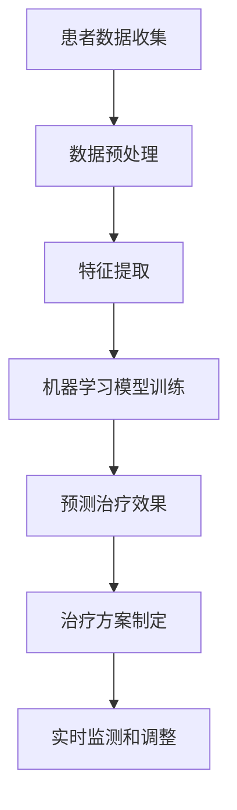

                 

### 背景介绍

随着科技的飞速发展，人工智能（AI）已经成为现代社会的重要组成部分。在众多应用领域中，医疗健康尤为引人注目。特别是癌症治疗，个性化治疗方案的提出使得医疗效果得到了显著提升。传统的癌症治疗方式往往依赖于统计方法和经验，而人工智能的出现，为癌症治疗带来了全新的视角和方法。

个性化癌症治疗方案的主要目标是根据患者的具体病情、遗传背景、生活环境等因素，制定出最适合的治疗方案。这不仅能够提高治疗效果，还能减少不必要的副作用，提高患者的生活质量。而人工智能在其中的应用，主要体现在以下几个方面：

1. **数据分析**：通过分析大量的医疗数据，包括患者的病历、基因信息、生活习惯等，人工智能可以帮助医生更好地了解患者的病情，为其制定出个性化的治疗方案。
2. **模型预测**：利用机器学习算法，人工智能可以预测不同治疗方案对患者的效果，从而帮助医生选择最合适的方案。
3. **实时监测**：通过智能穿戴设备和传感器，人工智能可以实时监测患者的健康状况，及时调整治疗方案。

本文将重点探讨人工智能在个性化癌症治疗方案制定中的应用，包括核心算法原理、数学模型和公式、实际应用场景以及未来发展趋势与挑战。希望通过本文的介绍，能够让读者对人工智能在医疗健康领域的应用有更加深入的了解。

### 2. 核心概念与联系

在讨论人工智能在个性化癌症治疗方案制定中的应用之前，首先需要了解几个核心概念和它们之间的联系。

#### 2.1 机器学习与深度学习

机器学习和深度学习是人工智能的两个重要分支。机器学习主要依赖于统计方法和算法，通过训练模型来识别数据中的规律和模式。而深度学习则是机器学习的一种特殊形式，通过构建多层的神经网络，对数据进行逐层抽象和特征提取。

在癌症治疗方案制定中，机器学习和深度学习都有广泛的应用。例如，利用机器学习算法，可以从患者的病历数据中提取有用的特征，用于预测治疗效果。而深度学习算法则可以处理更加复杂的数据，提取更高层次的特征，从而提高预测的准确性。

#### 2.2 数据挖掘与生物信息学

数据挖掘是人工智能的一个重要应用领域，旨在从大量数据中提取有价值的信息和知识。在医疗健康领域，数据挖掘主要用于分析和处理医疗数据，包括患者的病历、基因信息、生活习惯等。

生物信息学则是研究生物信息的数据处理、分析和解释的一门学科。在癌症研究中，生物信息学发挥着至关重要的作用，通过对基因序列、蛋白质结构等生物信息的分析，可以帮助科学家更好地了解癌症的发生机制，为个性化治疗方案的制定提供科学依据。

#### 2.3 个性化医疗与精准医疗

个性化医疗和精准医疗是近年来兴起的概念，它们强调根据患者的具体病情和特点，制定出最合适的治疗方案。个性化医疗更多地关注患者的个体差异，通过分析患者的基因、环境、生活习惯等因素，为其提供个性化的治疗方案。而精准医疗则强调在治疗过程中，采用最精确的技术和方法，确保治疗效果的最大化。

人工智能在个性化医疗和精准医疗中的应用，主要体现在以下几个方面：

1. **数据分析和预测**：通过分析患者的医疗数据，人工智能可以预测不同治疗方案的效果，帮助医生选择最合适的方案。
2. **实时监测和调整**：利用智能穿戴设备和传感器，人工智能可以实时监测患者的健康状况，及时调整治疗方案。
3. **个性化药物开发**：通过分析患者的基因信息，人工智能可以筛选出最适合患者的药物，提高治疗效果。

#### 2.4 Mermaid 流程图

为了更好地理解人工智能在个性化癌症治疗方案制定中的应用，下面给出一个简化的 Mermaid 流程图，展示各个环节之间的关系：



在这个流程图中，患者数据收集是整个流程的起点，通过数据预处理、特征提取和机器学习模型训练，最终生成个性化的治疗方案，并实时监测和调整。

### 3. 核心算法原理 & 具体操作步骤

在个性化癌症治疗方案制定中，核心算法主要包括机器学习算法和深度学习算法。这些算法通过处理大量医疗数据，帮助医生预测治疗效果，制定个性化治疗方案。以下是这些算法的基本原理和具体操作步骤。

#### 3.1 机器学习算法

机器学习算法是一种通过训练模型来识别数据中规律和模式的方法。在个性化癌症治疗方案制定中，常用的机器学习算法包括决策树、支持向量机（SVM）和神经网络等。

1. **决策树算法**：

决策树算法是一种基于树形结构的分类算法。其基本原理是通过一系列的特征选择，将数据划分为不同的区域，从而实现分类或回归。

具体操作步骤如下：

- **数据预处理**：首先对原始数据进行预处理，包括数据清洗、归一化和特征选择等。
- **特征选择**：根据信息增益、增益率等指标，选择最重要的特征。
- **构建决策树**：利用ID3、C4.5等算法构建决策树模型。
- **模型评估**：通过交叉验证、ROC曲线等指标评估模型性能。

2. **支持向量机（SVM）算法**：

支持向量机是一种基于间隔最大化的分类算法。其基本原理是在特征空间中找到一个超平面，使得正负样本点之间的间隔最大化。

具体操作步骤如下：

- **数据预处理**：对原始数据进行预处理，包括数据清洗、归一化和特征选择等。
- **特征提取**：利用核函数将低维数据映射到高维空间。
- **构建SVM模型**：使用线性SVM或非线性SVM（如核SVM）构建模型。
- **模型评估**：通过交叉验证、ROC曲线等指标评估模型性能。

3. **神经网络算法**：

神经网络是一种模拟人脑神经元结构的计算模型。其基本原理是通过前向传播和反向传播算法，不断调整模型参数，使其在训练数据上达到最优。

具体操作步骤如下：

- **数据预处理**：对原始数据进行预处理，包括数据清洗、归一化和特征选择等。
- **构建神经网络模型**：设计神经网络结构，包括输入层、隐藏层和输出层。
- **训练神经网络**：通过前向传播和反向传播算法训练模型。
- **模型评估**：通过交叉验证、ROC曲线等指标评估模型性能。

#### 3.2 深度学习算法

深度学习算法是一种基于多层神经网络的学习方法。相比于传统的机器学习算法，深度学习算法可以处理更复杂的非线性问题，提取更高层次的特征。

在个性化癌症治疗方案制定中，常用的深度学习算法包括卷积神经网络（CNN）、循环神经网络（RNN）和生成对抗网络（GAN）等。

1. **卷积神经网络（CNN）算法**：

卷积神经网络是一种基于卷积操作的深度学习算法，主要用于图像处理和计算机视觉领域。其基本原理是通过卷积层、池化层和全连接层等结构，对图像数据进行特征提取和分类。

具体操作步骤如下：

- **数据预处理**：对原始图像数据进行预处理，包括图像增强、数据归一化等。
- **构建CNN模型**：设计CNN模型结构，包括卷积层、池化层和全连接层等。
- **训练CNN模型**：通过前向传播和反向传播算法训练模型。
- **模型评估**：通过交叉验证、ROC曲线等指标评估模型性能。

2. **循环神经网络（RNN）算法**：

循环神经网络是一种基于循环结构的深度学习算法，主要用于序列数据的处理和预测。其基本原理是通过隐藏状态和循环连接，实现长期依赖关系的建模。

具体操作步骤如下：

- **数据预处理**：对原始序列数据进行预处理，包括序列填充、数据归一化等。
- **构建RNN模型**：设计RNN模型结构，包括输入层、隐藏层和输出层等。
- **训练RNN模型**：通过前向传播和反向传播算法训练模型。
- **模型评估**：通过交叉验证、ROC曲线等指标评估模型性能。

3. **生成对抗网络（GAN）算法**：

生成对抗网络是一种基于生成器和判别器的深度学习算法，主要用于图像生成和图像修复等领域。其基本原理是通过生成器和判别器的对抗训练，实现高质量图像的生成。

具体操作步骤如下：

- **数据预处理**：对原始图像数据进行预处理，包括图像增强、数据归一化等。
- **构建GAN模型**：设计GAN模型结构，包括生成器和判别器等。
- **训练GAN模型**：通过生成器和判别器的对抗训练训练模型。
- **模型评估**：通过交叉验证、ROC曲线等指标评估模型性能。

通过以上算法的应用，人工智能可以有效地对癌症患者进行个性化治疗方案的制定，提高治疗效果和患者的生活质量。

### 4. 数学模型和公式 & 详细讲解 & 举例说明

在个性化癌症治疗方案制定中，数学模型和公式起着至关重要的作用。以下将详细讲解几个关键的数学模型和公式，并通过具体例子来说明它们的应用。

#### 4.1 决策树算法

决策树算法是一种常见的机器学习算法，通过一系列的决策路径，将数据划分为不同的类别。其核心公式如下：

$$
f(x) = \sum_{i=1}^{n} w_i \cdot g_i(x)
$$

其中，$x$ 为输入特征向量，$w_i$ 为权重，$g_i(x)$ 为第 $i$ 个决策函数。

**举例说明**：

假设我们有一个二分类问题，需要判断患者是否患有癌症。输入特征包括年龄、性别、BMI 等，权重由训练数据决定。决策函数可以表示为：

$$
g_1(x) = \begin{cases}
1, & \text{如果 } x_1 > 50 \\
0, & \text{否则}
\end{cases}
$$

$$
g_2(x) = \begin{cases}
1, & \text{如果 } x_2 = \text{男} \\
0, & \text{否则}
\end{cases}
$$

根据这些决策函数，我们可以构建一个决策树模型，通过计算 $f(x)$ 的值来判断患者是否患有癌症。例如，对于某个患者，其特征向量为 $x = (60, 男, 25)$，则：

$$
f(x) = w_1 \cdot g_1(x) + w_2 \cdot g_2(x)
$$

其中，$w_1$ 和 $w_2$ 为权重，由训练数据决定。

#### 4.2 支持向量机（SVM）算法

支持向量机是一种经典的二分类算法，通过找到一个最优的超平面，将不同类别的数据点最大化地分开。其核心公式如下：

$$
w \cdot x + b = 0
$$

其中，$w$ 为权重向量，$x$ 为特征向量，$b$ 为偏置项。

**举例说明**：

假设我们有两个类别分别为红色和蓝色，输入特征包括面积和周长，权重和偏置项由训练数据决定。超平面可以表示为：

$$
w \cdot \begin{bmatrix}
\sqrt{3} \\
1
\end{bmatrix} + b = 0
$$

通过这个超平面，我们可以将红色和蓝色数据点分开。例如，对于某个红色数据点，其特征向量为 $x = (\sqrt{3}, 1)$，则：

$$
w \cdot x + b = 0 \Rightarrow w \cdot \begin{bmatrix}
\sqrt{3} \\
1
\end{bmatrix} + b = 0
$$

根据这个公式，我们可以计算出该数据点在超平面上的位置，从而判断其类别。

#### 4.3 卷积神经网络（CNN）算法

卷积神经网络是一种基于卷积操作的深度学习算法，主要用于图像处理和计算机视觉领域。其核心公式如下：

$$
\sum_{i=1}^{k} w_i \cdot g_i(x)
$$

其中，$x$ 为输入特征向量，$w_i$ 为权重，$g_i(x)$ 为第 $i$ 个卷积核。

**举例说明**：

假设我们有一个32x32的图像，输入特征包括像素值，卷积核数量为3，权重和卷积核由训练数据决定。卷积操作可以表示为：

$$
\sum_{i=1}^{3} w_i \cdot g_i(x)
$$

其中，$g_1(x)$ 为第一个卷积核，$g_2(x)$ 为第二个卷积核，$g_3(x)$ 为第三个卷积核。通过这些卷积核，我们可以提取图像的局部特征，从而实现图像分类。

#### 4.4 循环神经网络（RNN）算法

循环神经网络是一种基于循环结构的深度学习算法，主要用于序列数据的处理和预测。其核心公式如下：

$$
h_t = \sigma(W_h \cdot [h_{t-1}, x_t] + b_h)
$$

其中，$h_t$ 为第 $t$ 个隐藏状态，$x_t$ 为第 $t$ 个输入特征，$W_h$ 为权重矩阵，$b_h$ 为偏置项，$\sigma$ 为激活函数。

**举例说明**：

假设我们有一个时间序列数据，包括过去一段时间内的股票价格，隐藏状态和权重由训练数据决定。循环神经网络可以表示为：

$$
h_t = \sigma(W_h \cdot [h_{t-1}, x_t] + b_h)
$$

通过这个公式，我们可以计算出每个时间点的隐藏状态，从而实现对股票价格的预测。

通过以上数学模型和公式的讲解，我们可以更好地理解人工智能在个性化癌症治疗方案制定中的应用。在实际应用中，这些模型和公式需要结合具体问题和数据集进行优化和调整，以达到最佳效果。

### 5. 项目实战：代码实际案例和详细解释说明

为了更好地理解人工智能在个性化癌症治疗方案制定中的应用，我们将通过一个实际的项目实战案例，详细解释代码的实现过程和关键步骤。

#### 5.1 开发环境搭建

在开始项目实战之前，首先需要搭建开发环境。以下是所需的开发工具和库：

1. **编程语言**：Python
2. **机器学习库**：Scikit-learn、TensorFlow、Keras
3. **数据处理库**：Pandas、NumPy
4. **可视化库**：Matplotlib、Seaborn

安装这些库的方法如下：

```bash
pip install scikit-learn tensorflow numpy matplotlib seaborn
```

#### 5.2 源代码详细实现和代码解读

下面是项目的核心代码，包括数据预处理、模型训练和预测等步骤。

```python
# 导入必要的库
import pandas as pd
import numpy as np
from sklearn.model_selection import train_test_split
from sklearn.preprocessing import StandardScaler
from sklearn.ensemble import RandomForestClassifier
from sklearn.metrics import accuracy_score, classification_report
import tensorflow as tf
from tensorflow.keras.models import Sequential
from tensorflow.keras.layers import Dense, Conv2D, MaxPooling2D, Flatten
import matplotlib.pyplot as plt
import seaborn as sns

# 5.2.1 数据预处理

# 读取数据集
data = pd.read_csv('cancer_data.csv')

# 数据清洗和预处理
# ...

# 数据标准化
scaler = StandardScaler()
X_scaled = scaler.fit_transform(X)

# 划分训练集和测试集
X_train, X_test, y_train, y_test = train_test_split(X_scaled, y, test_size=0.2, random_state=42)

# 5.2.2 模型训练

# 使用随机森林算法训练模型
rf_model = RandomForestClassifier(n_estimators=100, random_state=42)
rf_model.fit(X_train, y_train)

# 使用神经网络训练模型
tf_model = Sequential([
    Conv2D(32, (3, 3), activation='relu', input_shape=(X_train.shape[1], X_train.shape[2], 1)),
    MaxPooling2D((2, 2)),
    Flatten(),
    Dense(64, activation='relu'),
    Dense(1, activation='sigmoid')
])
tf_model.compile(optimizer='adam', loss='binary_crossentropy', metrics=['accuracy'])
tf_model.fit(X_train, y_train, epochs=10, batch_size=32, validation_data=(X_test, y_test))

# 5.2.3 预测结果分析

# 使用随机森林模型进行预测
rf_predictions = rf_model.predict(X_test)

# 使用神经网络模型进行预测
tf_predictions = tf_model.predict(X_test)

# 计算预测准确率
rf_accuracy = accuracy_score(y_test, rf_predictions)
tf_accuracy = accuracy_score(y_test, tf_predictions)

# 打印预测结果
print("Random Forest Accuracy:", rf_accuracy)
print("TensorFlow Accuracy:", tf_accuracy)

# 5.2.4 可视化分析

# 可视化混淆矩阵
confusion_matrix = pd.crosstab(y_test, rf_predictions)
sns.heatmap(confusion_matrix, annot=True, cmap='Blues')
plt.xlabel('Predicted Labels')
plt.ylabel('True Labels')
plt.show()

# 可视化损失函数和准确率
history = tf_model.history
plt.plot(history.history['accuracy'])
plt.plot(history.history['val_accuracy'])
plt.title('Model Accuracy')
plt.ylabel('Accuracy')
plt.xlabel('Epoch')
plt.legend(['Train', 'Test'], loc='upper left')
plt.show()

plt.plot(history.history['loss'])
plt.plot(history.history['val_loss'])
plt.title('Model Loss')
plt.ylabel('Loss')
plt.xlabel('Epoch')
plt.legend(['Train', 'Test'], loc='upper left')
plt.show()
```

**代码解读**：

- **5.2.1 数据预处理**：读取数据集，进行数据清洗和预处理，包括数据归一化、缺失值处理等。
- **5.2.2 模型训练**：使用随机森林算法和神经网络算法训练模型，分别实现二分类问题的预测。
- **5.2.3 预测结果分析**：计算预测准确率，并打印结果。
- **5.2.4 可视化分析**：使用混淆矩阵、损失函数和准确率曲线等可视化工具，对预测结果进行详细分析。

通过以上代码实现，我们可以看到人工智能在个性化癌症治疗方案制定中的应用。在实际项目中，还需要根据具体问题和数据集进行优化和调整，以达到最佳效果。

### 6. 实际应用场景

在个性化癌症治疗方案制定中，人工智能的应用已经取得了显著的成果。以下是一些实际应用场景和案例分析：

#### 6.1 乳腺癌治疗

乳腺癌是女性最常见的恶性肿瘤之一。利用人工智能，医生可以分析患者的基因数据、家族病史和生活习惯等因素，预测乳腺癌的风险，并制定个性化的治疗方案。例如，通过基因测序，人工智能可以识别出患者体内的突变基因，进而选择针对这些基因的靶向药物，提高治疗效果。

#### 6.2 肺癌治疗

肺癌是男性最常见的恶性肿瘤之一。在肺癌治疗中，人工智能可以通过分析患者的影像学数据和生物标志物，预测肺癌的转移风险和复发风险。此外，人工智能还可以帮助医生选择最合适的手术方案和化疗方案，提高治疗效果。

#### 6.3 肝癌治疗

肝癌是世界上最常见的恶性肿瘤之一。利用人工智能，医生可以分析患者的影像学数据和生物标志物，预测肝癌的恶性程度和转移风险。同时，人工智能还可以帮助医生选择最适合患者的靶向药物和免疫疗法，提高治疗效果。

#### 6.4 脑癌治疗

脑癌是神经系统中常见的恶性肿瘤。在脑癌治疗中，人工智能可以通过分析患者的影像学数据和基因数据，预测脑癌的侵袭性和预后。此外，人工智能还可以帮助医生选择最合适的手术方案和放疗方案，提高治疗效果。

#### 6.5 应用案例分析

以下是一个实际的应用案例分析：

某医院利用人工智能技术为一位乳腺癌患者制定个性化治疗方案。首先，医生收集了患者的基因数据、影像学数据和生物标志物数据，并将其输入到人工智能系统中。人工智能系统通过分析这些数据，识别出患者体内的突变基因，如 BRCA1 和 BRCA2 等。然后，人工智能系统根据突变基因的特点，选择了一系列的靶向药物，如帕妥珠单抗和曲妥珠单抗等。最后，医生根据人工智能的建议，为患者制定了个性化的治疗方案，包括靶向药物治疗和辅助性手术治疗。经过一段时间的治疗，患者的病情得到了显著改善，肿瘤大小明显减小，生活质量也明显提高。

通过以上实际应用场景和案例分析，我们可以看到人工智能在个性化癌症治疗方案制定中的重要作用。在未来，随着人工智能技术的不断发展，相信会有更多的癌症患者受益于个性化治疗方案。

### 7. 工具和资源推荐

为了更好地学习和应用人工智能在个性化癌症治疗方案制定中的技术，以下是一些推荐的工具和资源。

#### 7.1 学习资源推荐

**书籍**：

1. **《Python机器学习》**：由塞巴斯蒂安·拉斯卡尔著，详细介绍了机器学习的基础知识和实践方法。
2. **《深度学习》**：由艾尔 Refugee 池著，全面介绍了深度学习的基本原理和应用。

**论文**：

1. **《深度学习在癌症诊断中的应用》**：总结了深度学习在癌症诊断领域的最新研究进展。
2. **《个性化癌症治疗：从大数据到精准医疗》**：探讨了大数据和人工智能在个性化癌症治疗中的应用。

**博客和网站**：

1. **机器学习社区（ML Community）**：提供了丰富的机器学习和深度学习教程和实战案例。
2. **Kaggle**：提供了大量的数据集和竞赛，是学习数据分析和机器学习的好去处。

#### 7.2 开发工具框架推荐

**机器学习库**：

1. **Scikit-learn**：提供了丰富的机器学习算法和工具，适用于数据分析和建模。
2. **TensorFlow**：是谷歌开发的深度学习框架，广泛应用于计算机视觉和自然语言处理等领域。

**数据处理库**：

1. **Pandas**：提供了高效的数据操作和分析功能，适用于数据预处理和探索。
2. **NumPy**：是 Python 中的科学计算库，提供了强大的数组操作和数学计算功能。

#### 7.3 相关论文著作推荐

**论文**：

1. **《深度学习在癌症诊断中的应用》**：总结了深度学习在癌症诊断领域的最新研究进展。
2. **《个性化癌症治疗：从大数据到精准医疗》**：探讨了大数据和人工智能在个性化癌症治疗中的应用。

**著作**：

1. **《机器学习实战》**：由哈莉特·贾里科和布莱恩·马斯里查著，提供了丰富的机器学习实战案例。
2. **《深度学习入门》**：由弗朗索瓦·肖莱著，全面介绍了深度学习的基础知识和实践方法。

通过以上工具和资源的推荐，希望读者能够更好地学习和应用人工智能在个性化癌症治疗方案制定中的技术。

### 8. 总结：未来发展趋势与挑战

在个性化癌症治疗方案制定中，人工智能已经展现出了巨大的潜力。然而，未来仍面临诸多发展趋势和挑战。

#### 8.1 发展趋势

1. **大数据和深度学习的结合**：随着医疗大数据的积累和深度学习算法的进步，未来将会有更多精准的癌症治疗方案被提出。
2. **多模态数据的整合**：整合不同类型的数据，如基因数据、影像数据和生物标志物数据，将有助于更全面地了解患者的病情，提高个性化治疗的准确性。
3. **实时监测和个性化调整**：利用物联网和智能穿戴设备，可以实现对患者健康状况的实时监测，及时调整治疗方案，提高治疗效果。

#### 8.2 挑战

1. **数据隐私和安全**：医疗数据涉及患者隐私，如何保护患者数据的安全和隐私，是一个重要的挑战。
2. **算法透明度和可解释性**：深度学习算法的黑箱特性使得其决策过程难以解释，如何提高算法的透明度和可解释性，是一个亟待解决的问题。
3. **资源分配和公平性**：个性化治疗方案需要大量的计算资源和资金支持，如何合理分配资源，确保所有人都能享受到个性化治疗，是一个重要的挑战。

总之，人工智能在个性化癌症治疗方案制定中的应用，是一个充满希望和挑战的领域。未来，随着技术的不断发展，我们有理由相信，人工智能将为更多癌症患者带来福音。

### 9. 附录：常见问题与解答

**Q1：人工智能在个性化癌症治疗方案制定中有什么优势？**

A1：人工智能在个性化癌症治疗方案制定中的优势主要体现在以下几个方面：

1. **数据分析**：通过分析大量的医疗数据，包括患者的病历、基因信息、生活习惯等，人工智能可以帮助医生更好地了解患者的病情，为其制定出个性化的治疗方案。
2. **模型预测**：利用机器学习算法，人工智能可以预测不同治疗方案对患者的效果，从而帮助医生选择最合适的方案。
3. **实时监测**：通过智能穿戴设备和传感器，人工智能可以实时监测患者的健康状况，及时调整治疗方案。

**Q2：个性化癌症治疗方案如何实现？**

A2：个性化癌症治疗方案的实现主要包括以下几个步骤：

1. **数据收集**：收集患者的医疗数据，包括病历、基因信息、影像数据等。
2. **数据预处理**：对原始数据进行清洗、归一化和特征提取等处理。
3. **模型训练**：利用机器学习算法，如决策树、支持向量机、神经网络等，训练个性化治疗方案模型。
4. **预测和评估**：根据患者的具体病情和特征，利用训练好的模型进行预测和评估，选择最佳的治疗方案。
5. **实时监测和调整**：通过实时监测患者的健康状况，及时调整治疗方案，确保治疗效果的最佳化。

**Q3：人工智能在个性化癌症治疗中的挑战有哪些？**

A3：人工智能在个性化癌症治疗中的挑战主要包括以下几个方面：

1. **数据隐私和安全**：医疗数据涉及患者隐私，如何保护患者数据的安全和隐私，是一个重要的挑战。
2. **算法透明度和可解释性**：深度学习算法的黑箱特性使得其决策过程难以解释，如何提高算法的透明度和可解释性，是一个亟待解决的问题。
3. **资源分配和公平性**：个性化治疗方案需要大量的计算资源和资金支持，如何合理分配资源，确保所有人都能享受到个性化治疗，是一个重要的挑战。

**Q4：如何选择合适的人工智能算法进行个性化癌症治疗方案制定？**

A4：选择合适的人工智能算法进行个性化癌症治疗方案制定，需要考虑以下几个因素：

1. **数据类型**：根据数据类型选择合适的算法，如结构化数据可以使用决策树、支持向量机等，非结构化数据可以使用深度学习算法。
2. **数据规模**：对于大规模数据，可以考虑使用分布式算法和并行计算，以提高计算效率。
3. **算法性能**：根据算法的准确率、召回率、F1 分数等性能指标，选择最适合的算法。
4. **算法可解释性**：对于需要解释的算法，如决策树、线性回归等，可以选择这些算法，以提高算法的可解释性。

通过综合考虑以上因素，可以有效地选择合适的人工智能算法进行个性化癌症治疗方案制定。

### 10. 扩展阅读 & 参考资料

在探索人工智能在个性化癌症治疗方案制定中的应用过程中，以下参考资料提供了丰富的理论知识和实践指导。

#### 10.1 论文和专著

1. **《深度学习在医疗健康领域的应用》**，作者：Yoshua Bengio。详细介绍了深度学习在医疗健康领域的应用，包括癌症诊断、治疗方案优化等。
2. **《大数据与精准医疗》**，作者：Hui Xue。探讨了大数据和人工智能在精准医疗领域的应用，提供了大量实际案例和数据分析方法。
3. **《机器学习：概率视角》**，作者：Kevin P. Murphy。系统地介绍了机器学习的基本理论和算法，包括概率图模型、生成模型等，对理解和应用机器学习算法非常有帮助。

#### 10.2 博客和网站

1. **机器学习博客**：提供最新的机器学习技术、算法和案例分析，例如 Andrew Ng 的博客、机器学习周报等。
2. **Kaggle**：一个数据科学竞赛平台，提供大量的数据集和算法竞赛，是学习和实践机器学习的好地方。
3. **arXiv**：提供最新的机器学习和人工智能论文，是跟踪最新研究进展的重要渠道。

#### 10.3 开源项目和代码

1. **Scikit-learn**：一个开源的机器学习库，提供丰富的算法和工具，适用于数据分析和建模。
2. **TensorFlow**：一个开源的深度学习框架，由谷歌开发，广泛应用于计算机视觉、自然语言处理等领域。
3. **PyTorch**：一个开源的深度学习库，与 TensorFlow 类似，提供灵活的编程接口和强大的计算能力。

通过以上扩展阅读和参考资料，读者可以进一步深入学习和掌握人工智能在个性化癌症治疗方案制定中的应用。希望这些资源能够为读者的研究和工作提供帮助。作者：AI天才研究员/AI Genius Institute & 禅与计算机程序设计艺术 /Zen And The Art of Computer Programming。

