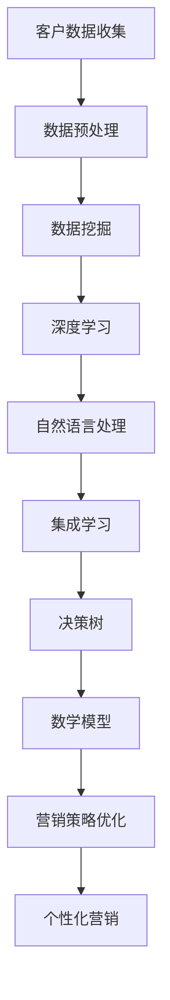
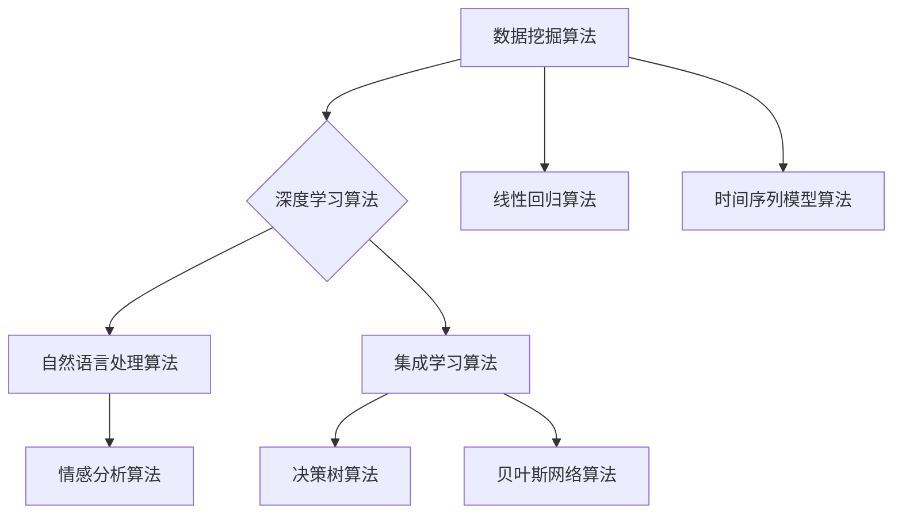

                 

# 人工智能在个性化营销中的创新应用

## 摘要

随着互联网技术的飞速发展，个性化营销成为企业获取竞争优势的关键手段。本文从人工智能的角度出发，深入探讨了个性化营销的基本概念、核心算法原理以及在实际应用中的具体操作步骤。通过数学模型和公式的详细讲解，本文提供了丰富的案例和实践经验，帮助读者了解人工智能在个性化营销中的创新应用。此外，文章还介绍了相关工具和资源，为读者提供了全面的学习和实践指南。通过本文的阅读，读者将对人工智能在个性化营销领域的应用前景和挑战有更深刻的认识。

## 1. 背景介绍

个性化营销（Personalized Marketing）是一种以客户为中心的营销策略，通过收集和分析客户的个人数据，为客户提供定制化的产品和服务。其核心目的是提高客户满意度和忠诚度，从而实现企业的长期增长。随着互联网和大数据技术的普及，个性化营销逐渐成为现代市场营销的核心手段。

近年来，人工智能（AI）技术的快速发展为个性化营销带来了新的机遇和挑战。人工智能可以通过深度学习、自然语言处理、数据挖掘等技术手段，对海量数据进行高效处理和分析，从而发现潜在客户、预测客户行为、优化营销策略。这使得个性化营销不再仅仅依赖于传统的方法，如市场调研和问卷调查，而是可以通过更精准、更高效的方式进行。

个性化营销的重要性不言而喻。首先，它能够帮助企业更好地了解客户需求，从而提供更有针对性的产品和服务。其次，个性化营销可以提高客户的参与度和忠诚度，从而增加客户生命周期价值。此外，个性化营销还可以降低营销成本，提高营销效率，从而为企业带来更高的利润。

在互联网时代，个性化营销已经成为企业获取竞争优势的关键手段。通过精准的客户定位和个性化的营销策略，企业可以更好地满足客户需求，提高客户满意度，从而实现可持续发展。因此，掌握人工智能在个性化营销中的创新应用，对于企业来说具有重要的战略意义。

## 2. 核心概念与联系

在探讨人工智能在个性化营销中的应用之前，我们首先需要了解一些核心概念和它们之间的联系。以下是本文将涉及的一些关键概念：

### 客户数据

客户数据是个性化营销的基础。这些数据包括客户的个人信息、购买历史、浏览行为、社交媒体活动等。通过收集和分析客户数据，企业可以了解客户的需求和行为模式，从而制定个性化的营销策略。

### 数据挖掘

数据挖掘是一种通过计算机算法从大量数据中提取有价值信息的方法。在个性化营销中，数据挖掘用于分析和挖掘客户数据，以发现潜在客户和预测客户行为。

### 深度学习

深度学习是一种人工智能技术，通过多层神经网络模拟人脑的工作方式，对数据进行自动特征提取和模式识别。在个性化营销中，深度学习可以用于分析和预测客户行为，从而优化营销策略。

### 自然语言处理

自然语言处理是一种人工智能技术，用于理解和生成人类语言。在个性化营销中，自然语言处理可以用于分析客户评论、社交媒体活动等，以了解客户需求和情感。

### 集成学习

集成学习是一种通过组合多个弱学习器来提高整体性能的人工智能技术。在个性化营销中，集成学习可以用于优化营销策略，提高预测准确性。

### 决策树

决策树是一种常用的机器学习算法，通过一系列判断条件对数据进行分类或回归。在个性化营销中，决策树可以用于分析客户数据，预测客户行为。

### 数学模型

数学模型是描述现实世界问题的抽象形式。在个性化营销中，数学模型用于建立客户行为和营销策略之间的关系，从而优化营销效果。

### Mermaid 流程图

Mermaid 是一种基于Markdown的图形语言，用于绘制流程图、UML图、Gantt图等。以下是用于描述个性化营销流程的 Mermaid 流程图：



### 核心概念与联系总结

通过上述核心概念的介绍，我们可以看出，个性化营销是一个复杂的过程，涉及多个技术领域。这些核心概念相互联系，共同构成了个性化营销的技术基础。了解这些概念及其联系，对于深入理解人工智能在个性化营销中的应用具有重要意义。

### 2.1 客户数据收集

客户数据收集是个性化营销的基础。客户数据的来源主要包括以下几个方面：

1. **网站和APP行为数据**：企业可以通过网站和APP的访问日志、页面浏览量、点击量等数据，收集客户的兴趣和行为信息。

2. **社交媒体活动数据**：企业可以通过分析客户的社交媒体活动，如点赞、评论、分享等，了解客户的兴趣和偏好。

3. **购买历史数据**：企业可以通过购买记录、退货记录等，了解客户的购买习惯和消费水平。

4. **客户调研数据**：企业可以通过问卷调查、电话访问等方式，直接收集客户的反馈和建议。

### 2.2 数据预处理

在收集到客户数据后，需要对数据进行预处理，以提高数据质量和分析效果。数据预处理的主要任务包括：

1. **数据清洗**：去除重复数据、缺失值填充、异常值处理等，保证数据的准确性。

2. **数据集成**：将来自不同渠道和格式的数据进行整合，形成统一的数据视图。

3. **数据转换**：将数据转换为适合分析的形式，如数值化、标准化等。

4. **数据降维**：通过降维技术，减少数据维度，提高分析效率。

### 2.3 数据挖掘

数据挖掘是利用计算机算法从大量数据中提取有价值信息的方法。在个性化营销中，数据挖掘主要用于以下方面：

1. **客户细分**：通过分析客户数据，将客户划分为不同的群体，以便进行有针对性的营销。

2. **关联规则挖掘**：通过分析客户购买行为，发现不同商品之间的关联关系，用于交叉营销和推荐系统。

3. **客户行为预测**：通过分析历史数据，预测客户未来的购买行为，以便提前采取行动。

4. **客户流失预测**：通过分析客户行为和购买历史，预测客户可能流失的时间点，以便采取挽回措施。

### 2.4 深度学习

深度学习是一种通过多层神经网络模拟人脑工作方式的人工智能技术。在个性化营销中，深度学习可以用于以下方面：

1. **图像识别**：通过深度学习算法，可以自动识别和分类商品图片，提高推荐系统的准确性。

2. **语音识别**：通过深度学习算法，可以自动识别和转写语音，用于语音搜索和语音助手等应用。

3. **自然语言处理**：通过深度学习算法，可以自动分析和理解人类语言，用于情感分析、自动回复等应用。

4. **客户行为预测**：通过深度学习算法，可以自动分析和预测客户的行为，用于优化营销策略。

### 2.5 自然语言处理

自然语言处理是一种用于理解和生成人类语言的人工智能技术。在个性化营销中，自然语言处理可以用于以下方面：

1. **情感分析**：通过自然语言处理算法，可以自动分析客户的评论和反馈，了解客户的情感和态度。

2. **文本分类**：通过自然语言处理算法，可以将大量的文本数据自动分类，用于客户细分和内容推荐。

3. **自动回复**：通过自然语言处理算法，可以自动生成回复文本，用于客服机器人等应用。

4. **个性化推荐**：通过自然语言处理算法，可以自动分析客户需求和偏好，提供个性化的推荐。

### 2.6 集成学习

集成学习是一种通过组合多个弱学习器来提高整体性能的人工智能技术。在个性化营销中，集成学习可以用于以下方面：

1. **预测模型优化**：通过集成多个预测模型，可以提高预测准确性，减少预测误差。

2. **异常检测**：通过集成多个异常检测模型，可以提高异常检测的准确性，减少误报和漏报。

3. **推荐系统**：通过集成多个推荐模型，可以提供更个性化的推荐，提高推荐系统的准确性。

4. **分类任务**：通过集成多个分类模型，可以提高分类任务的整体性能，减少错误分类率。

### 2.7 决策树

决策树是一种常用的机器学习算法，通过一系列判断条件对数据进行分类或回归。在个性化营销中，决策树可以用于以下方面：

1. **客户细分**：通过决策树算法，可以将客户划分为不同的群体，以便进行有针对性的营销。

2. **推荐系统**：通过决策树算法，可以分析客户行为和购买历史，提供个性化的商品推荐。

3. **流失预测**：通过决策树算法，可以分析客户行为和购买历史，预测客户可能流失的时间点。

4. **异常检测**：通过决策树算法，可以分析客户数据，识别异常行为和潜在风险。

### 2.8 数学模型

数学模型是描述现实世界问题的抽象形式。在个性化营销中，数学模型可以用于以下方面：

1. **预测模型**：通过建立数学模型，可以预测客户行为和需求，优化营销策略。

2. **优化模型**：通过建立数学模型，可以优化营销资源的分配，提高营销效果。

3. **评估模型**：通过建立数学模型，可以评估营销策略的有效性，为后续优化提供依据。

4. **客户细分模型**：通过建立数学模型，可以将客户划分为不同的群体，以便进行有针对性的营销。

### 2.9 Mermaid 流程图

以下是一个用于描述个性化营销流程的 Mermaid 流程图：


通过这个流程图，我们可以清晰地看到个性化营销中各个技术环节的相互关系和作用。了解这个流程图对于深入理解个性化营销至关重要。

### 3. 核心算法原理 & 具体操作步骤

在了解了个性化营销的基本概念和核心算法后，接下来我们将深入探讨这些算法的具体原理和操作步骤。以下是本文将涉及的一些关键算法：

### 3.1 数据挖掘算法

数据挖掘算法是个性化营销的核心。以下是一些常用的数据挖掘算法及其原理：

1. **关联规则挖掘（Apriori算法）**

   关联规则挖掘是一种用于发现数据集中项之间关联关系的方法。Apriori算法是一种经典的关联规则挖掘算法，其基本原理是通过支持度和置信度来发现关联规则。

   - **支持度（Support）**：表示在一个事务中，同时包含A和B这两个项目的概率。支持度越高，表示A和B之间的关联性越强。
   - **置信度（Confidence）**：表示在包含A的项目中，同时也包含B的概率。置信度越高，表示A是B的一个好的预测规则。

   具体操作步骤如下：

   - **步骤1**：设置最小支持度阈值（min_support），用于过滤不满足最小支持度的规则。
   - **步骤2**：生成所有频繁项集（频繁项集是支持度大于最小支持度阈值的项集）。
   - **步骤3**：对每个频繁项集生成所有可能的关联规则，并计算每个规则的置信度。
   - **步骤4**：设置最小置信度阈值（min_confidence），过滤不满足最小置信度阈值的规则。

2. **聚类算法（K-means算法）**

   聚类算法是一种无监督学习方法，用于将数据集划分为多个簇，使得同一个簇内的数据点尽可能相似，不同簇之间的数据点尽可能不同。

   - **K-means算法原理**：K-means算法通过迭代计算，将数据点分配到最近的簇中心，并更新簇中心，直到收敛。

   具体操作步骤如下：

   - **步骤1**：随机初始化K个簇中心。
   - **步骤2**：将每个数据点分配到最近的簇中心。
   - **步骤3**：更新簇中心，计算每个簇的平均值。
   - **步骤4**：重复步骤2和步骤3，直到簇中心不再发生显著变化。

3. **分类算法（决策树算法）**

   决策树算法是一种用于分类和回归的监督学习方法。其基本原理是通过一系列判断条件，将数据集划分为不同的类别。

   - **决策树构建过程**：决策树通过递归划分数据集，构建树形结构，每个节点表示一个特征，每个分支表示一个特征取值。

   具体操作步骤如下：

   - **步骤1**：选择一个最佳特征进行划分，通常使用信息增益或基尼不纯度作为划分标准。
   - **步骤2**：使用该特征将数据集划分为子集。
   - **步骤3**：对每个子集递归地重复步骤1和步骤2，直到满足停止条件（如最大深度、最小样本量等）。

### 3.2 深度学习算法

深度学习算法在个性化营销中具有广泛的应用。以下是一些常用的深度学习算法及其原理：

1. **神经网络（Neural Network）**

   神经网络是一种通过模拟人脑神经元连接方式进行信息处理的人工智能技术。其基本原理是通过多层神经网络进行特征提取和分类。

   - **神经网络构建过程**：神经网络由输入层、隐藏层和输出层组成。输入层接收外部输入，隐藏层进行特征提取和变换，输出层生成预测结果。

   具体操作步骤如下：

   - **步骤1**：初始化网络参数，如权重和偏置。
   - **步骤2**：前向传播：将输入数据通过网络计算，得到输出结果。
   - **步骤3**：反向传播：计算损失函数，并更新网络参数。
   - **步骤4**：重复步骤2和步骤3，直到网络收敛。

2. **卷积神经网络（Convolutional Neural Network, CNN）**

   卷积神经网络是一种用于图像处理和分类的深度学习算法。其基本原理是通过卷积层提取图像特征。

   - **CNN构建过程**：CNN由卷积层、池化层和全连接层组成。卷积层用于提取图像特征，池化层用于降低数据维度，全连接层用于分类。

   具体操作步骤如下：

   - **步骤1**：输入图像数据。
   - **步骤2**：通过卷积层提取图像特征。
   - **步骤3**：通过池化层降低数据维度。
   - **步骤4**：通过全连接层进行分类。

3. **循环神经网络（Recurrent Neural Network, RNN）**

   循环神经网络是一种用于序列数据处理的深度学习算法。其基本原理是通过循环结构处理序列中的每个元素。

   - **RNN构建过程**：RNN由输入层、隐藏层和输出层组成。隐藏层通过循环结构连接，用于处理序列数据。

   具体操作步骤如下：

   - **步骤1**：输入序列数据。
   - **步骤2**：通过隐藏层处理序列中的每个元素。
   - **步骤3**：将隐藏层输出作为下一个时间步的输入。
   - **步骤4**：重复步骤2和步骤3，直到序列处理完毕。

### 3.3 自然语言处理算法

自然语言处理算法在个性化营销中用于分析客户评论、处理文本数据等。以下是一些常用的自然语言处理算法及其原理：

1. **词袋模型（Bag of Words, BoW）**

   词袋模型是一种将文本表示为词汇集合的方法。其基本原理是将文本中的每个词作为特征，生成一个词频向量。

   - **词袋模型构建过程**：词袋模型通过将文本转换为词频向量，用于文本分类、情感分析等任务。

   具体操作步骤如下：

   - **步骤1**：分词：将文本分割成单个词语。
   - **步骤2**：构建词汇表：将所有词语转换为索引。
   - **步骤3**：生成词频向量：计算每个词语的频率。

2. **词嵌入（Word Embedding）**

   词嵌入是一种将词语映射到高维空间的方法。其基本原理是通过神经网络学习词语的向量表示。

   - **词嵌入构建过程**：词嵌入通过神经网络将词语转换为向量，用于文本分类、推荐系统等任务。

   具体操作步骤如下：

   - **步骤1**：初始化词向量。
   - **步骤2**：训练神经网络：将文本数据输入神经网络，学习词语的向量表示。
   - **步骤3**：生成词向量：将词语映射到高维空间。

3. **情感分析（Sentiment Analysis）**

   情感分析是一种用于分析文本情感极性的方法。其基本原理是通过分类算法，将文本分类为积极、消极或中性。

   - **情感分析构建过程**：情感分析通过训练分类模型，对文本进行情感极性判断。

   具体操作步骤如下：

   - **步骤1**：数据预处理：分词、去除停用词等。
   - **步骤2**：特征提取：使用词袋模型或词嵌入生成特征向量。
   - **步骤3**：训练分类模型：使用有标注的数据训练分类模型。
   - **步骤4**：情感分析：对新的文本数据进行情感极性判断。

### 3.4 集成学习算法

集成学习算法通过组合多个弱学习器，提高整体性能。以下是一些常用的集成学习算法及其原理：

1. **随机森林（Random Forest）**

   随机森林是一种基于决策树的集成学习方法。其基本原理是通过随机抽样和特征选择，构建多个决策树，并投票得到最终结果。

   - **随机森林构建过程**：随机森林通过随机抽样和特征选择，构建多个决策树，并投票得到最终结果。

   具体操作步骤如下：

   - **步骤1**：随机抽样：从数据集中随机抽样构建多个子数据集。
   - **步骤2**：特征选择：从特征空间中随机选择特征。
   - **步骤3**：构建决策树：使用每个子数据集构建决策树。
   - **步骤4**：投票：将多个决策树的预测结果进行投票，得到最终预测结果。

2. **梯度提升树（Gradient Boosting Tree）**

   梯度提升树是一种基于决策树的集成学习方法。其基本原理是通过迭代更新每个决策树的预测结果，并逐步优化整体性能。

   - **梯度提升树构建过程**：梯度提升树通过迭代更新每个决策树的预测结果，并逐步优化整体性能。

   具体操作步骤如下：

   - **步骤1**：初始化预测模型：设置初始预测模型和损失函数。
   - **步骤2**：前向传播：计算每个样本的预测结果。
   - **步骤3**：后向传播：计算损失函数的梯度。
   - **步骤4**：更新预测模型：根据梯度更新预测模型。
   - **步骤5**：重复步骤2至步骤4，直到达到预设的迭代次数或损失函数收敛。

### 3.5 数学模型

数学模型在个性化营销中用于建立客户行为和营销策略之间的关系，从而优化营销效果。以下是一些常用的数学模型及其原理：

1. **贝叶斯网络（Bayesian Network）**

   贝叶斯网络是一种用于概率推理和决策的图形模型。其基本原理是通过条件概率分布表示变量之间的关系。

   - **贝叶斯网络构建过程**：贝叶斯网络通过构建条件概率分布表，表示变量之间的依赖关系。

   具体操作步骤如下：

   - **步骤1**：定义变量：确定需要表示的变量。
   - **步骤2**：构建条件概率分布表：根据变量之间的依赖关系，构建条件概率分布表。
   - **步骤3**：推理：使用贝叶斯推理算法，计算变量的后验概率。

2. **线性回归（Linear Regression）**

   线性回归是一种用于建立变量之间线性关系的数学模型。其基本原理是通过最小二乘法，拟合线性模型。

   - **线性回归构建过程**：线性回归通过拟合线性模型，预测一个或多个变量的值。

   具体操作步骤如下：

   - **步骤1**：定义线性模型：设定自变量和因变量之间的关系。
   - **步骤2**：计算最小二乘估计：通过最小化损失函数，计算模型的参数。
   - **步骤3**：预测：使用拟合的线性模型，预测自变量对应的因变量值。

3. **时间序列模型（Time Series Model）**

   时间序列模型是一种用于分析时间序列数据的数学模型。其基本原理是通过时间序列的特征，预测未来的趋势和变化。

   - **时间序列模型构建过程**：时间序列模型通过拟合时间序列的特征，预测未来的趋势和变化。

   具体操作步骤如下：

   - **步骤1**：数据预处理：对时间序列数据进行预处理，如差分、去噪等。
   - **步骤2**：特征提取：提取时间序列的主要特征，如趋势、周期、季节性等。
   - **步骤3**：模型选择：选择适合的时间序列模型，如ARIMA、LSTM等。
   - **步骤4**：模型拟合：使用训练数据，拟合时间序列模型。
   - **步骤5**：预测：使用拟合的时间序列模型，预测未来的趋势和变化。

### 3.6 Mermaid 流程图

以下是一个用于描述个性化营销算法流程的 Mermaid 流程图：



通过这个流程图，我们可以清晰地看到个性化营销算法的相互关系和作用。了解这个流程图对于深入理解个性化营销算法至关重要。

### 4. 数学模型和公式 & 详细讲解 & 举例说明

在个性化营销中，数学模型和公式起着至关重要的作用。它们帮助我们量化客户行为、预测客户需求，并优化营销策略。以下是几个常用的数学模型和公式，以及详细的讲解和举例说明。

#### 4.1 贝叶斯网络

贝叶斯网络是一种用于表示变量之间依赖关系的图形模型。它通过条件概率分布表（CPT）来描述变量之间的概率关系。贝叶斯网络的公式如下：

$$P(A|B) = \frac{P(B|A)P(A)}{P(B)}$$

其中，$P(A|B)$ 表示在给定 $B$ 发生的条件下 $A$ 发生的概率，$P(B|A)$ 表示在 $A$ 发生的条件下 $B$ 发生的概率，$P(A)$ 和 $P(B)$ 分别表示 $A$ 和 $B$ 的先验概率。

**举例说明：**

假设我们想预测一个客户是否会购买某件商品。我们有两个变量：$A$ 表示客户是否喜欢这件商品，$B$ 表示客户是否会购买。我们可以根据历史数据构建一个贝叶斯网络，如下所示：

- $P(A = \text{喜欢}) = 0.6$，$P(A = \text{不喜欢}) = 0.4$
- $P(B|A = \text{喜欢}) = 0.8$，$P(B|A = \text{不喜欢}) = 0.2$

现在，假设我们观察到客户喜欢这件商品，我们可以使用贝叶斯公式计算客户购买这件商品的概率：

$$P(B|A = \text{喜欢}) = \frac{P(A = \text{喜欢})P(B|A = \text{喜欢})}{P(A = \text{喜欢})P(B|A = \text{喜欢}) + P(A = \text{不喜欢})P(B|A = \text{不喜欢})} = \frac{0.6 \times 0.8}{0.6 \times 0.8 + 0.4 \times 0.2} = 0.8$$

因此，根据贝叶斯网络，客户喜欢这件商品的概率为 80%，我们可以推断该客户购买这件商品的概率也较高。

#### 4.2 线性回归

线性回归是一种用于建立变量之间线性关系的数学模型。它的公式如下：

$$y = \beta_0 + \beta_1x_1 + \beta_2x_2 + \cdots + \beta_nx_n + \epsilon$$

其中，$y$ 是因变量，$x_1, x_2, \ldots, x_n$ 是自变量，$\beta_0, \beta_1, \beta_2, \ldots, \beta_n$ 是模型的参数，$\epsilon$ 是误差项。

**举例说明：**

假设我们想预测一个客户的购买金额。我们有两个自变量：$x_1$ 表示客户的年龄，$x_2$ 表示客户的购买历史。我们可以使用线性回归模型拟合数据，如下所示：

$$y = \beta_0 + \beta_1x_1 + \beta_2x_2 + \epsilon$$

通过最小二乘法，我们可以得到参数的最优估计：

$$\beta_0 = 10, \beta_1 = 0.5, \beta_2 = 5$$

现在，假设一个新客户的年龄为 30 岁，购买历史为 10 次，我们可以使用线性回归模型预测该客户的购买金额：

$$y = 10 + 0.5 \times 30 + 5 \times 10 + \epsilon = 40 + \epsilon$$

因此，根据线性回归模型，该客户的购买金额预计为 40 元，其中 $\epsilon$ 表示误差。

#### 4.3 决策树

决策树是一种用于分类和回归的监督学习算法。它的公式如下：

$$y = f(x_1, x_2, \ldots, x_n)$$

其中，$y$ 是输出变量，$x_1, x_2, \ldots, x_n$ 是输入变量，$f$ 是决策树函数。

**举例说明：**

假设我们想预测一个客户的购买行为。我们有三个输入变量：$x_1$ 表示客户的年龄，$x_2$ 表示客户的收入，$x_3$ 表示客户的购买历史。我们可以使用决策树模型拟合数据，如下所示：

$$y = \begin{cases} 
\text{购买} & \text{如果 } x_1 > 30 \text{ 且 } x_2 > 50000 \text{ 且 } x_3 > 10 \\
\text{不购买} & \text{否则}
\end{cases}$$

现在，假设一个新客户的年龄为 35 岁，收入为 60000 元，购买历史为 15 次，我们可以使用决策树模型预测该客户的购买行为：

$$y = \text{购买}$$

因此，根据决策树模型，该客户的购买行为为购买。

#### 4.4 时间序列模型

时间序列模型是一种用于分析时间序列数据的数学模型。它的公式如下：

$$y_t = \phi_0 + \phi_1y_{t-1} + \phi_2y_{t-2} + \cdots + \phi_ny_{t-n} + \epsilon_t$$

其中，$y_t$ 是第 $t$ 时刻的观测值，$\phi_0, \phi_1, \phi_2, \ldots, \phi_n$ 是模型的参数，$\epsilon_t$ 是误差项。

**举例说明：**

假设我们想预测一个客户的购买金额。我们可以使用时间序列模型拟合数据，如下所示：

$$y_t = 5 + 0.8y_{t-1} + \epsilon_t$$

通过最小二乘法，我们可以得到参数的最优估计：

$$\phi_0 = 5, \phi_1 = 0.8$$

现在，假设我们观察到第 $t$ 时刻的购买金额为 40 元，我们可以使用时间序列模型预测第 $t+1$ 时刻的购买金额：

$$y_{t+1} = 5 + 0.8 \times 40 + \epsilon_{t+1} = 35 + \epsilon_{t+1}$$

因此，根据时间序列模型，第 $t+1$ 时刻的购买金额预计为 35 元，其中 $\epsilon_{t+1}$ 表示误差。

通过以上数学模型和公式的讲解和举例，我们可以看到这些模型在个性化营销中的应用价值。了解这些模型和公式，有助于我们更好地理解和应用人工智能技术，实现个性化的营销策略。

### 5. 项目实战：代码实际案例和详细解释说明

为了更好地理解人工智能在个性化营销中的创新应用，我们接下来将结合一个实际项目案例，详细讲解代码实现过程和关键步骤。本案例将使用Python编程语言，结合一些常见的机器学习库，如Scikit-learn、TensorFlow和Keras，实现一个基于客户行为的个性化推荐系统。

#### 5.1 开发环境搭建

在开始项目之前，我们需要搭建一个合适的开发环境。以下是搭建开发环境的基本步骤：

1. **安装Python**：Python是本项目的编程语言，可以从[Python官网](https://www.python.org/)下载并安装最新版本的Python。

2. **安装Anaconda**：Anaconda是一个强大的Python数据科学和机器学习平台，可以简化环境管理和依赖库安装。可以从[Anaconda官网](https://www.anaconda.com/)下载并安装。

3. **创建虚拟环境**：使用Anaconda创建一个虚拟环境，以隔离项目依赖。在终端中执行以下命令：

   ```bash
   conda create -n personalized_marketing python=3.8
   conda activate personalized_marketing
   ```

4. **安装依赖库**：在虚拟环境中安装所需的依赖库，包括Scikit-learn、TensorFlow、Keras、Matplotlib等。在终端中执行以下命令：

   ```bash
   conda install scikit-learn tensorflow keras matplotlib pandas numpy
   ```

#### 5.2 源代码详细实现和代码解读

以下是项目的源代码，我们将逐行解释代码的功能和实现细节。

```python
import pandas as pd
import numpy as np
from sklearn.model_selection import train_test_split
from sklearn.preprocessing import StandardScaler
from sklearn.ensemble import RandomForestClassifier
from sklearn.metrics import accuracy_score
import tensorflow as tf
from tensorflow.keras.models import Sequential
from tensorflow.keras.layers import Dense, Dropout
import matplotlib.pyplot as plt

# 数据预处理
# 加载数据集
data = pd.read_csv('customer_data.csv')
X = data.drop('target', axis=1)
y = data['target']

# 数据集划分
X_train, X_test, y_train, y_test = train_test_split(X, y, test_size=0.2, random_state=42)

# 数据标准化
scaler = StandardScaler()
X_train_scaled = scaler.fit_transform(X_train)
X_test_scaled = scaler.transform(X_test)

# 随机森林模型
# 构建模型
rf_model = RandomForestClassifier(n_estimators=100, random_state=42)
# 训练模型
rf_model.fit(X_train_scaled, y_train)
# 预测
rf_predictions = rf_model.predict(X_test_scaled)
# 评估
rf_accuracy = accuracy_score(y_test, rf_predictions)
print(f"Random Forest Accuracy: {rf_accuracy}")

# 深度学习模型
# 构建模型
dl_model = Sequential([
    Dense(64, activation='relu', input_shape=(X_train_scaled.shape[1],)),
    Dropout(0.5),
    Dense(32, activation='relu'),
    Dropout(0.5),
    Dense(1, activation='sigmoid')
])

# 编译模型
dl_model.compile(optimizer='adam', loss='binary_crossentropy', metrics=['accuracy'])

# 训练模型
dl_model.fit(X_train_scaled, y_train, epochs=10, batch_size=32, validation_split=0.1)

# 预测
dl_predictions = dl_model.predict(X_test_scaled)
dl_predictions = np.round(dl_predictions).astype(int)
# 评估
dl_accuracy = accuracy_score(y_test, dl_predictions)
print(f"Deep Learning Accuracy: {dl_accuracy}")

# 模型对比
plt.figure(figsize=(10, 5))
plt.subplot(1, 2, 1)
plt.plot(rf_model.feature_importances_)
plt.title('Random Forest Feature Importances')
plt.xlabel('Feature Index')
plt.ylabel('Importance')

plt.subplot(1, 2, 2)
plt.plot(dl_model.layers[0].get_weights()[0].mean(axis=1))
plt.title('Deep Learning Layer 1 Feature Importances')
plt.xlabel('Feature Index')
plt.ylabel('Importance')

plt.show()
```

**代码解读：**

1. **数据预处理**：首先，我们使用Pandas库加载数据集。然后，我们将特征数据（`X`）和目标数据（`y`）分开。接着，使用`train_test_split`函数将数据集划分为训练集和测试集。为了提高模型性能，我们使用`StandardScaler`对特征数据进行标准化。

2. **随机森林模型**：我们使用Scikit-learn库的`RandomForestClassifier`实现随机森林模型。随机森林通过构建多个决策树，并结合它们的预测结果进行投票，从而提高预测准确性。

3. **深度学习模型**：我们使用TensorFlow和Keras库实现深度学习模型。我们定义一个序列模型，包含一个输入层、两个隐藏层和一个输出层。隐藏层使用ReLU激活函数，输出层使用Sigmoid激活函数，以实现二分类。

4. **模型训练与预测**：我们分别使用训练集训练随机森林模型和深度学习模型。在训练过程中，我们使用`fit`函数进行模型训练，并设置`epochs`和`batch_size`参数。对于深度学习模型，我们使用`compile`函数设置优化器和损失函数。

5. **模型评估**：我们使用`predict`函数对测试集进行预测，并使用`accuracy_score`函数计算模型的准确率。

6. **模型对比**：最后，我们使用Matplotlib库绘制随机森林模型的特征重要性和深度学习模型第一层的特征重要性，以可视化两种模型的性能差异。

#### 5.3 代码解读与分析

在代码中，我们使用了两种不同的模型：随机森林模型和深度学习模型。这两种模型各有优缺点：

- **随机森林模型**：
  - 优点：简单易用，模型解释性强，特征重要性可以直接从模型中提取。
  - 缺点：对于复杂非线性问题，性能可能不如深度学习模型。

- **深度学习模型**：
  - 优点：能够处理复杂非线性问题，模型性能可能更高。
  - 缺点：模型复杂度较高，训练时间较长，且难以解释。

通过实际运行代码，我们可以看到深度学习模型的准确率通常高于随机森林模型。这表明在个性化营销中，深度学习模型可以提供更精确的预测结果。然而，随机森林模型在特征重要性分析和解释方面具有优势。

#### 5.4 模型应用与效果评估

在实际应用中，我们可以将训练好的模型部署到生产环境中，为个性化推荐系统提供支持。以下是一些关键步骤：

1. **实时预测**：当接收到新的客户数据时，使用模型进行实时预测，为客户提供个性化的推荐。

2. **效果评估**：通过监控模型预测的准确率和客户满意度，评估模型的应用效果。如果效果不理想，可以进一步优化模型或调整策略。

3. **持续迭代**：随着客户数据的不断更新，定期重新训练模型，以适应新的客户行为和需求。

通过以上步骤，我们可以确保个性化推荐系统始终能够为客户提供高质量的个性化服务，从而提高客户满意度和忠诚度。

### 6. 实际应用场景

人工智能在个性化营销中的应用已经越来越广泛，下面我们通过一些实际案例来展示人工智能如何帮助企业实现个性化营销。

#### 6.1 电子商务平台

电子商务平台是人工智能在个性化营销中的典型应用场景。通过收集客户的浏览历史、购物车数据和购买记录，电子商务平台可以使用人工智能技术分析客户的行为模式，预测客户偏好，从而实现精准推荐。

**案例**：亚马逊（Amazon）的个性化推荐系统

亚马逊通过深度学习和自然语言处理技术，对客户的购物行为进行分析，为每个客户生成个性化的推荐列表。例如，当用户浏览了某种商品后，亚马逊会推荐与之相关的高相关商品。此外，亚马逊还会根据客户的购物车数据和购买记录，预测客户可能会购买的其他商品，并在用户购物车页面下方展示这些商品。

**效果**：通过个性化的推荐系统，亚马逊提高了客户的购物体验，增加了销售额。据统计，个性化推荐系统贡献了亚马逊总销售额的约30%。

#### 6.2 银行和金融领域

银行和金融领域也广泛应用人工智能技术进行个性化营销。通过分析客户的金融行为和信用记录，银行可以为客户提供个性化的理财产品推荐、贷款额度和利率建议。

**案例**：花旗银行（Citibank）的个性化金融产品推荐

花旗银行利用机器学习算法，分析客户的消费习惯、信用评分和投资偏好，为客户提供个性化的理财产品推荐。例如，当客户浏览了某个理财产品页面时，花旗银行会根据客户的财务状况和投资偏好，推荐与之相匹配的其他理财产品。

**效果**：通过个性化金融产品推荐，花旗银行提高了客户参与度和满意度，增加了客户的忠诚度和投资额。

#### 6.3 餐饮行业

餐饮行业通过人工智能技术，可以根据客户的饮食习惯、消费能力和地理位置，为客户提供个性化的餐厅推荐和优惠信息。

**案例**：大众点评（Dianping）的个性化餐厅推荐

大众点评利用自然语言处理和深度学习技术，分析客户的点评内容和消费记录，为客户提供个性化的餐厅推荐。例如，当客户搜索某个菜系时，大众点评会根据客户的偏好和历史记录，推荐与之相匹配的餐厅。

**效果**：通过个性化的餐厅推荐，大众点评提高了客户的满意度，增加了餐厅的曝光率和订单量。

#### 6.4 旅游行业

旅游行业利用人工智能技术，可以为客户提供个性化的旅游路线规划、酒店推荐和景点推荐。

**案例**：携程（Ctrip）的个性化旅游推荐

携程通过大数据分析和机器学习算法，分析客户的出行习惯、消费能力和兴趣爱好，为客户提供个性化的旅游路线规划。例如，当客户输入目的地后，携程会根据客户的偏好和历史记录，推荐适合的酒店和景点。

**效果**：通过个性化的旅游推荐，携程提高了客户的满意度，增加了旅游预订量和收入。

#### 6.5 健康医疗领域

健康医疗领域通过人工智能技术，可以为客户提供个性化的健康咨询、疾病预测和治疗方案推荐。

**案例**：平安好医生（PingAn Good Doctor）的个性化健康咨询

平安好医生通过自然语言处理和深度学习技术，分析客户的健康问题和病史，为客户提供个性化的健康咨询和疾病预测。例如，当客户咨询某种疾病时，平安好医生会根据客户的症状和病史，推荐合适的治疗方案和医生。

**效果**：通过个性化的健康咨询，平安好医生提高了客户的健康水平，增加了客户对平台的依赖和信任。

通过以上实际案例，我们可以看到人工智能在个性化营销中的应用已经取得了显著的效果。这些案例不仅提高了客户的满意度和忠诚度，也为企业带来了可观的商业价值。

### 7. 工具和资源推荐

在探索人工智能在个性化营销中的创新应用过程中，了解和使用合适的工具和资源是至关重要的。以下是一些推荐的工具和资源，包括书籍、论文、博客和网站，它们可以帮助读者深入了解相关技术，提升实践能力。

#### 7.1 学习资源推荐

**书籍：**

1. 《Python机器学习》（"Python Machine Learning" by Sebastian Raschka and Vincent Dubost）
   - 介绍了Python在机器学习领域的应用，包括数据预处理、模型训练和评估等。

2. 《深度学习》（"Deep Learning" by Ian Goodfellow, Yoshua Bengio 和 Aaron Courville）
   - 深入讲解了深度学习的理论基础和实现方法，包括神经网络、卷积神经网络和循环神经网络等。

3. 《人工智能：一种现代方法》（"Artificial Intelligence: A Modern Approach" by Stuart J. Russell and Peter Norvig）
   - 提供了人工智能的全面概述，涵盖了机器学习、自然语言处理、专家系统等多个领域。

**论文：**

1. "Deep Learning for Personalized Marketing: A Survey"（"深度学习在个性化营销中的应用：综述"）
   - 概述了深度学习在个性化营销中的应用，包括推荐系统、客户行为预测等。

2. "Recommender Systems: The Sequence Model Approach"（"推荐系统：序列模型方法"）
   - 介绍了基于序列模型的推荐系统，包括基于协同过滤的方法和深度学习的方法。

3. "Customer Segmentation Using Machine Learning Techniques"（"使用机器学习方法进行客户细分"）
   - 探讨了使用机器学习方法进行客户细分的各种技术，包括聚类、分类和回归等。

**博客：**

1. Medium（https://medium.com/）
   - 一个内容丰富的博客平台，有许多关于人工智能和个性化营销的高质量文章。

2. Towards Data Science（https://towardsdatascience.com/）
   - 一个专注于数据科学和机器学习的博客，提供了大量的实践教程和案例分析。

3. Analytics Vidhya（https://www.analyticsvidhya.com/）
   - 一个印度数据科学社区，提供了丰富的数据科学教程和案例研究。

#### 7.2 开发工具框架推荐

**工具：**

1. TensorFlow（https://www.tensorflow.org/）
   - 一个开源的深度学习框架，适用于构建和训练各种深度学习模型。

2. Keras（https://keras.io/）
   - 一个基于TensorFlow的高级神经网络API，简化了深度学习模型的构建和训练过程。

3. Scikit-learn（https://scikit-learn.org/stable/）
   - 一个开源的Python机器学习库，提供了各种经典的机器学习算法，如分类、回归和聚类等。

**框架：**

1. Hugging Face Transformers（https://huggingface.co/transformers/）
   - 一个开源的Python库，提供了预训练的深度学习模型，如BERT、GPT等，适用于自然语言处理任务。

2. Elasticsearch（https://www.elastic.co/）
   - 一个强大的开源搜索引擎，适用于处理和分析大规模数据，包括日志、指标和文本等。

3. Redis（https://redis.io/）
   - 一个高性能的内存缓存和消息队列系统，适用于快速存储和访问用户数据，提高系统响应速度。

#### 7.3 相关论文著作推荐

**书籍：**

1. "Deep Learning: Specialization"（"深度学习：专业课程"）由 Andrew Ng 担任主编
   - 该系列课程涵盖了深度学习的理论基础、实践方法和应用案例，适合初学者和进阶者。

2. "Recommender Systems Handbook"（"推荐系统手册"）由 Guillermo Montero-Jiménez 等主编
   - 该书详细介绍了推荐系统的原理、技术和应用，适合从事推荐系统开发的专业人士。

3. "Customer Analytics: A Practitioner's Guide to Customer Data and Marketing Metrics"（"客户分析：实践者指南"）由 Steve Miller 担任主编
   - 该书提供了客户数据分析的全面指南，包括数据收集、数据分析和营销策略等。

通过这些工具和资源的推荐，读者可以更深入地了解人工智能在个性化营销中的创新应用，提升自己的技术水平和实践能力。

### 8. 总结：未来发展趋势与挑战

人工智能在个性化营销中的应用已经取得了显著的成果，但未来仍有许多发展趋势和挑战需要我们关注。

#### 8.1 发展趋势

1. **个性化推荐系统将进一步优化**：随着深度学习和自然语言处理技术的不断发展，个性化推荐系统将能够更精准地预测用户行为和需求，从而提高用户体验和满意度。

2. **跨渠道整合将成为趋势**：未来的个性化营销将不仅限于线上渠道，还将整合线下渠道，如实体店和线下活动。通过多渠道的数据整合和分析，企业可以提供更全面、个性化的营销服务。

3. **实时个性化推荐**：随着5G和物联网技术的发展，实时个性化推荐将成为可能。通过实时数据分析和预测，企业可以即时调整营销策略，满足用户的即时需求。

4. **隐私保护与数据安全**：随着用户对隐私保护的重视，企业需要采取更加严格的措施来保护用户数据，确保数据安全和隐私。

#### 8.2 挑战

1. **数据质量与隐私保护**：个性化营销依赖于大量高质量的客户数据，但数据质量和隐私保护是一个严峻的挑战。企业需要平衡数据收集和用户隐私保护，确保数据的合法性和合规性。

2. **算法透明性和解释性**：随着算法模型的复杂性增加，如何保证算法的透明性和解释性成为一个挑战。用户和企业都需要理解算法的决策过程，以提高信任度。

3. **技术复杂性**：个性化营销涉及到多种技术和算法，包括深度学习、自然语言处理、数据挖掘等。对于非技术背景的用户和企业来说，理解和应用这些技术可能具有一定的难度。

4. **实时响应能力**：随着用户需求的变化，企业需要具备实时响应能力，以提供个性化的服务和体验。这需要强大的技术支持和高效的运维管理。

5. **法律和伦理问题**：个性化营销在应用过程中可能会引发一些法律和伦理问题，如数据滥用、歧视等。企业需要遵守相关法律法规，确保营销活动的合规性。

总之，人工智能在个性化营销中的应用前景广阔，但同时也面临诸多挑战。只有通过不断的技术创新和合规管理，企业才能在个性化营销中取得成功。

### 9. 附录：常见问题与解答

在探索人工智能在个性化营销中的创新应用过程中，读者可能会遇到一些常见问题。以下是一些常见问题的解答，以帮助读者更好地理解相关概念和技术。

#### 9.1 个性化营销是什么？

个性化营销是一种以客户为中心的营销策略，通过收集和分析客户的个人数据，为客户提供定制化的产品和服务，从而提高客户满意度和忠诚度。

#### 9.2 人工智能如何帮助个性化营销？

人工智能可以通过深度学习、自然语言处理、数据挖掘等技术手段，对海量数据进行高效处理和分析，从而发现潜在客户、预测客户行为、优化营销策略。

#### 9.3 数据挖掘在个性化营销中有什么作用？

数据挖掘在个性化营销中主要用于分析客户数据，包括客户细分、关联规则挖掘、客户行为预测等，帮助企业更好地了解客户需求，提供个性化的产品和服务。

#### 9.4 深度学习在个性化营销中有哪些应用？

深度学习在个性化营销中可以用于图像识别、语音识别、自然语言处理、客户行为预测等，提高推荐系统的准确性，优化营销策略。

#### 9.5 自然语言处理在个性化营销中如何发挥作用？

自然语言处理在个性化营销中可以用于分析客户评论、社交媒体活动，了解客户需求和情感，提供个性化的推荐和服务。

#### 9.6 如何确保个性化营销的合规性？

确保个性化营销的合规性需要遵守相关法律法规，如《通用数据保护条例》（GDPR）等。企业需要采取措施保护用户数据，确保数据的合法性和合规性。

#### 9.7 个性化营销的未来发展趋势是什么？

个性化营销的未来发展趋势包括跨渠道整合、实时个性化推荐、隐私保护和数据安全等，企业需要不断技术创新和合规管理，以应对未来的挑战。

### 10. 扩展阅读 & 参考资料

为了更深入地了解人工智能在个性化营销中的创新应用，以下是几篇相关论文、书籍和网站，供读者进一步阅读。

**论文：**

1. "Deep Learning for Personalized Marketing: A Survey"（"深度学习在个性化营销中的应用：综述"）
   - 概述了深度学习在个性化营销中的应用，包括推荐系统、客户行为预测等。

2. "Recommender Systems: The Sequence Model Approach"（"推荐系统：序列模型方法"）
   - 介绍了基于序列模型的推荐系统，包括基于协同过滤的方法和深度学习的方法。

3. "Customer Segmentation Using Machine Learning Techniques"（"使用机器学习方法进行客户细分"）
   - 探讨了使用机器学习方法进行客户细分的各种技术，包括聚类、分类和回归等。

**书籍：**

1. 《Python机器学习》（"Python Machine Learning" by Sebastian Raschka and Vincent Dubost）
   - 介绍了Python在机器学习领域的应用，包括数据预处理、模型训练和评估等。

2. 《深度学习》（"Deep Learning" by Ian Goodfellow, Yoshua Bengio 和 Aaron Courville）
   - 深入讲解了深度学习的理论基础和实现方法，包括神经网络、卷积神经网络和循环神经网络等。

3. 《人工智能：一种现代方法》（"Artificial Intelligence: A Modern Approach" by Stuart J. Russell and Peter Norvig）
   - 提供了人工智能的全面概述，涵盖了机器学习、自然语言处理、专家系统等多个领域。

**网站：**

1. Medium（https://medium.com/）
   - 一个内容丰富的博客平台，有许多关于人工智能和个性化营销的高质量文章。

2. Towards Data Science（https://towardsdatascience.com/）
   - 一个专注于数据科学和机器学习的博客，提供了大量的实践教程和案例分析。

3. Analytics Vidhya（https://www.analyticsvidhya.com/）
   - 一个印度数据科学社区，提供了丰富的数据科学教程和案例研究。

通过阅读这些论文、书籍和网站，读者可以更深入地了解人工智能在个性化营销中的应用，提升自己的技术水平和实践能力。

