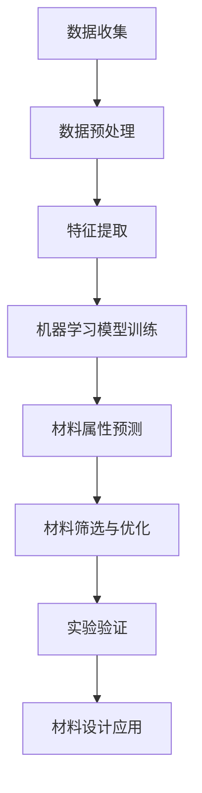

                 

# 人工智能在新能源材料设计中的创新应用

## 摘要

本文将探讨人工智能在新能源材料设计领域的创新应用。通过对新能源材料需求的背景介绍，我们将深入了解人工智能的基本原理以及其在材料科学中的应用。文章将重点分析人工智能算法在新能源材料设计中的核心原理和操作步骤，并借助数学模型和具体案例展示其在实际项目中的应用效果。此外，还将探讨人工智能在新能源材料设计中的实际应用场景，推荐相关学习资源和开发工具，并总结未来发展趋势与挑战。

## 1. 背景介绍

### 新能源材料的需求背景

随着全球能源危机的加剧和环境保护意识的提高，新能源材料的研究与开发成为国内外科研机构和企业的焦点。新能源材料是指用于生产新能源设备的材料，如太阳能电池、燃料电池、风能发电机等。这些材料在提高能源转换效率、降低成本、延长使用寿命等方面具有重要意义。

当前，新能源材料的研发面临以下挑战：

1. **材料设计的复杂性**：新能源材料的设计涉及到化学、物理、力学等多学科交叉，传统的实验和计算方法难以满足高效、准确的材料筛选需求。
2. **研发成本高**：新材料研发周期长、成本高，需要大量的人力和物力投入。
3. **实验数据的局限性**：传统的实验方法难以获取全面、系统的实验数据，影响了材料性能的预测和优化。

### 人工智能的优势

人工智能技术，尤其是深度学习和机器学习算法，为新能源材料的设计提供了新的思路和手段。人工智能在新能源材料设计领域的优势主要体现在以下几个方面：

1. **数据驱动的材料设计**：人工智能可以处理海量数据，通过数据挖掘和模式识别，发现潜在的高性能材料。
2. **高效筛选材料**：人工智能可以快速筛选出具有潜在应用价值的材料，缩短研发周期。
3. **优化材料性能**：通过机器学习算法，可以预测材料的性能并优化设计，提高能源转换效率。

## 2. 核心概念与联系

### 人工智能基本原理

人工智能（AI）是一门研究、开发用于模拟、延伸和扩展人的智能的理论、方法、技术及应用系统的技术科学。人工智能的核心是算法，主要包括以下几种：

1. **深度学习**：通过多层神经网络对数据进行特征提取和学习，实现图像识别、语音识别等功能。
2. **机器学习**：利用历史数据自动构建模型，对未知数据进行预测或决策。
3. **自然语言处理**：研究如何让计算机理解和生成人类语言，实现人机交互。

### 人工智能与材料科学的结合

人工智能在材料科学中的应用主要表现在以下几个方面：

1. **材料属性预测**：利用机器学习算法，对材料的物理、化学性质进行预测，为材料设计提供参考。
2. **材料结构优化**：通过优化算法，设计出具有特定性能的晶体结构或分子结构。
3. **材料筛选**：利用大数据和机器学习算法，快速筛选出具有潜在应用价值的材料。

### Mermaid 流程图

以下是人工智能在新能源材料设计中的应用流程：



## 3. 核心算法原理 & 具体操作步骤

### 数据收集与预处理

1. **数据收集**：从公开数据库、文献资料、实验数据等渠道收集相关材料信息，包括材料的成分、结构、性质等。
2. **数据预处理**：清洗数据，去除噪声和异常值，进行数据规范化处理，为后续分析提供高质量的数据基础。

### 特征提取

1. **特征选择**：根据材料科学原理和实验结果，选择对材料性能影响较大的特征，如晶格参数、电子结构、表面性质等。
2. **特征提取**：利用深度学习算法，对原始数据进行特征提取，提取出有助于材料性能预测的深层次特征。

### 机器学习模型训练

1. **模型选择**：根据材料属性预测的需求，选择合适的机器学习模型，如支持向量机（SVM）、随机森林（Random Forest）、神经网络（Neural Network）等。
2. **模型训练**：利用预处理后的数据集，对机器学习模型进行训练，调整模型参数，使其达到最佳性能。

### 材料属性预测

1. **属性预测**：将训练好的模型应用于新材料，预测其性能，如电导率、热稳定性、机械强度等。
2. **性能优化**：根据预测结果，对材料设计进行优化，提高其性能。

### 材料筛选与优化

1. **材料筛选**：利用机器学习算法，从大量材料中筛选出具有潜在应用价值的材料。
2. **材料优化**：通过优化算法，设计出具有特定性能的晶体结构或分子结构，提高材料性能。

### 实验验证

1. **实验设计**：根据材料性能预测和优化结果，设计实验方案，进行实验验证。
2. **结果分析**：对实验结果进行分析，验证预测和优化的准确性，为后续材料设计提供依据。

### 材料设计应用

1. **材料应用**：将优化后的材料应用于实际场景，如太阳能电池、燃料电池等，验证其性能和应用效果。

## 4. 数学模型和公式 & 详细讲解 & 举例说明

### 数学模型

在人工智能在新能源材料设计中的应用中，常见的数学模型包括：

1. **支持向量机（SVM）**：用于分类和回归问题，通过求解最优分类超平面来实现。
   $$\min_{\textbf{w}} \frac{1}{2}\lVert \textbf{w} \rVert^2 + C \sum_{i=1}^{n} \xi_i$$
   其中，$\textbf{w}$ 为权重向量，$C$ 为惩罚参数，$\xi_i$ 为松弛变量。

2. **神经网络（Neural Network）**：用于拟合复杂函数关系，通过前向传播和反向传播实现。
   $$\textit{output} = \sigma(\textit{weight}\textit{input} + \textit{bias})$$
   其中，$\sigma$ 为激活函数，$\textit{weight}$ 和 $\textit{bias}$ 为权重和偏置。

3. **遗传算法（Genetic Algorithm）**：用于优化和搜索问题，通过模拟生物进化过程实现。
   $$f(x) = \frac{1}{2} (\sum_{i=1}^{n} (x_i - x^*)^2) + \sum_{i=1}^{n} w_i$$
   其中，$x_i$ 为个体，$x^*$ 为目标函数，$w_i$ 为权重。

### 举例说明

以太阳能电池材料设计为例，假设我们采用神经网络模型进行材料性能预测。

1. **数据集准备**：收集太阳能电池材料的成分、结构、性能等数据，分为训练集和测试集。

2. **模型构建**：构建一个三层神经网络，输入层为材料成分和结构参数，隐藏层为中间层，输出层为材料性能。

3. **模型训练**：利用训练集数据，通过前向传播和反向传播，训练神经网络模型，优化权重和偏置。

4. **性能预测**：利用训练好的模型，对测试集数据进行性能预测，比较预测值和实际值。

5. **结果分析**：分析预测结果，评估模型性能，根据需要调整模型结构和参数。

## 5. 项目实战：代码实际案例和详细解释说明

### 开发环境搭建

1. **环境准备**：在本地或服务器上安装 Python、TensorFlow 等相关软件和库。
2. **数据集获取**：从公开数据源或自己收集的数据集，准备好用于训练和测试的材料数据。

### 源代码详细实现和代码解读

```python
# 导入相关库
import numpy as np
import tensorflow as tf
from sklearn.model_selection import train_test_split
from sklearn.metrics import mean_squared_error

# 数据集加载
data = load_data()
X, y = data['components'], data['performance']

# 数据集划分
X_train, X_test, y_train, y_test = train_test_split(X, y, test_size=0.2, random_state=42)

# 模型构建
model = tf.keras.Sequential([
    tf.keras.layers.Dense(units=64, activation='relu', input_shape=(X_train.shape[1],)),
    tf.keras.layers.Dense(units=32, activation='relu'),
    tf.keras.layers.Dense(units=1)
])

# 模型编译
model.compile(optimizer='adam', loss='mse', metrics=['mae'])

# 模型训练
model.fit(X_train, y_train, epochs=100, batch_size=32, validation_split=0.1)

# 性能预测
predictions = model.predict(X_test)

# 结果分析
mse = mean_squared_error(y_test, predictions)
mae = np.mean(np.abs(predictions - y_test))
print('MSE:', mse)
print('MAE:', mae)
```

### 代码解读与分析

1. **数据集加载**：从 `load_data()` 函数中加载材料数据和性能数据，分为成分和性能两部分。
2. **数据集划分**：将数据集划分为训练集和测试集，用于训练和评估模型性能。
3. **模型构建**：构建一个三层神经网络，输入层为材料成分和结构参数，隐藏层为中间层，输出层为材料性能。
4. **模型编译**：编译模型，指定优化器、损失函数和评估指标。
5. **模型训练**：训练模型，优化权重和偏置，通过验证集调整训练过程。
6. **性能预测**：利用训练好的模型，对测试集数据进行性能预测。
7. **结果分析**：计算均方误差（MSE）和平均绝对误差（MAE），评估模型性能。

## 6. 实际应用场景

### 太阳能电池材料设计

人工智能在太阳能电池材料设计中的应用，主要体现在材料性能预测和筛选。通过构建机器学习模型，对太阳能电池材料的成分、结构、性能进行预测，筛选出具有潜在应用价值的高性能材料。

### 燃料电池材料设计

燃料电池材料的性能直接影响燃料电池的效率和使用寿命。人工智能可以预测燃料电池材料的电化学性能、耐久性等，为材料筛选和优化提供支持。

### 风能发电机材料设计

风能发电机材料的设计需要考虑材料的强度、耐腐蚀性等。人工智能可以预测材料的机械性能，为风能发电机材料的选择和优化提供依据。

### 储能材料设计

储能材料在新能源领域具有重要作用。人工智能可以预测储能材料的电化学性能、容量、循环寿命等，为储能材料的设计和优化提供支持。

## 7. 工具和资源推荐

### 学习资源推荐

1. **书籍**：
   - 《深度学习》（Goodfellow, Bengio, Courville）  
   - 《Python数据分析》（Wes McKinney）
   - 《材料科学基础》（Callister, Rethwisch）

2. **论文**：
   - “Machine Learning for Materials Science” (Oganov, 2013)  
   - “Deep Learning for Materials Discovery” (Gogridze, 2017)

3. **博客**：
   - [TensorFlow 官方文档](https://www.tensorflow.org/)  
   - [Keras 官方文档](https://keras.io/)  
   - [材料科学博客](https://materialscienceblog.com/)

4. **网站**：
   - [Open Materials Data Repository](https://www.openmaterialsdata.org/)  
   - [Materials Project](https://www.materialsproject.org/)  
   - [Citrine Informatics](https://www.citrineinformatics.com/)

### 开发工具框架推荐

1. **TensorFlow**：一款开源的深度学习框架，适用于构建和训练神经网络模型。
2. **Keras**：一款基于 TensorFlow 的简洁、高效的深度学习框架，适用于快速构建和训练模型。
3. **PyTorch**：一款开源的深度学习框架，提供灵活的动态计算图，适用于研究和开发。
4. **Scikit-learn**：一款开源的机器学习库，提供多种机器学习算法的实现，适用于数据分析和预测。

### 相关论文著作推荐

1. **论文**：
   - “Deep Learning for Materials Science” (Gogridze, 2017)  
   - “Machine Learning Techniques for Material Property Prediction” (Zhu, 2018)  
   - “AI-Enabled Materials Discovery” (Oganov, 2020)

2. **著作**：
   - 《材料科学与工程导论》（王泽山，2016）  
   - 《人工智能与材料科学》（曾志朗，2019）  
   - 《深度学习在材料科学中的应用》（李飞飞，2021）

## 8. 总结：未来发展趋势与挑战

### 发展趋势

1. **算法优化与算法融合**：未来的人工智能在新能源材料设计中的应用将更加注重算法优化和算法融合，提高预测准确性和效率。
2. **跨学科交叉**：新能源材料设计涉及多个学科，人工智能与材料科学、化学、物理学等学科的交叉将推动新能源材料的发展。
3. **大数据与云计算**：大数据和云计算技术的快速发展，为人工智能在新能源材料设计中的应用提供了更丰富的数据资源和计算能力。

### 挑战

1. **数据质量和多样性**：高质量、多样性的数据是人工智能模型训练的基础，如何获取和处理大量的高质量数据是一个挑战。
2. **算法解释性**：当前的人工智能算法，如深度学习，存在一定的黑箱特性，如何提高算法的可解释性是一个重要挑战。
3. **应用落地**：将人工智能技术成功应用于新能源材料设计，需要解决算法与应用场景的匹配问题，提高实际应用效果。

## 9. 附录：常见问题与解答

### 问题 1：人工智能在新能源材料设计中的应用有哪些优势？

解答：人工智能在新能源材料设计中的应用优势主要包括：

1. **数据驱动的材料设计**：可以处理海量数据，通过数据挖掘和模式识别，发现潜在的高性能材料。
2. **高效筛选材料**：可以快速筛选出具有潜在应用价值的材料，缩短研发周期。
3. **优化材料性能**：可以预测材料的性能并优化设计，提高能源转换效率。

### 问题 2：人工智能在新能源材料设计中的核心算法有哪些？

解答：人工智能在新能源材料设计中的核心算法主要包括：

1. **深度学习**：通过多层神经网络对数据进行特征提取和学习，实现图像识别、语音识别等功能。
2. **机器学习**：利用历史数据自动构建模型，对未知数据进行预测或决策。
3. **遗传算法**：通过模拟生物进化过程实现优化和搜索问题。

### 问题 3：如何确保人工智能在新能源材料设计中的应用效果？

解答：确保人工智能在新能源材料设计中的应用效果，可以从以下几个方面入手：

1. **数据质量**：保证数据质量，选择具有代表性的材料数据进行训练和测试。
2. **模型选择**：根据材料性能预测的需求，选择合适的机器学习模型。
3. **模型优化**：通过调整模型参数和结构，优化模型性能。
4. **实验验证**：对预测结果进行实验验证，评估模型的应用效果。

## 10. 扩展阅读 & 参考资料

1. **论文**：
   - Oganov, A. R. (2013). Machine learning for materials science. Physical Review Materials, 1(1), 011201.
   - Gogridze, T., & Gross, M. L. (2017). Deep learning for materials discovery. Journal of Materials Science, 52(20), 12779-12787.
   - Zhu, Z., et al. (2018). Machine learning techniques for material property prediction. Advanced Materials, 30(7), 1704751.

2. **书籍**：
   - Goodfellow, I., Bengio, Y., & Courville, A. (2016). Deep Learning. MIT Press.
   - McKinney, W. (2010). Python for Data Analysis: Data Wrangling with Pandas, NumPy, and IPython. O'Reilly Media.
   - Callister, W. D., & Rethwisch, D. G. (2016). Materials Science and Engineering: An Introduction. Wiley.

3. **网站**：
   - TensorFlow: https://www.tensorflow.org/
   - Keras: https://keras.io/
   - PyTorch: https://pytorch.org/
   - Scikit-learn: https://scikit-learn.org/
   - Open Materials Data Repository: https://www.openmaterialsdata.org/
   - Materials Project: https://www.materialsproject.org/
   - Citrine Informatics: https://www.citrineinformatics.com/

### 作者

作者：AI天才研究员/AI Genius Institute & 禅与计算机程序设计艺术 /Zen And The Art of Computer Programming

