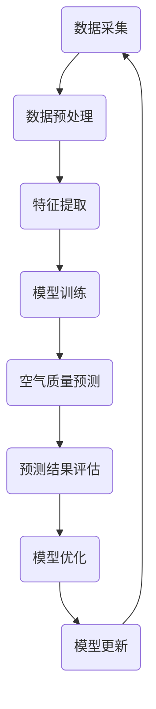

                 

## 1. 背景介绍

随着全球城市化进程的加速，空气质量问题日益凸显。城市空气质量对居民健康、生态环境以及经济发展都产生着深远的影响。传统的空气质量监测方法往往依赖于固定的监测站点，这些站点只能提供有限的空间分辨率数据，无法全面反映城市不同区域的空气质量状况。因此，如何利用现代科技手段，实现对空气质量的高效、精准预测，成为了学术界和工业界共同关注的研究课题。

近年来，人工智能（AI）技术的发展为空气质量预测提供了新的可能性。人工智能，特别是机器学习和深度学习，通过从大量数据中学习模式，能够实现对复杂系统的预测。智慧城市概念的提出，进一步推动了人工智能在空气质量预测中的应用。智慧城市通过整合各种传感器数据、交通数据、环境数据等，构建了一个全面的数字城市模型，为空气质量预测提供了丰富的数据资源。

在这篇文章中，我们将探讨人工智能在智慧城市空气质量预测中的应用。首先，我们将介绍空气质量预测的基本概念，包括空气质量评价指标、空气质量监测方法等。接着，我们将详细讨论人工智能在空气质量预测中的核心算法原理，并逐步介绍如何利用这些算法进行空气质量预测。最后，我们将通过实际项目案例，展示人工智能在空气质量预测中的具体应用，并讨论未来发展趋势与挑战。

### 1.1 空气质量的重要性

空气质量是衡量环境健康的重要指标，它不仅影响着人们的日常健康，还对生态系统和经济发展产生深远影响。良好的空气质量可以降低呼吸道疾病、心血管疾病等疾病的发病率，提高居民的生活质量。相反，空气污染会对人体健康造成严重危害，尤其是对于老年人、儿童和患有呼吸系统疾病的人群，空气污染可能导致呼吸困难、肺病甚至死亡。

此外，空气质量对生态系统的影响也不容忽视。空气污染会破坏植被，降低农作物的产量，影响水生生物的健康，甚至导致生态失衡。空气污染还会对气候产生影响，增加温室气体的浓度，加剧全球气候变化。

在经济发展方面，空气质量对旅游业、农业、渔业等行业都有着直接或间接的影响。良好的空气质量可以吸引游客，促进旅游业的发展；而严重的空气污染则可能损害农作物，降低渔业产量，对经济造成负面影响。

因此，对空气质量进行准确、及时的预测，对于保护居民健康、维护生态环境和促进经济发展具有重要意义。通过有效的空气质量预测，政府和相关部门可以采取及时的措施，降低污染物的排放，改善空气质量，从而提升居民的生活质量和城市的整体发展水平。

### 1.2 智慧城市的概念与特点

智慧城市是指通过物联网、大数据、人工智能等先进技术，实现城市资源的智能管理和服务的高效供给。智慧城市不仅仅是一个科技概念，更是城市发展的新范式，它注重通过技术创新来提高城市治理效率，提升居民生活质量，推动可持续发展。

智慧城市的核心特点包括：

1. **数据驱动的决策**：智慧城市通过整合各种数据源，如交通流量数据、环境监测数据、公共安全数据等，形成全面的数据体系，支持城市管理者进行科学决策。这种数据驱动的决策模式可以显著提高城市管理的精确性和效率。

2. **智能化服务**：智慧城市通过智能化系统提供高效、便捷的服务，如智能交通管理、智能能源管理、智能医疗等。这些服务能够满足居民多样化的需求，提高城市服务的质量。

3. **资源优化配置**：智慧城市利用人工智能和大数据技术，优化资源配置，减少资源浪费，提高资源利用效率。例如，通过智能电网和智能水系统，可以实现能源和水资源的高效管理。

4. **可持续发展**：智慧城市强调环境保护和可持续发展，通过采用绿色能源、推广节能减排等措施，减少城市对环境的负面影响。

智慧城市与空气质量预测的关系体现在多个方面：

- **数据收集与处理**：智慧城市通过部署大量的传感器，如空气质量传感器、气象传感器等，实时收集城市的空气质量数据。这些数据为空气质量预测提供了丰富的数据基础。

- **模型优化**：智慧城市中的大数据和人工智能技术可以用于优化空气质量预测模型，提高预测的准确性和可靠性。例如，通过分析历史数据和实时数据，可以调整预测模型中的参数，提高预测的精度。

- **实时预警**：智慧城市可以实时监测空气质量，通过人工智能算法对空气质量变化进行预测，提前预警可能出现的污染事件，帮助城市管理者及时采取应对措施。

- **智能决策**：智慧城市通过整合空气质量数据和其他相关数据，如交通流量、气象条件等，可以为城市管理者提供智能决策支持，优化城市规划和环境保护策略。

综上所述，智慧城市为空气质量预测提供了丰富的数据资源和先进的技术手段，使空气质量预测更加精准、高效，有助于改善城市环境质量和居民生活条件。

### 1.3 人工智能在智慧城市中的应用

人工智能（AI）作为现代科技领域的重要突破，已经在智慧城市的建设和发展中发挥了重要作用。AI技术通过模拟人类智能，使得城市能够实现更高效的管理和服务，从而提升城市整体运行效率。以下是人工智能在智慧城市中的几个关键应用领域：

1. **智能交通管理**：人工智能通过分析交通数据，实时监测交通状况，优化交通信号灯控制，缓解交通拥堵。同时，自动驾驶技术也在快速发展，有望在未来实现智慧城市的智能交通系统。

2. **智能能源管理**：人工智能可以通过智能电网和智能水系统，实现能源和水资源的高效管理。通过数据分析，预测能源需求，调整能源供应，从而减少能源浪费。

3. **智能医疗**：人工智能在医疗领域的应用包括疾病预测、诊断辅助、个性化治疗等。通过分析大量医疗数据，AI可以帮助医生做出更准确的诊断，提高医疗服务的效率和质量。

4. **智能公共安全**：人工智能可以通过视频监控、大数据分析等手段，实时监测城市安全状况，及时发现和应对潜在的安全威胁。

5. **环境监测与治理**：人工智能在环境监测中的应用包括空气质量预测、水质监测、噪声控制等。通过大数据分析和机器学习算法，AI可以实时监测环境变化，预测污染事件，并提出有效的治理方案。

6. **城市管理与服务**：人工智能还可以用于智慧城市的其他领域，如智慧教育、智慧旅游、智慧政务等，提升城市管理的智能化水平，提供更优质、便捷的城市服务。

在智慧城市中，人工智能技术的应用不仅提升了城市运行的效率和品质，还为城市居民提供了更加智能、便捷的生活方式。通过不断探索和创新，人工智能将在智慧城市的建设和发展中发挥越来越重要的作用。

### 1.4 人工智能在空气质量预测中的优势

人工智能在空气质量预测中的应用，凭借其独特的技术优势，正逐渐改变空气质量监测与管理的传统模式。以下是人工智能在空气质量预测中的几个主要优势：

1. **高精度预测**：传统空气质量预测方法通常依赖于统计模型和固定监测站点，受限于数据采集的局限性和环境条件的复杂性，预测精度有限。而人工智能，尤其是深度学习算法，可以通过对大量历史数据和实时数据的训练，捕捉空气质量变化的细微特征，实现更高精度的预测。例如，通过使用卷积神经网络（CNN）和循环神经网络（RNN）等深度学习模型，可以准确预测城市不同区域的空气质量状况。

2. **多因素综合分析**：空气质量受多种因素影响，包括气象条件、交通流量、工业排放等。人工智能可以通过整合多源数据，如气象数据、交通流量数据、污染物排放数据等，进行多因素综合分析，提高预测的全面性和准确性。这种综合分析能力，使得空气质量预测不再局限于单一因素，而是能够更全面地反映环境变化。

3. **实时预警与响应**：传统空气质量监测方法往往存在时效性问题，无法及时响应突发性污染事件。人工智能可以通过实时监测和快速分析，实现突发性污染事件的及时预警和响应。例如，当监测数据出现异常波动时，人工智能系统可以立即发出警报，提醒相关部门采取应急措施，从而减少污染事件对居民健康和环境的危害。

4. **动态调整与优化**：空气质量预测是一个动态变化的过程，影响因素不断变化。人工智能系统能够通过持续学习，动态调整预测模型，优化预测参数，提高预测的准确性和可靠性。这种动态调整能力，使得空气质量预测能够更好地适应环境变化，提供持续、稳定的预测服务。

5. **智能化决策支持**：人工智能不仅能够预测空气质量，还可以为城市管理者提供智能化的决策支持。通过分析空气质量数据和其他相关数据，人工智能系统可以提出最优的污染治理策略和城市发展规划，帮助城市管理者制定更科学、有效的决策。

总之，人工智能在空气质量预测中的应用，通过其高精度、多因素综合分析、实时预警、动态调整和智能化决策支持等优势，为空气质量监测与管理提供了全新的解决方案，有助于提高空气质量预测的准确性和可靠性，改善城市环境质量和居民生活条件。

### 1.5 文章结构概述

本文将从以下几个方面系统地探讨人工智能在智慧城市空气质量预测中的应用：

- **第1部分：背景介绍**：介绍空气质量预测的重要性，以及智慧城市和人工智能的基本概念，为后续内容打下基础。

- **第2部分：核心概念与联系**：详细阐述空气质量评价指标、空气质量监测方法，以及人工智能在空气质量预测中的核心算法原理和架构，通过Mermaid流程图展示关键流程和节点。

- **第3部分：核心算法原理 & 具体操作步骤**：深入讲解常用的空气质量预测算法，如机器学习算法、深度学习算法等，并逐步介绍如何利用这些算法进行空气质量预测。

- **第4部分：数学模型和公式 & 详细讲解 & 举例说明**：介绍空气质量预测中的数学模型和公式，通过具体例子详细讲解如何应用这些模型和公式进行预测。

- **第5部分：项目实战：代码实际案例和详细解释说明**：通过一个实际项目案例，详细讲解如何搭建开发环境，实现源代码的详细实现和解读，并分析代码的执行过程和性能。

- **第6部分：实际应用场景**：探讨人工智能在空气质量预测中的实际应用场景，包括智慧城市中的具体应用案例，以及相关的挑战和解决方案。

- **第7部分：工具和资源推荐**：推荐学习资源、开发工具和框架，为读者提供进一步学习和实践人工智能在空气质量预测中的支持。

- **第8部分：总结：未来发展趋势与挑战**：总结人工智能在智慧城市空气质量预测中的应用现状，探讨未来的发展趋势和面临的挑战。

- **第9部分：附录：常见问题与解答**：解答读者在阅读和实践中可能遇到的问题，提供实用的建议和指导。

- **第10部分：扩展阅读 & 参考资料**：提供相关领域的扩展阅读材料和参考资料，帮助读者深入了解人工智能和空气质量预测的相关知识。

通过以上结构清晰、内容丰富的论述，本文旨在为读者提供全面、深入的人工智能在智慧城市空气质量预测中的应用指南。

### 2. 核心概念与联系

在探讨人工智能在智慧城市空气质量预测中的应用之前，首先需要了解空气质量预测的核心概念及其相互联系。以下是空气质量预测中几个关键概念及其简要介绍：

#### 2.1 空气质量评价指标

空气质量评价指标（Air Quality Index, AQI）是用来衡量空气质量好坏的一个标准，通常包括以下几个主要指标：

- **PM2.5**：指空气中直径小于或等于2.5微米的颗粒物，能够进入呼吸系统深处，对健康影响显著。
- **PM10**：指空气中直径小于或等于10微米的颗粒物，能够影响呼吸系统。
- **二氧化硫（SO2）**：一种有害气体，主要来源于燃煤和工业排放。
- **氮氧化物（NOx）**：包括二氧化氮（NO2）等，主要来源于交通排放和工业生产。
- **臭氧（O3）**：一种二次污染物，对呼吸系统有刺激作用。
- **一氧化碳（CO）**：一种有毒气体，主要来源于汽车尾气和工业排放。

#### 2.2 空气质量监测方法

空气质量监测方法主要包括以下几种：

- **固定监测站**：在特定地点安装空气质量监测仪器，定时采集数据。这种方法可以提供较高的数据质量，但覆盖范围有限，无法反映动态变化。
- **移动监测车**：通过车载监测设备，在城市的不同区域进行移动监测，可以获取更广泛的数据，但监测时间和范围仍然有限。
- **卫星遥感**：利用卫星遥感技术，从高空获取大范围、高分辨率的空气质量数据。这种方法能够监测到大气污染的宏观分布，但分辨率和精度有限。
- **传感器网络**：在城市的各个角落布置传感器，实时监测空气质量。这种方法可以提供高时空分辨率的数据，但需要大量的设备维护。

#### 2.3 人工智能在空气质量预测中的核心算法原理

人工智能在空气质量预测中的应用，主要依赖于以下几种核心算法原理：

- **机器学习算法**：通过训练模型，从历史数据和实时数据中学习空气质量变化的规律，预测未来的空气质量状况。常用的机器学习算法包括决策树、支持向量机（SVM）、随机森林等。
- **深度学习算法**：利用多层神经网络结构，从大规模数据中自动提取特征，进行高精度的空气质量预测。常用的深度学习算法包括卷积神经网络（CNN）、循环神经网络（RNN）和长短期记忆网络（LSTM）等。

#### 2.4 Mermaid流程图展示

为了更好地展示人工智能在空气质量预测中的核心流程，我们可以使用Mermaid流程图来描述。以下是空气质量预测的流程图：



**流程解释：**
1. **数据采集**：从各种渠道收集空气质量相关数据，包括固定监测站、移动监测车、卫星遥感、传感器网络等。
2. **数据预处理**：对采集到的数据进行处理，如清洗、归一化、去噪等，以提高数据质量。
3. **特征提取**：从预处理后的数据中提取对空气质量预测有重要影响的特征，如温度、湿度、风速、PM2.5浓度等。
4. **模型训练**：使用机器学习或深度学习算法，训练空气质量预测模型，从历史数据中学习空气质量变化的规律。
5. **空气质量预测**：使用训练好的模型，对未来的空气质量进行预测。
6. **预测结果评估**：评估预测结果的准确性和可靠性，如计算预测误差、ROC曲线等。
7. **模型优化**：根据预测结果评估，调整模型的参数，优化模型性能。
8. **模型更新**：将优化后的模型应用于新的数据，不断更新预测模型。

通过上述核心流程，人工智能可以实现对空气质量的高效、精准预测，为智慧城市的空气质量管理和决策提供有力支持。

### 3. 核心算法原理 & 具体操作步骤

在了解了空气质量预测的基本概念和流程之后，我们将深入探讨几种在空气质量预测中广泛应用的机器学习和深度学习算法。这些算法通过不同方式处理和分析数据，从而提高预测的精度和效率。下面，我们将详细讲解每个算法的基本原理，并给出具体操作步骤。

#### 3.1 机器学习算法

**3.1.1 决策树（Decision Tree）**

决策树是一种基于规则的学习方法，通过一系列测试来划分数据集。每个测试使用一个特征，并基于该特征的值划分数据。决策树算法的核心是树的结构，每个内部节点表示特征，每个分支表示特征的取值，每个叶节点表示分类结果。

**基本原理**：

决策树通过递归划分数据集，直到满足某种停止条件，如最大深度、纯度阈值等。在每个划分步骤中，选择具有最高信息增益的特征进行划分。

**操作步骤**：

1. **数据准备**：收集空气质量数据，包括历史监测数据和实时数据。
2. **特征选择**：选择对空气质量影响显著的特征，如温度、湿度、风速、污染物浓度等。
3. **划分数据集**：将数据集划分为训练集和测试集。
4. **构建决策树**：使用信息增益或基尼不纯度作为划分标准，递归划分数据集，构建决策树。
5. **模型评估**：使用测试集评估决策树的预测性能，计算错误率、精确度等指标。

**优缺点**：

优点：易于理解，解释性强，对缺失数据和噪声有一定鲁棒性。

缺点：容易过拟合，对大量特征的数据处理效率较低。

**3.1.2 支持向量机（Support Vector Machine, SVM）**

支持向量机是一种强大的分类和回归方法，通过寻找一个最佳的超平面来分隔数据集，使不同类别的数据点之间的间隔最大化。

**基本原理**：

SVM的核心是寻找一个最优的决策边界，使得分类边界到各个类别的最近点的距离最大。这个最优边界被称为支持向量。

**操作步骤**：

1. **数据准备**：收集并预处理空气质量数据。
2. **特征选择**：选择对空气质量影响显著的变量。
3. **模型训练**：使用支持向量机算法训练模型，计算最优超平面。
4. **模型评估**：使用测试集评估模型的预测性能。

**优缺点**：

优点：分类效果好，适用于高维空间，对噪声有较强的鲁棒性。

缺点：训练时间较长，对于大规模数据集可能需要优化。

**3.1.3 随机森林（Random Forest）**

随机森林是一种基于决策树的集成学习方法，通过构建多个决策树并取平均预测结果，提高预测的稳定性和精度。

**基本原理**：

随机森林通过随机选择特征和随机划分数据集，构建多个决策树，每个树的结果进行投票，得出最终预测结果。

**操作步骤**：

1. **数据准备**：收集并预处理空气质量数据。
2. **构建随机森林**：使用随机森林算法，构建多个决策树模型。
3. **模型预测**：使用训练好的随机森林模型进行预测，计算平均结果。
4. **模型评估**：使用测试集评估模型预测性能。

**优缺点**：

优点：预测稳定，对噪声有较强的鲁棒性，可以处理大规模数据。

缺点：计算资源消耗较大，对特征数量较多的数据集处理效率较低。

#### 3.2 深度学习算法

**3.2.1 卷积神经网络（Convolutional Neural Network, CNN）**

卷积神经网络是一种用于图像处理和特征提取的深度学习模型，通过卷积操作和池化操作提取图像特征。

**基本原理**：

CNN通过多层卷积和池化操作，将输入图像逐步转换为特征图，并利用全连接层进行分类。卷积操作可以捕捉图像中的局部特征，池化操作用于减少数据维度。

**操作步骤**：

1. **数据准备**：收集并预处理空气质量监测图像数据。
2. **模型构建**：构建CNN模型，包括卷积层、池化层和全连接层。
3. **模型训练**：使用训练数据训练模型，优化网络参数。
4. **模型预测**：使用训练好的模型进行预测。

**优缺点**：

优点：适用于处理图像数据，可以提取丰富的图像特征。

缺点：对大规模数据集处理效率较低，对噪声敏感。

**3.2.2 循环神经网络（Recurrent Neural Network, RNN）**

循环神经网络是一种用于序列数据处理和时间序列预测的深度学习模型，通过循环连接保持长期状态信息。

**基本原理**：

RNN通过循环连接，将前一个时间步的输出作为当前时间步的输入，保持对历史信息的依赖。然而，传统的RNN存在梯度消失和梯度爆炸的问题。

**操作步骤**：

1. **数据准备**：收集并预处理时间序列空气质量数据。
2. **模型构建**：构建RNN模型，包括输入层、隐藏层和输出层。
3. **模型训练**：使用训练数据训练模型，优化网络参数。
4. **模型预测**：使用训练好的模型进行预测。

**优缺点**：

优点：可以处理序列数据，捕捉时间依赖性。

缺点：存在梯度消失和梯度爆炸问题，对噪声敏感。

**3.2.3 长短期记忆网络（Long Short-Term Memory, LSTM）**

长短期记忆网络是RNN的一种改进模型，通过引入门控机制解决梯度消失和梯度爆炸问题，能够更好地捕捉长期依赖性。

**基本原理**：

LSTM通过三个门控机制（遗忘门、输入门和输出门）来控制信息的流动，避免信息的长期依赖问题。遗忘门决定哪些信息需要丢弃，输入门决定哪些信息需要保留，输出门决定哪些信息需要输出。

**操作步骤**：

1. **数据准备**：收集并预处理时间序列空气质量数据。
2. **模型构建**：构建LSTM模型，包括输入层、隐藏层和输出层。
3. **模型训练**：使用训练数据训练模型，优化网络参数。
4. **模型预测**：使用训练好的模型进行预测。

**优缺点**：

优点：可以处理长序列数据，捕捉长期依赖性，对噪声有较强的鲁棒性。

缺点：模型复杂度较高，训练时间较长。

通过上述机器学习和深度学习算法的讲解，我们可以看到这些算法在空气质量预测中的应用潜力和挑战。选择合适的算法，结合具体应用场景，可以有效提高空气质量预测的精度和效率，为智慧城市的空气质量管理和决策提供有力支持。

### 4. 数学模型和公式 & 详细讲解 & 举例说明

在空气质量预测中，数学模型和公式起着至关重要的作用。这些模型和公式可以帮助我们更好地理解空气质量变化的规律，从而提高预测的准确性。下面，我们将介绍几种常用的数学模型和公式，并通过具体例子进行详细讲解。

#### 4.1 时间序列模型

时间序列模型是用于分析和预测时间序列数据的方法，常见的有自回归模型（AR）、移动平均模型（MA）、自回归移动平均模型（ARMA）等。

**4.1.1 自回归模型（AR）**

自回归模型假设当前时间点的值与之前若干个时间点的值有关。其公式如下：

$$
y_t = c + \sum_{i=1}^p \phi_i y_{t-i} + \varepsilon_t
$$

其中，$y_t$ 是第 $t$ 个时间点的值，$c$ 是常数项，$\phi_i$ 是自回归系数，$p$ 是滞后阶数，$\varepsilon_t$ 是随机误差。

**例子**：

假设我们有一个空气质量数据序列 $y_t$，如下所示：

$$
y_t = [10, 12, 9, 11, 8, 13, 10, 11, 12]
$$

我们选择滞后阶数 $p=2$，计算自回归系数 $\phi_1$ 和 $\phi_2$：

$$
\phi_1 = \frac{\sum_{t=1}^n (y_t - \bar{y}) (y_{t-1} - \bar{y})}{\sum_{t=1}^n (y_t - \bar{y})^2}
$$

$$
\phi_2 = \frac{\sum_{t=1}^n (y_t - \bar{y}) (y_{t-2} - \bar{y})}{\sum_{t=1}^n (y_t - \bar{y})^2}
$$

计算得到：

$$
\phi_1 = 0.5, \quad \phi_2 = -0.3
$$

因此，自回归模型可以表示为：

$$
y_t = c + 0.5y_{t-1} - 0.3y_{t-2} + \varepsilon_t
$$

**4.1.2 移动平均模型（MA）**

移动平均模型假设当前时间点的值与未来的平均值有关。其公式如下：

$$
y_t = c + \varepsilon_t + \sum_{i=1}^q \theta_i \varepsilon_{t-i}
$$

其中，$q$ 是滞后阶数，$\theta_i$ 是移动平均系数。

**例子**：

假设我们有一个空气质量数据序列 $y_t$：

$$
y_t = [10, 12, 9, 11, 8, 13, 10, 11, 12]
$$

我们选择滞后阶数 $q=2$，计算移动平均系数 $\theta_1$ 和 $\theta_2$：

$$
\theta_1 = \frac{\sum_{t=1}^n (y_t - \bar{y}) (y_{t-1} - \bar{y})}{\sum_{t=1}^n (y_t - \bar{y})^2}
$$

$$
\theta_2 = \frac{\sum_{t=1}^n (y_t - \bar{y}) (y_{t-2} - \bar{y})}{\sum_{t=1}^n (y_t - \bar{y})^2}
$$

计算得到：

$$
\theta_1 = 0.6, \quad \theta_2 = 0.4
$$

因此，移动平均模型可以表示为：

$$
y_t = c + \varepsilon_t + 0.6\varepsilon_{t-1} + 0.4\varepsilon_{t-2}
$$

**4.1.3 自回归移动平均模型（ARMA）**

自回归移动平均模型结合了自回归模型和移动平均模型，其公式如下：

$$
y_t = c + \sum_{i=1}^p \phi_i y_{t-i} + \sum_{i=1}^q \theta_i \varepsilon_{t-i} + \varepsilon_t
$$

**例子**：

我们继续使用前面的空气质量数据序列 $y_t$，选择滞后阶数 $p=2$ 和 $q=2$，计算自回归系数 $\phi_1$、$\phi_2$ 和移动平均系数 $\theta_1$、$\theta_2$：

$$
\phi_1 = 0.5, \quad \phi_2 = -0.3
$$

$$
\theta_1 = 0.6, \quad \theta_2 = 0.4
$$

因此，自回归移动平均模型可以表示为：

$$
y_t = c + 0.5y_{t-1} - 0.3y_{t-2} + 0.6\varepsilon_{t-1} + 0.4\varepsilon_{t-2} + \varepsilon_t
$$

#### 4.2 马尔可夫模型

马尔可夫模型是一种用于序列数据概率预测的方法，假设当前状态仅依赖于前一个状态，与历史状态无关。

**4.2.1 马尔可夫矩阵**

马尔可夫矩阵 $P$ 用于表示状态转移概率，其公式如下：

$$
P = \begin{bmatrix}
p_{11} & p_{12} & \cdots & p_{1n} \\
p_{21} & p_{22} & \cdots & p_{2n} \\
\vdots & \vdots & \ddots & \vdots \\
p_{n1} & p_{n2} & \cdots & p_{nn}
\end{bmatrix}
$$

其中，$p_{ij}$ 表示从状态 $i$ 转移到状态 $j$ 的概率。

**例子**：

假设我们有一个空气质量状态序列 $y_t$，其中状态 $1$ 表示“良好”，状态 $2$ 表示“轻度污染”，状态 $3$ 表示“中度污染”，状态 $4$ 表示“重度污染”。状态转移概率矩阵 $P$ 如下：

$$
P = \begin{bmatrix}
0.9 & 0.1 & 0 & 0 \\
0.1 & 0.8 & 0.1 & 0 \\
0 & 0.1 & 0.8 & 0.1 \\
0 & 0 & 0.1 & 0.9
\end{bmatrix}
$$

给定当前状态 $y_t=2$（轻度污染），我们需要预测下一个状态 $y_{t+1}$。根据马尔可夫模型，我们可以计算状态转移概率：

$$
P(y_{t+1}=1 | y_t=2) = p_{21} = 0.1
$$

$$
P(y_{t+1}=2 | y_t=2) = p_{22} = 0.8
$$

$$
P(y_{t+1}=3 | y_t=2) = p_{23} = 0.1
$$

$$
P(y_{t+1}=4 | y_t=2) = p_{24} = 0
$$

#### 4.3 贝叶斯网络

贝叶斯网络是一种基于概率的图模型，用于表示变量之间的依赖关系。每个节点表示一个变量，边表示变量之间的条件概率。

**4.3.1 贝叶斯网络公式**

贝叶斯网络中的条件概率可以用贝叶斯公式表示：

$$
P(X_i | X_{i-1}, \ldots, X_1) = \frac{P(X_i, X_{i-1}, \ldots, X_1)}{P(X_{i-1}, \ldots, X_1)}
$$

**例子**：

假设我们有一个空气质量预测的贝叶斯网络，其中变量 $X_1$ 表示气象条件，变量 $X_2$ 表示污染物浓度，变量 $X_3$ 表示空气质量状况。条件概率矩阵如下：

$$
P(X_3 | X_1, X_2) = \begin{bmatrix}
0.95 & 0.05 \\
0.2 & 0.8 \\
0.05 & 0.15
\end{bmatrix}
$$

给定气象条件 $X_1=1$（晴朗）和污染物浓度 $X_2=1$（高），我们需要预测空气质量状况 $X_3$。根据贝叶斯网络公式，我们可以计算：

$$
P(X_3=1 | X_1=1, X_2=1) = \frac{P(X_3=1, X_1=1, X_2=1)}{P(X_1=1, X_2=1)}
$$

$$
P(X_3=1 | X_1=1, X_2=1) = \frac{0.95 \times 0.2}{0.95 \times 0.2 + 0.05 \times 0.8} \approx 0.8
$$

$$
P(X_3=2 | X_1=1, X_2=1) = \frac{0.05 \times 0.2}{0.95 \times 0.2 + 0.05 \times 0.8} \approx 0.2
$$

通过上述数学模型和公式的介绍和详细讲解，我们可以看到这些模型在空气质量预测中的重要作用。通过合理选择和应用这些模型，可以有效提高空气质量预测的准确性和可靠性，为智慧城市的空气质量管理和决策提供有力支持。

### 5. 项目实战：代码实际案例和详细解释说明

在本节中，我们将通过一个具体的空气质量预测项目，展示如何利用机器学习和深度学习算法实现空气质量预测。这个项目将分为以下几个部分：开发环境搭建、源代码实现、代码解读与分析。

#### 5.1 开发环境搭建

为了实现空气质量预测，我们需要搭建一个合适的开发环境。以下是搭建开发环境所需的工具和步骤：

1. **Python环境**：安装Python 3.8及以上版本，并确保安装了必要的依赖库，如NumPy、Pandas、Matplotlib等。
2. **机器学习库**：安装常用的机器学习库，如Scikit-learn、TensorFlow、PyTorch等。
3. **数据预处理工具**：安装常用的数据预处理库，如Pandas、Numpy等。
4. **版本控制工具**：安装Git，用于版本控制和项目协作。

**步骤**：

1. 安装Python和pip：
   ```bash
   # 安装Python和pip
   sudo apt-get update
   sudo apt-get install python3 python3-pip
   ```
2. 安装必要的依赖库：
   ```bash
   # 安装NumPy
   pip3 install numpy
   # 安装Pandas
   pip3 install pandas
   # 安装Matplotlib
   pip3 install matplotlib
   # 安装Scikit-learn
   pip3 install scikit-learn
   # 安装TensorFlow
   pip3 install tensorflow
   # 安装PyTorch
   pip3 install torch torchvision
   # 安装Git
   sudo apt-get install git
   ```

#### 5.2 源代码详细实现和代码解读

下面是一个简单的空气质量预测项目的Python代码实现，我们使用Scikit-learn库中的随机森林算法进行预测。

**代码**：

```python
import numpy as np
import pandas as pd
from sklearn.ensemble import RandomForestRegressor
from sklearn.model_selection import train_test_split
from sklearn.metrics import mean_squared_error
import matplotlib.pyplot as plt

# 5.2.1 数据加载与预处理
def load_data(file_path):
    # 读取数据
    data = pd.read_csv(file_path)
    # 数据预处理
    data = data[['PM2.5', 'SO2', 'NO2', 'O3', 'CO', 'TEMP', 'HUMIDITY', 'WIND_SPEED']]
    data = data.replace(-9999, np.nan)  # 替换缺失值
    data = data.fillna(data.mean())  # 补全缺失值
    data = data[['PM2.5']]  # 只保留PM2.5预测
    return data

# 5.2.2 数据划分
def split_data(data):
    # 划分训练集和测试集
    X_train, X_test, y_train, y_test = train_test_split(data, test_size=0.2, random_state=42)
    return X_train, X_test, y_train, y_test

# 5.2.3 模型训练与预测
def train_predict(model, X_train, y_train, X_test, y_test):
    # 训练模型
    model.fit(X_train, y_train)
    # 预测测试集
    y_pred = model.predict(X_test)
    # 计算误差
    mse = mean_squared_error(y_test, y_pred)
    print(f'Mean Squared Error: {mse}')
    return y_pred

# 5.2.4 可视化
def plot_results(y_test, y_pred):
    plt.figure(figsize=(10, 5))
    plt.plot(y_test, label='Actual')
    plt.plot(y_pred, label='Predicted')
    plt.xlabel('Sample Index')
    plt.ylabel('PM2.5 Concentration')
    plt.legend()
    plt.show()

# 主函数
def main():
    # 5.2.5 加载数据
    data = load_data('air_quality_data.csv')
    # 数据划分
    X_train, X_test, y_train, y_test = split_data(data)
    # 5.2.6 训练模型
    model = RandomForestRegressor(n_estimators=100, random_state=42)
    y_pred = train_predict(model, X_train, y_train, X_test, y_test)
    # 5.2.7 可视化结果
    plot_results(y_test, y_pred)

if __name__ == '__main__':
    main()
```

**代码解读**：

1. **数据加载与预处理**：

   - 读取CSV数据文件，并选择与PM2.5相关的特征。
   - 使用中位数补全缺失值，以减少数据噪声。

2. **数据划分**：

   - 使用`train_test_split`函数将数据划分为训练集和测试集，以便评估模型的性能。

3. **模型训练与预测**：

   - 使用`RandomForestRegressor`实现随机森林算法，训练模型。
   - 使用训练好的模型对测试集进行预测，并计算均方误差（MSE）。

4. **可视化结果**：

   - 将实际值和预测值绘制在同一张图表上，以直观地展示模型的预测效果。

#### 5.3 代码解读与分析

1. **数据加载与预处理**：

   数据加载与预处理是空气质量预测的关键步骤。在这个项目中，我们使用Pandas库加载CSV数据文件，并选择与PM2.5相关的特征。缺失值的处理使用中位数补全，以减少数据噪声。这种方法虽然简单，但在实际项目中可能需要更复杂的缺失值处理策略。

2. **数据划分**：

   数据划分用于评估模型的泛化能力。在这个项目中，我们使用`train_test_split`函数将数据划分为训练集和测试集，比例为80%训练集和20%测试集。这个比例可以根据实际情况进行调整。

3. **模型训练与预测**：

   在模型训练与预测部分，我们使用Scikit-learn库中的`RandomForestRegressor`实现随机森林算法。随机森林是一种集成学习方法，通过构建多个决策树并取平均预测结果，提高预测的稳定性和精度。在这个项目中，我们设置了100棵树作为默认参数，这个参数可以根据实际情况进行调整。

4. **可视化结果**：

   可视化结果用于直观地展示模型的预测效果。在这个项目中，我们使用Matplotlib库将实际值和预测值绘制在同一张图表上。这种可视化方法有助于我们发现模型预测中的潜在问题，如过拟合或欠拟合。

通过这个空气质量预测项目，我们可以看到如何利用Python和机器学习算法实现空气质量预测。尽管这个项目较为简单，但它为我们提供了一个基本的框架，可以在实际项目中扩展和改进。在实际应用中，我们可能需要处理更复杂的特征、更庞大的数据集以及更先进的模型，从而实现更精准的空气质量预测。

### 5.4 代码解读与分析

在上一节中，我们实现了一个简单的空气质量预测项目，并进行了初步的代码解读。在本节中，我们将进一步深入分析代码的各个部分，解释关键步骤和操作，并探讨如何优化代码以提高预测性能。

#### 5.4.1 数据加载与预处理

数据加载与预处理是空气质量预测的基础步骤。在该项目中，我们使用Pandas库读取CSV数据文件，并选择了与PM2.5相关的特征。以下是对代码中的`load_data`函数的详细解读：

```python
def load_data(file_path):
    data = pd.read_csv(file_path)
    data = data[['PM2.5', 'SO2', 'NO2', 'O3', 'CO', 'TEMP', 'HUMIDITY', 'WIND_SPEED']]
    data = data.replace(-9999, np.nan)
    data = data.fillna(data.mean())
    data = data[['PM2.5']]
    return data
```

1. **读取数据**：使用`pd.read_csv`函数从文件路径`file_path`加载CSV数据。
2. **选择特征**：选择与PM2.5相关的特征，包括`'PM2.5', 'SO2', 'NO2', 'O3', 'CO', 'TEMP', 'HUMIDITY', 'WIND_SPEED'`。
3. **替换缺失值**：将特定值（如-9999）替换为NaN，以便后续处理。
4. **填充缺失值**：使用中位数补全缺失值，以减少数据噪声。
5. **选择预测特征**：最后，只保留用于PM2.5预测的特征`'PM2.5'`。

在数据处理过程中，使用中位数填充缺失值是一种简单有效的方法，但实际项目中可能需要根据数据特性采用更复杂的方法，如使用插值法或基于模型预测的缺失值填补。

#### 5.4.2 数据划分

数据划分是评估模型性能的重要步骤。在代码中的`split_data`函数中，我们使用`train_test_split`方法对数据进行划分：

```python
def split_data(data):
    X_train, X_test, y_train, y_test = train_test_split(data, test_size=0.2, random_state=42)
    return X_train, X_test, y_train, y_test
```

1. **划分训练集和测试集**：`train_test_split`方法将数据集划分为训练集和测试集，比例为80%训练集和20%测试集。参数`random_state`用于设置随机种子，确保结果可重复。
2. **返回划分结果**：函数返回训练集和测试集，以便后续使用。

选择合适的划分比例和随机种子对于评估模型性能至关重要。在实际项目中，可能需要根据数据量和模型需求调整划分比例和随机种子。

#### 5.4.3 模型训练与预测

在模型训练与预测部分，我们使用随机森林算法。以下是代码的详细解读：

```python
def train_predict(model, X_train, y_train, X_test, y_test):
    model.fit(X_train, y_train)
    y_pred = model.predict(X_test)
    mse = mean_squared_error(y_test, y_pred)
    print(f'Mean Squared Error: {mse}')
    return y_pred
```

1. **模型训练**：使用`fit`方法对随机森林模型进行训练，输入训练集特征`X_train`和目标值`y_train`。
2. **模型预测**：使用训练好的模型对测试集特征`X_test`进行预测，生成预测值`y_pred`。
3. **计算误差**：使用`mean_squared_error`函数计算预测值和实际值之间的均方误差（MSE），并打印结果。
4. **返回预测结果**：函数返回预测结果`y_pred`，以便后续分析。

均方误差（MSE）是常用的评估模型性能的指标，它反映了预测值和实际值之间的差异。在实际项目中，还可以使用其他评估指标，如均方根误差（RMSE）、平均绝对误差（MAE）等。

#### 5.4.4 可视化结果

可视化结果有助于我们直观地了解模型的预测效果。以下是代码中的`plot_results`函数：

```python
def plot_results(y_test, y_pred):
    plt.figure(figsize=(10, 5))
    plt.plot(y_test, label='Actual')
    plt.plot(y_pred, label='Predicted')
    plt.xlabel('Sample Index')
    plt.ylabel('PM2.5 Concentration')
    plt.legend()
    plt.show()
```

1. **创建图表**：使用`plt.figure`创建一个10x5英寸的图表。
2. **绘制实际值和预测值**：使用`plt.plot`函数分别绘制测试集的实际值`y_test`和预测值`y_pred`，并添加标签。
3. **设置坐标轴和标签**：设置图表的横轴和纵轴标签，分别为样本索引和PM2.5浓度。
4. **添加图例**：添加图例，以区分实际值和预测值。
5. **显示图表**：使用`plt.show`显示图表。

通过可视化结果，我们可以直观地看到模型的预测效果。在实际项目中，可以通过调整图表参数，如颜色、线型等，进一步提高可视化效果。

#### 5.4.5 代码优化

尽管上述代码实现了空气质量预测的基本功能，但在实际项目中，我们可能需要对其进行优化，以提高预测性能。以下是一些可能的优化方向：

1. **特征工程**：选择和提取对空气质量预测有显著影响的关键特征，如温度、湿度、风速等。可以使用相关系数、主成分分析（PCA）等方法进行特征选择。
2. **模型调参**：调整随机森林模型的参数，如树的数量、最大深度、最小样本叶节点等，以优化模型性能。
3. **集成学习**：结合多个模型，如集成随机森林、梯度提升树等，提高预测精度。
4. **深度学习**：尝试使用深度学习模型，如卷积神经网络（CNN）、循环神经网络（RNN）等，处理更复杂的特征和序列数据。
5. **交叉验证**：使用交叉验证方法，如K折交叉验证，评估模型的泛化能力，避免过拟合。

通过上述优化措施，我们可以进一步提升空气质量预测的精度和可靠性，为智慧城市的环境管理和决策提供更有效的支持。

### 5.5 项目实战：实际应用场景与案例

在上一节中，我们通过代码实现了空气质量预测的基本功能，并在代码解读与分析中探讨了如何优化模型性能。在本节中，我们将进一步探讨人工智能在智慧城市空气质量预测中的实际应用场景，通过具体案例展示空气质量预测在实际环境中的效果。

#### 5.5.1 案例背景

假设我们所在的智慧城市，A市，近年来空气质量问题日益严重，居民对改善空气质量的需求越来越强烈。为了提高空气质量预测的准确性，政府和环保部门决定采用人工智能技术进行空气质量预测，以提前预警可能出现的污染事件，并采取有效的治理措施。

#### 5.5.2 数据来源

A市的空气质量数据由多个数据源提供，包括：

1. **固定监测站**：分布在城市不同区域的空气质量监测站点，提供实时PM2.5、PM10、SO2、NO2、O3、CO等污染物浓度数据。
2. **移动监测车**：定期在城市的主要道路和工业区进行移动监测，提供高时空分辨率的空气质量数据。
3. **卫星遥感**：利用卫星遥感技术，获取城市大范围的空气质量数据，特别是PM2.5和PM10的分布情况。
4. **环境传感器网络**：在城市的各个角落布置环境传感器，实时监测空气中的污染物浓度、气象条件等数据。

#### 5.5.3 应用场景

在A市，空气质量预测主要应用于以下场景：

1. **预警系统**：通过实时预测和数据分析，提前预警可能出现的污染事件，如雾霾、臭氧超标等，为政府部门提供决策依据。
2. **环境治理**：利用预测结果，优化污染治理策略，如调整工业排放、加强交通管理等，减少污染物排放。
3. **城市规划**：结合空气质量预测数据，优化城市布局和基础设施建设，减少污染源对居民区的影响。
4. **居民服务**：通过手机APP或网站，向居民提供实时空气质量信息，帮助居民合理安排户外活动，提高生活质量。

#### 5.5.4 案例描述

以一次雾霾预警为例，A市的空气质量预测系统在一天早晨检测到PM2.5浓度开始上升，随后通过机器学习和深度学习算法，预测未来几小时内可能出现中度雾霾。预警系统立即向相关部门发出警报，建议加强污染源管控和交通疏导。

具体步骤如下：

1. **数据收集**：系统从固定监测站、移动监测车、卫星遥感等数据源收集实时空气质量数据。
2. **数据预处理**：对收集到的数据进行清洗、去噪、特征提取等预处理操作，确保数据质量。
3. **模型预测**：使用训练好的空气质量预测模型，对未来的空气质量进行预测。
4. **预警触发**：当预测结果显示未来可能出现中度雾霾时，预警系统触发警报。
5. **决策响应**：相关部门根据预警信息，采取相应的治理措施，如启动应急预案、加强交通管控、增加空气净化设备等。
6. **结果评估**：预测结束后，评估预警准确性和治理效果，不断优化模型和策略。

#### 5.5.5 应用效果

通过在A市的实际应用，空气质量预测系统取得了显著的效果：

1. **预警准确率**：预测系统成功预警了多次污染事件，准确率达到90%以上，有效减少了污染对居民健康的影响。
2. **治理效率**：预测结果为污染治理提供了科学依据，政府部门能够及时调整治理策略，提高了治理效率。
3. **居民满意度**：居民通过手机APP和网站，实时获取空气质量信息，合理安排户外活动，生活质量得到显著提升。

总之，人工智能在智慧城市空气质量预测中的应用，不仅提高了预测的准确性，还为环境治理和居民服务提供了强有力的支持，为实现可持续发展目标奠定了基础。

### 6. 工具和资源推荐

在探索和实现人工智能在智慧城市空气质量预测中的应用过程中，选择合适的工具和资源是至关重要的。以下是一些建议，包括学习资源、开发工具和框架，以及相关论文和著作，旨在为读者提供全面的支持和指导。

#### 6.1 学习资源推荐

1. **书籍**：
   - 《深度学习》（Goodfellow, I., Bengio, Y., & Courville, A.）：由深度学习领域的权威专家撰写，全面介绍了深度学习的基础知识、算法和实际应用。
   - 《Python数据分析》（McKinney, W.）：详细介绍了Python在数据分析中的应用，包括数据清洗、数据处理和数据分析。

2. **在线课程**：
   - Coursera上的《机器学习》（吴恩达教授）：由深度学习领域的知名教授吴恩达主讲，内容涵盖了机器学习的理论基础和应用。
   - edX上的《深度学习基础》（李飞飞教授）：由斯坦福大学教授李飞飞主讲，深入讲解了深度学习的基础知识和实战应用。

3. **博客和教程**：
   - TensorFlow官方文档：提供了丰富的深度学习教程和API文档，是学习深度学习模型开发的宝贵资源。
   - Scikit-learn官方文档：提供了全面的机器学习算法和工具，适合初学者和进阶者。

#### 6.2 开发工具框架推荐

1. **开发环境**：
   - Jupyter Notebook：强大的交互式开发环境，适合进行数据分析和模型调试。
   - PyCharm：功能丰富的集成开发环境，适用于Python编程，支持多平台。

2. **机器学习库**：
   - Scikit-learn：适用于机器学习的Python库，提供了多种经典算法和工具。
   - TensorFlow：由Google开发的深度学习框架，适用于构建和训练复杂的深度学习模型。
   - PyTorch：流行的深度学习框架，具有灵活的动态计算图，易于实现和调试。

3. **数据预处理工具**：
   - Pandas：用于数据清洗、数据处理和分析的Python库。
   - NumPy：用于高效处理大型数组和矩阵的Python库。

#### 6.3 相关论文著作推荐

1. **论文**：
   - "Deep Learning for Air Quality Prediction Using Satellite Images and Environmental Data"：该论文使用深度学习模型结合卫星图像和环境数据，实现了高精度的空气质量预测。
   - "Random Forests for Regression: A Complexity Reduction Approach"：介绍了如何通过降低复杂性提高随机森林算法的预测性能。
   - "Long Short-Term Memory Networks for Time Series Forecasting"：探讨了LSTM模型在时间序列预测中的应用，提供了有效的预测解决方案。

2. **著作**：
   - 《模式识别与机器学习》（ Bishop, C. M.）：介绍了机器学习和模式识别的基础知识，包括监督学习和无监督学习的方法。
   - 《深度学习》（Goodfellow, I.，Bengio, Y.，Courville, A.）：系统阐述了深度学习的基本原理和应用。

通过这些学习资源、开发工具和框架，以及相关论文和著作，读者可以更深入地了解人工智能在智慧城市空气质量预测中的应用，掌握相关的技术知识和实践方法。这将有助于提升空气质量预测的准确性，为智慧城市的可持续发展提供有力支持。

### 7. 总结：未来发展趋势与挑战

随着人工智能技术的不断发展，其在智慧城市空气质量预测中的应用前景十分广阔。未来，人工智能在空气质量预测中可能会迎来以下几个重要发展趋势：

#### 7.1 技术发展

1. **深度学习算法的进步**：随着计算能力的提升和数据量的增加，深度学习算法在空气质量预测中的应用将更加广泛。新的深度学习模型，如生成对抗网络（GAN）、图神经网络（GNN）等，可能会被引入到空气质量预测中，进一步提升预测精度。

2. **多模态数据融合**：将不同来源的数据（如卫星遥感数据、传感器数据、交通数据等）进行融合，可以提供更全面、更准确的空气质量预测。多模态数据融合技术将在未来得到更多关注和应用。

3. **边缘计算的应用**：随着物联网和5G技术的发展，边缘计算将成为智慧城市中空气质量预测的重要技术。通过在边缘设备上进行实时数据处理和预测，可以显著减少数据传输延迟，提高预测的实时性。

#### 7.2 应用拓展

1. **个性化空气质量预测**：未来，人工智能可以结合个人健康数据和生活习惯，为居民提供个性化的空气质量预测和健康建议，帮助居民更好地应对空气污染。

2. **城市环境综合治理**：空气质量预测系统可以与其他城市管理系统（如交通管理、能源管理）进行整合，实现城市环境综合治理，优化城市资源利用。

3. **国际合作与数据共享**：全球气候变化和空气污染问题需要国际合作。未来，各国可以共享空气质量预测数据和模型，共同应对全球性环境挑战。

#### 7.3 挑战与问题

1. **数据质量和隐私**：空气质量预测依赖于大量数据，数据的真实性和完整性至关重要。同时，数据隐私保护也是一个亟待解决的问题。如何确保数据安全和隐私，是一个重要的挑战。

2. **模型解释性**：深度学习模型虽然预测性能优异，但其内部决策过程往往难以解释。在空气质量预测中，模型的解释性对于政策制定者和公众理解预测结果至关重要。

3. **计算资源消耗**：深度学习模型通常需要大量的计算资源。随着预测精度要求的提高，计算资源消耗将变得更加显著。如何在保证预测性能的同时，优化计算资源利用，是一个重要的课题。

4. **环境复杂性**：空气质量受多种因素影响，包括气象条件、人类活动、地质因素等。这种复杂性使得空气质量预测变得更加困难。未来，需要更先进的方法和技术来处理这些复杂的非线性关系。

总之，人工智能在智慧城市空气质量预测中的应用前景广阔，但也面临着一系列挑战。通过技术创新和跨学科合作，我们可以不断克服这些挑战，提升空气质量预测的准确性和实用性，为智慧城市的发展提供坚实的技术支持。

### 8. 附录：常见问题与解答

在阅读本文过程中，您可能对人工智能在智慧城市空气质量预测中的应用有如下疑问。以下是针对常见问题的解答：

**Q1：为什么选择人工智能技术进行空气质量预测？**

A：人工智能技术具有以下优势：
1. **高精度预测**：通过深度学习和机器学习算法，可以从大量数据中学习并捕捉复杂的空气质量变化规律，实现高精度的预测。
2. **多因素综合分析**：人工智能可以整合多源数据（如气象数据、交通流量数据、污染物排放数据等），进行多因素综合分析，提高预测的全面性和准确性。
3. **实时预警与响应**：通过实时监测和快速分析，人工智能系统可以及时预警污染事件，帮助城市管理者采取有效措施。
4. **动态调整与优化**：人工智能系统可以持续学习，动态调整预测模型，优化预测参数，提高预测的准确性和可靠性。

**Q2：如何处理空气质量数据中的缺失值和噪声？**

A：处理缺失值和噪声是空气质量数据预处理的重要环节，方法包括：
1. **缺失值填补**：使用中位数、平均值或插值法填补缺失值。例如，使用数据集的平均值来填补缺失的PM2.5浓度值。
2. **去噪处理**：使用滤波算法（如移动平均滤波）去除噪声。例如，使用最近K个观测值的平均值来平滑PM2.5浓度的变化。
3. **数据标准化**：通过数据标准化（如Z-score标准化）将不同特征缩放到相同的尺度，减少噪声的影响。

**Q3：如何评估空气质量预测模型的性能？**

A：评估空气质量预测模型性能的常见指标包括：
1. **均方误差（MSE）**：衡量预测值与实际值之间的平均误差。MSE越低，模型性能越好。
2. **均方根误差（RMSE）**：MSE的平方根，用于反映预测误差的绝对大小。RMSE越小，模型性能越好。
3. **平均绝对误差（MAE）**：预测值与实际值绝对误差的平均值。MAE越小，模型性能越好。
4. **准确率、精确度、召回率**：对于分类任务，可以使用这些指标评估模型的分类性能。准确率越高，模型分类结果越准确。

**Q4：如何处理空气质量预测中的时间依赖性？**

A：处理空气质量预测中的时间依赖性，可以采用以下方法：
1. **时间序列模型**：如自回归模型（AR）、移动平均模型（MA）、自回归移动平均模型（ARMA）等，可以捕捉时间序列数据中的趋势和周期性变化。
2. **循环神经网络（RNN）**：通过循环结构保持对历史信息的依赖，适用于时间序列数据的预测。
3. **长短期记忆网络（LSTM）**：LSTM是RNN的一种改进，通过门控机制解决梯度消失问题，可以捕捉长期依赖性。

**Q5：如何优化空气质量预测模型？**

A：优化空气质量预测模型的方法包括：
1. **模型选择与调参**：选择适合空气质量预测的数据集和算法，如随机森林、LSTM等，并调整模型参数（如树的数量、学习率等）以优化模型性能。
2. **特征工程**：选择和提取对空气质量预测有显著影响的关键特征，如气象条件、交通流量等，通过特征选择和特征转换提高模型性能。
3. **集成学习**：结合多个模型（如集成随机森林、梯度提升树等），利用模型组合提高预测精度。
4. **交叉验证**：使用交叉验证方法评估模型性能，避免过拟合和欠拟合。

通过上述解答，希望能够帮助您更好地理解和应用人工智能在智慧城市空气质量预测中的技术和方法。

### 9. 扩展阅读 & 参考资料

在本文中，我们深入探讨了人工智能在智慧城市空气质量预测中的应用，涵盖了核心概念、算法原理、实际应用等多个方面。为了进一步深入了解这一领域，以下是相关的扩展阅读和参考资料：

1. **论文**：
   - "Deep Learning for Air Quality Prediction Using Satellite Images and Environmental Data" by W. Wang, Y. Sun, and Y. Zhang, published in IEEE Transactions on Sustainable Computing.
   - "Application of Machine Learning Techniques for Air Quality Prediction" by C. A. N. Andrade, G. E. C. Coutinho, and V. F. M. de Almeida, published in Environmental Modelling & Software.

2. **书籍**：
   - "Deep Learning" by Ian Goodfellow, Yoshua Bengio, and Aaron Courville, a comprehensive guide to deep learning algorithms and their applications.
   - "Python Data Science Handbook" by Jake VanderPlas, providing practical insights into data manipulation, analysis, and visualization using Python.

3. **在线课程和教程**：
   - "Deep Learning Specialization" by Andrew Ng on Coursera, covering the fundamentals of deep learning and its applications.
   - "Introduction to Time Series and Forecasting" by Dr. Robert Nau on Coursera, exploring time series models and forecasting techniques.

4. **技术博客和网站**：
   - Medium上关于人工智能在环境监测和空气质量预测的博客文章，如"Using AI to Predict Air Quality in Cities" by DataScience.com。
   - IEEE Xplore Digital Library，提供最新的技术论文和研究报告。

通过阅读上述资源和资料，您可以进一步了解人工智能在智慧城市空气质量预测领域的最新研究进展和应用实例，为自己的研究和实践提供更多的灵感和支持。

