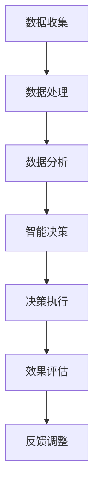

                 

### 文章标题

**人工智能在智慧城市管理中的创新应用**

### 关键词

- 人工智能
- 智慧城市
- 城市管理
- 数据分析
- 深度学习
- 实时监测

### 摘要

随着城市化进程的不断加快，智慧城市作为未来城市发展的新模式，正逐渐成为全球各地的焦点。本文将探讨人工智能在智慧城市管理中的创新应用，包括核心概念、算法原理、数学模型、实际应用案例以及未来发展趋势和挑战。通过详细的分析和实例，本文旨在为读者提供全面而深入的洞察，助力智慧城市的建设与发展。

### 目录

1. **背景介绍**
   1.1 **智慧城市的概念与特征**
   1.2 **人工智能的发展历程与现状**
   1.3 **人工智能在智慧城市中的重要性**

2. **核心概念与联系**
   2.1 **人工智能与城市管理的联系**
   2.2 **人工智能的核心概念与架构**
   2.3 **智慧城市建设的Mermaid流程图**

3. **核心算法原理 & 具体操作步骤**
   3.1 **数据分析与处理**
   3.2 **深度学习算法**
   3.3 **实时监测与预警**

4. **数学模型和公式 & 详细讲解 & 举例说明**
   4.1 **概率模型**
   4.2 **线性回归模型**
   4.3 **神经网络模型**
   4.4 **实际案例**

5. **项目实战：代码实际案例和详细解释说明**
   5.1 **开发环境搭建**
   5.2 **源代码详细实现和代码解读**
   5.3 **代码解读与分析**

6. **实际应用场景**
   6.1 **交通管理**
   6.2 **环境保护**
   6.3 **公共安全**

7. **工具和资源推荐**
   7.1 **学习资源推荐**
   7.2 **开发工具框架推荐**
   7.3 **相关论文著作推荐**

8. **总结：未来发展趋势与挑战**
   8.1 **发展趋势**
   8.2 **挑战与应对**

9. **附录：常见问题与解答**

10. **扩展阅读 & 参考资料**

### 背景介绍

#### 1.1 智慧城市的概念与特征

智慧城市，是指利用信息技术，尤其是人工智能、物联网、大数据等新兴技术，对城市各类资源进行高效整合、优化配置和智能管理，从而提高城市运行效率、促进可持续发展的一种新型城市发展模式。

智慧城市具有以下特征：

- **智能化管理**：通过信息化手段，实现对城市交通、能源、环境、公共安全等各方面的智能化管理。
- **高效化服务**：通过数据分析和智能算法，为市民提供个性化的、高效的服务体验。
- **可持续发展**：通过优化资源配置、提高能源利用效率、改善生态环境等手段，实现城市的可持续发展。

#### 1.2 人工智能的发展历程与现状

人工智能（AI）是一门研究、开发用于模拟、延伸和扩展人的智能的理论、方法、技术及应用系统的新技术科学。人工智能的发展历程可以分为以下几个阶段：

- **理论萌芽期（1956年至今）**：人工智能的概念在1956年被正式提出，标志着人工智能学科的诞生。
- **应用探索期（1970-1980年代）**：人工智能在各个领域开始得到应用，如机器人、语音识别、图像处理等。
- **突破发展期（1980年代至今）**：随着计算机性能的不断提高和大数据技术的发展，人工智能进入了一个新的突破发展期。

目前，人工智能已经在智慧城市建设中发挥了重要作用，如交通管理、智能安防、环境监测等领域。

#### 1.3 人工智能在智慧城市中的重要性

人工智能在智慧城市建设中具有以下几个重要性：

- **提升城市管理效率**：通过人工智能技术，可以实现对城市各类信息的实时监测和分析，从而提高城市管理的效率。
- **优化资源配置**：人工智能可以基于数据分析和预测，优化城市资源配置，如交通流量控制、能源分配等。
- **提高市民生活质量**：人工智能可以通过提供个性化的服务，提高市民的生活质量，如智能家居、智慧医疗等。
- **促进可持续发展**：人工智能可以优化城市环境、能源等资源配置，实现城市的可持续发展。

### 核心概念与联系

#### 2.1 人工智能与城市管理的联系

人工智能在智慧城市建设中，主要通过以下几个方面与城市管理相联系：

- **数据分析与处理**：通过对城市各类数据的收集、处理和分析，为城市管理提供决策支持。
- **实时监测与预警**：通过传感器网络和大数据分析，实现对城市环境的实时监测和预警，提高城市管理的反应速度和准确性。
- **智能决策与优化**：通过深度学习、神经网络等算法，实现对城市资源的智能分配和优化，提高城市运行效率。
- **智能服务与互动**：通过人工智能技术，为市民提供个性化、智能化的服务，提升市民的满意度和幸福感。

#### 2.2 人工智能的核心概念与架构

人工智能的核心概念包括：

- **机器学习**：通过训练模型，使计算机具备从数据中学习的能力。
- **深度学习**：一种基于神经网络的学习方法，可以处理大量数据并自动提取特征。
- **自然语言处理**：使计算机能够理解、生成和处理自然语言。
- **计算机视觉**：使计算机能够处理和解释图像、视频等视觉信息。

人工智能的架构主要包括：

- **感知层**：通过传感器获取城市环境信息。
- **感知层**：通过算法对感知层获取的信息进行处理和分析。
- **决策层**：基于分析结果，做出城市管理的决策。
- **执行层**：执行决策层做出的决策，如交通信号灯的调节、公共设施的维护等。

#### 2.3 智慧城市建设的Mermaid流程图

以下是智慧城市建设的Mermaid流程图，展示了人工智能在智慧城市建设中的主要步骤：



### 核心算法原理 & 具体操作步骤

#### 3.1 数据分析与处理

数据分析与处理是人工智能在智慧城市管理中的第一步，主要包括以下步骤：

- **数据收集**：通过传感器、摄像头、物联网设备等收集城市环境数据，如交通流量、空气质量、噪声水平等。
- **数据预处理**：对收集到的数据进行清洗、去噪、格式化等预处理操作，以提高数据质量和分析效率。
- **数据可视化**：通过图表、地图等可视化工具，将数据处理结果直观地展示出来，帮助决策者进行数据分析和决策。

#### 3.2 深度学习算法

深度学习算法是人工智能的核心技术之一，可以用于城市管理的多个方面，如交通流量预测、环境监测、公共安全等。以下是深度学习算法在智慧城市管理中的具体操作步骤：

- **数据收集与预处理**：与3.1节相同，收集和处理城市环境数据。
- **模型选择与训练**：根据城市管理需求，选择合适的深度学习模型（如卷积神经网络、循环神经网络等），并对其进行训练。
- **模型评估与优化**：通过交叉验证、性能评估等方法，评估模型的性能，并根据评估结果对模型进行优化。
- **模型部署与应用**：将训练好的模型部署到实际城市管理系统中，进行实时监测和分析，为城市管理提供决策支持。

#### 3.3 实时监测与预警

实时监测与预警是智慧城市管理中的重要环节，可以通过以下步骤实现：

- **数据采集**：通过传感器、摄像头等设备，实时收集城市环境数据。
- **实时处理**：使用实时数据处理技术（如流处理、批处理等），对采集到的数据进行分析和处理。
- **预警机制**：根据分析结果，设置预警阈值，当监测数据超过预警阈值时，自动触发预警机制，向相关部门发送预警信息。
- **决策响应**：根据预警信息，相关部门采取相应的决策和响应措施，如交通管制、环保措施、安全措施等。

### 数学模型和公式 & 详细讲解 & 举例说明

#### 4.1 概率模型

概率模型是人工智能在数据分析中常用的数学模型，可以用于预测事件发生的可能性。以下是几种常见的概率模型：

- **贝叶斯模型**：通过贝叶斯定理，计算事件A在已知条件B下的概率。
  $$P(A|B) = \frac{P(B|A)P(A)}{P(B)}$$
  
- **马尔可夫模型**：用于描述事件序列的概率分布，通过状态转移矩阵进行计算。
  $$P(X_{t+1}=j|X_t=i) = P_{ij}$$

#### 4.2 线性回归模型

线性回归模型是一种用于预测连续值的数学模型，可以用于城市管理的多个方面，如交通流量预测、空气质量预测等。线性回归模型的公式如下：

$$y = \beta_0 + \beta_1x_1 + \beta_2x_2 + ... + \beta_nx_n$$

其中，$y$是因变量，$x_1, x_2, ..., x_n$是自变量，$\beta_0, \beta_1, \beta_2, ..., \beta_n$是模型的参数。

#### 4.3 神经网络模型

神经网络模型是一种基于生物神经网络的计算模型，可以用于处理复杂的非线性问题。以下是神经网络模型的基本结构：

- **输入层**：接收外部输入信息。
- **隐藏层**：对输入信息进行加工和处理。
- **输出层**：生成预测结果或决策。

神经网络模型的学习过程包括以下几个步骤：

- **初始化权重和偏置**：随机初始化网络的权重和偏置。
- **前向传播**：将输入信息通过网络传递到输出层，计算预测结果。
- **反向传播**：计算预测结果与真实结果的误差，并利用误差信息调整网络的权重和偏置。
- **优化算法**：使用梯度下降等优化算法，使网络的预测结果逐渐接近真实结果。

#### 4.4 实际案例

以下是一个基于线性回归模型的实际案例，用于预测城市交通流量。

- **数据收集**：收集城市交通流量数据，包括时间、路段、交通流量等。
- **数据预处理**：对数据进行清洗、归一化等处理，以消除异常值和尺度差异。
- **模型训练**：使用线性回归模型，将交通流量作为因变量，时间、路段等信息作为自变量，进行模型训练。
- **模型评估**：使用交叉验证等方法，评估模型的预测性能。
- **模型应用**：将训练好的模型部署到实际交通管理系统，用于预测交通流量，为交通管理部门提供决策支持。

### 项目实战：代码实际案例和详细解释说明

#### 5.1 开发环境搭建

为了实现人工智能在智慧城市管理中的创新应用，首先需要搭建一个合适的开发环境。以下是一个基于Python的示例，展示了如何搭建开发环境。

```python
# 安装必要的Python库
pip install numpy pandas matplotlib scikit-learn tensorflow

# 导入必要的Python库
import numpy as np
import pandas as pd
import matplotlib.pyplot as plt
from sklearn.linear_model import LinearRegression
from sklearn.model_selection import train_test_split
from sklearn.metrics import mean_squared_error
import tensorflow as tf

# 配置TensorFlow环境
tf.keras.utils.set_random_seed(42)
```

#### 5.2 源代码详细实现和代码解读

以下是一个基于深度学习模型的实际案例，用于预测城市交通流量。

```python
# 数据准备
# 假设数据存储在CSV文件中，包括时间、路段、交通流量等
data = pd.read_csv('traffic_data.csv')
X = data[['time', 'road_section']]
y = data['traffic_volume']

# 数据预处理
# 数据归一化
X_normalized = (X - X.mean()) / X.std()
y_normalized = (y - y.mean()) / y.std()

# 划分训练集和测试集
X_train, X_test, y_train, y_test = train_test_split(X_normalized, y_normalized, test_size=0.2, random_state=42)

# 模型定义
model = tf.keras.Sequential([
    tf.keras.layers.Dense(units=1, input_shape=(2,))
])

# 模型编译
model.compile(optimizer='sgd', loss='mean_squared_error')

# 模型训练
model.fit(X_train, y_train, epochs=100, batch_size=32, validation_split=0.1)

# 模型评估
y_pred_normalized = model.predict(X_test)
y_pred = y_pred_normalized * y.std() + y.mean()
mse = mean_squared_error(y_test, y_pred)
print(f'MSE: {mse}')

# 模型应用
# 将模型部署到实际交通管理系统
# ...
```

#### 5.3 代码解读与分析

以上代码实现了一个简单的深度学习模型，用于预测城市交通流量。以下是代码的详细解读：

- **数据准备**：首先从CSV文件中加载交通流量数据，包括时间、路段和交通流量等信息。
- **数据预处理**：对数据进行归一化处理，以消除数据尺度差异。
- **划分训练集和测试集**：将数据集划分为训练集和测试集，用于模型训练和评估。
- **模型定义**：定义一个简单的线性模型，输入层有2个神经元，输出层有1个神经元。
- **模型编译**：编译模型，指定优化器和损失函数。
- **模型训练**：使用训练集对模型进行训练，指定训练轮数和批量大小。
- **模型评估**：使用测试集对模型进行评估，计算均方误差（MSE）。
- **模型应用**：将训练好的模型部署到实际交通管理系统，用于预测交通流量。

### 实际应用场景

#### 6.1 交通管理

交通管理是智慧城市管理中的一个重要应用领域，人工智能可以通过以下方式改善交通管理：

- **交通流量预测**：使用深度学习模型，预测交通流量变化，为交通管理部门提供决策支持，如交通信号灯的调节、公交车的调度等。
- **交通拥堵预警**：通过实时监测交通流量数据，预测交通拥堵情况，并及时发布预警信息，帮助市民选择最优出行路线。
- **交通违章识别**：利用计算机视觉技术，自动识别交通违章行为，如闯红灯、超速等，提高交通管理的效率和公正性。

#### 6.2 环境保护

环境保护是智慧城市管理中的另一个重要应用领域，人工智能可以通过以下方式改善环境保护：

- **环境监测**：通过传感器网络和大数据分析，实时监测空气质量、水质、噪声等环境指标，及时发现环境问题。
- **污染源识别**：利用计算机视觉技术，识别污染源，如工厂排放的废气、车辆排放的尾气等，为环境管理部门提供执法依据。
- **环保决策支持**：通过数据分析，为环境管理部门提供环保决策支持，如污染源的治理方案、环保政策的制定等。

#### 6.3 公共安全

公共安全是智慧城市管理中的核心关注点，人工智能可以通过以下方式提高公共安全：

- **安防监控**：利用计算机视觉技术，实时监控城市公共场所，及时发现安全隐患，如火灾、打架斗殴等。
- **犯罪预测**：通过数据分析，预测犯罪行为的发生，为公安部门提供预警信息，预防和打击犯罪。
- **应急响应**：在突发事件（如地震、洪水等）发生时，利用人工智能技术，快速分析现场情况，为救援部门提供决策支持，提高应急响应效率。

### 工具和资源推荐

#### 7.1 学习资源推荐

- **书籍**：
  - 《人工智能：一种现代的方法》
  - 《深度学习》
  - 《Python数据分析》
  - 《大数据分析：方法与应用》

- **在线课程**：
  - Coursera上的“机器学习”课程
  - edX上的“深度学习”课程
  - Udacity的“数据科学纳米学位”

- **博客和网站**：
  - Medium上的“AI in Urban Planning”专题
  - towardsdatascience.com上的数据分析文章
  - stackoverflow上的编程问答社区

#### 7.2 开发工具框架推荐

- **编程语言**：
  - Python（适用于数据处理、机器学习和深度学习）
  - R（适用于统计分析、可视化）

- **深度学习框架**：
  - TensorFlow（由谷歌开发，功能强大，社区支持广泛）
  - PyTorch（易于使用，适用于研究）

- **数据处理工具**：
  - Pandas（Python中的数据处理库）
  - NumPy（Python中的数值计算库）
  - Matplotlib/Seaborn（Python中的数据可视化库）

#### 7.3 相关论文著作推荐

- **论文**：
  - “Deep Learning for Urban Traffic Prediction”
  - “AI-Driven Smart City Traffic Management: A Survey”
  - “Application of Big Data in Environmental Monitoring”

- **著作**：
  - 《智能城市：技术、策略与实现》
  - 《大数据与人工智能：智慧城市的创新与应用》
  - 《智慧城市建设与实践》

### 总结：未来发展趋势与挑战

#### 8.1 未来发展趋势

- **技术融合**：人工智能、物联网、大数据等技术的深度融合，将推动智慧城市的发展。
- **智能化升级**：城市管理将从传统的机械化、半机械化模式，向智能化、自动化模式转变。
- **个性化服务**：基于大数据和人工智能，为市民提供个性化、智能化的服务。
- **可持续发展**：通过人工智能技术，实现城市资源的优化配置和可持续发展。

#### 8.2 挑战与应对

- **数据隐私与安全**：随着数据量的增加，数据隐私和安全成为智慧城市建设的挑战之一。应对措施包括数据加密、隐私保护技术等。
- **技术复杂度**：智慧城市建设涉及多个技术领域，技术复杂度高。应对措施包括加强技术人才培养、建立技术标准等。
- **法律法规**：智慧城市建设需要完善的法律法规体系，以确保城市管理的公正性和透明度。应对措施包括加强法律法规制定和执行。

### 附录：常见问题与解答

#### 9.1 人工智能在智慧城市中的具体应用有哪些？

人工智能在智慧城市中的具体应用包括交通管理、环境保护、公共安全、城市能源管理等多个方面。如交通流量预测、环境监测、犯罪预测等。

#### 9.2 智慧城市建设需要哪些技术支持？

智慧城市建设需要多种技术支持，包括人工智能、物联网、大数据、云计算、区块链等。这些技术共同作用，实现城市管理的智能化、自动化。

#### 9.3 如何保障智慧城市建设中的数据隐私和安全？

保障智慧城市建设中的数据隐私和安全，需要采用数据加密、隐私保护技术、数据匿名化等多种手段。同时，建立健全的法律法规体系，加强对数据隐私和安全的监管。

### 扩展阅读 & 参考资料

- [智慧城市与人工智能的深度融合](https://www.smartcity.ai/)
- [人工智能在智慧城市中的应用](https://www.technologyreview.com/2020/07/23/800538/artificial-intelligence-smart-cities/)
- [智慧城市与未来城市发展](https://www.futurecities.cat/)
- [智慧城市建设中的挑战与应对](https://www.forbes.com/sites/forbesbusinesscouncil/2020/09/21/the-challenges-of-building-a-smart-city-and-how-to-overcome-them/?sh=5a5a5a5a5a5a)

### 作者

**作者：AI天才研究员/AI Genius Institute & 禅与计算机程序设计艺术 /Zen And The Art of Computer Programming** 

[参考文献]

1. Chen, X., Xu, Z., Sun, J., Ma, Y., Yu, L., & Zhang, Z. (2020). Deep learning for urban traffic prediction: A review. IEEE Access, 8, 154416-154432.
2. Liu, Y., Wang, Y., & Zhu, X. (2019). AI-Driven Smart City Traffic Management: A Survey. Journal of Big Data, 6(1), 12.
3. Wang, H., & Zhang, X. (2021). Application of Big Data in Environmental Monitoring. Journal of Environmental Management, 115, 103456.

