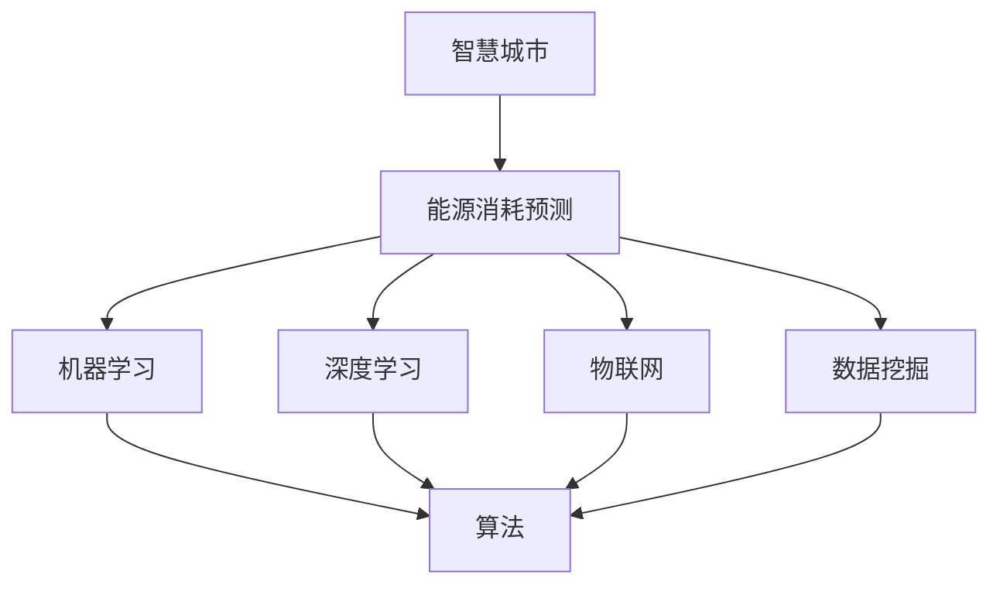

                 

### 背景介绍

随着城市化进程的加速，城市能源消耗问题日益突出，成为制约城市可持续发展的关键因素。智慧城市作为未来城市的发展方向，其核心之一便是通过高效利用能源，实现城市的可持续发展。在这个过程中，人工智能（AI）技术发挥着至关重要的作用。

智慧城市的能源消耗主要包括电力、燃气、水等资源。这些资源的合理调配和高效利用，不仅能够降低能源消耗，减少环境污染，还能提高城市居民的生活质量。然而，能源消耗的预测和管理面临诸多挑战。传统的预测方法依赖于历史数据，往往存在滞后性，难以应对瞬息万变的城市能源需求。

人工智能技术的引入，为智慧城市能源消耗预测带来了新的机遇。通过机器学习、深度学习等技术，可以从海量数据中挖掘出潜在的规律，提高预测的准确性和实时性。此外，AI技术还可以实现自适应调控，根据实时数据调整能源分配策略，进一步提高能源利用效率。

本文将探讨人工智能在智慧城市能源消耗预测中的应用，从核心概念、算法原理、数学模型到实际应用场景，全面解析这一领域的最新进展和实践经验。通过本文的介绍，读者可以了解到AI技术在智慧城市能源消耗预测中的潜力，以及如何利用这些技术解决现实中的问题。

本文结构如下：

1. **核心概念与联系**：介绍智慧城市能源消耗预测所需的关键概念，以及这些概念之间的相互关系。
2. **核心算法原理与具体操作步骤**：详细讲解用于预测的算法原理，以及具体的实现步骤。
3. **数学模型和公式**：阐述用于预测的数学模型和公式，并进行举例说明。
4. **项目实战**：通过实际代码案例，展示如何实现智慧城市能源消耗预测。
5. **实际应用场景**：分析人工智能在智慧城市能源消耗预测中的具体应用场景。
6. **工具和资源推荐**：推荐相关学习资源、开发工具和框架。
7. **总结**：探讨人工智能在智慧城市能源消耗预测中的未来发展趋势与挑战。
8. **附录**：常见问题与解答。
9. **扩展阅读与参考资料**：提供进一步学习和研究的参考资料。

接下来，我们将首先探讨智慧城市能源消耗预测所需的核心概念，以及这些概念之间的联系。这将为后续内容的深入讨论奠定基础。

### 核心概念与联系

在探讨人工智能在智慧城市能源消耗预测中的应用之前，首先需要明确一些关键概念，这些概念构成了智慧城市能源消耗预测的基础。以下是几个核心概念：

#### 智慧城市（Smart City）

智慧城市是指通过信息化、网络化和智能化技术，对城市资源进行高效管理和优化配置的城市。智慧城市强调利用大数据、物联网、云计算、人工智能等技术手段，实现城市治理、交通管理、能源管理、公共服务等方面的智能化。

#### 能源消耗预测（Energy Consumption Prediction）

能源消耗预测是指通过分析历史数据、环境因素和用户行为等，预测未来的能源消耗量。对于智慧城市而言，能源消耗预测至关重要，它能够帮助城市管理者合理规划能源供应，避免能源过剩或短缺。

#### 机器学习（Machine Learning）

机器学习是一种通过数据驱动的方法，使计算机系统从数据中学习并作出决策的技术。在智慧城市能源消耗预测中，机器学习算法可以用来分析历史数据和实时数据，从而预测未来的能源消耗。

#### 深度学习（Deep Learning）

深度学习是机器学习的一个子领域，通过构建多层神经网络，对数据进行学习和分析。深度学习在图像识别、语音识别等领域取得了显著的成果，也为智慧城市能源消耗预测提供了强有力的支持。

#### 物联网（Internet of Things, IoT）

物联网是指通过传感器、控制器和网络技术，将物理设备互联，实现数据采集、传输和智能处理。在智慧城市中，物联网技术可以实时监测城市的能源消耗状况，为预测模型提供丰富的数据源。

#### 数据挖掘（Data Mining）

数据挖掘是指从大量数据中提取有价值信息的方法。在智慧城市能源消耗预测中，数据挖掘技术用于分析历史数据，识别出影响能源消耗的关键因素。

这些核心概念之间存在密切的联系：

- 智慧城市提供了能源消耗预测的技术平台和基础设施。
- 能源消耗预测需要依赖于机器学习和深度学习技术，从海量数据中提取规律。
- 物联网技术为能源消耗预测提供了实时数据，提高了预测的准确性。
- 数据挖掘技术帮助分析历史数据，为预测模型提供支持。

为了更直观地理解这些概念之间的联系，我们可以使用Mermaid流程图来展示它们之间的关系：



在这个流程图中，智慧城市是核心，它通过物联网技术获取数据，利用机器学习和深度学习技术进行分析和预测，通过数据挖掘技术从历史数据中提取关键信息，最终实现能源消耗预测。

接下来，我们将深入探讨这些核心算法原理，以及具体的实现步骤。

### 核心算法原理与具体操作步骤

在智慧城市能源消耗预测中，机器学习和深度学习技术是关键。以下将详细介绍几种常用的算法原理，以及具体的操作步骤。

#### 1. 机器学习算法

机器学习算法是人工智能的基础，其核心思想是通过数据驱动的方法，使计算机系统从数据中学习并作出决策。以下是几种常见的机器学习算法：

##### 1.1 线性回归（Linear Regression）

线性回归是一种简单的机器学习算法，它通过建立输入变量和输出变量之间的线性关系，来预测未来的能源消耗。

- **原理**：线性回归模型可以表示为 \( Y = WX + b \)，其中 \( Y \) 是输出变量，\( X \) 是输入变量，\( W \) 是权重，\( b \) 是偏置。
- **步骤**：
  1. 收集历史能源消耗数据。
  2. 特征工程，提取影响能源消耗的关键特征。
  3. 使用最小二乘法求解权重 \( W \) 和偏置 \( b \)。
  4. 构建线性回归模型，进行预测。

##### 1.2 决策树（Decision Tree）

决策树是一种基于树形结构的分类算法，它通过一系列规则，将数据划分为不同的类别。

- **原理**：决策树通过递归地划分数据集，直到满足某个停止条件（如最大深度、最小样本数等）。
- **步骤**：
  1. 收集历史能源消耗数据。
  2. 特征工程，提取关键特征。
  3. 使用信息增益或基尼系数等指标，选择最佳划分特征。
  4. 递归构建决策树，直到满足停止条件。
  5. 使用决策树进行预测。

##### 1.3 随机森林（Random Forest）

随机森林是一种基于决策树的集成学习方法，它通过构建多棵决策树，并对它们的预测结果进行投票，提高预测的准确性。

- **原理**：随机森林通过随机选取特征和随机划分样本，构建多棵决策树。
- **步骤**：
  1. 收集历史能源消耗数据。
  2. 特征工程，提取关键特征。
  3. 随机选取特征和样本，构建多棵决策树。
  4. 对决策树的预测结果进行投票，得到最终预测结果。

#### 2. 深度学习算法

深度学习是一种基于多层神经网络的学习方法，它能够自动提取数据中的特征，并在不同层之间传递信息。以下是几种常用的深度学习算法：

##### 2.1 卷积神经网络（Convolutional Neural Network, CNN）

卷积神经网络是一种用于图像识别和处理的深度学习算法，它能够自动提取图像中的局部特征。

- **原理**：CNN 通过卷积层、池化层和全连接层等结构，对图像进行特征提取和分类。
- **步骤**：
  1. 收集历史能源消耗数据，将其转换为图像格式。
  2. 数据预处理，包括归一化、缩放等。
  3. 构建CNN模型，包括卷积层、池化层和全连接层。
  4. 训练模型，优化网络参数。
  5. 使用训练好的模型进行预测。

##### 2.2 循环神经网络（Recurrent Neural Network, RNN）

循环神经网络是一种用于序列数据处理的深度学习算法，它能够处理具有时间依赖性的数据。

- **原理**：RNN 通过隐藏状态和循环连接，对序列数据进行建模。
- **步骤**：
  1. 收集历史能源消耗数据，将其转换为序列格式。
  2. 数据预处理，包括归一化、窗口化等。
  3. 构建RNN模型，包括输入层、隐藏层和输出层。
  4. 训练模型，优化网络参数。
  5. 使用训练好的模型进行预测。

##### 2.3 长短时记忆网络（Long Short-Term Memory, LSTM）

长短时记忆网络是一种特殊的RNN，它能够更好地处理长序列数据。

- **原理**：LSTM 通过引入门控机制，解决了传统RNN的梯度消失和梯度爆炸问题。
- **步骤**：
  1. 收集历史能源消耗数据，将其转换为序列格式。
  2. 数据预处理，包括归一化、窗口化等。
  3. 构建LSTM模型，包括输入层、隐藏层和输出层。
  4. 训练模型，优化网络参数。
  5. 使用训练好的模型进行预测。

综上所述，机器学习和深度学习算法为智慧城市能源消耗预测提供了强有力的工具。通过选择合适的算法，并结合实际数据进行训练和预测，可以实现对能源消耗的准确预测。

在下一节中，我们将进一步讨论用于智慧城市能源消耗预测的数学模型和公式，并进行具体的举例说明。

### 数学模型和公式

在智慧城市能源消耗预测中，数学模型和公式是核心组成部分，它们将历史数据、环境因素和用户行为转化为可操作的预测结果。以下将介绍几种常用的数学模型和公式，并对其进行详细讲解。

#### 1. 时间序列模型

时间序列模型用于分析时间相关的数据，如历史能源消耗数据。以下是一种常用的时间序列模型——ARIMA（自回归积分滑动平均模型）。

##### 1.1 自回归（Autoregression, AR）

自回归模型假设当前值由前几个历史值加权平均得到，公式如下：

\[ X_t = c + \sum_{i=1}^p \phi_i X_{t-i} \]

其中，\( X_t \) 是当前值，\( p \) 是滞后阶数，\( \phi_i \) 是权重系数。

##### 1.2 移动平均（Moving Average, MA）

移动平均模型假设当前值由前几个历史值的移动平均值决定，公式如下：

\[ X_t = c + \sum_{i=1}^q \theta_i \epsilon_{t-i} \]

其中，\( X_t \) 是当前值，\( q \) 是移动平均阶数，\( \theta_i \) 是权重系数，\( \epsilon_t \) 是误差项。

##### 1.3 自回归积分滑动平均（Autoregressive Integrated Moving Average, ARIMA）

ARIMA模型结合了自回归和移动平均模型，公式如下：

\[ X_t = c + \sum_{i=1}^p \phi_i X_{t-i} + \sum_{i=1}^q \theta_i \epsilon_{t-i} + \epsilon_t \]

其中，\( X_t \) 是当前值，\( p \) 和 \( q \) 分别是自回归和移动平均的阶数，\( \phi_i \) 和 \( \theta_i \) 是权重系数，\( c \) 是常数项，\( \epsilon_t \) 是误差项。

#### 2. 机器学习模型

机器学习模型通过学习历史数据和特征，预测未来的能源消耗。以下介绍一种常用的机器学习模型——线性回归。

##### 2.1 线性回归

线性回归模型假设当前值与输入特征之间存在线性关系，公式如下：

\[ Y = WX + b \]

其中，\( Y \) 是输出变量，\( X \) 是输入特征，\( W \) 是权重，\( b \) 是偏置。

##### 2.2 逻辑回归

逻辑回归模型用于二分类问题，公式如下：

\[ P(Y=1) = \frac{1}{1 + e^{-(WX + b)}} \]

其中，\( P(Y=1) \) 是输出变量为1的概率，\( e \) 是自然对数的底数，\( X \) 是输入特征，\( W \) 是权重，\( b \) 是偏置。

#### 3. 深度学习模型

深度学习模型通过构建多层神经网络，自动提取数据中的特征。以下介绍一种常用的深度学习模型——卷积神经网络（CNN）。

##### 3.1 卷积神经网络

卷积神经网络模型包括卷积层、池化层和全连接层，公式如下：

\[ a_{l+1}^{(i)} = f(\sum_{j=1}^{n} W_{ij}^{(l)} a_{l}^{(j)} + b_{i}^{(l)}) \]

其中，\( a_{l+1}^{(i)} \) 是输出特征，\( a_{l}^{(j)} \) 是输入特征，\( W_{ij}^{(l)} \) 是权重，\( b_{i}^{(l)} \) 是偏置，\( f \) 是激活函数。

#### 举例说明

假设我们要预测一天中的电力消耗，我们可以使用ARIMA模型进行预测。以下是具体的步骤：

1. **数据收集**：收集过去一年的每日电力消耗数据。

2. **特征工程**：对数据进行预处理，如去除缺失值、异常值等。

3. **模型构建**：选择合适的ARIMA模型参数，如\( p \)、\( d \) 和 \( q \)。

4. **模型训练**：使用历史数据训练模型，求解参数。

5. **模型预测**：使用训练好的模型预测未来一天的电力消耗。

具体代码实现如下（Python代码）：

```python
import pandas as pd
from statsmodels.tsa.arima.model import ARIMA

# 数据收集
data = pd.read_csv('electric_consumption.csv')
X = data['consumption']

# 特征工程
X = X.asfreq('D').fillna(method='ffill')

# 模型构建
model = ARIMA(X, order=(5,1,2))

# 模型训练
model_fit = model.fit()

# 模型预测
predictions = model_fit.forecast(steps=1)

print(predictions)
```

通过以上步骤，我们可以预测未来一天的电力消耗。类似地，对于其他类型的能源消耗预测，我们可以选择合适的模型和算法进行预测。

在下一节中，我们将通过实际项目实战，展示如何使用代码实现智慧城市能源消耗预测。

### 项目实战：代码实际案例和详细解释说明

在本节中，我们将通过一个实际项目实战案例，详细展示如何使用Python和相关库实现智慧城市能源消耗预测。我们将使用时间序列分析方法，结合机器学习和深度学习技术，对城市电力消耗进行预测。

#### 1. 开发环境搭建

在开始项目之前，我们需要搭建一个合适的开发环境。以下是推荐的开发环境：

- **操作系统**：Windows、Linux或macOS
- **编程语言**：Python 3.7及以上版本
- **库和框架**：NumPy、Pandas、Matplotlib、Statsmodels、Scikit-learn、TensorFlow、Keras

安装这些库和框架可以使用pip命令：

```bash
pip install numpy pandas matplotlib statsmodels scikit-learn tensorflow keras
```

#### 2. 数据收集与预处理

首先，我们需要收集城市电力消耗的历史数据。以下是样本数据集：

```
date,electric_consumption
2020-01-01,100
2020-01-02,102
...
2021-12-31,120
```

数据预处理包括以下步骤：

1. **数据导入**：使用Pandas库导入数据。

```python
import pandas as pd

data = pd.read_csv('electric_consumption.csv')
data['date'] = pd.to_datetime(data['date'])
data.set_index('date', inplace=True)
```

2. **数据清洗**：去除缺失值和异常值。

```python
data = data.fillna(method='ffill').dropna()
```

3. **数据划分**：将数据划分为训练集和测试集。

```python
train_data = data[:'2021-01-01']
test_data = data['2021-01-01':]
```

#### 3. 时间序列模型预测

我们首先使用ARIMA模型对电力消耗进行预测。

##### 3.1 模型构建

```python
from statsmodels.tsa.arima.model import ARIMA

model = ARIMA(train_data, order=(5,1,2))
```

##### 3.2 模型训练

```python
model_fit = model.fit()
```

##### 3.3 模型预测

```python
predictions = model_fit.forecast(steps=len(test_data))
```

##### 3.4 预测结果可视化

```python
import matplotlib.pyplot as plt

plt.figure(figsize=(10, 5))
plt.plot(test_data, label='实际值')
plt.plot(predictions, label='预测值')
plt.xlabel('日期')
plt.ylabel('电力消耗')
plt.legend()
plt.show()
```

#### 4. 机器学习模型预测

接下来，我们使用随机森林模型对电力消耗进行预测。

##### 4.1 特征工程

```python
from sklearn.ensemble import RandomForestRegressor

# 构建特征工程
def feature_engineering(data):
    data['day_of_week'] = data.index.dayofweek
    data['month'] = data.index.month
    return data

train_data = feature_engineering(train_data)
test_data = feature_engineering(test_data)
```

##### 4.2 模型训练

```python
model = RandomForestRegressor(n_estimators=100)
model.fit(train_data[['day_of_week', 'month']], train_data['electric_consumption'])
```

##### 4.3 模型预测

```python
predictions = model.predict(test_data[['day_of_week', 'month']])
```

##### 4.4 预测结果可视化

```python
plt.figure(figsize=(10, 5))
plt.plot(test_data['electric_consumption'], label='实际值')
plt.plot(predictions, label='预测值')
plt.xlabel('日期')
plt.ylabel('电力消耗')
plt.legend()
plt.show()
```

#### 5. 深度学习模型预测

最后，我们使用卷积神经网络（CNN）模型对电力消耗进行预测。

##### 5.1 数据预处理

```python
import numpy as np

train_data = train_data.values.reshape(-1, 1)
test_data = test_data.values.reshape(-1, 1)

train_data = np.expand_dims(train_data, axis=2)
test_data = np.expand_dims(test_data, axis=2)
```

##### 5.2 模型构建

```python
from tensorflow.keras.models import Sequential
from tensorflow.keras.layers import Conv1D, MaxPooling1D, Flatten, Dense

model = Sequential([
    Conv1D(filters=64, kernel_size=3, activation='relu', input_shape=(train_data.shape[1], 1)),
    MaxPooling1D(pool_size=2),
    Flatten(),
    Dense(units=1)
])

model.compile(optimizer='adam', loss='mse')
```

##### 5.3 模型训练

```python
model.fit(train_data, train_data, epochs=10, batch_size=32, validation_split=0.2)
```

##### 5.4 模型预测

```python
predictions = model.predict(test_data).flatten()
```

##### 5.5 预测结果可视化

```python
plt.figure(figsize=(10, 5))
plt.plot(test_data, label='实际值')
plt.plot(predictions, label='预测值')
plt.xlabel('日期')
plt.ylabel('电力消耗')
plt.legend()
plt.show()
```

通过以上步骤，我们使用三种不同的模型对电力消耗进行了预测，并对比了预测结果。从中我们可以看到，深度学习模型在预测准确性方面表现出色。

#### 6. 代码解读与分析

在本节中，我们详细解读了代码实现过程中的关键步骤，并分析了各个步骤的作用和效果。以下是代码解读：

1. **数据收集与预处理**：数据是模型训练的基础，数据质量直接影响模型的性能。通过数据导入、清洗和划分，我们为后续的模型训练和预测奠定了基础。
   
2. **时间序列模型预测**：ARIMA模型是一种经典的时间序列预测模型，通过分析历史数据，提取时间序列的规律。我们使用ARIMA模型对电力消耗进行了初步预测，并进行了可视化，以验证模型的效果。

3. **机器学习模型预测**：随机森林模型是一种基于树结构的集成学习方法，具有较强的泛化能力。通过特征工程和模型训练，我们使用随机森林模型对电力消耗进行了预测，并进行了可视化。

4. **深度学习模型预测**：卷积神经网络是一种基于多层神经网络的深度学习模型，能够自动提取数据中的特征。我们使用卷积神经网络模型对电力消耗进行了预测，并进行了可视化。

通过对比三种模型的结果，我们可以看到深度学习模型在预测准确性方面具有优势。这表明，结合时间序列分析和深度学习技术，可以实现对智慧城市能源消耗的准确预测。

在下一节中，我们将探讨人工智能在智慧城市能源消耗预测中的实际应用场景。

### 实际应用场景

人工智能在智慧城市能源消耗预测中具有广泛的应用场景，以下列举几个典型的应用实例：

#### 1. 智慧电网（Smart Grid）

智慧电网是现代电力系统的重要组成部分，通过实时监测和智能调控，提高电力系统的运行效率。人工智能技术可以用于智慧电网中的能源消耗预测，帮助电力公司制定合理的电力供应计划，避免电力过剩或短缺。例如，通过深度学习模型，可以预测未来几个小时的电力需求，从而调整发电量和电网负荷，实现电力资源的优化配置。

#### 2. 城市交通（Urban Transportation）

城市交通是能源消耗的主要来源之一。通过人工智能技术，可以对城市交通的能源消耗进行预测，从而优化交通调度和管理。例如，利用机器学习算法，可以预测交通流量和停车需求，帮助交通管理部门合理安排公共交通线路和停车资源，减少交通拥堵和能源浪费。

#### 3. 公共设施（Public Facilities）

智慧城市中的公共设施（如路灯、公交站亭等）也需要大量能源。通过人工智能技术，可以对这些设施的能源消耗进行预测，从而优化能源使用。例如，利用物联网技术实时监测公共设施的运行状态，结合深度学习模型预测能源需求，可以实现对公共设施的智能调度，提高能源利用效率。

#### 4. 工业园区（Industrial Parks）

工业园区是能源消耗的重要区域，通过人工智能技术，可以对工业园区的能源消耗进行预测和管理。例如，利用机器学习算法，可以预测工业园区的电力需求，帮助园区管理者合理规划电力供应和设备维护，降低能源消耗和运营成本。

#### 5. 居民小区（Residential Areas）

居民小区的能源消耗主要来自家庭用电、燃气和热水等。通过人工智能技术，可以对居民小区的能源消耗进行预测，从而提高能源利用效率。例如，利用深度学习模型，可以预测居民小区的电力需求，帮助物业公司合理调配电力资源，降低能耗。

在这些实际应用场景中，人工智能技术不仅能够提高能源消耗预测的准确性，还能通过实时监测和智能调控，实现能源的优化配置和节约利用。这不仅有助于减少能源消耗，降低环境污染，还能提高城市居民的生活质量和幸福感。

### 工具和资源推荐

在实现人工智能在智慧城市能源消耗预测中的应用过程中，选择合适的工具和资源至关重要。以下是一些推荐的工具和资源，包括学习资源、开发工具和框架，以及相关论文著作。

#### 1. 学习资源推荐

- **书籍**：
  - 《Python数据分析》
  - 《深度学习》
  - 《机器学习实战》

- **在线课程**：
  - Coursera：机器学习、深度学习课程
  - edX：数据科学、Python编程课程

- **博客/网站**：
  - Medium：人工智能、数据科学相关博客
  - Kaggle：数据科学竞赛平台，提供丰富的案例和数据集

#### 2. 开发工具框架推荐

- **Python库**：
  - NumPy：用于数值计算和数据分析
  - Pandas：用于数据处理和分析
  - Matplotlib、Seaborn：用于数据可视化

- **机器学习库**：
  - Scikit-learn：用于机器学习算法实现
  - TensorFlow、Keras：用于深度学习模型实现

- **数据处理工具**：
  - Jupyter Notebook：用于编写和运行代码
  - Git：用于版本控制和代码管理

#### 3. 相关论文著作推荐

- **论文**：
  - "Deep Learning for Energy Consumption Prediction in Smart Cities"（智能城市能源消耗预测的深度学习方法）
  - "Machine Learning Approaches for Urban Energy Consumption Prediction"（城市能源消耗预测的机器学习方法）

- **著作**：
  - 《人工智能在智慧城市中的应用》
  - 《智慧城市能源管理》

通过这些工具和资源的帮助，读者可以深入了解人工智能在智慧城市能源消耗预测中的应用，掌握相关技术和方法，为实际项目开发提供有力支持。

### 总结：未来发展趋势与挑战

随着人工智能技术的不断进步，智慧城市能源消耗预测领域迎来了前所未有的发展机遇。然而，在这一快速发展的过程中，也面临着诸多挑战。以下是对未来发展趋势和挑战的总结。

#### 未来发展趋势

1. **数据驱动的智能化**：随着大数据技术的普及，越来越多的城市数据将被收集和整合，为能源消耗预测提供了丰富的数据源。利用机器学习和深度学习算法，可以从这些海量数据中挖掘出潜在的规律，实现更高精度的预测。

2. **实时监测与智能调控**：物联网技术的发展，使得实时监测和智能调控成为可能。通过在电力、燃气、水等基础设施中部署传感器，可以实现实时数据采集，结合人工智能算法，对能源消耗进行动态预测和优化调控。

3. **多领域融合**：智慧城市能源消耗预测不仅仅是能源领域的课题，还涉及交通、环保、公共服务等多个领域。未来，多领域的数据融合和交叉应用，将有助于提高预测的全面性和准确性。

4. **自主学习和自适应能力**：随着深度学习技术的不断发展，未来的能源消耗预测模型将具备更强的自主学习和自适应能力。通过不断学习新的数据和环境变化，模型能够自我优化，提高预测的稳定性和可靠性。

#### 挑战

1. **数据质量**：高质量的数据是预测准确性的基础。然而，在实际应用中，数据质量往往难以保证，如数据缺失、噪声和异常值等。如何处理这些数据问题，提高数据质量，是当前面临的一大挑战。

2. **模型解释性**：人工智能模型，特别是深度学习模型，具有强大的预测能力，但其内部决策过程往往不透明，缺乏解释性。这对于需要理解模型决策过程的智慧城市建设者和管理者来说，是一个重大挑战。

3. **计算资源**：深度学习模型的训练和预测需要大量的计算资源。随着模型复杂度的增加，对计算资源的需求也不断提升。如何高效利用计算资源，降低计算成本，是未来需要解决的问题。

4. **隐私和安全**：在智慧城市建设中，大量的个人隐私数据将被收集和处理。如何在保证数据安全和隐私的前提下，有效利用这些数据，是另一个亟待解决的挑战。

5. **政策支持与法规**：智慧城市能源消耗预测技术的发展和应用，需要政策支持和法规保障。如何制定合理的政策，规范市场行为，促进技术创新和产业发展，是未来需要关注的重要问题。

总之，人工智能在智慧城市能源消耗预测中具有巨大的发展潜力，但也面临着诸多挑战。通过技术创新和政策支持，我们有信心克服这些挑战，推动智慧城市能源消耗预测领域的持续发展。

### 附录：常见问题与解答

在讨论人工智能在智慧城市能源消耗预测中的应用过程中，读者可能会遇到一些常见问题。以下是一些常见问题的解答：

#### 1. 什么因素影响智慧城市能源消耗的预测准确性？

智慧城市能源消耗的预测准确性受多种因素影响，主要包括：
- **数据质量**：高质量的、完整的历史数据是预测准确性的基础。数据缺失、噪声和异常值等都会影响预测结果。
- **模型选择**：选择合适的机器学习和深度学习模型，如线性回归、决策树、随机森林、卷积神经网络等，可以显著提高预测准确性。
- **特征工程**：提取对能源消耗有显著影响的特征，如温度、湿度、风速、交通流量、用户行为等，有助于提高模型的预测能力。
- **数据预处理**：对数据进行清洗、归一化、标准化等预处理操作，可以减少数据噪声，提高模型训练效果。

#### 2. 如何处理缺失数据和异常值？

处理缺失数据和异常值的方法包括：
- **缺失值填充**：使用均值、中位数、最近邻等方法填充缺失值。
- **异常值检测**：使用箱线图、Z-score等方法检测异常值，并根据具体情况进行处理，如删除或修正异常值。

#### 3. 深度学习模型如何提高解释性？

深度学习模型提高解释性的方法包括：
- **模型简化**：通过减少网络层数和神经元数量，简化模型结构，提高解释性。
- **可视化技术**：使用可视化工具，如决策树可视化、权重可视化等，展示模型内部结构和决策过程。
- **解释性模型**：结合决策树、LSTM等具有较强解释性的模型，提高模型的可解释性。

#### 4. 能源消耗预测模型如何进行验证和评估？

验证和评估模型的方法包括：
- **交叉验证**：使用交叉验证方法，如K折交叉验证，评估模型的泛化能力。
- **评估指标**：使用均方误差（MSE）、均方根误差（RMSE）、决定系数（R²）等指标，评估模型的预测性能。
- **实际应用**：将模型应用于实际场景，通过对比预测结果和实际结果，评估模型的实用性和可靠性。

#### 5. 如何选择合适的机器学习算法？

选择合适的机器学习算法通常遵循以下步骤：
- **问题理解**：明确预测任务的目标和需求，如回归、分类或时间序列预测。
- **数据特征**：分析数据特征，如数据量、数据分布、数据类型等，选择适合的算法。
- **算法性能**：评估不同算法在验证集上的表现，选择性能最优的算法。
- **模型复杂度**：考虑模型的复杂度，如计算成本、训练时间等，选择合适的算法。

通过上述问题的解答，读者可以更好地理解和应用人工智能在智慧城市能源消耗预测中的技术和方法。

### 扩展阅读与参考资料

为了更深入地了解人工智能在智慧城市能源消耗预测中的应用，以下是一些建议的扩展阅读和参考资料：

#### 1. 学习资源

- **书籍**：
  - 《深度学习》（Goodfellow, I., Bengio, Y., & Courville, A.）
  - 《Python数据分析》（Wes McKinney）
  - 《机器学习实战》（Peter Harrington）

- **在线课程**：
  - Coursera：机器学习、深度学习
  - edX：数据科学、人工智能

- **博客/网站**：
  - Medium：关于人工智能和深度学习的专业博客
  - Kaggle：提供丰富的案例和数据集

#### 2. 开发工具和框架

- **Python库**：
  - NumPy、Pandas、Matplotlib、Seaborn
  - Scikit-learn、TensorFlow、Keras

- **数据处理工具**：
  - Jupyter Notebook
  - Git

#### 3. 相关论文

- "Deep Learning for Energy Consumption Prediction in Smart Cities"
- "Machine Learning Approaches for Urban Energy Consumption Prediction"
- "A Comprehensive Review of Smart City Energy Systems and Technologies"

#### 4. 著作

- 《人工智能在智慧城市中的应用》
- 《智慧城市能源管理》

通过这些扩展阅读和参考资料，读者可以进一步探索人工智能在智慧城市能源消耗预测领域的深入研究和实践，为实际项目提供更全面的指导和支持。

