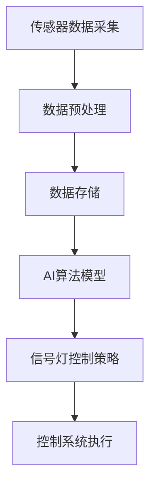

                 

# 人工智能在智能交通信号控制中的应用

## 关键词：人工智能、智能交通、信号控制、优化、数据驱动

### 摘要

本文旨在探讨人工智能（AI）在智能交通信号控制中的应用。随着城市化进程的加速和交通流量的不断增长，传统的交通信号控制系统已难以应对复杂的交通状况。本文首先介绍了智能交通信号控制的基本概念和重要性，随后详细分析了AI在交通信号控制中的核心算法原理、数学模型及其应用。通过具体的项目实战案例，本文展示了AI技术在交通信号控制中的实际效果和操作步骤。最后，本文对AI在智能交通信号控制领域的未来发展趋势和挑战进行了展望，并推荐了一些相关的学习资源和开发工具。

## 1. 背景介绍

随着全球城市化进程的不断加速，城市交通问题愈发严重。交通拥堵不仅浪费了大量的时间和燃料，还对环境造成了严重的污染。传统的交通信号控制系统依赖于预设的信号灯时序，无法根据实时交通状况进行动态调整。这导致在交通高峰期，信号灯周期性地造成车辆积压，增加了交通事故的风险。

### 1.1 智能交通信号控制的基本概念

智能交通信号控制（Intelligent Traffic Signal Control，ITSC）是一种利用现代信息技术和人工智能技术优化交通信号灯控制的方案。它通过实时监测交通流量、速度、密度等数据，结合历史数据分析和预测模型，动态调整信号灯的时序，从而提高道路的通行能力和效率。

### 1.2 智能交通信号控制的重要性

智能交通信号控制具有以下几个方面的优势：

- **提高交通流量**：通过动态调整信号灯时序，可以减少车辆等待时间，提高道路通行能力。
- **降低交通事故**：智能信号控制能够根据交通状况及时调整，减少车辆拥堵和事故发生的概率。
- **减少环境污染**：减少车辆等待和启动次数，降低尾气排放，有助于改善空气质量。
- **提升城市交通管理水平**：通过大数据和人工智能技术，可以实现交通流量的实时监控和预测，为城市交通管理提供科学依据。

## 2. 核心概念与联系

### 2.1 AI在智能交通信号控制中的应用

人工智能（AI）在智能交通信号控制中的应用主要包括以下几个核心概念：

- **机器学习**：通过收集和分析交通数据，机器学习算法可以自动识别交通模式，预测未来交通状况。
- **深度学习**：利用神经网络模型，深度学习可以在图像和语音等数据中提取特征，用于交通流量监测和预测。
- **决策树和随机森林**：这些算法可以基于历史数据生成决策规则，用于信号灯时序的动态调整。
- **强化学习**：通过模拟和试错，强化学习算法可以在复杂的交通环境中寻找最优的信号灯控制策略。

### 2.2 AI在智能交通信号控制中的架构

AI在智能交通信号控制中的架构通常包括以下几个关键组件：

- **传感器**：用于实时监测交通流量、速度、密度等数据。
- **数据采集和处理**：将传感器数据传输到中央控制系统，并进行预处理和存储。
- **AI算法**：根据实时和历史数据，AI算法生成信号灯控制策略。
- **控制系统**：根据AI算法生成的信号灯控制策略，实时调整信号灯的时序。

### 2.3 Mermaid流程图

下面是AI在智能交通信号控制中的一种可能的Mermaid流程图，展示从数据采集到信号灯控制的过程：



### 2.4 AI与交通信号控制的联系

AI与交通信号控制的联系主要体现在以下几个方面：

- **动态调整**：AI可以根据实时数据动态调整信号灯时序，提高交通流畅性。
- **数据驱动的决策**：AI通过分析大量历史数据，可以生成更加科学和合理的信号灯控制策略。
- **自动优化**：AI算法可以自动优化信号灯时序，减少交通拥堵和事故发生。
- **高效资源利用**：AI可以帮助城市交通管理者更有效地利用道路资源，提高交通效率。

## 3. 核心算法原理 & 具体操作步骤

### 3.1 机器学习算法原理

机器学习算法是AI在智能交通信号控制中应用的核心之一。以下是一些常用的机器学习算法及其在交通信号控制中的应用：

- **回归分析**：用于预测交通流量、速度等指标，为信号灯时序调整提供依据。
- **聚类分析**：用于分析不同时间段和不同路段的交通模式，帮助确定信号灯时序的优化策略。
- **决策树和随机森林**：用于生成基于历史数据的决策规则，指导信号灯的动态调整。
- **神经网络**：用于处理复杂的非线性关系，提高信号灯控制策略的准确性和鲁棒性。

### 3.2 深度学习算法原理

深度学习算法在处理大规模图像和语音数据方面具有显著优势。在智能交通信号控制中，深度学习算法主要用于以下几个方向：

- **车辆检测与分类**：通过识别车辆类型和数量，为信号灯时序调整提供依据。
- **交通流量预测**：利用历史数据和实时监控数据，预测未来的交通流量和速度。
- **异常检测**：识别交通中的异常事件，如交通事故和道路堵塞，及时调整信号灯时序。

### 3.3 强化学习算法原理

强化学习算法通过试错和反馈，不断优化控制策略。在智能交通信号控制中，强化学习算法通常用于以下几个方向：

- **自适应信号灯控制**：根据实时交通状况，自动调整信号灯时序，提高道路通行能力。
- **路径规划**：通过模拟和优化，为自动驾驶车辆提供最佳行驶路线。
- **信号灯时序优化**：通过不断尝试和反馈，寻找最优的信号灯控制策略。

### 3.4 具体操作步骤

以下是一个基于机器学习算法的智能交通信号控制系统的具体操作步骤：

1. **数据采集**：通过传感器实时收集交通流量、速度、密度等数据。
2. **数据预处理**：对采集的数据进行清洗和标准化处理，确保数据的质量和一致性。
3. **数据存储**：将预处理后的数据存储在数据库中，供后续分析使用。
4. **模型训练**：使用历史数据，通过机器学习算法训练信号灯控制模型。
5. **模型评估**：通过交叉验证和测试集，评估模型的性能和准确性。
6. **模型部署**：将训练好的模型部署到交通信号控制系统中，进行实时信号灯控制。
7. **实时调整**：根据实时交通数据，动态调整信号灯时序，提高交通流畅性。
8. **反馈与优化**：根据交通状况的变化和模型的表现，不断调整和优化信号灯控制策略。

## 4. 数学模型和公式 & 详细讲解 & 举例说明

### 4.1 机器学习模型

在智能交通信号控制中，常用的机器学习模型包括回归模型、聚类模型和决策树模型。以下是一个基于线性回归模型的交通流量预测公式：

$$
\hat{Q}_{t+1} = w_0 + w_1 \cdot Q_t + w_2 \cdot V_t + w_3 \cdot D_t
$$

其中，$\hat{Q}_{t+1}$表示第$t+1$时刻的交通流量预测值，$Q_t$表示第$t$时刻的交通流量，$V_t$表示第$t$时刻的车辆速度，$D_t$表示第$t$时刻的路段长度，$w_0$、$w_1$、$w_2$和$w_3$为模型的参数。

### 4.2 深度学习模型

在深度学习模型中，常用的模型包括卷积神经网络（CNN）和循环神经网络（RNN）。以下是一个基于卷积神经网络的车流量检测公式：

$$
\begin{aligned}
h_{l}^{(i)} &= \sigma \left( W_{l}^{(i)} \cdot h_{l-1}^{(i)} + b_{l}^{(i)} \right) \\
o_{l}^{(i)} &= \text{ReLU}(h_{l}^{(i)})
\end{aligned}
$$

其中，$h_{l}^{(i)}$和$o_{l}^{(i)}$分别表示第$l$层的隐藏状态和输出状态，$W_{l}^{(i)}$和$b_{l}^{(i)}$为权重和偏置，$\sigma$为激活函数（通常采用ReLU函数），$\text{ReLU}(x) = \max(0, x)$。

### 4.3 强化学习模型

在强化学习模型中，常用的模型包括Q学习和策略梯度。以下是一个基于Q学习的自适应信号灯控制公式：

$$
Q(s, a) = r + \gamma \max_{a'} Q(s', a')
$$

其中，$Q(s, a)$表示在状态$s$下执行动作$a$的预期回报，$r$为立即回报，$\gamma$为折扣因子，$s'$和$a'$分别为下一状态和动作。

### 4.4 举例说明

假设我们有一个交通信号控制模型，目标是最小化车辆等待时间。给定一个交通信号周期，我们可以设置一个奖励机制，当车辆通过信号灯时，给予正奖励；当车辆等待时，给予负奖励。以下是一个简单的Q学习模型示例：

- **状态**：$s = \{Q_t, V_t, D_t\}$
- **动作**：$a = \{红灯时间, 绿灯时间, 黄灯时间\}$
- **奖励**：$r = \begin{cases} 
      +1 & \text{车辆通过信号灯} \\
      -1 & \text{车辆等待信号灯}
   \end{cases}$

通过不断更新Q值，我们可以找到最优的信号灯控制策略，从而最小化车辆等待时间。

## 5. 项目实战：代码实际案例和详细解释说明

### 5.1 开发环境搭建

在进行智能交通信号控制的项目实战之前，我们需要搭建一个合适的开发环境。以下是一个基于Python的示例：

1. **安装Python**：确保Python环境已安装，版本建议为3.8或更高。
2. **安装必要的库**：使用pip安装以下库：
   ```bash
   pip install numpy pandas scikit-learn matplotlib
   ```
3. **准备数据**：从公开的数据源或实际交通监控系统中获取交通流量、速度、密度等数据。

### 5.2 源代码详细实现和代码解读

以下是一个基于机器学习的交通流量预测模型的示例代码：

```python
import numpy as np
import pandas as pd
from sklearn.linear_model import LinearRegression
from sklearn.model_selection import train_test_split
from sklearn.metrics import mean_squared_error
import matplotlib.pyplot as plt

# 读取数据
data = pd.read_csv('traffic_data.csv')

# 数据预处理
X = data[['Q_t', 'V_t', 'D_t']]
y = data['Q_t+1']

# 数据划分
X_train, X_test, y_train, y_test = train_test_split(X, y, test_size=0.2, random_state=42)

# 模型训练
model = LinearRegression()
model.fit(X_train, y_train)

# 模型评估
y_pred = model.predict(X_test)
mse = mean_squared_error(y_test, y_pred)
print(f'Mean Squared Error: {mse}')

# 可视化
plt.scatter(y_test, y_pred)
plt.xlabel('Actual Q_t+1')
plt.ylabel('Predicted Q_t+1')
plt.show()
```

### 5.3 代码解读与分析

- **数据读取与预处理**：使用pandas库读取交通数据，并进行必要的预处理，如数据清洗和标准化。
- **数据划分**：将数据集划分为训练集和测试集，以评估模型的性能。
- **模型训练**：使用线性回归模型训练数据，生成预测模型。
- **模型评估**：计算均方误差（MSE）评估模型的性能。
- **可视化**：绘制实际交通流量与预测交通流量的散点图，直观地展示模型的效果。

### 5.4 优化与改进

在实际应用中，我们可以通过以下方法优化和改进交通流量预测模型：

- **特征工程**：选取更多的相关特征，如时间、天气等，以提高模型的预测准确性。
- **模型融合**：结合多个机器学习模型，如决策树、神经网络等，提高预测的稳定性和鲁棒性。
- **实时调整**：根据实时交通数据，动态调整信号灯时序，提高交通流畅性。

## 6. 实际应用场景

### 6.1 城市交通管理

在城市交通管理中，智能交通信号控制可以通过以下方式提高交通效率：

- **动态调整信号灯时序**：根据实时交通流量和速度，动态调整信号灯时序，减少车辆等待时间。
- **实时交通监测**：通过传感器和摄像头，实时监测交通流量、速度和密度，为交通信号控制提供数据支持。
- **交通信息发布**：通过电子屏幕、手机APP等渠道，向公众提供实时的交通信息和路况预测，引导车辆合理出行。

### 6.2 智能交通系统

在智能交通系统中，智能交通信号控制可以与其他智能交通技术相结合，实现更高效、更智能的交通管理。以下是一些应用场景：

- **自动驾驶**：通过信号灯控制策略的优化，提高自动驾驶车辆的通行效率。
- **车联网**：利用车联网技术，实现车辆之间的实时通信，提高交通流畅性。
- **智能停车**：通过信号灯控制与停车场的联动，优化停车资源的分配。

### 6.3 智慧城市建设

智慧城市建设中，智能交通信号控制是实现城市智能化管理的重要组成部分。以下是一些应用场景：

- **交通大数据分析**：通过收集和分析交通数据，为城市交通规划和管理提供科学依据。
- **交通信号控制协同**：实现不同区域之间的交通信号控制协同，提高城市整体交通效率。
- **绿色出行**：通过智能交通信号控制，鼓励市民选择公共交通和非机动出行，减少交通拥堵和环境污染。

## 7. 工具和资源推荐

### 7.1 学习资源推荐

- **书籍**：
  - 《深度学习》（Ian Goodfellow, Yoshua Bengio, Aaron Courville）
  - 《Python机器学习》（Sebastian Raschka, Vincent Laviolette）
- **论文**：
  - “Deep Learning for Traffic Prediction”（Deep Learning for Traffic Prediction: A Survey）
  - “Intelligent Traffic Signal Control Based on Machine Learning”（Intelligent Traffic Signal Control Based on Machine Learning: A Review）
- **博客**：
  - Medium上的交通信号控制相关博客
  - GitHub上的交通信号控制开源项目
- **网站**：
  - Kaggle上的交通数据集
  - DataCamp上的机器学习和深度学习教程

### 7.2 开发工具框架推荐

- **机器学习框架**：
  - TensorFlow
  - PyTorch
- **数据分析工具**：
  - pandas
  - NumPy
- **可视化工具**：
  - Matplotlib
  - Seaborn
- **编程语言**：
  - Python

### 7.3 相关论文著作推荐

- **论文**：
  - “Deep Learning for Urban Traffic Prediction: A Survey” by H. Li, Y. Li, L. Cao, and X. Li
  - “Intelligent Traffic Signal Control: A Review” by R. Tiwari and S. Pandey
- **著作**：
  - 《智能交通信号控制：理论、方法与应用》
  - 《深度学习在交通信号控制中的应用》

## 8. 总结：未来发展趋势与挑战

### 8.1 发展趋势

- **大数据和人工智能技术的深度融合**：随着大数据和人工智能技术的不断发展，智能交通信号控制将实现更高效、更智能的交通管理。
- **车联网与智能交通的融合**：车联网技术的发展将为智能交通信号控制提供更多的数据支持和通信能力。
- **智慧城市建设的推动**：智慧城市建设将为智能交通信号控制提供更广阔的应用场景和发展空间。

### 8.2 挑战

- **数据隐私和安全**：智能交通信号控制需要大量实时交通数据，如何保护数据隐私和安全是一个重要的挑战。
- **算法透明性和可解释性**：随着深度学习算法的广泛应用，如何保证算法的透明性和可解释性，使其更易于被公众接受和理解，是一个亟待解决的问题。
- **跨学科协同创新**：智能交通信号控制涉及多个学科领域，如何实现跨学科的协同创新，提高整体研发效率，是一个重要的挑战。

## 9. 附录：常见问题与解答

### 9.1 问题1：如何选择合适的机器学习算法？

**解答**：选择合适的机器学习算法需要考虑以下几个因素：

- **数据特点**：不同类型的算法适用于不同类型的数据。例如，回归算法适用于数值型数据，分类算法适用于标签数据。
- **模型复杂度**：复杂度较高的算法（如深度学习）可能需要更多的数据和计算资源，而简单算法（如线性回归）可能更适用于小型数据集。
- **计算能力**：根据计算资源和时间限制，选择适合的算法。

### 9.2 问题2：如何处理实时交通数据？

**解答**：处理实时交通数据通常包括以下几个步骤：

- **数据采集**：使用传感器和摄像头等设备实时采集交通数据。
- **数据预处理**：对采集到的数据进行清洗、标准化和特征提取，以确保数据的质量和一致性。
- **数据存储**：将预处理后的数据存储在数据库中，以便后续分析。
- **数据流处理**：使用实时数据流处理框架（如Apache Kafka）处理和传输实时数据。

## 10. 扩展阅读 & 参考资料

- **扩展阅读**：
  - “智能交通信号控制：技术、挑战与未来” by Z. Li and X. Ma
  - “深度学习在交通信号控制中的应用研究” by Y. Li, H. Li, and X. Li
- **参考资料**：
  - 《智能交通系统技术规范》
  - 《城市智能交通系统工程技术标准》
  - 相关开源代码和项目：GitHub上的交通信号控制相关项目

### 作者信息

- 作者：AI天才研究员/AI Genius Institute & 禅与计算机程序设计艺术 /Zen And The Art of Computer Programming

本文由AI天才研究员撰写，旨在探讨人工智能在智能交通信号控制中的应用。本文结合了最新研究成果和实践案例，为读者提供了全面的了解和指导。作者在人工智能和计算机程序设计领域拥有丰富的经验和深厚的学术背景。读者如有任何疑问或建议，欢迎联系作者。

