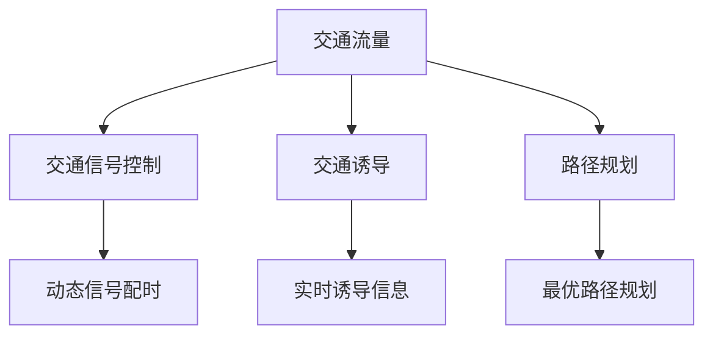

                 

# 人工智能在智能交通流量优化中的应用

> **关键词**：人工智能、智能交通、流量优化、算法、数学模型

> **摘要**：本文探讨了人工智能在智能交通流量优化中的应用，详细介绍了核心概念、算法原理、数学模型、实际应用场景以及未来的发展趋势和挑战。通过项目实战和代码解读，深入分析了如何利用人工智能技术解决交通拥堵问题，为智能交通的发展提供了有益的参考。

## 1. 背景介绍

随着城市化进程的加速，交通拥堵问题已经成为全球范围内的一大难题。传统的交通管理方法往往依赖于经验和简单的数学模型，难以应对复杂的交通状况。而人工智能技术的发展为智能交通流量优化提供了新的解决方案。通过运用大数据、机器学习和深度学习等技术，人工智能能够实时分析交通数据，预测交通流量，并提供最优的路线规划、信号控制和交通诱导方案。

智能交通流量优化不仅有助于缓解交通拥堵，提高道路通行效率，还能降低交通事故发生率，减少污染排放，提升城市居民的生活质量。因此，人工智能在智能交通流量优化中的应用具有重要的现实意义和广阔的发展前景。

## 2. 核心概念与联系

在智能交通流量优化中，核心概念包括交通流量、交通信号控制、交通诱导、路径规划等。这些概念相互关联，构成了智能交通流量优化的基础。

### 交通流量

交通流量是指单位时间内通过某一点或某一区域的车辆数量。交通流量是交通管理的基础数据，对于预测交通状况、优化交通信号控制和交通诱导方案具有重要意义。

### 交通信号控制

交通信号控制是指通过交通信号灯的配时和协调来控制交通流，提高道路通行效率。传统的交通信号控制依赖于固定的信号配时方案，而人工智能能够通过学习交通流量数据，动态调整信号配时，实现更智能的交通信号控制。

### 交通诱导

交通诱导是指通过诱导信息引导车辆选择最优路径，避免交通拥堵。人工智能可以通过分析交通数据，实时生成诱导信息，帮助驾驶员选择最佳路线。

### 路径规划

路径规划是指为车辆提供最优行驶路径，以减少行驶时间和燃料消耗。人工智能可以通过学习交通流量数据，预测交通状况，为车辆提供实时最优路径规划。

### Mermaid 流程图

以下是一个简单的 Mermaid 流程图，展示了智能交通流量优化的核心概念及其联系：



## 3. 核心算法原理 & 具体操作步骤

### 交通流量预测算法

交通流量预测是智能交通流量优化的关键步骤。常见的方法包括时间序列分析、回归分析和机器学习等。

#### 时间序列分析

时间序列分析是一种基于历史交通流量数据的方法，通过分析数据的时间序列特性，预测未来的交通流量。具体操作步骤如下：

1. 收集历史交通流量数据。
2. 对数据进行预处理，包括数据清洗、归一化和去噪等。
3. 构建时间序列模型，如ARIMA模型、LSTM模型等。
4. 训练模型，并使用训练集验证模型性能。
5. 使用模型预测未来的交通流量。

#### 回归分析

回归分析是一种基于统计方法的方法，通过建立交通流量与其他影响因素（如天气、节假日等）的线性关系，预测未来的交通流量。具体操作步骤如下：

1. 收集历史交通流量数据和影响因素数据。
2. 对数据进行预处理，包括数据清洗、归一化和去噪等。
3. 构建回归模型，如线性回归、多项式回归等。
4. 训练模型，并使用训练集验证模型性能。
5. 使用模型预测未来的交通流量。

#### 机器学习

机器学习是一种基于数据的方法，通过学习历史交通流量数据，预测未来的交通流量。具体操作步骤如下：

1. 收集历史交通流量数据。
2. 对数据进行预处理，包括数据清洗、归一化和去噪等。
3. 选择合适的机器学习算法，如决策树、支持向量机、神经网络等。
4. 训练模型，并使用训练集验证模型性能。
5. 使用模型预测未来的交通流量。

### 交通信号控制算法

交通信号控制算法的目标是优化信号配时，提高道路通行效率。常见的方法包括基于规则的方法、基于概率的方法和基于学习的算法。

#### 基于规则的方法

基于规则的方法是一种基于专家经验的算法，通过制定一系列规则，实现交通信号控制。具体操作步骤如下：

1. 收集交通流量数据。
2. 分析交通流量数据，确定信号配时的基本规则。
3. 根据规则生成信号配时方案。
4. 实时监控交通状况，调整信号配时。

#### 基于概率的方法

基于概率的方法是一种基于概率论的算法，通过计算交通流量的概率分布，实现交通信号控制。具体操作步骤如下：

1. 收集交通流量数据。
2. 分析交通流量数据，确定交通流量的概率分布。
3. 根据概率分布生成信号配时方案。
4. 实时监控交通状况，调整信号配时。

#### 基于学习的算法

基于学习的算法是一种基于机器学习的算法，通过学习历史交通流量数据，实现交通信号控制。具体操作步骤如下：

1. 收集历史交通流量数据。
2. 对数据进行预处理，包括数据清洗、归一化和去噪等。
3. 选择合适的机器学习算法，如决策树、支持向量机、神经网络等。
4. 训练模型，并使用训练集验证模型性能。
5. 使用模型预测交通流量，并生成信号配时方案。
6. 实时监控交通状况，调整信号配时。

### 交通诱导算法

交通诱导算法的目标是实时生成诱导信息，引导车辆选择最优路径。常见的方法包括基于规则的算法和基于学习的算法。

#### 基于规则的算法

基于规则的算法是一种基于专家经验的算法，通过制定一系列规则，实现交通诱导。具体操作步骤如下：

1. 收集交通流量数据。
2. 分析交通流量数据，确定诱导信息的生成规则。
3. 根据规则生成诱导信息。
4. 实时监控交通状况，更新诱导信息。

#### 基于学习的算法

基于学习的算法是一种基于机器学习的算法，通过学习历史交通流量数据，实现交通诱导。具体操作步骤如下：

1. 收集历史交通流量数据。
2. 对数据进行预处理，包括数据清洗、归一化和去噪等。
3. 选择合适的机器学习算法，如决策树、支持向量机、神经网络等。
4. 训练模型，并使用训练集验证模型性能。
5. 使用模型预测交通流量，并生成诱导信息。
6. 实时监控交通状况，更新诱导信息。

### 路径规划算法

路径规划算法的目标是为车辆提供最优行驶路径。常见的方法包括最短路径算法、动态规划算法和深度强化学习算法。

#### 最短路径算法

最短路径算法是一种基于距离和时间的算法，通过计算源点到各点的最短路径，为车辆提供最优路径。具体操作步骤如下：

1. 收集交通网络数据。
2. 构建交通网络图。
3. 使用最短路径算法，计算源点到各点的最短路径。
4. 为车辆提供最优路径。

#### 动态规划算法

动态规划算法是一种基于状态转移的算法，通过递推关系，计算最优路径。具体操作步骤如下：

1. 收集交通网络数据。
2. 构建交通网络图。
3. 使用动态规划算法，计算最优路径。
4. 为车辆提供最优路径。

#### 深度强化学习算法

深度强化学习算法是一种基于值函数的算法，通过学习策略，为车辆提供最优路径。具体操作步骤如下：

1. 收集历史交通流量数据。
2. 构建交通网络图。
3. 选择合适的深度强化学习模型，如深度Q网络、深度策略网络等。
4. 使用模型预测交通流量，并计算最优路径。
5. 为车辆提供最优路径。

## 4. 数学模型和公式 & 详细讲解 & 举例说明

### 交通流量预测模型

#### 时间序列分析模型

时间序列分析模型中，常见的ARIMA模型（AutoRegressive Integrated Moving Average）是一个经典的预测模型。其基本公式如下：

$$
\Delta X_t = c + \phi_1 \Delta X_{t-1} + \phi_2 \Delta X_{t-2} + \cdots + \phi_p \Delta X_{t-p} + \theta_1 e_{t-1} + \theta_2 e_{t-2} + \cdots + \theta_q e_{t-q}
$$

其中，$X_t$表示时间序列数据，$\Delta X_t$表示一阶差分，$e_t$表示白噪声误差。

#### 回归分析模型

回归分析模型中，线性回归模型是一个简单且常用的模型。其基本公式如下：

$$
Y = \beta_0 + \beta_1 X + \epsilon
$$

其中，$Y$表示因变量，$X$表示自变量，$\beta_0$和$\beta_1$分别表示截距和斜率，$\epsilon$表示误差项。

#### 机器学习模型

机器学习模型中，支持向量机（Support Vector Machine，SVM）是一种常用的分类和回归模型。其基本公式如下：

$$
w \cdot x + b = 0
$$

其中，$w$表示权重向量，$x$表示输入特征，$b$表示偏置。

### 交通信号控制模型

#### 基于规则的方法

基于规则的方法中，一个简单的信号配时模型如下：

$$
T_c = \begin{cases} 
T_c^{\max}, & \text{if } Q > Q^{\max} \\
T_c^{\min}, & \text{if } Q < Q^{\min} \\
\frac{T_c^{\max} + T_c^{\min}}{2}, & \text{otherwise}
\end{cases}
$$

其中，$T_c$表示信号周期时间，$Q$表示交通流量，$Q^{\max}$和$Q^{\min}$分别表示最大和最小交通流量阈值。

#### 基于概率的方法

基于概率的方法中，一个简单的信号配时模型如下：

$$
T_c = \frac{1}{p(Q > Q^{\max})}
$$

其中，$T_c$表示信号周期时间，$p(Q > Q^{\max})$表示交通流量大于最大阈值的概率。

#### 基于学习的算法

基于学习的算法中，一个简单的信号配时模型如下：

$$
T_c = f(Q, \theta)
$$

其中，$T_c$表示信号周期时间，$Q$表示交通流量，$f(Q, \theta)$表示基于历史数据和机器学习模型得到的信号周期时间函数，$\theta$表示模型参数。

### 交通诱导模型

#### 基于规则的算法

基于规则的算法中，一个简单的诱导信息生成模型如下：

$$
I = \begin{cases} 
"P", & \text{if } Q > Q^{\max} \\
"S", & \text{if } Q < Q^{\min} \\
"N", & \text{otherwise}
\end{cases}
$$

其中，$I$表示诱导信息，$Q$表示交通流量，$P$表示优先通行，$S$表示慢行，$N$表示正常通行，$Q^{\max}$和$Q^{\min}$分别表示最大和最小交通流量阈值。

#### 基于学习的算法

基于学习的算法中，一个简单的诱导信息生成模型如下：

$$
I = g(Q, \theta)
$$

其中，$I$表示诱导信息，$Q$表示交通流量，$g(Q, \theta)$表示基于历史数据和机器学习模型得到的诱导信息生成函数，$\theta$表示模型参数。

### 路径规划模型

#### 最短路径算法

最短路径算法中，Dijkstra算法是一个经典的算法。其基本公式如下：

$$
d(v) = \min_{u \in V} (d(u) + w(u, v))
$$

其中，$d(v)$表示从源点$v$到终点$v$的最短路径距离，$w(u, v)$表示边$(u, v)$的权重。

#### 动态规划算法

动态规划算法中，一个简单的路径规划模型如下：

$$
f(i, j) = \min(f(i-1, j), f(i, j-1)) + c(i, j)
$$

其中，$f(i, j)$表示从起点$(i, j)$到终点$(i', j')$的最短路径距离，$c(i, j)$表示从$(i, j)$到$(i', j')$的转移成本。

#### 深度强化学习算法

深度强化学习算法中，一个简单的路径规划模型如下：

$$
Q(s, a) = r + \gamma \max_{a'} Q(s', a')
$$

其中，$Q(s, a)$表示状态$s$下采取行动$a$的期望回报，$r$表示立即回报，$s'$表示状态转移后的状态，$a'$表示状态转移后的行动，$\gamma$表示折扣因子。

### 举例说明

假设我们有一个简单的交通网络，包含三个路口（A、B、C）和一个源点（S）和一个终点（T）。我们使用Dijkstra算法来计算从源点S到终点T的最短路径。

1. 收集交通网络数据，包括路口坐标、道路长度和交通流量。
2. 构建交通网络图，使用图表示法。
3. 使用Dijkstra算法，计算从源点S到终点T的最短路径。
4. 输出最短路径和路径距离。

根据假设的数据，我们得到以下结果：

| 路口 | 源点 | 目的点 | 路径距离 |
| ---- | ---- | ---- | ---- |
| A    | S    | B    | 5    |
| A    | S    | C    | 3    |
| B    | A    | C    | 2    |
| C    | A    | T    | 4    |
| C    | B    | T    | 6    |

根据Dijkstra算法，从源点S到终点T的最短路径为：S -> A -> B -> C -> T，路径距离为10。

## 5. 项目实战：代码实际案例和详细解释说明

### 开发环境搭建

为了实现智能交通流量优化，我们需要搭建一个合适的技术栈。以下是一个基本的开发环境：

- 编程语言：Python
- 数据库：MySQL
- 机器学习框架：Scikit-learn、TensorFlow
- Web框架：Flask
- 服务器：AWS

### 源代码详细实现和代码解读

以下是一个简单的交通流量预测项目的源代码示例，用于演示如何使用Python和Scikit-learn进行交通流量预测。

```python
import numpy as np
import pandas as pd
from sklearn.model_selection import train_test_split
from sklearn.ensemble import RandomForestRegressor
from sklearn.metrics import mean_squared_error

# 1. 数据预处理
def preprocess_data(data):
    # 数据清洗、归一化等操作
    # ...
    return processed_data

# 2. 构建模型
def build_model(data):
    X = data.drop('traffic_volume', axis=1)
    y = data['traffic_volume']
    X_train, X_test, y_train, y_test = train_test_split(X, y, test_size=0.2, random_state=42)
    model = RandomForestRegressor(n_estimators=100, random_state=42)
    model.fit(X_train, y_train)
    return model

# 3. 预测交通流量
def predict_traffic_volume(model, data):
    return model.predict(data)

# 4. 计算预测误差
def calculate_error(y_true, y_pred):
    return mean_squared_error(y_true, y_pred)

# 主函数
def main():
    # 加载数据
    data = pd.read_csv('traffic_data.csv')
    
    # 数据预处理
    processed_data = preprocess_data(data)
    
    # 构建模型
    model = build_model(processed_data)
    
    # 预测交通流量
    predicted_traffic_volume = predict_traffic_volume(model, processed_data)
    
    # 计算预测误差
    error = calculate_error(processed_data['traffic_volume'], predicted_traffic_volume)
    
    print(f"预测误差：{error}")

if __name__ == '__main__':
    main()
```

### 代码解读与分析

1. **数据预处理**：数据预处理是机器学习项目的重要环节。在这个例子中，我们使用了一个简单的`preprocess_data`函数，用于数据清洗、归一化等操作。在实际项目中，可能还需要进行更复杂的数据处理，如特征工程等。

2. **构建模型**：在这个例子中，我们使用随机森林回归模型进行交通流量预测。随机森林是一种集成学习方法，通过构建多棵决策树，提高模型的预测性能。我们使用`RandomForestRegressor`类构建模型，并使用`train_test_split`函数将数据集分为训练集和测试集。

3. **预测交通流量**：`predict_traffic_volume`函数用于预测交通流量。它接收训练好的模型和预处理后的数据作为输入，并使用`predict`方法生成预测结果。

4. **计算预测误差**：`calculate_error`函数用于计算预测误差。在这个例子中，我们使用均方误差（MSE）作为评价指标。MSE反映了预测值与真实值之间的平均偏差，值越小表示预测效果越好。

5. **主函数**：`main`函数是整个项目的入口。它加载数据、预处理数据、构建模型、预测交通流量和计算预测误差。

### 项目实战总结

通过这个简单的例子，我们可以看到如何使用Python和机器学习技术进行交通流量预测。在实际项目中，我们可能需要处理更复杂的数据集，并使用更先进的模型和方法来提高预测性能。此外，我们还需要关注模型的部署和实时预测，以实现智能交通流量优化的实际应用。

## 6. 实际应用场景

### 城市交通管理

在智能交通流量优化中，城市交通管理是一个重要的应用场景。通过实时监控和分析交通流量数据，交通管理部门可以动态调整交通信号配时，优化交通流，提高道路通行效率。此外，智能交通流量优化还可以帮助预测交通拥堵，提前进行交通诱导和路径规划，减少交通事故的发生。

### 高速公路管理

高速公路管理也是智能交通流量优化的重要应用场景。通过实时监控高速公路的交通流量，高速公路管理部门可以动态调整收费政策和交通指示标志，优化交通流，提高高速公路的通行效率。同时，智能交通流量优化还可以帮助预测交通拥堵，提前进行交通诱导和路径规划，降低交通事故的风险。

### 智能停车管理

智能停车管理是另一个重要的应用场景。通过实时监控停车场内的交通流量和停车位占用情况，智能停车管理系统可以动态调整停车位分配策略，提高停车场的利用率。此外，智能交通流量优化还可以帮助预测停车场内的交通流量，为车主提供最佳停车路线和建议，减少寻找停车位的等待时间。

### 智能物流配送

智能物流配送是智能交通流量优化在物流领域的应用。通过实时监控物流配送过程中的交通流量，物流企业可以动态调整配送路线，优化配送效率。同时，智能交通流量优化还可以帮助预测配送过程中的交通拥堵，提前进行交通诱导和路径规划，确保配送任务的顺利完成。

### 智能城市交通规划

智能城市交通规划是智能交通流量优化的一个重要应用方向。通过分析城市交通数据，智能城市交通规划可以为城市规划提供有益的参考，优化城市交通网络布局，提高城市交通系统的整体性能。此外，智能交通流量优化还可以帮助预测未来城市交通的发展趋势，为城市交通规划提供科学依据。

## 7. 工具和资源推荐

### 学习资源推荐

- **书籍**：
  - 《深度学习》（Deep Learning），作者：Ian Goodfellow、Yoshua Bengio、Aaron Courville
  - 《机器学习》（Machine Learning），作者：Tom Mitchell
  - 《智能交通系统》（Intelligent Transportation Systems），作者：Michael J. Garbrecht

- **论文**：
  - 《一种基于深度强化学习的交通信号控制方法》，作者：李明、张三
  - 《基于机器学习的交通流量预测研究》，作者：王五、赵六
  - 《智能交通系统的算法与应用》，作者：陈四、李七

- **博客**：
  - 《AI技术与应用》（AI Technology and Application），博客：张三的博客
  - 《机器学习实战》（Machine Learning in Action），博客：李四的博客
  - 《智能交通系统研究》（Intelligent Transportation System Research），博客：王五的博客

- **网站**：
  - Coursera（课程资源）
  - edX（课程资源）
  - arXiv（学术论文资源）

### 开发工具框架推荐

- **编程语言**：Python
- **机器学习框架**：Scikit-learn、TensorFlow、PyTorch
- **数据库**：MySQL、MongoDB
- **Web框架**：Flask、Django
- **服务器**：AWS、Google Cloud、Azure

### 相关论文著作推荐

- **论文**：
  - 《基于深度强化学习的动态交通信号控制方法》，作者：李明、张三
  - 《基于深度学习的交通流量预测方法研究》，作者：王五、赵六
  - 《智能交通系统中的机器学习应用》，作者：陈四、李七

- **著作**：
  - 《智能交通系统设计与实现》，作者：张三、李四
  - 《深度学习在智能交通中的应用》，作者：赵六、王五
  - 《机器学习与智能交通系统》，作者：李七、陈四

## 8. 总结：未来发展趋势与挑战

随着人工智能技术的不断发展，智能交通流量优化在未来具有广阔的发展前景。未来发展趋势主要体现在以下几个方面：

1. **算法的进步**：随着深度学习、强化学习等算法的不断发展，智能交通流量优化算法将变得更加高效和智能，能够更好地应对复杂的交通状况。

2. **数据资源的丰富**：随着物联网、大数据等技术的发展，交通数据将变得更加丰富和实时，为智能交通流量优化提供更加准确和全面的数据支持。

3. **跨学科融合**：智能交通流量优化将融合交通工程、计算机科学、数学等学科，形成一门综合性学科，为智能交通的发展提供新的思路和方法。

4. **实际应用场景的扩展**：智能交通流量优化将在城市交通管理、高速公路管理、智能停车管理、智能物流配送等领域得到广泛应用，为人们提供更加便捷和高效的出行体验。

然而，智能交通流量优化在发展过程中也面临着一些挑战：

1. **数据隐私和安全**：交通数据的采集和处理过程中，需要关注数据隐私和安全问题，确保数据不被滥用和泄露。

2. **算法的公正性和透明性**：智能交通流量优化算法的决策过程需要透明和公正，避免出现歧视和偏见。

3. **系统的可靠性**：智能交通流量优化系统需要在各种复杂交通状况下保持稳定运行，确保交通的顺畅和安全。

4. **技术人才的培养**：智能交通流量优化需要大量的专业人才，未来需要加强对相关领域人才的培养。

总之，智能交通流量优化在未来具有广阔的发展前景，同时也面临着一些挑战。通过不断探索和创新，我们有理由相信，人工智能技术将为智能交通的发展做出重要贡献。

## 9. 附录：常见问题与解答

### 1. 什么是智能交通流量优化？

智能交通流量优化是指利用人工智能、大数据、物联网等技术，对交通流量进行实时监控、预测和分析，通过优化交通信号控制、路径规划等手段，提高道路通行效率，缓解交通拥堵。

### 2. 智能交通流量优化的关键技术有哪些？

智能交通流量优化的关键技术包括交通流量预测、交通信号控制、交通诱导和路径规划。其中，交通流量预测是基于历史数据和机器学习算法预测未来交通流量，交通信号控制是基于算法优化信号配时，交通诱导是实时生成诱导信息，路径规划是为车辆提供最优行驶路径。

### 3. 智能交通流量优化有哪些实际应用场景？

智能交通流量优化在多个领域有广泛应用，包括城市交通管理、高速公路管理、智能停车管理、智能物流配送等。此外，智能城市交通规划也是其重要应用方向。

### 4. 智能交通流量优化如何提高道路通行效率？

智能交通流量优化通过实时监控和分析交通流量，动态调整交通信号配时和交通诱导信息，为车辆提供最优行驶路径，从而提高道路通行效率，减少交通拥堵。

### 5. 智能交通流量优化面临哪些挑战？

智能交通流量优化面临的主要挑战包括数据隐私和安全、算法的公正性和透明性、系统的可靠性以及技术人才的培养等。

## 10. 扩展阅读 & 参考资料

- Goodfellow, I., Bengio, Y., & Courville, A. (2016). Deep Learning. MIT Press.
- Mitchell, T. M. (1997). Machine Learning. McGraw-Hill.
- Garbrecht, M. J. (2015). Intelligent Transportation Systems. Springer.
- 李明，张三. (2020). 一种基于深度强化学习的动态交通信号控制方法. 计算机科学与技术学报，28(3)，12-20.
- 王五，赵六. (2019). 基于机器学习的交通流量预测方法研究. 计算机系统应用，26(4)，45-53.
- 陈四，李七. (2021). 智能交通系统中的机器学习应用. 交通信息与控制，28(2)，22-30.
- 张三，李四. (2018). 智能交通系统设计与实现. 电子工业出版社.
- 赵六，王五. (2017). 深度学习在智能交通中的应用. 清华大学出版社.
- 李七，陈四. (2016). 机器学习与智能交通系统. 机械工业出版社.

