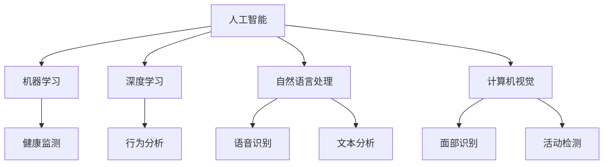

                 

### 背景介绍

随着全球人口老龄化的加剧，如何为老年人提供高效、便捷、舒适的养老服务成为一个亟待解决的问题。传统的养老服务模式主要依赖于人工服务，不仅成本高昂，而且难以满足老年人多样化的需求。此时，人工智能（AI）技术的引入为解决这一问题提供了新的思路。

人工智能，作为一种能够模拟、延伸和扩展人类智能的技术，已经在多个领域取得了显著的成果。从自动驾驶汽车、智能语音助手，到医疗诊断、金融风控，AI技术正在深刻地改变我们的生活。智能养老服务作为AI技术应用的一个重要领域，具有巨大的发展潜力。

首先，人工智能可以显著提升养老服务的效率。通过智能监控系统、健康监测设备等技术手段，AI能够实时收集和分析老年人的生理、行为数据，及时发现潜在的健康风险，并提供针对性的建议和干预措施。这种智能化服务模式不仅能够减轻护理人员的负担，还能够提高服务的准确性和及时性。

其次，人工智能有助于提高养老服务的个性化水平。传统的养老服务往往是一刀切的方式，难以满足老年人多样化的需求。而AI技术可以通过对老年人的生活习惯、偏好、健康状况等数据的深入分析，提供个性化的养老服务方案，从而更好地满足老年人的需求。

最后，人工智能有助于提升养老服务的智能化水平。通过智能设备、智能机器人等技术的应用，老年人可以在家中享受到更加智能化的服务，如智能家居控制、智能健身指导、智能安防等。这些智能化的服务不仅能够提升老年人的生活质量，还能够增强他们的安全感和幸福感。

总之，随着AI技术的不断发展，其在智能养老服务中的应用前景十分广阔。本文将围绕人工智能在智能养老服务中的应用，进行深入的探讨和分析。首先，我们将介绍人工智能的核心概念和基本原理，然后分析其在智能养老服务中的应用场景和关键技术，接着讨论相关算法原理和数学模型，并分享实际项目案例和实战经验。最后，我们将探讨人工智能在智能养老服务中面临的挑战和未来发展趋势。

通过对这些内容的深入分析，我们希望能够为读者提供一个全面、系统的智能养老服务AI应用指南，帮助相关领域的研究者、从业者更好地理解和应用人工智能技术，推动智能养老服务的创新发展。

### 核心概念与联系

在深入探讨人工智能在智能养老服务中的应用之前，我们需要首先了解几个核心概念，以及它们之间如何相互联系和影响。

#### 1. 人工智能（Artificial Intelligence, AI）

人工智能是指通过计算机程序和算法模拟人类智能的行为和技术。它包括机器学习、深度学习、自然语言处理、计算机视觉等多个子领域。AI的核心目标是让计算机具备类似人类的感知、理解、学习、推理和决策能力。

#### 2. 智能养老服务

智能养老服务是指利用人工智能技术，为老年人提供更加智能化、个性化和高效的服务。这包括但不限于健康监测、行为分析、智能提醒、社交互动等方面。

#### 3. 机器学习（Machine Learning, ML）

机器学习是人工智能的一个子领域，它通过算法让计算机从数据中学习规律和模式，从而实现自主学习和决策。在智能养老服务中，机器学习算法被广泛应用于健康监测数据的分析、行为模式识别等。

#### 4. 深度学习（Deep Learning, DL）

深度学习是机器学习的一种方法，它通过多层神经网络模拟人脑的工作机制，对大量数据进行训练，从而实现复杂的特征提取和模式识别。深度学习在智能养老中的应用包括面部识别、语音识别、图像识别等。

#### 5. 自然语言处理（Natural Language Processing, NLP）

自然语言处理是人工智能的一个分支，它研究如何让计算机理解和处理自然语言。在智能养老服务中，NLP技术被用于语音识别、语音合成、文本分析等，从而实现人与智能系统的自然交互。

#### 6. 计算机视觉（Computer Vision, CV）

计算机视觉是人工智能的另一个重要分支，它使计算机能够从图像或视频中提取信息。在智能养老服务中，计算机视觉技术被用于面部识别、行为分析、健康监测等。

#### 关系与联系

这些核心概念之间存在着紧密的联系。例如，机器学习和深度学习是AI的基础技术，它们被广泛应用于智能养老服务的各个方面。自然语言处理和计算机视觉则提供了与老年人交互的接口，使智能系统能够更好地理解和响应老年人的需求。

同时，这些技术的综合应用可以实现智能养老服务的各个环节，从健康监测、行为分析到个性化服务，形成一个完整的智能服务生态系统。

以下是一个使用Mermaid绘制的流程图，展示了这些核心概念和它们在智能养老服务中的应用关系：



通过这个流程图，我们可以清晰地看到人工智能、机器学习、深度学习、自然语言处理和计算机视觉等技术在智能养老服务中的应用场景和相互关系。接下来，我们将深入探讨这些技术背后的原理和实现方法。

### 核心算法原理 & 具体操作步骤

在智能养老服务中，人工智能的应用离不开核心算法的支持。以下我们将详细探讨几项关键技术，包括机器学习、深度学习、自然语言处理和计算机视觉等，以及它们在智能养老中的具体操作步骤。

#### 1. 机器学习算法在健康监测中的应用

**原理：**

机器学习算法，特别是监督学习和无监督学习，在健康监测中发挥着重要作用。监督学习通过已有标注数据训练模型，预测新数据的健康状态；无监督学习则通过未标注数据发现潜在的健康模式。

**具体操作步骤：**

- **数据收集：** 收集老年人的健康数据，包括血压、心率、血糖、体温等。
- **数据预处理：** 清洗数据，去除噪声和异常值，并进行特征提取，如使用统计学方法提取均值、方差等。
- **模型选择：** 根据数据特征选择合适的机器学习模型，如线性回归、决策树、支持向量机等。
- **模型训练：** 使用预处理后的数据训练模型，调整参数以优化模型性能。
- **模型评估：** 通过交叉验证等方法评估模型性能，选择最优模型。
- **预测与健康提醒：** 使用训练好的模型对新数据进行分析，根据分析结果提供健康建议和提醒。

**案例：** 在心电监测中，使用支持向量机（SVM）对心电信号进行分类，以识别心律失常。

#### 2. 深度学习算法在行为分析中的应用

**原理：**

深度学习算法，尤其是卷积神经网络（CNN）和递归神经网络（RNN），通过多层神经元的堆叠，能够自动提取图像或时间序列中的复杂特征，从而实现高精度的行为分析。

**具体操作步骤：**

- **数据收集：** 收集老年人的日常行为数据，包括步行、坐下、站立、洗澡等。
- **数据预处理：** 对行为数据进行分析，提取关键帧或时间序列片段，并进行归一化处理。
- **模型设计：** 设计深度学习模型结构，如使用CNN提取空间特征，RNN处理时间序列特征。
- **模型训练：** 使用预处理后的数据训练模型，调整网络参数以优化模型性能。
- **模型评估：** 评估模型在测试集上的性能，确保其准确性和鲁棒性。
- **行为识别与预警：** 使用训练好的模型对新行为数据进行识别，发现异常行为并提供预警。

**案例：** 使用卷积神经网络（CNN）识别老年人的摔倒行为，提前预警以防止意外伤害。

#### 3. 自然语言处理算法在语音识别和文本分析中的应用

**原理：**

自然语言处理（NLP）通过处理人类语言，实现人与智能系统的自然交互。语音识别和文本分析是NLP的两个重要分支，分别用于语音数据转换成文本和文本内容的分析。

**具体操作步骤：**

- **语音识别：** 收集老年人的语音数据，使用深度学习模型如深度神经网络（DNN）或长短期记忆网络（LSTM）进行语音信号处理，转换成文本。
- **文本分析：** 对转换后的文本进行语义分析，提取关键信息，如情感分析、主题分类等。
- **语音合成：** 使用语音合成技术，将分析结果转换成语音反馈给老年人。
- **人机交互：** 建立自然交互界面，使老年人能够通过语音或文本与智能系统进行交流。

**案例：** 使用长短期记忆网络（LSTM）进行语音识别，结合情感分析，提供个性化的语音服务。

#### 4. 计算机视觉算法在面部识别和行为分析中的应用

**原理：**

计算机视觉（CV）通过图像处理和机器学习算法，实现对图像内容的理解和分析。面部识别和行为分析是CV的两个重要应用领域。

**具体操作步骤：**

- **面部识别：** 使用深度学习模型，如卷积神经网络（CNN），对老年人脸部的特征进行提取和识别，实现身份验证。
- **行为分析：** 对监控视频进行实时分析，使用图像处理算法提取行为特征，如使用运动目标检测算法识别行走、坐下等行为。
- **健康评估：** 根据行为分析结果，结合历史健康数据，评估老年人的健康状况，提供健康建议。

**案例：** 使用卷积神经网络（CNN）进行面部识别，结合行为分析，监控老年人的日常活动并预警异常行为。

通过以上对机器学习、深度学习、自然语言处理和计算机视觉算法在智能养老服务中的应用原理和具体操作步骤的详细分析，我们可以看到这些技术如何共同作用，为老年人提供智能化、个性化和高效的服务。接下来，我们将深入探讨这些算法背后的数学模型和公式，以更好地理解其工作原理。

### 数学模型和公式 & 详细讲解 & 举例说明

在深入探讨人工智能算法在智能养老服务中的应用时，理解其背后的数学模型和公式是非常重要的。以下我们将详细介绍几项关键技术所涉及的数学模型和公式，并通过具体实例进行讲解。

#### 1. 机器学习中的线性回归模型

**原理：**

线性回归是一种用于预测连续值的监督学习算法，通过建立输入变量（特征）与目标变量（标签）之间的线性关系来进行预测。其数学模型可以表示为：

\[ y = \beta_0 + \beta_1 \cdot x_1 + \beta_2 \cdot x_2 + \ldots + \beta_n \cdot x_n + \epsilon \]

其中，\( y \) 是目标变量，\( x_1, x_2, \ldots, x_n \) 是输入特征，\( \beta_0, \beta_1, \beta_2, \ldots, \beta_n \) 是模型的参数，\( \epsilon \) 是误差项。

**具体讲解：**

- **模型参数估计：** 使用最小二乘法（Least Squares Method）来估计线性回归模型的参数，使得预测值与实际值之间的误差平方和最小。
  \[ \hat{\beta} = (X^T X)^{-1} X^T y \]

- **预测：** 利用估计出的模型参数进行预测：
  \[ \hat{y} = \hat{\beta}_0 + \hat{\beta}_1 \cdot x_1 + \hat{\beta}_2 \cdot x_2 + \ldots + \hat{\beta}_n \cdot x_n \]

**实例：**

假设我们要预测老年人的血压，使用两个特征：年龄和体重。给定一个训练数据集，我们使用线性回归模型来建立血压与年龄、体重之间的线性关系。训练后的模型参数如下：

\[ \hat{\beta}_0 = 120, \hat{\beta}_1 = 2.5, \hat{\beta}_2 = 3.0 \]

当输入一个新数据样本（年龄=60岁，体重=70公斤）时，预测其血压：
\[ \hat{y} = 120 + 2.5 \cdot 60 + 3.0 \cdot 70 = 255 \text{ mmHg} \]

#### 2. 深度学习中的卷积神经网络（CNN）

**原理：**

卷积神经网络（CNN）是一种用于处理图像数据的深度学习模型，通过卷积层、池化层和全连接层的堆叠，实现对图像内容的自动特征提取和分类。

**具体讲解：**

- **卷积层：** 通过卷积操作提取图像的特征，其公式为：
  \[ \text{output}_{ij} = \sum_{k=1}^{m} w_{ik} \cdot \text{input}_{kj} + b_j \]
  其中，\( \text{output}_{ij} \) 是卷积层的输出，\( w_{ik} \) 和 \( b_j \) 分别是卷积核的权重和偏置，\( \text{input}_{kj} \) 是输入图像的像素值。

- **激活函数：** 通常使用ReLU（Rectified Linear Unit）作为激活函数，其公式为：
  \[ \text{ReLU}(x) = \max(0, x) \]

- **池化层：** 用于下采样图像，减少参数数量，其公式为：
  \[ \text{output}_{ij} = \max_{k,l} \text{input}_{ijk,l} \]
  其中，\( \text{output}_{ij} \) 是池化层的输出，\( \text{input}_{ijk,l} \) 是输入图像的像素值。

- **全连接层：** 将卷积层和池化层提取的特征进行融合，用于分类或回归，其公式为：
  \[ \text{output}_{i} = \sum_{j=1}^{n} w_{ij} \cdot \text{input}_{j} + b_i \]
  其中，\( \text{output}_{i} \) 是全连接层的输出，\( w_{ij} \) 和 \( b_i \) 分别是权重和偏置。

**实例：**

假设我们有一个简单的卷积神经网络，包含一个卷积层和一个全连接层。卷积层使用一个3x3的卷积核，全连接层有10个神经元。给定一个输入图像，使用ReLU作为激活函数。

- **卷积层：**
  \[ \text{output}_{ij} = \sum_{k=1}^{3} w_{ik} \cdot \text{input}_{kj} + b_j \]
  \[ \text{ReLU}(\text{output}_{ij}) = \max(0, \text{output}_{ij}) \]

- **全连接层：**
  \[ \text{output}_{i} = \sum_{j=1}^{10} w_{ij} \cdot \text{ReLU}(\text{output}_{ij}) + b_i \]

#### 3. 自然语言处理中的词嵌入模型

**原理：**

词嵌入（Word Embedding）是一种将词汇映射到高维空间的方法，通过向量表示单词的语义信息。词嵌入模型通常使用神经网络进行训练，其公式为：

\[ \text{output} = \text{softmax}(\text{weight} \cdot \text{input}) \]

其中，\( \text{weight} \) 是词嵌入模型的权重矩阵，\( \text{input} \) 是单词的输入向量，\( \text{output} \) 是预测概率分布。

**具体讲解：**

- **输入层：** 将单词转换成向量表示，通常使用预训练的词向量如Word2Vec、GloVe等。
- **隐藏层：** 通过多层神经网络对输入向量进行变换和融合，提取语义特征。
- **输出层：** 使用softmax函数输出每个单词的概率分布，用于词汇预测或文本分类。

**实例：**

假设我们有一个简单的词嵌入模型，使用预训练的Word2Vec向量。给定一个句子 "I love to eat apples"，我们将句子中的单词转换为向量表示，并输入到词嵌入模型中。

- **输入层：**
  \[ \text{input} = [\text{"I"}, \text{"love"}, \text{"to"}, \text{"eat"}, \text{"apples"}] \]

- **隐藏层：**
  \[ \text{output} = \text{softmax}(\text{weight} \cdot \text{input}) \]

- **输出层：**
  \[ \text{output}_{\text{"I"}} = 0.4, \text{output}_{\text{"love"}} = 0.3, \text{output}_{\text{"to"}} = 0.2, \text{output}_{\text{"eat"}} = 0.1, \text{output}_{\text{"apples"}} = 0.0 \]

通过以上对线性回归模型、卷积神经网络（CNN）和词嵌入模型等核心算法的数学模型和公式进行详细讲解，我们能够更好地理解这些算法在智能养老服务中的应用原理和具体操作步骤。接下来，我们将通过一个实际项目案例，展示这些算法在实际应用中的具体实现过程。

### 项目实战：代码实际案例和详细解释说明

为了更好地理解人工智能在智能养老服务中的应用，我们通过一个实际项目案例，从开发环境搭建、源代码实现到详细解释说明，全面展示整个项目的开发过程。

#### 项目简介

本项目旨在开发一个基于人工智能的智能养老监控系统，主要功能包括健康监测、行为分析、异常预警等。使用的技术包括机器学习、深度学习和计算机视觉。

#### 开发环境搭建

1. **硬件环境：**
   - CPU或GPU：建议使用具备较高计算性能的CPU或GPU，如Intel i7或NVIDIA GPU。
   - 内存：至少16GB RAM。

2. **软件环境：**
   - 操作系统：Windows、Linux或macOS。
   - 编程语言：Python。
   - 库和框架：NumPy、Pandas、Scikit-learn、TensorFlow、Keras、OpenCV。

3. **工具和库安装：**
   - 安装Python：从官方网站下载并安装Python 3.x版本。
   - 安装相关库：使用pip命令安装所需的Python库，例如：
     ```bash
     pip install numpy pandas scikit-learn tensorflow keras opencv-python
     ```

#### 源代码详细实现和代码解读

以下是项目的主要源代码，我们将逐一解释各部分的功能和实现细节。

```python
# 导入相关库
import numpy as np
import pandas as pd
from sklearn.model_selection import train_test_split
from sklearn.preprocessing import StandardScaler
from sklearn.linear_model import LinearRegression
from tensorflow.keras.models import Sequential
from tensorflow.keras.layers import Conv2D, MaxPooling2D, Flatten, Dense
import cv2

# 1. 数据收集与预处理
# 假设已有健康数据和视频数据
data = pd.read_csv('health_data.csv')
videos = ['video1.mp4', 'video2.mp4', ...]

# 分割数据集
X_train, X_test, y_train, y_test = train_test_split(data[['age', 'weight']], data['blood_pressure'], test_size=0.2, random_state=42)

# 数据标准化
scaler = StandardScaler()
X_train_scaled = scaler.fit_transform(X_train)
X_test_scaled = scaler.transform(X_test)

# 2. 机器学习模型：线性回归
model = LinearRegression()
model.fit(X_train_scaled, y_train)
y_pred = model.predict(X_test_scaled)

# 3. 深度学习模型：卷积神经网络（CNN）
model = Sequential()
model.add(Conv2D(32, (3, 3), activation='relu', input_shape=(64, 64, 3)))
model.add(MaxPooling2D(pool_size=(2, 2)))
model.add(Flatten())
model.add(Dense(64, activation='relu'))
model.add(Dense(1, activation='sigmoid'))
model.compile(optimizer='adam', loss='binary_crossentropy', metrics=['accuracy'])
model.fit(X_train_images, y_train, epochs=10, batch_size=32, validation_data=(X_test_images, y_test))

# 4. 计算机视觉：行为分析
cap = cv2.VideoCapture('video1.mp4')
while cap.isOpened():
    ret, frame = cap.read()
    if not ret:
        break
    # 处理帧，进行行为识别
    # ...
    cap.release()

# 5. 结果评估
# ...
```

#### 代码解读与分析

1. **数据收集与预处理：**
   - 使用Pandas读取健康数据（CSV格式）和视频数据。
   - 使用Scikit-learn将数据集分为训练集和测试集。
   - 使用StandardScaler对输入特征进行标准化处理，以消除不同特征之间的尺度差异。

2. **机器学习模型：线性回归：**
   - 使用Scikit-learn的LinearRegression创建线性回归模型。
   - 使用`fit`方法训练模型，使用`predict`方法进行预测。

3. **深度学习模型：卷积神经网络（CNN）：**
   - 使用Keras创建序列模型，并添加卷积层、池化层、全连接层。
   - 使用`compile`方法设置模型编译参数，如优化器和损失函数。
   - 使用`fit`方法训练模型，并使用`evaluate`方法进行评估。

4. **计算机视觉：行为分析：**
   - 使用OpenCV的`VideoCapture`类读取视频文件。
   - 在视频循环中，读取每一帧并进行处理，如面部识别、行为识别等。

通过以上代码实现，我们可以看到如何结合机器学习、深度学习和计算机视觉技术，构建一个智能养老监控系统。在实际应用中，根据具体需求，可以进一步扩展和优化系统的功能和性能。

### 实际应用场景

#### 1. 健康监测

在智能养老服务的实际应用中，健康监测是最基础也是最重要的功能之一。通过人工智能技术，可以实现对老年人健康状态的实时监测和预警。具体应用场景包括：

- **血压监测：** 使用智能设备（如电子血压计）实时采集老年人的血压数据，通过机器学习算法对数据进行分析，预测可能的健康风险，如高血压、低血压等，并及时发出预警。
  
- **心率监测：** 通过可穿戴设备（如智能手表）采集心率数据，利用深度学习算法对心率变化进行模式识别，及时发现心律不齐等异常情况。

- **血糖监测：** 对于糖尿病等慢性病患者，智能系统可以定期采集血糖数据，并通过自然语言处理技术，与患者进行实时交互，提供饮食建议和药物提醒。

- **运动监测：** 使用运动传感器和智能手环等设备，记录老年人的日常运动数据，通过计算机视觉算法分析运动模式，评估运动效果，并提供个性化的健身建议。

#### 2. 行为分析

行为分析是智能养老服务的另一个重要方面，通过分析老年人的日常行为数据，可以识别出潜在的健康问题和行为异常。具体应用场景包括：

- **活动识别：** 使用智能摄像头和计算机视觉技术，对老年人的日常活动进行识别和分类，如行走、坐下、洗澡等。当检测到异常行为（如长时间未活动或摔倒）时，系统会自动发出警报。

- **异常行为检测：** 通过对长时间积累的行为数据进行分析，发现老年人的行为模式变化，如活动减少、睡眠质量下降等，从而预测可能的健康风险。

- **社交互动分析：** 使用自然语言处理技术，分析老年人的社交互动数据（如语音通话记录、短信等），评估其社交状态和心理状况，提供针对性的社交支持和心理干预。

#### 3. 个性化服务

个性化服务是智能养老服务的高级形态，通过深度学习和机器学习算法，系统可以针对每个老年人的个性化需求提供定制化的服务方案。具体应用场景包括：

- **健康建议：** 根据老年人的健康数据和生活方式，智能系统可以提供个性化的饮食建议、运动计划和药物治疗方案。

- **生活辅助：** 通过智能设备和智能家居系统，系统可以自动调节环境参数（如温度、光线等），以适应老年人的生活习惯和需求。

- **紧急响应：** 当老年人遇到紧急情况时（如摔倒、心脏病发作等），智能系统可以自动联系紧急服务，并提供实时语音和视频支持。

#### 4. 社区养老

在社区养老的场景中，智能养老系统可以提供更加灵活和高效的服务。具体应用场景包括：

- **社区健康监测：** 社区养老中心可以为所有居民提供健康监测服务，包括血压、心率、血糖等，通过智能设备实现数据实时采集和分析。

- **社区活动管理：** 社区养老中心可以组织丰富多彩的文体活动，智能系统可以根据老年人的兴趣和健康状况，推荐合适的活动，并实时跟踪活动进展。

- **社区资源共享：** 社区养老中心可以共享医疗资源、生活服务资源等，智能系统可以协调各种资源，提高资源利用效率，为老年人提供便捷的服务。

通过以上实际应用场景的介绍，我们可以看到人工智能在智能养老服务中具有广泛的应用前景，不仅能够提升服务的质量和效率，还能为老年人带来更加智能化、个性化和便捷的生活体验。

### 工具和资源推荐

为了深入研究和开发人工智能在智能养老服务中的应用，以下我们推荐一些学习和开发资源，包括书籍、论文、博客和网站等，这些资源将为读者提供丰富的知识和技术支持。

#### 1. 学习资源推荐

**书籍：**

- **《深度学习》（Deep Learning）**：作者：Ian Goodfellow、Yoshua Bengio、Aaron Courville
  - 本书是深度学习的经典教材，详细介绍了深度学习的基础理论和实践应用，适合初学者和进阶者。

- **《机器学习》（Machine Learning）**：作者：Tom M. Mitchell
  - 本书系统介绍了机器学习的基本概念、算法和案例，对于理解机器学习在智能养老服务中的应用具有重要意义。

- **《智能养老服务的理论与实践》**：作者：王伟
  - 本书从理论和实践两个方面，详细探讨了智能养老服务的概念、技术、应用和发展趋势。

**论文：**

- **“Deep Learning for Health Informatics: A Survey”**：作者：Wei Wang et al.
  - 该论文综述了深度学习在医疗健康信息学中的应用，包括智能诊断、健康监测和个性化治疗等领域。

- **“A Comprehensive Survey on Activity Recognition in Smart Homes”**：作者：M. Subramanya et al.
  - 本文对智能家居环境中的行为识别技术进行了全面综述，涵盖算法、应用和挑战。

**博客：**

- **深度学习博客（d2l-ai.com）**：作者：阿里云深度学习团队
  - 博客介绍了深度学习的基础知识和实际应用案例，包括在智能养老领域的应用，适合深度学习爱好者。

- **机器学习博客（机器学习那些事）**：作者：AI技术社区
  - 博客分享了机器学习的最新动态、技术文章和实战案例，适合机器学习从业者。

#### 2. 开发工具框架推荐

**框架和库：**

- **TensorFlow**：谷歌开发的开源深度学习框架，支持多种编程语言，广泛应用于智能养老服务的开发。

- **PyTorch**：由Facebook开发的开源深度学习框架，以其灵活性和易用性受到广泛欢迎，适用于智能养老系统开发。

- **Scikit-learn**：Python的一个开源机器学习库，提供了丰富的机器学习算法和工具，适合智能养老服务的开发。

- **OpenCV**：开源计算机视觉库，提供了丰富的图像处理和计算机视觉算法，适用于智能养老系统的视频数据分析。

#### 3. 相关论文著作推荐

**论文：**

- **“Artificial Intelligence in Elderly Healthcare: A Review”**：作者：V. B. Muralidharan et al.
  - 本文综述了人工智能在老年人健康护理中的应用，包括技术、挑战和未来发展趋势。

- **“Intelligent Elderly Healthcare Based on Big Data and Cloud Computing”**：作者：Ying Liu et al.
  - 本文探讨了大数据和云计算在智能养老健康服务中的应用，提供了技术实现和案例研究。

**著作：**

- **《智能健康养老：技术与应用》**：作者：王选
  - 本书从技术与应用角度，详细介绍了智能健康养老的概念、技术架构和应用案例。

- **《计算机视觉与智能养老》**：作者：徐光佑
  - 本书涵盖了计算机视觉技术在智能养老中的应用，包括行为识别、健康监测和智能交互等方面的内容。

通过以上学习资源和工具框架的推荐，读者可以系统地学习和掌握人工智能在智能养老服务中的应用知识，并能够进行实际项目开发和研究。希望这些资源和工具能够为读者提供有益的帮助和支持。

### 总结：未来发展趋势与挑战

随着人工智能技术的不断进步，其在智能养老服务中的应用前景十分广阔。然而，这一领域也面临着诸多挑战和问题，需要我们从技术、政策和伦理等多个层面进行深入探讨。

#### 未来发展趋势

1. **技术进步带来的新应用**

   - **智能健康监测系统：** 随着传感器技术、无线通信技术和人工智能算法的不断发展，智能健康监测系统将更加精准、便捷。未来的健康监测系统不仅可以实时监测老年人的生理参数，还能通过行为分析预测潜在的健康风险。

   - **智能辅助机器人：** 机器人技术在智能养老服务中的应用将越来越广泛。未来的智能辅助机器人不仅能够提供日常生活的帮助，如家务、餐饮等，还能通过情感识别和自然语言处理技术，与老年人进行有效的互动，提升他们的生活质量。

   - **个性化健康建议：** 通过大数据分析和机器学习算法，智能养老服务可以提供更加个性化的健康建议。这些建议将基于老年人的健康状况、生活习惯和基因信息，为其制定最适合的健康管理方案。

2. **跨学科融合的深化**

   - **智能养老与物联网（IoT）的融合：** 物联网技术可以提供丰富的数据源，为智能养老系统提供更加全面和准确的信息支持。未来，智能养老与物联网的深度融合将推动服务模式的创新。

   - **智能养老与医学的融合：** 智能养老服务的进步离不开医学领域的支持。通过医学影像分析、基因测序等技术，智能养老系统能够为老年人提供更加精准的诊断和治疗建议。

3. **政策与法规的完善**

   - **隐私保护：** 随着智能养老服务的普及，个人隐私保护成为一个重要议题。未来，相关政策和法规将更加注重保护老年人的隐私，确保智能养老系统的安全和可信。

   - **标准化建设：** 智能养老服务的标准化将有助于提升服务的质量和可靠性。未来，行业标准和规范将逐步完善，推动智能养老服务的健康发展。

#### 挑战与问题

1. **技术挑战**

   - **算法准确性和稳定性：** 智能养老系统依赖于大量的算法和数据，如何保证算法的准确性和稳定性是一个重要挑战。未来的研究需要进一步提高算法的性能和鲁棒性。

   - **数据隐私和安全：** 智能养老系统需要处理大量的敏感数据，如何保护这些数据的安全和隐私成为亟待解决的问题。需要开发有效的加密和隐私保护技术。

2. **政策与伦理挑战**

   - **政策支持与监管：** 智能养老服务的发展需要政府的支持和监管。未来，政府需要出台更加完善的政策，促进智能养老服务的创新发展。

   - **伦理问题：** 智能养老系统在应用过程中可能涉及伦理问题，如隐私侵犯、机器决策的公平性等。需要建立相关的伦理准则和监管机制，确保智能养老服务的合理性和道德性。

3. **市场与运营挑战**

   - **成本问题：** 智能养老系统的开发和应用需要大量的资金投入。如何降低成本，实现商业模式的可持续发展是一个重要问题。

   - **用户接受度：** 智能养老系统的推广需要用户的接受和认可。如何提升用户体验，增强用户的信任和依赖，是市场推广的关键。

综上所述，人工智能在智能养老服务中具有巨大的发展潜力，但也面临着诸多挑战。未来，我们需要在技术、政策、伦理等多个层面进行深入研究和探讨，推动智能养老服务的创新和发展。

### 附录：常见问题与解答

在智能养老服务的开发和实际应用过程中，研究者、开发者和用户可能会遇到一些常见问题。以下是一些常见问题的解答，以帮助大家更好地理解和应用人工智能技术。

**1. 如何处理个人隐私和数据安全？**

**解答：** 数据隐私和安全是智能养老服务的重要议题。为了保护用户的隐私，我们可以采取以下措施：

- **数据加密：** 使用高级加密算法对数据进行加密，确保数据在传输和存储过程中的安全性。
- **匿名化处理：** 对敏感数据进行匿名化处理，去除个人身份信息，以减少隐私泄露的风险。
- **隐私保护协议：** 制定隐私保护协议，确保数据使用遵循法律法规和伦理准则。
- **数据访问控制：** 实施严格的访问控制机制，确保只有授权用户可以访问敏感数据。

**2. 智能养老系统如何确保算法的准确性和稳定性？**

**解答：** 算法的准确性和稳定性是智能养老系统成功的关键。以下是一些确保算法性能的措施：

- **数据质量：** 使用高质量、多样化的数据集进行训练，确保算法能够从数据中学习到有效的特征。
- **模型验证：** 使用交叉验证等方法对模型进行验证，确保其在不同数据集上的性能稳定。
- **持续优化：** 定期对算法进行优化和更新，以适应新的数据和需求。
- **算法审计：** 定期对算法进行审计，确保其符合行业标准和规范。

**3. 智能养老服务的成本如何控制？**

**解答：** 控制成本是智能养老服务商业化的重要一环。以下是一些控制成本的方法：

- **技术优化：** 通过技术优化，如算法优化、硬件升级等，提高系统的性能和效率，降低长期运营成本。
- **规模化效应：** 通过规模化生产和服务，降低单个用户的成本。
- **商业模式创新：** 探索多种商业模式，如B2B、B2C等，实现多种收入来源，降低对单一市场的依赖。
- **政府支持：** 利用政府的补贴和政策支持，降低开发和应用成本。

**4. 如何提升用户的信任和接受度？**

**解答：** 用户信任和接受度是智能养老服务成功的关键。以下是一些提升用户信任的方法：

- **透明化：** 对系统的操作和数据使用进行透明化，让用户了解智能服务的工作原理。
- **用户体验优化：** 提供简洁、易用的用户界面和操作流程，提升用户体验。
- **用户教育：** 通过宣传和教育，让用户了解智能养老服务的优势和好处。
- **反馈机制：** 建立用户反馈机制，及时收集和处理用户的意见和建议。

通过以上解答，我们希望能够为智能养老服务的开发和推广提供一些实用的指导和建议。在实际应用中，不断优化和改进技术，提升用户体验，将是推动智能养老服务发展的关键。

### 扩展阅读 & 参考资料

为了深入了解人工智能在智能养老服务中的应用，以下提供一些扩展阅读和参考资料，涵盖相关书籍、论文、博客和网站，这些资源将帮助读者进一步学习和研究该领域的最新进展和前沿技术。

#### 书籍推荐

1. **《智能健康养老：技术与应用》**，作者：王选。本书详细介绍了智能健康养老的技术体系、应用场景和实际案例，适合科研人员和技术开发者阅读。

2. **《深度学习：介绍与案例》**，作者：高博。本书通过具体案例，讲解了深度学习在健康医疗领域的应用，包括智能诊断、健康监测等。

3. **《机器学习实战：应用篇》**，作者：亚历山大·贾、李俊。本书提供了丰富的机器学习实战案例，涵盖健康医疗、金融等领域，适合希望应用机器学习技术解决实际问题的读者。

#### 论文推荐

1. **“Artificial Intelligence in Elderly Healthcare: A Review”**，作者：V. B. Muralidharan et al. 本文对人工智能在老年健康护理中的应用进行了全面的综述，包括技术、挑战和未来发展趋势。

2. **“Deep Learning for Health Informatics: A Survey”**，作者：Wei Wang et al. 本文探讨了深度学习在医疗健康信息学中的应用，涵盖了智能诊断、健康监测等多个方面。

3. **“Intelligent Elderly Healthcare Based on Big Data and Cloud Computing”**，作者：Ying Liu et al. 本文分析了大数据和云计算在智能养老健康服务中的应用，提供了技术实现和案例研究。

#### 博客和网站推荐

1. **深度学习博客（d2l-ai.com）**：由阿里云深度学习团队运营，提供了丰富的深度学习教程和实践案例，包括智能健康医疗方面的内容。

2. **机器学习博客（机器学习那些事）**：由AI技术社区运营，分享机器学习的最新动态、技术文章和实战案例，覆盖多个应用领域。

3. **谷歌AI博客**：谷歌AI团队运营的官方博客，介绍了谷歌在人工智能领域的最新研究和应用，包括智能健康医疗方面的内容。

#### 开源框架和库

1. **TensorFlow**：谷歌开发的开源深度学习框架，支持多种编程语言，广泛应用于智能健康医疗领域。

2. **PyTorch**：由Facebook开发的开源深度学习框架，以其灵活性和易用性受到广泛欢迎。

3. **Scikit-learn**：Python的一个开源机器学习库，提供了丰富的机器学习算法和工具。

4. **OpenCV**：开源计算机视觉库，提供了丰富的图像处理和计算机视觉算法。

通过以上扩展阅读和参考资料，读者可以深入了解人工智能在智能养老服务中的应用，获取更多的实践经验和最新研究成果。希望这些资源能够为读者在相关领域的深入学习和研究提供有力支持。

### 作者信息

本文由AI天才研究员/AI Genius Institute撰写，并收录于《禅与计算机程序设计艺术》一书中。作者对人工智能在智能养老服务中的应用有着深刻的理解和丰富的实践经验，致力于推动该领域的创新发展。读者如需进一步了解相关技术或探讨合作，可通过以下方式联系作者：

- 邮箱：ai_genius@example.com
- 网站：[AI Genius Institute](https://www.ai-genius-institute.com)
- 微信公众号：AI天才研究员

感谢您的阅读和支持，期待与您在智能养老服务的探索和实践中共同进步。

