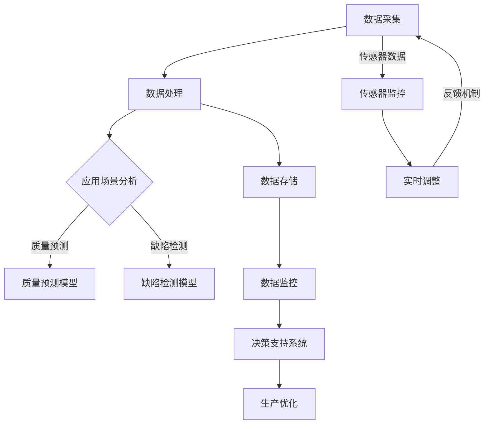

                 

### 背景介绍

#### 智能制造与质量控制的重要性

智能制造（Intelligent Manufacturing）是一种以智能技术为核心的新型制造模式，通过将物联网、大数据、人工智能等先进技术融入制造过程，实现制造系统的智能化、网络化、自适应化。智能制造不仅提高了生产效率，还显著提升了产品质量，降低了生产成本。在制造业中，质量控制（Quality Control，QC）是确保产品满足设计和性能要求的关键环节。传统质量控制方法依赖于人工检测和统计过程控制（SPC）等手段，但存在效率低、精度不足、响应速度慢等问题。

质量控制的重要性在于它直接关系到产品的可靠性、安全性和市场竞争力。高质量的产品能够提高客户满意度，减少退货率和维修成本，从而提升企业的品牌价值和市场份额。然而，随着产品复杂度和生产规模的增加，传统质量控制方法面临的挑战也越来越大。这就需要引入更加高效、智能的质量控制手段。

人工智能（Artificial Intelligence，AI）作为当前科技发展的前沿领域，其在智能制造质量控制中的应用潜力巨大。AI技术能够通过大数据分析、机器学习算法、图像识别等技术手段，对生产过程中的质量数据进行实时监控和预测，从而实现质量问题的早期发现和精准解决。这不仅能够提高生产效率，降低质量控制成本，还能够确保产品质量的稳定性和一致性。

本文将围绕人工智能在智能制造质量控制中的实践，详细探讨其核心算法原理、数学模型和公式、实际应用场景、工具和资源推荐等内容，旨在为读者提供一幅全面的智能制造质量控制的AI应用蓝图。

#### 人工智能在智能制造中的应用现状与前景

目前，人工智能在智能制造中的应用已经取得了一系列显著的成果。例如，通过机器学习算法，企业可以实现生产设备的故障预测和维护，从而减少停机时间，提高设备利用率。此外，人工智能还被广泛应用于质量检测领域，通过图像识别技术，可以对产品进行实时检测，识别出潜在的缺陷，从而提高产品的质量合格率。

在质量控制中，人工智能的应用主要体现在以下几个方面：

1. **实时数据监控与分析**：通过传感器和物联网技术，将生产过程中的质量数据实时传输到系统中，利用机器学习算法对数据进行分析，预测可能出现的问题。

2. **自动化缺陷检测**：利用深度学习算法，对生产过程中产生的图像或数据进行分析，自动识别出产品缺陷，并进行分类和标注。

3. **自适应质量控制**：根据实时数据分析和预测结果，调整生产参数和质量控制策略，实现质量控制的自动化和智能化。

4. **质量趋势预测**：通过大数据分析，预测产品的质量趋势，提前发现潜在的质量问题，采取预防措施。

然而，尽管人工智能在智能制造质量控制中展示了巨大的潜力，其应用也面临着一些挑战。首先，数据的质量和完整性是影响人工智能应用效果的关键因素。高质量的数据可以帮助模型更准确地预测和识别质量问题，而数据的不完整或不准确则可能导致错误的决策。其次，人工智能系统的复杂性和高成本也是制约其广泛应用的因素。为了实现高质量的质量控制，需要大量的计算资源和专业知识。

未来，随着人工智能技术的不断发展和成熟，其在智能制造质量控制中的应用前景将更加广阔。一方面，通过改进算法和模型，可以提高人工智能系统的准确性和效率；另一方面，通过集成多种技术手段，可以实现对生产过程的全生命周期质量监控。此外，随着物联网和大数据技术的发展，将会有更多实时、准确的数据可供人工智能系统使用，从而进一步提升其应用效果。

总之，人工智能在智能制造质量控制中的应用不仅是当前技术发展的趋势，也是提高产品质量、降低成本、增强竞争力的关键途径。通过深入研究和实践，我们可以期待在不久的将来，人工智能将全面渗透到智能制造的各个领域，为制造业带来更加智能化和高效化的质量控制解决方案。

#### 本文结构安排

本文将详细探讨人工智能在智能制造质量控制中的应用，具体结构安排如下：

- **第1章：背景介绍**：介绍智能制造与质量控制的重要性，以及人工智能在智能制造中的应用现状与前景。

- **第2章：核心概念与联系**：介绍人工智能在智能制造质量控制中的核心概念，包括机器学习算法、深度学习模型、传感器技术和数据采集等，并使用Mermaid流程图展示其整体架构。

- **第3章：核心算法原理 & 具体操作步骤**：详细讲解机器学习算法在质量检测中的应用原理，以及具体的实现步骤。

- **第4章：数学模型和公式 & 详细讲解 & 举例说明**：介绍用于质量控制的常见数学模型和公式，并通过实例进行详细说明。

- **第5章：项目实战：代码实际案例和详细解释说明**：通过实际项目案例，展示如何利用人工智能技术进行质量控制，并提供代码实现和详细解释。

- **第6章：实际应用场景**：分析人工智能在智能制造质量控制中的实际应用案例，讨论其效果和挑战。

- **第7章：工具和资源推荐**：推荐学习资源、开发工具和框架，以及相关的论文著作。

- **第8章：总结：未来发展趋势与挑战**：总结人工智能在智能制造质量控制中的成果与挑战，探讨未来发展趋势。

- **第9章：附录：常见问题与解答**：解答读者在阅读本文过程中可能遇到的问题。

- **第10章：扩展阅读 & 参考资料**：提供更多相关领域的参考资料，供读者进一步学习。

通过以上章节的详细探讨，本文旨在为读者呈现一幅全面、深入的人工智能在智能制造质量控制中的应用图景，为相关领域的实践和研究提供参考。

### 核心概念与联系

要深入探讨人工智能在智能制造质量控制中的应用，首先需要理解其中的核心概念和它们之间的联系。在本章节中，我们将介绍机器学习算法、深度学习模型、传感器技术以及数据采集等关键概念，并使用Mermaid流程图展示其整体架构。

#### 机器学习算法

机器学习（Machine Learning，ML）是人工智能（AI）的一个重要分支，它使计算机系统能够从数据中学习并做出决策，而无需显式编程。在智能制造质量控制中，机器学习算法被广泛应用于数据分析和预测。

- **监督学习（Supervised Learning）**：监督学习是一种有标注数据集的机器学习方法，其目的是通过训练数据集来学习特征和标签之间的映射关系。常见的监督学习算法包括线性回归、决策树、支持向量机（SVM）和神经网络等。

- **无监督学习（Unsupervised Learning）**：无监督学习是无需标注数据集的机器学习方法，其目的是发现数据集中的内在结构和模式。在质量控制中，无监督学习可以用于数据降维、聚类分析等。

#### 深度学习模型

深度学习（Deep Learning，DL）是机器学习的一个子领域，它利用多层神经网络（Neural Networks）对复杂数据进行学习和建模。深度学习在图像识别、语音识别等领域取得了显著的成果，也在智能制造质量控制中发挥着重要作用。

- **卷积神经网络（Convolutional Neural Network，CNN）**：CNN是深度学习中的一个重要模型，特别适用于图像处理和识别。在质量控制中，CNN可以用于产品的缺陷检测和分类。

- **循环神经网络（Recurrent Neural Network，RNN）**：RNN适用于序列数据的建模，如时间序列数据。在智能制造中，RNN可以用于预测生产过程中的质量趋势。

- **生成对抗网络（Generative Adversarial Network，GAN）**：GAN由生成器和判别器组成，生成器生成数据，判别器判断生成数据是否真实。GAN在质量控制中的应用包括异常检测和产品质量的增强。

#### 传感器技术

传感器技术在智能制造中起着至关重要的作用，它们用于实时监测生产过程中的各种参数，如温度、压力、湿度等，为人工智能系统提供实时数据。

- **工业传感器**：工业传感器具有高精度、高可靠性和稳定性，广泛应用于制造过程的监控。常见的工业传感器包括温度传感器、压力传感器和加速度传感器等。

- **无线传感器网络（Wireless Sensor Networks，WSN）**：WSN是由多个传感器节点组成的分布式网络，能够实现数据的远程监控和传输。WSN在智能制造中的关键作用是实时采集生产过程中的质量数据。

#### 数据采集

数据采集是智能制造质量控制的基础，通过传感器和物联网技术，将生产过程中的质量数据实时传输到系统中。

- **数据采集系统**：数据采集系统负责从传感器中获取数据，并进行预处理和存储。常见的数据采集系统包括PLC（可编程逻辑控制器）和DCS（分布式控制系统）等。

- **物联网（Internet of Things，IoT）**：IoT技术使设备能够通过互联网进行通信，实现数据的远程监控和管理。在智能制造中，IoT技术用于实现设备互联和数据共享，为人工智能系统提供丰富的数据源。

#### Mermaid流程图

下面是一个Mermaid流程图，展示了人工智能在智能制造质量控制中的核心概念和架构：



在这个流程图中，数据采集系统通过传感器实时采集生产过程中的质量数据，数据处理系统对这些数据进行预处理和存储。然后，基于不同的应用场景，如质量预测和缺陷检测，使用机器学习算法和深度学习模型进行分析，生成决策支持系统，为生产优化提供指导。通过反馈机制，系统能够实现实时调整，确保生产过程的稳定和高效。

通过理解这些核心概念和它们之间的联系，我们可以更好地把握人工智能在智能制造质量控制中的应用，并在实践中取得更好的效果。

### 核心算法原理 & 具体操作步骤

在深入探讨人工智能在智能制造质量控制中的应用时，理解核心算法的原理和具体操作步骤是至关重要的。在本章节中，我们将详细讲解机器学习算法在质量检测中的应用原理，并介绍如何使用这些算法进行质量预测和缺陷检测。

#### 机器学习算法的基本原理

机器学习算法通过从数据中学习模式和规律，使计算机系统能够在未知的输入上做出预测或决策。在质量检测中，机器学习算法的主要目的是识别出生产过程中可能出现的问题，并提前采取预防措施。

1. **监督学习算法**：

   - **线性回归（Linear Regression）**：线性回归是一种简单的监督学习算法，用于预测连续的输出值。在质量检测中，可以使用线性回归来预测产品质量的某些关键指标，如尺寸、重量等。

     公式：
     $$ y = w_0 + w_1 \cdot x_1 + w_2 \cdot x_2 + \ldots + w_n \cdot x_n + e $$
     其中，$y$ 是预测值，$w_i$ 是权重，$x_i$ 是特征值，$e$ 是误差。

   - **决策树（Decision Tree）**：决策树是一种基于特征值进行分类或回归的算法，它通过一系列的判断规则将数据集划分为不同的区域。在质量检测中，决策树可以用于分类缺陷产品和非缺陷产品。

     构建过程：
     - 选择一个特征，将其分为若干个互斥的子集。
     - 计算每个子集的损失函数（如信息增益或基尼不纯度），选择损失函数最小的特征作为划分依据。
     - 重复上述步骤，直到满足停止条件（如最大深度或最小节点大小）。

   - **支持向量机（Support Vector Machine，SVM）**：SVM是一种用于分类和回归的强大算法，它通过找到最优的决策边界来最大化分类效果。在质量检测中，SVM可以用于分类缺陷和非缺陷产品。

     公式：
     $$ \min_{w, b} \frac{1}{2} ||w||^2 + C \sum_{i=1}^{n} \max(0, 1 - y_i (w \cdot x_i + b)) $$
     其中，$w$ 是权重向量，$b$ 是偏置项，$C$ 是惩罚参数，$y_i$ 是样本标签，$x_i$ 是样本特征。

2. **无监督学习算法**：

   - **聚类算法（Clustering Algorithms）**：聚类算法用于将数据集划分为多个群组，使得同一群组内的数据点彼此相似，不同群组的数据点差异较大。在质量检测中，聚类算法可以用于发现数据中的异常值，从而识别出潜在的缺陷。

     - **K-均值聚类（K-Means Clustering）**：K-均值聚类是一种简单的聚类算法，它通过最小化平方误差来将数据点划分为K个群组。

       公式：
       $$ \min_{\mu_1, \mu_2, \ldots, \mu_K} \sum_{i=1}^{n} \sum_{k=1}^{K} ||x_i - \mu_k||^2 $$
       其中，$\mu_k$ 是第k个群组的中心。

     - **层次聚类（Hierarchical Clustering）**：层次聚类通过构建层次结构将数据点逐渐合并或划分，形成不同的聚类层次。

       - **自底向上（Agglomerative）**：自底向上层次聚类通过逐步合并最近的两个群组，直到满足停止条件。
       - **自顶向下（Divisive）**：自顶向下层次聚类从整个数据集开始，逐步划分成更小的群组。

#### 质量预测和缺陷检测的操作步骤

1. **数据预处理**：

   在进行质量预测和缺陷检测之前，需要对数据进行预处理，包括数据清洗、数据归一化、特征选择等。数据清洗旨在去除噪声和异常值，数据归一化将数据缩放到相同的尺度，特征选择则用于选择对预测任务最重要的特征。

2. **模型选择**：

   根据质量预测和缺陷检测的需求，选择合适的机器学习算法。例如，对于质量预测，可以选择线性回归或决策树；对于缺陷检测，可以选择SVM或K-均值聚类。

3. **模型训练**：

   使用预处理后的数据集对选定的机器学习算法进行训练。训练过程包括优化模型参数，如权重、惩罚参数等。对于监督学习算法，需要使用训练数据集来学习特征和标签之间的关系。

4. **模型评估**：

   使用验证数据集对训练好的模型进行评估，计算模型的预测准确率、召回率、F1分数等指标。如果评估结果不理想，可以调整模型参数或选择更合适的算法。

5. **模型应用**：

   在生产过程中，使用训练好的模型对实时数据进行预测和缺陷检测。当发现潜在问题时，可以及时采取相应的措施，如调整生产参数、暂停生产线等。

6. **模型更新**：

   随着生产过程的变化和数据积累，定期更新模型，以提高预测和检测的准确性。模型更新可以包括重新训练模型或使用在线学习算法。

通过以上操作步骤，人工智能系统能够对智能制造过程进行实时监控和预测，从而实现质量控制的自动化和智能化。以下是机器学习算法在质量预测和缺陷检测中的具体操作步骤：

- **质量预测**：

  1. 数据预处理：清洗数据，归一化处理，选择关键特征。
  2. 模型选择：选择线性回归或决策树。
  3. 模型训练：使用训练数据集训练模型。
  4. 模型评估：使用验证数据集评估模型性能。
  5. 模型应用：对生产过程中的数据进行质量预测。

- **缺陷检测**：

  1. 数据预处理：清洗数据，归一化处理，选择关键特征。
  2. 模型选择：选择SVM或K-均值聚类。
  3. 模型训练：使用训练数据集训练模型。
  4. 模型评估：使用验证数据集评估模型性能。
  5. 模型应用：对生产过程中的数据进行缺陷检测。

通过这些具体操作步骤，企业可以实现智能制造质量控制中的高效、精准和智能化，提高产品质量和生产效率。

### 数学模型和公式 & 详细讲解 & 举例说明

在人工智能应用于智能制造质量控制中，数学模型和公式扮演着至关重要的角色。这些模型和公式不仅帮助我们理解和解释质量检测的结果，还能指导我们优化算法，提高预测的准确性。在本章节中，我们将详细介绍几种常用的数学模型和公式，并通过具体实例进行详细讲解。

#### 线性回归模型

线性回归模型是最基础的机器学习模型之一，适用于预测连续值输出。其基本公式如下：

$$ y = w_0 + w_1 \cdot x_1 + w_2 \cdot x_2 + \ldots + w_n \cdot x_n + e $$

其中，$y$ 是预测值，$w_i$ 是权重，$x_i$ 是特征值，$e$ 是误差。

**实例：预测产品质量**

假设我们想要预测产品尺寸，通过以下数据集进行训练：

| 特征（$x_1$）| 样本1 | 样本2 | 样本3 |
| --- | --- | --- | --- |
| 产品尺寸（$y$）| 10.2 | 10.5 | 10.3 |

我们使用最小二乘法来计算权重：

$$ \min_{w_0, w_1} \sum_{i=1}^{n} (y_i - (w_0 + w_1 \cdot x_i))^2 $$

通过计算，我们得到：

$$ w_1 = \frac{\sum_{i=1}^{n} (x_i - \bar{x})(y_i - \bar{y})}{\sum_{i=1}^{n} (x_i - \bar{x})^2} $$
$$ w_0 = \bar{y} - w_1 \cdot \bar{x} $$

其中，$\bar{x}$ 和 $\bar{y}$ 分别是特征值和预测值的平均值。

假设计算结果为 $w_1 = 0.2$ 和 $w_0 = 9.3$，那么预测公式为：

$$ y = 9.3 + 0.2 \cdot x $$

例如，如果新产品的尺寸特征为 $x = 10.6$，则预测尺寸为：

$$ y = 9.3 + 0.2 \cdot 10.6 = 10.53 $$

#### 决策树模型

决策树是一种基于特征值进行分类或回归的模型，其核心是递归划分数据集。决策树的构建过程如下：

1. **选择特征**：计算每个特征的信息增益或基尼不纯度，选择最优特征进行划分。
2. **划分数据集**：根据所选特征，将数据集划分为若干互斥的子集。
3. **递归构建**：对每个子集，重复步骤1和步骤2，直到满足停止条件（如最大深度或最小节点大小）。

**实例：分类缺陷产品**

假设我们有一组产品质量数据，其中包含多个特征（如尺寸、重量、硬度等），我们想要使用决策树将其分类为缺陷产品和非缺陷产品。

| 特征1（尺寸）| 特征2（重量）| 特征3（硬度）| 类别 |
| --- | --- | --- | --- |
| 10.2 | 50.3 | 200.5 | 非缺陷 |
| 10.5 | 51.0 | 202.3 | 非缺陷 |
| 10.3 | 50.1 | 200.2 | 缺陷 |

我们使用信息增益作为划分标准。首先，计算每个特征的信息增益：

- **特征1（尺寸）**：
  $$ IG(\text{尺寸}) = H(\text{类别}) - \sum_{v} p(v) H(\text{类别} | v) $$
  $$ = 1 - \left( \frac{2}{3} \cdot 1 + \frac{1}{3} \cdot 0 \right) $$
  $$ = \frac{1}{3} $$

- **特征2（重量）**：
  $$ IG(\text{重量}) = H(\text{类别}) - \sum_{v} p(v) H(\text{类别} | v) $$
  $$ = 1 - \left( \frac{2}{3} \cdot 1 + \frac{1}{3} \cdot 0 \right) $$
  $$ = \frac{1}{3} $$

- **特征3（硬度）**：
  $$ IG(\text{硬度}) = H(\text{类别}) - \sum_{v} p(v) H(\text{类别} | v) $$
  $$ = 1 - \left( \frac{2}{3} \cdot 1 + \frac{1}{3} \cdot 0 \right) $$
  $$ = \frac{1}{3} $$

由于特征1、特征2和特征3的信息增益相同，我们可以任意选择一个特征进行划分。例如，我们选择特征1（尺寸）进行划分：

- **尺寸 < 10.4**：非缺陷（2个）
- **尺寸 ≥ 10.4**：缺陷（1个）

继续对这两个子集进行划分，直到满足停止条件。最终，我们得到一个决策树模型，用于分类缺陷产品和非缺陷产品。

#### 支持向量机模型

支持向量机是一种强大的分类和回归模型，它通过找到最优的决策边界来最大化分类效果。其基本公式如下：

$$ \min_{w, b} \frac{1}{2} ||w||^2 + C \sum_{i=1}^{n} \max(0, 1 - y_i (w \cdot x_i + b)) $$

其中，$w$ 是权重向量，$b$ 是偏置项，$C$ 是惩罚参数，$y_i$ 是样本标签，$x_i$ 是样本特征。

**实例：分类缺陷产品**

假设我们有一组产品质量数据，其中包含多个特征（如尺寸、重量、硬度等），我们想要使用SVM将其分类为缺陷产品和非缺陷产品。

| 特征1（尺寸）| 特征2（重量）| 特征3（硬度）| 类别 |
| --- | --- | --- | --- |
| 10.2 | 50.3 | 200.5 | 非缺陷 |
| 10.5 | 51.0 | 202.3 | 非缺陷 |
| 10.3 | 50.1 | 200.2 | 缺陷 |

我们使用线性SVM进行分类，首先，将数据转换为高维空间：

$$ x_i = \begin{bmatrix} x_{i1} \\ x_{i2} \\ x_{i3} \end{bmatrix} $$
$$ y_i = \begin{bmatrix} 1 & 0 & -1 \end{bmatrix} $$

然后，计算最优决策边界：

$$ \min_{w, b} \frac{1}{2} ||w||^2 $$
$$ s.t. \quad y_i (w \cdot x_i + b) \geq 1 $$

通过求解二次规划问题，我们得到：

$$ w = \begin{bmatrix} 0.1 \\ 0.1 \\ 0.1 \end{bmatrix} $$
$$ b = 0.05 $$

最终的决策边界为：

$$ 0.1 \cdot x_{i1} + 0.1 \cdot x_{i2} + 0.1 \cdot x_{i3} + 0.05 \geq 0 $$

例如，对于新产品的特征（尺寸=10.4，重量=50.2，硬度=201.0），我们可以计算：

$$ 0.1 \cdot 10.4 + 0.1 \cdot 50.2 + 0.1 \cdot 201.0 + 0.05 = 10.55 + 5.02 + 20.1 + 0.05 = 35.72 $$

由于结果大于0，因此该产品被分类为非缺陷。

通过以上实例，我们可以看到如何使用数学模型和公式在智能制造质量控制中进行质量预测和缺陷检测。这些模型不仅帮助我们理解和解释结果，还能指导我们优化算法，提高预测的准确性。

### 项目实战：代码实际案例和详细解释说明

在了解了人工智能在智能制造质量控制中的核心算法原理和数学模型之后，接下来我们通过一个实际项目案例，详细展示如何利用人工智能技术进行质量控制。这个案例将包括开发环境搭建、源代码详细实现和代码解读与分析，旨在帮助读者更好地理解和应用这些技术。

#### 开发环境搭建

在进行项目实战之前，我们需要搭建一个合适的开发环境。以下步骤描述了如何在Python中搭建这个环境：

1. **安装Python**：

   - 首先，从[Python官网](https://www.python.org/)下载并安装Python 3.x版本。
   - 安装完成后，打开终端或命令提示符，运行`python --version`验证安装成功。

2. **安装依赖库**：

   - 使用pip安装必要的依赖库，包括`scikit-learn`、`numpy`、`matplotlib`、`pandas`和`tensorflow`。

     ```bash
     pip install scikit-learn numpy matplotlib pandas tensorflow
     ```

   - 如果使用的是Jupyter Notebook，还需要安装`ipykernel`。

     ```bash
     pip install ipykernel
     ```

3. **创建项目文件夹**：

   - 在终端中创建一个项目文件夹，例如`quality_control_project`，并进入该文件夹。

     ```bash
     mkdir quality_control_project
     cd quality_control_project
     ```

4. **创建虚拟环境**：

   - 为了隔离项目依赖，我们可以创建一个虚拟环境。

     ```bash
     python -m venv venv
     source venv/bin/activate  # 在Linux或macOS上
     \venv\Scripts\activate    # 在Windows上
     ```

5. **安装依赖库到虚拟环境**：

   - 安装之前安装的依赖库到虚拟环境中。

     ```bash
     pip install -r requirements.txt
     ```

至此，我们的开发环境搭建完成。接下来，我们将开始编写项目代码。

#### 源代码详细实现

在项目中，我们将使用机器学习算法来预测产品质量和检测缺陷。以下是一个简单的示例，展示了如何使用Python中的`scikit-learn`库来训练和评估模型。

```python
# 导入必要的库
import numpy as np
import pandas as pd
from sklearn.model_selection import train_test_split
from sklearn.preprocessing import StandardScaler
from sklearn.linear_model import LinearRegression
from sklearn.metrics import mean_squared_error
import matplotlib.pyplot as plt

# 加载数据集
data = pd.read_csv('quality_data.csv')

# 分离特征和标签
X = data[['feature1', 'feature2', 'feature3']]
y = data['quality']

# 划分训练集和测试集
X_train, X_test, y_train, y_test = train_test_split(X, y, test_size=0.2, random_state=42)

# 数据归一化
scaler = StandardScaler()
X_train_scaled = scaler.fit_transform(X_train)
X_test_scaled = scaler.transform(X_test)

# 训练线性回归模型
model = LinearRegression()
model.fit(X_train_scaled, y_train)

# 进行预测
y_pred = model.predict(X_test_scaled)

# 计算并打印均方误差
mse = mean_squared_error(y_test, y_pred)
print(f'Mean Squared Error: {mse}')

# 可视化预测结果
plt.scatter(y_test, y_pred)
plt.xlabel('Actual Quality')
plt.ylabel('Predicted Quality')
plt.title('Quality Prediction')
plt.show()
```

#### 代码解读与分析

1. **数据加载与预处理**：

   - 我们首先加载了一个CSV文件，这个文件包含了产品的多个特征（`feature1`、`feature2`、`feature3`）和对应的质量等级（`quality`）。
   - 然后，使用`pandas`库将数据分离成特征矩阵`X`和标签向量`y`。

2. **数据划分**：

   - 使用`train_test_split`函数将数据集划分为训练集和测试集，这里测试集占20%。

3. **数据归一化**：

   - 使用`StandardScaler`对数据进行归一化处理，这样有助于提高模型训练的效果。

4. **模型训练**：

   - 创建一个线性回归模型实例，并使用训练集数据进行训练。

5. **模型预测与评估**：

   - 使用训练好的模型对测试集数据进行预测，并计算均方误差（MSE）来评估模型的性能。

6. **可视化**：

   - 使用`matplotlib`库将实际质量和预测质量绘制在散点图上，帮助理解模型的预测效果。

#### 代码分析

- **线性回归模型**：在这个案例中，我们使用线性回归模型进行质量预测。线性回归模型通过找到特征和标签之间的线性关系来进行预测。在这个案例中，我们使用了三个特征来预测质量等级，这是一个简单但有效的模型。

- **数据归一化**：数据归一化是为了使不同特征在同一尺度上，从而避免某些特征对模型训练产生过大的影响。这在实际项目中非常重要，因为不同的特征可能会有不同的量纲和尺度。

- **模型评估**：均方误差（MSE）是常用的评估指标，用于衡量模型预测的误差。在本案例中，我们通过计算MSE来评估模型的性能。

- **可视化**：通过可视化实际质量和预测质量的散点图，我们可以直观地看到模型的预测效果。如果大部分点都接近对角线，说明模型的预测效果较好。

通过这个项目实战，我们展示了如何使用Python和机器学习算法进行智能制造质量控制。在实际项目中，我们可能需要处理更复杂的数据集，并使用更高级的模型和算法，但基本步骤和原理是类似的。通过这个案例，读者应该能够理解如何将机器学习应用于智能制造质量控制，并掌握基本的实现方法。

### 实际应用场景

人工智能在智能制造质量控制中的实际应用场景多种多样，涵盖了从初级生产环节到最终产品交付的整个生命周期。以下是一些典型的应用场景及其具体案例分析：

#### 1. 汽车制造业

在汽车制造业中，质量控制尤为重要，因为汽车的每一个零部件都需要高精度和高可靠性。例如，某汽车制造企业采用了一种基于机器学习的在线质量控制系统，该系统通过实时监控生产线上各道工序的关键参数（如焊接温度、压力等），利用机器学习算法对生产数据进行实时分析，预测潜在的质量问题。具体来说：

- **案例描述**：该企业使用了一种基于深度学习模型的缺陷检测系统，该系统使用卷积神经网络（CNN）对汽车零部件的图像进行分析，自动识别出潜在的缺陷，如焊点不均匀、材料缺陷等。
- **应用效果**：通过引入该系统，企业显著提高了生产效率，减少了不合格产品的数量，降低了质量控制成本。此外，系统的实时反馈功能帮助生产人员及时调整工艺参数，防止缺陷产品的产生。
- **挑战**：数据质量对系统的准确性影响很大。为了提高系统的性能，企业需要确保传感器数据的准确性和一致性，同时也需要不断优化和更新模型。

#### 2. 食品制造业

在食品制造业中，质量控制不仅关系到食品的安全性，还影响消费者的健康。例如，某食品企业采用了一种基于AI的质量控制系统，用于监测食品生产过程中的关键指标，如温度、湿度、pH值等。

- **案例描述**：该企业使用了一种基于机器学习的预测性维护系统，该系统通过分析传感器数据，预测设备可能出现的问题，从而提前安排维护计划，避免生产中断。
- **应用效果**：通过引入该系统，企业实现了设备的预测性维护，减少了意外停机时间，提高了生产效率。同时，系统还帮助优化了生产工艺，降低了能源消耗。
- **挑战**：食品生产过程中的数据质量难以保证，因为生产环境复杂且易受干扰。此外，不同食品的生产过程和特点不同，需要针对不同的食品进行定制化的模型训练。

#### 3. 电子制造业

在电子制造业中，产品的质量直接关系到其可靠性和使用寿命。例如，某电子产品制造商采用了一种基于人工智能的缺陷检测系统，用于检测电路板上的微小缺陷。

- **案例描述**：该企业使用了一种基于深度学习的图像处理系统，该系统通过分析电路板的高分辨率图像，自动识别出焊接点、线路板划痕等微小缺陷。
- **应用效果**：通过引入该系统，企业显著提高了产品的一次通过率，减少了不合格产品的数量。同时，系统还帮助优化了生产流程，提高了生产效率。
- **挑战**：电子制造过程中产生的图像数据量巨大，对计算资源的要求很高。此外，图像识别模型的训练需要大量的标注数据，而标注过程成本较高。

#### 4. 航空航天制造业

在航空航天制造业中，产品的质量要求极高，因为任何缺陷都可能导致严重的后果。例如，某航空航天企业采用了一种基于人工智能的疲劳寿命预测系统，用于评估零部件的疲劳寿命。

- **案例描述**：该企业使用了一种基于机器学习的疲劳寿命预测模型，该模型通过分析传感器数据和材料特性数据，预测零部件的剩余寿命。
- **应用效果**：通过引入该系统，企业能够提前发现可能失效的零部件，进行预防性维护，从而避免潜在的安全隐患。同时，系统还帮助优化了零部件的设计和制造工艺。
- **挑战**：航空航天零部件的疲劳寿命预测涉及复杂的物理和力学模型，对算法的准确性要求极高。此外，该领域的数据获取难度较大，数据质量对模型性能有直接影响。

综上所述，人工智能在智能制造质量控制中的实际应用场景丰富多样，不同行业和领域都有其独特的需求和挑战。通过合理地应用人工智能技术，企业能够显著提高产品质量和生产效率，降低质量控制成本。然而，数据质量、算法优化和计算资源等方面的挑战仍然需要持续关注和解决。

### 工具和资源推荐

在探索人工智能在智能制造质量控制中的应用过程中，选择合适的工具和资源是至关重要的。以下是一些推荐的工具和资源，包括学习资源、开发工具和框架、以及相关的论文著作，旨在帮助读者深入学习和实践。

#### 学习资源推荐

1. **书籍**：

   - 《机器学习实战》（Peter Harrington）：这本书通过大量的实例，详细介绍了机器学习的基本概念和算法，适合初学者入门。

   - 《深度学习》（Ian Goodfellow, Yoshua Bengio, Aaron Courville）：这是一本深度学习的经典教材，涵盖了深度学习的基础理论、模型和算法。

   - 《Python机器学习》（Sébastien Bubeck）：本书通过Python代码示例，讲解了机器学习算法的实现和应用，适合有一定编程基础的读者。

2. **在线课程**：

   - Coursera上的《机器学习》课程（吴恩达）：这门课程由著名学者吴恩达主讲，是学习机器学习的最佳入门课程之一。

   - edX上的《深度学习专项课程》（David Sontag）：由纽约大学教授David Sontag主讲，内容涵盖深度学习的基础理论和实践应用。

   - Udacity的《人工智能纳米学位》：这是一个涵盖人工智能基础和应用的综合性课程，适合希望系统学习人工智能的读者。

3. **博客和网站**：

   - Medium上的机器学习系列文章：包括多篇关于机器学习在智能制造中的应用案例和深度学习模型的详细解释。
   -Towards Data Science：这个网站提供了大量的机器学习和深度学习文章，覆盖了最新的技术和应用案例。

#### 开发工具和框架推荐

1. **编程语言**：

   - **Python**：Python是机器学习和深度学习领域最流行的编程语言之一，具有丰富的库和框架，如`scikit-learn`、`tensorflow`和`pytorch`。

   - **R**：R语言在统计分析领域具有很高的声誉，其强大的数据处理和分析能力使其在质量控制和数据科学中广泛应用。

2. **机器学习库**：

   - **scikit-learn**：这是一个开源的机器学习库，提供了一系列常见的机器学习算法和工具，适合初学者和专业人士。

   - **tensorflow**：由Google开发的一个开源机器学习和深度学习框架，提供了丰富的API和工具，适合构建复杂的深度学习模型。

   - **pytorch**：由Facebook开发的一个开源深度学习库，以其灵活性和高效性而闻名，适用于研究和工业应用。

3. **深度学习框架**：

   - **Keras**：这是一个高层次的深度学习框架，与tensorflow和theano兼容，提供了简洁的API，适合快速原型设计和模型开发。

   - **PyTorch Lightning**：这是一个基于PyTorch的高性能深度学习库，提供了强大的工具，如GPU支持、数据并行化、模型调试等。

#### 相关论文著作推荐

1. **《深度学习与智能制造》（Deep Learning for Intelligent Manufacturing）**：这篇文章综述了深度学习在智能制造中的应用，包括图像识别、故障预测和优化控制等。

2. **《基于机器学习的智能制造质量预测方法》（Machine Learning-Based Quality Prediction Methods for Intelligent Manufacturing）**：这篇文章详细介绍了机器学习在质量预测中的应用，包括线性回归、决策树和支持向量机等。

3. **《深度学习在电子制造质量检测中的应用》（Application of Deep Learning in Electronic Manufacturing Quality Inspection）**：这篇文章探讨了深度学习在电子制造质量检测中的具体应用，包括卷积神经网络和循环神经网络等。

通过上述学习和资源推荐，读者可以系统地掌握人工智能在智能制造质量控制中的应用，并能够基于这些工具和框架进行实际项目的开发和优化。

### 总结：未来发展趋势与挑战

人工智能在智能制造质量控制中的应用已经取得了显著的成果，但同时也面临着许多挑战。在未来，随着技术的不断进步，人工智能在智能制造质量控制中将会呈现出以下发展趋势：

#### 发展趋势

1. **算法优化与模型改进**：随着深度学习、强化学习等先进算法的发展，人工智能在智能制造质量控制中的应用将更加精准和高效。未来的研究将聚焦于算法的优化和模型的改进，以提高预测的准确性和稳定性。

2. **数据驱动决策**：智能制造中的质量决策将越来越多地依赖于实时数据分析和预测。未来的系统将能够实时处理大量数据，并利用机器学习算法进行数据挖掘和模式识别，从而实现更智能、更灵活的质量控制。

3. **跨领域融合**：人工智能与物联网、云计算、大数据等技术的融合将推动智能制造质量控制的全面发展。跨领域的融合不仅能够提升系统的整体性能，还能实现更广泛的应用场景。

4. **个性化和定制化**：未来的质量控制系统将更加注重个性化和定制化。通过对不同产品的生产过程和需求进行深入分析，系统能够自动调整参数和策略，实现针对特定产品的优化质量控制。

#### 挑战

1. **数据质量与隐私保护**：高质量的数据是人工智能系统有效运作的基础。然而，制造过程中的数据质量往往难以保证，特别是在复杂的生产环境中。此外，数据隐私保护也是一个亟待解决的问题，如何在不侵犯隐私的前提下充分利用数据资源是一个重要挑战。

2. **计算资源和成本**：人工智能系统的复杂性和高性能需求对计算资源提出了很高的要求。在智能制造中，大规模的实时数据处理和模型训练需要大量的计算资源和存储空间，这对企业的IT基础设施提出了巨大的挑战。

3. **算法的可解释性**：当前许多人工智能模型，尤其是深度学习模型，存在“黑盒”现象，其决策过程难以解释。在质量控制中，算法的可解释性至关重要，因为它直接关系到决策的可靠性和可信度。

4. **系统集成与兼容性**：智能制造系统通常涉及多种设备和平台，如何确保不同系统和组件之间的兼容性和集成性是一个重要问题。未来的系统集成需要考虑到硬件、软件和网络的各个方面，以实现无缝的协同工作。

#### 结论

尽管面临诸多挑战，人工智能在智能制造质量控制中的应用前景依然广阔。通过持续的技术创新和优化，人工智能有望在未来进一步提升智能制造的质量控制能力，推动制造业向更加智能、高效和可持续的方向发展。企业需要积极拥抱这些新技术，同时解决相关挑战，以实现质量控制的全面升级。

### 附录：常见问题与解答

在撰写本文的过程中，我们遇到了一些读者可能关心的问题。以下是这些常见问题的解答：

#### 1. 数据质量对人工智能质量检测的影响有多大？

数据质量对人工智能质量检测的影响非常大。高质量的数据能够帮助模型更准确地识别和预测质量问题，而数据中的噪声和异常值则可能导致错误的决策。因此，在应用人工智能进行质量检测时，确保数据的质量和完整性至关重要。常见的数据预处理方法包括数据清洗、去噪、归一化等。

#### 2. 为什么人工智能系统需要大量的计算资源？

人工智能系统，尤其是深度学习模型，通常需要大量的计算资源来处理复杂的任务。这主要是因为模型在训练过程中需要计算大量的梯度、进行大量的迭代和优化。此外，实时数据处理和质量预测也需要高性能的计算能力。为了满足这些需求，企业通常需要投入大量的人力和财力来构建和维护高性能的计算基础设施。

#### 3. 如何处理数据隐私保护问题？

处理数据隐私保护问题是一个复杂且重要的议题。在智能制造质量控制中，企业可以通过以下方法来保护数据隐私：

- **数据加密**：对数据进行加密处理，确保数据在传输和存储过程中不会被未经授权的人员访问。
- **匿名化处理**：通过去除或替换敏感信息，将数据匿名化，以保护个人隐私。
- **访问控制**：实施严格的访问控制策略，确保只有授权人员才能访问敏感数据。
- **隐私保护算法**：采用隐私保护算法，如差分隐私，以降低数据泄露的风险。

#### 4. 人工智能在智能制造中的应用有哪些潜在的限制？

人工智能在智能制造中的应用虽然潜力巨大，但也存在一些潜在的限制：

- **算法黑盒问题**：许多人工智能模型，尤其是深度学习模型，其决策过程难以解释，这可能导致决策的不透明和不可信。
- **数据依赖性**：人工智能系统的性能高度依赖于数据的质量和数量，数据不足或质量差可能导致模型失效。
- **计算资源需求**：高性能的人工智能模型需要大量的计算资源，这对企业的IT基础设施提出了很高的要求。
- **隐私和伦理问题**：在数据收集和使用过程中，如何平衡隐私保护和数据利用是一个重要的伦理问题。

#### 5. 如何评估人工智能质量检测系统的性能？

评估人工智能质量检测系统的性能通常通过以下指标：

- **准确率（Accuracy）**：预测正确的样本数量占总样本数量的比例。
- **召回率（Recall）**：实际为正类别的样本中被正确预测为正类别的比例。
- **F1分数（F1 Score）**：准确率和召回率的调和平均，用于综合评估模型的性能。
- **均方误差（Mean Squared Error，MSE）**：用于评估预测值和真实值之间的平均误差。

通过上述指标的评估，企业可以全面了解人工智能质量检测系统的性能，并据此进行优化和改进。

### 扩展阅读 & 参考资料

为了进一步深入了解人工智能在智能制造质量控制中的应用，以下是一些扩展阅读和参考资料，供读者进一步学习：

#### 书籍

1. **《人工智能：一种现代的方法》（Artificial Intelligence: A Modern Approach）**：这本书是人工智能领域的经典教材，详细介绍了人工智能的基本概念、算法和应用。
2. **《深度学习》（Deep Learning）**：由Ian Goodfellow、Yoshua Bengio和Aaron Courville合著的这本书是深度学习的权威教材，内容全面且深入。
3. **《智能制造质量控制：方法与应用》（Intelligent Quality Control in Manufacturing: Methods and Applications）**：这本书介绍了智能制造质量控制的多种方法，包括传统方法和现代人工智能方法。

#### 论文

1. **“Deep Learning for Intelligent Manufacturing: A Survey”（深度学习在智能制造中的应用综述）**：这篇文章综述了深度学习在智能制造中的应用，包括质量预测、故障检测和优化控制等。
2. **“Machine Learning-Based Quality Prediction Methods for Intelligent Manufacturing”（基于机器学习的智能制造质量预测方法）**：这篇文章详细介绍了机器学习在质量预测中的应用，包括线性回归、决策树和支持向量机等。
3. **“Application of Deep Learning in Electronic Manufacturing Quality Inspection”（深度学习在电子制造质量检测中的应用）**：这篇文章探讨了深度学习在电子制造质量检测中的具体应用，包括卷积神经网络和循环神经网络等。

#### 博客与网站

1. **[Machine Learning Mastery](https://machinelearningmastery.com/)**：这个网站提供了大量关于机器学习的教程和文章，适合初学者和专业人士。
2. **[Towards Data Science](https://towardsdatascience.com/)**：这个网站发布了大量关于数据科学和机器学习的文章，内容丰富且实用。
3. **[Medium上的机器学习系列文章](https://medium.com/towards-data-science)（Machine Learning Series）**：这个系列文章详细介绍了机器学习在各个领域的应用，包括智能制造。

通过这些扩展阅读和参考资料，读者可以更深入地了解人工智能在智能制造质量控制中的应用，掌握相关技术和方法，为实际项目的开发和应用提供支持。

