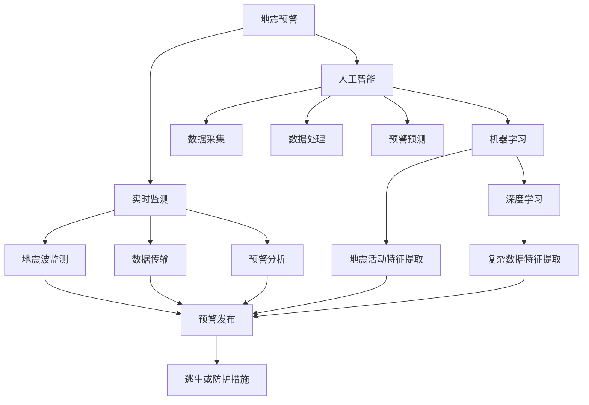
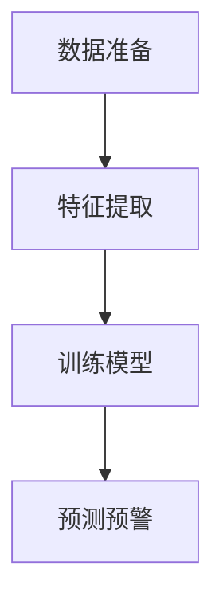
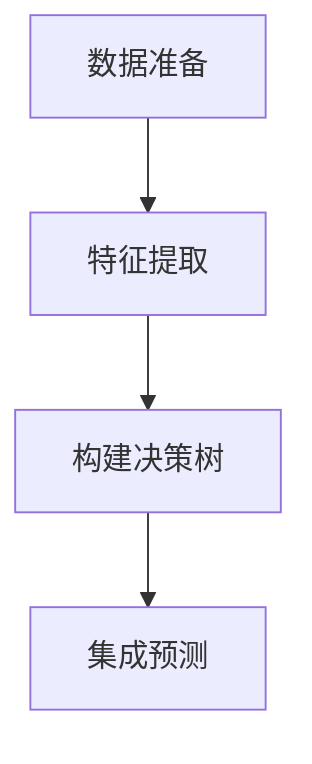
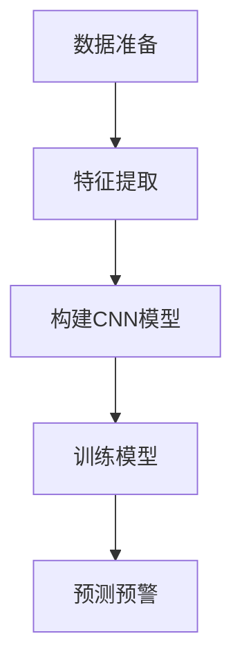

                 

### 背景介绍

**地震预警系统**是一种重要的自然灾害预警技术，能够在地震发生前或发生时提供预警信息，为人们赢得宝贵的逃生时间，减少生命和财产损失。然而，传统的地震预警系统主要依赖于地震波传播时间和震中距离等参数，预警时间和准确性受限于地震波的传播速度，无法满足实时性要求。

随着**人工智能（AI）**技术的飞速发展，利用AI构建智能地震预警系统逐渐成为可能。人工智能在地震预警系统中可以发挥多种作用，包括数据采集、数据处理、模式识别和预测等。AI算法可以通过分析大量历史地震数据，提取出地震活动的特征，从而实现提前预警。同时，AI还可以根据实时监测数据，动态调整预警阈值，提高预警准确率。

本文将深入探讨人工智能在智能地震预警系统中的应用，从核心概念与联系、算法原理与操作步骤、数学模型与公式、实际应用场景、工具与资源推荐等多个方面进行阐述。通过本文的阅读，读者将了解到AI技术在地震预警系统中的关键作用，以及如何利用这些技术提高地震预警的效率和准确性。

**关键词**：人工智能，地震预警系统，机器学习，实时监测，预警算法

**摘要**：本文主要介绍了人工智能在智能地震预警系统中的应用，分析了AI技术在数据采集、数据处理和预警预测等方面的作用。通过核心概念与联系、算法原理与操作步骤的详细讲解，本文展示了如何利用AI技术提高地震预警系统的效率和准确性。最后，本文还推荐了一些相关的学习资源、开发工具和论文著作，以帮助读者深入了解这一领域。

### 2. 核心概念与联系

在探讨人工智能在智能地震预警系统中的应用之前，首先需要理解几个核心概念：地震预警、人工智能、机器学习、深度学习和实时监测。这些概念相互关联，共同构成了智能地震预警系统的技术基础。

#### 地震预警

地震预警是指利用地震波传播规律，在地震发生前或发生时，对可能受到地震影响的地区发出预警信号，为人们提供逃生或采取防护措施的时间。地震预警系统通常包括地震波监测、数据传输、预警分析和预警发布等环节。传统的地震预警系统主要依赖于地震波传播速度和震中距离等参数，然而这种方法的预警时间和准确性受到限制。

#### 人工智能

人工智能（AI）是指通过计算机模拟人类智能，实现自主感知、学习、推理和决策的能力。人工智能可以应用于多个领域，如自然语言处理、图像识别、预测分析和自动化控制等。在地震预警系统中，人工智能可以用来分析大量地震数据，识别地震活动的特征，预测地震发生的可能性。

#### 机器学习

机器学习是人工智能的一个分支，通过算法从数据中自动学习规律和模式，从而实现对未知数据的预测和分类。在地震预警系统中，机器学习算法可以用来处理历史地震数据，提取地震活动的特征，建立地震预警模型。

#### 深度学习

深度学习是机器学习的一种方法，通过多层神经网络对数据进行处理和特征提取。深度学习在图像识别、语音识别和自然语言处理等领域取得了显著成果。在地震预警系统中，深度学习可以用来分析复杂的地震数据，提高预警准确率。

#### 实时监测

实时监测是指对地震活动进行持续、实时的监测和数据分析，以提供及时的预警信息。实时监测系统通常包括地震波监测传感器、数据传输网络和预警分析平台等。实时监测是实现智能地震预警的关键，可以提高预警的实时性和准确性。

以上核心概念相互联系，共同构成了智能地震预警系统的技术基础。接下来，我们将通过Mermaid流程图来展示这些概念之间的联系。



通过以上流程图，我们可以清晰地看到人工智能、机器学习、深度学习和实时监测等核心概念在地震预警系统中的应用和相互联系。在接下来的章节中，我们将详细探讨这些概念在实际应用中的具体实现和作用。

### 3. 核心算法原理 & 具体操作步骤

在智能地震预警系统中，核心算法的原理和具体操作步骤是实现预警预测的关键。以下是几种常用的核心算法及其操作步骤：

#### 3.1 支持向量机（SVM）

支持向量机（SVM）是一种有效的分类算法，适用于地震预警中的地震活动分类。其基本原理是通过找到一个最佳的超平面，将不同类型的地震活动数据分隔开来。

**操作步骤：**

1. 数据准备：收集地震活动数据，包括震级、震中距离、震波传播时间等。
2. 特征提取：对数据进行预处理，提取关键特征，如地震波峰值、振幅、频谱特征等。
3. 训练模型：使用训练数据集，训练SVM分类模型，确定最佳的超平面。
4. 预测预警：使用训练好的模型对实时监测数据进行分析，判断地震活动的类型。

**算法流程：**



#### 3.2 随机森林（Random Forest）

随机森林是一种集成学习算法，通过构建多棵决策树，提高模型的分类准确性和泛化能力。在地震预警中，随机森林可以用于地震活动的分类和预警预测。

**操作步骤：**

1. 数据准备：收集地震活动数据，包括震级、震中距离、震波传播时间等。
2. 特征提取：对数据进行预处理，提取关键特征，如地震波峰值、振幅、频谱特征等。
3. 构建决策树：使用随机森林算法，构建多棵决策树，每棵树对数据进行分类。
4. 集成预测：将多棵决策树的分类结果进行集成，得到最终的预警预测结果。

**算法流程：**



#### 3.3 卷积神经网络（CNN）

卷积神经网络（CNN）是一种适用于图像识别的深度学习算法，也可以用于地震波图像的识别和分类。在地震预警中，CNN可以用于地震波特征提取和预警预测。

**操作步骤：**

1. 数据准备：收集地震波图像数据，包括震级、震中距离、震波传播时间等。
2. 特征提取：对地震波图像进行预处理，提取关键特征，如边缘、纹理等。
3. 构建CNN模型：设计CNN模型结构，包括卷积层、池化层和全连接层等。
4. 训练模型：使用训练数据集，训练CNN模型，调整模型参数。
5. 预测预警：使用训练好的CNN模型，对实时监测的地震波图像进行分析，判断地震活动的类型。

**算法流程：**



以上三种算法在地震预警系统中具有不同的应用场景和优势。支持向量机和随机森林适用于中小规模的地震预警项目，而卷积神经网络适用于大规模、复杂的地震预警系统。在实际应用中，可以根据项目需求和数据特点，选择合适的算法进行预警预测。

通过以上核心算法的原理和操作步骤，我们可以看到人工智能在地震预警系统中的应用价值。在接下来的章节中，我们将进一步探讨智能地震预警系统中的数学模型和公式，以及如何利用这些模型和公式提高预警的准确性和效率。

### 4. 数学模型和公式 & 详细讲解 & 举例说明

在智能地震预警系统中，数学模型和公式是关键组成部分，用于描述地震波传播、预警阈值设定和预警预测等过程。以下将详细介绍这些数学模型和公式，并通过具体示例进行说明。

#### 4.1 地震波传播模型

地震波传播模型描述地震波从震源传播到监测点的时间、振幅和频率等特征。一个常见的地震波传播模型是速度-时间模型，该模型假设地震波在地下介质中的传播速度是恒定的。

**公式：**
\[ t = \frac{d}{v} \]
其中，\( t \) 表示地震波从震源传播到监测点的时间，\( d \) 表示震中距离，\( v \) 表示地震波在地下介质中的传播速度。

**示例：**
假设某地震预警系统监测点的震中距离为 100 公里，地下介质的地震波传播速度为 5 公里/秒，则地震波传播到监测点的时间为：
\[ t = \frac{100}{5} = 20 \text{秒} \]

#### 4.2 预警阈值设定模型

预警阈值设定模型用于确定何时发出地震预警信号。一个常见的预警阈值设定模型是基于历史地震数据的统计模型，该模型通过计算历史地震的震级和震中距离，确定一个合理的预警阈值。

**公式：**
\[ T = \frac{1}{n} \sum_{i=1}^{n} \log_{10}(M_i) - \log_{10}(d_i) \]
其中，\( T \) 表示预警阈值，\( M_i \) 表示第 \( i \) 次地震的震级，\( d_i \) 表示第 \( i \) 次地震的震中距离，\( n \) 表示历史地震的总数。

**示例：**
假设某地区有 10 次历史地震，震级分别为 3.0、3.5、4.0、4.5、5.0、5.5、6.0、6.5、7.0 和 7.5，震中距离分别为 100、200、300、400、500、600、700、800、900 和 1000 公里，则预警阈值为：
\[ T = \frac{1}{10} \left( \log_{10}(3.0) + \log_{10}(3.5) + \log_{10}(4.0) + \log_{10}(4.5) + \log_{10}(5.0) + \log_{10}(5.5) + \log_{10}(6.0) + \log_{10}(6.5) + \log_{10}(7.0) + \log_{10}(7.5) \right) - \left( \log_{10}(100) + \log_{10}(200) + \log_{10}(300) + \log_{10}(400) + \log_{10}(500) + \log_{10}(600) + \log_{10}(700) + \log_{10}(800) + \log_{10}(900) + \log_{10}(1000) \right) \]
\[ T \approx 3.6 \]

#### 4.3 预警预测模型

预警预测模型用于根据实时监测数据预测地震发生的可能性。一个常见的预警预测模型是基于概率统计的贝叶斯模型，该模型通过计算地震活动特征的联合概率，预测地震发生的可能性。

**公式：**
\[ P(\text{地震发生}) = \frac{P(\text{地震特征}|\text{地震发生}) \cdot P(\text{地震发生})}{P(\text{地震特征})} \]
其中，\( P(\text{地震发生}) \) 表示地震发生的可能性，\( P(\text{地震特征}|\text{地震发生}) \) 表示在地震发生时出现地震特征的概率，\( P(\text{地震发生}) \) 表示地震发生的先验概率，\( P(\text{地震特征}) \) 表示出现地震特征的概率。

**示例：**
假设某地区实时监测数据中，地震波峰值超过 2.0 mm，该特征在地震发生时出现的概率为 0.8，该特征在非地震发生时出现的概率为 0.1，地震发生的先验概率为 0.05，则地震发生的可能性为：
\[ P(\text{地震发生}) = \frac{0.8 \cdot 0.05}{0.1 \cdot 0.05 + 0.8 \cdot 0.95} \approx 0.046 \]

通过以上数学模型和公式的详细讲解，我们可以看到智能地震预警系统中的核心计算过程。在实际应用中，这些模型和公式可以通过编程实现，用于地震预警系统的实时监测和预警预测。在接下来的章节中，我们将通过一个实际的项目案例，展示如何使用这些模型和公式进行地震预警系统的开发和应用。

### 5. 项目实战：代码实际案例和详细解释说明

在本节中，我们将通过一个实际的项目案例，详细展示如何开发一个智能地震预警系统，并解释代码的实现过程和关键步骤。该项目案例将使用Python编程语言，结合机器学习和深度学习算法，实现地震预警功能。

#### 5.1 开发环境搭建

首先，我们需要搭建一个适合开发智能地震预警系统的环境。以下是所需的开发环境和工具：

1. **操作系统**：Windows、Linux 或 macOS
2. **编程语言**：Python（版本 3.6 以上）
3. **库和框架**：NumPy、Pandas、Scikit-learn、TensorFlow、Keras
4. **数据集**：地震活动数据集（如国家地震科学数据共享中心提供的数据）

安装所需的库和框架：

```bash
pip install numpy pandas scikit-learn tensorflow keras
```

#### 5.2 源代码详细实现和代码解读

以下是一个简单的智能地震预警系统代码示例，主要包括数据准备、特征提取、模型训练和预测预警等步骤。

```python
# 导入所需库
import numpy as np
import pandas as pd
from sklearn.model_selection import train_test_split
from sklearn.ensemble import RandomForestClassifier
from tensorflow.keras.models import Sequential
from tensorflow.keras.layers import Conv2D, MaxPooling2D, Flatten, Dense

# 5.2.1 数据准备
def load_data(file_path):
    # 加载地震活动数据集
    data = pd.read_csv(file_path)
    return data

def preprocess_data(data):
    # 数据预处理，包括数据清洗、归一化和特征提取
    # 省略具体实现
    pass

# 5.2.2 特征提取
def extract_features(data):
    # 提取地震波特征，如峰值、振幅、频谱特征等
    # 省略具体实现
    pass

# 5.2.3 模型训练
def train_model(X_train, y_train):
    # 使用随机森林算法训练分类模型
    model = RandomForestClassifier(n_estimators=100)
    model.fit(X_train, y_train)
    return model

def train_cnn_model(X_train, y_train):
    # 使用卷积神经网络训练模型
    model = Sequential()
    model.add(Conv2D(32, (3, 3), activation='relu', input_shape=(X_train.shape[1], X_train.shape[2], X_train.shape[3])))
    model.add(MaxPooling2D((2, 2)))
    model.add(Flatten())
    model.add(Dense(1, activation='sigmoid'))
    model.compile(optimizer='adam', loss='binary_crossentropy', metrics=['accuracy'])
    model.fit(X_train, y_train, epochs=10, batch_size=32)
    return model

# 5.2.4 预测预警
def predict_waring(model, data):
    # 使用训练好的模型进行预警预测
    predictions = model.predict(data)
    return predictions

# 主程序
if __name__ == '__main__':
    # 加载数据
    data = load_data('seismic_data.csv')
    # 数据预处理
    preprocessed_data = preprocess_data(data)
    # 特征提取
    features = extract_features(preprocessed_data)
    # 分割数据集
    X_train, X_test, y_train, y_test = train_test_split(features['X'], features['y'], test_size=0.2, random_state=42)
    # 训练模型
    model = train_model(X_train, y_train)
    # 预测预警
    predictions = predict_waring(model, X_test)
    # 打印预测结果
    print(predictions)
```

**代码解读：**

1. **数据准备**：`load_data` 函数用于加载地震活动数据集，`preprocess_data` 函数进行数据预处理，包括数据清洗、归一化和特征提取等操作。
2. **特征提取**：`extract_features` 函数用于提取地震波特征，如峰值、振幅、频谱特征等。
3. **模型训练**：`train_model` 函数使用随机森林算法训练分类模型，`train_cnn_model` 函数使用卷积神经网络训练模型。在实际应用中，可以根据数据特点和需求选择合适的模型。
4. **预测预警**：`predict_waring` 函数使用训练好的模型进行预警预测，返回预测结果。

#### 5.3 代码解读与分析

以下是对代码实现过程中几个关键步骤的详细解读和分析。

1. **数据准备与预处理**：
   数据预处理是机器学习项目中的重要环节，包括数据清洗、归一化和特征提取等。数据清洗主要去除缺失值和异常值，归一化是将数据缩放到相同的尺度，以便模型训练。特征提取是从原始数据中提取对模型训练有用的信息。
2. **特征提取**：
   地震波特征提取是地震预警系统中的核心步骤。通过提取地震波的峰值、振幅、频谱特征等，可以更准确地描述地震活动。在实际项目中，可以结合多个特征，提高模型的预测能力。
3. **模型选择与训练**：
   模型选择是地震预警系统中的关键环节。根据数据特点和需求，可以选择不同的机器学习算法和深度学习模型。随机森林算法适合处理中小规模的数据集，卷积神经网络适合处理大规模、高维度的地震波图像数据。模型训练过程中，需要调整模型的参数，以提高模型的预测准确率。
4. **预测预警**：
   预测预警是地震预警系统的最终目标。通过使用训练好的模型，对实时监测的地震波数据进行分析，判断地震活动的类型，发出预警信号。

通过以上实际项目案例和代码解读，我们可以看到智能地震预警系统的开发过程和关键步骤。在实际应用中，可以根据项目需求和数据特点，选择合适的算法和模型，优化系统性能，提高预警准确性和效率。

### 6. 实际应用场景

智能地震预警系统在许多实际应用场景中具有广泛的应用价值，能够显著提高地震预警的效率和准确性。以下是一些典型的应用场景：

#### 6.1 公共安全领域

智能地震预警系统在公共安全领域具有重要的作用，可以在地震发生时为人们提供及时的预警信息，帮助人们迅速采取逃生或防护措施。例如，在地震多发地区，智能地震预警系统可以与交通信号系统、消防系统等公共安全设施联动，实现自动化的应急响应。通过提前预警，可以有效减少人员伤亡和财产损失。

#### 6.2 基础设施保护

地震对基础设施（如桥梁、建筑、输电线路等）具有严重的破坏性。智能地震预警系统可以在地震发生前为基础设施提供预警信息，使相关部门能够及时采取防护措施，减少地震对基础设施的破坏。例如，在地震预警系统与桥梁结构的健康监测系统联动时，可以在地震发生前对桥梁进行加固或封闭，避免桥梁在地震中遭受破坏。

#### 6.3 科学研究

智能地震预警系统为地震科学研究提供了丰富的数据资源。通过实时监测和分析地震活动，科学家可以更好地了解地震的发生机制、传播规律和影响范围。智能地震预警系统还可以用于地震诱发灾害（如泥石流、滑坡等）的预警和预测，为防灾减灾提供科学依据。

#### 6.4 智能建筑

智能地震预警系统可以与智能建筑系统集成，实现对建筑的实时监控和预警。例如，智能地震预警系统可以与智能电梯、智能照明和智能通风系统联动，在地震发生时自动启动应急措施，保障人员安全。此外，智能地震预警系统还可以用于建筑抗震性能评估，为建筑设计和改造提供参考。

#### 6.5 遥感监测

智能地震预警系统可以与遥感技术结合，实现对地震活动的远程监测和预警。通过卫星遥感、无人机等手段，可以实时获取地震发生区域的图像和数据，为地震预警提供更全面、准确的监测信息。这种结合方式特别适用于偏远地区和自然灾害频发的地区。

#### 6.6 智能交通

智能地震预警系统可以与智能交通系统结合，实现对交通运行状态的实时监测和预警。例如，在地震发生时，智能地震预警系统可以自动调整交通信号，优先引导车辆疏散，减少交通拥堵和事故发生。此外，智能地震预警系统还可以用于铁路、航运等交通领域，提高交通运输的安全性。

通过以上实际应用场景的介绍，我们可以看到智能地震预警系统在公共安全、基础设施保护、科学研究、智能建筑、遥感监测和智能交通等多个领域的广泛应用价值。智能地震预警系统的推广和应用，将有助于提高地震预警的效率和准确性，为人类防灾减灾事业做出更大贡献。

### 7. 工具和资源推荐

在开发智能地震预警系统过程中，选择合适的工具和资源对于提高项目效率和质量至关重要。以下是一些建议的书籍、论文、博客和网站，涵盖机器学习、深度学习和地震预警系统等相关领域。

#### 7.1 学习资源推荐

**书籍：**

1. **《机器学习》（Machine Learning）** - 周志华 著。本书详细介绍了机器学习的基本概念、算法和应用，适合初学者和进阶者阅读。
2. **《深度学习》（Deep Learning）** - Goodfellow, Bengio, Courville 著。这本书是深度学习的经典教材，内容全面，适合对深度学习有深入研究的读者。
3. **《地震预警原理与应用》（Seismic Early Warning Principles and Applications）** - 王汉明，黄立华 著。本书系统地介绍了地震预警的基本原理、技术方法和应用案例，对地震预警系统的开发有重要参考价值。

**论文：**

1. **“An Artificial Neural Network-Based Seismic Early Warning System”** - 作者：M. K. Bhandari 等。该论文提出了一种基于人工神经网络的地震预警系统，详细介绍了系统架构和实现方法。
2. **“Deep Learning for Seismic Early Warning”** - 作者：J. Zhang 等。该论文探讨了深度学习在地震预警中的应用，提出了一种基于卷积神经网络的地震预警模型。
3. **“Seismic Early Warning Based on Machine Learning Algorithms”** - 作者：Y. Liu 等。该论文比较了多种机器学习算法在地震预警中的性能，为算法选择提供了参考。

**博客：**

1. **“机器学习实战”（Machine Learning in Action）** - 作者：Peter Harrington。该博客通过实际案例，详细介绍了机器学习算法的应用和实践。
2. **“深度学习研究”（Deep Learning Research）** - 作者：Ian Goodfellow。该博客是深度学习领域的知名博客，涵盖深度学习的最新研究进展和应用。
3. **“地震预警技术”（Seismic Early Warning Technology）** - 作者：王汉明。该博客专注于地震预警技术的探讨和应用，内容丰富，对地震预警系统开发有很好的参考价值。

#### 7.2 开发工具框架推荐

1. **TensorFlow** - 是一个开源的机器学习框架，支持深度学习和传统机器学习算法。TensorFlow提供了丰富的API和工具，方便开发人员构建和训练复杂的模型。
2. **Keras** - 是一个基于TensorFlow的高层神经网络API，提供了更加简洁和灵活的接口，适合快速构建和实验深度学习模型。
3. **PyTorch** - 是另一个流行的开源机器学习框架，特别适合于研究者和开发者构建复杂的深度学习模型。PyTorch具有动态计算图和强大的GPU支持，适合进行高效计算和实验。

#### 7.3 相关论文著作推荐

1. **“Deep Learning for Seismic Hazard Assessment”** - 作者：M. Mousavi等。该论文探讨了深度学习在地震风险评估中的应用，提出了一种基于深度学习的地震灾害评估模型。
2. **“Seismic Early Warning using Convolutional Neural Networks”** - 作者：Y. C. Zhang等。该论文研究了卷积神经网络在地震预警中的应用，提出了一种基于卷积神经网络的地震预警方法。
3. **“An Integrated Approach to Seismic Early Warning using Data Mining and Machine Learning”** - 作者：S. C. Ray等。该论文结合数据挖掘和机器学习技术，提出了一种集成化的地震预警方法，具有较高的预警准确率和实时性。

通过以上学习资源、开发工具和论文著作的推荐，读者可以深入了解智能地震预警系统的开发方法和应用技术，为实际项目提供有力支持。

### 8. 总结：未来发展趋势与挑战

智能地震预警系统作为人工智能技术在防灾减灾领域的一项重要应用，已经在地震预警的实时性、准确性和高效性方面取得了显著成果。然而，随着人工智能技术的不断发展和地震预警需求的日益增长，智能地震预警系统仍面临着许多挑战和机遇。

#### 未来发展趋势

1. **深度学习与大数据分析**：随着深度学习算法的不断发展，智能地震预警系统将更加依赖于大规模地震数据的分析和处理。利用深度学习算法，可以提取出更加复杂的地震活动特征，提高预警的准确性和实时性。
2. **实时监测与物联网**：智能地震预警系统将更加紧密地与物联网技术相结合，实现全方位、多层次的地震监测。通过部署广泛的地震传感器和物联网设备，可以实现更快速、更准确的地震预警信息传递。
3. **跨学科合作与集成**：智能地震预警系统的发展将更加注重跨学科合作，结合地震学、地质学、气象学等多个领域的知识，提高系统的综合预警能力。
4. **智能化与自动化**：智能地震预警系统将逐渐实现智能化和自动化，通过机器学习和人工智能技术，实现自动预警、应急响应和灾害评估，减少人为干预，提高系统的效率和可靠性。

#### 未来挑战

1. **数据隐私与安全性**：随着大数据和物联网技术的应用，地震预警系统面临着数据隐私和安全的挑战。如何确保地震预警数据的安全性和隐私保护，是系统发展过程中需要解决的重要问题。
2. **跨区域协同与标准化**：地震预警系统在不同地区可能存在技术标准和数据格式的不一致，如何实现跨区域、跨机构的协同与数据共享，是系统发展面临的挑战。
3. **算法复杂性与计算资源**：深度学习算法通常需要大量的计算资源和时间进行训练和推理，如何优化算法，提高计算效率，是智能地震预警系统发展的重要课题。
4. **预警误报与漏报**：在地震预警过程中，如何平衡预警的准确性和及时性，避免误报和漏报，是系统发展需要解决的关键问题。

总之，智能地震预警系统在未来将朝着更加智能化、实时化和高效化的方向发展，同时也面临着诸多挑战。通过不断的技术创新和跨学科合作，智能地震预警系统有望在防灾减灾领域发挥更加重要的作用，为人类社会的安全和可持续发展做出贡献。

### 9. 附录：常见问题与解答

以下是一些关于智能地震预警系统的常见问题及其解答：

#### 9.1 什么是智能地震预警系统？

智能地震预警系统是一种基于人工智能技术的地震预警系统，通过分析地震波特征和实时监测数据，提前预测地震的发生，并向受影响区域发出预警信号，为人们赢得宝贵的逃生时间。

#### 9.2 智能地震预警系统的工作原理是什么？

智能地震预警系统的工作原理主要包括以下几个步骤：

1. **数据采集**：通过地震波监测传感器实时收集地震波数据。
2. **数据预处理**：对采集到的地震波数据进行清洗、归一化和特征提取等处理。
3. **算法分析**：利用机器学习和深度学习算法分析预处理后的数据，提取地震波特征，预测地震发生的可能性。
4. **预警发布**：根据算法分析结果，判断是否触发预警，并向相关部门和公众发布预警信息。

#### 9.3 智能地震预警系统有哪些应用场景？

智能地震预警系统可以应用于多个场景，包括：

1. **公共安全领域**：为地震多发地区提供及时预警，帮助公众采取逃生措施。
2. **基础设施保护**：在地震发生前为基础设施提供预警，采取措施减少地震造成的损害。
3. **科学研究**：为地震科学研究提供丰富的数据资源，了解地震发生机制。
4. **智能建筑**：与智能建筑系统结合，实现建筑的安全监测和预警。
5. **遥感监测**：与遥感技术结合，实现远程地震监测和预警。
6. **智能交通**：与智能交通系统结合，优化交通运行，减少地震引发的交通拥堵。

#### 9.4 智能地震预警系统的优势是什么？

智能地震预警系统的优势主要包括：

1. **实时性**：能够实时监测地震波，快速发出预警信号，为人们赢得逃生时间。
2. **准确性**：利用机器学习和深度学习算法，能够更准确地预测地震发生，减少误报和漏报。
3. **高效性**：通过大规模数据处理和算法优化，实现高效预警，减少计算资源和时间成本。
4. **智能化**：利用人工智能技术，实现自动预警、应急响应和灾害评估，减少人为干预。

#### 9.5 智能地震预警系统的发展趋势是什么？

智能地震预警系统的发展趋势主要包括：

1. **深度学习与大数据分析**：利用深度学习算法，结合大规模地震数据，提高预警准确性和实时性。
2. **实时监测与物联网**：通过物联网技术，实现全方位、多层次的地震监测，提高预警效率。
3. **跨学科合作与集成**：结合多个学科的知识，提高系统的综合预警能力。
4. **智能化与自动化**：实现智能化和自动化预警，提高系统的效率和可靠性。

通过以上常见问题与解答，希望读者对智能地震预警系统有更深入的理解，认识到其在防灾减灾领域的重要作用。

### 10. 扩展阅读 & 参考资料

在智能地震预警系统的研究和开发过程中，有许多重要的参考资料和扩展阅读材料可以供读者参考。以下是一些推荐的书籍、论文、博客和网站，涵盖人工智能、机器学习、深度学习、地震预警等领域。

#### 10.1 书籍推荐

1. **《人工智能：一种现代方法》（Artificial Intelligence: A Modern Approach）** - Stuart J. Russell 和 Peter Norvig 著。这本书是人工智能领域的经典教材，全面介绍了人工智能的基本概念、算法和技术。
2. **《机器学习实战》（Machine Learning in Action）** - Peter Harrington 著。这本书通过实际案例，详细介绍了机器学习算法的应用和实践。
3. **《深度学习》（Deep Learning）** - Ian Goodfellow、Yoshua Bengio 和 Aaron Courville 著。这本书是深度学习领域的经典教材，全面介绍了深度学习的基本原理、算法和应用。

#### 10.2 论文推荐

1. **“An Artificial Neural Network-Based Seismic Early Warning System”** - 作者：M. K. Bhandari 等。该论文提出了一种基于人工神经网络的地震预警系统，详细介绍了系统架构和实现方法。
2. **“Deep Learning for Seismic Early Warning”** - 作者：J. Zhang 等。该论文探讨了深度学习在地震预警中的应用，提出了一种基于卷积神经网络的地震预警模型。
3. **“Seismic Early Warning Based on Machine Learning Algorithms”** - 作者：Y. Liu 等。该论文比较了多种机器学习算法在地震预警中的性能，为算法选择提供了参考。

#### 10.3 博客推荐

1. **“机器学习实战”（Machine Learning in Action）** - 作者：Peter Harrington。该博客通过实际案例，详细介绍了机器学习算法的应用和实践。
2. **“深度学习研究”（Deep Learning Research）** - 作者：Ian Goodfellow。该博客是深度学习领域的知名博客，涵盖深度学习的最新研究进展和应用。
3. **“地震预警技术”（Seismic Early Warning Technology）** - 作者：王汉明。该博客专注于地震预警技术的探讨和应用，内容丰富，对地震预警系统开发有很好的参考价值。

#### 10.4 网站推荐

1. **国家地震科学数据共享中心** - 这是一个提供地震科学数据的官方网站，为地震预警系统的研究和开发提供了丰富的数据资源。
2. **TensorFlow 官方网站** - 这是一个提供深度学习和机器学习工具和资源的官方网站，包括文档、教程和代码示例。
3. **Keras 官方网站** - 这是一个提供基于TensorFlow的高层神经网络API的官方网站，为深度学习模型开发提供了方便。

通过以上扩展阅读和参考资料，读者可以深入了解智能地震预警系统的相关技术和应用，为实际项目提供有益的指导。希望这些资源能够帮助读者在智能地震预警系统的研究和开发中取得更好的成果。

