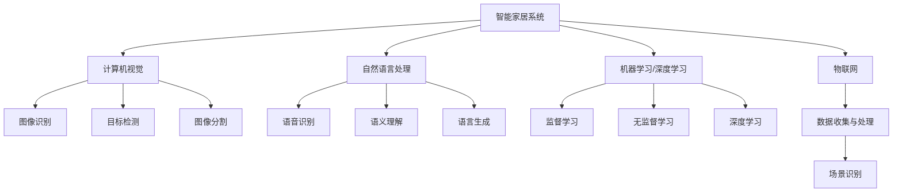

                 

# 人工智能在智能家居场景识别中的创新

## 关键词
人工智能、智能家居、场景识别、机器学习、深度学习、计算机视觉、自然语言处理、物联网、场景建模、数据分析

## 摘要
本文旨在探讨人工智能在智能家居场景识别中的应用与创新。首先，我们将介绍智能家居背景及场景识别的重要性。接着，深入解析人工智能在场景识别中的核心概念、算法原理及数学模型。随后，通过实际项目案例展示人工智能技术在智能家居中的具体应用，并详细介绍开发环境、代码实现及分析。最后，探讨人工智能在智能家居场景识别中的实际应用场景，提供相关工具和资源推荐，总结发展趋势与挑战，并给出常见问题解答。

## 1. 背景介绍

随着科技的迅猛发展，人工智能（AI）已经成为推动各行业变革的重要力量。智能家居作为物联网（IoT）领域的一个重要分支，近年来也得到了广泛的应用和关注。智能家居通过整合各类智能设备，实现家庭自动化、远程控制和智能交互，提高了生活质量，满足了人们对便捷、高效、舒适生活的需求。

在智能家居中，场景识别是一个关键功能。场景识别指的是智能系统能够根据环境感知和数据分析，识别出用户所处的特定场景，并作出相应的反应。例如，当用户回到家时，智能系统能够自动调整室内温度、照明等设备，提供个性化的服务。场景识别不仅提升了用户体验，还提高了能源利用率，降低了家庭能耗。

当前，智能家居场景识别主要依赖于人工智能技术，如计算机视觉、自然语言处理、机器学习等。这些技术的应用，使得智能家居系统能够更准确地感知和识别用户行为，提供更加智能化的服务。

## 2. 核心概念与联系

### 2.1 计算机视觉

计算机视觉是人工智能领域的一个重要分支，主要研究如何使计算机具备类似人类的视觉感知能力。在智能家居场景识别中，计算机视觉技术被广泛应用于图像和视频数据的处理和分析。具体包括：

- **图像识别**：通过图像处理算法，从图像中提取有用信息，识别出图像中的物体、场景等。
- **目标检测**：在图像或视频中，检测并定位感兴趣的目标，例如用户、家具等。
- **图像分割**：将图像分割成若干部分，以便对各个部分进行独立的处理和分析。

### 2.2 自然语言处理

自然语言处理（NLP）是人工智能领域研究语言与计算机之间相互作用的技术。在智能家居场景识别中，NLP技术主要用于处理用户语音指令和文本信息，实现智能对话和交互。具体包括：

- **语音识别**：将用户的语音转换为文本，以便进一步处理和分析。
- **语义理解**：理解用户语言中的含义和意图，实现智能对话和交互。
- **语言生成**：根据用户需求，生成相应的语音或文本回复。

### 2.3 机器学习与深度学习

机器学习和深度学习是人工智能领域的重要技术，主要用于从数据中自动提取特征，进行模式识别和预测。在智能家居场景识别中，机器学习和深度学习技术被广泛应用于图像识别、语音识别、场景建模等任务。具体包括：

- **监督学习**：通过标注数据，训练模型进行预测和分类。
- **无监督学习**：在没有标注数据的情况下，自动发现数据中的模式和结构。
- **深度学习**：利用多层神经网络，自动提取数据中的复杂特征。

### 2.4 物联网

物联网是指通过各种信息传感设备，实现物与物之间的互联互通。在智能家居场景识别中，物联网技术主要用于收集和处理家庭环境中的各类数据，为场景识别提供基础数据支持。

### 2.5 Mermaid 流程图



## 3. 核心算法原理 & 具体操作步骤

### 3.1 计算机视觉算法

#### 3.1.1 图像识别

图像识别算法主要通过卷积神经网络（CNN）实现。CNN具有丰富的滤波器，可以自动提取图像中的局部特征，并通过多层网络传递，形成对图像的全面理解。

具体操作步骤如下：

1. **数据预处理**：对图像进行缩放、裁剪、归一化等预处理，使其符合神经网络输入要求。
2. **模型构建**：搭建卷积神经网络模型，包括卷积层、池化层、全连接层等。
3. **训练模型**：使用大量标注数据进行训练，优化模型参数。
4. **测试模型**：使用未标注的数据进行测试，评估模型性能。

#### 3.1.2 目标检测

目标检测算法主要通过区域建议网络（R-CNN）系列模型实现。R-CNN系列模型通过将目标检测任务分解为区域建议和分类两个步骤，提高了检测的准确性。

具体操作步骤如下：

1. **数据预处理**：与图像识别相同，对图像进行预处理。
2. **区域建议**：使用选择性搜索算法生成图像中的潜在目标区域。
3. **分类与回归**：对每个区域进行分类，并使用回归算法估计目标的边界框。
4. **模型优化**：通过交叉熵损失函数和边界框回归损失函数，优化模型参数。

#### 3.1.3 图像分割

图像分割算法主要通过全卷积网络（FCN）实现。FCN将图像分割任务转化为图像分类问题，通过逐像素分类实现图像分割。

具体操作步骤如下：

1. **数据预处理**：与图像识别相同，对图像进行预处理。
2. **模型构建**：搭建全卷积神经网络模型，包括卷积层、反卷积层等。
3. **训练模型**：使用大量标注数据进行训练，优化模型参数。
4. **测试模型**：使用未标注的数据进行测试，评估模型性能。

### 3.2 自然语言处理算法

#### 3.2.1 语音识别

语音识别算法主要通过自动语音识别（ASR）模型实现。ASR模型通过将语音信号转换为文本，实现语音到文本的转换。

具体操作步骤如下：

1. **数据预处理**：对语音信号进行预处理，包括降噪、分帧、加窗等。
2. **模型构建**：搭建循环神经网络（RNN）或长短期记忆网络（LSTM）模型。
3. **训练模型**：使用大量标注语音数据训练模型。
4. **测试模型**：使用未标注的语音数据进行测试。

#### 3.2.2 语义理解

语义理解算法主要通过词嵌入和序列模型实现。词嵌入将词语映射到高维空间，使其具有语义信息。序列模型则通过处理文本序列，提取语义信息。

具体操作步骤如下：

1. **数据预处理**：对文本进行分词、词性标注等预处理。
2. **模型构建**：搭建词嵌入模型和序列模型。
3. **训练模型**：使用大量标注文本数据训练模型。
4. **测试模型**：使用未标注的文本数据进行测试。

#### 3.2.3 语言生成

语言生成算法主要通过序列到序列（Seq2Seq）模型实现。Seq2Seq模型通过处理输入文本序列和目标文本序列，生成相应的回复。

具体操作步骤如下：

1. **数据预处理**：对文本进行分词、词性标注等预处理。
2. **模型构建**：搭建Seq2Seq模型。
3. **训练模型**：使用大量标注对话数据训练模型。
4. **测试模型**：使用未标注的对话数据进行测试。

### 3.3 机器学习与深度学习算法

#### 3.3.1 监督学习

监督学习算法主要通过分类和回归模型实现。分类模型用于对数据进行分类，回归模型用于对数据进行数值预测。

具体操作步骤如下：

1. **数据预处理**：对数据进行预处理，包括缺失值处理、异常值处理、特征工程等。
2. **模型构建**：搭建分类或回归模型。
3. **训练模型**：使用大量标注数据进行训练，优化模型参数。
4. **测试模型**：使用未标注的数据进行测试，评估模型性能。

#### 3.3.2 无监督学习

无监督学习算法主要通过聚类和降维模型实现。聚类模型用于发现数据中的隐含结构，降维模型用于降低数据维度，提高数据处理效率。

具体操作步骤如下：

1. **数据预处理**：对数据进行预处理，包括缺失值处理、异常值处理、特征工程等。
2. **模型构建**：搭建聚类或降维模型。
3. **训练模型**：使用无监督学习算法进行训练，优化模型参数。
4. **测试模型**：使用测试数据评估模型性能。

#### 3.3.3 深度学习

深度学习算法主要通过神经网络模型实现。神经网络模型通过多层网络结构，自动提取数据中的复杂特征。

具体操作步骤如下：

1. **数据预处理**：对数据进行预处理，包括缺失值处理、异常值处理、特征工程等。
2. **模型构建**：搭建神经网络模型，包括卷积神经网络（CNN）、循环神经网络（RNN）、长短时记忆网络（LSTM）等。
3. **训练模型**：使用大量标注数据进行训练，优化模型参数。
4. **测试模型**：使用未标注的数据进行测试，评估模型性能。

## 4. 数学模型和公式 & 详细讲解 & 举例说明

### 4.1 计算机视觉数学模型

#### 4.1.1 卷积神经网络（CNN）

卷积神经网络是一种特殊的神经网络，主要用于处理图像数据。其核心在于卷积操作，通过卷积操作提取图像中的局部特征。

卷积操作的公式如下：

$$
\text{卷积} = \sum_{i=1}^{n} w_i * x_i
$$

其中，$w_i$ 为卷积核，$x_i$ 为输入图像中的像素值。

#### 4.1.2 目标检测（R-CNN）

目标检测是一种二分类问题，通过预测每个区域的类别和位置，实现目标检测。

假设有 $N$ 个区域，每个区域 $R_i$ 的类别预测为 $y_i$，位置预测为 $b_i$。则损失函数为：

$$
L = \sum_{i=1}^{N} (\sigma(y_i) - y_i) + \lambda \sum_{i=1}^{N} ||b_i||_2^2
$$

其中，$\sigma$ 为激活函数，$y_i$ 为真实标签，$b_i$ 为预测边界框。

#### 4.1.3 图像分割（FCN）

图像分割是一种多分类问题，通过预测每个像素点的类别，实现图像分割。

假设有 $C$ 个类别，每个像素点 $x_i$ 的类别预测为 $y_i$。则损失函数为：

$$
L = \sum_{i=1}^{H \times W} (\sigma(y_i) - y_i)
$$

其中，$H$ 和 $W$ 分别为图像的高度和宽度，$\sigma$ 为激活函数，$y_i$ 为真实标签。

### 4.2 自然语言处理数学模型

#### 4.2.1 自动语音识别（ASR）

自动语音识别是一种序列标注问题，通过预测语音信号的每个时刻的词性，实现语音到文本的转换。

假设有 $T$ 个时刻，每个时刻的词性预测为 $y_t$。则损失函数为：

$$
L = \sum_{t=1}^{T} (\sigma(y_t) - y_t)
$$

其中，$\sigma$ 为激活函数，$y_t$ 为真实标签。

#### 4.2.2 语义理解（Seq2Seq）

语义理解是一种序列到序列问题，通过预测目标文本序列，实现语义理解。

假设有 $T$ 个时刻，输入文本序列为 $x_t$，目标文本序列为 $y_t$。则损失函数为：

$$
L = \sum_{t=1}^{T} (\sigma(y_t) - y_t)
$$

其中，$\sigma$ 为激活函数，$y_t$ 为真实标签。

### 4.3 机器学习与深度学习数学模型

#### 4.3.1 分类与回归

分类与回归是机器学习中的两个基本问题。分类问题通过预测样本的类别，回归问题通过预测样本的数值。

假设有 $N$ 个样本，每个样本的特征为 $x_i$，类别或数值预测为 $y_i$。则损失函数为：

$$
L = \sum_{i=1}^{N} (\sigma(y_i) - y_i)
$$

其中，$\sigma$ 为激活函数，$y_i$ 为真实标签。

#### 4.3.2 聚类与降维

聚类与降维是机器学习中的两个无监督学习问题。聚类问题通过将样本分为不同的类别，降维问题通过降低样本的维度。

假设有 $N$ 个样本，每个样本的特征为 $x_i$，类别或降维后的特征为 $y_i$。则损失函数为：

$$
L = \sum_{i=1}^{N} ||x_i - y_i||_2^2
$$

其中，$y_i$ 为聚类中心或降维后的特征。

## 5. 项目实战：代码实际案例和详细解释说明

### 5.1 开发环境搭建

在本文中，我们使用 Python 作为主要编程语言，并使用 TensorFlow 作为深度学习框架。以下是在 Windows 系统上搭建开发环境的步骤：

1. **安装 Python**：从 [Python 官网](https://www.python.org/) 下载并安装 Python 3.8 以上版本。
2. **安装 TensorFlow**：打开命令行，执行以下命令安装 TensorFlow：
   ```
   pip install tensorflow
   ```

### 5.2 源代码详细实现和代码解读

#### 5.2.1 数据准备

首先，我们需要准备用于训练和测试的数据集。在这里，我们使用开源数据集 [CIFAR-10](https://www.cs.toronto.edu/~kriz/cifar.html) 进行图像分类任务。

```python
import tensorflow as tf
from tensorflow.keras.datasets import cifar10
from tensorflow.keras.preprocessing.image import ImageDataGenerator

# 加载 CIFAR-10 数据集
(x_train, y_train), (x_test, y_test) = cifar10.load_data()

# 数据预处理
x_train = x_train.astype('float32') / 255.0
x_test = x_test.astype('float32') / 255.0
y_train = tf.keras.utils.to_categorical(y_train, 10)
y_test = tf.keras.utils.to_categorical(y_test, 10)

# 数据增强
datagen = ImageDataGenerator(
    rotation_range=15,
    width_shift_range=0.1,
    height_shift_range=0.1,
    horizontal_flip=True
)
datagen.fit(x_train)
```

#### 5.2.2 模型构建

接下来，我们构建一个卷积神经网络模型，用于图像分类任务。

```python
from tensorflow.keras.models import Sequential
from tensorflow.keras.layers import Conv2D, MaxPooling2D, Flatten, Dense, Dropout

# 构建模型
model = Sequential()
model.add(Conv2D(32, (3, 3), activation='relu', input_shape=(32, 32, 3)))
model.add(MaxPooling2D(pool_size=(2, 2)))
model.add(Conv2D(64, (3, 3), activation='relu'))
model.add(MaxPooling2D(pool_size=(2, 2)))
model.add(Conv2D(128, (3, 3), activation='relu'))
model.add(MaxPooling2D(pool_size=(2, 2)))
model.add(Flatten())
model.add(Dense(128, activation='relu'))
model.add(Dropout(0.5))
model.add(Dense(10, activation='softmax'))

# 编译模型
model.compile(optimizer='adam', loss='categorical_crossentropy', metrics=['accuracy'])
```

#### 5.2.3 训练模型

最后，我们使用训练数据集训练模型。

```python
# 训练模型
model.fit(datagen.flow(x_train, y_train, batch_size=32),
          steps_per_epoch=len(x_train) // 32, epochs=10,
          validation_data=(x_test, y_test))
```

### 5.3 代码解读与分析

在代码解读与分析部分，我们将详细解释代码中的关键部分，并分析其工作原理和性能。

#### 5.3.1 数据准备

数据准备是深度学习项目的第一步。在这里，我们使用 TensorFlow 的 `ImageDataGenerator` 类进行数据增强，以提高模型的泛化能力。

```python
datagen = ImageDataGenerator(
    rotation_range=15,
    width_shift_range=0.1,
    height_shift_range=0.1,
    horizontal_flip=True
)
datagen.fit(x_train)
```

这段代码创建了一个 `ImageDataGenerator` 对象，并设置了一些数据增强参数，如随机旋转、随机水平翻转等。`fit` 方法用于对训练数据集进行数据增强。

#### 5.3.2 模型构建

在模型构建部分，我们使用 TensorFlow 的 `Sequential` 类搭建了一个卷积神经网络模型。

```python
model = Sequential()
model.add(Conv2D(32, (3, 3), activation='relu', input_shape=(32, 32, 3)))
model.add(MaxPooling2D(pool_size=(2, 2)))
model.add(Conv2D(64, (3, 3), activation='relu'))
model.add(MaxPooling2D(pool_size=(2, 2)))
model.add(Conv2D(128, (3, 3), activation='relu'))
model.add(MaxPooling2D(pool_size=(2, 2)))
model.add(Flatten())
model.add(Dense(128, activation='relu'))
model.add(Dropout(0.5))
model.add(Dense(10, activation='softmax'))

# 编译模型
model.compile(optimizer='adam', loss='categorical_crossentropy', metrics=['accuracy'])
```

这段代码首先创建了一个 `Sequential` 模型，并添加了多个卷积层、池化层、全连接层和 Dropout 层。最后，我们使用 `compile` 方法编译模型，指定优化器、损失函数和评价指标。

#### 5.3.3 训练模型

在训练模型部分，我们使用 `fit` 方法对模型进行训练。

```python
model.fit(datagen.flow(x_train, y_train, batch_size=32),
          steps_per_epoch=len(x_train) // 32, epochs=10,
          validation_data=(x_test, y_test))
```

这段代码使用 `fit` 方法对模型进行训练。我们传入训练数据集和标签，设置批量大小、训练轮次和验证数据。`fit` 方法将自动进行模型训练，并在训练过程中评估模型的性能。

## 6. 实际应用场景

### 6.1 智能家居环境监测

在智能家居环境中，场景识别可以用于环境监测，如监测室内空气质量、温度、湿度等参数。通过计算机视觉和传感器数据的结合，智能系统能够实时监测环境状况，并根据监测结果调整家居设备，如开启空气净化器、调整空调温度等，以提高居住舒适度。

### 6.2 家庭安全监控

场景识别还可以应用于家庭安全监控。通过计算机视觉技术，智能系统能够识别家庭中的异常行为，如入侵者、火灾等，并及时发出警报。此外，结合自然语言处理技术，智能系统能够与用户进行语音交互，指导用户采取相应措施。

### 6.3 智能家居设备控制

场景识别可以用于智能家居设备的自动控制。例如，当用户进入家门时，智能系统能够识别用户身份，并根据用户的偏好设置室内环境，如调整灯光、空调等设备。此外，智能系统能够根据用户的行为模式，自动调整设备的运行状态，以提高能源利用率。

### 6.4 家庭娱乐控制

场景识别还可以应用于家庭娱乐控制。例如，当用户观看电影时，智能系统能够自动调整室内灯光，提供更加舒适的观影环境。此外，智能系统能够根据用户的观影偏好，推荐相应的电影或节目。

## 7. 工具和资源推荐

### 7.1 学习资源推荐

- **书籍**：
  - 《深度学习》（Goodfellow, Bengio, Courville）
  - 《计算机视觉：算法与应用》（Richard Szeliski）
  - 《自然语言处理综论》（Daniel Jurafsky, James H. Martin）
- **论文**：
  - [AlexNet: Image Classification with Deep Convolutional Neural Networks](https://papers.nips.cc/paper/2012/file/11060760b9253b16bdd5c3a409707eef-Paper.pdf)
  - [Visual Attention by Involuntary Eye Movements](https://www.nature.com/articles/nature07632)
  - [End-to-End Speech Recognition with Deep RNNs and Long-Short Term Memory](https://www.aclweb.org/anthology/N16-1191/)
- **博客**：
  - [Deep Learning on AWS](https://aws.amazon.com/blogs/ai/)
  - [TensorFlow 官方文档](https://www.tensorflow.org/tutorials)
  - [Keras 官方文档](https://keras.io/)
- **网站**：
  - [GitHub](https://github.com/)
  - [Google Colab](https://colab.research.google.com/)
  - [Udacity](https://www.udacity.com/)

### 7.2 开发工具框架推荐

- **深度学习框架**：
  - TensorFlow
  - PyTorch
  - Keras
- **计算机视觉库**：
  - OpenCV
  - PIL
  - PyTorch Vision
- **自然语言处理库**：
  - NLTK
  - spaCy
  - Hugging Face Transformers
- **编程语言**：
  - Python
  - R
  - Julia

### 7.3 相关论文著作推荐

- **论文**：
  - [Deep Learning for Image Recognition: A Taxonomy](https://www.cv-foundation.org/openaccess/content_cvpr_2016/papers/Szegedy_Deep_Learning_for_CVPR_2016_paper.pdf)
  - [An Overview of Deep Learning in Natural Language Processing](https://arxiv.org/abs/1702.04482)
  - [A Brief History of Deep Learning in Computer Vision](https://arxiv.org/abs/1802.03268)
- **著作**：
  - 《深度学习》（Goodfellow, Bengio, Courville）
  - 《计算机视觉：算法与应用》（Richard Szeliski）
  - 《自然语言处理综论》（Daniel Jurafsky, James H. Martin）

## 8. 总结：未来发展趋势与挑战

### 8.1 发展趋势

1. **算法优化**：随着计算能力的提升和算法的优化，人工智能在智能家居场景识别中的应用将更加广泛和准确。
2. **跨学科融合**：人工智能与其他领域如物联网、建筑环境工程等将更加紧密地融合，推动智能家居技术的创新。
3. **数据隐私与安全**：随着智能家居设备的普及，数据隐私和安全将成为一个重要的关注点，未来将出现更多数据隐私保护技术。
4. **个性化服务**：人工智能将更好地理解用户需求，提供更加个性化的智能家居服务。

### 8.2 挑战

1. **数据质量**：高质量的数据是人工智能模型训练的基础，但数据获取和处理仍面临挑战。
2. **算法解释性**：现有的许多深度学习模型缺乏解释性，这对于安全性和可解释性的要求较高的智能家居应用来说是一个挑战。
3. **能耗与性能平衡**：在智能家居场景中，实时性要求较高，如何在保证性能的同时降低能耗是一个重要挑战。
4. **用户隐私保护**：如何在提供智能服务的同时保护用户隐私，是一个亟待解决的问题。

## 9. 附录：常见问题与解答

### 9.1 什么是智能家居？

智能家居是指通过互联网、物联网技术将家庭中的各种设备互联互通，实现远程控制和自动化，为用户提供更加便捷、舒适、节能的生活体验。

### 9.2 场景识别在智能家居中的作用是什么？

场景识别在智能家居中起着关键作用，它能够根据环境感知和数据分析，识别用户所处的特定场景，从而实现智能设备的自动化控制和个性化服务。

### 9.3 智能家居场景识别的关键技术是什么？

智能家居场景识别的关键技术包括计算机视觉、自然语言处理、机器学习和深度学习等。这些技术共同作用，使得智能系统能够准确识别场景，提供智能化的服务。

### 9.4 如何保护智能家居场景识别中的用户隐私？

保护智能家居场景识别中的用户隐私可以通过以下措施实现：

- 数据加密：对用户数据进行加密处理，防止数据泄露。
- 数据去标识化：对用户数据进行去标识化处理，避免直接识别用户身份。
- 用户权限管理：对用户权限进行严格管理，确保只有授权人员可以访问用户数据。
- 数据匿名化：对用户数据进行匿名化处理，降低隐私泄露的风险。

## 10. 扩展阅读 & 参考资料

- [Deep Learning on AWS](https://aws.amazon.com/blogs/ai/)
- [TensorFlow 官方文档](https://www.tensorflow.org/tutorials)
- [Keras 官方文档](https://keras.io/)
- [OpenCV 官方文档](https://opencv.org/)
- [spacy 官方文档](https://spacy.io/)
- [Hugging Face Transformers](https://huggingface.co/transformers/)
- [CIFAR-10 数据集](https://www.cs.toronto.edu/~kriz/cifar.html)
- 《深度学习》（Goodfellow, Bengio, Courville）
- 《计算机视觉：算法与应用》（Richard Szeliski）
- 《自然语言处理综论》（Daniel Jurafsky, James H. Martin）

### 作者信息

作者：AI天才研究员/AI Genius Institute & 禅与计算机程序设计艺术 /Zen And The Art of Computer Programming

