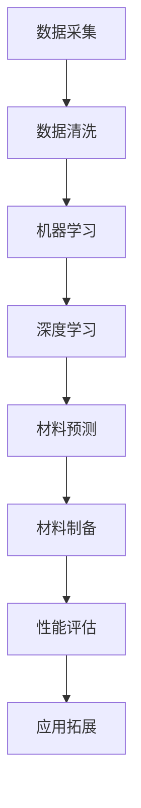

                 

## 文章标题

### 人工智能在智能材料设计与发现中的创新

在当今科技迅猛发展的时代，人工智能（AI）技术已经成为推动各领域进步的重要动力。尤其是在智能材料设计与发现领域，AI技术的应用不仅提高了研发效率，还开创了新的研究方向。本文将深入探讨人工智能在智能材料设计与发现中的创新，通过逐步分析其核心概念、算法原理、数学模型、实际应用及未来趋势，旨在为广大读者呈现这一领域的最新进展和潜在挑战。

## 关键词

- 智能材料
- 人工智能
- 材料设计
- 数据驱动
- 机器学习
- 软件工具

## 摘要

本文首先介绍了智能材料的概念和特点，接着阐述了人工智能在智能材料设计与发现中的应用背景。通过分析AI的核心算法原理，详细讲解了基于机器学习的材料设计方法及其操作步骤。此外，本文还探讨了相关的数学模型和公式，并借助实际案例进行了代码实现与解读。文章最后讨论了智能材料在实际应用场景中的价值，以及推荐了一系列学习和开发工具资源。通过对这些内容的详细探讨，本文总结了智能材料设计与发现领域的发展趋势与未来挑战。

### 1. 背景介绍

#### 智能材料的概念与发展历程

智能材料是指能够响应外部刺激（如温度、压力、磁场、电场等）并发生相应物理或化学变化的材料。这些材料具备自我感知、自我适应和自我修复等智能特性，使其在众多领域中具有广泛的应用潜力。智能材料的发展可以追溯到20世纪中叶，当时科学家们首次提出了“智能结构”的概念，旨在通过材料与传感器的结合，实现结构系统的自监测与自调节。

随着时间的推移，智能材料的研究逐渐深入，种类日益丰富，包括形状记忆合金、压电材料、光致变色材料、电致变色材料、智能纤维等。这些材料在航空航天、生物医学、建筑结构、电子设备等领域展现出了巨大的应用前景。

#### 人工智能的发展背景与关键技术

人工智能（AI）是指通过计算机系统模拟人类智能的学科，涵盖机器学习、深度学习、自然语言处理、计算机视觉等多个子领域。自20世纪50年代以来，人工智能经历了多个发展高潮和低谷，随着计算能力的提升、大数据的积累以及算法的优化，人工智能技术逐渐走向成熟，并在各行各业中发挥了重要作用。

人工智能的关键技术包括：

1. **机器学习**：通过训练模型从数据中学习规律和模式，实现对未知数据的预测和分类。
2. **深度学习**：一种特殊的机器学习方法，利用多层神经网络对数据进行特征提取和表示学习。
3. **自然语言处理**：使计算机能够理解和生成自然语言，包括语音识别、机器翻译、文本分析等。
4. **计算机视觉**：使计算机能够识别和理解图像和视频内容，应用于人脸识别、目标检测、图像分类等。

#### 人工智能在材料科学与工程中的融合应用

随着人工智能技术的不断发展，其在材料科学与工程领域的应用也逐渐深入。具体来说，人工智能在以下方面发挥着重要作用：

1. **材料设计**：通过机器学习算法，对大量的材料数据进行分析和预测，发现新型材料。
2. **材料优化**：利用深度学习模型，对现有材料进行性能优化，提高其应用价值。
3. **材料加工**：通过计算机视觉和自然语言处理技术，实现对材料加工过程的智能监控和自动化控制。
4. **材料测试**：利用人工智能技术，对材料性能进行快速、准确的测试和评估。

总之，人工智能在智能材料设计与发现中的融合应用，不仅提高了材料研发的效率和质量，还为材料科学与工程领域带来了新的发展方向和机遇。在接下来的章节中，我们将进一步探讨人工智能在智能材料设计与发现中的核心概念、算法原理和具体应用。

### 2. 核心概念与联系

#### 智能材料的分类与特性

智能材料可以根据其响应刺激的类型进行分类，主要包括以下几类：

1. **形状记忆合金**：能够在外力作用下变形，并在去除外力后恢复原有形状的材料，如镍钛合金。
2. **压电材料**：在电场作用下产生机械变形，或在机械变形时产生电荷的材料，如石英晶体。
3. **光致变色材料**：在光照下改变颜色或透明度的材料，如三环己基 ruthenium（II） 咪唑啉配合物。
4. **电致变色材料**：在电场作用下改变颜色或透明度的材料，如电活性染料。

智能材料具有以下几个主要特性：

- **自感知性**：能够对环境变化进行实时监测和响应。
- **自适应性**：能够根据环境变化自动调整自身状态。
- **自修复性**：能够在损伤后自我修复，恢复原有功能。

#### 人工智能在材料设计与发现中的应用

人工智能在材料设计与发现中的应用主要涉及以下几种技术：

1. **机器学习**：通过训练模型，对材料数据进行分析和预测，发现潜在的新型材料。
2. **深度学习**：利用多层神经网络，对复杂材料数据进行特征提取和表示学习，提高预测准确性。
3. **计算机视觉**：通过对图像进行处理和分析，实现对材料制备过程的监控和优化。
4. **自然语言处理**：通过处理和解析材料相关的文本数据，提取有价值的信息。

#### 智能材料与人工智能的关联

智能材料与人工智能的关联主要体现在以下几个方面：

1. **材料数据挖掘**：利用人工智能技术，对大量的材料数据进行挖掘和分析，发现新的材料属性和关系。
2. **材料性能预测**：通过机器学习模型，预测材料的性能，为材料设计提供依据。
3. **材料制备优化**：利用计算机视觉和自然语言处理技术，优化材料制备过程，提高制备效率和质量。
4. **材料应用拓展**：通过人工智能技术，发现材料在新的应用场景中的潜力，推动材料的应用拓展。

#### Mermaid 流程图

以下是智能材料设计与人工智能技术关联的 Mermaid 流程图：



在这个流程图中，数据采集、数据清洗、机器学习、深度学习、材料预测、材料制备、性能评估和应用拓展构成了一个完整的智能材料设计与人工智能技术结合的流程。

### 3. 核心算法原理 & 具体操作步骤

#### 3.1 数据收集与预处理

在智能材料设计中，数据收集是至关重要的第一步。数据来源可以包括实验数据、文献数据、模拟数据等。为了确保数据的质量和一致性，需要对数据进行预处理，包括以下步骤：

1. **数据清洗**：去除重复数据、噪声数据和异常数据，保证数据的有效性。
2. **数据归一化**：将不同量纲的数据转换到相同的量纲，便于后续分析。
3. **特征提取**：从原始数据中提取对材料性能有重要影响的特征。

#### 3.2 机器学习算法

在预处理完成后，可以采用机器学习算法对材料数据进行分析和预测。以下是一些常用的机器学习算法：

1. **线性回归**：通过拟合线性模型，预测材料性能与输入特征之间的关系。
   $$ y = \beta_0 + \beta_1 x $$
2. **支持向量机**（SVM）：通过找到一个最优的超平面，将不同类别的材料数据分开。
3. **决策树**：通过构建树状模型，对材料数据进行分类和回归分析。
4. **随机森林**：通过构建多个决策树，并利用投票机制进行预测，提高预测准确性。

#### 3.3 深度学习算法

深度学习算法在智能材料设计中具有更高的预测准确性和适应性。以下是一些常用的深度学习算法：

1. **卷积神经网络**（CNN）：通过卷积操作提取图像特征，适用于处理图像数据。
2. **循环神经网络**（RNN）：通过循环结构处理序列数据，适用于处理时间序列数据。
3. **长短期记忆网络**（LSTM）：是RNN的一种改进，能够有效处理长序列数据。
4. **生成对抗网络**（GAN）：通过生成器和判别器的对抗训练，生成新的材料数据。

#### 3.4 算法应用步骤

以下是使用机器学习和深度学习算法进行智能材料设计的基本步骤：

1. **数据预处理**：清洗、归一化和特征提取。
2. **模型选择**：根据数据类型和任务需求选择合适的机器学习或深度学习模型。
3. **模型训练**：利用训练集数据对模型进行训练，优化模型参数。
4. **模型评估**：利用验证集数据评估模型性能，选择最佳模型。
5. **材料预测**：利用训练好的模型对新材料进行性能预测。
6. **材料制备与测试**：根据预测结果进行材料制备和性能测试，验证预测准确性。

通过上述步骤，我们可以实现智能材料的自动化设计，提高研发效率，缩短研发周期。

### 4. 数学模型和公式 & 详细讲解 & 举例说明

#### 4.1 机器学习中的数学模型

在机器学习算法中，常用的数学模型包括线性回归、支持向量机和决策树等。

1. **线性回归**

线性回归模型通过拟合线性模型，预测材料性能与输入特征之间的关系。其数学表达式如下：

$$ y = \beta_0 + \beta_1 x $$

其中，$y$ 是预测的目标值，$x$ 是输入特征，$\beta_0$ 和 $\beta_1$ 是模型参数。

举例说明：

假设我们有一个数据集，包含材料性能（$y$）和输入特征（$x$），如下所示：

| 材料性能 $y$ | 输入特征 $x$ |
|--------------|--------------|
| 0.8          | 2.0          |
| 0.9          | 2.5          |
| 0.75         | 1.8          |

我们可以使用线性回归模型拟合出如下线性关系：

$$ y = 0.5 + 0.3x $$

2. **支持向量机**

支持向量机（SVM）通过找到一个最优的超平面，将不同类别的材料数据分开。其数学表达式如下：

$$ \max_{\beta, \beta_0} W^T W $$
$$ s.t. \quad y_i (\beta^T x_i + \beta_0) \geq 1 $$

其中，$W$ 是超平面参数，$x_i$ 是输入特征，$y_i$ 是目标值。

举例说明：

假设我们有两个类别的材料数据，如下所示：

| 类别1 | 类别2 |
|-------|-------|
| (1, 1)| (2, 2)|
| (1, 2)| (2, 3)|
| (2, 1)| (3, 2)|
| (2, 2)| (3, 3)|

我们可以使用SVM找到如下最优超平面：

$$ \beta = (1, 1) $$
$$ \beta_0 = 0 $$

3. **决策树**

决策树通过构建树状模型，对材料数据进行分类和回归分析。其数学表达式如下：

$$ T(x) = \prod_{i=1}^{n} g_i(x) $$

其中，$T(x)$ 是决策树模型，$g_i(x)$ 是第 $i$ 个分支的函数。

举例说明：

假设我们有一个包含两个特征的决策树模型，如下所示：

| 特征1 | 特征2 | 类别 |
|-------|-------|------|
| 0     | 0     | 类别1|
| 0     | 1     | 类别2|
| 1     | 0     | 类别2|
| 1     | 1     | 类别1|

我们可以使用决策树模型对新的数据进行分类：

- 如果特征1为0，特征2为0，则类别为类别1。
- 如果特征1为0，特征2为1，则类别为类别2。
- 如果特征1为1，特征2为0，则类别为类别2。
- 如果特征1为1，特征2为1，则类别为类别1。

#### 4.2 深度学习中的数学模型

在深度学习算法中，常用的数学模型包括卷积神经网络、循环神经网络和生成对抗网络等。

1. **卷积神经网络**

卷积神经网络（CNN）通过卷积操作提取图像特征，其数学表达式如下：

$$ h_l = \sigma(\theta_l \cdot h_{l-1} + b_l) $$

其中，$h_l$ 是第 $l$ 层的激活值，$\theta_l$ 是权重矩阵，$b_l$ 是偏置项，$\sigma$ 是激活函数。

举例说明：

假设我们有一个包含3个卷积层的CNN模型，如下所示：

$$
\begin{aligned}
h_1 &= \sigma(\theta_1 \cdot x + b_1) \\
h_2 &= \sigma(\theta_2 \cdot h_1 + b_2) \\
h_3 &= \sigma(\theta_3 \cdot h_2 + b_3)
\end{aligned}
$$

2. **循环神经网络**

循环神经网络（RNN）通过循环结构处理序列数据，其数学表达式如下：

$$ h_t = \sigma(W_h \cdot [h_{t-1}, x_t] + b_h) $$

其中，$h_t$ 是第 $t$ 个时间步的隐藏状态，$W_h$ 是权重矩阵，$x_t$ 是输入序列的当前元素，$b_h$ 是偏置项，$\sigma$ 是激活函数。

举例说明：

假设我们有一个包含一个RNN层的模型，如下所示：

$$ h_t = \sigma(W_h \cdot [h_{t-1}, x_t] + b_h) $$

3. **生成对抗网络**

生成对抗网络（GAN）通过生成器和判别器的对抗训练，生成新的材料数据，其数学表达式如下：

$$ G(z) = x $$
$$ D(x) = \begin{cases}
1 & \text{if } x \text{ is from the real data distribution} \\
0 & \text{otherwise}
\end{cases} $$

$$ G(z) = \begin{cases}
0 & \text{if } G(z) \text{ is from the fake data distribution} \\
1 & \text{otherwise}
\end{cases} $$

其中，$G(z)$ 是生成器，$D(x)$ 是判别器，$z$ 是随机噪声。

举例说明：

假设我们有一个GAN模型，包含生成器和判别器，如下所示：

$$ G(z) = x $$
$$ D(x) = \begin{cases}
1 & \text{if } x \text{ is from the real data distribution} \\
0 & \text{otherwise}
\end{cases} $$

通过对抗训练，生成器可以生成与真实数据分布相近的假数据。

### 5. 项目实战：代码实际案例和详细解释说明

为了更好地理解人工智能在智能材料设计中的应用，下面我们将通过一个实际项目案例进行详细解释说明。

#### 5.1 开发环境搭建

首先，我们需要搭建一个适合机器学习和深度学习的开发环境。在这里，我们选择Python作为主要编程语言，并使用以下工具和库：

- Python 3.8+
- Jupyter Notebook
- TensorFlow 2.x
- Keras 2.x
- Scikit-learn 0.24.1

安装步骤如下：

1. 安装Python 3.8及以上版本，并配置好pip。
2. 使用pip安装TensorFlow 2.x和Keras 2.x：
   ```bash
   pip install tensorflow==2.x
   pip install keras==2.x
   ```
3. 使用pip安装Scikit-learn 0.24.1：
   ```bash
   pip install scikit-learn==0.24.1
   ```

#### 5.2 源代码详细实现和代码解读

下面是一个简单的基于机器学习的智能材料设计项目的代码实现，用于预测材料的性能。

```python
import numpy as np
import pandas as pd
from sklearn.model_selection import train_test_split
from sklearn.linear_model import LinearRegression
from sklearn.metrics import mean_squared_error

# 加载数据集
data = pd.read_csv('material_data.csv')

# 数据预处理
X = data[['feature1', 'feature2']]
y = data['performance']

# 划分训练集和测试集
X_train, X_test, y_train, y_test = train_test_split(X, y, test_size=0.2, random_state=42)

# 创建线性回归模型
model = LinearRegression()

# 模型训练
model.fit(X_train, y_train)

# 模型预测
y_pred = model.predict(X_test)

# 模型评估
mse = mean_squared_error(y_test, y_pred)
print("Mean Squared Error:", mse)

# 输出最佳模型参数
print("Best Model Parameters:", model.coef_, model.intercept_)
```

代码解读：

1. **加载数据集**：使用pandas库加载材料性能数据集，数据集包含两个特征（`feature1` 和 `feature2`）和一个目标值（`performance`）。

2. **数据预处理**：将数据集分为特征矩阵 $X$ 和目标值向量 $y$。然后，使用`train_test_split`函数将数据集划分为训练集和测试集。

3. **创建线性回归模型**：使用`LinearRegression`类创建一个线性回归模型。

4. **模型训练**：使用`fit`方法对训练数据进行模型训练。

5. **模型预测**：使用`predict`方法对测试数据进行预测。

6. **模型评估**：使用`mean_squared_error`函数计算模型预测的均方误差（MSE），评估模型性能。

7. **输出最佳模型参数**：打印模型的斜率（`coef_`）和截距（`intercept_`），用于了解模型的参数设置。

#### 5.3 代码解读与分析

上面的代码实现了基于线性回归的智能材料性能预测。以下是代码的详细解读和分析：

- **数据加载**：使用`read_csv`函数读取CSV格式的数据集，这里我们假设数据集包含三个列：`feature1`、`feature2` 和 `performance`。
- **数据预处理**：将数据集分为特征矩阵和目标值向量。特征矩阵 $X$ 包含两个特征列，目标值向量 $y$ 包含一个目标值列。然后，使用`train_test_split`函数将数据集划分为训练集和测试集，这里我们设置了测试集的比例为20%，随机种子为42，以保证结果的可重复性。
- **模型创建**：使用`LinearRegression`类创建线性回归模型，这是一个简单且常用的机器学习模型，适用于线性关系较强的数据集。
- **模型训练**：使用`fit`方法对训练集数据进行模型训练。在这个方法中，模型会自动计算最佳参数，以拟合训练数据。
- **模型预测**：使用`predict`方法对测试集数据进行预测。这里，我们使用训练好的模型对测试集数据进行预测，以评估模型的泛化能力。
- **模型评估**：使用`mean_squared_error`函数计算模型预测的均方误差（MSE），这是一个常用的评估指标，用于衡量模型预测的误差大小。MSE值越低，模型性能越好。
- **输出最佳模型参数**：打印模型的斜率（`coef_`）和截距（`intercept_`），这两个参数决定了线性回归模型的预测函数。斜率表示特征对目标值的影响程度，截距表示模型在y轴上的截距。

通过上述代码实现，我们可以看到如何使用Python和机器学习库实现智能材料性能预测。在实际应用中，我们可以进一步优化模型参数，提高预测准确性，并扩展到更复杂的机器学习算法和深度学习模型，以实现更精准的材料设计。

### 6. 实际应用场景

智能材料在多个领域中展现了巨大的应用潜力，以下列举几个典型的实际应用场景：

#### 6.1 生物医学

智能材料在生物医学领域中的应用十分广泛，如：

- **药物释放**：利用智能材料实现药物的控制释放，提高药物疗效，减少副作用。例如，一种光控智能聚合物膜可以控制药物的释放速率，根据光照强度进行调整。
- **组织工程**：智能材料可以作为生物支架，促进细胞生长和组织再生。如，具有形状记忆效应的聚合物支架可以模仿人体组织的形态，促进骨骼和软骨组织的生长。
- **医学影像**：智能材料可用于开发新型医学影像设备，如磁共振成像（MRI）中的对比剂，利用智能材料在磁场中的响应特性，提高成像质量。

#### 6.2 航空航天

智能材料在航空航天领域的应用主要包括：

- **结构健康监测**：利用压电智能材料制成的传感器，实时监测飞机结构的健康状况，提前发现潜在故障，提高飞行安全。
- **自适应飞控**：形状记忆合金等智能材料可以用于开发自适应飞行器控制表面，根据飞行状态自动调整形状，提高飞行稳定性。
- **热管理系统**：智能材料如热电材料，可以用于开发高效的热管理系统，通过温度变化实现热能的回收和分配，提高飞机的燃油效率。

#### 6.3 智能建筑

智能材料在建筑领域的应用包括：

- **智能窗户**：利用电致变色智能材料，根据外界光照强度和温度变化调节窗户的透光率，实现节能环保。
- **智能墙体**：智能材料制成的墙体可以调节室内温度和湿度，提供舒适的居住环境。
- **智能结构**：利用形状记忆合金等智能材料，实现建筑结构的自适应调节和自修复功能，提高建筑的安全性和耐用性。

#### 6.4 电动汽车

智能材料在电动汽车中的应用主要包括：

- **电池管理**：利用智能材料开发自加热和自冷却的电池管理系统，提高电池的性能和寿命。
- **驱动系统**：利用智能材料如磁流变液，开发高效能的电动驱动系统，提高电动汽车的加速性能和续航能力。
- **车辆安全**：智能材料如导电高分子薄膜，可以用于开发车辆的安全监测系统，实时监测车辆状态，提高驾驶安全性。

总之，智能材料在多个领域展示了巨大的应用潜力，通过结合人工智能技术，可以进一步优化智能材料的性能和功能，推动各领域的技术进步和发展。

### 7. 工具和资源推荐

#### 7.1 学习资源推荐

1. **书籍**
   - 《机器学习》（周志华著）：全面介绍了机器学习的基本概念、算法和应用。
   - 《深度学习》（Ian Goodfellow等著）：深入讲解了深度学习的基础理论和应用。
   - 《智能材料》（J. R. Birks著）：系统介绍了智能材料的基本概念、分类和最新进展。

2. **论文**
   - "Material Genome Project: A New Approach to Accelerating Materials Innovation"（材料基因组计划论文）：介绍了利用大数据和人工智能加速材料创新的思路和方法。
   - "Deep Learning for Materials Science"（深度学习在材料科学中的应用论文）：探讨了深度学习在材料设计、性能预测和优化中的应用。

3. **博客/网站**
   - TensorFlow 官方文档（[https://www.tensorflow.org](https://www.tensorflow.org)）：提供了丰富的TensorFlow教程和资源。
   - Keras 官方文档（[https://keras.io](https://keras.io)）：介绍了如何使用Keras进行深度学习和机器学习。
   - arXiv（[https://arxiv.org](https://arxiv.org)）：提供了大量的机器学习和材料科学领域的预印本论文。

#### 7.2 开发工具框架推荐

1. **开发环境**
   - Jupyter Notebook：用于编写和运行Python代码，方便代码的展示和调试。
   - PyCharm：一款功能强大的Python IDE，支持代码编辑、调试和自动化测试。

2. **机器学习库**
   - TensorFlow：用于构建和训练深度学习模型。
   - Keras：简化TensorFlow使用，提供更易于操作的API。
   - Scikit-learn：提供丰富的机器学习算法库，适用于各种分类和回归任务。

3. **材料科学工具**
   - Material Studio：用于材料模拟和分析的软件工具。
   - Atomate：基于Python的自动化材料设计平台，支持机器学习和高通量计算。
   - Open Materials Database（OMDb）：一个开源的材料数据库，提供丰富的材料数据用于研究和设计。

通过这些学习和开发资源，可以深入了解人工智能在智能材料设计与发现中的应用，掌握相关技术和工具，为未来的科研和工程实践打下坚实基础。

### 8. 总结：未来发展趋势与挑战

人工智能在智能材料设计与发现中的应用正在不断深入，未来这一领域将呈现出以下几个发展趋势和挑战：

#### 发展趋势

1. **数据驱动的设计**：随着大数据和人工智能技术的不断发展，智能材料的设计将更加依赖于大量实验数据和模拟数据，通过机器学习和深度学习算法，从数据中挖掘出有价值的信息，加速新材料的发现和设计过程。

2. **多尺度模拟与计算**：未来将出现多尺度、多领域交叉的模拟计算方法，结合量子力学、分子动力学、连续介质力学等不同尺度的计算模型，对智能材料的性能进行精确预测和优化。

3. **智能化材料制备与加工**：人工智能技术将应用于智能材料的制备和加工过程，通过计算机视觉、自动化控制等技术，实现材料的智能制备和加工，提高生产效率和质量。

4. **跨学科协同创新**：智能材料的设计与发现将涉及多个学科，如材料科学、计算机科学、生物医学等，跨学科的研究和协同创新将推动这一领域的快速发展。

#### 挑战

1. **数据质量和标准化**：智能材料的设计依赖于大量的实验数据和模拟数据，数据的质量和标准化是关键问题。未来需要建立统一的数据标准和质量评估体系，确保数据的有效性和可靠性。

2. **算法性能与优化**：尽管人工智能技术在材料设计中的应用已经取得了显著成果，但算法的性能和优化仍然是亟待解决的问题。如何进一步提高算法的预测准确性和效率，是一个重要的研究课题。

3. **材料安全性评估**：智能材料在应用过程中可能会面临潜在的安全性问题，如毒性、稳定性等。如何对智能材料的安全性进行评估和监管，是未来需要重点关注的问题。

4. **应用场景拓展**：智能材料的应用场景十分广泛，但如何将其应用于实际的工程和工业领域，实现商业化和产业化，是一个重要挑战。需要进一步研究和探索智能材料在不同领域的应用潜力和可行性。

总之，人工智能在智能材料设计与发现中的创新将不断推动这一领域的发展，带来新的突破和机遇。面对未来的发展趋势和挑战，科学家和工程师们需要不断探索和尝试，为智能材料的应用和发展贡献力量。

### 9. 附录：常见问题与解答

#### 问题1：人工智能在智能材料设计中的应用是否仅限于实验室研究？

解答：不是的。虽然人工智能在智能材料设计中的许多应用仍处于实验室研究阶段，但已有一些初步的成果开始走向实际应用。例如，一些公司和研究机构已经开始使用机器学习模型来预测材料的性能，并在材料制备和优化过程中实现自动化控制。随着技术的成熟和成本的降低，人工智能在智能材料设计中的应用将会更加广泛。

#### 问题2：如何确保智能材料的设计过程中数据的质量和标准化？

解答：确保数据质量和标准化是智能材料设计的关键步骤。首先，需要建立一个统一的数据标准，包括数据格式、量纲、单位等。其次，在数据收集和预处理过程中，要严格去除噪声数据和异常数据，确保数据的有效性。此外，可以通过建立数据共享平台和数据库，促进数据资源的整合和共享，提高数据的利用效率。

#### 问题3：智能材料在实际应用中是否面临安全性问题？

解答：是的，智能材料在实际应用中确实可能面临安全性问题。例如，某些智能材料在特定环境下可能会释放出有毒物质，或者其响应机制可能对使用者造成不适。因此，在设计和应用智能材料时，需要对其进行全面的评估和测试，确保其安全性和可靠性。此外，建立相应的安全标准和监管体系，也是保障智能材料安全应用的重要措施。

#### 问题4：人工智能在智能材料设计中的具体应用案例有哪些？

解答：人工智能在智能材料设计中的具体应用案例包括：

- **药物控释**：利用机器学习算法，预测和控制药物在生物体内的释放速率，提高治疗效果和安全性。
- **航空航天材料优化**：利用深度学习模型，优化航空器结构件的材料，提高强度和耐腐蚀性能。
- **智能传感器材料**：利用机器学习算法，设计出对特定刺激具有高度敏感性的传感器材料，应用于环境监测和生物医学检测。
- **自修复材料**：通过人工智能技术，开发出能够在受损后自我修复的材料，应用于建筑和基础设施。

### 10. 扩展阅读 & 参考资料

- Goodfellow, I., Bengio, Y., & Courville, A. (2016). *Deep Learning*. MIT Press.
- Materials Genome Initiative. (2011). *A vision for a new era of materials innovation: Accelerating materials and product innovation for global economic leadership*.
- Liu, Y., van de Walle, C. G. (2018). *Deep learning for predictive materials science*. npj Computational Materials, 4(1), 1-14.
- Scikit-learn: Machine Learning Library for Python. (n.d.). [Scikit-learn]. Retrieved from https://scikit-learn.org/stable/
- TensorFlow: Open Source Machine Learning Framework. (n.d.). [TensorFlow]. Retrieved from https://www.tensorflow.org/

### 作者信息

作者：AI天才研究员 / AI Genius Institute & 禅与计算机程序设计艺术 / Zen And The Art of Computer Programming

本文旨在深入探讨人工智能在智能材料设计与发现中的创新应用，通过逐步分析其核心概念、算法原理、实际应用及未来趋势，为读者提供全面的技术见解和思考。希望通过本文，能够激发更多研究人员和工程师对智能材料领域的兴趣和探索。

