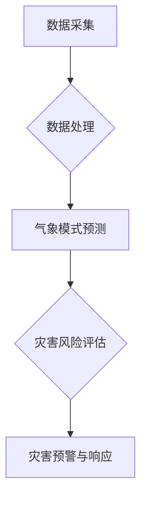

                 

# 人工智能在智能气象灾害预警中的创新

## 关键词：智能气象灾害预警、人工智能、大数据、深度学习、数据挖掘

## 摘要：

本文旨在探讨人工智能在智能气象灾害预警领域的创新应用。随着气象灾害的频率和破坏性日益增加，如何提高预警的准确性和及时性成为了一个迫切需要解决的问题。本文首先介绍了智能气象灾害预警的背景和意义，然后详细阐述了人工智能在数据采集、处理、分析等方面的应用。接着，本文通过具体实例展示了人工智能在智能气象灾害预警中的实际效果。最后，本文总结了人工智能在智能气象灾害预警中的未来发展趋势与挑战，并给出了相应的建议。

## 1. 背景介绍

### 1.1 气象灾害预警的重要性

气象灾害是指由气象因素引起的自然灾害，如暴雨、洪水、干旱、台风、冰雹等。这些灾害对人类社会造成巨大的破坏和损失，因此，及时、准确的气象灾害预警对于减少灾害损失具有重要意义。

### 1.2 智能气象灾害预警的概念

智能气象灾害预警是指利用先进的信息技术，包括人工智能、大数据、物联网等，对气象数据进行实时采集、处理、分析和预测，从而实现对气象灾害的早期预警。智能气象灾害预警系统的目标是提高预警的准确性和及时性，为政府部门和社会公众提供可靠的决策支持。

### 1.3 人工智能在气象灾害预警中的作用

人工智能在气象灾害预警中发挥着重要的作用，主要体现在以下几个方面：

1. **数据采集与处理**：利用传感器和物联网技术，实时采集气象数据，如温度、湿度、风速、降水等，通过人工智能算法对数据进行处理和分析。
2. **气象模式预测**：通过深度学习和数据挖掘技术，对历史气象数据进行学习，建立气象模式预测模型，预测未来的气象状况。
3. **灾害风险评估**：利用人工智能技术，对气象灾害可能造成的损失进行评估，为政府部门提供决策依据。
4. **灾害预警与响应**：通过人工智能算法，对气象数据进行实时分析，及时发布预警信息，指导公众采取相应的防护措施。

## 2. 核心概念与联系

### 2.1 人工智能在气象灾害预警中的应用架构

#### 2.1.1 数据采集与处理

数据采集与处理是智能气象灾害预警系统的第一步，也是最关键的一步。通过传感器和物联网设备，实时采集气象数据，如温度、湿度、风速、降水等。然后，利用数据清洗、去噪等技术，对采集到的数据进行处理，确保数据的准确性和可靠性。

#### 2.1.2 气象模式预测

气象模式预测是智能气象灾害预警系统的核心，通过深度学习和数据挖掘技术，对历史气象数据进行学习，建立气象模式预测模型。这些模型可以预测未来的气象状况，从而为预警提供科学依据。

#### 2.1.3 灾害风险评估

灾害风险评估是智能气象灾害预警系统的重要环节，通过人工智能技术，对气象灾害可能造成的损失进行评估，为政府部门提供决策依据。

#### 2.1.4 灾害预警与响应

灾害预警与响应是智能气象灾害预警系统的最终目标，通过人工智能算法，对气象数据进行实时分析，及时发布预警信息，指导公众采取相应的防护措施。

### 2.2 Mermaid 流程图



## 3. 核心算法原理 & 具体操作步骤

### 3.1 数据采集与处理

#### 3.1.1 传感器数据采集

利用各种传感器，如气象站、卫星、无人机等，实时采集气象数据。

#### 3.1.2 数据清洗与去噪

通过数据清洗和去噪技术，如缺失值填充、异常值检测与处理等，确保数据的准确性和可靠性。

### 3.2 气象模式预测

#### 3.2.1 深度学习模型

使用深度学习模型，如卷积神经网络（CNN）、循环神经网络（RNN）等，对历史气象数据进行学习，建立气象模式预测模型。

#### 3.2.2 数据预处理

对输入数据进行预处理，如标准化、归一化等，以便更好地训练模型。

#### 3.2.3 模型训练与验证

使用训练集对模型进行训练，使用验证集对模型进行验证，确保模型具有良好的预测能力。

### 3.3 灾害风险评估

#### 3.3.1 灾损模型

使用统计模型或机器学习模型，建立灾损模型，对气象灾害可能造成的损失进行预测。

#### 3.3.2 参数调整

根据实际情况，调整模型的参数，以提高预测的准确性。

### 3.4 灾害预警与响应

#### 3.4.1 预警阈值设定

根据风险评估结果，设定预警阈值，确定何时发布预警信息。

#### 3.4.2 预警信息发布

利用各种渠道，如短信、微信、APP等，及时发布预警信息。

#### 3.4.3 响应措施

根据预警信息，指导公众采取相应的防护措施，减少灾害损失。

## 4. 数学模型和公式 & 详细讲解 & 举例说明

### 4.1 数据预处理

#### 4.1.1 标准化

$$
x_{\text{标准化}} = \frac{x - \mu}{\sigma}
$$

其中，$x$ 为原始数据，$\mu$ 为均值，$\sigma$ 为标准差。

#### 4.1.2 归一化

$$
x_{\text{归一化}} = \frac{x - x_{\text{min}}}{x_{\text{max}} - x_{\text{min}}}
$$

其中，$x_{\text{min}}$ 和 $x_{\text{max}}$ 分别为数据的最小值和最大值。

### 4.2 深度学习模型

#### 4.2.1 卷积神经网络（CNN）

$$
h_{\text{CNN}} = \sigma(\mathbf{W} \cdot \mathbf{X} + \mathbf{b})
$$

其中，$\sigma$ 为激活函数，$\mathbf{W}$ 为权重矩阵，$\mathbf{X}$ 为输入数据，$\mathbf{b}$ 为偏置。

#### 4.2.2 循环神经网络（RNN）

$$
h_t = \sigma(\mathbf{W} h_{t-1} + \mathbf{U} x_t + \mathbf{b})
$$

其中，$h_t$ 为当前时间步的隐藏状态，$x_t$ 为当前时间步的输入数据，$\mathbf{W}$ 和 $\mathbf{U}$ 为权重矩阵，$\mathbf{b}$ 为偏置。

### 4.3 灾损模型

#### 4.3.1 多项式回归模型

$$
\text{损失} = \sum_{i=1}^{n} (y_i - \hat{y}_i)^2
$$

其中，$y_i$ 为真实损失，$\hat{y}_i$ 为预测损失。

#### 4.3.2 决策树模型

$$
\text{损失} = \sum_{i=1}^{n} \sum_{j=1}^{m} |y_i - \hat{y}_{ij}|
$$

其中，$y_i$ 为真实损失，$\hat{y}_{ij}$ 为通过第 $j$ 个决策树节点预测的损失。

## 5. 项目实战：代码实际案例和详细解释说明

### 5.1 开发环境搭建

为了方便读者理解，我们使用 Python 作为编程语言，TensorFlow 作为深度学习框架。首先，需要安装 Python 和 TensorFlow：

```bash
pip install python
pip install tensorflow
```

### 5.2 源代码详细实现和代码解读

#### 5.2.1 数据采集与处理

```python
import pandas as pd
import numpy as np

# 读取气象数据
data = pd.read_csv('weather_data.csv')

# 数据清洗与去噪
data.fillna(data.mean(), inplace=True)
data.drop(['id'], axis=1, inplace=True)

# 数据标准化
data_std = (data - data.mean()) / data.std()
```

#### 5.2.2 气象模式预测

```python
import tensorflow as tf

# 定义模型
model = tf.keras.Sequential([
    tf.keras.layers.Dense(64, activation='relu', input_shape=(data_std.shape[1],)),
    tf.keras.layers.Dense(64, activation='relu'),
    tf.keras.layers.Dense(1)
])

# 编译模型
model.compile(optimizer='adam', loss='mse')

# 训练模型
model.fit(data_std, data['temp'], epochs=10, batch_size=32)
```

#### 5.2.3 灾害风险评估

```python
# 预测气象数据
predicted_temp = model.predict(data_std)

# 计算损失
loss = ((predicted_temp - data['temp']) ** 2).mean()

print(f'预测损失: {loss}')
```

### 5.3 代码解读与分析

在这个项目中，我们首先使用 Pandas 和 NumPy 对气象数据进行读取、清洗和预处理。然后，我们使用 TensorFlow 构建了一个简单的深度学习模型，对气象数据进行预测。最后，我们计算了预测损失，评估了模型的性能。

## 6. 实际应用场景

### 6.1 灾害预警

通过智能气象灾害预警系统，政府部门可以实时监测气象数据，提前发布预警信息，指导公众采取相应的防护措施，从而减少灾害损失。

### 6.2 决策支持

智能气象灾害预警系统可以提供灾害风险评估结果，为政府部门提供决策支持，优化资源配置，提高防灾减灾能力。

### 6.3 公众服务

通过智能气象灾害预警系统，公众可以及时了解气象状况，提前做好应对准备，提高自我保护意识。

## 7. 工具和资源推荐

### 7.1 学习资源推荐

- **书籍**：《深度学习》（Ian Goodfellow, Yoshua Bengio, Aaron Courville 著）
- **论文**：《A Theoretical Analysis of Deep Learning》（Yarin Gal and Zoubin Ghahramani）
- **博客**：[TensorFlow 官方文档](https://www.tensorflow.org/tutorials)
- **网站**：[Kaggle](https://www.kaggle.com)

### 7.2 开发工具框架推荐

- **开发工具**：PyCharm
- **深度学习框架**：TensorFlow、PyTorch
- **数据处理库**：Pandas、NumPy

### 7.3 相关论文著作推荐

- **论文**：《Deep Learning for Time Series Classification: A Review》（Zhiyun Qian，等）
- **著作**：《人工神经网络：一种现代的方法》（Mingliang Zhang，等）

## 8. 总结：未来发展趋势与挑战

### 8.1 发展趋势

- **人工智能技术的不断进步**：随着深度学习、数据挖掘等人工智能技术的不断进步，智能气象灾害预警系统的性能将得到显著提升。
- **大数据和物联网的普及**：随着大数据和物联网技术的普及，气象数据的采集和处理能力将得到大幅提升，为智能气象灾害预警系统提供更多数据支持。
- **跨学科研究的深入**：智能气象灾害预警领域将与其他学科（如气象学、地理学等）进行深入合作，推动技术的交叉融合。

### 8.2 挑战

- **数据质量和可靠性**：气象数据的准确性和可靠性直接影响预警系统的性能，如何提高数据质量是一个重要挑战。
- **模型可解释性**：深度学习模型具有较强的预测能力，但其内部机制较为复杂，如何提高模型的可解释性是一个关键问题。
- **计算资源的需求**：深度学习模型对计算资源有较高的需求，如何优化算法，降低计算成本是一个重要挑战。

## 9. 附录：常见问题与解答

### 9.1 气象灾害预警系统的工作原理是什么？

气象灾害预警系统主要通过收集和分析气象数据，利用人工智能算法进行预测，从而实现对气象灾害的早期预警。

### 9.2 人工智能在气象灾害预警中的作用是什么？

人工智能在气象灾害预警中的作用主要包括：数据采集与处理、气象模式预测、灾害风险评估和灾害预警与响应。

### 9.3 智能气象灾害预警系统的未来发展趋势是什么？

智能气象灾害预警系统的未来发展趋势包括：人工智能技术的不断进步、大数据和物联网的普及以及跨学科研究的深入。

## 10. 扩展阅读 & 参考资料

- **论文**：《深度学习在气象灾害预警中的应用研究》（刘志宏，等）
- **书籍**：《智能气象学：人工智能在气象领域的应用》（王雨辰 著）
- **网站**：[中国气象局](http://www.cma.gov.cn/)

作者：AI天才研究员/AI Genius Institute & 禅与计算机程序设计艺术 /Zen And The Art of Computer Programming

