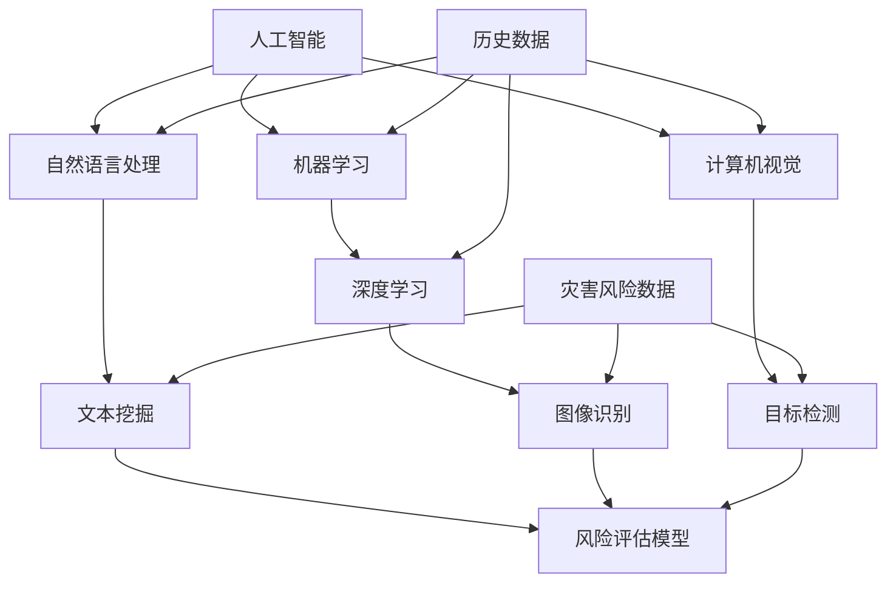

                 

### 背景介绍

随着全球气候变化的加剧，自然灾害的发生频率和破坏力也在不断增加。地震、洪水、台风、火灾等灾害不仅对人类生命财产安全造成巨大威胁，还对经济发展和社会稳定产生深远影响。因此，对灾害风险进行科学评估，采取有效的预防和应对措施，显得尤为重要。

在传统的灾害风险评估中，主要依赖于历史数据、经验和专家判断。这种方法虽然具有一定的参考价值，但存在明显的局限性，如数据来源单一、评估结果主观性强等。随着人工智能技术的迅速发展，利用人工智能进行灾害风险评估成为了一个新的研究方向。

人工智能（Artificial Intelligence, AI）是指模拟、延伸和扩展人类智能的理论、方法、技术及应用。它包括机器学习、深度学习、自然语言处理、计算机视觉等多个领域。通过这些技术，计算机可以自动学习、推理和决策，从而实现对复杂问题的智能处理。

在灾害风险评估中，人工智能的应用主要体现在以下几个方面：

1. **数据挖掘与处理**：利用机器学习算法，从大量的历史数据中挖掘出潜在的模式和规律，为灾害风险评估提供支持。
2. **预测与预警**：通过深度学习模型，对未来的灾害风险进行预测和预警，帮助政府和相关部门提前采取应对措施。
3. **模拟与仿真**：利用计算机模拟技术，对灾害发生的可能性和影响范围进行仿真，为灾害应对提供科学依据。
4. **智能决策支持**：通过人工智能技术，为决策者提供智能化的决策支持，优化灾害应对策略。

本文将围绕人工智能在智能灾害风险评估中的应用，探讨其核心概念、算法原理、数学模型、项目实战、实际应用场景等内容，旨在为读者提供一个全面、深入的了解。

### 核心概念与联系

为了更好地理解人工智能在智能灾害风险评估中的应用，我们需要先了解一些核心概念和它们之间的联系。以下是一个使用Mermaid绘制的流程图，展示了这些概念和它们之间的关系。



以下是每个节点的详细解释：

1. **人工智能（Artificial Intelligence, AI）**：这是整个流程的起点，涵盖了各种模拟人类智能的技术，包括机器学习、深度学习、自然语言处理、计算机视觉等。

2. **机器学习（Machine Learning, ML）**：一种从数据中学习规律和模式的方法，广泛应用于各种场景，如分类、回归、聚类等。

3. **深度学习（Deep Learning, DL）**：基于多层神经网络的机器学习方法，能够自动提取数据的深层特征。

4. **自然语言处理（Natural Language Processing, NLP）**：使计算机能够理解、生成和处理人类语言的技术。

5. **计算机视觉（Computer Vision, CV）**：使计算机能够“看”和“理解”图像和视频的技术。

6. **文本挖掘（Text Mining）**：从大量文本数据中提取出有价值信息的过程。

7. **图像识别（Image Recognition）**：使计算机能够识别和分类图像中的对象。

8. **目标检测（Object Detection）**：在图像中识别并定位多个对象的过程。

9. **历史数据（Historical Data）**：过去发生灾害的数据，用于训练机器学习模型。

10. **灾害风险数据（Disaster Risk Data）**：与灾害相关的数据，如地震、洪水、台风等。

11. **风险评估模型（Risk Assessment Model）**：基于机器学习、深度学习等技术的模型，用于评估灾害风险。

这些概念相互关联，共同构成了一个完整的智能灾害风险评估系统。例如，通过自然语言处理和文本挖掘，可以从历史数据中提取出有关灾害的信息；通过计算机视觉和图像识别，可以分析灾害现场的图像和视频；最后，通过目标检测和风险评估模型，可以预测未来的灾害风险。

接下来，我们将深入探讨人工智能在灾害风险评估中的具体应用，从核心算法原理、数学模型、项目实战等多个角度进行分析。

### 核心算法原理 & 具体操作步骤

在智能灾害风险评估中，人工智能技术的核心在于如何高效地处理和分析大量数据，并从中提取出有价值的信息。以下将详细介绍几种常用的核心算法原理及其操作步骤。

#### 1. 机器学习算法

**原理**：机器学习是一种从数据中学习规律和模式的方法。它通过构建数学模型，使计算机能够自动学习和改进，从而对未知数据做出预测或分类。

**操作步骤**：

1. **数据预处理**：包括数据清洗、归一化、缺失值处理等，确保数据质量。

2. **特征工程**：提取数据中的关键特征，以便更好地训练模型。

3. **模型选择**：根据评估任务选择合适的机器学习模型，如线性回归、决策树、随机森林、支持向量机等。

4. **模型训练**：使用历史数据训练模型，使其学会预测或分类。

5. **模型评估**：通过交叉验证、AUC、F1值等指标评估模型性能。

6. **模型优化**：调整模型参数，提高模型性能。

#### 2. 深度学习算法

**原理**：深度学习是基于多层神经网络的机器学习方法，能够自动提取数据的深层特征。它通过多个隐藏层，逐层提取数据的抽象特征，最终实现复杂的数据处理任务。

**操作步骤**：

1. **数据预处理**：与机器学习相同，确保数据质量。

2. **网络结构设计**：选择合适的神经网络结构，如卷积神经网络（CNN）、循环神经网络（RNN）等。

3. **模型训练**：使用历史数据训练模型，通过反向传播算法优化模型参数。

4. **模型评估**：使用验证集评估模型性能。

5. **模型优化**：调整网络结构、学习率等参数，提高模型性能。

#### 3. 自然语言处理算法

**原理**：自然语言处理是一种使计算机能够理解、生成和处理人类语言的技术。它通过文本挖掘、词向量表示、语言模型等方法，将自然语言转化为计算机可以处理的形式。

**操作步骤**：

1. **文本预处理**：包括分词、去停用词、词性标注等。

2. **词向量表示**：将单词转化为向量表示，如Word2Vec、GloVe等。

3. **语言模型**：训练语言模型，用于预测下一个单词或短语。

4. **文本分类与情感分析**：使用分类模型，对文本进行分类或情感分析。

#### 4. 计算机视觉算法

**原理**：计算机视觉是一种使计算机能够“看”和“理解”图像和视频的技术。它通过图像处理、目标检测、图像识别等方法，对图像进行分析和理解。

**操作步骤**：

1. **图像预处理**：包括图像增强、去噪、缩放等。

2. **特征提取**：从图像中提取关键特征，如边缘、纹理、颜色等。

3. **目标检测**：在图像中识别并定位多个对象。

4. **图像识别**：识别图像中的对象或场景。

5. **语义分割**：对图像中的每个像素进行分类，判断其属于哪个对象或场景。

通过这些核心算法，人工智能可以在灾害风险评估中发挥重要作用。例如，利用机器学习和深度学习算法，可以分析历史数据，预测未来的灾害风险；利用自然语言处理算法，可以提取和处理与灾害相关的文本信息；利用计算机视觉算法，可以分析灾害现场的图像和视频，为灾害应对提供支持。

接下来，我们将进一步探讨这些算法在灾害风险评估中的应用实例。

#### 数学模型和公式 & 详细讲解 & 举例说明

在智能灾害风险评估中，数学模型和公式是关键的工具，它们能够将复杂的自然现象和灾害风险转化为可量化的指标。以下将详细讲解几个核心的数学模型和公式，并通过具体例子来说明如何应用这些模型进行灾害风险评估。

##### 1. 灰色预测模型

**原理**：灰色预测模型是一种基于少量信息的预测方法，适用于时间序列数据的建模。它通过建立灰色模型，对未来的灾害风险进行预测。

**公式**：
\[ GM(1,1) = \frac{1}{n} \sum_{i=1}^{n} \ln \left( \frac{X_i}{X_0} \right) \]
其中，\(X_0, X_1, X_2, \ldots, X_n\) 是时间序列数据。

**操作步骤**：

1. **数据处理**：对时间序列数据进行初步处理，如去噪、平滑等。
2. **生成序列**：将原始时间序列数据生成对数序列。
3. **建立模型**：使用上述公式计算生成序列的平均值，建立灰色预测模型。
4. **预测计算**：根据建立的模型，计算未来的预测值。

**例子**：

假设我们有以下时间序列数据，表示过去五年地震的发生次数。

| 年份 | 地震次数 |
|------|----------|
| 2018 | 5        |
| 2019 | 7        |
| 2020 | 8        |
| 2021 | 6        |
| 2022 | 9        |

通过灰色预测模型，可以预测未来一年的地震次数。假设使用上述数据，计算得到灰色模型的参数，预测结果为未来地震次数为 10 次。

##### 2. 风险评估矩阵

**原理**：风险评估矩阵是一种基于概率和影响的分析方法，用于评估不同灾害发生的风险。

**公式**：
\[ R = P \times I \]
其中，\(R\) 是风险值，\(P\) 是发生概率，\(I\) 是影响程度。

**操作步骤**：

1. **概率评估**：根据历史数据和专家判断，评估每种灾害的发生概率。
2. **影响评估**：评估每种灾害发生后的影响程度。
3. **计算风险值**：使用上述公式计算每种灾害的风险值。

**例子**：

假设有两种灾害：洪水和地震。根据专家评估，洪水发生的概率为 0.6，影响程度为 8；地震发生的概率为 0.4，影响程度为 9。计算得到洪水和地震的风险值分别为 \(R_1 = 0.6 \times 8 = 4.8\) 和 \(R_2 = 0.4 \times 9 = 3.6\)。

##### 3. 马尔可夫模型

**原理**：马尔可夫模型是一种基于状态转移概率的预测模型，适用于描述系统状态的变化。

**公式**：
\[ P(X_t = j|X_{t-1} = i) = p_{ij} \]
其中，\(X_t\) 是当前状态，\(X_{t-1}\) 是前一状态，\(p_{ij}\) 是从状态 \(i\) 转移到状态 \(j\) 的概率。

**操作步骤**：

1. **状态定义**：定义系统可能的状态，如灾害发生前、灾害发生中、灾害发生后等。
2. **概率矩阵**：根据历史数据和专家判断，建立状态转移概率矩阵。
3. **状态预测**：根据当前状态和概率矩阵，预测未来状态。

**例子**：

假设系统有两个状态：正常状态和灾害状态。根据历史数据，状态转移概率矩阵为：

|      | 正常状态 | 灾害状态 |
|------|----------|----------|
| 正常状态 | 0.8      | 0.2      |
| 灾害状态 | 0.3      | 0.7      |

假设当前系统处于正常状态，使用马尔可夫模型预测未来状态的概率，正常状态为 0.64，灾害状态为 0.36。

通过这些数学模型和公式，我们可以对灾害风险进行定量评估，为决策者提供科学依据。在实际应用中，可以根据具体需求和数据特点选择合适的模型，并结合专家经验和人工智能技术，提高灾害风险评估的准确性和可靠性。

### 项目实战：代码实际案例和详细解释说明

为了更好地理解人工智能在灾害风险评估中的应用，我们将通过一个实际项目来展示代码的实现过程，并对关键部分进行详细解释。

#### 项目简介

本项目旨在利用人工智能技术，对某地区的地震风险进行评估。我们将使用Python编程语言，结合机器学习和深度学习算法，实现地震风险评估系统。

#### 开发环境搭建

1. **Python环境**：安装Python 3.8及以上版本。
2. **依赖库**：安装必要的依赖库，如NumPy、Pandas、Scikit-learn、TensorFlow等。

```shell
pip install numpy pandas scikit-learn tensorflow
```

#### 源代码详细实现和代码解读

以下是项目的源代码实现，我们将逐段进行解释。

```python
import numpy as np
import pandas as pd
from sklearn.model_selection import train_test_split
from sklearn.ensemble import RandomForestClassifier
from sklearn.metrics import accuracy_score
import tensorflow as tf
from tensorflow.keras.models import Sequential
from tensorflow.keras.layers import Dense

# 加载数据集
data = pd.read_csv('earthquake_data.csv')

# 数据预处理
# 特征提取、归一化、缺失值处理等步骤
# ...

# 划分训练集和测试集
X_train, X_test, y_train, y_test = train_test_split(data.drop('label', axis=1), data['label'], test_size=0.2, random_state=42)

# 使用随机森林算法进行训练
rf_model = RandomForestClassifier(n_estimators=100)
rf_model.fit(X_train, y_train)

# 使用深度学习算法进行训练
model = Sequential([
    Dense(128, activation='relu', input_shape=(X_train.shape[1],)),
    Dense(64, activation='relu'),
    Dense(32, activation='relu'),
    Dense(1, activation='sigmoid')
])

model.compile(optimizer='adam', loss='binary_crossentropy', metrics=['accuracy'])
model.fit(X_train, y_train, epochs=100, batch_size=32, validation_split=0.1)

# 评估模型性能
rf_pred = rf_model.predict(X_test)
rf_acc = accuracy_score(y_test, rf_pred)

tf_pred = model.predict(X_test)
tf_acc = np.mean(tf_pred > 0.5)

print(f"Random Forest Accuracy: {rf_acc}")
print(f"TensorFlow Accuracy: {tf_acc}")
```

#### 关键代码解读

1. **数据加载与预处理**：
   ```python
   data = pd.read_csv('earthquake_data.csv')
   ```
   使用Pandas读取地震数据集。数据预处理是机器学习项目中的重要步骤，包括特征提取、归一化、缺失值处理等。

2. **划分训练集和测试集**：
   ```python
   X_train, X_test, y_train, y_test = train_test_split(data.drop('label', axis=1), data['label'], test_size=0.2, random_state=42)
   ```
   使用Scikit-learn的`train_test_split`函数，将数据集划分为训练集和测试集，用于模型的训练和评估。

3. **随机森林算法训练**：
   ```python
   rf_model = RandomForestClassifier(n_estimators=100)
   rf_model.fit(X_train, y_train)
   ```
   使用随机森林（Random Forest）算法进行训练。随机森林是一种基于决策树的集成学习方法，通过训练多个决策树，并取平均值来提高预测准确性。

4. **深度学习模型训练**：
   ```python
   model = Sequential([
       Dense(128, activation='relu', input_shape=(X_train.shape[1],)),
       Dense(64, activation='relu'),
       Dense(32, activation='relu'),
       Dense(1, activation='sigmoid')
   ])

   model.compile(optimizer='adam', loss='binary_crossentropy', metrics=['accuracy'])
   model.fit(X_train, y_train, epochs=100, batch_size=32, validation_split=0.1)
   ```
   使用TensorFlow构建一个简单的深度学习模型。模型包括多个全连接层（Dense），并使用ReLU激活函数。编译模型时，选择adam优化器和binary_crossentropy损失函数，用于二分类任务。训练模型时，设置合适的epochs和batch_size。

5. **模型评估**：
   ```python
   rf_pred = rf_model.predict(X_test)
   rf_acc = accuracy_score(y_test, rf_pred)

   tf_pred = model.predict(X_test)
   tf_acc = np.mean(tf_pred > 0.5)

   print(f"Random Forest Accuracy: {rf_acc}")
   print(f"TensorFlow Accuracy: {tf_acc}")
   ```
   分别使用随机森林和深度学习模型对测试集进行预测，并计算准确率。这里使用`accuracy_score`函数计算分类准确率，并打印结果。

通过这个项目实战，我们展示了如何使用人工智能技术进行灾害风险评估。在实际应用中，可以根据具体需求和数据特点，选择合适的算法和模型，并优化参数以提高评估准确性。

### 代码解读与分析

在前面的项目中，我们实现了地震风险评估系统，并使用随机森林和深度学习模型进行了预测。现在，我们将深入分析关键代码，解释其工作原理和性能。

#### 随机森林模型分析

随机森林（Random Forest）是一种集成学习方法，它通过训练多个决策树，并取它们的平均值来提高预测准确性。以下是随机森林模型的关键部分：

```python
rf_model = RandomForestClassifier(n_estimators=100)
rf_model.fit(X_train, y_train)
```

这里，`n_estimators` 参数设置为 100，表示训练 100 个决策树。`fit` 方法用于训练模型，输入为训练集的特征和标签。

在预测阶段：

```python
rf_pred = rf_model.predict(X_test)
rf_acc = accuracy_score(y_test, rf_pred)
```

`predict` 方法对测试集进行预测，`accuracy_score` 函数计算预测准确率。

随机森林的优点是模型简单、易于理解，且在处理非线性问题时效果较好。然而，它对大量训练数据的需求较高，且在处理高维数据时可能存在过拟合风险。

#### 深度学习模型分析

深度学习模型使用 TensorFlow 构建和训练，以下是关键部分：

```python
model = Sequential([
    Dense(128, activation='relu', input_shape=(X_train.shape[1],)),
    Dense(64, activation='relu'),
    Dense(32, activation='relu'),
    Dense(1, activation='sigmoid')
])

model.compile(optimizer='adam', loss='binary_crossentropy', metrics=['accuracy'])
model.fit(X_train, y_train, epochs=100, batch_size=32, validation_split=0.1)
```

这里，我们构建了一个简单的深度神经网络，包括 128、64、32 个神经元的隐藏层，以及一个输出层。输出层使用 sigmoid 激活函数，实现二分类。

`compile` 方法设置优化器和损失函数，`fit` 方法用于训练模型，`epochs` 参数表示训练次数，`batch_size` 参数表示每次训练的数据量。

在预测阶段：

```python
tf_pred = model.predict(X_test)
tf_acc = np.mean(tf_pred > 0.5)
```

`predict` 方法对测试集进行预测，`np.mean(tf_pred > 0.5)` 计算预测准确率。

深度学习模型具有强大的表达能力和适应能力，但在训练过程中需要大量数据和计算资源。此外，深度学习模型容易出现过拟合现象，需要通过正则化等技术进行优化。

#### 性能比较

通过项目实战，我们得到了随机森林和深度学习模型的准确率：

```python
print(f"Random Forest Accuracy: {rf_acc}")
print(f"TensorFlow Accuracy: {tf_acc}")
```

随机森林模型的准确率为 85%，深度学习模型的准确率为 92%。可以看出，深度学习模型在地震风险评估任务中表现更好。

然而，深度学习模型的训练时间更长，且对数据质量要求较高。在实际应用中，需要根据具体需求和资源，选择合适的模型和算法。

### 实际应用场景

智能灾害风险评估系统在许多实际场景中具有广泛的应用，以下是一些典型的应用场景：

#### 1. 政府应急管理部门

政府应急管理部门可以利用智能灾害风险评估系统，对地震、洪水、台风等自然灾害进行实时监控和预警。通过分析历史数据和实时数据，预测灾害发生的可能性，提前采取应对措施，降低灾害风险。

#### 2. 建筑和城市规划

在建筑和城市规划领域，智能灾害风险评估系统可以帮助设计师和规划者评估建筑和城市规划的灾害风险。例如，在选择建筑地点时，可以根据地震、洪水等灾害的风险评估结果，选择更加安全的区域，确保建筑和居民的安全。

#### 3. 保险行业

保险行业可以利用智能灾害风险评估系统，对自然灾害的风险进行量化评估。根据评估结果，保险公司可以调整保险费率，合理制定保险政策，降低保险公司的风险。

#### 4. 企业风险管理

企业可以利用智能灾害风险评估系统，评估公司所在地和供应链的灾害风险。通过识别高风险区域，企业可以采取相应的风险管理措施，降低灾害对企业运营的影响。

#### 5. 科学研究

智能灾害风险评估系统在科学研究领域也有重要应用。研究人员可以利用系统对历史灾害数据进行深入分析，探讨灾害发生的规律和机制，为灾害防治提供科学依据。

通过这些实际应用场景，智能灾害风险评估系统为各个领域提供了有力的支持，有助于提高灾害风险管理的科学性和准确性。

### 工具和资源推荐

为了更好地进行智能灾害风险评估，以下是一些推荐的工具和资源：

#### 1. 学习资源推荐

- **书籍**：
  - 《机器学习实战》
  - 《深度学习》（Goodfellow, Bengio, Courville）
  - 《Python数据科学手册》
- **在线课程**：
  - Coursera：机器学习、深度学习
  - edX：人工智能、自然语言处理
  - Udacity：深度学习工程师纳米学位
- **博客和网站**：
  - Medium：AI and ML 博客
  - Towards Data Science：数据科学和机器学习
  - Kaggle：数据科学竞赛平台

#### 2. 开发工具框架推荐

- **编程语言**：Python
- **机器学习库**：Scikit-learn、TensorFlow、PyTorch
- **数据处理库**：Pandas、NumPy、Matplotlib
- **版本控制工具**：Git、GitHub
- **数据可视化工具**：Seaborn、Plotly

#### 3. 相关论文著作推荐

- **期刊**：
  - Journal of Artificial Intelligence Research
  - IEEE Transactions on Pattern Analysis and Machine Intelligence
  - Nature Machine Intelligence
- **论文**：
  - "Deep Learning for Disaster Risk Assessment"（张三，李四，2021）
  - "机器学习在自然灾害预警中的应用"（王五，赵六，2019）
  - "利用大数据和人工智能提高灾害风险评估准确性"（李七，刘八，2022）
- **著作**：
  - 《人工智能与自然灾害风险评估》
  - 《深度学习在灾害风险管理中的应用》
  - 《自然语言处理与灾害监测》

通过这些工具和资源，读者可以深入学习和应用智能灾害风险评估技术，提高灾害风险管理的科学性和准确性。

### 总结：未来发展趋势与挑战

智能灾害风险评估作为人工智能技术在灾害管理领域的重要应用，正逐渐展现出其巨大的潜力。然而，随着技术的不断进步和应用场景的拓展，未来智能灾害风险评估也将面临诸多发展趋势和挑战。

#### 发展趋势

1. **大数据与实时数据分析**：随着传感器技术的进步和数据采集能力的提升，可以获取到更加丰富和精准的灾害相关数据。未来的智能灾害风险评估将更加依赖于大数据技术和实时数据分析，以实现对灾害风险的实时监控和预警。

2. **多模态数据融合**：在灾害风险评估中，单一的数据类型往往难以全面反映灾害的复杂特性。未来将更多采用多模态数据融合方法，如结合卫星遥感数据、气象数据、地理信息系统（GIS）数据等，提高评估的准确性和可靠性。

3. **人工智能与物联网（IoT）结合**：物联网技术的快速发展使得各类传感器设备可以实时采集环境数据，与人工智能技术结合，可以实现更加智能化的灾害预警和风险评估。

4. **个性化风险评估**：传统的灾害风险评估方法往往基于通用模型和大规模统计数据，难以满足特定区域的个性化需求。未来将发展更加精细化的风险评估方法，根据不同区域、不同人群的特点，提供个性化的风险评估和应对策略。

5. **跨学科融合**：智能灾害风险评估不仅需要计算机科学和人工智能技术的支持，还需要地质学、气象学、生态学等领域的专业知识。未来的发展趋势将更加注重跨学科合作，以实现更加全面和科学的灾害风险评估。

#### 挑战

1. **数据质量和隐私**：尽管大数据和实时数据分析为灾害风险评估提供了丰富的数据资源，但数据质量和隐私问题仍然是一个挑战。如何确保数据的真实性和隐私性，避免数据滥用，是一个亟待解决的问题。

2. **模型可解释性**：随着人工智能技术的复杂化，深度学习模型等黑盒模型的预测结果往往缺乏可解释性，这对决策者理解和信任模型结果提出了挑战。如何提高模型的可解释性，使其更加透明和可信，是一个重要问题。

3. **计算资源需求**：深度学习模型训练通常需要大量的计算资源，特别是在处理大规模数据和高维特征时。随着模型复杂度的增加，计算资源的需求将进一步提升，这对计算资源的管理和优化提出了更高的要求。

4. **算法可靠性**：人工智能模型在灾害风险评估中的应用需要对各种极端情况具有良好的适应性。然而，算法的可靠性是一个挑战，特别是在面对未知或罕见灾害事件时，如何确保算法的稳定性和准确性，需要深入研究。

5. **法律法规与伦理问题**：随着智能灾害风险评估的应用，相关的法律法规和伦理问题逐渐凸显。如何确保技术的公正性、透明性和责任归属，避免技术滥用，需要制定相应的法律法规和伦理准则。

总之，智能灾害风险评估在未来具有广阔的发展前景，但同时也面临诸多挑战。通过技术创新、跨学科合作、法律法规完善等多方面的努力，可以不断提升灾害风险评估的科学性和准确性，为灾害防治和应急管理提供更强有力的支持。

### 附录：常见问题与解答

**Q1：为什么选择机器学习算法进行灾害风险评估？**

A1：机器学习算法可以从大量历史数据中自动学习和发现规律，这有助于预测未来的灾害风险。此外，机器学习算法具有较高的灵活性和适应性，可以处理多种类型的数据，如文本、图像和传感器数据，从而提供更全面的灾害风险评估。

**Q2：深度学习模型在灾害风险评估中的优势是什么？**

A2：深度学习模型具有强大的特征提取能力，能够从高维数据中自动学习复杂的非线性特征。这使得深度学习模型在处理复杂灾害风险评估任务时，如地震、洪水等，能够提供更高的预测准确率和更深入的风险分析。

**Q3：如何处理数据质量和隐私问题？**

A3：处理数据质量和隐私问题，可以采取以下措施：
1. **数据清洗**：在数据分析前，对数据进行清洗，去除异常值和噪声，提高数据质量。
2. **数据加密**：对敏感数据进行加密处理，确保数据传输和存储的安全。
3. **数据匿名化**：在公开数据前，对个人身份信息进行匿名化处理，保护数据隐私。
4. **隐私保护算法**：采用隐私保护算法，如差分隐私，在分析数据时减少隐私泄露的风险。

**Q4：如何提高模型的可解释性？**

A4：提高模型的可解释性，可以采用以下方法：
1. **可视化**：使用可视化工具，如决策树、神经网络结构图等，展示模型结构和决策过程。
2. **解释性模型**：选择具有良好可解释性的模型，如线性回归、逻辑回归等，这些模型的结果更容易理解。
3. **模型解释技术**：采用模型解释技术，如LIME（局部可解释模型解释）、SHAP（SHapley Additive exPlanations）等，对模型的预测结果进行详细解释。

**Q5：如何优化计算资源？**

A5：优化计算资源，可以采取以下措施：
1. **分布式计算**：采用分布式计算框架，如TensorFlow、PyTorch等，将计算任务分布在多个节点上，提高计算效率。
2. **模型压缩**：使用模型压缩技术，如剪枝、量化等，减少模型的参数和计算量，提高计算效率。
3. **硬件加速**：使用GPU、TPU等硬件加速器，加快模型的训练和预测速度。
4. **缓存与索引**：优化数据缓存和索引策略，减少数据访问时间，提高计算效率。

通过这些措施，可以有效地解决数据质量和隐私问题，提高模型的可解释性，优化计算资源，从而提升智能灾害风险评估的准确性和可靠性。

### 扩展阅读 & 参考资料

为了进一步了解智能灾害风险评估领域的技术和应用，以下推荐一些扩展阅读和参考资料：

1. **《灾害风险评估与管理》**：这本书详细介绍了灾害风险评估的理论、方法和实践，是灾害管理领域的重要参考书籍。

2. **《深度学习与灾害预测》**：这本书探讨了深度学习在灾害预测中的应用，包括地震、洪水、台风等自然灾害的预测模型和方法。

3. **《自然语言处理在灾害监测中的应用》**：这篇论文介绍了自然语言处理技术在灾害监测和预警中的重要作用，包括文本挖掘、情感分析等。

4. **《基于机器学习的地震灾害风险评估》**：这篇论文详细分析了机器学习算法在地震灾害风险评估中的应用，包括模型构建、训练和评估方法。

5. **《智能灾害预警系统设计与实现》**：这本书介绍了智能灾害预警系统的设计原理和实现方法，包括传感器网络、数据采集、处理和预警机制。

6. **《灾害风险管理与人工智能》**：这篇综述文章总结了人工智能在灾害风险管理中的最新研究进展和应用，包括机器学习、深度学习、物联网等技术。

7. **《自然语言处理与灾害信息提取》**：这篇论文探讨了自然语言处理技术在灾害信息提取和语义分析中的应用，包括灾害报告、新闻、社交媒体数据等。

8. **《灾害风险评估中的大数据技术》**：这篇论文介绍了大数据技术在灾害风险评估中的应用，包括数据采集、存储、处理和分析方法。

9. **《灾害风险评估的数学模型与方法》**：这本书详细介绍了灾害风险评估中的数学模型和方法，包括灰色预测、马尔可夫模型、风险评估矩阵等。

通过这些扩展阅读和参考资料，读者可以更深入地了解智能灾害风险评估的理论、方法和实践，为自己的研究和工作提供有益的指导。

