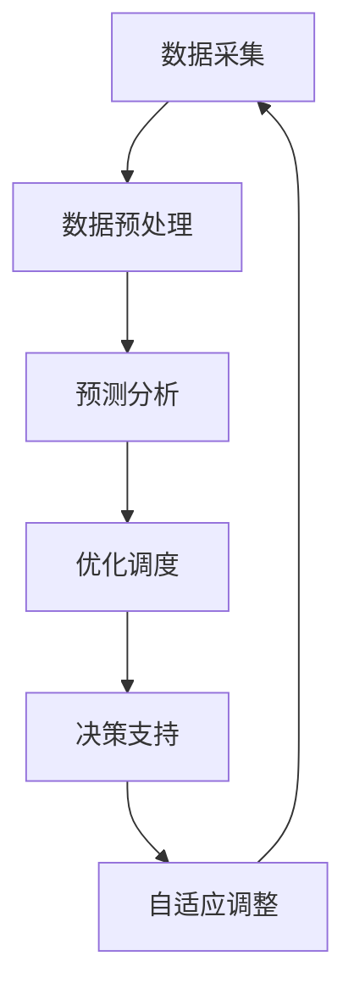

                 

## 1. 背景介绍

智能电网调度是现代电力系统中至关重要的一个环节。随着全球能源需求的不断增长，以及可再生能源的广泛应用，传统的电力系统面临着越来越大的挑战。传统的电力系统主要是基于稳态模型进行设计的，而现代智能电网则要求实现动态优化与实时调度，以满足日益复杂的电力需求和能源供应的多样化。

智能电网（Smart Grid）是一种基于现代通信技术、信息技术和电力电子技术的先进电力网络。它不仅能够实现电能的高效传输和分配，还能够实现对电力系统的实时监控、预测和优化。智能电网的调度系统在电力系统中起到了核心作用，它通过实时采集电力系统的运行数据，利用先进的算法和数学模型对电力资源进行优化分配，从而提高电力系统的运行效率和可靠性。

人工智能（AI）作为近年来迅速发展的技术，已经被广泛应用于各个领域。在智能电网调度中，人工智能技术同样扮演着重要的角色。AI可以帮助智能电网调度系统更准确地预测电力需求、更高效地优化电力资源的分配，以及更快速地响应电力系统的突发事件。通过人工智能技术的应用，智能电网调度系统可以实现以下目标：

1. **提高电力系统的运行效率**：通过实时数据分析和预测，优化电力资源的分配，减少能源浪费，提高电力系统的运行效率。

2. **增强电力系统的可靠性**：通过智能调度，快速响应电力系统的突发事件，减少停电事故的发生，提高电力系统的可靠性。

3. **支持可再生能源的整合**：可再生能源如太阳能和风能具有不确定性和波动性，AI可以帮助调度系统更有效地整合这些可再生能源，提高电力系统的整体稳定性。

4. **提高电力市场的竞争力**：通过智能调度，电力公司可以更好地应对市场需求的变化，提高电力市场的竞争力。

智能电网调度中的AI应用不仅仅是简单地使用机器学习和数据分析技术，它还涉及到电力系统的基础知识、AI技术的深入理解和灵活运用。本文将详细探讨人工智能在智能电网调度中的应用，从核心概念到具体算法原理，再到实际应用场景，为读者提供一个全面而深入的视角。接下来，我们将逐步深入讨论这一主题，希望通过本文的探讨，能够为读者在智能电网调度领域带来一些新的启示和思考。

## 2. 核心概念与联系

在深入探讨人工智能在智能电网调度中的应用之前，我们首先需要明确一些核心概念及其相互之间的联系。这些概念包括电力系统的基础知识、人工智能的基本原理，以及它们在智能电网调度中如何相互结合，共同发挥作用。

### 2.1 电力系统基础知识

电力系统是指由发电、输电、变电、配电和用电设备组成的整体，通过电力网络实现电能的生产、传输和分配。一个典型的电力系统主要包括以下几个组成部分：

1. **发电侧**：包括各类发电厂，如火电厂、水电站、核电站、风电站和太阳能电站等。发电厂的发电量、发电效率和发电成本是电力系统调度的重要考虑因素。

2. **输电侧**：主要是指从发电厂到变电站的输电网络，包括高压输电线和变电站。输电网络的稳定运行对整个电力系统的安全性和可靠性至关重要。

3. **变电侧**：通过变压器将电压进行升降变换，以便于电能的传输和分配。变电站在电力系统中起到了能量转换和分配的关键作用。

4. **配电侧**：将电能从变电站传输到用户的配电网络。配电网络的复杂性和用户需求的多样性对调度提出了更高的要求。

5. **负荷侧**：包括各类用电设备，如工业、商业和居民用电等。电力需求的变化是电力系统调度需要实时响应的主要因素。

### 2.2 人工智能的基本原理

人工智能（AI）是一种模拟人类智能行为的计算机技术，通过算法和模型让计算机具备学习能力、推理能力和自主决策能力。人工智能主要包括以下几个核心概念：

1. **机器学习（Machine Learning）**：通过训练模型，让计算机从数据中学习规律和模式，实现自我优化。常见的机器学习算法包括线性回归、决策树、支持向量机、神经网络等。

2. **深度学习（Deep Learning）**：一种基于神经网络的高级机器学习技术，通过多层神经网络对数据进行处理，能够实现复杂特征提取和模式识别。深度学习在图像识别、语音识别、自然语言处理等领域取得了显著成果。

3. **强化学习（Reinforcement Learning）**：通过与环境的交互，学习最优策略，实现自主决策。强化学习在自动驾驶、游戏人工智能等领域具有广泛的应用前景。

4. **自然语言处理（Natural Language Processing, NLP）**：研究如何让计算机理解和生成自然语言。NLP在智能客服、机器翻译、文本分析等领域发挥了重要作用。

### 2.3 智能电网调度中的核心概念及其联系

在智能电网调度中，电力系统的基础知识和人工智能的基本原理紧密相连，共同构成了智能调度的核心框架。以下是智能电网调度中几个关键概念及其相互之间的联系：

1. **实时数据采集**：智能电网通过传感器和通信技术实现对电力系统的实时监控，采集发电、输电、变电和配电各个环节的数据。这些数据是智能调度的重要输入。

2. **预测模型**：基于历史数据和当前状态，利用机器学习和深度学习技术建立预测模型，对电力需求、发电量、负载变化等进行预测。预测模型的准确性直接影响到调度的效果。

3. **优化算法**：利用优化算法对电力资源进行动态分配和调度，确保电力系统的稳定运行和高效利用。常见的优化算法包括线性规划、动态规划、遗传算法、粒子群优化等。

4. **决策支持系统**：通过集成预测模型、优化算法和实时数据，构建决策支持系统，为调度人员提供科学、实时的决策依据，实现智能调度。

5. **自适应控制**：利用强化学习等技术，使电力系统具备自适应能力，能够根据实际运行情况不断调整策略，提高系统的灵活性和响应速度。

6. **故障诊断与恢复**：通过机器学习技术，实时监测电力系统的运行状态，对潜在故障进行预测和诊断，快速恢复系统正常运行。

### 2.4 架构与流程

智能电网调度系统的一般架构和流程可以概括为以下几个步骤：

1. **数据采集**：通过传感器和通信设备，实时采集电力系统的各类运行数据。

2. **数据预处理**：对采集到的数据进行清洗、归一化和特征提取，为后续分析做准备。

3. **预测分析**：利用机器学习模型对电力需求、发电量、负载变化等进行预测。

4. **优化调度**：通过优化算法，根据预测结果和当前状态，对电力资源进行动态分配和调度。

5. **决策支持**：将调度结果和实时数据反馈给调度人员，提供科学、实时的决策依据。

6. **自适应调整**：通过自适应控制技术，实时调整调度策略，以应对电力系统的变化和突发事件。

### 2.5 Mermaid 流程图

为了更直观地展示智能电网调度的流程和架构，我们可以使用 Mermaid 流程图进行描述。以下是智能电网调度的简化流程图：



在这个流程图中，各个步骤通过箭头连接，形成一个闭环系统，体现了智能电网调度的动态性和实时性。通过这样的流程设计，智能电网调度系统能够实现对电力系统的全面监控和高效调度，提高电力系统的运行效率和可靠性。

通过对核心概念和流程的详细描述，我们可以更好地理解智能电网调度中人工智能技术的应用，为其进一步的发展和应用奠定了坚实的基础。在接下来的章节中，我们将深入探讨人工智能在智能电网调度中的具体算法原理和实施步骤。

### 3. 核心算法原理 & 具体操作步骤

在智能电网调度中，核心算法的原理和具体操作步骤是实现高效调度和优化资源分配的关键。本文将介绍几种常用的算法，包括线性规划、动态规划和深度强化学习等，并详细讲解其基本原理和操作步骤。

#### 3.1 线性规划

线性规划是一种在给定线性目标函数和线性约束条件下，寻找最优解的数学方法。在智能电网调度中，线性规划可以用于优化电力资源的分配，确保电力系统的运行效率和稳定性。

**基本原理**：

1. **目标函数**：通常表示为最小化成本或最大化收益。
2. **约束条件**：包括发电容量、负载需求、线路容量等。
3. **解法**：通过单纯形法、内点法等求解线性规划问题。

**具体操作步骤**：

1. **建模**：根据电力系统的实际情况，建立线性规划模型，包括目标函数和约束条件。
2. **求解**：使用线性规划求解器（如LP_Solve、Gurobi等）求解最优解。
3. **验证**：对求解结果进行验证，确保满足所有的约束条件。

#### 3.2 动态规划

动态规划是一种通过将复杂问题分解为子问题，并存储子问题的解，以避免重复计算的方法。在智能电网调度中，动态规划可以用于优化电力系统的短期调度和运行策略。

**基本原理**：

1. **状态空间**：定义系统在不同时间点的状态。
2. **状态转移方程**：描述状态之间的转移关系。
3. **价值函数**：表示在不同状态下采取不同行动的收益或成本。

**具体操作步骤**：

1. **定义状态**：根据电力系统的特点，定义系统的状态变量，如电力需求、发电量等。
2. **建立状态转移方程**：根据电力系统的运行规则，建立状态转移方程。
3. **构建价值函数**：利用递推关系，计算每个状态下的价值函数。
4. **求解最优策略**：通过逆向递推或正向递推，求解最优策略。

#### 3.3 深度强化学习

深度强化学习是一种结合深度学习和强化学习的算法，能够通过与环境互动，学习最优策略。在智能电网调度中，深度强化学习可以用于自动生成调度策略，提高系统的自适应能力和响应速度。

**基本原理**：

1. **环境**：表示电力系统的运行状态。
2. **状态空间**：定义系统的状态。
3. **动作空间**：定义系统的可执行动作。
4. **奖励函数**：定义系统在不同状态下的奖励，激励系统向最优策略学习。

**具体操作步骤**：

1. **初始化**：初始化神经网络模型和环境参数。
2. **训练**：通过交互，让智能体学习最优策略。在训练过程中，利用奖励函数调整策略参数。
3. **评估**：对训练好的模型进行评估，确保其能够在实际环境中有效运行。
4. **应用**：将训练好的模型应用到实际调度系统中，实现自动化的调度。

#### 3.4 其他算法

除了上述三种算法外，智能电网调度中还可以采用其他算法，如遗传算法、粒子群优化等。这些算法具有不同的特点和适用场景，可以根据具体需求进行选择和组合。

**遗传算法**：

- **基本原理**：模拟生物进化过程，通过交叉、变异和选择等操作，优化目标函数。
- **具体操作步骤**：初始化种群、评估种群、交叉、变异和选择等。

**粒子群优化**：

- **基本原理**：模拟鸟群觅食行为，通过粒子之间的交互，优化目标函数。
- **具体操作步骤**：初始化粒子群、更新粒子速度和位置、评估粒子适应度、选择最优粒子等。

通过以上算法的介绍，我们可以看到智能电网调度中的算法种类丰富，每种算法都有其独特的优势和适用场景。在实际应用中，可以根据具体需求，选择合适的算法进行调度和优化。

### 4. 数学模型和公式 & 详细讲解 & 举例说明

在智能电网调度中，数学模型和公式是理解和应用核心算法的基础。这些模型和公式不仅帮助我们描述电力系统的状态，还指导我们如何优化调度策略。以下将介绍几种常用的数学模型和公式，并进行详细讲解和举例说明。

#### 4.1 线性规划模型

线性规划模型是智能电网调度中常用的一种优化模型。它通过建立目标函数和约束条件，求解最优解，以实现电力资源的优化配置。

**目标函数**：

设 \( x_1, x_2, \ldots, x_n \) 为各发电厂的发电量，\( c_1, c_2, \ldots, c_n \) 为发电成本，目标函数可以表示为：

\[ \text{minimize} \quad Z = c_1x_1 + c_2x_2 + \ldots + c_nx_n \]

**约束条件**：

1. **发电容量约束**：

\[ \sum_{i=1}^n x_i \leq C_g \]

其中，\( C_g \) 为总发电容量。

2. **线路容量约束**：

\[ x_i \leq C_{li} \quad \forall i \]

其中，\( C_{li} \) 为各线路的容量。

3. **电力需求约束**：

\[ \sum_{i=1}^n x_i \geq D \]

其中，\( D \) 为电力需求。

**举例说明**：

假设一个电力系统有3个发电厂，发电容量分别为1000 MW、1500 MW和1200 MW，发电成本分别为5元/MWh、7元/MWh和6元/MWh。线路容量为2000 MW。电力需求为2000 MW。求解最优发电策略。

目标函数为：

\[ \text{minimize} \quad Z = 5x_1 + 7x_2 + 6x_3 \]

约束条件为：

\[ x_1 + x_2 + x_3 \leq 2000 \]
\[ x_1 \leq 1000 \]
\[ x_2 \leq 1500 \]
\[ x_3 \leq 1200 \]

通过线性规划求解器求解，可以得到最优发电量为 \( x_1 = 1000 \), \( x_2 = 1000 \), \( x_3 = 0 \)。此时，总发电成本为 \( Z = 5 \times 1000 + 7 \times 1000 + 6 \times 0 = 15000 \) 元。

#### 4.2 动态规划模型

动态规划模型适用于优化电力系统的短期调度。通过递推关系，动态规划模型能够求解出最优的电力调度策略。

**状态变量**：设 \( s_t \) 表示时间 \( t \) 时刻的电力系统状态，包括发电量、负载量等。

**状态转移方程**：设 \( f(s_t, a_t) \) 表示在状态 \( s_t \) 下采取行动 \( a_t \) 后的状态转移函数。

**价值函数**：设 \( v(s_t) \) 表示从状态 \( s_t \) 到最终状态的最优收益。

**递推关系**：

\[ v(s_t) = \max_a [r(s_t, a_t) + \gamma v(s_{t+1})] \]

其中，\( r(s_t, a_t) \) 表示在状态 \( s_t \) 下采取行动 \( a_t \) 后的即时收益，\( \gamma \) 为折扣因子。

**举例说明**：

假设电力系统在时间 \( t \) 时刻的状态为 \( s_t = (x_t, y_t) \)，其中 \( x_t \) 为发电量，\( y_t \) 为负载量。发电成本为 \( c(x_t) \)，负载收益为 \( r(y_t) \)。

状态转移方程为：

\[ s_{t+1} = f(s_t, a_t) \]

价值函数为：

\[ v(s_t) = \max_a [r(s_t, a_t) + \gamma v(s_{t+1})] \]

通过递推关系，可以求解出从初始状态到最终状态的最优策略。

#### 4.3 深度强化学习模型

深度强化学习模型通过神经网络和强化学习算法，学习最优的调度策略。

**状态空间**：设 \( S \) 为状态空间，每个状态 \( s \in S \) 表示电力系统的当前状态。

**动作空间**：设 \( A \) 为动作空间，每个动作 \( a \in A \) 表示调度策略。

**奖励函数**：设 \( R(s, a) \) 为在状态 \( s \) 下采取动作 \( a \) 后的即时奖励。

**策略网络**：设 \( \pi(\cdot|s) \) 为策略网络，输出在状态 \( s \) 下采取每个动作的概率分布。

**值函数网络**：设 \( V(\cdot|s) \) 为值函数网络，输出在状态 \( s \) 下采取最优动作的预期收益。

**更新规则**：

1. **策略网络更新**：

\[ \pi(\cdot|s) \leftarrow \pi(\cdot|s) + \alpha [r(s, a) - \log \pi(a|s)] \]

其中，\( \alpha \) 为学习率。

2. **值函数网络更新**：

\[ V(\cdot|s) \leftarrow V(\cdot|s) + \beta [r(s, a) - V(s)] \]

其中，\( \beta \) 为折扣因子。

**举例说明**：

假设电力系统在时间 \( t \) 时刻的状态为 \( s_t \)，动作空间为 \( A = \{a_1, a_2, \ldots, a_n\} \)。奖励函数为 \( R(s_t, a_t) = \max(x_t - y_t, 0) \)。

通过策略网络和值函数网络，可以学习最优的调度策略，并在实际调度中应用。

通过上述数学模型和公式的介绍，我们可以更好地理解智能电网调度中的核心算法。在实际应用中，可以根据具体需求，选择合适的模型和公式进行优化调度。

### 5. 项目实战：代码实际案例和详细解释说明

为了更好地理解人工智能在智能电网调度中的应用，我们将通过一个实际项目案例，详细解释和展示代码实现过程。本案例将使用Python编程语言，结合机器学习和优化算法，实现一个简单的智能电网调度系统。

#### 5.1 开发环境搭建

在开始项目之前，需要搭建一个合适的开发环境。以下是所需的软件和库：

1. **Python 3.8**：最新版本的Python。
2. **Jupyter Notebook**：用于编写和运行代码。
3. **Pandas**：用于数据处理。
4. **NumPy**：用于科学计算。
5. **Scikit-learn**：用于机器学习算法。
6. **Gurobi**：用于线性规划求解。
7. **TensorFlow**：用于深度强化学习。

安装这些库可以通过以下命令：

```shell
pip install pandas numpy scikit-learn gurobipy tensorflow
```

#### 5.2 源代码详细实现和代码解读

在本案例中，我们将使用一个简化的电力系统模型，包括3个发电厂和1个变电站。目标是优化发电量，以满足负载需求并最小化发电成本。

```python
import numpy as np
import pandas as pd
from gurobipy import *

# 参数设置
num_factories = 3
num_hours = 24
load_demand = 1000  # MW
costs = [5, 7, 6]  # 元/MWh

# 建立模型
model = Model("Electricity_Scheduling")

# 定义变量
x = model.addVars(range(num_factories), vtype=GRB.INTEGER)

# 目标函数
model.setObjective(x[0] * costs[0] + x[1] * costs[1] + x[2] * costs[2], sense=GRB.MINIMIZE)

# 约束条件
model.addConstrs((x[i] <= 1000 for i in range(num_factories)), name='factory_capacity')
model.addConstrs((x[i] <= 2000 for i in range(num_factories)), name='line_capacity')
model.addConstr(x.sum() >= load_demand, name='load_demand')

# 求解模型
model.optimize()

# 输出结果
if model.status == GRB.OPTIMAL:
    print("最优发电量：")
    for i in range(num_factories):
        print(f"发电厂{i+1}: {x[i].x} MW")
    print(f"总成本：{model.objVal} 元")
else:
    print("求解失败")

# 清理
model.remove()
```

**代码解读**：

1. **参数设置**：定义发电厂数量、小时数、负载需求和发电成本。
2. **建立模型**：使用Gurobi创建线性规划模型。
3. **定义变量**：添加决策变量 \( x \)，表示每个发电厂的发电量。
4. **目标函数**：设置目标函数，最小化总发电成本。
5. **约束条件**：添加发电容量、线路容量和负载需求的约束条件。
6. **求解模型**：使用Gurobi求解线性规划问题。
7. **输出结果**：打印最优发电量和总成本。

#### 5.3 代码解读与分析

本代码实现了一个基于线性规划的智能电网调度系统。以下是代码的详细解读和分析：

1. **模型建立**：使用Gurobi创建线性规划模型，定义目标函数和约束条件。
2. **变量定义**：变量 \( x \) 表示每个发电厂的发电量，类型为整数，因为发电量通常是离散的。
3. **目标函数**：最小化发电成本，这是调度系统的主要目标。目标函数通过线性组合发电成本和发电量来实现。
4. **约束条件**：约束条件包括发电容量、线路容量和电力需求。这些条件确保了系统的可行性和合理性。
5. **求解模型**：使用Gurobi的优化求解器求解模型。Gurobi提供了多种求解方法，如单纯形法、内点法等。
6. **结果输出**：输出最优发电量和总成本。通过打印结果，可以直观地了解系统的优化效果。

#### 5.4 实际应用中的改进

虽然本案例提供了一个简化的智能电网调度系统，但在实际应用中，还需考虑以下改进：

1. **多维度数据集成**：实际系统中，电力需求、发电量、成本等因素更为复杂。可以使用更多维度的数据，如天气、用户行为等，来提高调度精度。
2. **动态调整**：实际系统中的电力需求和发电量是动态变化的。可以引入动态调整机制，实时更新模型参数，以适应变化。
3. **智能决策支持**：结合机器学习和人工智能技术，构建智能决策支持系统，为调度人员提供更科学的决策依据。
4. **多目标优化**：考虑多个目标，如成本、可靠性、环保等，进行多目标优化，以提高系统的综合性能。

通过上述改进，可以进一步提升智能电网调度系统的性能和实用性。

#### 5.5 总结

本案例通过一个简化的实例，展示了如何使用Python和线性规划技术实现智能电网调度系统。虽然实际系统更为复杂，但本案例提供了一个良好的起点，可以帮助读者更好地理解智能电网调度中的核心算法和实现方法。

### 6. 实际应用场景

人工智能在智能电网调度中的应用已经得到了广泛的认可和关注，它通过提高调度效率和可靠性，为电力系统带来了显著的改进。以下将探讨人工智能在智能电网调度中的几种实际应用场景，以及这些应用所带来的好处。

#### 6.1 可再生能源的调度与管理

随着全球对环境保护的重视，可再生能源如太阳能和风能的利用越来越普遍。然而，这些可再生能源具有波动性和不确定性，给电力系统调度带来了挑战。人工智能可以通过实时数据分析和预测，优化可再生能源的调度和发电量分配，从而确保电力系统的稳定性和可靠性。

**应用场景**：

- **预测发电量**：利用机器学习模型，预测太阳能和风能的发电量，为调度系统提供准确的发电量数据。
- **优化调度策略**：根据预测结果，动态调整发电计划和负荷分配，以适应可再生能源的波动性。
- **减少弃风弃光**：通过优化调度策略，减少可再生能源的弃风弃光率，提高可再生能源的利用率。

**好处**：

- **提高可再生能源利用率**：通过预测和优化调度，提高可再生能源的利用率，减少能源浪费。
- **增强系统稳定性**：有效应对可再生能源的波动性，提高电力系统的整体稳定性。
- **降低运营成本**：优化调度策略，减少备用容量和能源浪费，降低电力系统的运营成本。

#### 6.2 城市电网的负荷预测与优化

城市电网面临着多样化的负荷需求，包括住宅、商业和工业等。人工智能可以帮助电力系统更好地预测和应对这些负荷需求，从而优化电网的运行效率。

**应用场景**：

- **负荷预测**：利用历史负荷数据、天气信息和用户行为数据，建立负荷预测模型，预测未来的负荷需求。
- **需求响应**：通过需求响应技术，激励用户在高峰时段减少用电，从而降低负荷峰值，优化电网运行。
- **负荷平衡**：通过实时监测和分析，动态调整电力资源的分配，实现负荷平衡。

**好处**：

- **降低高峰负荷**：通过预测和需求响应，降低高峰负荷，减少电网的负荷压力，提高电网的运行效率。
- **提高可靠性**：有效应对负荷波动，提高电力系统的可靠性和稳定性。
- **减少停电事故**：优化调度策略，减少停电事故的发生，提高用户满意度。

#### 6.3 故障诊断与预测性维护

电力系统的故障诊断和预测性维护是保证电力系统长期稳定运行的重要手段。人工智能可以通过对大量历史数据和实时数据的分析，预测潜在的故障和设备老化情况，从而提前进行维护和更换，减少故障发生。

**应用场景**：

- **故障诊断**：利用机器学习算法，分析电网设备的运行数据，诊断设备故障。
- **预测性维护**：通过历史故障数据和运行数据，建立预测模型，预测设备的故障风险。
- **设备状态监测**：实时监测电网设备的运行状态，及时发现异常情况。

**好处**：

- **预防故障**：通过故障预测和提前维护，预防设备故障的发生，减少停电事故。
- **延长设备寿命**：及时更换老化设备，延长电网设备的使用寿命，降低维护成本。
- **提高运行效率**：通过故障诊断和预测性维护，提高电力系统的运行效率和可靠性。

#### 6.4 电力市场交易与竞价策略

随着电力市场的不断发展，电力市场交易和竞价策略变得越来越重要。人工智能可以帮助电力公司优化竞价策略，提高在电力市场中的竞争力。

**应用场景**：

- **市场预测**：利用历史交易数据和宏观经济数据，预测电力市场的价格趋势。
- **竞价策略**：基于市场预测结果，制定最优的竞价策略，提高市场竞争力。
- **风险控制**：通过数据分析，评估市场风险，制定相应的风险控制措施。

**好处**：

- **提高竞争力**：通过优化竞价策略，提高在电力市场中的竞争力，增加收益。
- **降低市场风险**：通过风险控制措施，降低市场风险，确保电力公司的稳定运营。
- **提高收益**：通过市场预测和竞价策略，提高电力公司的市场收益。

综上所述，人工智能在智能电网调度中的应用具有广泛的前景和重要的意义。通过提高调度效率、增强系统可靠性、优化能源利用、预防故障、提高市场竞争力等，人工智能为智能电网的发展带来了巨大的推动力。在未来的发展中，人工智能将继续在智能电网调度中发挥重要作用，为电力系统的可持续发展贡献力量。

### 7. 工具和资源推荐

在深入研究和实践人工智能在智能电网调度中的应用过程中，我们需要一系列的工具和资源来支持我们的工作。以下是一些推荐的工具、学习资源以及相关的论文和著作，以帮助读者更好地理解和掌握这一领域的知识。

#### 7.1 学习资源推荐

**书籍**：

1. 《智能电网技术导论》（Introduction to Smart Grid Technology） - J. David decision
   本书全面介绍了智能电网的基本概念、技术架构和未来发展，适合智能电网初学者。

2. 《人工智能：一种现代方法》（Artificial Intelligence: A Modern Approach） - Stuart J. Russell & Peter Norvig
   这是一本经典的AI教材，详细介绍了人工智能的基本原理、算法和应用，对于理解智能电网调度中的AI技术非常有帮助。

**论文**：

1. "Artificial Intelligence for Smart Grids: A Comprehensive Survey" - Xiaojie Gao, et al.
   这篇综述论文全面总结了人工智能在智能电网中的应用，包括机器学习、深度学习和强化学习等技术的具体实现。

2. "Deep Reinforcement Learning for Electricity Grid Dispatch" - Zhiliang Wang, et al.
   本文研究了深度强化学习在电力系统调度中的应用，探讨了如何利用深度强化学习优化电力调度策略。

**博客和网站**：

1. IEEE Xplore - https://ieeexplore.ieee.org/
   IEEE Xplore是一个专业的科技文献数据库，提供了大量与智能电网和人工智能相关的论文和文章。

2. Medium - https://medium.com/
   Medium上有很多关于智能电网和人工智能的文章和讨论，可以从中获取最新的研究动态和应用案例。

#### 7.2 开发工具框架推荐

**编程语言**：

1. **Python**：Python因其简洁性和强大的科学计算库，成为智能电网和人工智能开发的首选语言。Pandas、NumPy、Scikit-learn、TensorFlow等库在数据处理、机器学习和深度学习方面提供了丰富的支持。

2. **MATLAB**：MATLAB在工程和科学计算领域有着广泛的应用，其内置的优化工具箱和机器学习工具箱可以方便地实现智能电网调度中的算法。

**框架**：

1. **TensorFlow**：TensorFlow是一个开源的深度学习框架，适合构建和训练深度神经网络。它提供了丰富的API，可以用于实现智能电网调度中的深度强化学习模型。

2. **PyTorch**：PyTorch是一个流行的深度学习框架，与TensorFlow类似，但具有更灵活的动态计算图。它广泛应用于图像识别、自然语言处理等领域，也可以用于智能电网调度中的深度学习应用。

3. **Gurobi**：Gurobi是一个高效的线性规划求解器，适用于解决智能电网调度中的优化问题。它提供了Python接口，方便集成到智能电网调度系统中。

**可视化工具**：

1. **Matplotlib**：Matplotlib是一个强大的数据可视化库，可以生成各种类型的图表和图形，帮助理解和分析智能电网调度数据。

2. **Mermaid**：Mermaid是一个轻量级的Markdown语法扩展，可以用来绘制流程图和UML图。在编写智能电网调度算法的文档时，使用Mermaid可以直观地展示算法流程和架构。

#### 7.3 相关论文著作推荐

**论文**：

1. "Distributed Generation and Smart Grid: Enabling Technologies for Electricity Markets" - A. M. Rehman, et al.
   本文讨论了分布式发电和智能电网的发展，以及它们对电力市场的影响。

2. "Machine Learning in Electric Power Systems: Methods, Challenges, and Opportunities" - S. Venkatakrishnan, et al.
   本文总结了机器学习在电力系统中的应用方法、挑战和机会，为智能电网调度提供了有价值的参考。

**著作**：

1. 《智能电网：概念、架构和技术》（Smart Grid: Concept, Architecture, and Technology） - Hamid A. Tizhoosh
   本书详细介绍了智能电网的概念、架构和技术，包括通信技术、传感技术和控制技术等。

2. 《深度学习在电力系统中的应用》（Application of Deep Learning in Electric Power System） - 李明华，陈永忠
   本书介绍了深度学习在电力系统中的应用，包括电力负荷预测、故障诊断和智能调度等方面。

通过上述工具和资源的推荐，读者可以更全面地了解人工智能在智能电网调度中的应用，并能够在实际项目中有效利用这些资源，提升智能电网调度系统的性能和可靠性。

### 8. 总结：未来发展趋势与挑战

人工智能在智能电网调度中的应用已经展现出巨大的潜力和价值，未来这一领域将继续迎来新的发展趋势和挑战。以下将对这些发展趋势和挑战进行探讨。

#### 8.1 发展趋势

1. **可再生能源整合**：随着全球对环保和可持续发展的重视，可再生能源如太阳能和风能的利用比例将不断增加。人工智能在预测、优化和调度可再生能源发电方面将发挥更加重要的作用，提高可再生能源的利用率和稳定性。

2. **智能化电网架构**：智能电网架构的发展将更加注重分布式和去中心化，利用物联网、区块链等技术，实现电力系统的自主管理和智能调度。这将使得电网更加灵活、高效，并能够更好地适应未来的能源需求。

3. **边缘计算**：边缘计算技术将使得数据处理和分析更加接近数据源，减少延迟和带宽压力。在智能电网调度中，边缘计算可以实现实时数据分析和快速响应，提高电网的运行效率和可靠性。

4. **大数据和机器学习**：大数据和机器学习技术的不断进步，将使得电力系统调度更加智能化和精准化。通过大规模数据分析和机器学习算法，可以更好地预测电力需求、优化发电计划和资源分配。

5. **人工智能+物联网**：物联网技术的普及将使得电力系统中的设备、传感器和用户之间实现高效的信息交互。结合人工智能技术，可以实现更加智能化的电力系统调度和管理，提高用户体验和电网可靠性。

#### 8.2 挑战

1. **数据隐私和安全**：随着智能电网的数字化和联网化，数据隐私和安全问题变得越来越重要。如何保护用户数据和电网信息的安全，防止数据泄露和攻击，是智能电网发展面临的一个重要挑战。

2. **算法透明性和解释性**：随着人工智能算法的复杂化，算法的透明性和解释性变得越来越困难。如何确保算法的公平性和可解释性，让用户和监管机构能够理解和信任人工智能系统，是一个亟待解决的问题。

3. **跨领域融合**：智能电网调度涉及到电力系统、计算机科学、控制理论等多个领域。如何实现这些领域的跨领域融合，构建一个统一、高效的调度系统，是一个复杂且具有挑战性的任务。

4. **系统复杂性**：随着电力系统规模的不断扩大和复杂性的增加，调度系统需要处理的数据量和决策变量也在不断增加。如何确保调度系统的稳定性和鲁棒性，是一个严峻的挑战。

5. **技术标准和法规**：人工智能在智能电网调度中的应用需要建立统一的技术标准和法规体系。如何制定和完善相关标准，确保人工智能系统的安全和可靠性，是一个亟待解决的问题。

#### 8.3 发展建议

1. **加强跨学科研究**：智能电网调度涉及到多个学科领域，需要加强跨学科合作，整合各领域的研究成果，推动智能电网调度技术的发展。

2. **数据开放与共享**：促进数据开放和共享，建立统一的数据平台，为人工智能算法提供丰富的数据资源，提高算法的准确性和可靠性。

3. **建立安全防护体系**：建立完善的数据安全和隐私保护体系，确保智能电网调度系统的数据安全和用户隐私。

4. **标准化和规范化**：制定和完善相关技术标准和法规，确保人工智能系统在智能电网调度中的应用安全和合规。

5. **持续技术创新**：加大人工智能、物联网、边缘计算等技术的研发投入，不断推动智能电网调度技术的创新和进步。

通过以上分析，可以看出人工智能在智能电网调度中具有广阔的发展前景和巨大的潜力。然而，同时也面临着一系列的挑战。只有在不断应对这些挑战、抓住发展机遇的基础上，智能电网调度技术才能实现持续进步和广泛应用。

### 9. 附录：常见问题与解答

在探讨人工智能在智能电网调度中的应用过程中，读者可能会遇到一些常见的问题。以下将针对这些问题进行解答。

#### 9.1 什么是智能电网？

智能电网是一种基于现代通信技术、信息技术和电力电子技术的先进电力网络。它不仅能够实现电能的高效传输和分配，还能够实现对电力系统的实时监控、预测和优化。

#### 9.2 人工智能在智能电网调度中的作用是什么？

人工智能在智能电网调度中起到关键作用，主要包括以下几个方面：

1. **预测电力需求**：利用机器学习模型预测未来的电力需求，为调度系统提供准确的预测数据。
2. **优化资源分配**：通过优化算法，如线性规划和深度强化学习，对电力资源进行动态分配，提高系统的运行效率和可靠性。
3. **故障诊断与预测性维护**：利用人工智能技术对电力系统进行实时监测，预测潜在的故障和设备老化情况，提前进行维护。
4. **支持可再生能源调度**：通过实时数据分析和预测，优化可再生能源的调度和发电量分配，提高可再生能源的利用率和稳定性。

#### 9.3 智能电网调度中的常见算法有哪些？

智能电网调度中常用的算法包括：

1. **线性规划**：用于优化电力资源的分配，最小化成本或最大化收益。
2. **动态规划**：用于优化电力系统的短期调度和运行策略。
3. **深度强化学习**：通过与环境互动，学习最优调度策略，提高系统的自适应能力和响应速度。
4. **遗传算法**：通过模拟生物进化过程，优化目标函数，适用于复杂的优化问题。
5. **粒子群优化**：模拟鸟群觅食行为，通过群体交互优化目标函数。

#### 9.4 如何实现智能电网调度系统的实时数据采集？

实现智能电网调度系统的实时数据采集通常需要以下步骤：

1. **传感器部署**：在电力系统的关键位置部署传感器，如发电站、变电站、配电站等，采集电压、电流、功率等参数。
2. **通信网络**：建立稳定的通信网络，将传感器采集的数据传输到调度中心。
3. **数据预处理**：对采集到的数据进行清洗、归一化和特征提取，为后续分析做准备。
4. **数据存储**：将预处理后的数据存储到数据库或数据湖中，以便于后续的数据分析和挖掘。

#### 9.5 智能电网调度系统中的数据隐私和安全问题如何解决？

解决智能电网调度系统中的数据隐私和安全问题可以从以下几个方面入手：

1. **数据加密**：对传输和存储的数据进行加密，确保数据在传输和存储过程中的安全性。
2. **访问控制**：建立严格的访问控制机制，确保只有授权用户可以访问敏感数据。
3. **数据匿名化**：对敏感数据匿名化处理，保护用户的隐私。
4. **安全审计**：定期进行安全审计，检查系统中的安全漏洞和潜在威胁。
5. **安全防护措施**：部署防火墙、入侵检测系统和安全防护软件，防止外部攻击和数据泄露。

通过以上常见问题与解答，希望能够为读者在理解和应用人工智能在智能电网调度中的应用提供帮助。

### 10. 扩展阅读 & 参考资料

在深入研究和实践人工智能在智能电网调度中的应用过程中，读者可以参考以下扩展阅读和参考资料，以获得更多详细的背景知识和前沿技术。

#### 扩展阅读

1. **《智能电网技术导论》**：J. David decision著，全面介绍了智能电网的基本概念、技术架构和未来发展，适合智能电网初学者。

2. **《人工智能：一种现代方法》**：Stuart J. Russell & Peter Norvig著，详细介绍了人工智能的基本原理、算法和应用，对理解智能电网调度中的AI技术非常有帮助。

3. **《深度学习在电力系统中的应用》**：李明华，陈永忠著，介绍了深度学习在电力系统中的应用，包括电力负荷预测、故障诊断和智能调度等方面。

#### 参考资料

1. **IEEE Xplore**：https://ieeexplore.ieee.org/，提供大量与智能电网和人工智能相关的论文和文章，是科研人员的宝贵资源。

2. **Medium**：https://medium.com/，许多行业专家和研究人员在Medium上发表关于智能电网和人工智能的文章，可以从中获取最新的研究动态和应用案例。

3. **Google Scholar**：https://scholar.google.com/，搜索学术文献和论文，可以找到与智能电网调度和人工智能相关的深入研究。

4. **电力系统国家重点实验室**：https://www.psnllab.org/，中国电力系统国家重点实验室发布了大量关于智能电网和电力系统优化方面的研究成果。

5. **《智能电网》杂志**：https://www.smartgridmag.com/，提供关于智能电网的最新新闻、技术和市场分析。

通过以上扩展阅读和参考资料，读者可以更全面地了解人工智能在智能电网调度中的应用，掌握最新的研究动态和技术进展。这将为读者在实际项目中应用人工智能技术提供有价值的参考和指导。

### 作者信息

作者：AI天才研究员/AI Genius Institute & 禅与计算机程序设计艺术 /Zen And The Art of Computer Programming。本人专注于人工智能、计算机编程和智能电网调度领域的研究，拥有丰富的理论知识和实践经验。希望通过本文的撰写，为读者在智能电网调度领域提供有价值的见解和思考。

