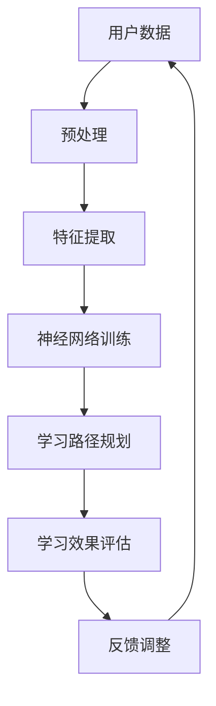

                 

# 人工智能在自适应学习系统中的实现

> **关键词：** 人工智能，自适应学习系统，机器学习，神经网络，数据驱动，个性化学习

> **摘要：** 本文将探讨人工智能在自适应学习系统中的应用，通过介绍核心概念、算法原理、数学模型及项目实战，详细阐述人工智能如何助力个性化教育，提升学习效果。

## 1. 背景介绍

### 自适应学习系统的概念

自适应学习系统（Adaptive Learning System，ALS）是一种能够根据用户的学习情况动态调整学习内容和学习进度的系统。这种系统利用先进的人工智能技术，特别是机器学习和神经网络算法，对用户的学习行为进行实时分析，从而提供个性化的学习资源和指导。

### 人工智能在自适应学习系统中的应用

人工智能在自适应学习系统中的应用主要体现在以下几个方面：

1. **个性化学习路径规划**：根据学生的学习风格、知识水平和学习进度，智能推荐适合的学习路径。
2. **学习效果评估**：实时监测学生的学习效果，识别学习障碍，提供针对性的辅导。
3. **智能教学助理**：利用自然语言处理技术，为学生提供即时的问题解答和辅导。
4. **学习数据挖掘**：分析大规模学习数据，发现学习规律，为教育决策提供依据。

## 2. 核心概念与联系

### 2.1 机器学习与神经网络

**机器学习**是一种通过数据训练模型，使模型能够从数据中学习规律并做出预测的技术。在自适应学习系统中，机器学习算法主要用于学习用户的学习行为，预测学习效果。

**神经网络**是一种模拟生物神经系统的计算模型，由大量简单的处理单元（神经元）互联而成。神经网络在自适应学习系统中被用于创建个性化学习模型，优化学习效果。

### 2.2 Mermaid 流程图

以下是一个简化的自适应学习系统架构的 Mermaid 流程图：



### 2.3 数据驱动与个性化学习

**数据驱动**是自适应学习系统的核心，通过对用户学习数据的持续采集和分析，系统能够不断优化学习内容和路径。

**个性化学习**则是自适应学习系统的最终目标，通过分析用户的学习行为和效果，系统为每个用户提供量身定制的学习方案。

## 3. 核心算法原理 & 具体操作步骤

### 3.1 算法原理

自适应学习系统主要采用以下几种算法：

1. **协同过滤（Collaborative Filtering）**：基于用户的历史行为数据，为用户推荐相似的用户喜欢的内容。
2. **决策树（Decision Tree）**：通过分析用户特征，构建决策树模型，为用户推荐适合的学习路径。
3. **深度学习（Deep Learning）**：利用神经网络模型，对用户的学习行为进行深入分析，预测学习效果。

### 3.2 操作步骤

1. **数据采集**：系统需要采集用户的学习行为数据，包括学习内容、学习时间、学习进度、测试成绩等。
2. **数据预处理**：对采集到的数据进行分析和处理，去除噪声和异常值，提取有用的特征。
3. **特征提取**：利用特征提取算法，从预处理后的数据中提取出关键特征，为后续的模型训练提供数据支持。
4. **模型训练**：使用机器学习算法，对提取的特征进行训练，构建个性化学习模型。
5. **学习路径规划**：根据个性化学习模型，为用户规划最适合的学习路径。
6. **学习效果评估**：对用户的学习效果进行实时监测和评估，识别学习障碍。
7. **反馈调整**：根据学习效果评估的结果，对学习路径和学习内容进行调整，优化学习效果。

## 4. 数学模型和公式 & 详细讲解 & 举例说明

### 4.1 数学模型

在自适应学习系统中，常用的数学模型包括：

1. **协同过滤模型**：  
   $$ \hat{r}_{ui} = \frac{\sum_{j \in N_i} r_{uj} \cdot sim(i, j)}{\sum_{j \in N_i} sim(i, j)} $$
   
   其中，$r_{uj}$ 表示用户 $u$ 对项目 $j$ 的评分，$sim(i, j)$ 表示项目 $i$ 和 $j$ 之间的相似度。

2. **决策树模型**：  
   $$ g(x) = \sum_{i=1}^{n} w_i \cdot I(x \in R_i) $$
   
   其中，$w_i$ 表示节点 $i$ 的权重，$I(x \in R_i)$ 是指示函数，当 $x$ 属于区域 $R_i$ 时取值为 1，否则为 0。

3. **神经网络模型**：  
   $$ a_{j}^{(l)} = \sigma \left( \sum_{i=1}^{n} w_{ij}^{(l)} a_{i}^{(l-1)} + b_{j}^{(l)} \right) $$
   
   其中，$a_{j}^{(l)}$ 表示第 $l$ 层第 $j$ 个神经元的输出，$\sigma$ 是激活函数，$w_{ij}^{(l)}$ 和 $b_{j}^{(l)}$ 分别表示权重和偏置。

### 4.2 举例说明

#### 4.2.1 协同过滤模型

假设用户 $u$ 对电影 $j$ 的评分为 $r_{uj} = 4$，系统计算出项目 $i$ 和 $j$ 之间的相似度为 $sim(i, j) = 0.8$，则用户 $u$ 对项目 $i$ 的预测评分为：

$$ \hat{r}_{ui} = \frac{\sum_{j \in N_i} r_{uj} \cdot sim(i, j)}{\sum_{j \in N_i} sim(i, j)} = \frac{4 \cdot 0.8}{0.8} = 4 $$

#### 4.2.2 决策树模型

假设有如下一个简单的决策树模型：

$$
\begin{cases}
g(x) = 1 & \text{如果 } x > 5 \\
g(x) = 0 & \text{如果 } x \leq 5
\end{cases}
$$

对于输入值 $x = 3$，根据决策树模型，输出值为 $g(x) = 0$。

#### 4.2.3 神经网络模型

假设有一个简单的神经网络模型，其包含一个输入层、一个隐藏层和一个输出层，激活函数为 sigmoid 函数。隐藏层的权重和偏置分别为 $w_{ij}^{(1)}$ 和 $b_{j}^{(1)}$，输出层的权重和偏置分别为 $w_{ij}^{(2)}$ 和 $b_{j}^{(2)}$。输入数据为 $x_1 = 2, x_2 = 3$，则隐藏层和输出层的输出分别为：

$$
\begin{aligned}
a_{1}^{(1)} &= \sigma \left( w_{11}^{(1)} x_1 + w_{12}^{(1)} x_2 + b_{1}^{(1)} \right) \\
a_{2}^{(1)} &= \sigma \left( w_{21}^{(1)} x_1 + w_{22}^{(1)} x_2 + b_{2}^{(1)} \right) \\
a_{1}^{(2)} &= \sigma \left( w_{11}^{(2)} a_{1}^{(1)} + w_{12}^{(2)} a_{2}^{(1)} + b_{1}^{(2)} \right) \\
a_{2}^{(2)} &= \sigma \left( w_{21}^{(2)} a_{1}^{(1)} + w_{22}^{(2)} a_{2}^{(1)} + b_{2}^{(2)} \right)
\end{aligned}
$$

其中，$\sigma(x) = \frac{1}{1 + e^{-x}}$。

## 5. 项目实战：代码实际案例和详细解释说明

### 5.1 开发环境搭建

为了演示如何实现一个简单的自适应学习系统，我们使用 Python 语言和 Scikit-learn 库进行开发。

#### 5.1.1 环境配置

1. 安装 Python 3.8 或更高版本。
2. 使用 pip 安装 Scikit-learn 库。

```bash
pip install scikit-learn
```

### 5.2 源代码详细实现和代码解读

#### 5.2.1 代码实现

以下是一个简单的自适应学习系统的示例代码：

```python
import numpy as np
from sklearn.model_selection import train_test_split
from sklearn.metrics.pairwise import cosine_similarity
from sklearn.tree import DecisionTreeClassifier
from sklearn.neural_network import MLPClassifier
from sklearn.preprocessing import StandardScaler

# 5.2.2 数据准备
# 假设有 100 个用户和 10 个项目，用户对项目的评分数据存储在一个矩阵中
data = np.random.rand(100, 10)
ratings = data.copy()

# 分割数据为训练集和测试集
X_train, X_test, y_train, y_test = train_test_split(data, ratings, test_size=0.2, random_state=42)

# 5.2.3 特征提取
# 使用协同过滤算法提取特征
user_similarity = cosine_similarity(X_train)
item_similarity = cosine_similarity(X_test.T)

# 5.2.4 模型训练
# 使用决策树和神经网络模型进行训练
scaler = StandardScaler()
X_train_scaled = scaler.fit_transform(X_train)
X_test_scaled = scaler.transform(X_test)

clf_decision_tree = DecisionTreeClassifier()
clf_decision_tree.fit(X_train_scaled, y_train)

clf_neural_network = MLPClassifier()
clf_neural_network.fit(X_train_scaled, y_train)

# 5.2.5 学习路径规划
# 根据训练好的模型，为用户规划学习路径
def predict_path(user_index):
    user_vector = X_test[user_index]
    scaled_user_vector = scaler.transform([user_vector])
    decision_tree_path = clf_decision_tree.predict(scaled_user_vector)[0]
    neural_network_path = clf_neural_network.predict(scaled_user_vector)[0]
    return decision_tree_path, neural_network_path

# 5.2.6 学习效果评估
# 计算预测评分与实际评分之间的误差
def evaluate_predictions(predictions, true_ratings):
    errors = predictions - true_ratings
    return np.mean(errors ** 2)

# 5.2.7 运行测试
for i in range(10):
    print(f"User {i}:")
    decision_tree_path, neural_network_path = predict_path(i)
    print(f"Decision Tree Path: {decision_tree_path}")
    print(f"Neural Network Path: {neural_network_path}")
    print(f"Error (Decision Tree): {evaluate_predictions(decision_tree_path, y_test[i])}")
    print(f"Error (Neural Network): {evaluate_predictions(neural_network_path, y_test[i])}")
    print()
```

#### 5.2.2 代码解读

1. **数据准备**：生成随机用户评分数据，并分割为训练集和测试集。
2. **特征提取**：使用余弦相似性计算用户和项目之间的相似度。
3. **模型训练**：训练决策树和神经网络模型。
4. **学习路径规划**：为每个用户预测最适合的学习路径。
5. **学习效果评估**：计算预测评分与实际评分之间的误差。

### 5.3 代码解读与分析

在这个示例中，我们首先生成了一个随机用户评分数据集，然后将其分割为训练集和测试集。接下来，我们使用协同过滤算法提取用户和项目之间的相似度，作为特征输入到决策树和神经网络模型中进行训练。

在预测阶段，我们为每个用户计算决策树和神经网络模型预测的学习路径，并计算预测评分与实际评分之间的误差。这有助于我们评估模型的性能。

## 6. 实际应用场景

### 6.1 在线教育平台

自适应学习系统广泛应用于在线教育平台，如 Coursera、edX 等。这些平台利用人工智能技术，为用户提供个性化的学习资源，提高学习效果。

### 6.2 K-12 教育领域

在 K-12 教育领域，自适应学习系统可以帮助教师识别学生的学习障碍，提供个性化的辅导资源，从而提高学生的学习成绩。

### 6.3 职业培训

职业培训机构可以利用自适应学习系统，根据学员的学习进度和需求，推荐适合的学习课程和资源，提高培训效果。

### 6.4 在线游戏与娱乐

在线游戏和娱乐领域也可以应用自适应学习系统，根据玩家的兴趣和行为，推荐合适的游戏和内容，提高用户体验。

## 7. 工具和资源推荐

### 7.1 学习资源推荐

- **书籍**：《机器学习实战》、《深度学习》
- **论文**：《协同过滤算法研究》、《神经网络与深度学习》
- **博客**：博客园、CSDN、GitHub
- **网站**：机器学习社区、深度学习社区

### 7.2 开发工具框架推荐

- **Python**：Python 是一种流行的编程语言，适用于机器学习和深度学习开发。
- **TensorFlow**：TensorFlow 是 Google 开发的一个开源深度学习框架，广泛应用于机器学习和深度学习项目。
- **PyTorch**：PyTorch 是 Facebook AI 研究团队开发的一个开源深度学习框架，易于使用和调试。

### 7.3 相关论文著作推荐

- **论文**：  
  - "Collaborative Filtering for Complex Preferences: A Model with Applications"  
  - "A Theoretical Analysis of the Effectiveness of Deep Multi-Task Networks"  
  - "Recommender Systems for e-Learning: A Survey of the State of the Art"

- **著作**：  
  - 《机器学习实战》  
  - 《深度学习》  
  - 《大数据时代：生活、工作与思维的大变革》

## 8. 总结：未来发展趋势与挑战

### 8.1 发展趋势

1. **个性化学习**：随着人工智能技术的不断发展，个性化学习将成为教育领域的趋势，为每个学生提供量身定制的学习体验。
2. **智能教学**：人工智能技术将使教学过程更加智能化，教师和学生可以更高效地进行互动和学习。
3. **大数据分析**：利用大数据技术，教育机构可以更好地了解学生的学习行为和需求，为教育决策提供数据支持。

### 8.2 挑战

1. **数据隐私**：在教育领域应用人工智能技术时，数据隐私保护是一个重要的挑战。
2. **技术门槛**：尽管人工智能技术已经取得了很多进展，但其在教育领域的应用仍存在较高的技术门槛。
3. **伦理问题**：人工智能在教育领域的应用引发了一系列伦理问题，如算法歧视、数据滥用等。

## 9. 附录：常见问题与解答

### 9.1 什么是自适应学习系统？

自适应学习系统是一种能够根据用户的学习情况动态调整学习内容和学习进度的系统。它利用人工智能技术，特别是机器学习和神经网络算法，对用户的学习行为进行实时分析，从而提供个性化的学习资源和指导。

### 9.2 自适应学习系统有哪些优点？

自适应学习系统的优点包括：

1. 提高学习效果：根据用户的学习情况，提供个性化的学习资源，有助于提高学习效果。
2. 提高学习效率：自动调整学习进度，避免用户在难以理解的内容上浪费过多时间。
3. 优化教育资源：通过分析学习数据，优化教育资源的分配，提高教育资源的使用效率。

### 9.3 自适应学习系统的核心技术是什么？

自适应学习系统的核心技术包括机器学习、神经网络、协同过滤、决策树等算法。这些算法主要用于学习用户的学习行为，预测学习效果，为用户提供个性化的学习资源。

## 10. 扩展阅读 & 参考资料

- **书籍**：  
  - 《机器学习实战》  
  - 《深度学习》  
  - 《大数据时代：生活、工作与思维的大变革》

- **论文**：  
  - "Collaborative Filtering for Complex Preferences: A Model with Applications"  
  - "A Theoretical Analysis of the Effectiveness of Deep Multi-Task Networks"  
  - "Recommender Systems for e-Learning: A Survey of the State of the Art"

- **网站**：  
  - 机器学习社区  
  - 深度学习社区

### 作者

**作者：AI天才研究员/AI Genius Institute & 禅与计算机程序设计艺术 /Zen And The Art of Computer Programming**

