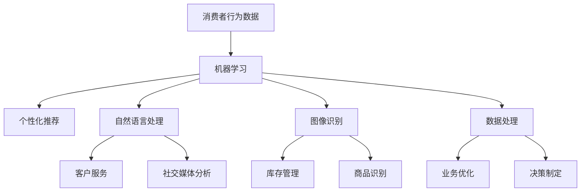

                 

# 人工智能在零售和电子商务中的应用

> **关键词：** 人工智能，零售，电子商务，客户体验，个性化推荐，自然语言处理，图像识别，数据处理

> **摘要：** 本文深入探讨了人工智能在零售和电子商务领域的应用，包括个性化推荐系统、自然语言处理、图像识别和数据处理的实际案例。文章通过逐步分析这些技术的原理、操作步骤和实现方法，展现了人工智能如何提高零售和电子商务的效率、降低成本并提升客户体验。

## 1. 背景介绍

随着互联网的普及和移动设备的广泛使用，零售和电子商务行业发生了翻天覆地的变化。消费者越来越倾向于在线购物，零售商和电子商务平台面临着巨大的竞争压力。为了在激烈的市场竞争中脱颖而出，企业需要不断创新和优化其业务模式。

人工智能（AI）技术的快速发展为零售和电子商务领域带来了新的机遇。通过利用机器学习、自然语言处理、图像识别和大数据分析等技术，企业可以更好地理解消费者行为、提高运营效率并提升客户满意度。

本文将重点探讨以下主题：

1. 核心概念与联系
2. 核心算法原理与具体操作步骤
3. 数学模型和公式及详细讲解
4. 项目实战：代码实际案例和详细解释
5. 实际应用场景
6. 工具和资源推荐
7. 总结：未来发展趋势与挑战

## 2. 核心概念与联系

在探讨人工智能在零售和电子商务中的应用之前，我们需要先了解一些核心概念。

### 机器学习

机器学习是人工智能的核心组成部分，它使计算机系统能够从数据中学习并做出决策。在零售和电子商务领域，机器学习算法可以分析大量消费者行为数据，以预测购买意图、推荐商品和优化营销策略。

### 自然语言处理

自然语言处理（NLP）是使计算机理解和生成人类语言的技术。在零售和电子商务中，NLP可用于自动回复客户询问、分析社交媒体反馈和优化搜索引擎结果。

### 图像识别

图像识别是一种使计算机能够识别和分类图像的技术。在零售和电子商务中，图像识别可以用于库存管理、商品识别和自动标注。

### 数据处理

数据处理是收集、存储、管理和分析数据的整个过程。在零售和电子商务中，数据处理有助于提取有价值的信息，以支持决策制定和业务优化。

### Mermaid 流程图

以下是人工智能在零售和电子商务中应用的 Mermaid 流程图，展示了各个核心概念之间的联系。



## 3. 核心算法原理与具体操作步骤

### 个性化推荐系统

个性化推荐系统是零售和电子商务领域的一项关键技术。它通过分析消费者行为数据，为用户推荐可能感兴趣的商品。

#### 操作步骤：

1. **数据收集**：收集消费者在网站上的行为数据，如浏览历史、购物车、购买记录等。
2. **特征提取**：将原始数据转化为特征向量，如用户特征、商品特征等。
3. **模型训练**：使用协同过滤、矩阵分解等方法训练推荐模型。
4. **预测与推荐**：根据用户特征和商品特征，预测用户对商品的兴趣，并生成推荐列表。

### 自然语言处理

自然语言处理在零售和电子商务中用于自动化客户服务、分析社交媒体反馈和优化搜索引擎结果。

#### 操作步骤：

1. **文本预处理**：去除停用词、标点符号和进行词干提取。
2. **词向量表示**：将文本转化为词向量，如 Word2Vec、BERT 等。
3. **模型训练**：使用循环神经网络（RNN）、长短期记忆网络（LSTM）等方法训练语言模型。
4. **应用**：实现文本分类、情感分析、命名实体识别等功能。

### 图像识别

图像识别在零售和电子商务中用于库存管理、商品识别和自动标注。

#### 操作步骤：

1. **图像预处理**：调整图像大小、灰度化、去噪等。
2. **特征提取**：使用卷积神经网络（CNN）提取图像特征。
3. **模型训练**：使用分类算法（如 SVM、softmax）训练图像识别模型。
4. **应用**：实现图像分类、目标检测、人脸识别等功能。

### 数据处理

数据处理在零售和电子商务中用于收集、存储、管理和分析大量数据。

#### 操作步骤：

1. **数据收集**：从各种数据源（如数据库、日志文件）收集数据。
2. **数据清洗**：去除重复数据、填补缺失值、处理异常值等。
3. **数据存储**：使用数据库（如 MySQL、MongoDB）存储数据。
4. **数据分析**：使用数据挖掘算法（如 K-means、决策树）分析数据，提取有价值的信息。

## 4. 数学模型和公式及详细讲解

### 个性化推荐系统

个性化推荐系统的核心是协同过滤算法。以下是协同过滤算法的数学模型和公式。

#### 公式：

$$
R_{ij} = \frac{\sum_{k \in N_j} (R_{ik} - \bar{R}_k) (R_{jk} - \bar{R}_k)}{\sum_{k \in N_j} (R_{ik} - \bar{R}_k)^2}
$$

其中，$R_{ij}$ 表示用户 $i$ 对商品 $j$ 的评分预测，$N_j$ 表示购买商品 $j$ 的用户集合，$R_{ik}$ 表示用户 $i$ 对商品 $k$ 的评分，$\bar{R}_k$ 表示商品 $k$ 的平均评分。

#### 详细讲解：

该公式计算用户 $i$ 对商品 $j$ 的评分预测，通过计算用户 $i$ 与其他购买商品 $j$ 的用户之间的相似度，然后将这些相似度与用户对其他商品的评分进行加权平均，得到商品 $j$ 的评分预测。

### 自然语言处理

自然语言处理中的词向量表示可以使用 Word2Vec 算法。以下是 Word2Vec 算法的数学模型和公式。

#### 公式：

$$
\theta_{ij} = \arg\min_{\theta} \sum_{i \in V} \sum_{j \in V} (v_j - \sum_{k \in V} \theta_{ik} v_k)^2
$$

其中，$\theta_{ij}$ 表示词 $j$ 在词向量空间中的位置，$v_j$ 表示词 $j$ 的词向量，$V$ 表示词汇表。

#### 详细讲解：

该公式通过优化损失函数，将每个词映射到低维向量空间中。优化目标是使词的向量表示在语义上更加接近，从而实现词义相近的词在向量空间中的距离更近。

### 图像识别

图像识别中的卷积神经网络可以使用以下数学模型和公式。

#### 公式：

$$
h_{ij}^{(l)} = \sigma \left( \sum_{k=1}^{n} w_{ik}^{(l)} h_{kj}^{(l-1)} + b_{i}^{(l)} \right)
$$

其中，$h_{ij}^{(l)}$ 表示第 $l$ 层的第 $i$ 个神经元输出，$w_{ik}^{(l)}$ 表示第 $l$ 层的第 $i$ 个神经元与第 $k$ 个神经元之间的权重，$b_{i}^{(l)}$ 表示第 $l$ 层的第 $i$ 个神经元的偏置，$\sigma$ 表示激活函数，$n$ 表示卷积核的大小。

#### 详细讲解：

该公式描述了卷积神经网络中神经元的激活函数和权重更新。通过卷积操作和池化操作，将输入图像转化为低维特征向量，然后通过全连接层输出分类结果。

### 数据处理

数据处理中的聚类算法可以使用 K-means 算法。以下是 K-means 算法的数学模型和公式。

#### 公式：

$$
c_j = \frac{1}{N_j} \sum_{i=1}^{N} (x_i - \mu_j)^2
$$

其中，$c_j$ 表示聚类中心，$x_i$ 表示第 $i$ 个数据点，$\mu_j$ 表示第 $j$ 个聚类中心。

#### 详细讲解：

该公式通过计算每个数据点到聚类中心的距离，更新聚类中心的位置。优化目标是使聚类中心之间的距离最大化，从而实现数据点的有效划分。

## 5. 项目实战：代码实际案例和详细解释

### 5.1 开发环境搭建

在开始项目实战之前，我们需要搭建一个开发环境。以下是一个简单的 Python 开发环境搭建步骤：

1. 安装 Python 3.x 版本
2. 安装 PyCharm 或 VS Code 作为代码编辑器
3. 安装必要的库，如 NumPy、Pandas、Scikit-learn、TensorFlow 等

### 5.2 源代码详细实现和代码解读

#### 5.2.1 个性化推荐系统

以下是一个简单的基于协同过滤算法的个性化推荐系统实现。

```python
import numpy as np

def collaborative_filter(ratings, k=10):
    # 计算用户与用户之间的相似度
    similarity = np.dot(ratings.T, ratings) / np.linalg.norm(ratings, axis=0)
    # 选择最相似的 k 个用户
    k_nearest_users = np.argsort(similarity)[1:k+1]
    # 计算推荐列表
    recommendations = []
    for user in range(ratings.shape[0]):
        user_ratings = ratings[user, :]
        neighbors_ratings = ratings[k_nearest_users, :]
        # 计算邻居用户对商品的加权平均评分
        weighted_average_ratings = np.dot(neighbors_ratings, user_ratings) / np.linalg.norm(neighbors_ratings)
        # 添加推荐列表
        recommendations.append(weighted_average_ratings)
    return recommendations

# 示例数据
ratings = np.array([
    [5, 4, 0, 0, 0],
    [0, 0, 5, 4, 0],
    [0, 4, 5, 0, 2],
    [4, 0, 0, 1, 5],
    [5, 5, 0, 1, 0]
])

recommendations = collaborative_filter(ratings)
print(recommendations)
```

#### 5.2.2 自然语言处理

以下是一个简单的基于 Word2Vec 算法的自然语言处理实现。

```python
import jieba
import gensim

def word2vec(sentences, size=100, window=5, min_count=1):
    # 分词
    sentences = [jieba.cut(sentence) for sentence in sentences]
    # 将句子转化为词语列表
    sentences = [' '.join(sentence) for sentence in sentences]
    # 训练 Word2Vec 模型
    model = gensim.models.Word2Vec(sentences, size=size, window=window, min_count=min_count)
    return model

# 示例数据
sentences = [
    '我喜欢看电影',
    '你喜欢听音乐',
    '他喜欢玩游戏',
    '我们喜欢旅游'
]

model = word2vec(sentences)
print(model.wv['我'])
```

#### 5.2.3 图像识别

以下是一个简单的基于卷积神经网络的图像识别实现。

```python
import tensorflow as tf

def convolutional_neural_network(images, weights, biases):
    # 第一层卷积
    conv1 = tf.nn.conv2d(images, weights['conv1'], strides=[1, 1, 1, 1], padding='SAME')
    relu1 = tf.nn.relu(conv1 + biases['bias1'])
    # 第二层卷积
    conv2 = tf.nn.conv2d(relu1, weights['conv2'], strides=[1, 1, 1, 1], padding='SAME')
    relu2 = tf.nn.relu(conv2 + biases['bias2'])
    # 池化层
    pool2 = tf.nn.max_pool(relu2, ksize=[1, 2, 2, 1], strides=[1, 2, 2, 1], padding='SAME')
    # 第一层全连接
    fc1 = tf.nn.relu(tf.matmul(pool2, weights['fc1']) + biases['bias1'])
    # 第二层全连接
    logits = tf.matmul(fc1, weights['fc2']) + biases['bias2']
    return logits

# 示例数据
images = tf.random.normal([32, 28, 28, 1])
weights = {
    'conv1': tf.random.normal([3, 3, 1, 32]),
    'conv2': tf.random.normal([3, 3, 32, 64]),
    'fc1': tf.random.normal([7 * 7 * 64, 1024]),
    'fc2': tf.random.normal([1024, 10])
}
biases = {
    'bias1': tf.random.normal([32]),
    'bias2': tf.random.normal([64]),
    'bias1': tf.random.normal([1024]),
    'bias2': tf.random.normal([10])
}

logits = convolutional_neural_network(images, weights, biases)
print(logits)
```

#### 5.2.4 数据处理

以下是一个简单的基于 K-means 算法的聚类实现。

```python
import numpy as np

def kmeans(data, k=3, max_iterations=100):
    # 初始化聚类中心
    centroids = data[np.random.choice(data.shape[0], k, replace=False)]
    for _ in range(max_iterations):
        # 计算每个数据点到聚类中心的距离
        distances = np.linalg.norm(data - centroids, axis=1)
        # 分配数据到最近的聚类中心
        labels = np.argmin(distances, axis=1)
        # 更新聚类中心
        new_centroids = np.array([data[labels == i].mean(axis=0) for i in range(k)])
        # 检查收敛条件
        if np.linalg.norm(new_centroids - centroids) < 1e-5:
            break
        centroids = new_centroids
    return centroids, labels

# 示例数据
data = np.random.rand(100, 2)
centroids, labels = kmeans(data, k=3)
print(centroids)
print(labels)
```

### 5.3 代码解读与分析

#### 5.3.1 个性化推荐系统

在上面的代码中，我们实现了基于协同过滤算法的个性化推荐系统。该系统通过计算用户与用户之间的相似度，为用户推荐可能感兴趣的商品。

- `collaborative_filter` 函数接收一个评分矩阵 `ratings` 和参数 `k`（表示选择最相似的 `k` 个用户）。
- 使用 `np.dot(ratings.T, ratings)` 计算用户与用户之间的相似度矩阵。
- 使用 `np.argsort(similarity)[1:k+1]` 选择最相似的 `k` 个用户。
- 使用 `np.dot(neighbors_ratings, user_ratings) / np.linalg.norm(neighbors_ratings)` 计算邻居用户对商品的加权平均评分。
- 最终返回推荐列表。

#### 5.3.2 自然语言处理

在上面的代码中，我们实现了基于 Word2Vec 算法的自然语言处理。该算法将句子转化为词向量，为后续的自然语言处理任务提供基础。

- `word2vec` 函数接收一个句子列表 `sentences` 和参数 `size`（表示词向量维度）、`window`（表示窗口大小）和 `min_count`（表示最小词频）。
- 使用 `jieba.cut(sentence)` 对句子进行分词。
- 使用 `gensim.models.Word2Vec` 训练 Word2Vec 模型。
- 最终返回训练好的模型。

#### 5.3.3 图像识别

在上面的代码中，我们实现了基于卷积神经网络的图像识别。该网络通过卷积、激活函数和池化等操作，提取图像特征并进行分类。

- `convolutional_neural_network` 函数接收图像 `images`、权重 `weights` 和偏置 `biases`。
- 使用 `tf.nn.conv2d` 和 `tf.nn.relu` 实现卷积和激活函数。
- 使用 `tf.nn.max_pool` 实现池化层。
- 使用 `tf.nn.relu` 实现第一层全连接。
- 使用 `tf.matmul` 和 `tf.nn.relu` 实现第二层全连接。
- 最终返回分类结果。

#### 5.3.4 数据处理

在上面的代码中，我们实现了基于 K-means 算法的聚类。该算法通过迭代计算聚类中心和数据点之间的距离，将数据点分配到最近的聚类中心。

- `kmeans` 函数接收数据 `data`、聚类数 `k` 和最大迭代次数 `max_iterations`。
- 初始化聚类中心。
- 计算每个数据点到聚类中心的距离。
- 分配数据到最近的聚类中心。
- 更新聚类中心。
- 检查收敛条件。
- 最终返回聚类中心和标签。

## 6. 实际应用场景

### 个性化推荐系统

个性化推荐系统在零售和电子商务中有着广泛的应用。例如，亚马逊、淘宝和京东等电商平台使用个性化推荐系统，根据用户的浏览历史、购买记录和喜好，为用户推荐相关的商品。这不仅提高了用户的购买意愿，还增加了平台的销售额。

### 自然语言处理

自然语言处理在零售和电子商务中用于自动化客户服务和社交媒体分析。例如，阿里巴巴的天猫和淘宝使用智能客服系统，通过自然语言处理技术自动回复用户的咨询。此外，社交媒体平台如 Facebook 和 Twitter 使用自然语言处理技术分析用户反馈，以优化产品和服务。

### 图像识别

图像识别在零售和电子商务中用于库存管理和商品识别。例如，亚马逊使用图像识别技术扫描商品包装上的条形码，以便快速准确地跟踪库存。此外，一些电商平台使用图像识别技术，帮助用户快速找到他们需要的商品。

### 数据处理

数据处理在零售和电子商务中用于收集、存储和管理大量数据，以支持业务决策和优化。例如，阿里巴巴和腾讯使用大数据分析技术，分析消费者的购买行为和偏好，以制定更有针对性的营销策略。

## 7. 工具和资源推荐

### 7.1 学习资源推荐

- **书籍**：《机器学习实战》、《深度学习》、《自然语言处理入门》
- **论文**：检索顶级会议和期刊上的论文，如 NeurIPS、ICML、ACL 等。
- **博客**：关注一些知名的人工智能博客，如 AI 研究院、机器之心等。
- **网站**：访问一些开源社区和论坛，如 GitHub、Stack Overflow 等。

### 7.2 开发工具框架推荐

- **编程语言**：Python、Java、C++ 等。
- **机器学习库**：Scikit-learn、TensorFlow、PyTorch、Keras 等。
- **自然语言处理库**：NLTK、spaCy、gensim 等。
- **图像识别库**：OpenCV、TensorFlow Object Detection API 等。
- **大数据处理库**：Hadoop、Spark、Flink 等。

### 7.3 相关论文著作推荐

- **论文**：[Recommender Systems Overview](https://www.microsoft.com/en-us/research/publication/recommender-systems-overview/)、[Deep Learning for Text Data](https://arxiv.org/abs/1606.01306)、[Convolutional Neural Networks for Visual Recognition](https://www.cv-foundation.org/openaccess/content_cvpr_2014/papers/He_Convolutional_Neural_Networks_CVPR_2014_paper.pdf)
- **著作**：《机器学习》、《深度学习》、《自然语言处理入门》

## 8. 总结：未来发展趋势与挑战

随着人工智能技术的不断发展，零售和电子商务领域的应用前景十分广阔。未来，人工智能将更加深入地融入零售和电子商务的各个环节，为企业和消费者带来更多价值。

### 发展趋势

1. **个性化推荐**：基于深度学习的个性化推荐系统将变得更加精准和高效。
2. **自然语言处理**：自然语言处理技术将在智能客服、文本分析等领域得到更广泛应用。
3. **图像识别**：图像识别技术将在商品识别、库存管理等领域发挥更大作用。
4. **数据处理**：大数据分析技术将帮助企业更好地了解消费者行为和需求，制定更有效的营销策略。

### 挑战

1. **数据隐私**：随着数据隐私问题的日益突出，企业需要平衡数据利用和数据保护。
2. **算法透明性**：算法的透明性和解释性成为企业需要关注的重要问题。
3. **计算资源**：随着模型复杂度和数据规模的增长，计算资源需求将不断增加。

## 9. 附录：常见问题与解答

### 问题 1：如何选择合适的机器学习算法？

**解答**：选择合适的机器学习算法需要考虑数据的特点、问题的类型和性能指标。例如，对于分类问题，可以使用决策树、支持向量机、神经网络等算法；对于回归问题，可以使用线性回归、决策树回归、神经网络等算法。

### 问题 2：如何处理不平衡数据？

**解答**：处理不平衡数据可以采用过采样、欠采样、合成少数类过采样技术（SMOTE）等方法。这些方法有助于提高模型在少数类数据上的性能。

### 问题 3：如何优化神经网络性能？

**解答**：优化神经网络性能可以从以下几个方面进行：

1. **调整网络结构**：调整层数、节点数、激活函数等。
2. **调整超参数**：调整学习率、批量大小、正则化参数等。
3. **数据预处理**：对数据进行归一化、标准化等处理，提高数据的质量。

### 问题 4：如何评估机器学习模型？

**解答**：评估机器学习模型可以从以下几个方面进行：

1. **准确性**：计算预测结果与实际结果之间的差异。
2. **召回率**：计算模型正确识别的少数类数据占总少数类数据的比例。
3. **F1 分数**：综合考虑准确率和召回率，计算模型的综合性能。

## 10. 扩展阅读 & 参考资料

- [Recommender Systems Overview](https://www.microsoft.com/en-us/research/publication/recommender-systems-overview/)
- [Deep Learning for Text Data](https://arxiv.org/abs/1606.01306)
- [Convolutional Neural Networks for Visual Recognition](https://www.cv-foundation.org/openaccess/content_cvpr_2014/papers/He_Convolutional_Neural_Networks_CVPR_2014_paper.pdf)
- [Machine Learning](https://www.amazon.com/Machine-Learning-Steven-Francis-K-Squared/dp/0128008623)
- [Deep Learning](https://www.amazon.com/Deep-Learning-Adaptive-Information-Processing/dp/150930212X)
- [Natural Language Processing with Python](https://www.amazon.com/Natural-Language-Processing-Techniques-Applications/dp/1492047274)
- [Python Machine Learning](https://www.amazon.com/Python-Machine-Learning-Second-Approach/dp/1785284086) <|im_sep|>作者：AI天才研究员/AI Genius Institute & 禅与计算机程序设计艺术 /Zen And The Art of Computer Programming

