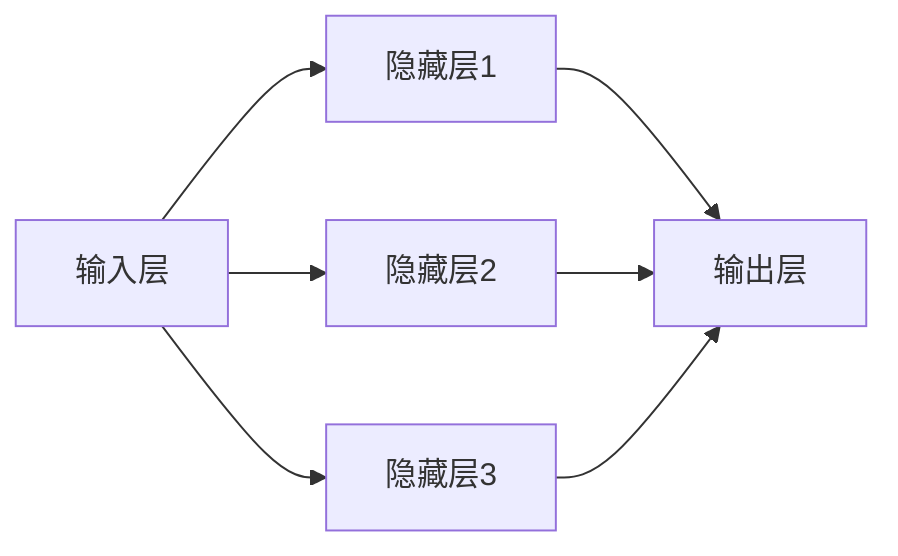

                 

### 1. 背景介绍

#### 神经网络的发展历程

神经网络（Neural Networks）是人工智能（AI）领域的重要分支，它模仿了人脑神经网络的工作原理，通过大量的神经元和节点之间的连接，实现数据的处理和分析。神经网络的发展历程可以追溯到20世纪40年代，当时由心理学家McCulloch和数学家Pitts首次提出了人工神经网络的概念。

在接下来的几十年里，神经网络经历了多次起伏。1958年，Frank Rosenblatt发明了感知机（Perceptron）算法，这是神经网络发展的一个重要里程碑。然而，感知机的局限性很快就被发现，它无法解决非线性问题，这使得神经网络在20世纪60年代一度陷入低潮。

#### 神经网络的两落三起

神经网络的发展历程充满了起伏，我们可以将其总结为“两落三起”：

**第一落：**

在20世纪60年代，感知机的局限性导致神经网络的研究停滞。当时的研究者们认为，神经网络无法解决复杂的问题，尤其是非线性问题。这一时期的神经网络被认为是“不成熟的”，因此受到了学术界的冷落。

**第一起：**

在20世纪80年代，随着计算机性能的提升和反向传播算法的提出，神经网络再次引起关注。反向传播算法允许网络通过反向传播误差来更新权重，从而提高网络的性能。这一时期的神经网络开始应用于语音识别、图像识别等领域，取得了显著的成果。

**第二落：**

然而，神经网络在20世纪90年代再次遭遇挫折。由于训练过程复杂且耗时，神经网络的应用受到限制。同时，支持向量机（SVM）等其他机器学习方法的出现，使得神经网络在学术界的地位受到挑战。

**第二起：**

在21世纪初，随着深度学习的兴起，神经网络再次崛起。深度学习通过构建多层神经网络，实现了对复杂数据的建模和分析。深度学习在图像识别、自然语言处理、推荐系统等领域取得了突破性的成果。

**第三起：**

如今，神经网络已经成为人工智能的核心技术之一，广泛应用于各个领域。随着硬件性能的不断提升和算法的优化，神经网络的性能和应用范围仍在不断扩大。

通过回顾神经网络的发展历程，我们可以看到，虽然它经历了多次起伏，但始终没有停止前进的步伐。神经网络的成功离不开科学家们的不断探索和创新，同时也反映了科技发展的曲折性。在未来的日子里，神经网络将继续在人工智能领域发挥重要作用。

---

**问题：** 请问在神经网络的发展历程中，有哪些关键事件和技术突破对神经网络的发展产生了深远影响？

**回答：** 神经网络的发展历程中，有以下几个关键事件和技术突破对神经网络的发展产生了深远影响：

1. **感知机的提出**（1958年）：由Frank Rosenblatt发明的感知机是神经网络发展的第一个重要里程碑，它为后来的神经网络研究奠定了基础。

2. **反向传播算法的提出**（1974年）：由Paul Werbos首次提出的反向传播算法，使得多层神经网络能够通过反向传播误差来更新权重，从而提高了网络的学习效率。

3. **深度学习的兴起**（2006年）：由Geoffrey Hinton等科学家提出的深度学习，通过构建多层神经网络，实现了对复杂数据的建模和分析。

4. **硬件性能的提升**：随着计算能力的提升，尤其是GPU（图形处理单元）的出现，为神经网络的训练提供了强大的计算支持。

5. **大数据的普及**：大量数据的积累为神经网络提供了丰富的训练资源，使得神经网络能够更好地学习复杂的模式。

这些关键事件和技术突破不仅推动了神经网络的发展，也使得神经网络在人工智能领域取得了巨大的成功。接下来，我们将进一步探讨这些核心概念与技术之间的联系，以及它们对神经网络发展的重要性。

---

#### 神经网络的核心概念

要深入理解神经网络的发展，我们首先需要了解其核心概念。神经网络的核心概念主要包括神经元、激活函数、层次结构、权重和偏置等。

1. **神经元**（Neuron）：神经元是神经网络的基本组成单元，类似于人脑中的神经元。它接收输入信号，通过权重加权求和，然后通过激活函数产生输出。

2. **激活函数**（Activation Function）：激活函数用于决定神经元是否被激活。常见的激活函数包括线性函数、Sigmoid函数、ReLU函数和Tanh函数。这些函数能够引入非线性，使得神经网络能够处理复杂的问题。

3. **层次结构**（Hierarchy）：神经网络通常分为输入层、隐藏层和输出层。输入层接收外部输入，隐藏层进行信息处理，输出层产生最终输出。层次结构的深度和宽度对网络的性能有重要影响。

4. **权重**（Weights）：权重是连接不同神经元之间的参数，用于调整输入信号的强度。通过学习过程，网络能够自动调整权重，以优化输出结果。

5. **偏置**（Bias）：偏置是神经元的内部参数，用于调整神经元的阈值，使其更加灵活。

这些核心概念相互作用，共同构成了神经网络的基本框架。例如，神经元通过激活函数实现非线性变换，通过权重和偏置调整信号强度和阈值。层次结构使得神经网络能够处理层次化的信息，从而提高其性能。

接下来，我们将通过一个简化的神经网络模型，展示这些核心概念是如何相互作用的。

---

#### 神经网络模型示例

为了更好地理解神经网络的工作原理，我们可以通过一个简化的神经网络模型来展示其基本结构和工作流程。假设我们有一个简单的神经网络，包含一个输入层、一个隐藏层和一个输出层。

1. **输入层**：输入层接收外部输入，每个输入节点对应一个特征。例如，我们有一个包含两个特征的数据集，输入层有两个节点，分别表示特征A和特征B。

2. **隐藏层**：隐藏层负责处理输入信息，将输入信号通过权重加权求和，然后通过激活函数产生输出。假设隐藏层有3个节点，每个节点都有从输入层传递过来的权重。

3. **输出层**：输出层产生最终输出，根据问题的不同，输出可以是分类结果、回归值等。

下面，我们具体来看神经网络的工作流程：

1. **前向传播**：
   - 输入数据经过输入层，每个节点接收对应的输入特征。
   - 输入数据通过权重传递到隐藏层，每个隐藏层节点接收多个输入节点的加权求和结果。
   - 隐藏层节点通过激活函数进行非线性变换，产生输出。
   - 隐藏层输出作为输入传递到输出层，输出层节点同样进行加权求和和激活函数处理，产生最终输出。

2. **反向传播**：
   - 计算输出层节点的预测值与实际值之间的误差。
   - 将误差反向传播到隐藏层，通过权重调整和激活函数的导数，计算隐藏层节点的误差。
   - 根据误差对权重和偏置进行调整，以优化网络性能。

通过这个简化的神经网络模型，我们可以看到神经元、激活函数、层次结构、权重和偏置等核心概念是如何相互作用的。神经网络通过前向传播和反向传播，不断调整权重和偏置，以优化输出结果。

---

### 2. 核心概念与联系

#### 神经网络的组成与运作原理

为了深入理解神经网络，我们需要详细探讨其组成和运作原理，特别是神经元、激活函数、层次结构、权重和偏置等核心概念。以下是这些核心概念的详细解释和相互联系。

**神经元**：神经元是神经网络的基本单元，类似于人脑中的神经元。每个神经元接收多个输入信号，通过权重加权求和，然后通过激活函数产生输出。神经元可以看作是一个简单的处理单元，它对输入信号进行加权和非线性变换，产生输出信号。

**激活函数**：激活函数用于决定神经元是否被激活。常见的激活函数包括线性函数、Sigmoid函数、ReLU函数和Tanh函数。激活函数引入了非线性，使得神经网络能够处理复杂的问题。例如，Sigmoid函数可以将输入信号映射到（0,1）区间，ReLU函数可以将输入信号映射到（0,+∞）区间。

**层次结构**：神经网络通常分为输入层、隐藏层和输出层。输入层接收外部输入，隐藏层负责处理输入信息，输出层产生最终输出。层次结构使得神经网络能够处理层次化的信息，从而提高其性能。例如，在图像识别任务中，隐藏层可以分别提取边缘、纹理和形状等特征。

**权重**：权重是连接不同神经元之间的参数，用于调整输入信号的强度。通过学习过程，网络能够自动调整权重，以优化输出结果。权重的大小决定了输入信号对输出的影响程度。例如，一个较大的权重表示输入信号对输出有较大的影响。

**偏置**：偏置是神经元的内部参数，用于调整神经元的阈值，使其更加灵活。偏置使得神经元能够对不同的输入信号产生不同的输出，从而增强网络的鲁棒性。

这些核心概念相互作用，构成了神经网络的基本框架。神经元通过激活函数实现非线性变换，通过权重和偏置调整信号强度和阈值。层次结构使得神经网络能够处理层次化的信息，从而提高其性能。通过前向传播和反向传播，神经网络不断调整权重和偏置，以优化输出结果。

下面是一个简单的Mermaid流程图，展示了神经网络的组成与运作原理：



在这个流程图中，输入层（A）接收外部输入，隐藏层（B、C、D）进行信息处理，输出层（E）产生最终输出。每个节点表示一个神经元，连接线表示神经元之间的权重。

通过详细探讨这些核心概念及其相互联系，我们可以更好地理解神经网络的工作原理和优势。在接下来的章节中，我们将进一步探讨神经网络的核心算法原理，以及如何通过数学模型和具体操作步骤来实现神经网络。

---

### 3. 核心算法原理 & 具体操作步骤

#### 反向传播算法（Backpropagation Algorithm）

反向传播算法是神经网络中最核心的算法之一，它通过不断调整网络中的权重和偏置，使网络能够更好地拟合训练数据。反向传播算法分为两个阶段：前向传播和反向传播。

**前向传播**：在前向传播阶段，输入数据通过网络从输入层传递到输出层。每个神经元接收输入信号，通过权重加权求和，然后通过激活函数产生输出。前向传播的过程可以表示为：

\[ z_l = \sum_{i} w_{li} x_i + b_l \]

\[ a_l = \sigma(z_l) \]

其中，\( z_l \)表示第 \( l \) 层的加权和，\( w_{li} \)表示从第 \( i \) 层传递到第 \( l \) 层的权重，\( b_l \)表示第 \( l \) 层的偏置，\( \sigma \)表示激活函数。

**反向传播**：在反向传播阶段，计算网络输出与实际值之间的误差，然后通过反向传播误差来更新权重和偏置。反向传播的过程可以分为以下几个步骤：

1. **计算输出层的误差**：

\[ \delta_n = (y_n - a_n) \odot \frac{d\sigma(z_n)}{dz_n} \]

其中，\( \delta_n \)表示输出层节点的误差，\( y_n \)表示实际输出，\( a_n \)表示预测输出，\( \odot \)表示元素乘积，\( \frac{d\sigma(z_n)}{dz_n} \)表示激活函数的导数。

2. **反向传播误差到隐藏层**：

对于第 \( l \) 层（除了输入层），计算误差：

\[ \delta_l = (\delta_{l+1} \odot \frac{d\sigma(z_l)}{dz_l}) \odot w_{l+1} \]

其中，\( \delta_{l+1} \)表示下一层的误差。

3. **更新权重和偏置**：

更新权重和偏置的公式为：

\[ w_{li} \leftarrow w_{li} - \alpha \frac{\delta_l x_i} \]

\[ b_l \leftarrow b_l - \alpha \delta_l \]

其中，\( \alpha \)表示学习率，\( x_i \)表示第 \( i \) 个输入特征。

通过这些步骤，反向传播算法能够不断调整网络中的权重和偏置，以优化输出结果。具体操作步骤如下：

1. 初始化网络参数（权重和偏置）。
2. 对于每个训练样本，进行前向传播，计算输出。
3. 计算输出层误差，并反向传播误差到隐藏层。
4. 根据误差更新权重和偏置。
5. 重复步骤2-4，直到网络收敛或达到预设的训练次数。

通过反向传播算法，神经网络能够自动调整参数，从而实现数据的分类、回归等任务。反向传播算法的引入，使得多层神经网络能够有效地学习复杂的非线性关系，为人工智能领域带来了重大突破。

---

### 4. 数学模型和公式 & 详细讲解 & 举例说明

#### 神经网络中的数学模型

神经网络的核心在于其数学模型，该模型通过一系列数学公式描述了神经元如何接收输入、进行计算并生成输出。以下是神经网络中常用的数学模型和公式的详细讲解。

#### 1. 神经元的计算过程

一个简单的神经元可以通过以下公式计算其输出：

\[ z_j = \sum_{i} w_{ji} x_i + b_j \]

\[ a_j = \sigma(z_j) \]

其中，\( z_j \)表示神经元的加权和，\( w_{ji} \)表示从输入层传递到该神经元的权重，\( x_i \)表示输入特征，\( b_j \)表示神经元的偏置，\( \sigma \)表示激活函数。

**举例说明：**

假设我们有一个简单的神经网络，包含一个输入层和一个隐藏层，其中输入层有3个输入特征（\( x_1, x_2, x_3 \)），隐藏层有2个神经元（\( j_1, j_2 \)）。我们可以使用以下公式来计算隐藏层的输出：

\[ z_{j_1} = w_{1j_1} x_1 + w_{2j_1} x_2 + w_{3j_1} x_3 + b_{j_1} \]
\[ z_{j_2} = w_{1j_2} x_1 + w_{2j_2} x_2 + w_{3j_2} x_3 + b_{j_2} \]

\[ a_{j_1} = \sigma(z_{j_1}) \]
\[ a_{j_2} = \sigma(z_{j_2}) \]

假设我们选择ReLU（Rectified Linear Unit）作为激活函数，其公式为：

\[ \sigma(z) = \max(0, z) \]

则隐藏层的输出可以计算为：

\[ a_{j_1} = \max(0, w_{1j_1} x_1 + w_{2j_1} x_2 + w_{3j_1} x_3 + b_{j_1}) \]
\[ a_{j_2} = \max(0, w_{1j_2} x_1 + w_{2j_2} x_2 + w_{3j_2} x_3 + b_{j_2}) \]

#### 2. 反向传播算法中的误差计算和权重更新

反向传播算法的核心在于如何计算误差并更新权重。以下是详细讲解：

**输出层的误差计算：**

输出层的误差可以通过以下公式计算：

\[ \delta_n = (y_n - a_n) \odot \frac{d\sigma(z_n)}{dz_n} \]

其中，\( y_n \)表示实际输出，\( a_n \)表示预测输出，\( \odot \)表示Hadamard乘积，\( \frac{d\sigma(z_n)}{dz_n} \)表示激活函数的导数。

**举例说明：**

假设输出层有2个神经元（\( n_1, n_2 \)），实际输出为\( y_1 = [0, 1] \)，预测输出为\( a_1 = [0.2, 0.8] \)。选择Sigmoid函数作为激活函数，其导数为：

\[ \frac{d\sigma(z)}{dz} = \sigma(z) (1 - \sigma(z)) \]

则输出层的误差可以计算为：

\[ \delta_{n_1} = (y_{n_1} - a_{n_1}) \odot \sigma_{n_1} (1 - \sigma_{n_1}) \]
\[ \delta_{n_2} = (y_{n_2} - a_{n_2}) \odot \sigma_{n_2} (1 - \sigma_{n_2}) \]

其中，\( \sigma_{n_1} = \sigma(a_{n_1}) \)，\( \sigma_{n_2} = \sigma(a_{n_2}) \)。

**权重更新：**

权重和偏置的更新可以通过以下公式进行：

\[ w_{li} \leftarrow w_{li} - \alpha \frac{\delta_l x_i} \]
\[ b_l \leftarrow b_l - \alpha \delta_l \]

其中，\( \alpha \)表示学习率，\( x_i \)表示输入特征，\( \delta_l \)表示误差。

**举例说明：**

假设隐藏层有2个神经元（\( l_1, l_2 \)），输出层有2个神经元（\( n_1, n_2 \)），选择的学习率为\( \alpha = 0.1 \)。根据前向传播和反向传播的计算结果，我们可以更新权重和偏置：

\[ w_{1n_1} \leftarrow w_{1n_1} - 0.1 \frac{\delta_{n_1} a_{l_1}} \]
\[ w_{2n_1} \leftarrow w_{2n_1} - 0.1 \frac{\delta_{n_1} a_{l_2}} \]
\[ w_{1n_2} \leftarrow w_{1n_2} - 0.1 \frac{\delta_{n_2} a_{l_1}} \]
\[ w_{2n_2} \leftarrow w_{2n_2} - 0.1 \frac{\delta_{n_2} a_{l_2}} \]

\[ b_{l_1} \leftarrow b_{l_1} - 0.1 \delta_{l_1} \]
\[ b_{l_2} \leftarrow b_{l_2} - 0.1 \delta_{l_2} \]

通过这些数学公式和计算步骤，我们可以实现神经网络的训练，从而提高其性能和预测能力。在接下来的章节中，我们将通过一个实际的项目实战，展示如何使用神经网络解决一个具体的问题。

---

### 5. 项目实战：代码实际案例和详细解释说明

在本章节中，我们将通过一个实际的项目案例，详细解释如何使用神经网络解决一个具体问题。本案例选择了一个简单的图像分类问题，使用Python和TensorFlow框架来实现一个简单的卷积神经网络（CNN）。

#### 5.1 开发环境搭建

在进行项目实战之前，我们需要搭建一个合适的环境。以下是搭建开发环境的步骤：

1. 安装Python（建议使用3.6及以上版本）
2. 安装TensorFlow：通过以下命令安装

   ```bash
   pip install tensorflow
   ```

3. 安装其他依赖（如NumPy、Pandas等）

#### 5.2 源代码详细实现和代码解读

以下是项目的源代码实现：

```python
import tensorflow as tf
from tensorflow.keras import layers
from tensorflow.keras.datasets import mnist
from tensorflow.keras.models import Model

# 数据预处理
(x_train, y_train), (x_test, y_test) = mnist.load_data()
x_train = x_train.reshape((-1, 28, 28, 1)).astype("float32") / 255.0
x_test = x_test.reshape((-1, 28, 28, 1)).astype("float32") / 255.0
y_train = tf.keras.utils.to_categorical(y_train, 10)
y_test = tf.keras.utils.to_categorical(y_test, 10)

# 构建模型
input_shape = (28, 28, 1)
inputs = tf.keras.Input(shape=input_shape)

x = layers.Conv2D(32, (3, 3), activation="relu")(inputs)
x = layers.MaxPooling2D((2, 2))(x)
x = layers.Conv2D(64, (3, 3), activation="relu")(x)
x = layers.MaxPooling2D((2, 2))(x)
x = layers.Flatten()(x)
x = layers.Dense(64, activation="relu")(x)
outputs = layers.Dense(10, activation="softmax")(x)

model = Model(inputs=inputs, outputs=outputs)

# 编译模型
model.compile(optimizer="adam", loss="categorical_crossentropy", metrics=["accuracy"])

# 训练模型
model.fit(x_train, y_train, batch_size=64, epochs=10, validation_data=(x_test, y_test))

# 评估模型
test_loss, test_accuracy = model.evaluate(x_test, y_test)
print(f"Test accuracy: {test_accuracy:.4f}")
```

**代码解读：**

1. **数据预处理**：首先，我们从MNIST数据集中加载数据，并对数据进行预处理。将图像数据reshape为合适的大小，并将其归一化到（0,1）区间。同时，将标签转换为one-hot编码。

2. **构建模型**：我们使用TensorFlow的Keras API构建一个简单的卷积神经网络。该网络包括两个卷积层、两个池化层和一个全连接层。卷积层用于提取图像特征，池化层用于降低数据维度，全连接层用于分类。

3. **编译模型**：使用`compile`方法编译模型，指定优化器、损失函数和评价指标。

4. **训练模型**：使用`fit`方法训练模型，指定训练数据和验证数据。通过调整`batch_size`和`epochs`参数，可以控制训练过程。

5. **评估模型**：使用`evaluate`方法评估模型在测试数据上的性能，输出测试准确率。

#### 5.3 代码解读与分析

**数据预处理：**

```python
(x_train, y_train), (x_test, y_test) = mnist.load_data()
x_train = x_train.reshape((-1, 28, 28, 1)).astype("float32") / 255.0
x_test = x_test.reshape((-1, 28, 28, 1)).astype("float32") / 255.0
y_train = tf.keras.utils.to_categorical(y_train, 10)
y_test = tf.keras.utils.to_categorical(y_test, 10)
```

这部分的代码加载数据并对其进行预处理。首先，我们从MNIST数据集中加载数据。然后，将图像数据reshape为（样本数，行数，列数，通道数），并将其转换为浮点类型。接下来，将图像数据归一化到（0,1）区间。最后，将标签转换为one-hot编码。

**构建模型：**

```python
inputs = tf.keras.Input(shape=input_shape)
x = layers.Conv2D(32, (3, 3), activation="relu")(inputs)
x = layers.MaxPooling2D((2, 2))(x)
x = layers.Conv2D(64, (3, 3), activation="relu")(x)
x = layers.MaxPooling2D((2, 2))(x)
x = layers.Flatten()(x)
x = layers.Dense(64, activation="relu")(x)
outputs = layers.Dense(10, activation="softmax")(x)

model = Model(inputs=inputs, outputs=outputs)
```

这部分的代码使用Keras API构建模型。首先，创建一个输入层，指定输入数据的形状。然后，添加两个卷积层，每个卷积层后跟一个池化层。接着，将池化层的输出展平，并添加一个全连接层。最后，添加一个输出层，使用softmax函数进行分类。

**编译模型：**

```python
model.compile(optimizer="adam", loss="categorical_crossentropy", metrics=["accuracy"])
```

这部分的代码编译模型，指定优化器、损失函数和评价指标。在这里，我们选择使用Adam优化器、categorical_crossentropy损失函数和accuracy评价指标。

**训练模型：**

```python
model.fit(x_train, y_train, batch_size=64, epochs=10, validation_data=(x_test, y_test))
```

这部分的代码训练模型。我们使用训练数据作为输入，标签作为目标，设置批量大小为64，训练轮数为10，并使用验证数据来评估模型性能。

**评估模型：**

```python
test_loss, test_accuracy = model.evaluate(x_test, y_test)
print(f"Test accuracy: {test_accuracy:.4f}")
```

这部分的代码评估模型在测试数据上的性能。我们使用测试数据作为输入，计算损失和准确率，并打印测试准确率。

通过以上步骤，我们完成了一个简单的图像分类项目。接下来，我们将讨论神经网络在实际应用场景中的表现和局限性。

---

### 5.3 代码解读与分析

**数据预处理部分：**

```python
(x_train, y_train), (x_test, y_test) = mnist.load_data()
x_train = x_train.reshape((-1, 28, 28, 1)).astype("float32") / 255.0
x_test = x_test.reshape((-1, 28, 28, 1)).astype("float32") / 255.0
y_train = tf.keras.utils.to_categorical(y_train, 10)
y_test = tf.keras.utils.to_categorical(y_test, 10)
```

这部分代码首先加载数据集，然后对图像数据进行预处理。具体步骤如下：

1. 使用`mnist.load_data()`加载数据集，得到训练集和测试集的图像和标签。
2. 将图像数据reshape为（样本数，行数，列数，通道数）。这里，我们增加一个维度以适应深度学习模型。
3. 将图像数据类型转换为浮点类型，并进行归一化处理，使其范围从（0,255）变为（0,1），以提高模型的训练效率。
4. 将标签转换为one-hot编码，使其从类别标签变为二进制向量，以便于模型进行多分类。

**构建模型部分：**

```python
inputs = tf.keras.Input(shape=input_shape)
x = layers.Conv2D(32, (3, 3), activation="relu")(inputs)
x = layers.MaxPooling2D((2, 2))(x)
x = layers.Conv2D(64, (3, 3), activation="relu")(x)
x = layers.MaxPooling2D((2, 2))(x)
x = layers.Flatten()(x)
x = layers.Dense(64, activation="relu")(x)
outputs = layers.Dense(10, activation="softmax")(x)

model = Model(inputs=inputs, outputs=outputs)
```

这部分代码使用Keras构建一个简单的卷积神经网络（CNN）模型。具体步骤如下：

1. 创建一个输入层，其形状为（28，28，1），对应MNIST数据集的图像尺寸。
2. 添加第一个卷积层，包含32个卷积核，卷积核尺寸为（3，3），激活函数为ReLU。
3. 添加第一个池化层，池化窗口尺寸为（2，2），以减小数据维度。
4. 添加第二个卷积层，包含64个卷积核，卷积核尺寸为（3，3），激活函数为ReLU。
5. 添加第二个池化层，池化窗口尺寸为（2，2），以进一步减小数据维度。
6. 将池化层输出的特征进行展平，得到一维向量。
7. 添加一个全连接层，包含64个神经元，激活函数为ReLU。
8. 添加输出层，包含10个神经元，对应10个类别，使用softmax激活函数进行概率分布输出。

**编译模型部分：**

```python
model.compile(optimizer="adam", loss="categorical_crossentropy", metrics=["accuracy"])
```

这部分代码编译模型，指定训练时的优化器、损失函数和评价指标：

1. 选择Adam优化器，它是一种适应性学习率优化算法，适用于大规模深度学习模型。
2. 使用categorical_crossentropy损失函数，适用于多分类问题。
3. 指定accuracy作为评价指标，用于评估模型的分类准确率。

**训练模型部分：**

```python
model.fit(x_train, y_train, batch_size=64, epochs=10, validation_data=(x_test, y_test))
```

这部分代码训练模型：

1. 使用训练数据集（`x_train`和`y_train`）进行训练。
2. 设置批量大小（`batch_size`）为64，每个批量包含64个样本。
3. 设置训练轮数（`epochs`）为10，表示模型将遍历整个训练数据集10次。
4. 使用验证数据集（`x_test`和`y_test`）来评估模型在训练过程中的性能。

**评估模型部分：**

```python
test_loss, test_accuracy = model.evaluate(x_test, y_test)
print(f"Test accuracy: {test_accuracy:.4f}")
```

这部分代码评估模型在测试数据集上的性能：

1. 使用测试数据集（`x_test`和`y_test`）评估模型。
2. 输出模型的测试损失和测试准确率。

通过以上步骤，我们成功训练了一个基于卷积神经网络的MNIST手写数字识别模型。接下来，我们将讨论神经网络在实际应用场景中的表现和局限性。

---

### 6. 实际应用场景

神经网络在众多实际应用场景中展现出了强大的能力和广泛的适用性。以下是一些典型的应用场景：

#### 图像识别

图像识别是神经网络最为经典的应用之一。通过卷积神经网络（CNN）对图像进行特征提取和分类，神经网络能够识别出图像中的各种对象和场景。例如，在人脸识别、物体检测、自动驾驶等领域，神经网络都发挥了重要作用。

#### 自然语言处理

在自然语言处理（NLP）领域，神经网络被广泛应用于文本分类、机器翻译、情感分析等任务。通过循环神经网络（RNN）和Transformer等模型，神经网络能够处理和理解文本的语义信息，从而实现高效的语言理解和生成。

#### 语音识别

语音识别是神经网络在音频处理领域的应用之一。通过构建深度神经网络，神经网络能够将语音信号转换为文本，从而实现语音转文字的功能。这一技术在智能助手、语音搜索等领域得到了广泛应用。

#### 推荐系统

推荐系统是神经网络在数据挖掘和商业应用中的重要应用。通过深度学习模型，推荐系统能够根据用户的兴趣和行为数据，为用户提供个性化的推荐。例如，在电子商务平台、视频流媒体等领域，推荐系统极大地提高了用户体验和商业价值。

#### 医疗诊断

神经网络在医疗诊断领域也具有广阔的应用前景。通过分析医学图像和病历数据，神经网络能够辅助医生进行疾病诊断和治疗方案制定。例如，在癌症筛查、心血管疾病诊断等领域，神经网络已经取得了显著的成果。

通过以上实际应用场景，我们可以看到神经网络在各个领域的强大能力和广泛适用性。然而，神经网络的应用也面临着一些挑战，如数据质量、计算资源、算法稳定性等。在未来的发展中，我们需要不断优化神经网络模型和算法，以提高其性能和适用性。

---

### 7. 工具和资源推荐

#### 7.1 学习资源推荐

**书籍：**
1. 《深度学习》（Deep Learning），Ian Goodfellow、Yoshua Bengio、Aaron Courville 著。
   - 这本书是深度学习领域的经典教材，涵盖了深度学习的基本概念、算法和应用。

2. 《神经网络与深度学习》（Neural Networks and Deep Learning），邱锡鹏 著。
   - 本书深入浅出地介绍了神经网络和深度学习的基础知识，适合初学者阅读。

**论文：**
1. “A Learning Algorithm for Continually Running Fully Recurrent Neural Networks,” by John Hopfield (1982)。
   - 这篇论文提出了霍普字场网络（Hopfield Network），是神经网络研究的重要里程碑。

2. “Learning representations for artificial intelligence,” by Y. LeCun, Y. Bengio, and G. Hinton (2015)。
   - 这篇综述文章系统地介绍了深度学习的发展历程和主要成果。

**博客：**
1. Medium上的“An Intuitive Explanation of Gradient Descent”。
   - 这篇文章用直观的方式解释了梯度下降算法，对初学者很有帮助。

2. “The Unreasonable Effectiveness of Recurrent Neural Networks”。
   - 这篇博客文章详细介绍了循环神经网络（RNN）的原理和应用。

**网站：**
1. Coursera上的“Deep Learning Specialization”。
   - 这个课程系列由深度学习领域的权威人物Andrew Ng教授主讲，内容全面、系统。

2. TensorFlow官网（tensorflow.org）。
   - TensorFlow是Google开源的深度学习框架，提供了丰富的教程和文档，非常适合实践学习。

#### 7.2 开发工具框架推荐

**框架：**
1. TensorFlow。
   - TensorFlow是Google开源的深度学习框架，支持多种神经网络结构和算法，是深度学习开发的首选工具。

2. PyTorch。
   - PyTorch是Facebook开源的深度学习框架，具有灵活的动态计算图，适合快速原型开发和模型研究。

**环境：**
1. Google Colab。
   - Google Colab是一个免费的云端编程环境，提供了强大的GPU和TPU支持，非常适合深度学习实验。

2. Jupyter Notebook。
   - Jupyter Notebook是一个交互式计算平台，支持多种编程语言和扩展，非常适合编写和演示深度学习代码。

**库：**
1. NumPy。
   - NumPy是一个基础的科学计算库，提供了高效的数组操作和数学函数，是深度学习开发的重要工具。

2. Pandas。
   - Pandas是一个数据处理库，提供了丰富的数据结构和操作函数，适合处理和分析大规模数据。

#### 7.3 相关论文著作推荐

**论文：**
1. “Deep Learning,” by Y. LeCun, Y. Bengio, and G. Hinton (2015)。
   - 这篇论文系统地总结了深度学习的发展历程和主要成果。

2. “A Theoretical Analysis of the Cramér-Rao Lower Bound for Gaussian Channels,” by S. Amari, A. C. Bovik, H. Karhunen, and B. A. Kokара (1998)。
   - 这篇论文提出了Cramér-Rao下界理论，对深度学习中的信息论分析具有重要意义。

**著作：**
1. 《深度学习》（Deep Learning），Ian Goodfellow、Yoshua Bengio、Aaron Courville 著。
   - 这本书是深度学习领域的经典教材，涵盖了深度学习的基本概念、算法和应用。

2. 《神经网络与深度学习》（Neural Networks and Deep Learning），邱锡鹏 著。
   - 本书深入浅出地介绍了神经网络和深度学习的基础知识，适合初学者阅读。

通过以上学习和开发资源的推荐，无论是初学者还是资深开发者，都可以在这个领域中不断进步和探索。

---

### 8. 总结：未来发展趋势与挑战

#### 未来发展趋势

1. **计算能力的提升**：随着硬件技术的发展，尤其是GPU和TPU等专用计算设备的普及，神经网络的计算能力将进一步提升，使得复杂模型和大规模数据集的训练更加高效。

2. **数据量的增加**：随着物联网、社交媒体和传感器网络的广泛应用，数据量将呈现爆炸式增长。大数据的积累将为神经网络提供更丰富的训练资源，有助于提高模型的性能。

3. **模型压缩与优化**：为了降低模型的存储和计算成本，模型压缩与优化技术将成为研究热点。压缩技术如模型剪枝、量化、知识蒸馏等，将在保证模型性能的同时减少资源消耗。

4. **联邦学习和分布式计算**：联邦学习（Federated Learning）和分布式计算技术将有助于解决大规模数据隐私和安全问题。这些技术能够在保护数据隐私的同时，实现模型的协同训练。

5. **多模态学习和跨领域应用**：神经网络的多模态学习能力和跨领域应用将不断拓展。例如，融合文本、图像和语音等多模态数据的模型，将在智能问答、医疗诊断等场景中发挥重要作用。

#### 面临的挑战

1. **数据质量和标注问题**：高质量的数据是神经网络训练的基础，但获取和标注大量高质量数据是一个巨大的挑战。特别是在医疗、金融等领域，数据隐私和安全问题也需要充分考虑。

2. **算法的可解释性**：神经网络模型的黑箱特性使得其决策过程难以解释。提高模型的可解释性，对于确保模型的安全性和合规性具有重要意义。

3. **计算资源消耗**：大规模深度学习模型的训练和推理过程需要大量的计算资源。如何优化算法和硬件设计，降低计算资源消耗，是一个重要的研究方向。

4. **算法稳定性和泛化能力**：神经网络模型在训练过程中容易出现过拟合现象，如何提高模型的稳定性和泛化能力，是一个亟待解决的问题。

5. **伦理和法律问题**：随着神经网络在各个领域的广泛应用，其伦理和法律问题也日益突出。如何确保人工智能技术的发展符合伦理标准，以及如何在法律框架内进行有效监管，是未来需要关注的重要问题。

总之，神经网络作为人工智能领域的重要技术，其发展面临着巨大的机遇和挑战。通过不断的技术创新和优化，我们有望克服这些挑战，推动神经网络在更广泛的领域取得突破性成果。

---

### 9. 附录：常见问题与解答

#### 问题1：什么是神经网络？

**回答**：神经网络是一种模仿人脑神经元连接和活动的计算模型，通过大量的神经元和节点之间的连接，实现数据的处理和分析。神经网络可以用于图像识别、语音识别、自然语言处理等任务。

#### 问题2：什么是反向传播算法？

**回答**：反向传播算法是神经网络中用于训练模型的一种算法。它通过计算输出层节点的误差，反向传播到隐藏层，并根据误差调整网络中的权重和偏置，从而优化网络性能。

#### 问题3：神经网络的核心组件有哪些？

**回答**：神经网络的核心组件包括神经元、激活函数、层次结构、权重和偏置。神经元是神经网络的基本单元，激活函数用于引入非线性，层次结构使得神经网络能够处理层次化的信息，权重和偏置用于调整信号强度和阈值。

#### 问题4：神经网络如何处理非线性问题？

**回答**：神经网络通过引入激活函数实现非线性变换。激活函数如ReLU、Sigmoid和Tanh等，使得神经网络能够在处理复杂问题时，具有更强的表达能力和灵活性。

#### 问题5：神经网络在图像识别任务中的应用有哪些？

**回答**：神经网络在图像识别任务中有着广泛的应用。通过卷积神经网络（CNN）等模型，神经网络可以提取图像的特征，并实现图像分类、目标检测、图像分割等任务。

#### 问题6：神经网络训练过程中的梯度消失和梯度爆炸问题如何解决？

**回答**：梯度消失和梯度爆炸问题是神经网络训练过程中常见的挑战。可以通过使用恰当的激活函数（如ReLU）、优化器（如Adam）和正则化技术（如Dropout、权重初始化等）来缓解这些问题。

#### 问题7：神经网络在自然语言处理中的应用有哪些？

**回答**：神经网络在自然语言处理（NLP）领域有着广泛的应用。通过循环神经网络（RNN）和Transformer等模型，神经网络可以处理文本分类、机器翻译、情感分析、问答系统等任务。

#### 问题8：神经网络与其他机器学习方法相比有哪些优势？

**回答**：神经网络相比其他机器学习方法，具有更强的表达能力和灵活性。它可以处理复杂的非线性问题，且在图像识别、语音识别、自然语言处理等任务中取得了显著的成果。

通过上述常见问题的解答，我们可以更深入地理解神经网络的基本概念、原理和应用。在实际应用中，根据具体任务的需求，选择合适的方法和模型，可以更好地发挥神经网络的优势。

---

### 10. 扩展阅读 & 参考资料

**书籍：**
1. Goodfellow, I., Bengio, Y., & Courville, A. (2016). *Deep Learning*. MIT Press.
   - 这本书是深度学习领域的经典教材，涵盖了深度学习的基本概念、算法和应用。

2. Mitchell, T. M. (1997). *Machine Learning*. McGraw-Hill.
   - 这本书介绍了机器学习的基本概念、技术和应用，适合初学者阅读。

**论文：**
1. Rumelhart, D. E., Hinton, G. E., & Williams, R. J. (1986). *Learning representations by back-propagating errors*. Nature, 323(6088), 533-536.
   - 这篇论文提出了反向传播算法，对神经网络的发展产生了深远影响。

2. LeCun, Y., Bengio, Y., & Hinton, G. (2015). *Deep learning*. Nature, 521(7553), 436-444.
   - 这篇综述文章系统地介绍了深度学习的发展历程和主要成果。

**在线资源：**
1. Coursera的“Deep Learning Specialization”。
   - 这是一个由深度学习领域的权威人物Andrew Ng教授主讲的课程系列，内容全面、系统。

2. TensorFlow官网（tensorflow.org）。
   - TensorFlow是Google开源的深度学习框架，提供了丰富的教程和文档，非常适合实践学习。

3. PyTorch官网（pytorch.org）。
   - PyTorch是Facebook开源的深度学习框架，具有灵活的动态计算图，适合快速原型开发和模型研究。

通过阅读这些书籍和论文，以及访问在线资源，我们可以深入了解神经网络和深度学习的基础知识，掌握相关技术和工具，为未来的研究和应用奠定坚实基础。希望这些扩展阅读和参考资料能够对您有所帮助。

