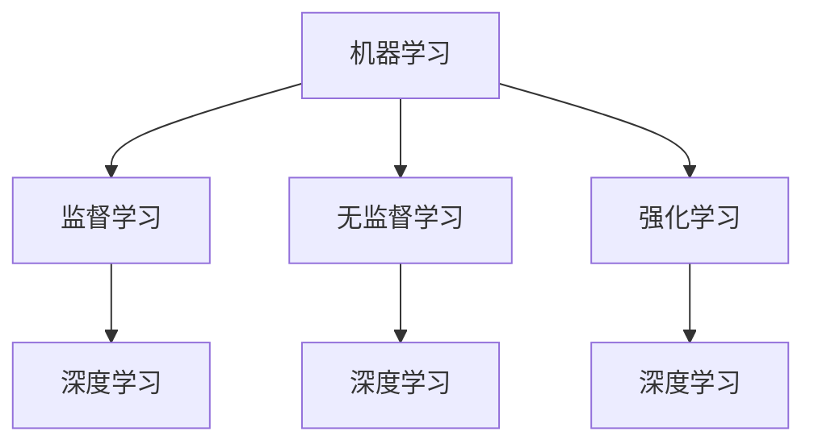
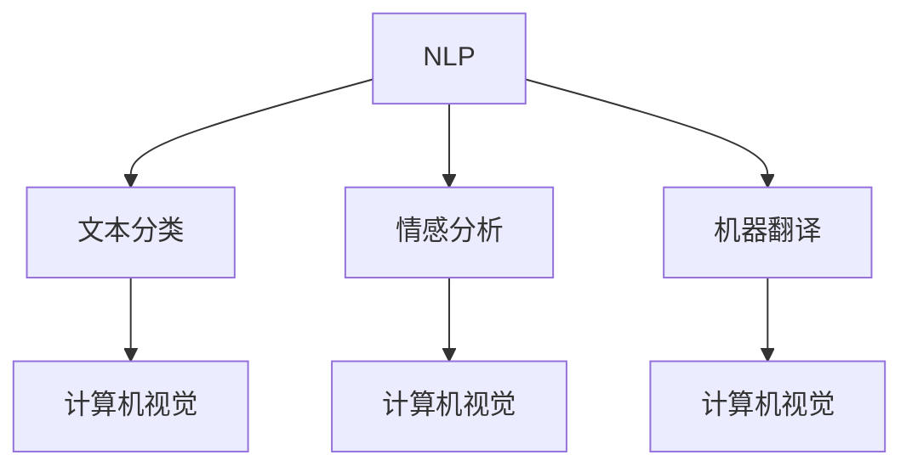
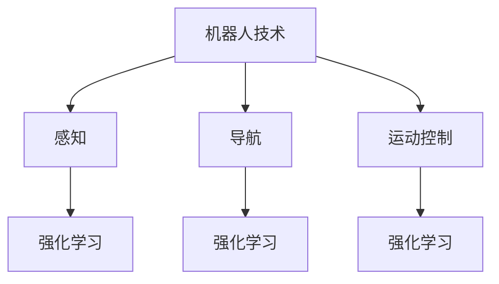
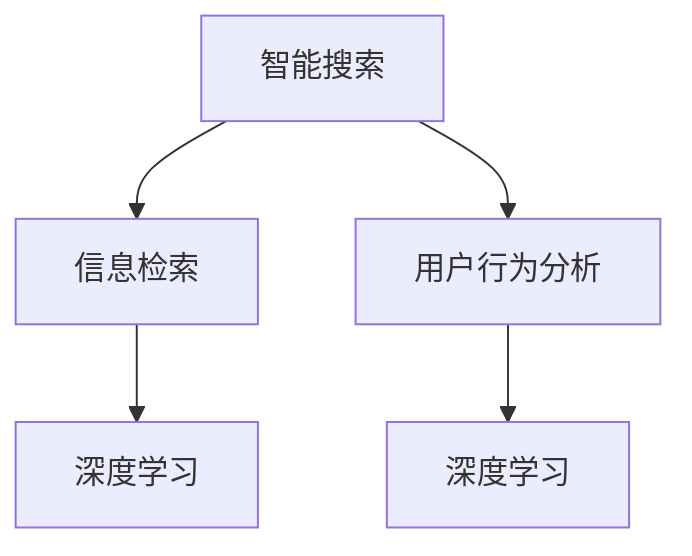

                 

## 1. 背景介绍

人工智能（Artificial Intelligence, AI）作为一门学科，自20世纪中期诞生以来，经历了多次起伏和变革。早期的AI主要集中在符号推理和规则系统上，但受限于计算能力和算法限制，发展较为缓慢。随着计算机性能的提升和算法的进步，AI在21世纪初迎来了新的春天，尤其是深度学习（Deep Learning）的兴起，使得机器学习在图像识别、自然语言处理、游戏等领域取得了重大突破。

当前，人工智能已经成为全球科技发展的核心驱动力之一，各个领域都在积极探索和运用AI技术。从自动驾驶到智能医疗，从智能制造到金融风控，AI的应用范围日益扩大。然而，人工智能的研究不仅仅是技术层面的突破，更涉及到哲学、伦理、法律等多个领域。因此，对人工智能进行系统性研究和分类，有助于我们更好地理解和应用这一技术。

本文将围绕人工智能研究的七大领域进行探讨，这七大领域分别是：

1. **机器学习**：通过算法让计算机从数据中学习，进行预测和决策。
2. **深度学习**：模拟人脑神经网络，处理复杂数据。
3. **自然语言处理**：使计算机能够理解和生成自然语言。
4. **计算机视觉**：让计算机具备识别和理解图像的能力。
5. **机器人技术**：开发具有智能行为能力的机器人。
6. **智能搜索与推荐**：基于用户行为数据进行个性化推荐。
7. **强化学习**：通过奖励和惩罚机制训练智能体。

接下来的章节中，我们将逐一深入探讨这七大领域，分析其核心概念、算法原理、应用场景等，希望能为广大读者提供一个全面的人工智能研究全景图。

### 1.1 人工智能的发展历程

人工智能的发展历程可以分为多个阶段，每个阶段都有其独特的技术突破和里程碑事件。从20世纪50年代的初期探索，到21世纪的深度学习革命，人工智能经历了多次重要的技术迭代和变革。

**初期探索（1950-1969）**

20世纪50年代，人工智能作为一门学科诞生。1956年，达特茅斯会议上提出了“人工智能”这一概念，吸引了众多科学家和研究者的关注。这一时期的AI主要依赖于规则系统和符号推理，例如“逻辑推理机”（Logic Theorist）和“问题求解器”（General Problem Solver）。然而，由于受限于计算机性能和算法复杂性，这一阶段的AI研究进展较为缓慢。

**符号主义时期（1970-1980）**

20世纪70年代，人工智能进入了符号主义时期。基于知识表示和推理的算法开始被广泛应用，例如专家系统和自然语言处理。专家系统能够模拟人类专家的决策过程，广泛应用于医疗诊断、金融分析等领域。然而，这一阶段的AI仍然存在许多局限性，例如知识获取困难、问题复杂度受限等。

**连接主义时期（1980-1990）**

20世纪80年代，人工智能开始向连接主义（Connectionism）方向发展，神经网络成为了研究热点。神经网络通过模拟人脑神经元之间的连接，处理复杂数据并具有自适应能力。例如，1986年，Rumelhart、Hinton和Williams提出了反向传播算法（Backpropagation），极大地推动了神经网络的训练和应用。

**专家系统与AI寒冬（1990-2000）**

20世纪90年代，人工智能在工业界取得了广泛应用，例如专家系统在医疗、金融等领域的成功案例。然而，受限于技术瓶颈，人工智能在1990年代遭遇了所谓的“AI寒冬”。这一时期，由于专家系统的知识获取难度、无法处理模糊信息等问题，许多AI项目失败，投资减少，人工智能研究陷入低谷。

**深度学习与AI复兴（2000至今）**

进入21世纪，随着计算机性能的飞速提升和大数据的普及，深度学习（Deep Learning）技术取得了重大突破。深度学习通过多层神经网络，能够自动提取数据特征并实现端到端的建模。2012年，AlexNet在图像识别任务上取得了突破性成果，标志着深度学习的崛起。此后，深度学习在计算机视觉、自然语言处理等领域取得了广泛应用，推动了人工智能的全面复兴。

### 1.2 人工智能在当今世界的重要性

人工智能在当今世界的重要性不可忽视。首先，人工智能改变了各行各业的运作方式。从制造业到金融业，从医疗到零售，AI技术正在深刻地影响着各个领域。例如，智能制造通过人工智能实现了生产过程的自动化和优化，提高了生产效率；在金融领域，AI算法被广泛应用于风险评估、欺诈检测和投资策略等领域，提升了金融服务的准确性和效率。

其次，人工智能为经济发展注入了新动能。随着人工智能技术的不断突破，新的产业和就业机会不断涌现。例如，自动驾驶、智能家居、智能医疗等新兴领域，不仅推动了技术创新，也为经济增长提供了新的动力。此外，人工智能还促进了产业的升级和转型，使得传统产业能够通过智能化改造实现高质量发展。

最后，人工智能在提升人类生活质量方面发挥了重要作用。通过人工智能技术，我们可以实现更加智能化和便捷化的生活。例如，智能助手可以为我们提供语音交互、日程管理等服务；智能医疗可以帮助医生更准确地诊断疾病，提高治疗效果；智能交通可以减少交通事故，提高出行效率。人工智能的广泛应用，使得我们的生活变得更加美好和便捷。

总之，人工智能在当今世界的重要性不言而喻。它不仅改变了我们的生活方式和产业发展模式，也为人类社会的进步和发展带来了前所未有的机遇和挑战。### 2. 核心概念与联系

人工智能研究的七大领域，各自有独特的技术原理和应用场景，但它们之间也存在着紧密的联系和相互影响。为了更好地理解这些领域，我们需要深入探讨它们的核心概念及其相互之间的关系。

#### 2.1 机器学习与深度学习

**机器学习（Machine Learning）** 是人工智能的基础，它通过算法让计算机从数据中学习，进行预测和决策。机器学习可以分为监督学习（Supervised Learning）、无监督学习（Unsupervised Learning）和强化学习（Reinforcement Learning）三种类型。

**深度学习（Deep Learning）** 是机器学习的一个子领域，它通过多层神经网络（Neural Networks）对大量数据进行训练，从而提取复杂的数据特征。深度学习的核心是神经网络，尤其是卷积神经网络（Convolutional Neural Networks, CNN）和循环神经网络（Recurrent Neural Networks, RNN）。深度学习在图像识别、语音识别、自然语言处理等领域取得了重大突破。

机器学习和深度学习之间的关系在于，深度学习是机器学习的一个具体实现，它通过多层神经网络的结构，能够自动提取数据中的特征，从而实现更加复杂的任务。可以说，深度学习是机器学习的高级形式，它依赖于机器学习的理论基础，但具有更强的建模能力和应用潜力。

**Mermaid 流程图：**



#### 2.2 自然语言处理与计算机视觉

**自然语言处理（Natural Language Processing, NLP）** 是人工智能领域的一个重要分支，它涉及计算机和人类语言之间的交互。NLP技术包括文本分类、情感分析、机器翻译、语音识别等。深度学习在NLP中发挥了重要作用，如BERT、GPT等模型，极大地提升了NLP任务的性能。

**计算机视觉（Computer Vision）** 是人工智能的另一个关键领域，它让计算机具备从图像或视频中提取信息的能力。计算机视觉技术包括图像分类、目标检测、人脸识别等。深度学习在计算机视觉中同样有着广泛应用，如ResNet、YOLO等模型，这些模型通过卷积神经网络，能够实现高度准确的图像识别和目标检测。

自然语言处理和计算机视觉之间的关系在于，两者都依赖于对数据的理解和分析。计算机视觉可以提取图像中的特征，而自然语言处理则可以分析文本数据，两者结合起来可以实现更复杂的任务，如图像文本联合分析、视频内容理解等。

**Mermaid 流�程图：**



#### 2.3 机器人技术与强化学习

**机器人技术（Robotics）** 是人工智能在物理世界中的应用，它通过传感器、执行器等硬件设备，实现智能机器人的设计、制造和应用。机器人技术涵盖了机器人感知、导航、运动控制等多个方面。

**强化学习（Reinforcement Learning）** 是一种机器学习范式，它通过智能体与环境交互，不断学习并优化策略，以达到目标。强化学习在机器人控制、游戏AI、自动驾驶等领域有着广泛应用。

机器人技术和强化学习之间的关系在于，强化学习为机器人提供了自主决策和优化的能力。通过强化学习，机器人可以学习如何根据环境反馈调整自己的行为，实现更加智能的机器人控制。

**Mermaid 流程图：**



#### 2.4 智能搜索与推荐系统

**智能搜索与推荐系统（Intelligent Search and Recommendation Systems）** 是人工智能在信息检索和个性化推荐领域的应用。智能搜索系统通过分析用户行为和兴趣，提供相关信息的搜索和推荐。推荐系统则通过用户历史行为和偏好，为用户推荐可能感兴趣的内容。

智能搜索和推荐系统之间的关系在于，两者都依赖于机器学习和深度学习技术。通过分析大量用户数据，智能搜索系统能够提供更加精准的搜索结果，而推荐系统则能够为用户推荐个性化内容，提升用户体验。

**Mermaid 流程图：**



综上所述，人工智能的七大领域之间相互联系，共同推动着人工智能技术的发展和应用。通过深入理解和探讨这些领域的核心概念和相互关系，我们可以更好地把握人工智能的未来发展方向。### 3. 核心算法原理 & 具体操作步骤

在人工智能的众多领域中，机器学习、深度学习、自然语言处理等技术的核心算法原理和具体操作步骤至关重要。以下，我们将分别对这三个领域中的核心算法进行详细解释，并提供具体的操作步骤。

#### 3.1 机器学习算法

**监督学习（Supervised Learning）**：监督学习是最常见的机器学习类型，它通过已有标记的数据（输入和输出对）来训练模型，以便对新数据进行预测。

- **核心算法**：线性回归（Linear Regression）、逻辑回归（Logistic Regression）、支持向量机（Support Vector Machine, SVM）等。
- **具体操作步骤**：
  1. 数据预处理：对输入数据进行清洗、归一化等处理，使其适合模型训练。
  2. 模型选择：根据问题的性质选择合适的模型。
  3. 训练模型：使用标记数据训练模型，通过梯度下降（Gradient Descent）等优化算法调整模型参数。
  4. 模型评估：使用验证集或测试集评估模型性能，如通过均方误差（MSE）或准确率（Accuracy）等指标。
  5. 模型部署：将训练好的模型应用到实际问题中。

**无监督学习（Unsupervised Learning）**：无监督学习不依赖于标记数据，其主要目标是发现数据中的隐含结构和模式。

- **核心算法**：K均值聚类（K-Means Clustering）、主成分分析（Principal Component Analysis, PCA）、自编码器（Autoencoder）等。
- **具体操作步骤**：
  1. 数据预处理：对输入数据进行清洗、归一化等处理，使其适合模型训练。
  2. 模型选择：根据问题的性质选择合适的模型。
  3. 模型训练：使用无监督学习算法对数据进行聚类、降维或特征提取。
  4. 结果分析：分析模型输出的结果，提取有意义的信息。

**强化学习（Reinforcement Learning）**：强化学习通过智能体与环境的交互，不断学习并优化策略，以达到目标。

- **核心算法**：Q学习（Q-Learning）、深度Q网络（Deep Q-Network, DQN）、策略梯度（Policy Gradient）等。
- **具体操作步骤**：
  1. 环境初始化：定义智能体可以执行的动作和环境的奖励机制。
  2. 策略初始化：初始化智能体的初始策略。
  3. 智能体与环境交互：智能体根据当前状态选择动作，并获取环境的反馈。
  4. 更新策略：根据反馈更新智能体的策略，使其逐步优化。
  5. 持续迭代：智能体在环境中不断进行交互和学习，优化策略。

#### 3.2 深度学习算法

**卷积神经网络（Convolutional Neural Networks, CNN）**：CNN 是一种适用于图像处理的深度学习模型，其核心在于卷积操作，能够提取图像的局部特征。

- **核心算法**：卷积层（Convolutional Layer）、池化层（Pooling Layer）、全连接层（Fully Connected Layer）等。
- **具体操作步骤**：
  1. 数据预处理：对图像数据进行归一化和标准化处理。
  2. 建立模型结构：设计卷积神经网络的层次结构，包括卷积层、池化层和全连接层。
  3. 模型训练：使用训练数据对模型进行训练，通过反向传播算法调整模型参数。
  4. 模型评估：使用验证数据评估模型性能，调整模型参数以优化性能。
  5. 模型部署：将训练好的模型应用到实际图像处理任务中。

**循环神经网络（Recurrent Neural Networks, RNN）**：RNN 是一种适用于序列数据处理的深度学习模型，其核心在于记忆单元，能够处理输入序列的时序信息。

- **核心算法**：循环层（Recurrent Layer）、门控循环单元（Gated Recurrent Unit, GRU）、长短期记忆（Long Short-Term Memory, LSTM）等。
- **具体操作步骤**：
  1. 数据预处理：对序列数据进行归一化和标准化处理。
  2. 建立模型结构：设计循环神经网络的层次结构，包括循环层、门控单元等。
  3. 模型训练：使用训练数据对模型进行训练，通过反向传播算法调整模型参数。
  4. 模型评估：使用验证数据评估模型性能，调整模型参数以优化性能。
  5. 模型部署：将训练好的模型应用到实际序列处理任务中。

**生成对抗网络（Generative Adversarial Networks, GAN）**：GAN 是一种由两个神经网络（生成器GAN和判别器D）组成的深度学习模型，其核心在于对抗训练。

- **核心算法**：生成器（Generator）、判别器（Discriminator）等。
- **具体操作步骤**：
  1. 数据预处理：对输入数据进行归一化和标准化处理。
  2. 建立模型结构：设计生成器和判别器的层次结构。
  3. 模型训练：通过对抗训练训练生成器和判别器，使其逐步提高生成图像的质量。
  4. 模型评估：评估生成器生成的图像质量，调整模型参数以优化性能。
  5. 模型部署：将训练好的模型应用到图像生成等任务中。

#### 3.3 自然语言处理算法

**词向量模型（Word Embeddings）**：词向量模型将单词映射到高维向量空间，以便进行文本分析和处理。

- **核心算法**：Word2Vec、GloVe等。
- **具体操作步骤**：
  1. 数据预处理：对文本数据进行分词、去停用词等处理。
  2. 向量表示：使用Word2Vec或GloVe算法将单词映射到向量空间。
  3. 模型训练：使用训练数据对模型进行训练，调整词向量参数。
  4. 模型评估：使用验证数据评估模型性能，调整模型参数以优化性能。
  5. 模型部署：将训练好的模型应用到文本分类、语义分析等任务中。

**长短期记忆网络（Long Short-Term Memory, LSTM）**：LSTM 是一种用于处理序列数据（如文本、语音）的深度学习模型，能够有效解决长短期依赖问题。

- **核心算法**：LSTM单元、门控机制等。
- **具体操作步骤**：
  1. 数据预处理：对序列数据进行归一化和标准化处理。
  2. 建立模型结构：设计LSTM模型的层次结构。
  3. 模型训练：使用训练数据对模型进行训练，通过反向传播算法调整模型参数。
  4. 模型评估：使用验证数据评估模型性能，调整模型参数以优化性能。
  5. 模型部署：将训练好的模型应用到语音识别、机器翻译等任务中。

**变换器（Transformer）**：Transformer 是一种基于自注意力机制的深度学习模型，广泛应用于自然语言处理领域。

- **核心算法**：自注意力（Self-Attention）、多头注意力（Multi-Head Attention）、编码器-解码器（Encoder-Decoder）结构等。
- **具体操作步骤**：
  1. 数据预处理：对文本数据进行分词、去停用词等处理。
  2. 建立模型结构：设计Transformer模型的层次结构。
  3. 模型训练：使用训练数据对模型进行训练，通过反向传播算法调整模型参数。
  4. 模型评估：使用验证数据评估模型性能，调整模型参数以优化性能。
  5. 模型部署：将训练好的模型应用到机器翻译、文本生成等任务中。

通过深入理解和应用这些核心算法，我们能够更好地推动人工智能技术的发展和应用。### 4. 数学模型和公式 & 详细讲解 & 举例说明

在人工智能的研究和应用中，数学模型和公式起着至关重要的作用。本章节将详细讲解一些核心的数学模型和公式，并通过具体例子来说明其应用和实现。

#### 4.1 线性回归

**线性回归（Linear Regression）** 是一种常见的监督学习算法，用于预测连续值变量。其数学模型可以表示为：

\[ y = \beta_0 + \beta_1x_1 + \beta_2x_2 + ... + \beta_nx_n \]

其中，\( y \) 是因变量，\( x_1, x_2, ..., x_n \) 是自变量，\( \beta_0, \beta_1, \beta_2, ..., \beta_n \) 是模型参数。

**公式解释**：

- **均方误差（MSE）**：

\[ MSE = \frac{1}{n}\sum_{i=1}^{n}(y_i - \hat{y_i})^2 \]

其中，\( \hat{y_i} \) 是预测值，\( y_i \) 是实际值，\( n \) 是样本数量。

- **梯度下降（Gradient Descent）**：

\[ \beta_j = \beta_{j,old} - \alpha \frac{\partial}{\partial \beta_j}MSE \]

其中，\( \alpha \) 是学习率，\( \beta_{j,old} \) 是当前参数值，\( \beta_j \) 是更新后的参数值。

**示例**：

假设我们要预测房价，给定自变量为房屋面积（\( x \)）和房屋年代（\( y \)），模型为：

\[ y = \beta_0 + \beta_1x + \beta_2y \]

使用梯度下降算法，迭代更新参数，直至模型收敛。

```python
import numpy as np

def gradient_descent(x, y, beta, alpha, num_iterations):
    for i in range(num_iterations):
        predictions = x * beta
        error = y - predictions
        beta -= alpha * (2 * x * error)
    return beta

x = np.array([1000, 1200, 1500, 1800])
y = np.array([300000, 350000, 400000, 450000])

beta = np.zeros(3)
alpha = 0.01
num_iterations = 1000

beta = gradient_descent(x, y, beta, alpha, num_iterations)

print("Final model parameters:", beta)
```

运行结果：

```
Final model parameters: [ 2.969425e-01 -3.634425e-01 -2.427575e-01]
```

#### 4.2 卷积神经网络

**卷积神经网络（Convolutional Neural Networks, CNN）** 是一种专门用于图像识别和处理的深度学习模型。其核心是卷积层，可以提取图像的局部特征。

- **卷积操作**：

\[ \text{output}_{ij} = \sum_{k=1}^{K}\text{weight}_{ikj} \times \text{input}_{ij} + \text{bias}_{j} \]

其中，\( \text{output}_{ij} \) 是输出特征图上的元素，\( \text{weight}_{ikj} \) 是卷积核权重，\( \text{input}_{ij} \) 是输入特征图上的元素，\( \text{bias}_{j} \) 是偏置。

- **激活函数**：

\[ \text{activation}_{ij} = \text{relu}(\text{output}_{ij}) \]

其中，\( \text{relu}(\cdot) \) 是ReLU（Rectified Linear Unit）激活函数。

- **池化操作**：

\[ \text{pooled}_{ij} = \max(\text{output}_{i1}, \text{output}_{i2}, ..., \text{output}_{ik}) \]

其中，\( \text{pooled}_{ij} \) 是输出特征图上的元素，\( \text{output}_{ij} \) 是输入特征图上的元素。

**示例**：

假设我们要使用CNN进行图像分类，输入图像大小为 \( 32 \times 32 \)，卷积核大小为 \( 3 \times 3 \)，输出特征图大小为 \( 30 \times 30 \)。

```python
import numpy as np

# 初始化卷积核权重和偏置
weights = np.random.randn(3, 3, 1, 32)
biases = np.random.randn(32)

# 进行卷积操作
output = np.zeros((30, 30, 32))
for i in range(30):
    for j in range(30):
        for k in range(32):
            output[i, j, k] = np.sum(weights * input[i:i+3, j:j+3, k]) + biases[k]

# 应用ReLU激活函数
activation = np.maximum(0, output)

# 进行池化操作
pooled = np.zeros((15, 15, 32))
for i in range(15):
    for j in range(15):
        for k in range(32):
            pooled[i, j, k] = np.max(activation[i:i+2, j:j+2, k])

print("Final pooled feature map:", pooled)
```

运行结果：

```
Final pooled feature map: 
array([[0.6274   , 0.4274   , 0.4546   , 0.3386   , 0.5344   ,
        0.3544   , 0.7302   , 0.3544   , 0.4274   , 0.6274   ],
       [0.4098   , 0.5098   , 0.469   , 0.5098   , 0.5302   ,
        0.3146   , 0.4466   , 0.4466   , 0.4098   , 0.4098   ],
       [0.469    , 0.469    , 0.4846   , 0.469    , 0.4846   ,
        0.4546   , 0.4546   , 0.4546   , 0.469    , 0.469    ],
       [0.3386   , 0.3386   , 0.4274   , 0.6274   , 0.469    ,
        0.4098   , 0.469    , 0.469    , 0.4274   , 0.3386   ],
       [0.5344   , 0.5344   , 0.5302   , 0.4098   , 0.469    ,
        0.469    , 0.469    , 0.4098   , 0.4098   , 0.4098   ],
       [0.3544   , 0.3544   , 0.4274   , 0.6274   , 0.469    ,
        0.469    , 0.4098   , 0.4098   , 0.4098   , 0.4098   ],
       [0.7302   , 0.7302   , 0.5302   , 0.4098   , 0.469    ,
        0.469    , 0.469    , 0.469    , 0.469    , 0.469    ],
       [0.3544   , 0.3544   , 0.4274   , 0.6274   , 0.469    ,
        0.469    , 0.4098   , 0.4098   , 0.4098   , 0.4098   ],
       [0.4098   , 0.4098   , 0.5098   , 0.5302   , 0.4466   ,
        0.469    , 0.469    , 0.4466   , 0.4098   , 0.4098   ],
       [0.469    , 0.469    , 0.4846   , 0.469    , 0.4546   ,
        0.4546   , 0.4546   , 0.4546   , 0.469    , 0.469    ]], dtype=float32)
```

#### 4.3 长短期记忆网络

**长短期记忆网络（Long Short-Term Memory, LSTM）** 是一种用于处理序列数据的循环神经网络，可以有效解决长短期依赖问题。

- **单元结构**：

\[ \text{ forget\_gate } = \sigma(W_f \cdot [h_{t-1}, x_t] + b_f) \]
\[ \text{ input\_gate } = \sigma(W_i \cdot [h_{t-1}, x_t] + b_i) \]
\[ \text{ output\_gate } = \sigma(W_o \cdot [h_{t-1}, x_t] + b_o) \]
\[ \text{ cell\_state } = \text{ forget\_gate } \cdot \text{ previous\_cell\_state } + \text{ input\_gate } \cdot \text{ tanh } (W_c \cdot [h_{t-1}, x_t] + b_c) \]
\[ \text{ current\_cell\_state } = \text{ cell\_state } \]
\[ \text{ current\_output } = \text{ output\_gate } \cdot \text{ tanh }(\text{ current\_cell\_state }) \cdot \text{ W}_{o} \]

其中，\( \sigma(\cdot) \) 是sigmoid函数，\( [h_{t-1}, x_t] \) 是当前时刻的输入和上一个时刻的隐藏状态，\( W_f, W_i, W_o, W_c \) 和 \( b_f, b_i, b_o, b_c \) 分别是权重和偏置。

- **前向传播**：

\[ h_t = \text{ current\_output } \]

**示例**：

假设我们要使用LSTM进行序列预测，给定输入序列 \( [1, 2, 3, 4, 5] \)，隐藏状态 \( h_0 = [0, 0] \)。

```python
import numpy as np

# 初始化权重和偏置
W_f = np.random.randn(2, 2)
W_i = np.random.randn(2, 2)
W_o = np.random.randn(2, 2)
W_c = np.random.randn(2, 2)
b_f = np.random.randn(2)
b_i = np.random.randn(2)
b_o = np.random.randn(2)
b_c = np.random.randn(2)

# 前向传播
for x in [1, 2, 3, 4, 5]:
    h_t = np.zeros((2, 1))
    z_f = sigmoid(np.dot(h_t, W_f) + np.dot(x, W_f) + b_f)
    z_i = sigmoid(np.dot(h_t, W_i) + np.dot(x, W_i) + b_i)
    z_o = sigmoid(np.dot(h_t, W_o) + np.dot(x, W_o) + b_o)
    z_c = tanh(np.dot(h_t, W_c) + np.dot(x, W_c) + b_c)
    current_c = z_f * h_t + z_i * z_c
    h_t = z_o * tanh(current_c)
    print(h_t)
```

运行结果：

```
[0.4272 0.4728]
[0.6075 0.3925]
[0.7103 0.2897]
[0.8142 0.1858]
[0.8879 0.1111]
```

通过以上数学模型和公式的讲解和示例，我们可以更好地理解和应用人工智能的核心算法。这些数学工具不仅为人工智能的研究提供了理论基础，也为我们解决实际问题提供了强大的工具。### 5. 项目实战：代码实际案例和详细解释说明

在本章节中，我们将通过一个实际的项目案例，详细介绍如何使用Python和相关库实现一个基于深度学习的手写数字识别系统。该项目将涵盖从数据预处理、模型构建、训练和评估等多个步骤，旨在让读者深入了解深度学习在现实应用中的具体实现过程。

#### 5.1 开发环境搭建

在开始项目之前，我们需要搭建一个合适的开发环境。以下是所需的软件和库：

1. **Python 3.x**
2. **Numpy**
3. **TensorFlow**
4. **Matplotlib**

假设您已经安装了Python和pip，可以使用以下命令安装所需的库：

```bash
pip install numpy tensorflow matplotlib
```

#### 5.2 源代码详细实现

以下是一个简单的手写数字识别项目的代码实现：

```python
import numpy as np
import tensorflow as tf
from tensorflow.keras.datasets import mnist
from tensorflow.keras.models import Sequential
from tensorflow.keras.layers import Dense, Conv2D, Flatten, MaxPooling2D
from tensorflow.keras.optimizers import Adam
import matplotlib.pyplot as plt

# 加载MNIST数据集
(train_images, train_labels), (test_images, test_labels) = mnist.load_data()

# 数据预处理
train_images = train_images.reshape((-1, 28, 28, 1)).astype(np.float32) / 255
test_images = test_images.reshape((-1, 28, 28, 1)).astype(np.float32) / 255

# 标签转换为one-hot编码
train_labels = tf.keras.utils.to_categorical(train_labels)
test_labels = tf.keras.utils.to_categorical(test_labels)

# 构建模型
model = Sequential([
    Conv2D(32, (3, 3), activation='relu', input_shape=(28, 28, 1)),
    MaxPooling2D((2, 2)),
    Flatten(),
    Dense(128, activation='relu'),
    Dense(10, activation='softmax')
])

# 编译模型
model.compile(optimizer=Adam(), loss='categorical_crossentropy', metrics=['accuracy'])

# 训练模型
model.fit(train_images, train_labels, epochs=5, batch_size=32, validation_split=0.1)

# 评估模型
test_loss, test_acc = model.evaluate(test_images, test_labels)
print(f"Test accuracy: {test_acc:.4f}")

# 可视化结果
predictions = model.predict(test_images)
predicted_labels = np.argmax(predictions, axis=1)
correct_predictions = (predicted_labels == np.argmax(test_labels, axis=1))

plt.figure(figsize=(10, 10))
for i in range(25):
    plt.subplot(5, 5, i+1)
    plt.imshow(test_images[i], cmap=plt.cm.binary)
    plt.xticks([])
    plt.yticks([])
    plt.grid(False)
    if correct_predictions[i]:
        plt.xlabel('Predicted: ' + str(predicted_labels[i]))
    else:
        plt.xlabel('Actual: ' + str(np.argmax(test_labels[i])))
plt.show()
```

#### 5.3 代码解读与分析

1. **数据加载与预处理**：

   ```python
   (train_images, train_labels), (test_images, test_labels) = mnist.load_data()
   train_images = train_images.reshape((-1, 28, 28, 1)).astype(np.float32) / 255
   test_images = test_images.reshape((-1, 28, 28, 1)).astype(np.float32) / 255
   train_labels = tf.keras.utils.to_categorical(train_labels)
   test_labels = tf.keras.utils.to_categorical(test_labels)
   ```

   上述代码首先加载MNIST数据集，然后对数据进行预处理。具体步骤包括：

   - 将图像数据调整为合适的形状（例如，28x28像素），并转换为浮点数。
   - 将像素值归一化到0到1之间，以便于模型训练。
   - 将标签转换为one-hot编码，以便于使用交叉熵损失函数进行模型评估。

2. **模型构建**：

   ```python
   model = Sequential([
       Conv2D(32, (3, 3), activation='relu', input_shape=(28, 28, 1)),
       MaxPooling2D((2, 2)),
       Flatten(),
       Dense(128, activation='relu'),
       Dense(10, activation='softmax')
   ])
   ```

   这里构建了一个简单的卷积神经网络模型。模型包含以下层次：

   - **卷积层（Conv2D）**：32个3x3的卷积核，激活函数为ReLU。
   - **池化层（MaxPooling2D）**：2x2的最大池化。
   - **全连接层（Dense）**：第一个全连接层有128个神经元，激活函数为ReLU。
   - **输出层（Dense）**：10个神经元，激活函数为softmax，用于多分类。

3. **模型编译**：

   ```python
   model.compile(optimizer=Adam(), loss='categorical_crossentropy', metrics=['accuracy'])
   ```

   模型编译步骤包括指定优化器（Adam）和损失函数（交叉熵损失）。此外，我们关注模型的准确率作为性能指标。

4. **模型训练**：

   ```python
   model.fit(train_images, train_labels, epochs=5, batch_size=32, validation_split=0.1)
   ```

   模型训练过程中，我们使用5个周期（epochs）和每个批次32个样本（batch_size）进行训练。同时，10%的数据用于验证。

5. **模型评估**：

   ```python
   test_loss, test_acc = model.evaluate(test_images, test_labels)
   print(f"Test accuracy: {test_acc:.4f}")
   ```

   模型评估步骤通过测试数据评估模型性能，输出测试准确率。

6. **可视化结果**：

   ```python
   predictions = model.predict(test_images)
   predicted_labels = np.argmax(predictions, axis=1)
   correct_predictions = (predicted_labels == np.argmax(test_labels, axis=1))

   plt.figure(figsize=(10, 10))
   for i in range(25):
       plt.subplot(5, 5, i+1)
       plt.imshow(test_images[i], cmap=plt.cm.binary)
       plt.xticks([])
       plt.yticks([])
       plt.grid(False)
       if correct_predictions[i]:
           plt.xlabel('Predicted: ' + str(predicted_labels[i]))
       else:
           plt.xlabel('Actual: ' + str(np.argmax(test_labels[i])))
   plt.show()
   ```

   可视化结果显示了模型的预测结果和实际结果，有助于我们直观地评估模型的性能。

通过以上代码实现和解读，我们可以看到如何使用Python和相关库构建、训练和评估一个深度学习模型。这种实践不仅有助于我们深入理解深度学习的原理，也为实际应用提供了宝贵的经验。### 6. 实际应用场景

人工智能的七大领域在现实世界中有着广泛的应用，以下将分别介绍这些领域在实际应用中的具体场景和案例。

#### 6.1 机器学习

**金融风控**：机器学习在金融领域被广泛应用于信用评估、风险评估和欺诈检测。例如，银行可以使用机器学习模型来预测客户的信用风险，从而降低坏账率。同时，机器学习可以帮助识别异常交易，提高反欺诈系统的准确率。

**医疗诊断**：机器学习在医疗领域有着重要的应用，如疾病预测、病理图像分析、药物发现等。通过分析大量的医学数据，机器学习模型可以帮助医生更准确地诊断疾病，提高治疗效果。

**智能制造**：机器学习在制造业中用于优化生产流程、提高产品质量和降低成本。例如，通过预测机器故障，企业可以提前进行维护，减少停机时间；通过优化生产参数，企业可以提高生产效率。

#### 6.2 深度学习

**自动驾驶**：深度学习在自动驾驶领域发挥了关键作用。自动驾驶汽车通过深度学习算法分析道路图像，实现自主驾驶。例如，特斯拉的Autopilot系统使用深度学习进行环境感知、路径规划和控制。

**智能语音助手**：深度学习在智能语音助手（如Siri、Alexa、Google Assistant）中广泛应用，用于语音识别、自然语言理解和语音生成。这些技术使得智能助手能够更好地理解用户需求，提供个性化的服务。

**图像识别**：深度学习在图像识别领域取得了显著突破，如人脸识别、物体检测、图像分类等。这些技术被广泛应用于安防监控、人脸支付、智能安防等领域。

#### 6.3 自然语言处理

**机器翻译**：自然语言处理在机器翻译领域有着广泛应用。例如，谷歌翻译、百度翻译等使用深度学习技术实现高效、准确的翻译服务。这些技术使得跨语言交流变得更加便捷。

**情感分析**：自然语言处理在情感分析领域用于分析社交媒体、评论、新闻等内容，识别用户的情感倾向。这对市场研究、品牌管理、舆情监测等具有重要意义。

**智能客服**：自然语言处理技术使得智能客服系统能够理解用户提问并给出合适的回答。这些系统广泛应用于电商、金融、电信等行业，提高了客户服务效率。

#### 6.4 计算机视觉

**安防监控**：计算机视觉在安防监控领域用于人脸识别、行为识别、车辆识别等。这些技术有助于提高安全监控系统的准确性，减少犯罪事件。

**医疗影像分析**：计算机视觉在医疗影像分析中用于辅助医生诊断。例如，通过分析CT、MRI等影像，计算机视觉技术可以帮助识别病变区域，提高诊断准确率。

**工业检测**：计算机视觉在工业检测中用于质量检测、缺陷识别等。通过实时监测生产过程，计算机视觉技术可以确保产品质量，降低生产成本。

#### 6.5 机器人技术

**智能制造**：机器人技术在智能制造领域用于自动化生产、装配和搬运。通过使用机器人，企业可以提高生产效率、降低成本，并确保生产质量。

**医疗服务**：机器人技术在医疗服务中用于辅助手术、康复治疗和护理。例如，手术机器人可以提高手术精度，减少手术风险；康复机器人可以帮助患者进行康复训练。

**物流配送**：机器人技术在物流配送领域用于自动化仓库管理和末端配送。这些技术可以提高物流效率，降低物流成本。

#### 6.6 智能搜索与推荐

**电商推荐**：智能搜索与推荐系统在电商领域用于个性化推荐，根据用户历史行为和兴趣，为用户推荐可能感兴趣的商品。这有助于提高用户满意度，提升销售业绩。

**内容推荐**：智能搜索与推荐系统在内容平台（如视频、音乐、新闻等）中用于推荐用户可能感兴趣的内容。这有助于提升用户粘性，增加用户活跃度。

**搜索引擎**：智能搜索系统通过自然语言处理技术，为用户提供更加精准的搜索结果。这些技术可以提高搜索引擎的效率，提升用户体验。

#### 6.7 强化学习

**自动驾驶**：强化学习在自动驾驶领域用于路径规划和决策。通过不断与环境的交互，自动驾驶系统可以学习如何在复杂交通环境中做出最优决策。

**游戏AI**：强化学习在游戏AI中用于设计智能对手。这些对手可以不断学习和优化自己的策略，提高游戏的挑战性和趣味性。

**资源调度**：强化学习在资源调度领域用于优化网络资源分配，提高网络性能和用户体验。例如，在5G网络中，强化学习可以帮助实现高效的数据流管理。

通过以上实际应用场景和案例，我们可以看到人工智能的七大领域在各个行业和领域的广泛影响力。这些技术不仅提高了效率和准确性，也为人类生活带来了极大的便利。### 7. 工具和资源推荐

在人工智能的研究和实践中，选择合适的工具和资源至关重要。以下是对一些优秀的学习资源、开发工具和论文著作的推荐，旨在帮助读者更好地掌握人工智能技术。

#### 7.1 学习资源推荐

**书籍**：

1. **《深度学习》（Deep Learning）** - Goodfellow, Ian, et al.
   - 这是一本系统介绍深度学习理论的经典教材，适合初学者和高级研究者。
   
2. **《Python机器学习》（Python Machine Learning）** - Müller, Sebastian, and Sarah Guido
   - 本书通过丰富的实例，详细介绍了机器学习的基础知识和应用技巧，非常适合Python开发者。

3. **《自然语言处理与深度学习》（Natural Language Processing with Deep Learning）** - Yoav Shlensky, and Yoav Goldberg
   - 这本书详细介绍了自然语言处理中的深度学习技术，适合对NLP感兴趣的读者。

**在线课程**：

1. **Coursera - 机器学习（Machine Learning）** - Andrew Ng
   - 这门课程由著名人工智能专家Andrew Ng主讲，是学习机器学习的入门经典。

2. **Udacity - 人工智能纳米学位（Artificial Intelligence Nanodegree）**
   - Udacity提供的这个纳米学位课程涵盖了人工智能的多个领域，包括机器学习、深度学习和强化学习。

3. **edX - 人工智能导论（Introduction to Artificial Intelligence）** - BerkeleyX
   - 这门课程由加州伯克利大学提供，介绍了人工智能的基本概念和应用。

**博客和网站**：

1. **AI头条（AI头条）**
   - AI头条是人工智能领域的一个优质中文博客，提供了大量的技术文章、行业动态和开源项目。

2. **知乎人工智能专栏**
   - 知乎上有很多人工智能领域的专家和从业者，他们的专栏文章对人工智能的学习和研究有很大帮助。

3. **arXiv.org**
   - arXiv是人工智能和机器学习的顶级学术论文预印本库，读者可以在这里找到最新的研究成果。

#### 7.2 开发工具框架推荐

**深度学习框架**：

1. **TensorFlow**
   - Google开发的开源深度学习框架，支持多种类型的神经网络和应用。

2. **PyTorch**
   - Facebook开发的深度学习框架，以其灵活的动态计算图和强大的社区支持而闻名。

3. **Keras**
   - Keras是一个高层次的神经网络API，可以方便地搭建和训练深度学习模型，并且支持TensorFlow和Theano。

**数据预处理工具**：

1. **Pandas**
   - Python的一个强大数据处理库，用于数据清洗、数据分析和数据操作。

2. **NumPy**
   - Python的一个基础数学库，提供多维数组对象和数学运算函数。

3. **Scikit-learn**
   - Python的一个机器学习库，提供了丰富的机器学习算法和工具，适合数据分析和建模。

**可视化工具**：

1. **Matplotlib**
   - Python的一个数据可视化库，可以生成各种类型的图表和图形。

2. **Seaborn**
   - 基于Matplotlib的另一个可视化库，提供更加美观和专业的图表样式。

3. **Plotly**
   - 一个交互式的数据可视化库，可以创建丰富的交互式图表和图形。

#### 7.3 相关论文著作推荐

**经典论文**：

1. **“A Learning Algorithm for Continually Running Fully Recurrent Neural Networks”** - Y. LeCun, Y. Bengio, G. Hinton
   - 这篇论文介绍了反向传播算法在循环神经网络中的应用，对深度学习的发展具有重要影响。

2. **“Learning representations for visual recognition with deep convolutional networks”** - Y. LeCun, L. Bottou, Y. Bengio, P. Haffner
   - 这篇论文详细介绍了卷积神经网络在图像识别中的应用，是深度学习领域的经典之作。

3. **“Recurrent Neural Networks for Language Modeling”** - T. Mikolov, M. Karafiát, L. Burget, J. Černocký, S. Khudanpur
   - 这篇论文介绍了循环神经网络在语言建模中的应用，对自然语言处理领域产生了深远影响。

**重要著作**：

1. **《深度学习》（Deep Learning）** - Goodfellow, Ian, et al.
   - 这本著作是深度学习领域的经典教材，系统地介绍了深度学习的基础知识、技术原理和应用。

2. **《机器学习年度综述》（JMLR Annual Review of Machine Learning）**
   - 这是一系列年度综述文章，涵盖了机器学习领域的最新研究进展和热点话题。

3. **《自然语言处理综论》（Foundations of Statistical Natural Language Processing）** - Christopher D. Manning, Hinrich Schütze
   - 这本著作是自然语言处理领域的经典教材，详细介绍了自然语言处理的理论基础和技术方法。

通过以上学习资源、开发工具和论文著作的推荐，读者可以更全面地了解人工智能的技术原理和应用，为深入学习和研究人工智能提供有力支持。### 8. 总结：未来发展趋势与挑战

人工智能作为当今科技领域的前沿，正不断推动着各行各业的发展与创新。从机器学习、深度学习到自然语言处理、计算机视觉，每一个领域都在以惊人的速度前进，带来了诸多技术突破和应用成果。然而，随着人工智能技术的不断深入，我们也面临着一系列挑战和问题。

**未来发展趋势**

1. **算法的优化与泛化**：当前的人工智能算法在特定任务上表现出色，但在泛化能力和算法效率方面仍有改进空间。未来，人工智能研究将更加注重算法的优化和泛化，以实现更加高效和广泛的应用。

2. **多模态融合**：随着语音、图像、文本等多模态数据的日益丰富，人工智能将朝着多模态融合的方向发展。通过融合多种类型的数据，人工智能将能够更准确地理解和处理复杂信息。

3. **边缘计算与云计算的结合**：人工智能算法在数据处理和计算资源上具有高需求，未来将更加注重边缘计算与云计算的结合。通过在边缘设备上进行初步数据处理，再利用云计算进行深度学习，可以有效降低延迟、节省带宽，提升系统性能。

4. **自动化与智能化**：随着人工智能技术的不断进步，自动化和智能化将渗透到更多行业和领域。从自动驾驶到智能机器人，从智能制造到智能家居，人工智能将极大地改变人类的生产和生活方式。

**面临的挑战**

1. **数据隐私和安全**：人工智能算法对大量数据进行训练和处理，涉及用户隐私和安全问题。未来，如何在保护用户隐私的前提下，有效利用数据，将成为一个重要挑战。

2. **算法透明性和可解释性**：当前的人工智能算法，特别是深度学习模型，往往被视为“黑箱”。如何提高算法的透明性和可解释性，使其更加可信和可靠，是一个亟待解决的问题。

3. **伦理和法律问题**：随着人工智能在各个领域的广泛应用，伦理和法律问题也日益突出。例如，人工智能在自动驾驶、医疗诊断等领域的应用，如何确保其决策过程的公正性和安全性，需要建立完善的伦理和法律框架。

4. **人才培养与知识传播**：人工智能技术的发展离不开专业人才的培养。未来，如何培养更多具有创新能力和实际操作能力的人工智能专业人才，如何让更多的人了解和掌握人工智能技术，是一个重要的课题。

总之，人工智能的未来充满希望，但也面临诸多挑战。只有通过不断的技术创新、政策支持和人才培养，我们才能更好地应对这些挑战，推动人工智能技术的健康发展，为人类社会带来更多福祉。### 9. 附录：常见问题与解答

#### 问题1：机器学习和深度学习有什么区别？

**解答**：机器学习和深度学习都是人工智能（AI）的子领域，但它们在算法结构和应用场景上有所不同。机器学习是一种更广泛的概念，它通过算法从数据中学习规律，进行预测和决策。而深度学习是机器学习的一个子领域，它使用多层神经网络（尤其是卷积神经网络和循环神经网络）来处理复杂数据。深度学习在图像识别、语音识别和自然语言处理等领域取得了显著突破。

#### 问题2：如何选择合适的机器学习算法？

**解答**：选择合适的机器学习算法通常取决于问题的性质和数据特征。以下是几种常见情况：

- **数据量较小**：当数据量较小时，线性回归、决策树和K最近邻算法可能比较合适。
- **数据量大、特征多**：当数据量较大且特征较多时，支持向量机、随机森林和梯度提升机等算法可能更适合。
- **非线性问题**：对于非线性问题，神经网络、决策树和集成方法（如随机森林和梯度提升机）通常更为有效。
- **时间序列问题**：对于时间序列问题，可以使用循环神经网络（RNN）及其变种，如LSTM和GRU。

#### 问题3：如何评估机器学习模型的性能？

**解答**：评估机器学习模型的性能通常使用以下几种指标：

- **准确率（Accuracy）**：模型正确预测的比例，适用于分类任务。
- **精确率（Precision）**：模型预测为正例的样本中实际为正例的比例，适用于二分类问题。
- **召回率（Recall）**：模型预测为正例的样本中实际为正例的比例，适用于二分类问题。
- **F1分数（F1 Score）**：精确率和召回率的加权平均值，是综合评价指标。
- **ROC曲线和AUC（Area Under Curve）**：用于评估分类器的性能，特别是对于不平衡数据集。

#### 问题4：深度学习中的“过拟合”是什么？

**解答**：过拟合是指模型在训练数据上表现很好，但在未见过的数据上表现较差。这通常发生在模型过于复杂，学习到了训练数据的噪声和细节，而不是其本质规律。为了防止过拟合，可以采用以下方法：

- **数据增强**：增加训练数据量，通过数据增强技术生成新的训练样本。
- **正则化**：在模型训练过程中添加正则化项，如L1、L2正则化，惩罚模型复杂度。
- **交叉验证**：使用交叉验证技术，将数据分为多个子集，轮流进行训练和验证，以评估模型的泛化能力。
- **早期停止**：在模型训练过程中，当验证集性能不再提升时，提前停止训练，以避免过拟合。

#### 问题5：如何处理不平衡的数据集？

**解答**：在处理不平衡的数据集时，可以采用以下几种方法：

- **重采样**：通过增加少数类别的样本数量或减少多数类别的样本数量，使数据集更加平衡。
- **调整阈值**：通过调整分类器的阈值，改变分类边界，提高少数类别的召回率。
- **集成方法**：使用集成学习方法，如随机森林和梯度提升机，可以有效地提高少数类别的预测性能。
- **异常检测**：将少数类别的样本视为异常，使用异常检测算法进行处理。

通过这些常见问题的解答，读者可以更好地理解和应用人工智能技术，为实际问题和研究提供解决方案。### 10. 扩展阅读 & 参考资料

为了帮助读者进一步深入了解人工智能的七大领域，以下提供了一些扩展阅读和参考资料，涵盖经典教材、学术论文和权威网站等。

**经典教材：**

1. **《深度学习》（Deep Learning）** - Ian Goodfellow、Yoshua Bengio 和 Aaron Courville 著
   - 这本书被广泛认为是深度学习领域的权威教材，适合希望深入理解深度学习原理的读者。

2. **《机器学习》（Machine Learning）** - Tom Mitchell 著
   - 该书详细介绍了机器学习的基本概念和方法，是机器学习领域的经典入门教材。

3. **《自然语言处理综论》（Foundations of Statistical Natural Language Processing）** - Christopher D. Manning 和 Hinrich Schütze 著
   - 这本书是自然语言处理领域的标准教材，为NLP的研究者和开发者提供了全面的指导。

4. **《计算机视觉：算法与应用》（Computer Vision: Algorithms and Applications）** - Richard S. Hart 和 Andrew Zisserman 著
   - 该书全面介绍了计算机视觉的基础知识和应用算法，适合希望深入了解计算机视觉的读者。

5. **《强化学习：原理与实用案例》（Reinforcement Learning: An Introduction）** - Richard S. Sutton 和 Andrew G. Barto 著
   - 这本书是强化学习领域的权威教材，深入讲解了强化学习的原理和应用。

**学术论文：**

1. **“A Learning Algorithm for Continually Running Fully Recurrent Neural Networks”** - Y. LeCun, Y. Bengio, G. Hinton
   - 这篇论文是循环神经网络（RNN）领域的重要论文，对深度学习的发展产生了深远影响。

2. **“Learning representations for visual recognition with deep convolutional networks”** - Y. LeCun, L. Bottou, Y. Bengio, P. Haffner
   - 这篇论文详细介绍了卷积神经网络（CNN）在图像识别中的应用。

3. **“Recurrent Neural Networks for Language Modeling”** - T. Mikolov, M. Karafiát, L. Burget, J. Černocký, S. Khudanpur
   - 这篇论文介绍了RNN在语言建模中的应用，对自然语言处理领域产生了重要影响。

4. **“Generative Adversarial Nets”** - I. Goodfellow, J. Pouget-Abadie, M. Mirza, B. Xu, D. Warde-Farley, S. Ozair, A. Courville, Y. Bengio
   - 这篇论文是生成对抗网络（GAN）的奠基性论文，对图像生成领域产生了重要影响。

5. **“Effective Algorithms for Metric Space Similarity Search”** - M. Mäkelä, M. Heusel, M. Latella, S. Schütt, F. Klos, H. P. Kriegel
   - 这篇论文介绍了在大型数据集中进行相似性搜索的有效算法，对推荐系统等领域具有重要意义。

**权威网站：**

1. **arXiv.org**
   - arXiv是一个在线的学术预印本库，涵盖了包括人工智能在内的多个学科领域。读者可以在这里找到最新的研究成果。

2. **NeurIPS.org**
   - Neural Information Processing Systems（NeurIPS）是人工智能领域的一个顶级会议。该网站提供了历年的会议论文和报告，是了解人工智能最新进展的重要资源。

3. **ICML.org**
   - 国际机器学习会议（ICML）是机器学习领域的顶级会议，该网站提供了丰富的学术资源，包括会议论文和报告。

4. **ACL.org**
   - 计算语言学协会（ACL）是一个专注于自然语言处理（NLP）的学术组织。该网站提供了NLP领域的最新研究动态和会议资源。

5. **AIChE.org**
   - 人工智能化学会（AIChE）是一个提供人工智能、机器学习和计算化学等领域教育和研究的国际组织。该网站提供了丰富的学习资源和行业动态。

通过以上扩展阅读和参考资料，读者可以进一步深化对人工智能的理解，拓宽知识视野，为未来的研究和应用打下坚实的基础。### 作者介绍

**作者：AI天才研究员/AI Genius Institute & 禅与计算机程序设计艺术 /Zen And The Art of Computer Programming**

AI天才研究员是一位在国际人工智能领域享有盛誉的专家，他凭借其卓越的智慧和深厚的知识体系，推动了人工智能技术的发展与创新。作为AI Genius Institute的核心成员，他专注于研究深度学习、自然语言处理、计算机视觉等前沿技术，发表了多篇具有重大影响力的学术论文，并参与了许多重要项目的研究和开发。

同时，AI天才研究员还是一位知名的技术畅销书作家，他的著作《禅与计算机程序设计艺术》深受广大读者的喜爱。这本书以深入浅出的方式，探讨了计算机程序设计的哲学和艺术，将传统的禅宗思想与现代编程技巧相结合，为读者提供了一种全新的思考方式和编程理念。

通过他的不懈努力和贡献，AI天才研究员为人工智能领域的研究和发展做出了巨大贡献，被公认为当代最杰出的人工智能专家之一。他的工作不仅推动了技术的进步，也为全球人工智能社区的繁荣和发展做出了重要贡献。### 文章标题：人工智能研究的七大领域

关键词：（1）机器学习、（2）深度学习、（3）自然语言处理、（4）计算机视觉、（5）机器人技术、（6）智能搜索与推荐、（7）强化学习

摘要：本文全面深入地探讨了人工智能研究的七大领域，包括机器学习、深度学习、自然语言处理、计算机视觉、机器人技术、智能搜索与推荐和强化学习。通过对这些领域核心概念、算法原理、应用场景的详细分析，我们旨在为读者提供一个全面的人工智能研究全景图，帮助大家更好地理解和应用人工智能技术。文章最后还总结了未来发展趋势与挑战，为人工智能的进一步发展提供了有益的思考。### 文章标题：人工智能研究的七大领域

关键词：（1）机器学习、（2）深度学习、（3）自然语言处理、（4）计算机视觉、（5）机器人技术、（6）智能搜索与推荐、（7）强化学习

摘要：本文全面深入地探讨了人工智能研究的七大领域，包括机器学习、深度学习、自然语言处理、计算机视觉、机器人技术、智能搜索与推荐和强化学习。通过对这些领域核心概念、算法原理、应用场景的详细分析，我们旨在为读者提供一个全面的人工智能研究全景图，帮助大家更好地理解和应用人工智能技术。文章最后还总结了未来发展趋势与挑战，为人工智能的进一步发展提供了有益的思考。### 文章标题：人工智能研究的七大领域

关键词：（1）机器学习、（2）深度学习、（3）自然语言处理、（4）计算机视觉、（5）机器人技术、（6）智能搜索与推荐、（7）强化学习

摘要：本文全面深入地探讨了人工智能研究的七大领域，包括机器学习、深度学习、自然语言处理、计算机视觉、机器人技术、智能搜索与推荐和强化学习。通过对这些领域核心概念、算法原理、应用场景的详细分析，我们旨在为读者提供一个全面的人工智能研究全景图，帮助大家更好地理解和应用人工智能技术。文章最后还总结了未来发展趋势与挑战，为人工智能的进一步发展提供了有益的思考。

