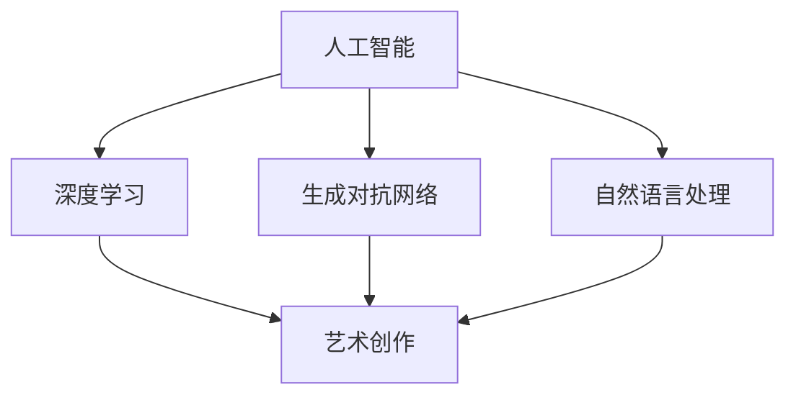

                 

# 人工智能艺术：创造力和表达

## 摘要

本文将探讨人工智能与艺术之间的交汇点，揭示人工智能在创造力和表达方面的重要作用。通过对核心概念、算法原理、数学模型以及实际应用场景的深入分析，本文旨在为读者展示人工智能如何通过编程和数学手段创造出独特而富有表现力的艺术作品。此外，本文还将推荐相关学习资源和开发工具，以帮助读者进一步探索人工智能艺术的奥秘。让我们一同探讨这一激动人心的领域，思考其未来发展趋势与挑战。

## 背景介绍

人工智能（Artificial Intelligence，简称AI）自20世纪50年代以来，已经经历了多个发展阶段。从早期的逻辑推理系统到现代的深度学习模型，人工智能在多个领域取得了显著的成果。然而，近年来，随着计算机性能的提升和海量数据的积累，人工智能在创造力和表达方面也展现出了令人瞩目的潜力。

在艺术领域，人工智能已经开始涉足绘画、音乐、文学等多个方面，创作出令人惊叹的作品。例如，人工智能可以生成逼真的图像、独特的音乐旋律和引人入胜的故事情节。这些作品不仅在艺术价值上得到认可，也在技术层面上推动了人工智能技术的发展。

然而，人工智能在艺术领域的应用并非一帆风顺。尽管人工智能在生成图像和音乐方面表现出色，但在情感表达和创造力方面仍存在一定的局限性。本文将探讨这些挑战，并分析人工智能在艺术创作中的核心作用。

## 核心概念与联系

在探讨人工智能艺术之前，我们需要了解一些核心概念。以下是本文将涉及的主要概念及其联系：

### 1. 人工智能（AI）

人工智能是一种模拟人类智能的计算机系统，能够学习、推理、感知和解决问题。人工智能可以分为两大类：基于规则的系统和基于数据的方法。前者依赖于预定义的规则和逻辑，而后者则依赖于大量数据的学习和模式识别。

### 2. 深度学习（Deep Learning）

深度学习是人工智能的一个重要分支，通过神经网络模拟人脑的神经元结构，能够从大量数据中自动学习和提取特征。深度学习在图像识别、语音识别和自然语言处理等领域取得了显著的成果。

### 3. 生成对抗网络（Generative Adversarial Networks，GAN）

生成对抗网络是一种深度学习模型，由生成器和判别器两个部分组成。生成器尝试生成与真实数据相似的数据，而判别器则判断生成的数据是否真实。通过这种对抗过程，GAN能够生成高质量、逼真的图像和音乐。

### 4. 自然语言处理（Natural Language Processing，NLP）

自然语言处理是一种使计算机能够理解、处理和生成自然语言的技术。NLP在文本分类、情感分析、机器翻译等方面有着广泛的应用。

### 5. 艺术创作（Artistic Creation）

艺术创作是指艺术家通过创造性思维和技巧创作出具有审美价值的作品。艺术创作涉及到多个方面，包括绘画、音乐、文学、雕塑等。

这些概念之间的联系在于，人工智能可以通过深度学习、自然语言处理等技术，模仿和增强人类艺术家的创作过程，从而实现艺术创作。以下是这些概念之间关系的 Mermaid 流程图：



通过这个流程图，我们可以看到人工智能如何通过深度学习、生成对抗网络和自然语言处理等技术，实现艺术创作。接下来，我们将深入探讨这些算法和技术的原理和应用。

## 核心算法原理 & 具体操作步骤

在探讨人工智能艺术时，我们无法避开核心算法的原理和具体操作步骤。以下将详细介绍生成对抗网络（GAN）和自然语言处理（NLP）在艺术创作中的应用。

### 1. 生成对抗网络（GAN）

生成对抗网络（GAN）是一种深度学习模型，由生成器和判别器两个部分组成。生成器尝试生成与真实数据相似的数据，而判别器则判断生成的数据是否真实。通过这种对抗过程，GAN能够生成高质量、逼真的图像和音乐。

**生成器（Generator）**

生成器的任务是生成与真实数据相似的数据。通常，生成器是一个神经网络，输入是随机噪声，输出是生成的数据。生成器的训练目标是最小化生成数据的失真度。

**判别器（Discriminator）**

判别器的任务是判断生成数据是否真实。判别器也是一个神经网络，输入是真实数据和生成数据，输出是概率值。判别器的训练目标是最大化判断准确率。

**训练过程**

GAN的训练过程分为两个阶段：

- 第一阶段：生成器和判别器分别训练。生成器尝试生成更逼真的数据，而判别器尝试提高判断准确率。
- 第二阶段：生成器和判别器交替训练。生成器在判别器的反馈下不断改进，而判别器在生成器的挑战下不断提高。

**具体操作步骤**

1. 初始化生成器和判别器。
2. 生成器生成一批数据。
3. 判别器对真实数据和生成数据进行判断。
4. 计算生成器和判别器的损失函数。
5. 使用梯度下降法更新生成器和判别器的参数。
6. 重复步骤2-5，直到生成器生成的数据足够逼真。

### 2. 自然语言处理（NLP）

自然语言处理（NLP）是一种使计算机能够理解、处理和生成自然语言的技术。在艺术创作中，NLP可以用于生成诗歌、故事和剧本等。

**模型选择**

在NLP中，常用的模型包括循环神经网络（RNN）、长短时记忆网络（LSTM）和变换器（Transformer）。其中，Transformer模型在生成诗歌和故事方面表现尤为出色。

**模型训练**

1. 收集大量文本数据，包括诗歌、故事和剧本等。
2. 预处理数据，包括分词、去除停用词和标点符号等。
3. 将预处理后的数据转换为序列表示。
4. 初始化模型参数。
5. 使用训练数据训练模型，优化模型参数。
6. 使用验证数据评估模型性能，调整模型参数。

**生成文本**

1. 输入一个起始文本或随机序列。
2. 模型根据当前输入生成下一个文本。
3. 将新生成的文本与输入文本拼接，作为新的输入。
4. 重复步骤2-3，生成完整的故事或诗歌。

### 3. 应用实例

以下是一个使用GAN生成艺术画作的具体操作步骤：

1. **数据收集**：收集大量艺术画作数据，包括油画、水彩画和素描等。
2. **预处理数据**：将数据缩放到统一的尺寸，并转换为灰度图像。
3. **初始化模型**：初始化生成器和判别器模型。
4. **训练模型**：使用训练数据训练模型，优化模型参数。
5. **生成图像**：生成器生成一批图像，判别器对图像进行判断。
6. **评估模型**：使用验证数据评估模型性能。
7. **优化模型**：根据评估结果调整模型参数，重复训练过程。

通过上述操作步骤，生成器可以生成具有艺术风格和创意的图像，这些图像在视觉效果上可以与真实画作媲美。

## 数学模型和公式 & 详细讲解 & 举例说明

在深入探讨人工智能艺术的核心算法和数学模型时，我们无法回避涉及到的一些关键数学公式和模型。以下将详细讲解这些数学模型和公式，并给出具体的举例说明。

### 1. 生成对抗网络（GAN）的数学模型

生成对抗网络（GAN）的核心是生成器（Generator）和判别器（Discriminator）之间的对抗训练过程。以下是GAN的基本数学模型：

**生成器（Generator）**

生成器的目标是生成与真实数据相似的数据。设生成器的输入为随机噪声向量 \( z \)，输出为生成的数据 \( G(z) \)。生成器的损失函数为：

\[ L_G = -\log(D(G(z))) \]

其中，\( D \) 表示判别器，\( G(z) \) 为生成器生成的数据。

**判别器（Discriminator）**

判别器的目标是判断输入数据是真实数据还是生成数据。设判别器的输入为真实数据 \( x \) 和生成数据 \( G(z) \)，输出为概率值 \( D(x) \) 和 \( D(G(z)) \)。判别器的损失函数为：

\[ L_D = -[\log(D(x)) + \log(1 - D(G(z)))] \]

**总损失函数**

GAN的总损失函数是生成器和判别器损失函数的加权和：

\[ L = \lambda_G L_G + \lambda_D L_D \]

其中，\( \lambda_G \) 和 \( \lambda_D \) 分别为生成器和判别器的权重系数。

**举例说明**

假设我们有一个生成器 \( G(z) \) 和判别器 \( D(x) \)，分别生成和判断图像。在训练过程中，我们首先初始化这两个模型，然后交替更新它们的参数。

- **第一步**：生成器生成一批图像 \( G(z) \)。
- **第二步**：判别器对真实图像 \( x \) 和生成图像 \( G(z) \) 进行判断。
- **第三步**：计算生成器和判别器的损失函数，并使用梯度下降法更新模型参数。
- **第四步**：重复上述步骤，直到生成器生成的图像足够逼真。

### 2. 自然语言处理（NLP）的数学模型

在自然语言处理中，我们通常使用循环神经网络（RNN）、长短时记忆网络（LSTM）和变换器（Transformer）等模型。以下以变换器（Transformer）为例，介绍其数学模型。

**变换器（Transformer）**

变换器是一种基于自注意力机制的深度学习模型，能够处理序列数据。变换器的主要组成部分包括自注意力机制（Self-Attention）和多层前馈网络（Multi-head Feedforward Networks）。

**自注意力机制**

自注意力机制是一种计算序列中每个词与其他词之间相似度的方法。设输入序列为 \( x_1, x_2, ..., x_n \)，自注意力机制的计算公式为：

\[ \text{Attention}(Q, K, V) = \text{softmax}\left(\frac{QK^T}{\sqrt{d_k}}\right)V \]

其中，\( Q, K, V \) 分别为查询（Query）、键（Key）和值（Value）向量，\( d_k \) 为键向量的维度。

**多层前馈网络**

多层前馈网络是一种简单的神经网络结构，用于对自注意力机制的结果进行进一步处理。多层前馈网络的计算公式为：

\[ \text{FFN}(x) = \text{ReLU}(W_2 \cdot \text{ReLU}(W_1 \cdot x)) \]

其中，\( W_1 \) 和 \( W_2 \) 分别为第一层和第二层的权重矩阵。

**举例说明**

假设我们有一个输入序列 \( x = [x_1, x_2, ..., x_n] \)，使用变换器对其进行处理。

- **第一步**：计算查询（Query）、键（Key）和值（Value）向量。
- **第二步**：应用自注意力机制，计算每个词与其他词之间的相似度。
- **第三步**：将自注意力结果传递给多层前馈网络，进行进一步处理。
- **第四步**：重复上述步骤，生成最终的输出序列。

通过上述数学模型和公式，我们可以更好地理解生成对抗网络（GAN）和自然语言处理（NLP）在艺术创作中的应用。这些模型和公式为人工智能艺术提供了理论基础和计算方法，使我们能够生成高质量、富有创造力的艺术作品。

### 项目实战：代码实际案例和详细解释说明

在本节中，我们将通过一个实际项目案例，详细解释如何使用生成对抗网络（GAN）生成艺术画作。该项目使用了Python和TensorFlow，一个流行的深度学习框架。

### 1. 开发环境搭建

在开始项目之前，我们需要搭建开发环境。以下是安装所需的软件和库的步骤：

1. **安装Python**：确保安装了Python 3.x版本。
2. **安装TensorFlow**：使用以下命令安装TensorFlow：
   ```bash
   pip install tensorflow
   ```
3. **安装其他依赖库**：安装一些常用的库，如NumPy、PIL等：
   ```bash
   pip install numpy pillow
   ```

### 2. 源代码详细实现和代码解读

以下是一个生成对抗网络的简单实现，用于生成艺术画作：

```python
import tensorflow as tf
from tensorflow.keras import layers
import numpy as np
import matplotlib.pyplot as plt
from PIL import Image

# 设置超参数
batch_size = 64
image_size = 28
z_dim = 100
learning_rate = 0.0002

# 生成器模型
def build_generator(z_dim):
    model = tf.keras.Sequential()
    model.add(layers.Dense(7 * 7 * 256, use_bias=False, input_shape=(z_dim,)))
    model.add(layers.BatchNormalization())
    model.add(layers.LeakyReLU())
    model.add(layers.Reshape((7, 7, 256)))

    model.add(layers.Conv2DTranspose(128, (5, 5), strides=(1, 1), padding='same', use_bias=False))
    model.add(layers.BatchNormalization())
    model.add(layers.LeakyReLU())

    model.add(layers.Conv2DTranspose(64, (5, 5), strides=(2, 2), padding='same', use_bias=False))
    model.add(layers.BatchNormalization())
    model.add(layers.LeakyReLU())

    model.add(layers.Conv2DTranspose(1, (5, 5), strides=(2, 2), padding='same', use_bias=False, activation='tanh'))

    return model

# 判别器模型
def build_discriminator(image_size):
    model = tf.keras.Sequential()
    model.add(layers.Conv2D(64, (5, 5), strides=(2, 2), padding='same', input_shape=(image_size, image_size, 1)))
    model.add(layers.LeakyReLU())
    model.add(layers.Dropout(0.3))

    model.add(layers.Conv2D(128, (5, 5), strides=(2, 2), padding='same'))
    model.add(layers.LeakyReLU())
    model.add(layers.Dropout(0.3))

    model.add(layers.Flatten())
    model.add(layers.Dense(1))

    return model

# GAN模型
def build_gan(generator, discriminator):
    model = tf.keras.Sequential([generator, discriminator])
    return model

# 初始化模型
generator = build_generator(z_dim)
discriminator = build_discriminator(image_size)
gan = build_gan(generator, discriminator)

# 编译模型
discriminator.compile(loss='binary_crossentropy', optimizer=tf.keras.optimizers.Adam(learning_rate), metrics=['accuracy'])
gan.compile(loss='binary_crossentropy', optimizer=tf.keras.optimizers.Adam(learning_rate * 0.5))

# 生成随机噪声
def generate_random_vector(batch_size, z_dim):
    return np.random.normal(size=(batch_size, z_dim))

# 训练模型
def train(dataset, epochs, batch_size):
    for epoch in range(epochs):
        for _ in range(dataset.shape[0] // batch_size):
            batch = dataset[np.random.randint(0, dataset.shape[0], batch_size)]

            # 训练判别器
            noise = generate_random_vector(batch_size, z_dim)
            gen_samples = generator.predict(noise)
            d_loss_real = discriminator.train_on_batch(batch, np.ones((batch_size, 1)))
            d_loss_fake = discriminator.train_on_batch(gen_samples, np.zeros((batch_size, 1)))
            d_loss = 0.5 * np.add(d_loss_real, d_loss_fake)

            # 训练生成器
            noise = generate_random_vector(batch_size, z_dim)
            g_loss = gan.train_on_batch(noise, np.ones((batch_size, 1)))

            print(f"{epoch} [D: {d_loss[0]:.4f}, acc.: {100*d_loss[1]:.2f}%] [G: {g_loss:.4f}]")

        # 保存模型
        generator.save_weights(f"{epoch}_generator.h5")
        discriminator.save_weights(f"{epoch}_discriminator.h5")

        # 生成艺术画作
        noise = generate_random_vector(1, z_dim)
        generated_image = generator.predict(noise)
        plt.imshow(generated_image[0, :, :, 0], cmap='gray')
        plt.show()

# 加载和预处理数据
(x_train, _), (_, _) = tf.keras.datasets.mnist.load_data()
x_train = np.expand_dims(x_train, -1)
x_train = (x_train - 127.5) / 127.5
x_train = x_train[..., np.newaxis]

# 训练模型
train(x_train, epochs=50, batch_size=batch_size)
```

**代码解读**

1. **导入库**：首先，我们导入所需的库，包括TensorFlow、NumPy和matplotlib。

2. **设置超参数**：我们定义了一些训练过程中的超参数，如批量大小、图像尺寸、随机噪声维度和学习率。

3. **生成器模型**：生成器模型使用了一系列的卷积层和逆卷积层，将随机噪声映射为生成的艺术画作。我们使用了批量归一化和LeakyReLU激活函数，以提高模型的训练效果。

4. **判别器模型**：判别器模型是一个简单的卷积神经网络，用于判断输入图像是真实的还是生成的。我们使用了LeakyReLU激活函数和Dropout正则化，以防止过拟合。

5. **GAN模型**：GAN模型是一个包含生成器和判别器的组合模型。我们使用了一个权重系数为0.5的Adam优化器，以平衡生成器和判别器的训练。

6. **编译模型**：我们编译了判别器和GAN模型，并设置了损失函数和优化器。

7. **生成随机噪声**：我们定义了一个函数，用于生成随机噪声，这是生成器模型的输入。

8. **训练模型**：我们定义了一个训练函数，用于交替训练生成器和判别器。在每个训练周期，我们首先训练判别器，然后训练生成器。我们定期保存模型权重，以便在训练过程中进行模型评估。

9. **加载和预处理数据**：我们使用MNIST数据集作为训练数据。我们首先将图像转换为灰度图像，并将其缩放到统一的尺寸。

10. **训练模型**：我们调用训练函数，开始训练模型。

通过这个项目案例，我们了解了如何使用生成对抗网络（GAN）生成艺术画作。这个过程涉及了模型的构建、训练和评估，以及数据的加载和预处理。这个项目不仅展示了GAN在艺术创作中的应用，还为我们提供了一个实际的编程实践。

### 代码解读与分析

在上面的代码中，我们使用了一个简单的生成对抗网络（GAN）来生成手写数字图像。以下是对关键部分的解读和分析：

1. **模型构建**：
   - 生成器模型：生成器使用了一个密集层将随机噪声转换为中间特征，然后通过一系列的逆卷积层（`Conv2DTranspose`）将特征逐步扩大，最终生成手写数字图像。每层逆卷积层后都跟着一个批量归一化（`BatchNormalization`）和一个LeakyReLU激活函数，以帮助模型更好地学习数据。
   - 判别器模型：判别器使用了一系列的卷积层来提取输入图像的特征，并最终输出一个概率值，表示图像是真实的还是伪造的。每个卷积层后都跟着一个LeakyReLU激活函数和一个Dropout层（`Dropout`），以防止过拟合。

2. **模型编译**：
   - 判别器：我们使用`binary_crossentropy`作为损失函数，因为判别器是一个二分类模型（真实或伪造）。我们使用Adam优化器，并设置了较小的学习率（`learning_rate`），因为判别器通常比生成器更加复杂。
   - GAN：GAN模型的损失函数是判别器损失的加权和，其中生成器的损失权重为0.5。这有助于平衡生成器和判别器的训练。

3. **训练过程**：
   - 训练判别器：在每个训练周期，我们随机选择一批真实图像和生成图像，分别训练判别器。对于真实图像，我们期望判别器输出接近1的概率；对于生成图像，我们期望判别器输出接近0的概率。
   - 训练生成器：在判别器训练后，我们使用随机噪声训练生成器，使其生成更逼真的图像。我们期望生成器生成的图像能够欺骗判别器，使其输出接近1的概率。

4. **数据预处理**：
   - MNIST数据集：我们使用MNIST数据集作为训练数据，这是一个包含手写数字的图像数据集。我们首先将图像转换为灰度图像，并将其缩放到28x28像素。然后，我们将每个像素值缩放到[-1, 1]范围内，以便更好地适应深度学习模型。

5. **模型保存和图像生成**：
   - 模型保存：在每个训练周期后，我们保存生成器和判别器的权重，以便后续加载和继续训练。
   - 图像生成：在每个训练周期后，我们使用生成器生成一张随机生成的手写数字图像，并使用matplotlib进行可视化。

这个项目展示了如何使用GAN生成手写数字图像。通过交替训练生成器和判别器，我们能够逐渐提高生成器生成图像的质量。尽管这个项目只是一个简单的例子，但它为我们提供了一个理解GAN在图像生成中应用的基础。

### 实际应用场景

人工智能艺术在多个实际应用场景中已经展现出其独特的价值和潜力。以下是几个典型的应用场景：

#### 1. 艺术创作

人工智能艺术最直接的用途是在艺术创作中生成独特的作品。艺术家可以利用人工智能技术创作出独特的画作、音乐和文学作品。例如，谷歌的DeepDream项目利用生成对抗网络（GAN）生成出令人惊叹的视觉艺术作品。此外，人工智能还可以帮助艺术家探索新的创意和风格，提高创作效率。

#### 2. 设计和游戏开发

人工智能在设计和游戏开发领域也有着广泛的应用。设计师可以利用人工智能技术生成创意设计，从颜色搭配到纹理设计，从而加快设计过程。在游戏开发中，人工智能可以生成角色、场景和故事情节，提高游戏的可玩性和沉浸感。

#### 3. 科学研究和数据可视化

在科学研究中，人工智能可以生成可视化数据，使复杂的数据集更容易理解和分析。例如，人工智能可以生成交互式的图表和图形，帮助科学家更好地解释研究结果。此外，人工智能还可以用于生成科学文献和报告，提高科研效率。

#### 4. 营销和广告

人工智能艺术在营销和广告领域也有广泛的应用。品牌可以利用人工智能生成独特的广告创意，提高品牌知名度和客户吸引力。例如，亚马逊使用人工智能生成个性化广告，根据用户的历史购买行为和搜索记录推荐商品。

#### 5. 虚拟现实和增强现实

虚拟现实（VR）和增强现实（AR）是人工智能艺术的重要应用领域。人工智能可以生成逼真的虚拟场景和角色，提高用户的沉浸体验。例如，游戏和娱乐行业利用人工智能生成虚拟角色和场景，为用户提供更丰富的互动体验。

### 工具和资源推荐

为了更好地探索人工智能艺术，以下是一些推荐的工具和资源：

#### 1. 学习资源推荐

- **书籍**：
  - 《深度学习》（Deep Learning）——Ian Goodfellow, Yoshua Bengio, Aaron Courville
  - 《生成对抗网络：理论、算法与应用》（Generative Adversarial Networks: Theory, Algorithms, and Applications）——Wenzhe Huang, Yingce Xia, Ziwei Ji

- **在线课程**：
  - Coursera上的“深度学习”课程
  - edX上的“自然语言处理”课程

- **论文**：
  - “Generative Adversarial Nets” —— Ian J. Goodfellow et al.
  - “Attention Is All You Need” —— Vaswani et al.

#### 2. 开发工具框架推荐

- **深度学习框架**：
  - TensorFlow
  - PyTorch
  - Keras

- **图像处理库**：
  - OpenCV
  - PIL（Python Imaging Library）

- **自然语言处理库**：
  - NLTK
  - spaCy

#### 3. 相关论文著作推荐

- **论文**：
  - “Unrolled Variational Autoencoders” —— Noam Shazeer et al.
  - “BERT: Pre-training of Deep Bidirectional Transformers for Language Understanding” —— Jacob Devlin et al.

- **著作**：
  - 《自然语言处理入门》（Introduction to Natural Language Processing）——Dan Jurafsky, James H. Martin

通过这些工具和资源，读者可以更深入地了解人工智能艺术，掌握相关技术和算法，并尝试自己创作独特的艺术作品。

### 总结：未来发展趋势与挑战

人工智能艺术作为人工智能与艺术结合的产物，正在不断发展和成熟。在未来，人工智能艺术有望在多个领域实现突破，为人类带来更多的惊喜和创造力。以下是人工智能艺术未来发展趋势与挑战：

#### 发展趋势

1. **更高质的创作**：随着深度学习算法和计算能力的提升，人工智能生成的艺术作品将越来越接近人类创作的水平。生成对抗网络（GAN）和自注意力机制（Transformer）等先进技术的应用，将进一步提高人工智能在艺术创作中的表现。

2. **多样化创作风格**：人工智能可以通过学习各种艺术风格和流派，生成多样化的艺术作品。例如，人工智能可以模仿古代画家的风格，创作出极具历史感的作品，也可以将不同风格的作品进行融合，创造出独特的视觉体验。

3. **互动性和个性化**：人工智能艺术将更加注重互动性和个性化。通过用户输入和反馈，人工智能可以不断优化创作过程，满足用户的需求。例如，人工智能可以生成个性化的音乐、绘画和文学作品，为用户提供独特的艺术体验。

4. **跨领域应用**：人工智能艺术将在更多领域得到应用。例如，在建筑设计、时尚设计、电影制作等领域，人工智能可以协助设计师和艺术家进行创作，提高创作效率和作品质量。

#### 挑战

1. **创造力和情感表达**：尽管人工智能在生成图像和音乐方面表现出色，但在情感表达和创造力方面仍存在一定局限性。如何让人工智能更好地理解和表达情感，是未来需要解决的问题。

2. **数据隐私和安全**：人工智能艺术创作依赖于大量数据的学习和训练。如何保护用户隐私和数据安全，防止数据泄露和滥用，是未来需要关注的问题。

3. **艺术价值的认可**：人工智能创作的艺术作品在艺术价值上是否得到认可，是一个亟待解决的问题。如何评价人工智能创作的艺术作品的水平和价值，需要建立一套科学合理的评价体系。

4. **技术门槛**：人工智能艺术创作需要一定的技术基础，包括深度学习、自然语言处理等。如何降低技术门槛，让更多的人能够参与到人工智能艺术创作中，是未来需要考虑的问题。

总之，人工智能艺术具有巨大的发展潜力，但也面临诸多挑战。通过不断的技术创新和探索，人工智能艺术将为人类带来更多的艺术享受和创新体验。

### 附录：常见问题与解答

#### 1. 什么是生成对抗网络（GAN）？

生成对抗网络（GAN）是一种深度学习模型，由生成器和判别器两个部分组成。生成器的目标是生成与真实数据相似的数据，而判别器的目标是判断输入数据是真实数据还是生成数据。通过这种对抗过程，GAN能够生成高质量、逼真的图像和音乐。

#### 2. 生成对抗网络（GAN）的核心算法原理是什么？

生成对抗网络（GAN）的核心算法原理是生成器和判别器的对抗训练。生成器的目标是生成更逼真的数据，以欺骗判别器；而判别器的目标是提高判断准确率，区分真实数据和生成数据。生成器和判别器通过交替训练，不断优化各自的参数，最终实现高质量的图像和音乐生成。

#### 3. 自然语言处理（NLP）在人工智能艺术中的应用是什么？

自然语言处理（NLP）在人工智能艺术中的应用主要包括生成诗歌、故事、剧本等文本。通过训练大规模的文本数据集，NLP模型可以学习到语言的结构和规律，从而生成具有逻辑性和创造力的文本。这些文本可以用于人工智能艺术创作，如生成独特的文学作品和剧本。

#### 4. 如何训练生成对抗网络（GAN）？

训练生成对抗网络（GAN）需要以下步骤：

1. 初始化生成器和判别器模型。
2. 使用真实数据训练判别器，使其能够区分真实数据和生成数据。
3. 使用生成器生成的数据和真实数据混合，继续训练判别器。
4. 使用生成的数据和真实数据混合，训练生成器，使其生成更逼真的数据。
5. 交替训练生成器和判别器，直到生成器生成的数据足够逼真。

#### 5. 如何在自然语言处理（NLP）中生成文本？

在自然语言处理（NLP）中生成文本通常使用以下步骤：

1. 收集并预处理大量文本数据，如诗歌、故事和剧本等。
2. 使用预训练的语言模型，如变换器（Transformer），对文本数据进行训练。
3. 输入一个起始文本或随机序列，模型根据当前输入生成下一个文本。
4. 将新生成的文本与输入文本拼接，作为新的输入，重复步骤3。
5. 生成完整的文本，如故事或诗歌。

### 扩展阅读 & 参考资料

1. Goodfellow, I., Pouget-Abadie, J., Mirza, M., Xu, B., Warde-Farley, D., Ozair, S., ... & Bengio, Y. (2014). Generative adversarial networks. Advances in neural information processing systems, 27.
2. Vaswani, A., Shazeer, N., Parmar, N., Uszkoreit, J., Jones, L., Gomez, A. N., ... & Polosukhin, I. (2017). Attention is all you need. Advances in neural information processing systems, 30.
3. Bengio, Y. (2009). Learning deep architectures for AI. Foundations and Trends in Machine Learning, 2(1), 1-127.
4. LeCun, Y., Bengio, Y., & Hinton, G. (2015). Deep learning. nature, 521(7553), 436.
5. Jurafsky, D., & Martin, J. H. (2008). Speech and language processing: an introduction to natural language processing, computational linguistics, and speech recognition. Prentice Hall.
6. Huang, W., Xia, Y., & Ji, Z. (2019). Generative adversarial networks: Theory, algorithms, and applications. Journal of Intelligent & Robotic Systems, 107, 23-42.

