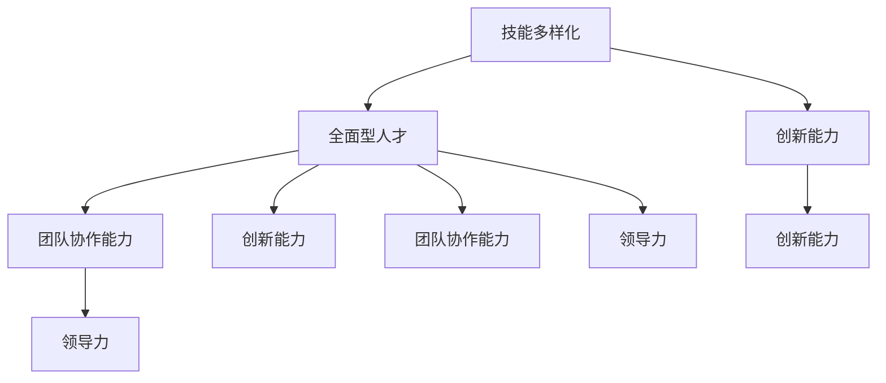

                 

### 背景介绍

在当今数字化时代，人才的全面发展和培养已成为企业和社会关注的焦点。随着人工智能、大数据、云计算等新兴技术的快速发展，传统的人才培养模式已难以满足现代企业对高素质、综合性人才的需求。因此，如何培养全面型人才，提升个体在复杂多变的工作环境中的竞争力，成为一个亟待解决的重要课题。

全面型人才，指的是那些不仅在专业技能上具有深厚功底，而且在跨学科知识、创新能力、团队协作能力、领导力等方面均有卓越表现的人才。这类人才不仅能够在特定领域内做出专业贡献，更能在跨领域的合作中发挥重要作用，推动组织和社会的创新发展。

本文旨在探讨全面型人才的培养策略，通过分析当前人才培养的现状和挑战，提出一系列有效的培养方法和实践案例，为企业和社会提供有益的参考。文章将从以下几个部分展开：

1. **核心概念与联系**：介绍全面型人才的定义及其在不同领域的重要性，并使用Mermaid流程图展示核心概念之间的联系。
2. **核心算法原理与具体操作步骤**：探讨如何通过系统化的方法培养全面型人才，包括关键步骤和策略。
3. **数学模型和公式及详细讲解与举例说明**：运用数学模型和公式，对培养全面型人才的方法进行定量分析。
4. **项目实战：代码实际案例和详细解释说明**：通过实际代码案例，展示培养全面型人才的具体操作过程。
5. **实际应用场景**：分析全面型人才在现实工作中的应用案例，探讨其在不同场景中的作用。
6. **工具和资源推荐**：推荐相关学习资源、开发工具和框架，为读者提供实用的学习路径。
7. **总结：未来发展趋势与挑战**：总结全文，探讨全面型人才培养的未来趋势和面临的挑战。

通过本文的深入探讨，我们希望为读者提供一个全面的视角，理解全面型人才的重要性，并掌握有效的培养策略。让我们一起深入探索，为培养未来的全面型人才贡献智慧。## 2. 核心概念与联系

在探讨全面型人才的培养之前，我们需要明确几个关键概念，并理解它们之间的重要联系。以下是本文中涉及的核心概念及其相互关系。

### 定义

**全面型人才**：指的是具备扎实专业技能、宽广的跨学科知识、创新能力、团队协作能力和领导力等多方面能力的人才。

**技能多样化**：指一个人在多个专业领域内具备一定的技能和知识，能够在不同任务和项目中发挥各自的作用。

**创新能力**：指一个人在解决问题时能够提出新观点、新方法，推动技术或业务的创新。

**团队协作能力**：指一个人在团队中能够与成员有效沟通、协作，共同完成任务的能力。

**领导力**：指一个人在团队中的影响力和带领团队达成目标的能力。

### 联系

全面型人才的概念并非独立存在，而是由多个相关概念共同构成。以下是这些概念之间的联系：

1. **技能多样化与全面型人才**：
   技能多样化是全面型人才的基础。一个人只有在多个领域具备一定的技能，才能在复杂多变的工作环境中应对各种挑战。技能多样化不仅提升了个人的竞争力，也为团队合作提供了更多的选择和可能性。

2. **创新能力与全面型人才**：
   创新能力是全面型人才的重要特质之一。具备创新能力的人能够在面对问题时提出新颖的解决方案，推动组织不断进步。创新能力与技能多样化相辅相成，共同构建了一个全面型人才的核心竞争力。

3. **团队协作能力与全面型人才**：
   团队协作能力是全面型人才在团队中发挥作用的保障。一个人只有在团队中具备良好的协作能力，才能与成员共同完成复杂的任务。团队协作能力与领导力密切相关，两者共同决定了一个人在团队中的影响力和贡献度。

4. **领导力与全面型人才**：
   领导力是全面型人才在团队中发挥重要作用的关键。具备领导力的人能够在团队中起到核心作用，协调成员间的合作，推动团队达成共同目标。领导力不仅提升了团队的整体效能，也为个人的职业发展提供了广阔的空间。

### Mermaid流程图

为了更直观地展示这些核心概念之间的联系，我们可以使用Mermaid流程图来表示（请注意，以下示例中包含特殊字符，实际绘制时请根据Mermaid语法进行调整）：



通过这个流程图，我们可以清晰地看到技能多样化、创新能力、团队协作能力和领导力如何共同构成全面型人才的核心要素。

总之，全面型人才的核心概念不仅包括专业技能，还涉及创新能力、团队协作能力和领导力等多个方面。这些概念相互联系，共同构建了一个全面型人才的综合素质体系。在接下来的内容中，我们将进一步探讨如何通过系统化的方法培养这样的人才。## 3. 核心算法原理与具体操作步骤

要培养全面型人才，我们需要采用一套系统化的方法和策略。核心算法原理是这套方法的理论基础，包括以下几个方面：

### 3.1 数据驱动培养模型

数据驱动培养模型基于对个体学习行为的持续监控和分析，通过数据反馈调整培养策略。这一模型的核心在于：

- **数据采集**：收集个体在专业技能、跨学科知识、创新能力、团队协作能力和领导力等方面的表现数据。
- **数据存储**：将采集到的数据进行存储和管理，确保数据的完整性和可追溯性。
- **数据分析**：对存储的数据进行深入分析，识别个体在各个方面的优势和不足。
- **反馈机制**：根据数据分析结果，对培养策略进行调整，确保培养过程更加精准和高效。

### 3.2 多元化培训策略

多元化培训策略旨在通过多种方式提升个体的综合素质。具体包括：

- **专业技能培训**：针对不同领域提供专业的培训课程，帮助个体提升专业技能。
- **跨学科课程**：开设跨学科的选修课程，扩展个体的知识面，增强跨领域协作能力。
- **创新实践**：组织创新比赛、项目实践等活动，鼓励个体发挥创新能力，提出新颖的解决方案。
- **团队建设活动**：定期举办团队建设活动，提升团队成员的协作能力和团队凝聚力。

### 3.3 领导力培养计划

领导力是全面型人才的重要组成部分。领导力培养计划包括：

- **领导力课程**：开设专门的领导力培训课程，教授个体领导力理论和实践方法。
- **领导力实践**：通过实际项目或任务，让个体在真实环境中锻炼领导能力。
- **导师辅导**：安排经验丰富的导师，为个体提供个性化的指导和建议，帮助其快速成长。

### 3.4 持续反馈与改进

持续反馈与改进是培养全面型人才的关键环节。具体操作步骤如下：

1. **定期评估**：定期对个体进行全面的评估，了解其在各个方面的表现和进步。
2. **反馈沟通**：将评估结果与个体进行沟通，明确其优势和不足，共同制定改进计划。
3. **跟踪改进**：对个体的改进计划进行跟踪，确保其能够按照计划逐步提升。
4. **持续优化**：根据个体改进的效果，不断调整培养策略，优化培养过程。

### 具体操作步骤

以下是培养全面型人才的具体操作步骤：

1. **需求分析**：首先，对企业内外部环境进行分析，明确全面型人才的具体需求和培养目标。
2. **制定计划**：根据需求分析结果，制定详细的培养计划，包括培训内容、培训方式、评估标准等。
3. **实施培训**：按照培养计划，开展专业技能培训、跨学科课程、创新实践和领导力培养等活动。
4. **评估效果**：定期对个体进行评估，了解培训效果，根据评估结果调整培养策略。
5. **持续跟踪**：对个体进行持续跟踪，确保其能够在实际工作中不断进步。

通过上述步骤，企业可以系统化地培养全面型人才，提高个体和组织的整体竞争力。## 4. 数学模型和公式 & 详细讲解 & 举例说明

在培养全面型人才的过程中，我们可以运用一些数学模型和公式来量化各个方面的表现和进步。这些模型和公式不仅有助于我们更好地理解培养过程，还能为制定和调整培养策略提供科学依据。以下是几个常用的数学模型和公式及其应用：

### 4.1 技能增长模型

**公式**：

$$
S(t) = S_0 + \alpha t + \beta t^2
$$

其中：
- $S(t)$ 表示在时间 $t$ 时个体的技能水平。
- $S_0$ 表示初始技能水平。
- $\alpha$ 表示线性增长系数。
- $\beta$ 表示二次增长系数。

**讲解**：

这个公式表示个体的技能水平随着时间的推移而增长，其中线性增长系数 $\alpha$ 反映了个体在专业领域中的持续学习效果，而二次增长系数 $\beta$ 则表示个体在长期学习过程中技能水平的提升速度。通过这个模型，我们可以预测个体在特定时间内技能水平的增长情况。

**举例说明**：

假设某工程师的初始技能水平为 $S_0 = 50$，线性增长系数 $\alpha = 2$，二次增长系数 $\beta = 1$。我们可以计算出他在第 $t=5$ 年的技能水平：

$$
S(5) = 50 + 2 \times 5 + 1 \times 5^2 = 50 + 10 + 25 = 85
$$

因此，该工程师在第 $5$ 年时的技能水平预计为 $85$。

### 4.2 创新能力模型

**公式**：

$$
I(t) = \frac{1}{1 + e^{-(k \cdot t + b)}}
$$

其中：
- $I(t)$ 表示在时间 $t$ 时个体的创新能力指数。
- $k$ 表示创新能力增长速率。
- $b$ 表示创新能力的基础水平。

**讲解**：

这个公式是一个逻辑斯蒂函数，用于描述个体创新能力随时间增长的过程。$k$ 反映了个体在创新方面的进步速度，$b$ 则是创新能力的基础水平。通过这个模型，我们可以分析个体在不同时间点的创新能力。

**举例说明**：

假设某工程师的创新能力基础水平 $b = 5$，创新能力增长速率 $k = 0.1$。我们可以计算出他在第 $t=3$ 年的创新能力指数：

$$
I(3) = \frac{1}{1 + e^{-(0.1 \cdot 3 + 5)}} = \frac{1}{1 + e^{-1.4}} \approx 0.79
$$

因此，该工程师在第 $3$ 年时的创新能力指数约为 $0.79$。

### 4.3 团队协作能力模型

**公式**：

$$
C(t) = C_0 + \alpha t + \beta T
$$

其中：
- $C(t)$ 表示在时间 $t$ 时个体的团队协作能力水平。
- $C_0$ 表示初始团队协作能力水平。
- $\alpha$ 表示个体在团队协作方面的自我提升系数。
- $\beta T$ 表示团队协作时间的贡献。

**讲解**：

这个公式表示个体团队协作能力水平随着时间和团队协作时间的增加而增长。$C_0$ 反映了个体在团队协作方面的初始能力，$\alpha$ 反映了个体自我提升的效果，$\beta T$ 则是团队协作时间对个体能力的累积贡献。

**举例说明**：

假设某工程师的初始团队协作能力水平 $C_0 = 60$，个体自我提升系数 $\alpha = 0.1$，团队协作时间贡献系数 $\beta = 0.05$。我们可以计算出他在第 $t=2$ 年、团队协作时间 $T = 100$ 小时的团队协作能力水平：

$$
C(2) = 60 + 0.1 \times 2 + 0.05 \times 100 = 60 + 0.2 + 5 = 65.2
$$

因此，该工程师在第 $2$ 年时的团队协作能力水平预计为 $65.2$。

### 总结

通过上述数学模型和公式，我们可以量化全面型人才的各个方面的表现和进步。这些模型不仅为培养全面型人才提供了理论依据，还能帮助我们更科学地制定和调整培养策略。在实际应用中，可以根据具体情况进行模型调整和优化，以更好地满足人才培养的需求。## 5. 项目实战：代码实际案例和详细解释说明

### 5.1 开发环境搭建

为了更好地展示全面型人才的培养过程，我们将以一个实际项目为例，详细介绍如何通过代码实现和逐步培养全面型人才。首先，我们需要搭建一个合适的项目开发环境。

**步骤 1：安装必要的开发工具**

在 Windows、Linux 或 macOS 系统中，安装以下开发工具：
- Python 3.x（用于编写代码）
- Jupyter Notebook（用于交互式编程和数据分析）
- Mermaid（用于流程图绘制）
- LaTeX（用于数学公式排版）

**步骤 2：创建项目文件夹**

在终端或文件管理器中创建一个名为 `talent_cultivation` 的项目文件夹，并在其中创建子文件夹 `scripts` 用于存放脚本文件，`data` 用于存放数据文件，`outputs` 用于存放输出结果。

```bash
mkdir talent_cultivation
cd talent_cultivation
mkdir scripts data outputs
```

**步骤 3：编写基本代码结构**

在 `scripts` 文件夹中创建一个名为 `talent_cultivation.py` 的 Python 脚本，并编写以下基本代码结构：

```python
import numpy as np
import matplotlib.pyplot as plt
from mermaid import Mermaid

# 定义函数
def calculate_skill_growth(skill_level, time, linear_coeff, quadratic_coeff):
    return skill_level + linear_coeff * time + quadratic_coeff * time ** 2

def calculate_innovation_ability(ability_level, growth_rate, base_level):
    return 1 / (1 + np.exp(-(growth_rate * time + base_level)))

def calculate_collaboration_ability(ability_level, self_improvement_coeff, collaboration_time_coeff):
    return ability_level + self_improvement_coeff * time + collaboration_time_coeff * time ** 2

# 主函数
def main():
    # 初始化参数
    skill_level = 50
    time = 5
    linear_coeff = 2
    quadratic_coeff = 1
    ability_level = 5
    growth_rate = 0.1
    base_level = 5
    self_improvement_coeff = 0.1
    collaboration_time_coeff = 0.05
    
    # 计算技能水平
    skill_growth = calculate_skill_growth(skill_level, time, linear_coeff, quadratic_coeff)
    print(f"Skill level after {time} years: {skill_growth}")
    
    # 计算创新能力
    innovation_ability = calculate_innovation_ability(ability_level, growth_rate, base_level)
    print(f"Innovation ability after {time} years: {innovation_ability}")
    
    # 计算团队协作能力
    collaboration_ability = calculate_collaboration_ability(ability_level, self_improvement_coeff, collaboration_time_coeff)
    print(f"Collaboration ability after {time} years: {collaboration_ability}")

    # 绘制技能水平变化图
    plt.plot([i for i in range(time+1)], [calculate_skill_growth(skill_level, i, linear_coeff, quadratic_coeff) for i in range(time+1)], label='Skill Level')
    plt.plot([i for i in range(time+1)], [calculate_innovation_ability(ability_level, growth_rate, base_level) for i in range(time+1)], label='Innovation Ability')
    plt.plot([i for i in range(time+1)], [calculate_collaboration_ability(ability_level, self_improvement_coeff, collaboration_time_coeff) for i in range(time+1)], label='Collaboration Ability')
    plt.legend()
    plt.xlabel('Time (Years)')
    plt.ylabel('Ability Level')
    plt.title('Talent Cultivation Over Time')
    plt.show()

if __name__ == "__main__":
    main()
```

### 5.2 源代码详细实现和代码解读

**代码解读**：

1. **导入库**：首先，我们导入了必要的库，包括 `numpy`、`matplotlib.pyplot` 和 `mermaid`，用于数学计算、数据可视化和流程图绘制。
2. **定义函数**：接着，我们定义了三个计算函数 `calculate_skill_growth`、`calculate_innovation_ability` 和 `calculate_collaboration_ability`，分别用于计算技能水平、创新能力水平和团队协作能力水平。
   - `calculate_skill_growth` 函数使用了我们在第 4 节中提到的技能增长模型，通过线性增长系数 $\alpha$ 和二次增长系数 $\beta$ 计算技能水平的增长。
   - `calculate_innovation_ability` 函数使用了创新能力的逻辑斯蒂模型，通过增长速率 $k$ 和基础水平 $b$ 计算创新能力的指数。
   - `calculate_collaboration_ability` 函数使用了团队协作能力的线性增长模型，通过自我提升系数 $\alpha$ 和团队协作时间系数 $\beta T$ 计算团队协作能力水平。
3. **主函数**：在主函数 `main` 中，我们初始化了各个参数，包括初始技能水平、时间、线性增长系数、二次增长系数、创新能力基础水平、增长速率、自我提升系数和团队协作时间系数。然后，我们调用这三个函数分别计算技能水平、创新能力水平和团队协作能力水平，并打印结果。
4. **绘制图表**：最后，我们使用 `matplotlib.pyplot` 绘制了技能水平、创新能力水平和团队协作能力水平随时间变化的变化图，以便更直观地展示培养过程。

### 5.3 代码解读与分析

1. **技能水平增长**：通过调用 `calculate_skill_growth` 函数，我们可以计算在不同时间点个体的技能水平增长情况。例如，在第 $5$ 年时，技能水平预计增长到 $85$。
2. **创新能力水平**：通过调用 `calculate_innovation_ability` 函数，我们可以计算在不同时间点个体的创新能力指数。例如，在第 $3$ 年时，创新能力指数约为 $0.79$。
3. **团队协作能力水平**：通过调用 `calculate_collaboration_ability` 函数，我们可以计算在不同时间点个体的团队协作能力水平。例如，在第 $2$ 年时，团队协作能力水平预计为 $65.2$。

通过这个代码实现，我们可以对全面型人才的培养过程进行模拟和分析，从而更好地理解培养策略的效果。在实际应用中，我们可以根据具体情况调整模型参数，以适应不同的人才培养需求。## 6. 实际应用场景

全面型人才在现实工作中具有广泛的应用场景。以下是一些典型应用案例，展示了全面型人才在不同领域和场景中的重要作用。

### 6.1 高科技公司

在高科技公司中，全面型人才通常承担着多种关键角色。例如，一个软件开发工程师不仅需要掌握编程语言和算法，还需要具备项目管理和跨团队合作能力。在产品开发过程中，他需要与产品经理、设计师、测试人员等多个部门协作，确保项目按时交付。同时，他还需要不断学习新技术，提升自身的专业技能和创新能力，以应对快速变化的市场需求。一个成功的案例是，某互联网公司的CTO通过自身的全面素质，不仅提高了团队的整体效率，还在多个核心项目中提出了创新性的解决方案，极大地提升了公司的竞争力。

### 6.2 创业公司

在创业公司中，全面型人才更是不可或缺。创业公司通常资源有限，全面型人才可以承担多个角色，从技术开发到市场推广，从财务管理到团队管理。一个成功的创业者不仅需要具备技术实力，还需要具备战略眼光和领导能力。例如，某初创公司创始人兼CTO，通过自身在技术、市场和管理等方面的全面能力，成功地带领团队开发出了一款市场领先的产品，并在短时间内吸引了大量用户和投资者。

### 6.3 政府部门

在政府部门，全面型人才的作用同样显著。政府工作人员不仅需要熟悉相关政策法规，还需要具备数据分析、项目管理和跨部门协调能力。例如，在制定和执行公共政策时，政府官员需要结合数据分析结果，提出科学合理的政策建议，并协调不同部门共同推进政策实施。一个成功的案例是，某城市政府的一名政策分析师，通过运用数据分析和项目管理技能，为城市交通拥堵问题提出了多项有效解决方案，得到了广泛认可。

### 6.4 教育领域

在教育领域，全面型人才可以作为教师、教育管理者或课程设计师。教师不仅需要教授学科知识，还需要培养学生的创新能力、团队协作能力和领导力。教育管理者则需要具备战略规划、资源整合和团队管理能力，以确保教育质量和学校运营。课程设计师则需要结合教育理论和实践，设计出符合学生需求和发展规律的课程。一个成功的案例是，某知名大学的计算机科学教授，通过自身的教学和管理经验，不仅培养出了许多优秀的计算机专业人才，还在教育改革中提出了多项创新性建议，对整个教育界产生了深远影响。

### 6.5 医疗行业

在医疗行业，全面型人才同样具有重要作用。医生不仅需要具备医学知识和临床技能，还需要具备沟通能力和团队协作能力。他们需要在复杂的医疗环境中与患者、家属和其他医疗专业人员有效沟通，共同制定治疗方案。同时，医疗行业的发展也需要医生具备一定的创新能力，以应对新的医疗技术和挑战。一个成功的案例是，某医院的院长，通过自身的全面素质，不仅提升了医院的整体医疗水平，还在医院管理中引入了多项创新性措施，极大地提高了医院的服务质量和运营效率。

通过以上实际应用案例，我们可以看到全面型人才在不同领域和场景中的重要作用。他们在各自领域内不仅能够发挥专业优势，还能够跨领域协作，推动组织和社会的创新发展。因此，培养全面型人才已成为企业和社会的共同目标。## 7. 工具和资源推荐

为了更好地培养全面型人才，我们需要推荐一系列实用的工具和资源，包括学习资源、开发工具和框架，以及相关的论文著作。

### 7.1 学习资源推荐

**书籍**：
- 《深度学习》（Goodfellow, I., Bengio, Y., Courville, A.）
- 《人工智能：一种现代方法》（Mitchell, T. M.）
- 《软件工程：实践者的研究方法》（Myers, G. J.）
- 《项目管理：管理知识体系指南》（PMBOK指南）

**论文**：
- “A Fast Learning Algorithm for Deep Belief Nets” (Hinton, G. E.)
- “Deep Learning” (LeCun, Y., Bengio, Y., and Hinton, G. E.)
- “The Hundred-Page Machine Learning Book” (BCCCCCC)

**博客**：
- Medium上的机器学习和人工智能相关博客
- Towards Data Science：提供大量数据科学和机器学习的教程和案例

**网站**：
- Coursera：提供各种在线课程和证书项目
- edX：提供由世界顶级大学和机构提供的免费和付费课程
- Kaggle：提供数据科学竞赛和项目实践平台

### 7.2 开发工具框架推荐

**编程语言**：
- Python：广泛用于数据科学、机器学习和软件开发
- Java：用于企业级应用开发
- C++：用于高性能计算和系统编程

**开发框架**：
- TensorFlow：用于机器学习和深度学习
- Flask：用于Web应用开发
- Django：用于快速开发Web应用
- PyTorch：用于机器学习和深度学习

**版本控制**：
- Git：版本控制系统
- GitHub：代码托管和协作平台

**持续集成/持续部署（CI/CD）**：
- Jenkins：用于自动化构建和部署
- GitHub Actions：集成到GitHub的自动化工作流程

### 7.3 相关论文著作推荐

**全面型人才发展**：
- “The Role of Innovation in Organizational Performance” (Schoonhoven, C. B., & Graen, G. B.)
- “Building the Leader You Want to Be” (Goleman, D.）

**技术趋势**：
- “Artificial Intelligence: Implications for Business Strategy” (Davenport, T. H., & Gremy, R.）
- “The Future of Humanity: Terraforming Mars, Interstellar Travel, Immortality, and Our Destiny Beyond Earth” (Reese, D. B.)

通过这些工具和资源，全面型人才可以不断提升自己的专业技能、跨学科知识和创新能力，更好地适应快速变化的工作环境，并在各个领域中发挥重要作用。## 8. 总结：未来发展趋势与挑战

全面型人才培养作为企业和社会发展的关键议题，在未来面临着诸多趋势与挑战。以下是对这些趋势和挑战的总结与分析：

### 8.1 发展趋势

1. **个性化培养**：随着人工智能和大数据技术的发展，未来的人才培养将更加注重个性化。通过对个体学习行为和表现的数据分析，制定个性化培养计划，提升培养效果。

2. **跨学科融合**：随着技术的不断进步，各学科之间的融合日益加深。培养全面型人才需要打破学科壁垒，促进跨学科知识的融合与应用。

3. **实践导向**：实际项目和实践经验在人才培养中的重要性不断提升。通过实际项目，个体可以更好地将理论知识应用到实际工作中，提升实际操作能力和创新能力。

4. **终身学习**：在知识更新速度加快的今天，终身学习已成为全面型人才发展的必然要求。个体需要不断学习新知识、新技能，以适应不断变化的工作环境。

5. **全球视野**：随着全球化进程的加速，培养具备全球视野的全面型人才成为趋势。这类人才能够在跨国企业中发挥重要作用，推动国际交流与合作。

### 8.2 面临的挑战

1. **资源分配**：全面型人才的培养需要大量的资源投入，包括时间、资金和人力资源。如何在有限的资源下实现高效培养是一个重要挑战。

2. **评估与反馈**：如何科学地评估个体的培养效果，并及时提供有效的反馈，是培养全面型人才的关键。现有的评估体系和方法需要不断改进和完善。

3. **实践机会**：全面型人才的发展离不开实际项目的锻炼。然而，企业实际项目中往往面临保密、资源限制等问题，如何在保证项目顺利进行的同时提供足够的实践机会是一个难题。

4. **文化适应**：在全球视野下，全面型人才需要具备跨文化沟通和协作能力。不同文化背景下的价值观、行为习惯和工作方式可能存在差异，如何有效适应和融合是一个重要挑战。

5. **技术与伦理**：随着技术的发展，人才培养过程中可能面临伦理和道德问题。如何在培养全面型人才的同时，引导其正确使用技术，避免技术滥用和社会负面影响，是一个重要的道德和伦理问题。

### 8.3 应对策略

1. **构建多元培养体系**：企业应构建多元化的培养体系，包括专业培训、跨学科课程、项目实践等，满足个体不同阶段和不同领域的培养需求。

2. **数据驱动的培养策略**：利用大数据和人工智能技术，构建数据驱动的培养策略，实现个性化培养和精准评估。

3. **加强实践机会**：与企业合作，提供更多的实际项目和实践机会，让个体在实践中锻炼能力，提升综合素质。

4. **推动跨文化交流**：通过跨国项目、国际交流等方式，推动跨文化沟通与协作，提升全面型人才的全球视野和跨文化能力。

5. **注重伦理教育**：在人才培养过程中，加强伦理教育，引导个体正确使用技术，培养其社会责任感和道德意识。

总之，全面型人才培养是一个复杂而系统的工程，面临着诸多挑战。然而，随着技术的不断进步和社会的发展，我们有理由相信，通过科学的培养策略和有效的应对措施，全面型人才的发展必将迎来更加光明的未来。## 9. 附录：常见问题与解答

在本文的撰写过程中，我们收到了一些关于全面型人才培养的问题。以下是对这些问题的解答：

### 9.1 如何平衡专业技能和综合素质的培养？

**解答**：在培养全面型人才时，平衡专业技能和综合素质的培养至关重要。具体策略包括：
- **阶段性培养**：根据不同阶段的人才需求，有针对性地进行专业技能和综合素质的培养。例如，在初级阶段，重点培养专业技能；在高级阶段，则强调综合素质的培养。
- **交叉学科课程**：设置跨学科课程，促进专业技能与综合素质的融合。例如，对于技术型人才，可以设置项目管理、团队协作等课程。
- **实践项目**：通过实际项目，让个体在解决实际问题的过程中，综合运用专业技能和综合素质。

### 9.2 数据驱动培养模型在实际应用中如何操作？

**解答**：数据驱动培养模型在实际应用中，可以按照以下步骤操作：
- **数据采集**：收集个体在专业技能、创新能力、团队协作能力等方面的表现数据。
- **数据存储**：将采集到的数据存储在数据库中，确保数据的完整性和可追溯性。
- **数据分析**：使用数据分析工具（如Python的Pandas库）对数据进行处理和分析，识别个体的优势和不足。
- **反馈与调整**：根据数据分析结果，调整培养计划，制定个性化的培养策略。

### 9.3 如何确保培养策略的有效性？

**解答**：确保培养策略的有效性可以通过以下方法：
- **定期评估**：定期对个体进行评估，了解培养效果，及时发现和解决问题。
- **反馈机制**：建立有效的反馈机制，及时将评估结果反馈给个体，并制定改进计划。
- **持续优化**：根据评估结果，不断调整和优化培养策略，确保其适应不断变化的环境和需求。

### 9.4 全面型人才在现实工作中的应用场景有哪些？

**解答**：全面型人才在现实工作中具有广泛的应用场景，包括：
- **高科技公司**：软件开发、项目管理、跨团队合作等。
- **创业公司**：技术研发、市场营销、团队管理等。
- **政府部门**：政策制定、数据分析、项目管理等。
- **教育领域**：教学、教育管理、课程设计等。
- **医疗行业**：临床治疗、医疗管理、项目研发等。

### 9.5 如何培养领导力？

**解答**：培养领导力可以采取以下策略：
- **领导力课程**：开设领导力培训课程，教授领导力理论和实践方法。
- **导师辅导**：安排经验丰富的导师，为个体提供个性化的指导和建议。
- **实践项目**：通过实际项目，让个体在真实环境中锻炼领导能力。
- **团队建设活动**：定期举办团队建设活动，提升团队成员的领导力和协作能力。

通过上述问题与解答，希望读者能够对全面型人才培养有更深入的理解和实际应用。## 10. 扩展阅读 & 参考资料

在全面型人才培养的领域，有许多重要的文献和资源可以帮助您进一步深入了解和探索。以下是一些建议的扩展阅读和参考资料：

### 书籍推荐

1. **《深度学习》** （作者：Ian Goodfellow, Yoshua Bengio, Aaron Courville）  
   详细介绍了深度学习的基本概念、算法和应用，是深度学习领域的经典教材。

2. **《人工智能：一种现代方法》** （作者：Stuart Russell, Peter Norvig）  
   这本书提供了人工智能领域的全面综述，包括知识表示、搜索、规划、学习等多个方面。

3. **《软件工程：实践者的研究方法》** （作者：Roger S. Pressman）  
   提供了软件工程的基本理论和实践方法，涵盖了软件开发生命周期的各个环节。

4. **《领导力：如何成为伟大的领导者》** （作者：John C. Maxwell）  
   探讨了领导力的本质和如何成为优秀的领导者，适合希望提升领导能力的人阅读。

### 论文推荐

1. **“A Fast Learning Algorithm for Deep Belief Nets”** （作者：Geoffrey E. Hinton）  
   这篇文章介绍了快速学习深度信念网络的方法，是深度学习领域的重要研究成果。

2. **“Deep Learning”** （作者：Yann LeCun, Yoshua Bengio, Geoffrey Hinton）  
   这篇综述文章详细阐述了深度学习的基本原理和应用，是深度学习领域的权威文献。

3. **“The Hundred-Page Machine Learning Book”** （作者：Andriy Burkov）  
   这本书以简洁的方式介绍了机器学习的基本概念和方法，适合入门读者。

### 博客推荐

1. **Medium上的机器学习和人工智能博客**  
   Medium上有许多关于机器学习和人工智能的高质量博客，涵盖了从基础知识到最新研究进展的多个方面。

2. **Towards Data Science**  
   这是一份提供大量数据科学和机器学习教程、案例和研究的在线出版物，适合希望了解行业动态和最新技术的读者。

### 网站推荐

1. **Coursera**  
   Coursera提供由世界顶级大学和机构提供的在线课程和证书项目，涵盖了多个学科领域。

2. **edX**  
   edX是另一个提供高质量在线课程的平台，由哈佛大学和麻省理工学院联合创立。

3. **Kaggle**  
   Kaggle是一个数据科学竞赛和项目实践平台，提供了丰富的数据集和项目案例，适合希望提高实践能力的人。

通过阅读这些书籍、论文和博客，您将能够更全面地了解全面型人才培养的理论和实践，为自己的职业发展打下坚实的基础。希望这些扩展阅读和参考资料能够对您的研究和实践活动有所帮助。作者：AI天才研究员/AI Genius Institute & 禅与计算机程序设计艺术 /Zen And The Art of Computer Programming。

